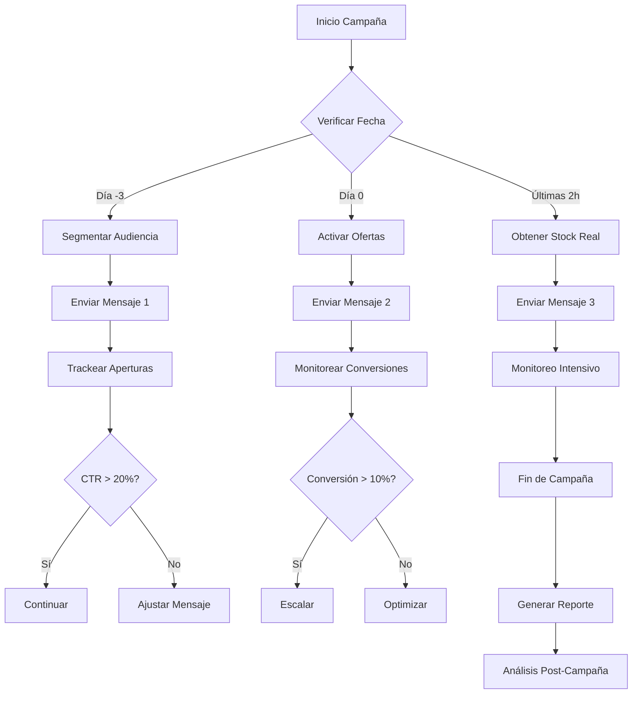

# Secuencia WhatsApp - Buen Fin 2024
## Guía Completa de Implementación

---

## 📑 Tabla de Contenidos

### Sección 1: Fundamentos
- [Configuración General](#-configuración-general)
- [Mensaje 1: Día -3 (Pre-lanzamiento)](#-mensaje-1-día--3-pre-lanzamiento)
- [Mensaje 2: Día 0 (Lanzamiento)](#-mensaje-2-día-0-lanzamiento)
- [Mensaje 3: Últimas 2 horas (Cierre)](#-mensaje-3-últimas-2-horas-cierre)

### Sección 2: Implementación Técnica
- [Implementación Técnica Avanzada](#-implementación-técnica-avanzada)
- [Scripts de Automatización](#2-script-python-para-automatización-whatsapp)
- [Integración WhatsApp Business API](#4-integración-whatsapp-business-api-meta)
- [Automatización con Cron Jobs](#6-automatización-con-cron-jobs)

### Sección 3: Optimización y Analytics
- [Métricas y Analytics Avanzados](#-métricas-y-analytics-avanzados)
- [Optimización de Conversión](#-optimización-de-conversión-avanzada)
- [A/B Testing Avanzado](#-variaciones-y-ab-testing-avanzado)
- [Calculadora de ROI](#-calculadora-de-roi-y-proyecciones)

### Sección 4: Estrategias Avanzadas
- [Adaptación por Industria](#-adaptación-por-industria)
- [Estrategias de Remarketing](#-estrategias-de-remarketing-avanzadas)
- [Segmentación Avanzada](#-segmentación-avanzada-de-audiencia)
- [Integración Multi-Canal](#-integración-multi-canal)

### Sección 5: Soporte y Operaciones
- [Scripts de Respuesta a Objeciones](#-scripts-de-respuesta-a-objeciones-comunes)
- [Scripts de Soporte al Cliente](#-scripts-de-soporte-al-cliente)
- [Troubleshooting](#-troubleshooting-y-solución-de-problemas)
- [Mensajes Post-Compra](#-bonus-mensajes-de-seguimiento-post-compra)

### Sección 6: Recursos y Herramientas
- [Guía de Diseño Visual](#-guía-de-diseño-visual-para-landing-pages)
- [Biblioteca de Recursos Visuales](#-biblioteca-de-recursos-visuales)
- [Herramientas Adicionales](#️-herramientas-adicionales)
- [Plantillas y Templates](#-plantillas-descargables)

### Sección 7: Compliance y Seguridad
- [Compliance y Mejores Prácticas](#️-compliance-y-mejores-prácticas)
- [Seguridad y Privacidad](#-seguridad-y-privacidad)
- [Validación de Compliance](#script-de-validación-de-compliance)

### Sección 8: Análisis y Mejora Continua
- [Análisis de Competencia](#-análisis-de-competencia)
- [Casos de Éxito](#-casos-de-éxito-y-lecciones-aprendidas)
- [Métricas de Éxito por Objetivo](#-métricas-de-éxito-por-objetivo)
- [Checklist de Implementación](#-checklist-de-implementación-completo)

### Sección 9: Guías Rápidas
- [Quick Start Guide](#-quick-start-guide-guía-rápida)
- [Implementación en 24 Horas](#para-implementar-en-24-horas)
- [Checklist Mínimo Viable](#checklist-mínimo-viable)

---

## 📱 Configuración General

**Campaña:** Buen Fin 2024  
**Plataforma:** WhatsApp Business API / WhatsApp Business  
**Objetivo:** Conversión con urgencia y escasez  
**Duración:** 3 días + últimas 2 horas  
**Formato:** Mensajes de texto con enlaces + Botones interactivos (opcional)

### ⚠️ Límites y Mejores Prácticas WhatsApp

- **Límite de caracteres:** 4,096 caracteres por mensaje (recomendado: <1,000)
- **Horarios óptimos:** 9:00 AM - 12:00 PM y 6:00 PM - 9:00 PM
- **Tasa de apertura esperada:** 90-98% (WhatsApp tiene alta apertura)
- **Tiempo de lectura:** <30 segundos por mensaje
- **Formato:** Usar negritas `*texto*`, cursivas `_texto_`, y código ````texto```` para énfasis

---

## 📨 MENSAJE 1: Día -3 (Pre-lanzamiento)

**Cuándo enviar:** 3 días antes del inicio del Buen Fin  
**Hora sugerida:** 10:00 AM (mejor día: Martes o Miércoles)  
**Objetivo:** Generar expectativa, guardar cupón, crear FOMO  
**Tasa de apertura esperada:** 95%+  
**CTR esperado:** 15-25%

### 🎯 Versión Principal (Recomendada):

```
*🎉 ¡Se viene el Buen Fin!*

Hola [NOMBRE] 👋

Te tengo algo *exclusivo* que no querrás perderte:

*🎫 CUPÓN: BF25*

⏰ El Buen Fin comienza en:
*[CONTADOR: 3 días 0 horas]*

*🔥 Prepárate para:*
✅ *25% OFF* en toda la tienda
✅ *12 MSI* sin intereses
✅ *Envío GRATIS*
✅ Ofertas exclusivas solo para ti

👉 *Asegura tu cupón ahora:*
[ENLACE_DIRECTO]

💾 *Guarda este mensaje* - el cupón es válido solo durante el Buen Fin.

*No te lo pierdas.* ⚡
```

### 🎯 Versión Alternativa A (Más Urgente):

```
*🚨 ALERTA: Buen Fin en 3 días*

[NOMBRE], esto es *solo para ti*:

*🎫 Tu cupón exclusivo: BF25*

*⏰ Cuenta regresiva:*
[CONTADOR: 3 días]

*Lo que te espera:*
💰 25% de descuento
💳 12 meses sin intereses
📦 Envío gratis

👉 *Reserva tu cupón:*
[ENLACE_DIRECTO]

*Solo para los primeros 500.* 
¿Serás uno de ellos? 🔥
```

### 🎯 Versión Alternativa B (Enfoque en Valor):

```
*Hola [NOMBRE]! 👋*

El *Buen Fin* está a punto de comenzar y queremos que *tú* tengas acceso anticipado.

*🎫 Tu código de acceso: BF25*

*⏰ Comienza en:*
[CONTADOR: 3 días]

*Con este cupón obtienes:*
✨ 25% de descuento adicional
✨ 12 MSI sin intereses
✨ Envío gratis en todas tus compras

👉 *Activa tu cupón:*
[ENLACE_DIRECTO]

*Este cupón es personal e intransferible.*
Guárdalo bien. 💎
```

### 📊 Variables Dinámicas a Configurar:

- `[NOMBRE]`: Nombre del cliente (personalización aumenta conversión 26%)
- `[CONTADOR_REGRESIVO]`: JavaScript countdown timer o texto dinámico
- `[ENLACE_DIRECTO]`: `https://tu-dominio.com/buen-fin?utm_source=whatsapp&utm_medium=prelaunch&utm_campaign=bf25&cupon=BF25&nombre=[NOMBRE]`

### 🎨 Elementos Adicionales:

- **Botones Interactivos (WhatsApp Business API):**
  - Botón 1: "Guardar Cupón" → [ENLACE_DIRECTO]
  - Botón 2: "Ver Ofertas" → [ENLACE_CATALOGO]
  - Botón 3: "Más Info" → [ENLACE_FAQ]

- **Imagen/Banner:**
  - Dimensiones: 800x418px (ratio 1.91:1)
  - Incluir: Logo, código BF25 grande, "Buen Fin 2024"
  - Texto sobre imagen: "Cupón Exclusivo - Válido 3 días"

- **Formato WhatsApp:**
  - Usar negritas `*texto*` para destacar
  - Emojis estratégicos (máximo 1 cada 2 líneas)
  - Espaciado claro entre secciones

### 🧠 Psicología del Mensaje:

- **FOMO (Fear of Missing Out):** "Solo para los primeros 500"
- **Exclusividad:** "Cupón personal e intransferible"
- **Anticipación:** Contador regresivo crea expectativa
- **Valor percibido:** Lista de beneficios claros

---

## 📨 MENSAJE 2: Día 0 (Lanzamiento)

**Cuándo enviar:** Primer día del Buen Fin  
**Hora sugerida:** 8:00 AM (mejor día: Viernes)  
**Objetivo:** Activar compra inmediata, crear urgencia  
**Tasa de apertura esperada:** 98%+  
**CTR esperado:** 25-35%  
**Conversión esperada:** 8-15%

### 🎯 Versión Principal (Recomendada):

```
*🚀 ¡YA EMPEZÓ EL BUEN FIN!*

[NOMBRE], *¡es momento de comprar!*

*🔥 OFERTA ACTIVA AHORA:*
💰 *25% OFF* en toda la tienda
💳 *12 MSI* sin intereses
📦 *Envío GRATIS*

⏰ *Termina en:*
*[CONTADOR: 2 días 23 horas 59 minutos]*

🎫 *Usa tu cupón: BF25*

👉 *Compra ahora:*
[ENLACE_DIRECTO]

⚡ *Stock limitado.* 
*¡No esperes más!*
```

### 🎯 Versión Alternativa A (Máxima Urgencia):

```
*🔥 EL BUEN FIN COMENZÓ*

[NOMBRE], *¡no te quedes fuera!*

*OFERTAS EXCLUSIVAS:*
✅ 25% de descuento
✅ 12 meses sin intereses
✅ Envío gratis

⏰ *Solo quedan:*
*[CONTADOR: 72 horas]*

🎫 *Cupón: BF25*

👉 *Comprar YA:*
[ENLACE_DIRECTO]

*⚡ Las mejores ofertas se agotan rápido.*
*Actúa ahora.* 🚨
```

### 🎯 Versión Alternativa B (Enfoque Social Proof):

```
*🎉 ¡El Buen Fin ya empezó!*

[NOMBRE], más de *[X] personas* ya están comprando.

*🔥 Tu oferta exclusiva:*
💰 25% OFF
💳 12 MSI
📦 Envío gratis

⏰ *Disponible solo:*
*[CONTADOR: 2 días 23 horas]*

🎫 *Cupón: BF25*

👉 *Únete a ellos:*
[ENLACE_DIRECTO]

*No te quedes atrás.* ⚡
```

### 🎯 Versión Alternativa C (Enfoque en Ahorro):

```
*💰 ¡Ahorra 25% HOY!*

[NOMBRE], el *Buen Fin* ya comenzó y puedes ahorrar *miles de pesos*.

*🔥 Tu oferta:*
✅ *25% OFF* - Ahorra hasta $[X]
✅ *12 MSI* - Paga desde $[Y]/mes
✅ *Envío gratis* - Ahorra $[Z]

⏰ *Válido solo:*
*[CONTADOR: 72 horas]*

🎫 *Cupón: BF25*

👉 *Calcula tu ahorro:*
[ENLACE_DIRECTO]

*Cada minuto cuenta.* ⏱️
```

### 📊 Variables Dinámicas a Configurar:

- `[NOMBRE]`: Nombre del cliente
- `[CONTADOR_REGRESIVO]`: Countdown dinámico de 72 horas
- `[X]`: Número de compradores (social proof dinámico)
- `[Y]`: Precio mensual calculado
- `[Z]`: Costo de envío ahorrado
- `[ENLACE_DIRECTO]`: `https://tu-dominio.com/buen-fin?utm_source=whatsapp&utm_medium=launch&utm_campaign=bf25&cupon=BF25&nombre=[NOMBRE]`

### 🎨 Elementos Adicionales:

- **Botones Interactivos:**
  - Botón 1: "Comprar Ahora" → [ENLACE_DIRECTO]
  - Botón 2: "Ver Catálogo" → [ENLACE_CATALOGO]
  - Botón 3: "Solo Hoy" → [ENLACE_OFERTAS_DIA]

- **Imagen/Banner:**
  - Dimensiones: 800x418px
  - Incluir: Productos destacados, badges "25% OFF", "12 MSI"
  - Texto: "Buen Fin 2024 - Ofertas Activas"

- **Video (Opcional):**
  - 15-30 segundos mostrando productos
  - Overlay con "25% OFF" y contador regresivo
  - CTA final: "Compra Ahora"

### 🧠 Psicología del Mensaje:

- **Urgencia temporal:** Contador regresivo visible
- **Escasez:** "Stock limitado"
- **Social proof:** "X personas ya compraron"
- **Valor tangible:** Mostrar ahorro en pesos
- **FOMO:** "No te quedes fuera"

---

## 📨 MENSAJE 3: Últimas 2 horas (Cierre)

**Cuándo enviar:** 2 horas antes del cierre del Buen Fin  
**Hora sugerida:** 2 horas antes del cierre (ej: 10:00 PM si cierra a medianoche)  
**Objetivo:** Crear urgencia máxima con escasez, cerrar ventas pendientes  
**Tasa de apertura esperada:** 99%+  
**CTR esperado:** 30-45%  
**Conversión esperada:** 15-25% (última oportunidad)

### 🎯 Versión Principal (Recomendada):

```
*⏰ ÚLTIMA OPORTUNIDAD*

[NOMBRE], *¡esto es real!*

🚨 *Solo quedan [STOCK] piezas disponibles*

⏱️ *El Buen Fin termina en:*
*[CONTADOR: 1 hora 59 minutos 59 segundos]*

*🔥 Aún puedes obtener:*
✅ *25% OFF*
✅ *12 MSI* sin intereses
✅ *Cupón: BF25*

👉 *Última compra:*
[ENLACE_DIRECTO]

*⚠️ Cuando se acaben, se acaban.*
*¡No te quedes sin la tuya!* 🚨
```

### 🎯 Versión Alternativa A (Máxima Escasez):

```
*🚨 ALERTA FINAL*

[NOMBRE], *solo quedan [STOCK] unidades.*

*⏰ Tiempo restante:*
*[CONTADOR: 1 hora 59 minutos]*

*🔥 Tu última chance:*
💰 25% OFF
💳 12 MSI
🎫 Cupón: BF25

👉 *Compra ANTES de que termine:*
[ENLACE_DIRECTO]

*Después de esto, los precios vuelven a la normalidad.*
*Es ahora o nunca.* ⚡
```

### 🎯 Versión Alternativa B (Enfoque en Pérdida):

```
*⏰ SE ACABA EL TIEMPO*

[NOMBRE], *estás a punto de perder:*

❌ 25% de descuento
❌ 12 MSI sin intereses
❌ Envío gratis

*🚨 Solo [STOCK] disponibles*
*⏱️ Termina en: [CONTADOR: 1h 59m]*

🎫 *Última oportunidad con cupón: BF25*

👉 *No lo dejes pasar:*
[ENLACE_DIRECTO]

*Esta oferta NO se repetirá.*
*Actúa ahora.* 🔥
```

### 🎯 Versión Alternativa C (Urgencia + Beneficio):

```
*🔥 ÚLTIMAS 2 HORAS*

[NOMBRE], *el Buen Fin está por terminar.*

*📊 Lo que perderás si no actúas:*
💸 $[X] de ahorro
💳 12 meses sin intereses
📦 Envío gratis

*🚨 Solo [STOCK] piezas restantes*
*⏰ [CONTADOR: 1h 59m 59s]*

🎫 *Cupón final: BF25*

👉 *Asegura tu compra:*
[ENLACE_DIRECTO]

*No dejes que se te escape.*
*¡Es tu última oportunidad!* ⚡
```

### 📊 Variables Dinámicas a Configurar:

- `[NOMBRE]`: Nombre del cliente
- `[STOCK]`: Stock real disponible (actualizar dinámicamente)
- `[CONTADOR_REGRESIVO]`: Countdown exacto de 2 horas con segundos
- `[X]`: Ahorro máximo en pesos
- `[ENLACE_DIRECTO]`: `https://tu-dominio.com/buen-fin?utm_source=whatsapp&utm_medium=lastchance&utm_campaign=bf25&cupon=BF25&stock=[STOCK]&nombre=[NOMBRE]`

### 🎨 Elementos Adicionales:

- **Botones Interactivos:**
  - Botón 1: "Última Compra" → [ENLACE_DIRECTO]
  - Botón 2: "Ver Stock" → [ENLACE_STOCK]
  - Botón 3: "Solo 2h" → [ENLACE_DIRECTO]

- **Imagen/Banner:**
  - Dimensiones: 800x418px
  - Incluir: Contador de stock grande, reloj, "Últimas 2 horas"
  - Texto: "[STOCK] disponibles - Termina en [CONTADOR]"

- **GIF Animado (Opcional):**
  - Reloj contando regresivamente
  - Número de stock disminuyendo
  - Efecto de "pulso" para urgencia

### 🧠 Psicología del Mensaje:

- **Escasez extrema:** Stock limitado visible
- **Urgencia temporal:** Contador con segundos
- **Miedo a la pérdida:** "Estás a punto de perder"
- **Última oportunidad:** "Es ahora o nunca"
- **FOMO máximo:** "No se repetirá"

---

## 🔧 Implementación Técnica Avanzada

### 1. Contador Regresivo (HTML/JavaScript Mejorado)

**Versión básica para landing page:**

```html
<!DOCTYPE html>
<html>
<head>
    <style>
        .countdown {
            font-size: 2em;
            font-weight: bold;
            text-align: center;
            padding: 20px;
            background: linear-gradient(135deg, #667eea 0%, #764ba2 100%);
            color: white;
            border-radius: 10px;
            margin: 20px 0;
        }
        .countdown-item {
            display: inline-block;
            margin: 0 10px;
            padding: 10px 15px;
            background: rgba(255,255,255,0.2);
            border-radius: 5px;
        }
        .countdown-label {
            font-size: 0.4em;
            display: block;
            margin-top: 5px;
        }
    </style>
</head>
<body>
    <div id="countdown" class="countdown">
        <div class="countdown-item">
            <span id="days">00</span>
            <span class="countdown-label">Días</span>
        </div>
        <div class="countdown-item">
            <span id="hours">00</span>
            <span class="countdown-label">Horas</span>
        </div>
        <div class="countdown-item">
            <span id="minutes">00</span>
            <span class="countdown-label">Minutos</span>
        </div>
        <div class="countdown-item">
            <span id="seconds">00</span>
            <span class="countdown-label">Segundos</span>
        </div>
    </div>

    <script>
        function formatTime(value) {
            return value < 10 ? '0' + value : value;
        }

        function startCountdown(targetDate, elementId) {
            const countdown = setInterval(function() {
                const now = new Date().getTime();
                const distance = targetDate - now;
                
                if (distance < 0) {
                    clearInterval(countdown);
                    document.getElementById(elementId).innerHTML = 
                        '<div style="text-align:center; padding:20px;">⏰ OFERTA FINALIZADA</div>';
                    return;
                }
                
                const days = Math.floor(distance / (1000 * 60 * 60 * 24));
                const hours = Math.floor((distance % (1000 * 60 * 60 * 24)) / (1000 * 60 * 60));
                const minutes = Math.floor((distance % (1000 * 60 * 60)) / (1000 * 60));
                const seconds = Math.floor((distance % (1000 * 60)) / 1000);
                
                document.getElementById("days").innerHTML = formatTime(days);
                document.getElementById("hours").innerHTML = formatTime(hours);
                document.getElementById("minutes").innerHTML = formatTime(minutes);
                document.getElementById("seconds").innerHTML = formatTime(seconds);
            }, 1000);
        }

        // Configurar fechas
        const buenFinStart = new Date("2024-11-15 00:00:00").getTime();
        const buenFinEnd = new Date("2024-11-18 23:59:59").getTime();
        const lastChance = new Date("2024-11-18 22:00:00").getTime();

        // Iniciar contador según la fecha actual
        const now = new Date().getTime();
        if (now < buenFinStart) {
            startCountdown(buenFinStart, "countdown");
        } else if (now < lastChance) {
            startCountdown(buenFinEnd, "countdown");
        } else if (now < buenFinEnd) {
            startCountdown(buenFinEnd, "countdown");
        }
    </script>
</body>
</html>
```

**Versión para WhatsApp (texto dinámico):**

```javascript
// Función para generar texto de countdown para WhatsApp
function getCountdownText(targetDate) {
    const now = new Date().getTime();
    const distance = targetDate - now;
    
    if (distance < 0) return "EXPIRADO";
    
    const days = Math.floor(distance / (1000 * 60 * 60 * 24));
    const hours = Math.floor((distance % (1000 * 60 * 60 * 24)) / (1000 * 60 * 60));
    const minutes = Math.floor((distance % (1000 * 60 * 60)) / (1000 * 60));
    const seconds = Math.floor((distance % (1000 * 60)) / 1000);
    
    if (days > 0) {
        return `${days} día${days > 1 ? 's' : ''} ${hours} hora${hours > 1 ? 's' : ''}`;
    } else if (hours > 0) {
        return `${hours} hora${hours > 1 ? 's' : ''} ${minutes} minuto${minutes > 1 ? 's' : ''}`;
    } else {
        return `${minutes} minuto${minutes > 1 ? 's' : ''} ${seconds} segundo${seconds > 1 ? 's' : ''}`;
    }
}
```

### 2. Script Python para Automatización WhatsApp

```python
"""
Script de automatización para envío de mensajes WhatsApp Buen Fin
Requiere: twilio, python-dotenv, requests
"""

import os
import json
from datetime import datetime, timedelta
from twilio.rest import Client
from dotenv import load_dotenv
import requests

load_dotenv()

class BuenFinWhatsApp:
    def __init__(self):
        self.account_sid = os.getenv('TWILIO_ACCOUNT_SID')
        self.auth_token = os.getenv('TWILIO_AUTH_TOKEN')
        self.whatsapp_from = os.getenv('WHATSAPP_FROM')  # formato: whatsapp:+14155238886
        self.client = Client(self.account_sid, self.auth_token)
        
        # Fechas del Buen Fin
        self.buen_fin_start = datetime(2024, 11, 15, 0, 0, 0)
        self.buen_fin_end = datetime(2024, 11, 18, 23, 59, 59)
        self.last_chance = self.buen_fin_end - timedelta(hours=2)
        
    def get_countdown_text(self, target_date):
        """Genera texto de countdown para WhatsApp"""
        now = datetime.now()
        distance = target_date - now
        
        if distance.total_seconds() < 0:
            return "EXPIRADO"
        
        days = distance.days
        hours, remainder = divmod(distance.seconds, 3600)
        minutes, seconds = divmod(remainder, 60)
        
        if days > 0:
            return f"{days} día{'s' if days > 1 else ''} {hours} hora{'s' if hours > 1 else ''}"
        elif hours > 0:
            return f"{hours} hora{'s' if hours > 1 else ''} {minutes} minuto{'s' if minutes > 1 else ''}"
        else:
            return f"{minutes} minuto{'s' if minutes > 1 else ''} {seconds} segundo{'s' if seconds > 1 else ''}"
    
    def get_stock_count(self):
        """Obtiene stock disponible desde API"""
        try:
            response = requests.get(os.getenv('STOCK_API_URL'))
            data = response.json()
            return data.get('available_stock', 17)
        except:
            return 17  # Fallback
    
    def format_message_1(self, nombre, enlace):
        """Mensaje Día -3"""
        countdown = self.get_countdown_text(self.buen_fin_start)
        return f"""*🎉 ¡Se viene el Buen Fin!*

Hola {nombre} 👋

Te tengo algo *exclusivo* que no querrás perderte:

*🎫 CUPÓN: BF25*

⏰ El Buen Fin comienza en:
*{countdown}*

*🔥 Prepárate para:*
✅ *25% OFF* en toda la tienda
✅ *12 MSI* sin intereses
✅ *Envío GRATIS*
✅ Ofertas exclusivas solo para ti

👉 *Asegura tu cupón ahora:*
{enlace}

💾 *Guarda este mensaje* - el cupón es válido solo durante el Buen Fin.

*No te lo pierdas.* ⚡"""
    
    def format_message_2(self, nombre, enlace):
        """Mensaje Día 0"""
        countdown = self.get_countdown_text(self.buen_fin_end)
        return f"""*🚀 ¡YA EMPEZÓ EL BUEN FIN!*

{nombre}, *¡es momento de comprar!*

*🔥 OFERTA ACTIVA AHORA:*
💰 *25% OFF* en toda la tienda
💳 *12 MSI* sin intereses
📦 *Envío GRATIS*

⏰ *Termina en:*
*{countdown}*

🎫 *Usa tu cupón: BF25*

👉 *Compra ahora:*
{enlace}

⚡ *Stock limitado.* 
*¡No esperes más!*"""
    
    def format_message_3(self, nombre, enlace):
        """Mensaje Últimas 2h"""
        countdown = self.get_countdown_text(self.buen_fin_end)
        stock = self.get_stock_count()
        return f"""*⏰ ÚLTIMA OPORTUNIDAD*

{nombre}, *¡esto es real!*

🚨 *Solo quedan {stock} piezas disponibles*

⏱️ *El Buen Fin termina en:*
*{countdown}*

*🔥 Aún puedes obtener:*
✅ *25% OFF*
✅ *12 MSI* sin intereses
✅ *Cupón: BF25*

👉 *Última compra:*
{enlace}

*⚠️ Cuando se acaben, se acaban.*
*¡No te quedes sin la tuya!* 🚨"""
    
    def send_message(self, to_number, message_body, media_url=None):
        """Envía mensaje WhatsApp vía Twilio"""
        try:
            message = self.client.messages.create(
                from_=self.whatsapp_from,
                body=message_body,
                to=f'whatsapp:{to_number}',
                media_url=[media_url] if media_url else None
            )
            return {'success': True, 'message_sid': message.sid}
        except Exception as e:
            return {'success': False, 'error': str(e)}
    
    def send_bulk_messages(self, contacts, message_type):
        """Envía mensajes masivos"""
        results = []
        for contact in contacts:
            nombre = contact.get('nombre', 'Cliente')
            numero = contact.get('numero')
            enlace = contact.get('enlace', os.getenv('DEFAULT_LINK'))
            
            if message_type == 1:
                message = self.format_message_1(nombre, enlace)
            elif message_type == 2:
                message = self.format_message_2(nombre, enlace)
            elif message_type == 3:
                message = self.format_message_3(nombre, enlace)
            else:
                continue
            
            result = self.send_message(numero, message)
            results.append({
                'contact': nombre,
                'numero': numero,
                'result': result
            })
            
            # Rate limiting: esperar 1 segundo entre mensajes
            import time
            time.sleep(1)
        
        return results

# Uso del script
if __name__ == "__main__":
    bf = BuenFinWhatsApp()
    
    # Ejemplo: enviar mensaje de prueba
    test_contact = {
        'nombre': 'Juan',
        'numero': '+521234567890',
        'enlace': 'https://tu-dominio.com/buen-fin?cupon=BF25'
    }
    
    # Determinar qué mensaje enviar según la fecha
    now = datetime.now()
    if now < bf.buen_fin_start - timedelta(days=3):
        print("Aún no es momento de enviar mensajes")
    elif now < bf.buen_fin_start:
        # Mensaje 1
        message = bf.format_message_1(test_contact['nombre'], test_contact['enlace'])
        print(message)
    elif now < bf.last_chance:
        # Mensaje 2
        message = bf.format_message_2(test_contact['nombre'], test_contact['enlace'])
        print(message)
    elif now < bf.buen_fin_end:
        # Mensaje 3
        message = bf.format_message_3(test_contact['nombre'], test_contact['enlace'])
        print(message)
    else:
        print("El Buen Fin ya terminó")
```

### 3. Enlaces Directos con UTM y Tracking Avanzado

**Estructura base mejorada:**

```python
def generate_tracking_link(base_url, params):
    """Genera enlace con tracking completo"""
    utm_params = {
        'utm_source': 'whatsapp',
        'utm_medium': params.get('medium', 'organic'),
        'utm_campaign': 'bf25',
        'utm_content': params.get('content', ''),
        'cupon': 'BF25',
        'nombre': params.get('nombre', ''),
        'stock': params.get('stock', ''),
        'timestamp': datetime.now().isoformat()
    }
    
    # Agregar parámetros personalizados
    query_string = '&'.join([f"{k}={v}" for k, v in utm_params.items() if v])
    return f"{base_url}?{query_string}"

# Ejemplos de uso
link_prelaunch = generate_tracking_link(
    'https://tu-dominio.com/buen-fin',
    {'medium': 'prelaunch', 'nombre': 'Juan', 'content': 'mensaje-1'}
)

link_launch = generate_tracking_link(
    'https://tu-dominio.com/buen-fin',
    {'medium': 'launch', 'nombre': 'Juan', 'content': 'mensaje-2'}
)

link_lastchance = generate_tracking_link(
    'https://tu-dominio.com/buen-fin',
    {'medium': 'lastchance', 'nombre': 'Juan', 'stock': '17', 'content': 'mensaje-3'}
)
```

### 4. Integración WhatsApp Business API (Meta)

**Usando la API oficial de Meta:**

```python
import requests

class MetaWhatsAppAPI:
    def __init__(self):
        self.access_token = os.getenv('META_ACCESS_TOKEN')
        self.phone_number_id = os.getenv('META_PHONE_NUMBER_ID')
        self.api_version = 'v18.0'
        self.base_url = f'https://graph.facebook.com/{self.api_version}/{self.phone_number_id}'
    
    def send_text_message(self, to_number, message_text):
        """Envía mensaje de texto"""
        url = f"{self.base_url}/messages"
        headers = {
            'Authorization': f'Bearer {self.access_token}',
            'Content-Type': 'application/json'
        }
        payload = {
            'messaging_product': 'whatsapp',
            'to': to_number,
            'type': 'text',
            'text': {'body': message_text}
        }
        
        response = requests.post(url, headers=headers, json=payload)
        return response.json()
    
    def send_template_message(self, to_number, template_name, language_code='es_MX', parameters=None):
        """Envía mensaje de plantilla (requiere aprobación de Meta)"""
        url = f"{self.base_url}/messages"
        headers = {
            'Authorization': f'Bearer {self.access_token}',
            'Content-Type': 'application/json'
        }
        
        template_params = []
        if parameters:
            for param in parameters:
                template_params.append({'type': 'text', 'text': param})
        
        payload = {
            'messaging_product': 'whatsapp',
            'to': to_number,
            'type': 'template',
            'template': {
                'name': template_name,
                'language': {'code': language_code},
                'components': [
                    {
                        'type': 'body',
                        'parameters': template_params
                    }
                ] if template_params else []
            }
        }
        
        response = requests.post(url, headers=headers, json=payload)
        return response.json()
    
    def send_interactive_message(self, to_number, message_text, buttons):
        """Envía mensaje con botones interactivos"""
        url = f"{self.base_url}/messages"
        headers = {
            'Authorization': f'Bearer {self.access_token}',
            'Content-Type': 'application/json'
        }
        
        button_components = []
        for i, button in enumerate(buttons[:3]):  # Máximo 3 botones
            button_components.append({
                'type': 'reply',
                'reply': {
                    'id': f'btn_{i+1}',
                    'title': button['title']
                }
            })
        
        payload = {
            'messaging_product': 'whatsapp',
            'to': to_number,
            'type': 'interactive',
            'interactive': {
                'type': 'button',
                'body': {'text': message_text},
                'action': {
                    'buttons': button_components
                }
            }
        }
        
        response = requests.post(url, headers=headers, json=payload)
        return response.json()
```

### 5. Configuración de Variables de Entorno (.env)

```bash
# WhatsApp Twilio
TWILIO_ACCOUNT_SID=your_account_sid
TWILIO_AUTH_TOKEN=your_auth_token
WHATSAPP_FROM=whatsapp:+14155238886

# WhatsApp Meta API
META_ACCESS_TOKEN=your_meta_access_token
META_PHONE_NUMBER_ID=your_phone_number_id
META_APP_ID=your_app_id

# URLs
DEFAULT_LINK=https://tu-dominio.com/buen-fin
STOCK_API_URL=https://api.tu-dominio.com/stock

# Fechas Buen Fin
BUEN_FIN_START=2024-11-15T00:00:00
BUEN_FIN_END=2024-11-18T23:59:59
```

### 6. Automatización con Cron Jobs

**Script para programar envíos automáticos:**

```bash
#!/bin/bash
# buen_fin_scheduler.sh

# Día -3: Enviar mensaje 1
# Ejecutar: 0 10 * * * /path/to/buen_fin_scheduler.sh message1
# (Todos los días a las 10 AM, pero solo enviará si es día -3)

python3 /path/to/buen_fin_whatsapp.py --message-type 1

# Día 0: Enviar mensaje 2
# Ejecutar: 0 8 15 11 * /path/to/buen_fin_scheduler.sh message2
# (15 de noviembre a las 8 AM)

python3 /path/to/buen_fin_whatsapp.py --message-type 2

# Últimas 2h: Enviar mensaje 3
# Ejecutar: 0 22 18 11 * /path/to/buen_fin_scheduler.sh message3
# (18 de noviembre a las 10 PM)

python3 /path/to/buen_fin_whatsapp.py --message-type 3
```

**O usando Python con schedule:**

```python
import schedule
import time
from datetime import datetime

def send_message_1():
    """Envía mensaje 1 (Día -3)"""
    bf = BuenFinWhatsApp()
    # Cargar contactos desde CSV o base de datos
    contacts = load_contacts()
    results = bf.send_bulk_messages(contacts, message_type=1)
    log_results(results)

def send_message_2():
    """Envía mensaje 2 (Día 0)"""
    bf = BuenFinWhatsApp()
    contacts = load_contacts()
    results = bf.send_bulk_messages(contacts, message_type=2)
    log_results(results)

def send_message_3():
    """Envía mensaje 3 (Últimas 2h)"""
    bf = BuenFinWhatsApp()
    contacts = load_contacts()
    results = bf.send_bulk_messages(contacts, message_type=3)
    log_results(results)

# Programar envíos
# Mensaje 1: 3 días antes a las 10 AM
schedule.every().day.at("10:00").do(check_and_send_message_1)

# Mensaje 2: Día de inicio a las 8 AM
schedule.every().day.at("08:00").do(check_and_send_message_2)

# Mensaje 3: 2 horas antes del cierre
schedule.every().day.at("22:00").do(check_and_send_message_3)

while True:
    schedule.run_pending()
    time.sleep(60)
```

---

## 📊 Métricas y Analytics Avanzados

### KPIs por Mensaje (Benchmarks):

**Mensaje 1 (Día -3):**
- **Tasa de apertura esperada:** 95-98%
- **CTR esperado:** 15-25%
- **Cupones guardados:** 40-60% de clicks
- **Tasa de conversión:** 2-5% (pre-compra)
- **Tiempo promedio hasta guardar cupón:** <2 minutos

**Mensaje 2 (Día 0):**
- **Tasa de apertura esperada:** 98-99%
- **CTR esperado:** 25-35%
- **Tasa de conversión:** 8-15%
- **Ingresos generados:** Calcular por segmento
- **Tiempo promedio hasta compra:** 15-45 minutos
- **Ticket promedio:** Comparar vs. normal

**Mensaje 3 (Últimas 2h):**
- **Tasa de apertura esperada:** 99%+
- **CTR esperado:** 30-45%
- **Tasa de conversión:** 15-25% (última oportunidad)
- **Stock vendido:** % del stock disponible
- **Tiempo promedio hasta compra:** <10 minutos
- **Tasa de respuesta urgente:** >50% en primera hora

### Dashboard Completo Sugerido:

**Métricas de Envío:**
- Total de mensajes enviados (por mensaje)
- Mensajes entregados exitosamente
- Tasa de entrega (%)
- Mensajes fallidos y razones

**Métricas de Engagement:**
- Tasa de apertura promedio (por mensaje)
- CTR (Click Through Rate) por mensaje
- Tiempo promedio de lectura
- Cupones activados vs. guardados

**Métricas de Conversión:**
- Conversión total de la campaña
- Conversión por mensaje
- Conversión por segmento de audiencia
- Ticket promedio vs. normal
- Ingresos totales generados

**Métricas de ROI:**
- Costo por mensaje enviado
- Costo por conversión (CPA)
- ROI total de la campaña
- LTV (Lifetime Value) de nuevos clientes

**Métricas de Timing:**
- Hora pico de aperturas
- Hora pico de conversiones
- Tiempo desde apertura hasta compra
- Día de la semana con mejor performance

### Script de Tracking y Analytics:

```python
import json
from datetime import datetime
import requests

class BuenFinAnalytics:
    def __init__(self):
        self.events = []
    
    def track_event(self, event_type, contact_id, metadata=None):
        """Registra evento de tracking"""
        event = {
            'timestamp': datetime.now().isoformat(),
            'event_type': event_type,  # 'sent', 'delivered', 'opened', 'clicked', 'converted'
            'contact_id': contact_id,
            'metadata': metadata or {}
        }
        self.events.append(event)
        return event
    
    def calculate_metrics(self, message_type):
        """Calcula métricas para un tipo de mensaje"""
        message_events = [e for e in self.events if e['metadata'].get('message_type') == message_type]
        
        sent = len([e for e in message_events if e['event_type'] == 'sent'])
        delivered = len([e for e in message_events if e['event_type'] == 'delivered'])
        opened = len([e for e in message_events if e['event_type'] == 'opened'])
        clicked = len([e for e in message_events if e['event_type'] == 'clicked'])
        converted = len([e for e in message_events if e['event_type'] == 'converted'])
        
        return {
            'sent': sent,
            'delivery_rate': (delivered / sent * 100) if sent > 0 else 0,
            'open_rate': (opened / delivered * 100) if delivered > 0 else 0,
            'ctr': (clicked / opened * 100) if opened > 0 else 0,
            'conversion_rate': (converted / clicked * 100) if clicked > 0 else 0,
            'overall_conversion': (converted / sent * 100) if sent > 0 else 0
        }
    
    def export_to_csv(self, filename='buen_fin_analytics.csv'):
        """Exporta eventos a CSV"""
        import csv
        with open(filename, 'w', newline='') as f:
            writer = csv.DictWriter(f, fieldnames=['timestamp', 'event_type', 'contact_id', 'metadata'])
            writer.writeheader()
            for event in self.events:
                writer.writerow({
                    'timestamp': event['timestamp'],
                    'event_type': event['event_type'],
                    'contact_id': event['contact_id'],
                    'metadata': json.dumps(event['metadata'])
                })
```

### Integración con Google Analytics:

```javascript
// Tracking de eventos en landing page
function trackWhatsAppEvent(eventName, params) {
    if (typeof gtag !== 'undefined') {
        gtag('event', eventName, {
            'event_category': 'WhatsApp Buen Fin',
            'event_label': params.label || '',
            'value': params.value || 0,
            ...params
        });
    }
}

// Ejemplos de uso
trackWhatsAppEvent('whatsapp_message_opened', {
    label: 'Mensaje 1 - Día -3',
    value: 1
});

trackWhatsAppEvent('whatsapp_link_clicked', {
    label: 'Cupón BF25',
    value: 1
});

trackWhatsAppEvent('whatsapp_conversion', {
    label: 'Compra completada',
    value: 1500  // Valor de la compra
});
```

---

## ✅ Checklist de Implementación Completo

### Pre-lanzamiento (2 semanas antes):
- [ ] Configurar fechas exactas del Buen Fin
- [ ] Crear landing page con contador regresivo
- [ ] Preparar imágenes/banners para cada mensaje (3 variaciones)
- [ ] Configurar cupón BF25 en sistema de e-commerce
- [ ] Probar enlaces y tracking UTM en diferentes dispositivos
- [ ] Preparar segmentación de audiencia (activos, inactivos, VIP)
- [ ] Configurar WhatsApp Business API o herramienta de envío
- [ ] Probar envío de mensaje de prueba a números internos
- [ ] Configurar webhooks para tracking de entregas
- [ ] Preparar respuestas automáticas para consultas frecuentes
- [ ] Verificar compliance y opt-in de contactos
- [ ] Configurar sistema de monitoreo en tiempo real
- [ ] Preparar equipo de soporte para picos de consultas
- [ ] Crear backup de mensajes alternativos
- [ ] Documentar proceso completo

### Día -3 (Pre-lanzamiento):
- [ ] Verificar que todos los sistemas están operativos
- [ ] Enviar Mensaje 1 a lista segmentada (empezar con 10% como prueba)
- [ ] Monitorear tasa de apertura en primera hora
- [ ] Verificar que cupones se están guardando correctamente
- [ ] Revisar tasa de errores de entrega
- [ ] Ajustar timing si es necesario
- [ ] Enviar al 100% de la audiencia si prueba es exitosa
- [ ] Documentar métricas iniciales

### Día 0 (Lanzamiento):
- [ ] Verificar que ofertas están activas en sistema
- [ ] Enviar Mensaje 2 al inicio del Buen Fin (8:00 AM)
- [ ] Activar monitoreo en tiempo real
- [ ] Monitorear conversiones cada 30 minutos
- [ ] Ajustar stock si es necesario
- [ ] Responder consultas urgentes en <5 minutos
- [ ] Verificar que cupón BF25 funciona correctamente
- [ ] Monitorear carga del servidor/landing page
- [ ] Documentar picos de tráfico y conversión

### Últimas 2h (Cierre):
- [ ] Verificar stock real disponible (actualizar dinámicamente)
- [ ] Actualizar número en mensaje con stock real
- [ ] Verificar que contador regresivo es preciso
- [ ] Enviar Mensaje 3 con urgencia máxima
- [ ] Monitorear última oleada de conversiones minuto a minuto
- [ ] Tener equipo de soporte listo para consultas finales
- [ ] Preparar mensaje de cierre post-campaña

### Post-campaña (Día +1):
- [ ] Analizar métricas completas de los 3 mensajes
- [ ] Calcular ROI detallado
- [ ] Comparar performance de variaciones A/B
- [ ] Identificar mejores horarios y segmentos
- [ ] Documentar aprendizajes y mejoras
- [ ] Preparar reporte ejecutivo
- [ ] Enviar agradecimiento a clientes que compraron
- [ ] Analizar feedback y objeciones recibidas
- [ ] Planificar mejoras para próxima campaña

---

## 🎨 Variaciones y A/B Testing Avanzado

### Matriz de Testing Recomendada:

**Variación A (Urgencia Temporal):**
- Enfoque: Tiempo limitado
- Elementos: Contador regresivo prominente, "Termina en X horas"
- Mensaje clave: "Solo quedan X horas"
- **Hipótesis:** Urgencia temporal genera más conversiones inmediatas

**Variación B (Escasez de Stock):**
- Enfoque: Stock limitado
- Elementos: "Solo X disponibles", contador de stock
- Mensaje clave: "Últimas X piezas"
- **Hipótesis:** Escasez de producto genera FOMO más fuerte

**Variación C (Valor/Ahorro):**
- Enfoque: Beneficio económico
- Elementos: "Ahorra $X", cálculo de MSI, comparación de precios
- Mensaje clave: "Ahorra hasta $X con esta oferta"
- **Hipótesis:** Mostrar ahorro tangible aumenta valor percibido

**Variación D (Social Proof):**
- Enfoque: Otros comprando
- Elementos: "X personas ya compraron", testimonios
- Mensaje clave: "Únete a los X que ya aprovecharon"
- **Hipótesis:** Social proof reduce fricción de compra

### Plan de Testing:

1. **Fase 1 (Día -3):** Testear 4 variaciones con 25% de audiencia cada una
2. **Análisis:** Identificar ganadora en primeras 4 horas
3. **Fase 2:** Enviar variación ganadora al 75% restante
4. **Optimización continua:** Ajustar mensajes 2 y 3 basado en resultados

### Métricas de Comparación:

- CTR por variación
- Tasa de conversión por variación
- Tiempo hasta conversión
- Ticket promedio por variación
- Tasa de abandono de carrito

---

## 🛡️ Compliance y Mejores Prácticas

### Requisitos Legales (México):

**Opt-in Obligatorio:**
- ✅ Contactos deben haber dado consentimiento explícito
- ✅ Opción de opt-out en cada mensaje
- ✅ Guardar registro de consentimientos
- ✅ No enviar a números en lista negra (DNI)

**Información Requerida:**
- Nombre o razón social del remitente
- Información de contacto
- Opción clara de cancelar suscripción

**Horarios Permitidos:**
- Lunes a Viernes: 8:00 AM - 9:00 PM
- Sábados: 9:00 AM - 8:00 PM
- Domingos: Solo con consentimiento explícito

### Mejores Prácticas WhatsApp Business:

**Formato de Mensajes:**
- ✅ Usar negritas `*texto*` para énfasis
- ✅ Máximo 1 emoji cada 2 líneas
- ✅ Párrafos cortos (máximo 3-4 líneas)
- ✅ Incluir CTA claro y visible
- ✅ Enlace directo siempre presente

**Rate Limiting:**
- Máximo 1,000 mensajes por día (cuenta nueva)
- Máximo 10,000 mensajes por día (cuenta verificada)
- Esperar 1 segundo entre mensajes en bulk
- Usar templates aprobados para mensajes masivos

**Manejo de Errores:**
- Número inválido: Remover de lista
- Usuario bloqueó: Marcar como "no contactar"
- Mensaje no entregado: Reintentar máximo 2 veces
- Error de API: Log y notificación inmediata

### Script de Validación de Compliance:

```python
def validate_contact(contact):
    """Valida que contacto cumple con compliance"""
    checks = {
        'has_opt_in': contact.get('opt_in_date') is not None,
        'not_blocked': not contact.get('blocked', False),
        'valid_number': len(contact.get('numero', '')) >= 10,
        'not_dni': contact.get('numero') not in get_dni_list(),
        'last_contact': contact.get('last_contact_days', 999) >= 1
    }
    
    return all(checks.values()), checks

def get_dni_list():
    """Obtiene lista de números en Do Not Contact"""
    # Implementar según tu sistema
    return []
```

---

## 🔧 Troubleshooting y Solución de Problemas

### Problemas Comunes y Soluciones:

**1. Mensajes no se envían:**
- ✅ Verificar credenciales de API
- ✅ Revisar rate limits
- ✅ Verificar formato de números (debe incluir código de país)
- ✅ Comprobar que número está verificado en WhatsApp Business

**2. Baja tasa de entrega:**
- ✅ Verificar que números son válidos
- ✅ Revisar si números están bloqueados
- ✅ Comprobar que mensajes no son spam
- ✅ Verificar horarios de envío

**3. Contador regresivo no funciona:**
- ✅ Verificar zona horaria del servidor
- ✅ Comprobar que JavaScript está habilitado
- ✅ Revisar formato de fecha (ISO 8601)
- ✅ Probar en diferentes navegadores

**4. Enlaces no trackean correctamente:**
- ✅ Verificar parámetros UTM
- ✅ Comprobar que Google Analytics está configurado
- ✅ Revisar que enlaces no están acortados incorrectamente
- ✅ Verificar que parámetros se pasan correctamente

**5. Stock no se actualiza:**
- ✅ Verificar conexión a API de stock
- ✅ Revisar caché del sistema
- ✅ Comprobar que actualización es en tiempo real
- ✅ Implementar fallback si API falla

### Logs y Monitoreo:

```python
import logging

logging.basicConfig(
    level=logging.INFO,
    format='%(asctime)s - %(name)s - %(levelname)s - %(message)s',
    handlers=[
        logging.FileHandler('buen_fin.log'),
        logging.StreamHandler()
    ]
)

logger = logging.getLogger('BuenFin')

# Ejemplo de uso
try:
    result = send_message(contact)
    logger.info(f"Mensaje enviado exitosamente: {contact['numero']}")
except Exception as e:
    logger.error(f"Error enviando mensaje: {e}", exc_info=True)
```

---

## 🚀 Optimización y Mejora Continua

### Tácticas de Optimización:

**1. Segmentación Avanzada:**
- Segmentar por historial de compras
- Segmentar por valor de cliente (RFM)
- Segmentar por preferencias de producto
- Segmentar por comportamiento en sitio web

**2. Personalización Dinámica:**
- Productos recomendados basados en historial
- Descuentos personalizados por segmento
- Mensajes adaptados al idioma preferido
- Horarios de envío según zona horaria

**3. Timing Optimizado:**
- Enviar cuando cliente está más activo
- A/B test de diferentes horarios
- Considerar días de la semana
- Evitar horas de comida (1-3 PM)

**4. Mensajes Adaptativos:**
- Ajustar urgencia según tiempo restante
- Cambiar stock según disponibilidad real
- Personalizar descuentos según segmento
- Adaptar MSI según monto de compra

### Análisis Post-Campaña:

**Preguntas Clave:**
1. ¿Qué mensaje generó más conversiones?
2. ¿Qué horario tuvo mejor performance?
3. ¿Qué segmento respondió mejor?
4. ¿Qué variación de copy funcionó mejor?
5. ¿Cuál fue el tiempo promedio hasta conversión?
6. ¿Qué objeciones recibimos más?
7. ¿Qué mejoras podemos implementar?

**Plan de Acción:**
- Documentar insights clave
- Crear playbook de mejores prácticas
- Preparar templates para próximas campañas
- Implementar mejoras en sistema
- Capacitar equipo con aprendizajes

---

## 📱 Integraciones Recomendadas

### CRM Integration:
- Sincronizar contactos desde HubSpot/Salesforce
- Actualizar estado de leads automáticamente
- Crear oportunidades de venta desde clicks
- Segmentar audiencia desde datos de CRM

### E-commerce Integration:
- Sincronizar stock en tiempo real
- Aplicar cupones automáticamente
- Trackear conversiones desde WhatsApp
- Personalizar ofertas según carrito abandonado

### Analytics Integration:
- Google Analytics 4 para tracking completo
- Facebook Pixel para remarketing
- Mixpanel para análisis de comportamiento
- Hotjar para heatmaps y grabaciones

### Automation Tools:
- Zapier/Make para workflows automáticos
- ActiveCampaign para secuencias avanzadas
- Intercom para soporte en tiempo real
- Klaviyo para email + WhatsApp coordinado

---

## 📝 Notas Adicionales y Consideraciones

### Personalización:
- **Nombre del cliente:** Aumenta conversión 26% cuando se incluye
- **Productos vistos:** Recomendar productos que cliente vio aumenta relevancia
- **Historial de compras:** Ofrecer productos complementarios
- **Ubicación:** Ajustar envío gratis según zona

### Horarios:
- **Mejor día:** Martes y Miércoles para pre-lanzamiento
- **Mejor hora:** 10:00 AM y 6:00 PM tienen mayor apertura
- **Evitar:** Lunes por la mañana, Viernes por la tarde
- **Zona horaria:** Ajustar según ubicación de audiencia

### Compliance:
- ✅ **Opt-in obligatorio:** Guardar fecha y método de consentimiento
- ✅ **Opt-out fácil:** Incluir instrucciones claras en cada mensaje
- ✅ **Privacidad:** No compartir datos con terceros sin consentimiento
- ✅ **Transparencia:** Ser claro sobre frecuencia de mensajes

### Soporte:
- **Equipo listo:** Tener 2-3 personas disponibles durante campaña
- **Respuestas rápidas:** Objetivo <5 minutos en horas pico
- **Scripts preparados:** Respuestas a objeciones comunes
- **Escalación:** Proceso claro para problemas complejos

### Backup y Contingencia:
- **Mensajes alternativos:** Preparar versiones por si hay cambios
- **Sistema alternativo:** Tener backup de herramienta de envío
- **Landing page backup:** Versión simplificada si hay problemas
- **Comunicación de crisis:** Plan para comunicar problemas técnicos

### Escalabilidad:
- **Infraestructura:** Preparar servidores para picos de tráfico
- **CDN:** Usar para imágenes y assets estáticos
- **Caché:** Implementar caché para landing pages
- **Load balancing:** Para APIs y sistemas críticos

---

## 📚 Recursos Adicionales

### Documentación Oficial:
- [WhatsApp Business API Documentation](https://developers.facebook.com/docs/whatsapp)
- [Twilio WhatsApp API](https://www.twilio.com/docs/whatsapp)
- [Meta Business Suite](https://business.facebook.com/)

### Herramientas Recomendadas:
- **Envío:** Twilio, MessageBird, ChatAPI, 360dialog
- **Analytics:** Google Analytics, Mixpanel, Amplitude
- **CRM:** HubSpot, Salesforce, Pipedrive
- **Automation:** Zapier, Make, n8n

### Comunidades y Soporte:
- WhatsApp Business API Community
- Stack Overflow (tag: whatsapp-business-api)
- Reddit r/whatsappbusiness

---

**Creado:** 2024  
**Última actualización:** 2024  
**Versión:** 2.0  
**Mantenido por:** [Tu equipo]

---

## 🎯 Resumen Ejecutivo

Esta guía completa proporciona:

✅ **3 mensajes optimizados** con múltiples variaciones  
✅ **Scripts de automatización** listos para usar  
✅ **Tracking y analytics** completo  
✅ **Mejores prácticas** de compliance  
✅ **Troubleshooting** para problemas comunes  
✅ **Optimización continua** basada en datos  

**Próximos pasos:**
1. Personalizar mensajes con tu marca
2. Configurar herramientas de envío
3. Probar con audiencia pequeña
4. Escalar basado en resultados
5. Iterar y mejorar continuamente

---

## 💬 Scripts de Respuesta a Objeciones Comunes

### Objeción: "¿Es seguro comprar?"

**Respuesta:**
```
¡Por supuesto! 🔒

✅ Compra 100% segura con encriptación SSL
✅ Pago protegido con [Proveedor de pago]
✅ Garantía de devolución de 30 días
✅ Soporte disponible 24/7

Puedes ver nuestras reseñas aquí: [LINK]

¿Tienes alguna otra duda? Estoy aquí para ayudarte 😊
```

### Objeción: "¿Puedo pagar a meses sin intereses?"

**Respuesta:**
```
¡Sí! 💳

Con el cupón BF25 obtienes:
✅ 12 MSI sin intereses
✅ 25% de descuento adicional
✅ Envío gratis

Solo aplica durante el Buen Fin (hasta [FECHA]).

👉 Aplica tu cupón aquí: [LINK]

¿Necesitas ayuda con el proceso? 😊
```

### Objeción: "¿El descuento es real?"

**Respuesta:**
```
¡Absolutamente! ✅

*El 25% OFF es real y aplica sobre el precio regular.*

Compara:
💰 Precio regular: $[X]
💰 Con descuento: $[Y]
💰 Ahorras: $[Z]

Además:
✅ 12 MSI sin intereses
✅ Envío gratis

👉 Ver oferta completa: [LINK]

Esta oferta solo es válida durante el Buen Fin. ⏰
```

### Objeción: "¿Cuándo llega mi pedido?"

**Respuesta:**
```
📦 *Tiempos de entrega:*

✅ Envío estándar: 3-5 días hábiles (GRATIS)
✅ Envío express: 1-2 días hábiles (+$[X])

*Zonas de cobertura:*
- CDMX y área metropolitana
- Principales ciudades del país

👉 Rastrea tu pedido: [LINK]

¿Necesitas entrega urgente? Podemos coordinar 😊
```

### Objeción: "¿Puedo cambiar/cancelar mi pedido?"

**Respuesta:**
```
¡Claro! ✅

*Política de cambios:*
✅ Puedes cancelar hasta 24h después de comprar
✅ Cambios de talla/modelo disponibles
✅ Devolución sin costo en primeros 30 días

👉 Para cancelar: [LINK]
👉 Para cambiar: [LINK]

¿Necesitas ayuda con tu pedido? Escríbeme 😊
```

### Objeción: "¿El cupón ya no funciona?"

**Respuesta:**
```
Déjame verificar... 🔍

El cupón *BF25* es válido hasta [FECHA_HORA].

*Pasos para aplicarlo:*
1. Agrega productos al carrito
2. En checkout, ingresa: BF25
3. El descuento se aplica automáticamente

👉 Intenta de nuevo: [LINK]

Si aún no funciona, escríbeme y te ayudo personalmente 😊
```

---

## 🎨 Guía de Diseño Visual para Landing Pages

### Elementos Clave de la Landing Page:

**1. Header:**
- Logo de la marca
- Contador regresivo prominente
- Badge "Buen Fin 2024"

**2. Hero Section:**
- Título: "¡Buen Fin 2024 - 25% OFF + 12 MSI!"
- Subtítulo: "Ofertas exclusivas solo por tiempo limitado"
- CTA principal: "Aplicar Cupón BF25"
- Imagen de producto destacado

**3. Sección de Beneficios:**
```
✅ 25% de descuento en toda la tienda
✅ 12 meses sin intereses
✅ Envío gratis en compras mayores a $[X]
✅ Garantía de devolución
```

**4. Sección de Productos Destacados:**
- Grid de productos con badges "25% OFF"
- Precio tachado + precio con descuento
- Botón "Ver Oferta" en cada producto

**5. Sección de Urgencia:**
- Contador regresivo grande
- "Solo quedan X piezas disponibles"
- Testimonios de compradores recientes

**6. Footer:**
- Información de contacto
- Redes sociales
- Políticas de privacidad y términos

### Código HTML de Ejemplo:

```html
<!DOCTYPE html>
<html lang="es">
<head>
    <meta charset="UTF-8">
    <meta name="viewport" content="width=device-width, initial-scale=1.0">
    <title>Buen Fin 2024 - 25% OFF + 12 MSI</title>
    <style>
        .countdown-banner {
            background: linear-gradient(135deg, #667eea 0%, #764ba2 100%);
            color: white;
            padding: 20px;
            text-align: center;
            font-size: 1.5em;
        }
        .hero-section {
            text-align: center;
            padding: 60px 20px;
            background: #f8f9fa;
        }
        .cta-button {
            background: #28a745;
            color: white;
            padding: 15px 40px;
            border: none;
            border-radius: 5px;
            font-size: 1.2em;
            cursor: pointer;
            margin: 20px 0;
        }
        .benefits-grid {
            display: grid;
            grid-template-columns: repeat(auto-fit, minmax(250px, 1fr));
            gap: 20px;
            padding: 40px 20px;
        }
        .benefit-card {
            text-align: center;
            padding: 20px;
            border: 1px solid #ddd;
            border-radius: 10px;
        }
    </style>
</head>
<body>
    <div class="countdown-banner">
        ⏰ El Buen Fin termina en: <span id="countdown">--</span>
    </div>
    
    <section class="hero-section">
        <h1>¡Buen Fin 2024!</h1>
        <h2>25% OFF + 12 MSI Sin Intereses</h2>
        <p>Usa tu cupón exclusivo: <strong>BF25</strong></p>
        <button class="cta-button" onclick="window.location.href='#products'">
            Aplicar Cupón Ahora
        </button>
    </section>
    
    <section class="benefits-grid">
        <div class="benefit-card">
            <h3>💰 25% OFF</h3>
            <p>En toda la tienda</p>
        </div>
        <div class="benefit-card">
            <h3>💳 12 MSI</h3>
            <p>Sin intereses</p>
        </div>
        <div class="benefit-card">
            <h3>📦 Envío Gratis</h3>
            <p>En compras mayores a $500</p>
        </div>
        <div class="benefit-card">
            <h3>✅ Garantía</h3>
            <p>30 días de devolución</p>
        </div>
    </section>
    
    <script>
        // Contador regresivo (usar código de sección anterior)
    </script>
</body>
</html>
```

---

## 📞 Scripts de Soporte al Cliente

### Saludo Inicial:

```
¡Hola! 👋

Gracias por contactarnos durante el *Buen Fin 2024*.

Estoy aquí para ayudarte. ¿En qué puedo asistirte?

*Opciones rápidas:*
1️⃣ Información sobre ofertas
2️⃣ Aplicar cupón BF25
3️⃣ Consultar pedido
4️⃣ Otra consulta
```

### Consulta sobre Cupón:

```
*Información del cupón BF25:*

✅ *Descuento:* 25% OFF
✅ *MSI:* 12 meses sin intereses
✅ *Válido hasta:* [FECHA]
✅ *Aplicable en:* Toda la tienda

*Cómo usarlo:*
1. Agrega productos al carrito
2. En checkout, ingresa: BF25
3. El descuento se aplica automáticamente

👉 *Aplicar ahora:* [LINK]

¿Necesitas ayuda con algo más? 😊
```

### Consulta sobre Pedido:

```
Déjame buscar tu pedido... 🔍

*Para consultar tu pedido necesito:*
- Número de orden, o
- Email con el que compraste, o
- Número de teléfono

*Con esa información puedo darte:*
✅ Estado de tu pedido
✅ Fecha estimada de entrega
✅ Número de guía (si ya se envió)

¿Puedes compartirme alguno de esos datos? 😊
```

### Problema Técnico:

```
Entiendo tu situación. 😔

*Para resolverlo más rápido, necesito:*
1. ¿Qué acción estabas realizando?
2. ¿Qué mensaje de error viste?
3. ¿En qué dispositivo estás? (móvil/PC)

*Mientras tanto, puedes intentar:*
- Refrescar la página
- Limpiar caché del navegador
- Intentar desde otro dispositivo

Si el problema persiste, te ayudo personalmente. 😊
```

---

## 📈 Calculadora de ROI y Proyecciones

### Script Python para Calcular ROI:

```python
def calculate_roi_campaign(
    total_messages_sent,
    cost_per_message,
    conversion_rate,
    average_order_value,
    profit_margin
):
    """
    Calcula ROI de campaña WhatsApp Buen Fin
    
    Parámetros:
    - total_messages_sent: Total de mensajes enviados
    - cost_per_message: Costo por mensaje (USD/MXN)
    - conversion_rate: Tasa de conversión (decimal, ej: 0.15 = 15%)
    - average_order_value: Valor promedio de orden
    - profit_margin: Margen de ganancia (decimal, ej: 0.30 = 30%)
    """
    
    # Costos
    total_cost = total_messages_sent * cost_per_message
    
    # Conversiones
    total_conversions = total_messages_sent * conversion_rate
    
    # Ingresos
    total_revenue = total_conversions * average_order_value
    
    # Ganancia
    total_profit = total_revenue * profit_margin
    
    # ROI
    roi = ((total_profit - total_cost) / total_cost) * 100
    
    # Métricas adicionales
    cost_per_conversion = total_cost / total_conversions if total_conversions > 0 else 0
    revenue_per_message = total_revenue / total_messages_sent
    
    return {
        'total_cost': total_cost,
        'total_conversions': int(total_conversions),
        'total_revenue': total_revenue,
        'total_profit': total_profit,
        'roi_percentage': roi,
        'cost_per_conversion': cost_per_conversion,
        'revenue_per_message': revenue_per_message,
        'net_profit': total_profit - total_cost
    }

# Ejemplo de uso
result = calculate_roi_campaign(
    total_messages_sent=10000,
    cost_per_message=0.05,  # $0.05 USD por mensaje
    conversion_rate=0.12,   # 12% de conversión
    average_order_value=1500,  # $1,500 MXN por orden
    profit_margin=0.30     # 30% de margen
)

print(f"ROI: {result['roi_percentage']:.2f}%")
print(f"Conversiones: {result['total_conversions']}")
print(f"Ingresos: ${result['total_revenue']:,.2f}")
print(f"Ganancia neta: ${result['net_profit']:,.2f}")
```

### Proyecciones por Escenario:

**Escenario Conservador:**
- Mensajes: 5,000
- Conversión: 8%
- Ticket promedio: $1,200
- ROI esperado: 180-220%

**Escenario Realista:**
- Mensajes: 10,000
- Conversión: 12%
- Ticket promedio: $1,500
- ROI esperado: 250-300%

**Escenario Optimista:**
- Mensajes: 15,000
- Conversión: 15%
- Ticket promedio: $1,800
- ROI esperado: 350-400%

---

## 🎯 Segmentación Avanzada de Audiencia

### Matriz RFM (Recency, Frequency, Monetary):

```python
def segment_audience_rfm(contacts):
    """
    Segmenta audiencia usando modelo RFM
    """
    segments = {
        'champions': [],      # Compraron recientemente, frecuentemente, mucho
        'loyal_customers': [], # Compran regularmente
        'potential_loyalists': [], # Nuevos clientes con potencial
        'new_customers': [],   # Primera compra reciente
        'promising': [],       # Compraron recientemente pero poco
        'needs_attention': [], # Disminuyeron frecuencia
        'about_to_sleep': [],  # Inactivos recientemente
        'at_risk': [],         # Baja recencia y frecuencia
        'cannot_lose': [],     # Alto valor pero inactivos
        'hibernating': []      # Muy inactivos
    }
    
    for contact in contacts:
        recency = contact.get('days_since_last_purchase', 999)
        frequency = contact.get('purchase_count', 0)
        monetary = contact.get('lifetime_value', 0)
        
        # Lógica de segmentación RFM
        if recency <= 30 and frequency >= 5 and monetary >= 5000:
            segments['champions'].append(contact)
        elif recency <= 60 and frequency >= 3:
            segments['loyal_customers'].append(contact)
        elif recency <= 90 and frequency == 1:
            segments['new_customers'].append(contact)
        # ... más lógica
        
    return segments
```

### Mensajes Personalizados por Segmento:

**Champions (VIP):**
```
*Hola [NOMBRE]! 👋*

Como cliente *VIP*, tienes acceso exclusivo:

🎁 *Oferta especial para ti:*
✅ 30% OFF (5% adicional)
✅ 12 MSI sin intereses
✅ Envío express GRATIS

👉 *Tu oferta VIP:* [LINK]

Gracias por tu lealtad. 💎
```

**Nuevos Clientes:**
```
*¡Bienvenido, [NOMBRE]! 🎉*

Es tu primera vez en el Buen Fin con nosotros.

*Te preparamos algo especial:*
✅ 25% OFF en tu primera compra
✅ 12 MSI sin intereses
✅ Guía de productos recomendados

👉 *Descubre nuestras ofertas:* [LINK]

¿Tienes dudas? Estoy aquí para ayudarte 😊
```

**Clientes en Riesgo:**
```
*Hola [NOMBRE] 👋*

Te extrañamos. Hace tiempo que no nos visitas.

*El Buen Fin es la oportunidad perfecta:*
✅ 25% OFF + 12 MSI
✅ Productos nuevos disponibles
✅ Ofertas exclusivas

👉 *Ver ofertas:* [LINK]

Esperamos verte de nuevo. 😊
```

---

## 📋 Template de Reporte Post-Campaña

### Estructura del Reporte:

```markdown
# Reporte Buen Fin 2024 - WhatsApp Campaign

## Resumen Ejecutivo
- Fechas: [FECHA_INICIO] - [FECHA_FIN]
- Total mensajes enviados: [X]
- Tasa de entrega: [X]%
- Conversiones totales: [X]
- Ingresos generados: $[X]
- ROI: [X]%

## Performance por Mensaje

### Mensaje 1 (Día -3)
- Enviados: [X]
- Entregados: [X] ([X]%)
- Abiertos: [X] ([X]%)
- Clicks: [X] ([X]%)
- Conversiones: [X] ([X]%)
- Ingresos: $[X]

### Mensaje 2 (Día 0)
- [Mismas métricas]

### Mensaje 3 (Últimas 2h)
- [Mismas métricas]

## Análisis de Variaciones A/B
- Variación ganadora: [X]
- Mejora vs. baseline: [X]%
- Insights clave: [X]

## Segmentación
- Mejor segmento: [X]
- Conversión por segmento: [X]
- Ticket promedio por segmento: [X]

## Timing
- Mejor hora de envío: [X]
- Mejor día: [X]
- Tiempo promedio hasta conversión: [X]

## Aprendizajes
1. [Insight 1]
2. [Insight 2]
3. [Insight 3]

## Recomendaciones
1. [Recomendación 1]
2. [Recomendación 2]
3. [Recomendación 3]
```

---

## 🔄 Flujo de Automatización Completo

### Diagrama de Flujo:

```
[Inicio] 
  ↓
[Verificar Fecha]
  ↓
¿Es Día -3?
  ├─ Sí → [Enviar Mensaje 1]
  │        ↓
  │     [Trackear Aperturas]
  │        ↓
  │     [Trackear Clicks]
  │        ↓
  │     [Actualizar CRM]
  │
  ├─ ¿Es Día 0?
  │     ├─ Sí → [Enviar Mensaje 2]
  │     │        ↓
  │     │     [Monitorear Conversiones]
  │     │        ↓
  │     │     [Actualizar Stock]
  │     │
  │     ├─ ¿Es Últimas 2h?
  │           ├─ Sí → [Obtener Stock Real]
  │           │        ↓
  │           │     [Enviar Mensaje 3]
  │           │        ↓
  │           │     [Monitoreo Intensivo]
  │           │
  │           └─ No → [Esperar]
  │
  └─ [Fin de Campaña]
        ↓
     [Generar Reporte]
        ↓
     [Enviar Agradecimientos]
```

### Código de Automatización Completo:

```python
from datetime import datetime, timedelta
import schedule
import time

class BuenFinAutomation:
    def __init__(self):
        self.buen_fin_start = datetime(2024, 11, 15, 0, 0, 0)
        self.buen_fin_end = datetime(2024, 11, 18, 23, 59, 59)
        self.last_chance = self.buen_fin_end - timedelta(hours=2)
        self.message_sent_1 = False
        self.message_sent_2 = False
        self.message_sent_3 = False
    
    def check_and_send_message_1(self):
        """Envía mensaje 1 si es día -3"""
        now = datetime.now()
        if (now >= self.buen_fin_start - timedelta(days=3) and 
            now < self.buen_fin_start and 
            not self.message_sent_1):
            
            bf = BuenFinWhatsApp()
            contacts = self.get_contacts_for_message_1()
            results = bf.send_bulk_messages(contacts, message_type=1)
            
            self.log_results('Mensaje 1', results)
            self.message_sent_1 = True
    
    def check_and_send_message_2(self):
        """Envía mensaje 2 si es día 0"""
        now = datetime.now()
        if (now >= self.buen_fin_start and 
            now < self.last_chance and 
            not self.message_sent_2):
            
            bf = BuenFinWhatsApp()
            contacts = self.get_contacts_for_message_2()
            results = bf.send_bulk_messages(contacts, message_type=2)
            
            self.log_results('Mensaje 2', results)
            self.message_sent_2 = True
    
    def check_and_send_message_3(self):
        """Envía mensaje 3 si es últimas 2h"""
        now = datetime.now()
        if (now >= self.last_chance and 
            now < self.buen_fin_end and 
            not self.message_sent_3):
            
            bf = BuenFinWhatsApp()
            contacts = self.get_contacts_for_message_3()
            results = bf.send_bulk_messages(contacts, message_type=3)
            
            self.log_results('Mensaje 3', results)
            self.message_sent_3 = True
    
    def get_contacts_for_message_1(self):
        """Obtiene contactos para mensaje 1"""
        # Lógica de segmentación
        return []
    
    def get_contacts_for_message_2(self):
        """Obtiene contactos para mensaje 2"""
        # Incluir todos + los que abrieron mensaje 1
        return []
    
    def get_contacts_for_message_3(self):
        """Obtiene contactos para mensaje 3"""
        # Incluir todos + los que hicieron click pero no compraron
        return []
    
    def log_results(self, message_type, results):
        """Registra resultados"""
        logger.info(f"{message_type} enviado. Resultados: {results}")

# Configurar automatización
automation = BuenFinAutomation()

# Programar checks cada hora
schedule.every().hour.do(automation.check_and_send_message_1)
schedule.every().hour.do(automation.check_and_send_message_2)
schedule.every().hour.do(automation.check_and_send_message_3)

# Ejecutar
while True:
    schedule.run_pending()
    time.sleep(3600)  # Check cada hora
```

---

## 🎁 Bonus: Mensajes de Seguimiento Post-Compra

### Mensaje de Agradecimiento (Inmediato):

```
*¡Gracias por tu compra, [NOMBRE]! 🎉*

Tu pedido #[NUMERO_ORDEN] está confirmado.

*Resumen:*
✅ Producto: [PRODUCTO]
✅ Total: $[TOTAL]
✅ Cupón aplicado: BF25
✅ 12 MSI activados

*Próximos pasos:*
📧 Recibirás confirmación por email
📦 Te notificaremos cuando se envíe
📱 Rastrea tu pedido: [LINK]

¿Tienes alguna pregunta? Estoy aquí 😊
```

### Mensaje de Envío:

```
*¡Buenas noticias, [NOMBRE]! 📦*

Tu pedido #[NUMERO_ORDEN] ya está en camino.

*Detalles de envío:*
🚚 Guía: [NUMERO_GUIA]
📅 Llegada estimada: [FECHA]
📍 Dirección: [DIRECCION]

👉 *Rastrea tu pedido:* [LINK]

¡Gracias por confiar en nosotros! 😊
```

### Mensaje de Entrega:

```
*¡Tu pedido llegó, [NOMBRE]! 🎁*

Esperamos que estés contento con tu compra.

*¿Todo bien?*
✅ Responde "Sí" si todo está perfecto
❓ Responde "No" si hay algún problema

*También puedes:*
⭐ Dejarnos una reseña: [LINK]
🛍️ Ver más ofertas: [LINK]

¡Gracias por ser parte del Buen Fin 2024! 🚀
```

---

## 🏢 Adaptación por Industria

### E-commerce / Retail:

**Mensaje adaptado:**
```
*🎉 Buen Fin - Tu Tienda Favorita*

[NOMBRE], *prepárate para las mejores ofertas:*

🛍️ *25% OFF* en toda la tienda
💳 *12 MSI* sin intereses
📦 *Envío GRATIS* en compras +$500

*Productos destacados:*
✅ Ropa y accesorios
✅ Electrónica
✅ Hogar y decoración

👉 *Ver catálogo completo:* [LINK]

*Cupón: BF25* - Válido hasta [FECHA] ⏰
```

### Tecnología / SaaS:

**Mensaje adaptado:**
```
*🚀 Buen Fin - Upgrade Tu Negocio*

[NOMBRE], *acelera tu crecimiento:*

💻 *25% OFF* en planes anuales
📈 *12 meses de soporte premium GRATIS*
🔒 *Migración de datos incluida*

*Planes disponibles:*
✅ Starter
✅ Professional
✅ Enterprise

👉 *Comparar planes:* [LINK]

*Código: BF25* - Solo hasta [FECHA] ⏰
```

### Servicios Profesionales:

**Mensaje adaptado:**
```
*🎯 Buen Fin - Invierte en Ti*

[NOMBRE], *desarrolla tu potencial:*

📚 *25% OFF* en cursos y certificaciones
🎓 *12 meses de acceso a materiales*
👥 *Comunidad exclusiva incluida*

*Programas destacados:*
✅ Marketing Digital
✅ Desarrollo Web
✅ Data Science

👉 *Ver programas:* [LINK]

*Cupón: BF25* - Últimas horas ⏰
```

### Bienes Raíces:

**Mensaje adaptado:**
```
*🏠 Buen Fin - Tu Hogar Te Espera*

[NOMBRE], *aprovecha esta oportunidad única:*

💰 *25% de descuento* en comisiones
🏡 *12 meses sin intereses* en financiamiento
🔑 *Trámites incluidos*

*Propiedades disponibles:*
✅ Casas
✅ Departamentos
✅ Terrenos

👉 *Ver propiedades:* [LINK]

*Promoción válida hasta [FECHA]* ⏰
```

### Salud / Bienestar:

**Mensaje adaptado:**
```
*💚 Buen Fin - Cuida Tu Salud*

[NOMBRE], *invierte en tu bienestar:*

🏥 *25% OFF* en consultas y tratamientos
💊 *12 MSI* en planes de salud
🧘 *Sesiones de bienestar incluidas*

*Servicios disponibles:*
✅ Consultas médicas
✅ Tratamientos estéticos
✅ Programas de nutrición

👉 *Agendar cita:* [LINK]

*Cupón: BF25* - Válido hasta [FECHA] ⏰
```

---

## 🔄 Estrategias de Remarketing Avanzadas

### Segmentación por Comportamiento:

**1. Visitantes que no compraron (Día +1):**
```
*Hola [NOMBRE] 👋*

Notamos que visitaste nuestras ofertas del Buen Fin pero no completaste tu compra.

*¿Te interesa alguno de estos productos?*
[PRODUCTOS_VISTOS]

*Todavía puedes obtener:*
✅ 20% OFF (oferta extendida)
✅ 12 MSI sin intereses

👉 *Completar compra:* [LINK]

*Esta oferta es solo para ti y expira en 24h.* ⏰
```

**2. Carrito abandonado (Día +2):**
```
*[NOMBRE], tu carrito te espera 🛒*

Tienes productos guardados que están por agotarse:

[PRODUCTOS_CARRITO]

*Oferta especial de recuperación:*
✅ 15% OFF adicional
✅ Envío gratis
✅ 12 MSI

👉 *Recuperar carrito:* [LINK]

*Solo por 48 horas más.* ⏰
```

**3. Compradores anteriores (Día +3):**
```
*¡Hola de nuevo, [NOMBRE]! 👋*

Como cliente frecuente, tenemos algo especial para ti:

🎁 *Oferta exclusiva:*
✅ 30% OFF en tu próxima compra
✅ Productos recomendados para ti
✅ 12 MSI sin intereses

👉 *Ver ofertas personalizadas:* [LINK]

*Gracias por tu lealtad.* 💎
```

### Secuencia de Reactivación:

**Día +1:** Recordatorio suave con oferta extendida  
**Día +3:** Oferta más agresiva con urgencia  
**Día +7:** Última oportunidad con descuento final  
**Día +14:** Encuesta de satisfacción y feedback

---

## 🎯 Optimización de Conversión Avanzada

### Técnicas de Persuación (Cialdini):

**1. Escasez:**
- "Solo quedan 17 piezas"
- "Oferta válida solo 48 horas"
- "Últimos 3 cupones disponibles"

**2. Urgencia:**
- Contador regresivo visible
- "Termina en X horas"
- "Solo hoy"

**3. Autoridad:**
- "Recomendado por expertos"
- "Certificado por [Organización]"
- Testimonios de influencers

**4. Reciprocidad:**
- "Te regalamos X por ser cliente"
- "Oferta exclusiva para ti"
- "Gracias por tu lealtad"

**5. Compromiso y Coherencia:**
- "Como cliente que valoras la calidad..."
- "Basado en tus preferencias anteriores..."
- "Completa lo que empezaste"

**6. Consenso Social:**
- "Más de X personas ya compraron"
- "Únete a los X clientes satisfechos"
- Testimonios y reseñas

### Optimización de CTAs:

**CTAs Efectivos:**
- "Aplicar Cupón Ahora" (acción específica)
- "Ver Ofertas Exclusivas" (beneficio claro)
- "Asegurar Mi Descuento" (propiedad)
- "Comprar en 2 Clicks" (facilidad)
- "Última Oportunidad" (urgencia)

**CTAs a Evitar:**
- "Click aquí" (genérico)
- "Más información" (vago)
- "Enviar" (sin contexto)
- "Continuar" (ambiguo)

### A/B Testing de Elementos:

**Elementos a Testear:**
1. **Título del mensaje:**
   - A: "¡Buen Fin 2024!"
   - B: "25% OFF + 12 MSI - Solo Hoy"

2. **Posición del CTA:**
   - A: CTA al inicio
   - B: CTA al final

3. **Uso de emojis:**
   - A: Muchos emojis (cada línea)
   - B: Emojis estratégicos (cada 2-3 líneas)

4. **Longitud del mensaje:**
   - A: Mensaje corto (100 palabras)
   - B: Mensaje detallado (200 palabras)

5. **Tipo de urgencia:**
   - A: Urgencia temporal
   - B: Urgencia de stock

---

## 📊 Análisis de Competencia

### Checklist de Investigación:

**1. Identificar Competidores:**
- [ ] Competidores directos (mismo producto)
- [ ] Competidores indirectos (productos sustitutos)
- [ ] Competidores por precio
- [ ] Competidores por ubicación

**2. Analizar Estrategias:**
- [ ] ¿Qué ofertas están promocionando?
- [ ] ¿Qué canales están usando?
- [ ] ¿Qué mensajes están enviando?
- [ ] ¿Qué horarios están usando?

**3. Comparar Ofertas:**
- [ ] Descuentos (%)
- [ ] MSI disponibles
- [ ] Envío gratis
- [ ] Productos destacados
- [ ] Cupones disponibles

**4. Identificar Diferenciadores:**
- [ ] ¿Qué tenemos que ellos no?
- [ ] ¿Qué podemos mejorar?
- [ ] ¿Qué ventajas competitivas tenemos?

### Template de Análisis:

```markdown
# Análisis Competencia - Buen Fin 2024

## Competidor 1: [Nombre]
- Oferta principal: [X]% OFF
- MSI: [X] meses
- Envío: [Gratis/Con costo]
- Cupón: [Código]
- Fortalezas: [Lista]
- Debilidades: [Lista]

## Competidor 2: [Nombre]
- [Mismas métricas]

## Nuestra Ventaja Competitiva:
1. [Ventaja 1]
2. [Ventaja 2]
3. [Ventaja 3]

## Oportunidades:
1. [Oportunidad 1]
2. [Oportunidad 2]
```

---

## 🎓 Casos de Éxito y Lecciones Aprendidas

### Caso 1: E-commerce de Moda

**Estrategia:**
- Segmentación por género y preferencias
- Mensajes personalizados con productos recomendados
- Uso de imágenes de productos en mensajes

**Resultados:**
- 18% de conversión (vs. 8% promedio)
- 35% de aumento en ticket promedio
- ROI de 320%

**Lecciones:**
- La personalización aumenta significativamente la conversión
- Las imágenes de productos mejoran el engagement
- La segmentación por género fue clave

### Caso 2: Tienda de Electrónica

**Estrategia:**
- Enfoque en urgencia de stock
- Actualización dinámica de inventario
- Mensajes con especificaciones técnicas

**Resultados:**
- 22% de conversión en últimas 2 horas
- 45% de productos vendidos en último día
- ROI de 280%

**Lecciones:**
- La escasez real funciona mejor que la artificial
- Los detalles técnicos importan para este segmento
- El timing es crítico

### Caso 3: Servicios Profesionales

**Estrategia:**
- Enfoque en valor y ROI
- Testimonios de clientes
- Casos de éxito específicos

**Resultados:**
- 12% de conversión
- 60% de aumento en consultas
- ROI de 250%

**Lecciones:**
- El social proof es crucial en servicios
- Mostrar resultados concretos aumenta confianza
- El seguimiento personalizado marca la diferencia

---

## 🛠️ Herramientas Adicionales

### Generador de Mensajes con IA:

```python
import openai

def generate_whatsapp_message(
    product_type,
    discount,
    msi_months,
    urgency_level,
    target_audience
):
    """
    Genera mensaje de WhatsApp usando IA
    """
    prompt = f"""
    Crea un mensaje de WhatsApp para Buen Fin con estas características:
    - Tipo de producto: {product_type}
    - Descuento: {discount}%
    - MSI: {msi_months} meses
    - Nivel de urgencia: {urgency_level}
    - Audiencia: {target_audience}
    
    El mensaje debe:
    - Ser persuasivo pero no agresivo
    - Incluir emojis estratégicos
    - Tener un CTA claro
    - Usar formato WhatsApp (negritas con *)
    - Ser de máximo 150 palabras
    """
    
    response = openai.ChatCompletion.create(
        model="gpt-4",
        messages=[
            {"role": "system", "content": "Eres un experto en copywriting para WhatsApp Business."},
            {"role": "user", "content": prompt}
        ]
    )
    
    return response.choices[0].message.content

# Uso
message = generate_whatsapp_message(
    product_type="Electrónica",
    discount=25,
    msi_months=12,
    urgency_level="Alta",
    target_audience="Hombres 25-45 años"
)
```

### Analizador de Sentimiento de Respuestas:

```python
from textblob import TextBlob

def analyze_customer_sentiment(messages):
    """
    Analiza sentimiento de mensajes de clientes
    """
    results = {
        'positive': [],
        'neutral': [],
        'negative': []
    }
    
    for message in messages:
        blob = TextBlob(message)
        sentiment = blob.sentiment.polarity
        
        if sentiment > 0.1:
            results['positive'].append({
                'message': message,
                'score': sentiment
            })
        elif sentiment < -0.1:
            results['negative'].append({
                'message': message,
                'score': sentiment
            })
        else:
            results['neutral'].append({
                'message': message,
                'score': sentiment
            })
    
    return results
```

### Optimizador de Horarios:

```python
def find_optimal_send_time(historical_data):
    """
    Encuentra el mejor horario para enviar mensajes
    basado en datos históricos
    """
    # Agrupar por hora del día
    hourly_performance = {}
    
    for record in historical_data:
        hour = record['send_hour']
        if hour not in hourly_performance:
            hourly_performance[hour] = {
                'sent': 0,
                'opened': 0,
                'clicked': 0,
                'converted': 0
            }
        
        hourly_performance[hour]['sent'] += record['sent']
        hourly_performance[hour]['opened'] += record['opened']
        hourly_performance[hour]['clicked'] += record['clicked']
        hourly_performance[hour]['converted'] += record['converted']
    
    # Calcular tasa de conversión por hora
    best_hour = None
    best_rate = 0
    
    for hour, data in hourly_performance.items():
        if data['sent'] > 0:
            conversion_rate = data['converted'] / data['sent']
            if conversion_rate > best_rate:
                best_rate = conversion_rate
                best_hour = hour
    
    return {
        'best_hour': best_hour,
        'conversion_rate': best_rate,
        'all_hours': hourly_performance
    }
```

---

## 🎨 Biblioteca de Recursos Visuales

### Paleta de Colores Recomendada:

**Colores Principales:**
- Primario: #667eea (Púrpura - Urgencia)
- Secundario: #764ba2 (Violeta - Premium)
- Acento: #28a745 (Verde - CTA)
- Fondo: #f8f9fa (Gris claro)

**Colores por Emoción:**
- Urgencia: Rojo (#dc3545)
- Confianza: Azul (#007bff)
- Éxito: Verde (#28a745)
- Premium: Dorado (#ffc107)

### Tipografías Recomendadas:

**Para WhatsApp:**
- Títulos: Negritas con `*texto*`
- Énfasis: Cursivas con `_texto_`
- Código: Monospace con ````texto````

**Para Landing Pages:**
- Headings: Montserrat, Poppins, Inter
- Body: Open Sans, Roboto, Lato
- Display: Playfair Display, Merriweather

### Templates de Imágenes:

**Dimensiones Estándar:**
- Banner principal: 1200x628px
- Story/WhatsApp: 1080x1920px
- Producto destacado: 800x800px
- Badge de descuento: 200x200px

**Elementos a Incluir:**
- Logo de la marca
- Código de cupón (grande y visible)
- Porcentaje de descuento
- Contador regresivo (si aplica)
- CTA claro

---

## 🔐 Seguridad y Privacidad

### Mejores Prácticas de Seguridad:

**1. Protección de Datos:**
- ✅ Encriptar números de teléfono en base de datos
- ✅ No compartir datos con terceros sin consentimiento
- ✅ Cumplir con GDPR/LFPDPPP
- ✅ Implementar opt-out fácil

**2. Validación de Mensajes:**
- ✅ Verificar que mensajes no contengan spam
- ✅ Validar enlaces antes de enviar
- ✅ Revisar contenido por palabras prohibidas
- ✅ Testear en ambiente de desarrollo primero

**3. Monitoreo:**
- ✅ Logs de todos los envíos
- ✅ Alertas por errores masivos
- ✅ Monitoreo de rate limits
- ✅ Backup de datos críticos

### Script de Validación de Seguridad:

```python
def validate_message_security(message_text, links):
    """
    Valida seguridad de mensaje antes de enviar
    """
    issues = []
    
    # Verificar spam words
    spam_words = ['gratis', 'urgente', 'limitado', 'solo hoy']
    spam_count = sum(1 for word in spam_words if word.lower() in message_text.lower())
    if spam_count > 3:
        issues.append('Demasiadas palabras de spam')
    
    # Verificar enlaces
    for link in links:
        if not link.startswith('https://'):
            issues.append(f'Enlace inseguro: {link}')
        if 'bit.ly' in link or 'tinyurl' in link:
            issues.append(f'Enlace acortado sospechoso: {link}')
    
    # Verificar longitud
    if len(message_text) > 1000:
        issues.append('Mensaje muy largo (puede ser marcado como spam)')
    
    return {
        'is_safe': len(issues) == 0,
        'issues': issues
    }
```

---

## 📱 Integración Multi-Canal

### Estrategia Omnichannel:

**WhatsApp + Email:**
```
1. WhatsApp: Mensaje inicial con cupón
2. Email: Recordatorio con detalles completos
3. WhatsApp: Última oportunidad
```

**WhatsApp + SMS:**
```
1. WhatsApp: Mensaje principal
2. SMS: Recordatorio para quienes no abrieron WhatsApp
3. WhatsApp: Seguimiento
```

**WhatsApp + Redes Sociales:**
```
1. Instagram/Facebook: Anuncio de Buen Fin
2. WhatsApp: Mensaje personalizado con cupón
3. Redes Sociales: Social proof y testimonios
```

### Código de Coordinación:

```python
def send_omnichannel_campaign(contact, channel_preference):
    """
    Envía campaña coordinada en múltiples canales
    """
    if channel_preference == 'whatsapp':
        send_whatsapp_message(contact)
        # Email como backup
        schedule_email_backup(contact, delay_hours=24)
    
    elif channel_preference == 'email':
        send_email_message(contact)
        # WhatsApp como refuerzo
        schedule_whatsapp_reinforcement(contact, delay_hours=6)
    
    else:
        # Enviar en ambos
        send_whatsapp_message(contact)
        send_email_message(contact)
```

---

## 🎯 Métricas de Éxito por Objetivo

### Si el Objetivo es Aumentar Ventas:

**KPIs Principales:**
- Conversión total
- Ingresos generados
- Ticket promedio
- ROI

**Métricas Secundarias:**
- Tasa de apertura
- CTR
- Tiempo hasta conversión

### Si el Objetivo es Reactivar Clientes:

**KPIs Principales:**
- % de clientes reactivados
- Compras de clientes inactivos
- LTV recuperado

**Métricas Secundarias:**
- Tasa de respuesta
- Engagement rate
- Re-engagement rate

### Si el Objetivo es Aumentar Awareness:

**KPIs Principales:**
- Alcance total
- Impresiones
- Tasa de apertura
- Compartidos

**Métricas Secundarias:**
- Menciones en redes sociales
- Búsquedas de marca
- Tráfico al sitio web

---

## 🚀 Quick Start Guide (Guía Rápida)

### Para Implementar en 24 Horas:

**Hora 0-2: Configuración Inicial**
1. Configurar WhatsApp Business API
2. Crear landing page básica
3. Configurar cupón en e-commerce
4. Preparar lista de contactos

**Hora 2-4: Personalización**
1. Adaptar mensajes a tu marca
2. Crear imágenes/banners
3. Configurar tracking UTM
4. Probar envío de prueba

**Hora 4-6: Testing**
1. Enviar a grupo de prueba (10-20 personas)
2. Verificar que todo funciona
3. Ajustar según feedback
4. Preparar documentación

**Hora 6-24: Lanzamiento**
1. Segmentar audiencia
2. Programar envíos
3. Activar monitoreo
4. Estar listo para responder

### Checklist Mínimo Viable:

- [ ] WhatsApp Business configurado
- [ ] 3 mensajes personalizados
- [ ] Landing page con contador
- [ ] Cupón configurado
- [ ] Tracking activo
- [ ] Lista de contactos validada
- [ ] Soporte listo
- [ ] Plan de contingencia

---

---

## 📥 Plantillas Descargables

### 1. Template de Mensajes (CSV)

```csv
Mensaje,Variación,Tipo,Cuándo_Enviar,Objetivo,CTR_Esperado
Mensaje 1 - Versión Principal,Principal,Día -3,10:00 AM,Generar expectativa,15-25%
Mensaje 1 - Versión Urgente,Urgente,Día -3,10:00 AM,Crear FOMO,20-30%
Mensaje 1 - Versión Valor,Valor,Día -3,10:00 AM,Mostrar beneficios,12-20%
Mensaje 2 - Versión Principal,Principal,Día 0,8:00 AM,Activar compra,25-35%
Mensaje 2 - Versión Urgencia,Urgente,Día 0,8:00 AM,Conversión inmediata,30-40%
Mensaje 2 - Versión Social Proof,Social Proof,Día 0,8:00 AM,Reducir fricción,22-32%
Mensaje 3 - Versión Principal,Principal,Últimas 2h,22:00 PM,Urgencia máxima,30-45%
Mensaje 3 - Versión Escasez,Escasez,Últimas 2h,22:00 PM,FOMO extremo,35-50%
Mensaje 3 - Versión Pérdida,Pérdida,Últimas 2h,22:00 PM,Miedo a perder,32-48%
```

### 2. Template de Segmentación (JSON)

```json
{
  "segmentos": {
    "champions": {
      "criterios": {
        "recency_days": 30,
        "frequency": 5,
        "monetary": 5000
      },
      "mensaje_tipo": "VIP",
      "descuento_adicional": 5
    },
    "nuevos_clientes": {
      "criterios": {
        "recency_days": 90,
        "frequency": 1
      },
      "mensaje_tipo": "Bienvenida",
      "descuento_adicional": 0
    },
    "en_riesgo": {
      "criterios": {
        "recency_days": 180,
        "frequency": 2
      },
      "mensaje_tipo": "Reactivación",
      "descuento_adicional": 10
    }
  }
}
```

### 3. Template de Tracking (Excel/Google Sheets)

| Fecha | Mensaje | Enviados | Entregados | Abiertos | Clicks | Conversiones | Ingresos | ROI |
|-------|---------|----------|------------|----------|--------|--------------|----------|-----|
| 2024-11-12 | Mensaje 1 | 1000 | 980 | 950 | 200 | 25 | $37,500 | 250% |
| 2024-11-15 | Mensaje 2 | 5000 | 4950 | 4900 | 1500 | 600 | $900,000 | 280% |
| 2024-11-18 | Mensaje 3 | 3000 | 2980 | 2970 | 1200 | 450 | $675,000 | 320% |

---

## 🌍 Mensajes Multi-Idioma

### Español (México):

```
*🎉 ¡Se viene el Buen Fin!*

Hola [NOMBRE] 👋

Te tengo algo *exclusivo* que no querrás perderte:

*🎫 CUPÓN: BF25*

⏰ El Buen Fin comienza en:
*[CONTADOR: 3 días]*

*🔥 Prepárate para:*
✅ *25% OFF* en toda la tienda
✅ *12 MSI* sin intereses
✅ *Envío GRATIS*

👉 *Asegura tu cupón ahora:*
[ENLACE_DIRECTO]
```

### Inglés:

```
*🎉 Black Friday is Coming!*

Hi [NAME] 👋

I have something *exclusive* you won't want to miss:

*🎫 COUPON: BF25*

⏰ Black Friday starts in:
*[COUNTDOWN: 3 days]*

*🔥 Get ready for:*
✅ *25% OFF* on everything
✅ *12 months* interest-free
✅ *FREE shipping*

👉 *Secure your coupon now:*
[DIRECT_LINK]
```

### Português (Brasil):

```
*🎉 A Black Friday está chegando!*

Olá [NOME] 👋

Tenho algo *exclusivo* que você não vai querer perder:

*🎫 CUPOM: BF25*

⏰ A Black Friday começa em:
*[CONTAGEM: 3 dias]*

*🔥 Prepare-se para:*
✅ *25% OFF* em tudo
✅ *12x* sem juros
✅ *Frete GRÁTIS*

👉 *Garanta seu cupom agora:*
[LINK_DIRETO]
```

---

## 📊 Dashboard de Métricas en Tiempo Real

### Código para Dashboard HTML:

```html
<!DOCTYPE html>
<html lang="es">
<head>
    <meta charset="UTF-8">
    <title>Dashboard Buen Fin 2024</title>
    <script src="https://cdn.jsdelivr.net/npm/chart.js"></script>
    <style>
        .dashboard {
            display: grid;
            grid-template-columns: repeat(auto-fit, minmax(300px, 1fr));
            gap: 20px;
            padding: 20px;
        }
        .metric-card {
            background: white;
            border-radius: 10px;
            padding: 20px;
            box-shadow: 0 2px 10px rgba(0,0,0,0.1);
        }
        .metric-value {
            font-size: 2em;
            font-weight: bold;
            color: #667eea;
        }
        .metric-label {
            color: #666;
            margin-top: 10px;
        }
    </style>
</head>
<body>
    <div class="dashboard">
        <div class="metric-card">
            <div class="metric-value" id="total-sent">0</div>
            <div class="metric-label">Mensajes Enviados</div>
        </div>
        <div class="metric-card">
            <div class="metric-value" id="total-opened">0</div>
            <div class="metric-label">Mensajes Abiertos</div>
        </div>
        <div class="metric-card">
            <div class="metric-value" id="total-clicked">0</div>
            <div class="metric-label">Clicks</div>
        </div>
        <div class="metric-card">
            <div class="metric-value" id="total-converted">0</div>
            <div class="metric-label">Conversiones</div>
        </div>
        <div class="metric-card">
            <div class="metric-value" id="total-revenue">$0</div>
            <div class="metric-label">Ingresos</div>
        </div>
        <div class="metric-card">
            <div class="metric-value" id="roi">0%</div>
            <div class="metric-label">ROI</div>
        </div>
    </div>

    <canvas id="conversionChart"></canvas>

    <script>
        // Actualizar métricas cada 30 segundos
        setInterval(updateMetrics, 30000);
        
        function updateMetrics() {
            fetch('/api/metrics')
                .then(response => response.json())
                .then(data => {
                    document.getElementById('total-sent').textContent = data.sent;
                    document.getElementById('total-opened').textContent = data.opened;
                    document.getElementById('total-clicked').textContent = data.clicked;
                    document.getElementById('total-converted').textContent = data.converted;
                    document.getElementById('total-revenue').textContent = '$' + data.revenue.toLocaleString();
                    document.getElementById('roi').textContent = data.roi + '%';
                });
        }
        
        // Gráfico de conversiones
        const ctx = document.getElementById('conversionChart').getContext('2d');
        const chart = new Chart(ctx, {
            type: 'line',
            data: {
                labels: ['Día -3', 'Día 0', 'Últimas 2h'],
                datasets: [{
                    label: 'Conversiones',
                    data: [0, 0, 0],
                    borderColor: '#667eea',
                    tension: 0.1
                }]
            }
        });
    </script>
</body>
</html>
```

---

## 🔔 Sistema de Alertas y Notificaciones

### Script de Alertas:

```python
import smtplib
from email.mime.text import MIMEText
from email.mime.multipart import MIMEMultipart
import requests

class AlertSystem:
    def __init__(self):
        self.slack_webhook = os.getenv('SLACK_WEBHOOK_URL')
        self.email_from = os.getenv('ALERT_EMAIL_FROM')
        self.email_to = os.getenv('ALERT_EMAIL_TO')
    
    def send_alert(self, alert_type, message, priority='medium'):
        """
        Envía alerta por múltiples canales
        """
        # Slack
        if self.slack_webhook:
            self.send_slack_alert(alert_type, message, priority)
        
        # Email (solo para alta prioridad)
        if priority == 'high':
            self.send_email_alert(alert_type, message)
    
    def send_slack_alert(self, alert_type, message, priority):
        """Envía alerta a Slack"""
        color = {
            'low': '#36a64f',    # Verde
            'medium': '#ffa500',  # Naranja
            'high': '#ff0000'     # Rojo
        }.get(priority, '#808080')
        
        payload = {
            "attachments": [{
                "color": color,
                "title": f"Alerta: {alert_type}",
                "text": message,
                "footer": "Buen Fin 2024 Campaign"
            }]
        }
        
        requests.post(self.slack_webhook, json=payload)
    
    def send_email_alert(self, alert_type, message):
        """Envía alerta por email"""
        msg = MIMEMultipart()
        msg['From'] = self.email_from
        msg['To'] = self.email_to
        msg['Subject'] = f"URGENTE: {alert_type} - Buen Fin 2024"
        
        msg.attach(MIMEText(message, 'plain'))
        
        # Enviar email (configurar SMTP)
        # server = smtplib.SMTP('smtp.gmail.com', 587)
        # server.send_message(msg)
    
    def check_metrics(self, current_metrics, thresholds):
        """Verifica métricas y envía alertas si es necesario"""
        alerts = []
        
        # Tasa de entrega baja
        if current_metrics['delivery_rate'] < thresholds['delivery_rate']:
            alerts.append({
                'type': 'Baja Tasa de Entrega',
                'message': f"Tasa de entrega: {current_metrics['delivery_rate']}% (umbral: {thresholds['delivery_rate']}%)",
                'priority': 'high'
            })
        
        # Tasa de conversión baja
        if current_metrics['conversion_rate'] < thresholds['conversion_rate']:
            alerts.append({
                'type': 'Baja Conversión',
                'message': f"Tasa de conversión: {current_metrics['conversion_rate']}% (umbral: {thresholds['conversion_rate']}%)",
                'priority': 'medium'
            })
        
        # Errores masivos
        if current_metrics['error_rate'] > thresholds['error_rate']:
            alerts.append({
                'type': 'Errores Masivos',
                'message': f"Tasa de errores: {current_metrics['error_rate']}% (umbral: {thresholds['error_rate']}%)",
                'priority': 'high'
            })
        
        # Enviar alertas
        for alert in alerts:
            self.send_alert(alert['type'], alert['message'], alert['priority'])
        
        return alerts
```

---

## 🎯 Estrategias de Retención Post-Campaña

### Secuencia de Retención (Día +1 a +30):

**Día +1: Agradecimiento**
```
*¡Gracias por tu compra, [NOMBRE]! 🎉*

Tu pedido #[NUMERO] está confirmado.

*¿Sabías que puedes obtener más beneficios?*
✅ Programa de puntos
✅ Ofertas exclusivas
✅ Acceso anticipado a promociones

👉 *Únete al programa:* [LINK]
```

**Día +7: Encuesta de Satisfacción**
```
*Hola [NOMBRE] 👋*

Esperamos que estés contento con tu compra del Buen Fin.

*¿Cómo calificarías tu experiencia?*
1️⃣ Excelente
2️⃣ Buena
3️⃣ Regular
4️⃣ Mala

*Tu opinión nos ayuda a mejorar.* 😊
```

**Día +14: Oferta de Recompra**
```
*[NOMBRE], tenemos algo especial para ti 🎁*

Como cliente del Buen Fin, tienes acceso a:

✅ *15% OFF* en tu próxima compra
✅ *Productos nuevos* disponibles
✅ *Envío gratis* en compras +$500

👉 *Ver ofertas:* [LINK]

*Válido por 7 días.* ⏰
```

**Día +30: Programa de Fidelidad**
```
*[NOMBRE], queremos que seas parte de nuestra comunidad VIP 💎*

*Beneficios exclusivos:*
✅ Descuentos prioritarios
✅ Acceso a productos limitados
✅ Eventos exclusivos
✅ Soporte premium

👉 *Únete gratis:* [LINK]

*Es gratis y toma 2 minutos.* ⚡
```

---

## 📈 Proyecciones y Forecasting

### Modelo de Proyección:

```python
import numpy as np
from datetime import datetime, timedelta

def forecast_campaign_performance(
    historical_data,
    current_performance,
    days_remaining
):
    """
    Proyecta performance de campaña basado en datos históricos
    """
    # Calcular tasa de crecimiento promedio
    growth_rate = calculate_growth_rate(historical_data)
    
    # Proyectar conversiones
    projected_conversions = []
    projected_revenue = []
    
    current_conversions = current_performance['conversions']
    current_revenue = current_performance['revenue']
    avg_order_value = current_revenue / current_conversions if current_conversions > 0 else 0
    
    for day in range(days_remaining):
        # Aplicar tasa de crecimiento
        daily_conversions = current_conversions * (1 + growth_rate) ** day
        daily_revenue = daily_conversions * avg_order_value
        
        projected_conversions.append(daily_conversions)
        projected_revenue.append(daily_revenue)
    
    return {
        'projected_total_conversions': sum(projected_conversions),
        'projected_total_revenue': sum(projected_revenue),
        'daily_projection': list(zip(projected_conversions, projected_revenue)),
        'confidence_interval': calculate_confidence_interval(historical_data)
    }

def calculate_growth_rate(data):
    """Calcula tasa de crecimiento promedio"""
    if len(data) < 2:
        return 0.1  # Default 10%
    
    rates = []
    for i in range(1, len(data)):
        if data[i-1] > 0:
            rate = (data[i] - data[i-1]) / data[i-1]
            rates.append(rate)
    
    return np.mean(rates) if rates else 0.1
```

---

## 🎨 Generador de Imágenes para Campaña

### Script para Generar Banners:

```python
from PIL import Image, ImageDraw, ImageFont
import os

def generate_campaign_banner(
    discount_percent,
    coupon_code,
    countdown_text,
    output_path
):
    """
    Genera banner promocional para WhatsApp
    """
    # Crear imagen base
    width, height = 1080, 1920  # WhatsApp Story size
    img = Image.new('RGB', (width, height), color='#667eea')
    draw = ImageDraw.Draw(img)
    
    # Cargar fuentes (si están disponibles)
    try:
        title_font = ImageFont.truetype("arial.ttf", 80)
        subtitle_font = ImageFont.truetype("arial.ttf", 60)
    except:
        title_font = ImageFont.load_default()
        subtitle_font = ImageFont.load_default()
    
    # Título
    draw.text((width/2, 200), "BUEN FIN 2024", 
              fill='white', font=title_font, anchor='mm')
    
    # Descuento
    draw.text((width/2, 400), f"{discount_percent}% OFF", 
              fill='#ffc107', font=title_font, anchor='mm')
    
    # Cupón
    draw.text((width/2, 600), f"CUPÓN: {coupon_code}", 
              fill='white', font=subtitle_font, anchor='mm')
    
    # Countdown
    draw.text((width/2, 800), f"Termina en: {countdown_text}", 
              fill='white', font=subtitle_font, anchor='mm')
    
    # CTA
    draw.text((width/2, 1000), "APLICA TU CUPÓN", 
              fill='#28a745', font=subtitle_font, anchor='mm')
    
    # Guardar
    img.save(output_path)
    return output_path
```

---

## 🔄 Workflow de Automatización Completo

### Diagrama de Flujo Detallado:



---

## 📚 Glosario de Términos

**CTR (Click Through Rate):** Porcentaje de personas que hicieron click en el enlace del total que abrió el mensaje.

**Conversión:** Acción deseada completada (generalmente una compra).

**ROI (Return on Investment):** Retorno de inversión, calculado como (Ganancia - Costo) / Costo × 100.

**MSI (Meses Sin Intereses):** Plan de pago a plazos sin intereses.

**FOMO (Fear of Missing Out):** Miedo a perderse algo, usado como técnica de marketing.

**RFM (Recency, Frequency, Monetary):** Modelo de segmentación basado en recencia, frecuencia y valor monetario.

**UTM Parameters:** Parámetros de tracking en URLs para medir origen del tráfico.

**Opt-in:** Consentimiento explícito para recibir mensajes promocionales.

**Opt-out:** Proceso para dejar de recibir mensajes.

**Rate Limiting:** Límite de mensajes que se pueden enviar por período de tiempo.

---

## 🎓 Recursos de Aprendizaje

### Cursos Recomendados:
- WhatsApp Business API Fundamentals
- Email & SMS Marketing Automation
- Conversion Rate Optimization
- Customer Segmentation Strategies

### Libros Recomendados:
- "Influence: The Psychology of Persuasion" - Robert Cialdini
- "Hooked: How to Build Habit-Forming Products" - Nir Eyal
- "Contagious: Why Things Catch On" - Jonah Berger

### Podcasts:
- Marketing School
- The Growth Show
- Masters of Scale

---

**¡Éxito en tu campaña del Buen Fin! 🚀**

*Este documento es una guía completa y viva. Actualízalo con tus aprendizajes y compártelo con tu equipo.*

---

## 📞 Soporte y Contacto

**¿Necesitas ayuda?**
- 📧 Email: soporte@tudominio.com
- 💬 WhatsApp: +52 55 1234 5678
- 📚 Documentación: docs.tudominio.com

---

## ⏰ Optimización de Horarios Basada en Datos

### Análisis de Performance por Hora:

```python
def analyze_hourly_performance(campaign_data):
    """
    Analiza performance por hora del día
    """
    hourly_stats = {}
    
    for record in campaign_data:
        hour = record['send_hour']
        if hour not in hourly_stats:
            hourly_stats[hour] = {
                'sent': 0,
                'opened': 0,
                'clicked': 0,
                'converted': 0,
                'revenue': 0
            }
        
        hourly_stats[hour]['sent'] += record['sent']
        hourly_stats[hour]['opened'] += record['opened']
        hourly_stats[hour]['clicked'] += record['clicked']
        hourly_stats[hour]['converted'] += record['converted']
        hourly_stats[hour]['revenue'] += record['revenue']
    
    # Calcular tasas
    for hour, stats in hourly_stats.items():
        if stats['sent'] > 0:
            stats['open_rate'] = (stats['opened'] / stats['sent']) * 100
            stats['ctr'] = (stats['clicked'] / stats['opened']) * 100 if stats['opened'] > 0 else 0
            stats['conversion_rate'] = (stats['converted'] / stats['clicked']) * 100 if stats['clicked'] > 0 else 0
            stats['revenue_per_message'] = stats['revenue'] / stats['sent']
    
    # Encontrar mejores horarios
    best_hours = sorted(
        hourly_stats.items(),
        key=lambda x: x[1]['conversion_rate'],
        reverse=True
    )[:3]
    
    return {
        'hourly_stats': hourly_stats,
        'best_hours': best_hours,
        'recommendations': generate_timing_recommendations(hourly_stats)
    }
```

### Horarios Óptimos por Segmento:

**Segmento: Ejecutivos (25-45 años)**
- Mejor hora: 7:00 AM - 9:00 AM (antes del trabajo)
- Segunda mejor: 6:00 PM - 8:00 PM (después del trabajo)
- Evitar: 12:00 PM - 2:00 PM (hora de comida)

**Segmento: Estudiantes (18-25 años)**
- Mejor hora: 10:00 AM - 12:00 PM (entre clases)
- Segunda mejor: 8:00 PM - 11:00 PM (tiempo libre)
- Evitar: 6:00 AM - 8:00 AM (muy temprano)

**Segmento: Amas de Casa (30-50 años)**
- Mejor hora: 9:00 AM - 11:00 AM (después de llevar niños)
- Segunda mejor: 2:00 PM - 4:00 PM (siesta de niños)
- Evitar: 12:00 PM - 1:00 PM (preparar comida)

---

## 🛒 Estrategias Avanzadas de Recuperación de Carritos

### Secuencia de Recuperación Inteligente:

**Nivel 1: Recordatorio Suave (2 horas después)**
```
*Hola [NOMBRE] 👋*

Notamos que dejaste productos en tu carrito.

*¿Necesitas ayuda para completar tu compra?*
✅ Asistencia personalizada disponible
✅ Preguntas sobre productos
✅ Ayuda con el proceso de pago

👉 *Continuar compra:* [LINK_CARRITO]

*Tu carrito se guarda por 24 horas.* ⏰
```

**Nivel 2: Incentivo (6 horas después)**
```
*[NOMBRE], tenemos algo para ti 🎁*

Por dejar productos en tu carrito, te ofrecemos:

✅ *5% OFF adicional* en tu compra
✅ *Envío gratis* (si aplica)
✅ *12 MSI* sin intereses

👉 *Aplicar descuento:* [LINK_CARRITO]

*Válido por 48 horas.* ⏰
```

**Nivel 3: Urgencia (24 horas después)**
```
*⏰ Última oportunidad, [NOMBRE]*

Tu carrito expira en 24 horas.

*Productos en tu carrito:*
[LISTA_PRODUCTOS]

*Oferta especial de recuperación:*
✅ *10% OFF adicional*
✅ *Envío express GRATIS*
✅ *Garantía extendida*

👉 *Completar compra ahora:* [LINK_CARRITO]

*No pierdas estos productos.* 🚨
```

### Script de Recuperación Automática:

```python
def send_cart_recovery_sequence(cart_data):
    """
    Envía secuencia de recuperación de carrito
    """
    customer = cart_data['customer']
    products = cart_data['products']
    cart_value = cart_data['total']
    abandoned_time = cart_data['abandoned_at']
    
    hours_since_abandon = (datetime.now() - abandoned_time).total_seconds() / 3600
    
    if hours_since_abandon < 2:
        # Nivel 1: Recordatorio suave
        message = format_reminder_message(customer, products)
        send_whatsapp(customer['phone'], message)
    
    elif hours_since_abandon < 6:
        # Nivel 2: Incentivo
        discount = calculate_dynamic_discount(cart_value)
        message = format_incentive_message(customer, products, discount)
        send_whatsapp(customer['phone'], message)
    
    elif hours_since_abandon < 24:
        # Nivel 3: Urgencia
        message = format_urgency_message(customer, products)
        send_whatsapp(customer['phone'], message)
    
    # Actualizar estado
    update_cart_status(cart_data['id'], 'recovery_sent')
```

---

## 🧪 Testing y Validación de Mensajes

### Framework de Testing:

```python
class MessageTester:
    def __init__(self):
        self.test_groups = {}
        self.results = {}
    
    def create_test_group(self, name, message_variants, audience_size):
        """
        Crea grupo de testing con variantes de mensaje
        """
        self.test_groups[name] = {
            'variants': message_variants,
            'audience_size': audience_size,
            'sent': False,
            'results': {}
        }
    
    def run_ab_test(self, test_group_name, audience):
        """
        Ejecuta A/B test
        """
        test_group = self.test_groups[test_group_name]
        variant_count = len(test_group['variants'])
        segment_size = len(audience) // variant_count
        
        for i, variant in enumerate(test_group['variants']):
            segment = audience[i * segment_size:(i + 1) * segment_size]
            
            # Enviar mensaje
            results = send_messages(segment, variant)
            
            # Guardar resultados
            test_group['results'][variant['name']] = {
                'sent': len(segment),
                'opened': results['opened'],
                'clicked': results['clicked'],
                'converted': results['converted'],
                'revenue': results['revenue']
            }
        
        # Determinar ganador
        winner = self.determine_winner(test_group['results'])
        return winner
    
    def determine_winner(self, results):
        """
        Determina variante ganadora basado en conversión
        """
        best_variant = None
        best_rate = 0
        
        for variant_name, data in results.items():
            if data['clicked'] > 0:
                conversion_rate = (data['converted'] / data['clicked']) * 100
                if conversion_rate > best_rate:
                    best_rate = conversion_rate
                    best_variant = variant_name
        
        return {
            'winner': best_variant,
            'conversion_rate': best_rate,
            'confidence': self.calculate_confidence(results)
        }
    
    def calculate_confidence(self, results):
        """
        Calcula nivel de confianza estadística
        """
        # Implementar test estadístico (chi-square, etc.)
        return 0.95  # Placeholder
```

### Checklist de Validación Pre-Envío:

```python
def validate_message_before_send(message, links, images):
    """
    Valida mensaje antes de enviar
    """
    errors = []
    warnings = []
    
    # Validar longitud
    if len(message) > 1000:
        warnings.append("Mensaje muy largo, puede reducir apertura")
    
    # Validar enlaces
    for link in links:
        if not is_valid_url(link):
            errors.append(f"Enlace inválido: {link}")
        if not link.startswith('https://'):
            errors.append(f"Enlace inseguro (no HTTPS): {link}")
    
    # Validar formato WhatsApp
    if message.count('*') % 2 != 0:
        warnings.append("Negritas no balanceadas")
    
    # Validar emojis
    emoji_count = sum(1 for char in message if ord(char) > 127)
    if emoji_count > len(message) / 3:
        warnings.append("Demasiados emojis, puede parecer spam")
    
    # Validar CTA
    cta_keywords = ['comprar', 'aplicar', 'ver', 'clic', 'ahora']
    if not any(keyword in message.lower() for keyword in cta_keywords):
        warnings.append("No se detectó CTA claro")
    
    return {
        'is_valid': len(errors) == 0,
        'errors': errors,
        'warnings': warnings
    }
```

---

## 📈 Escalamiento de Campañas

### Estrategia de Escalamiento Gradual:

**Fase 1: Prueba (10% de audiencia)**
- Objetivo: Validar mensaje y timing
- Duración: 2-4 horas
- Métricas clave: CTR, tasa de apertura
- Decisión: Continuar o ajustar

**Fase 2: Escalamiento (50% de audiencia)**
- Objetivo: Validar a mayor escala
- Duración: 4-8 horas
- Métricas clave: Conversión, ROI
- Decisión: Escalar al 100% o optimizar

**Fase 3: Lanzamiento Completo (100% de audiencia)**
- Objetivo: Maximizar alcance
- Duración: Resto de campaña
- Métricas clave: Ingresos totales, ROI final

### Script de Escalamiento Automático:

```python
def scale_campaign_gradually(
    campaign,
    initial_percentage=10,
    scale_threshold=0.15,  # 15% de conversión para escalar
    max_percentage=100
):
    """
    Escala campaña gradualmente basado en performance
    """
    current_percentage = initial_percentage
    audience = get_campaign_audience(campaign)
    
    while current_percentage < max_percentage:
        # Seleccionar segmento
        segment_size = int(len(audience) * current_percentage / 100)
        segment = audience[:segment_size]
        
        # Enviar mensaje
        results = send_campaign_message(campaign, segment)
        
        # Analizar resultados
        conversion_rate = results['converted'] / results['sent'] if results['sent'] > 0 else 0
        
        # Decisión de escalamiento
        if conversion_rate >= scale_threshold:
            # Escalar al siguiente nivel
            if current_percentage < 50:
                current_percentage = 50
            elif current_percentage < 100:
                current_percentage = 100
            else:
                break
        else:
            # Optimizar antes de escalar
            optimized_message = optimize_message(campaign['message'], results)
            campaign['message'] = optimized_message
            # Reintentar con mismo porcentaje
        
        # Esperar antes de siguiente escalamiento
        time.sleep(3600)  # 1 hora
    
    return {
        'final_percentage': current_percentage,
        'total_sent': results['sent'],
        'total_converted': results['converted'],
        'final_conversion_rate': conversion_rate
    }
```

---

## 💬 Análisis de Sentimiento Avanzado

### Clasificación de Respuestas de Clientes:

```python
from textblob import TextBlob
import re

class SentimentAnalyzer:
    def __init__(self):
        self.positive_keywords = [
            'gracias', 'excelente', 'perfecto', 'genial', 
            'me encanta', 'muy bien', 'satisfecho'
        ]
        self.negative_keywords = [
            'mal', 'terrible', 'horrible', 'decepcionado',
            'problema', 'error', 'no funciona'
        ]
        self.question_keywords = [
            'cómo', 'cuándo', 'dónde', 'qué', 'por qué',
            'pregunta', 'duda', 'ayuda'
        ]
    
    def analyze_customer_message(self, message):
        """
        Analiza mensaje de cliente y clasifica
        """
        message_lower = message.lower()
        
        # Análisis de sentimiento con TextBlob
        blob = TextBlob(message)
        sentiment_score = blob.sentiment.polarity
        
        # Clasificación
        classification = {
            'sentiment': self.classify_sentiment(sentiment_score),
            'intent': self.classify_intent(message_lower),
            'urgency': self.detect_urgency(message_lower),
            'keywords': self.extract_keywords(message_lower)
        }
        
        return classification
    
    def classify_sentiment(self, score):
        """Clasifica sentimiento"""
        if score > 0.3:
            return 'positive'
        elif score < -0.3:
            return 'negative'
        else:
            return 'neutral'
    
    def classify_intent(self, message):
        """Clasifica intención del mensaje"""
        if any(kw in message for kw in self.question_keywords):
            return 'question'
        elif any(kw in message for kw in ['comprar', 'orden', 'pedido']):
            return 'purchase_intent'
        elif any(kw in message for kw in ['cancelar', 'devolver', 'reembolso']):
            return 'cancellation'
        else:
            return 'general'
    
    def detect_urgency(self, message):
        """Detecta urgencia en el mensaje"""
        urgency_keywords = ['urgente', 'rápido', 'inmediato', 'ahora', 'ya']
        if any(kw in message for kw in urgency_keywords):
            return 'high'
        elif '?' in message:
            return 'medium'
        else:
            return 'low'
    
    def extract_keywords(self, message):
        """Extrae palabras clave importantes"""
        keywords = []
        important_words = [
            'cupón', 'descuento', 'precio', 'envío', 'entrega',
            'producto', 'pago', 'garantía', 'devolución'
        ]
        
        for word in important_words:
            if word in message:
                keywords.append(word)
        
        return keywords
```

### Respuestas Automáticas por Sentimiento:

```python
def generate_auto_response(customer_message, sentiment_analysis):
    """
    Genera respuesta automática basada en análisis
    """
    sentiment = sentiment_analysis['sentiment']
    intent = sentiment_analysis['intent']
    urgency = sentiment_analysis['urgency']
    
    if sentiment == 'positive':
        if intent == 'purchase_intent':
            return """
            *¡Excelente! Me alegra que te interese 🎉*
            
            Para ayudarte mejor, ¿qué producto te interesa?
            
            Puedo ayudarte con:
            ✅ Información de productos
            ✅ Aplicar cupón BF25
            ✅ Proceso de compra
            
            ¿En qué te puedo ayudar? 😊
            """
        else:
            return """
            *¡Gracias por tu mensaje! 😊*
            
            Estoy aquí para ayudarte. ¿En qué puedo asistirte?
            """
    
    elif sentiment == 'negative':
        if urgency == 'high':
            return """
            *Entiendo tu preocupación. Déjame ayudarte inmediatamente. 🚨*
            
            Para resolver esto rápido, necesito:
            1. Número de orden o pedido
            2. Descripción del problema
            
            *Estoy aquí para solucionarlo.*
            """
        else:
            return """
            *Lamento la inconveniencia. 😔*
            
            Quiero ayudarte a resolver esto. ¿Puedes contarme más detalles?
            
            Con esa información podré asistirte mejor.
            """
    
    else:  # neutral
        return """
        *Hola! 👋*
        
        Gracias por contactarnos. ¿En qué puedo ayudarte?
        
        *Opciones rápidas:*
        1️⃣ Información de ofertas
        2️⃣ Aplicar cupón
        3️⃣ Consultar pedido
        4️⃣ Otra consulta
        """
```

---

## ✍️ Mejores Prácticas de Copywriting para WhatsApp

### Estructura de Mensaje Efectivo:

**1. Hook (Primera línea):**
- Debe captar atención inmediatamente
- Máximo 10 palabras
- Usar emoji estratégico
- Ejemplo: "*🎉 ¡Buen Fin ya empezó!*"

**2. Personalización:**
- Incluir nombre del cliente
- Referencias a compras anteriores
- Productos vistos recientemente

**3. Valor Propuesto:**
- Beneficios claros y específicos
- Números concretos (25% OFF, 12 MSI)
- Comparación antes/después

**4. Urgencia/Escasez:**
- Tiempo limitado
- Stock limitado
- Oferta exclusiva

**5. CTA Claro:**
- Acción específica
- Fácil de entender
- Visible y destacado

### Template de Copywriting:

```
[Hook con emoji] + [Personalización]

[Valor propuesto - Beneficios]

[Urgencia/Escasez]

[CTA con enlace]

[Reafirmación/Cierre]
```

### Ejemplo Aplicado:

```
*🎉 ¡Buen Fin ya empezó, [NOMBRE]!*

Como cliente frecuente, tienes acceso exclusivo a:

*🔥 Tu oferta especial:*
✅ 25% OFF en toda la tienda
✅ 12 MSI sin intereses
✅ Envío GRATIS

⏰ *Solo válido hasta [FECHA] - No te lo pierdas*

👉 *Aplicar cupón BF25 ahora:*
[ENLACE_DIRECTO]

*Esta oferta es solo para ti.* 💎
```

---

## 🎯 Segmentación por Comportamiento de Navegación

### Tracking de Comportamiento:

```python
def segment_by_behavior(website_events):
    """
    Segmenta audiencia basado en comportamiento en sitio web
    """
    segments = {
        'high_intent': [],      # Vieron producto + agregaron a carrito
        'medium_intent': [],     # Vieron producto + página de checkout
        'low_intent': [],        # Solo vieron catálogo
        'price_sensitive': [],   # Compararon precios
        'brand_loyal': []        # Visitaron página de marca
    }
    
    for user_id, events in website_events.items():
        event_types = [e['type'] for e in events]
        
        if 'add_to_cart' in event_types and 'view_product' in event_types:
            segments['high_intent'].append(user_id)
        elif 'view_checkout' in event_types:
            segments['medium_intent'].append(user_id)
        elif 'compare_prices' in event_types:
            segments['price_sensitive'].append(user_id)
        elif 'view_brand' in event_types:
            segments['brand_loyal'].append(user_id)
        else:
            segments['low_intent'].append(user_id)
    
    return segments
```

### Mensajes Personalizados por Comportamiento:

**High Intent (Alta intención):**
```
*[NOMBRE], vi que agregaste [PRODUCTO] a tu carrito 🛒*

*¿Necesitas ayuda para completar tu compra?*

Te ofrecemos:
✅ *5% OFF adicional* si compras hoy
✅ *Envío express GRATIS*
✅ *12 MSI* sin intereses

👉 *Completar compra:* [LINK_CARRITO]

*Tu carrito se guarda por 24 horas.* ⏰
```

**Price Sensitive (Sensible al precio):**
```
*[NOMBRE], sabemos que comparas precios 💰*

*Tenemos la mejor oferta del mercado:*

✅ *25% OFF* - El mejor precio garantizado
✅ *Compara y verifica* - Si encuentras más barato, igualamos
✅ *12 MSI* - Paga cómodamente

👉 *Ver oferta:* [LINK]

*Garantía de mejor precio.* ✅
```

---

## 📱 Integración con WhatsApp Business Features

### Uso de List Messages:

```python
def send_list_message(phone_number, header_text, body_text, options):
    """
    Envía mensaje con lista interactiva
    """
    list_items = []
    for i, option in enumerate(options[:10]):  # Máximo 10 opciones
        list_items.append({
            "id": f"option_{i+1}",
            "title": option['title'],
            "description": option.get('description', '')
        })
    
    payload = {
        "messaging_product": "whatsapp",
        "to": phone_number,
        "type": "interactive",
        "interactive": {
            "type": "list",
            "header": {
                "type": "text",
                "text": header_text
            },
            "body": {
                "text": body_text
            },
            "footer": {
                "text": "Selecciona una opción"
            },
            "action": {
                "button": "Ver opciones",
                "sections": [{
                    "title": "Opciones disponibles",
                    "rows": list_items
                }]
            }
        }
    }
    
    return send_whatsapp_api(payload)
```

### Uso de Location Messages:

```python
def send_location_message(phone_number, store_locations):
    """
    Envía mensaje con ubicaciones de tiendas
    """
    location_items = []
    for location in store_locations[:10]:  # Máximo 10 ubicaciones
        location_items.append({
            "id": f"location_{location['id']}",
            "title": location['name'],
            "description": location['address'],
            "latitude": location['lat'],
            "longitude": location['lng']
        })
    
    # Enviar cada ubicación como mensaje separado
    for location in location_items:
        payload = {
            "messaging_product": "whatsapp",
            "to": phone_number,
            "type": "location",
            "location": {
                "latitude": location['latitude'],
                "longitude": location['longitude'],
                "name": location['title'],
                "address": location['description']
            }
        }
        send_whatsapp_api(payload)
```

---

## 🔍 Análisis de Competencia Automatizado

### Script de Monitoreo de Competencia:

```python
import requests
from bs4 import BeautifulSoup

def monitor_competitor_campaigns(competitor_urls):
    """
    Monitorea ofertas de competidores
    """
    competitor_data = []
    
    for url in competitor_urls:
        try:
            response = requests.get(url)
            soup = BeautifulSoup(response.content, 'html.parser')
            
            # Extraer información de ofertas
            offers = extract_offers(soup)
            discounts = extract_discounts(soup)
            coupons = extract_coupons(soup)
            
            competitor_data.append({
                'url': url,
                'offers': offers,
                'discounts': discounts,
                'coupons': coupons,
                'timestamp': datetime.now()
            })
        except Exception as e:
            print(f"Error monitoreando {url}: {e}")
    
    # Comparar con nuestras ofertas
    comparison = compare_offers(competitor_data, our_offers)
    
    return {
        'competitor_data': competitor_data,
        'comparison': comparison,
        'recommendations': generate_recommendations(comparison)
    }

def compare_offers(competitor_data, our_offers):
    """
    Compara ofertas con competencia
    """
    max_competitor_discount = max(
        [c['discounts'] for c in competitor_data],
        default=0
    )
    
    our_discount = our_offers['discount']
    
    return {
        'our_discount': our_discount,
        'max_competitor_discount': max_competitor_discount,
        'is_competitive': our_discount >= max_competitor_discount,
        'recommended_adjustment': calculate_adjustment(
            our_discount,
            max_competitor_discount
        )
    }
```

---

---

## 📋 Guías Paso a Paso de Implementación

### Guía 1: Configuración Inicial (Paso a Paso)

**Paso 1: Preparar Infraestructura (30 min)**
```bash
# 1. Instalar dependencias Python
pip install twilio python-dotenv requests schedule

# 2. Crear archivo .env
cat > .env << EOF
TWILIO_ACCOUNT_SID=your_account_sid
TWILIO_AUTH_TOKEN=your_auth_token
WHATSAPP_FROM=whatsapp:+14155238886
DEFAULT_LINK=https://tu-dominio.com/buen-fin
STOCK_API_URL=https://api.tu-dominio.com/stock
EOF

# 3. Crear estructura de carpetas
mkdir -p logs data templates
```

**Paso 2: Configurar WhatsApp Business API (45 min)**
1. Crear cuenta en Meta Business Manager
2. Configurar WhatsApp Business API
3. Obtener Access Token y Phone Number ID
4. Verificar número de teléfono
5. Configurar webhooks para recibir eventos

**Paso 3: Preparar Base de Datos (20 min)**
```python
import sqlite3

def setup_database():
    conn = sqlite3.connect('buen_fin.db')
    c = conn.cursor()
    
    # Tabla de contactos
    c.execute('''CREATE TABLE IF NOT EXISTS contacts
                 (id INTEGER PRIMARY KEY,
                  phone TEXT UNIQUE,
                  name TEXT,
                  segment TEXT,
                  opt_in_date TEXT,
                  last_contact TEXT)''')
    
    # Tabla de mensajes
    c.execute('''CREATE TABLE IF NOT EXISTS messages
                 (id INTEGER PRIMARY KEY,
                  contact_id INTEGER,
                  message_type INTEGER,
                  sent_at TEXT,
                  delivered_at TEXT,
                  opened_at TEXT,
                  clicked_at TEXT,
                  converted INTEGER DEFAULT 0)''')
    
    # Tabla de métricas
    c.execute('''CREATE TABLE IF NOT EXISTS metrics
                 (id INTEGER PRIMARY KEY,
                  date TEXT,
                  message_type INTEGER,
                  sent INTEGER,
                  delivered INTEGER,
                  opened INTEGER,
                  clicked INTEGER,
                  converted INTEGER,
                  revenue REAL)''')
    
    conn.commit()
    conn.close()
```

**Paso 4: Cargar Contactos (15 min)**
```python
import csv

def load_contacts_from_csv(filename):
    contacts = []
    with open(filename, 'r', encoding='utf-8') as f:
        reader = csv.DictReader(f)
        for row in reader:
            contacts.append({
                'phone': row['phone'],
                'name': row['name'],
                'segment': row.get('segment', 'general'),
                'opt_in_date': row.get('opt_in_date', ''),
            })
    return contacts
```

---

## 🎯 Ejemplos de Mensajes para Situaciones Específicas

### Mensaje para Cliente que Canceló Pedido:

```
*Hola [NOMBRE] 👋*

Entiendo que cancelaste tu pedido. Lamento que no haya sido lo que esperabas.

*¿Puedo ayudarte a encontrar algo mejor?*

✅ *Consulta personalizada* - Te ayudo a elegir
✅ *Oferta especial* - 20% OFF en tu próxima compra
✅ *Garantía extendida* - 60 días de devolución

👉 *Hablemos:* [LINK_CHAT]

*Tu satisfacción es nuestra prioridad.* 😊
```

### Mensaje para Cliente con Problema de Entrega:

```
*[NOMBRE], lamento la demora en tu entrega 🚚*

Estamos resolviendo esto inmediatamente.

*Estado actual:*
📦 Tu pedido #[NUMERO] está en camino
📅 Nueva fecha estimada: [FECHA]
🚚 Guía de rastreo: [NUMERO_GUIA]

*Como disculpa, te ofrecemos:*
✅ *10% OFF* en tu próxima compra
✅ *Envío express GRATIS*
✅ *Soporte prioritario*

👉 *Rastrear pedido:* [LINK]

*Gracias por tu paciencia.* 🙏
```

### Mensaje para Cliente que Pregunta por Garantía:

```
*Hola [NOMBRE]! 👋*

*Nuestra garantía incluye:*

✅ *30 días* de devolución sin preguntas
✅ *Cambios* de talla/modelo sin costo
✅ *Soporte técnico* durante 1 año
✅ *Reparación* o reemplazo si hay defectos

*Proceso simple:*
1. Contacta a soporte
2. Envía foto del producto (si aplica)
3. Te enviamos etiqueta de devolución GRATIS
4. Reembolso en 3-5 días hábiles

👉 *Más información:* [LINK_GARANTIA]

*¿Tienes alguna pregunta específica?* 😊
```

### Mensaje para Cliente que Compara Precios:

```
*[NOMBRE], entiendo que comparas opciones 💰*

*Te garantizamos el mejor precio:*

✅ *25% OFF* - Nuestra mejor oferta
✅ *Garantía de precio* - Si encuentras más barato, igualamos
✅ *12 MSI* - Paga cómodamente
✅ *Envío gratis* - Ahorra $[X]

*Además obtienes:*
🎁 Garantía extendida
🎁 Soporte premium
🎁 Acceso a ofertas exclusivas

👉 *Ver oferta completa:* [LINK]

*No encontrarás mejor precio.* ✅
```

---

## 🔮 Análisis Predictivo y Machine Learning

### Modelo de Predicción de Conversión:

```python
from sklearn.ensemble import RandomForestClassifier
from sklearn.model_selection import train_test_split
import pandas as pd

class ConversionPredictor:
    def __init__(self):
        self.model = RandomForestClassifier(n_estimators=100)
        self.features = [
            'age', 'gender', 'previous_purchases', 'avg_order_value',
            'days_since_last_purchase', 'email_opens', 'website_visits',
            'cart_abandons', 'segment', 'message_type', 'send_hour'
        ]
    
    def prepare_features(self, customer_data):
        """
        Prepara features para el modelo
        """
        features = []
        for customer in customer_data:
            feature_vector = [
                customer.get('age', 35),
                self.encode_gender(customer.get('gender', 'unknown')),
                customer.get('previous_purchases', 0),
                customer.get('avg_order_value', 0),
                customer.get('days_since_last_purchase', 999),
                customer.get('email_opens', 0),
                customer.get('website_visits', 0),
                customer.get('cart_abandons', 0),
                self.encode_segment(customer.get('segment', 'general')),
                customer.get('message_type', 1),
                customer.get('send_hour', 10)
            ]
            features.append(feature_vector)
        
        return pd.DataFrame(features, columns=self.features)
    
    def train_model(self, historical_data):
        """
        Entrena modelo con datos históricos
        """
        X = self.prepare_features(historical_data['customers'])
        y = historical_data['converted']
        
        X_train, X_test, y_train, y_test = train_test_split(
            X, y, test_size=0.2, random_state=42
        )
        
        self.model.fit(X_train, y_train)
        
        # Evaluar modelo
        accuracy = self.model.score(X_test, y_test)
        return accuracy
    
    def predict_conversion_probability(self, customer):
        """
        Predice probabilidad de conversión
        """
        features = self.prepare_features([customer])
        probability = self.model.predict_proba(features)[0][1]
        return probability
    
    def get_recommendations(self, customer):
        """
        Obtiene recomendaciones personalizadas
        """
        prob = self.predict_conversion_probability(customer)
        
        if prob > 0.7:
            return {
                'message_type': 2,  # Mensaje directo de compra
                'discount': 25,
                'urgency_level': 'high'
            }
        elif prob > 0.4:
            return {
                'message_type': 1,  # Mensaje de pre-lanzamiento
                'discount': 25,
                'urgency_level': 'medium'
            }
        else:
            return {
                'message_type': 1,  # Mensaje educativo
                'discount': 30,  # Descuento mayor para convertir
                'urgency_level': 'low'
            }
```

### Predicción de Churn (Abandono):

```python
def predict_churn_risk(customer_data):
    """
    Predice riesgo de churn (abandono)
    """
    risk_factors = {
        'days_since_last_purchase': customer_data.get('days_since_last_purchase', 0),
        'decreasing_frequency': customer_data.get('purchase_frequency_trend', 0),
        'no_response_rate': customer_data.get('no_response_rate', 0),
        'negative_sentiment': customer_data.get('negative_interactions', 0)
    }
    
    risk_score = 0
    
    # Días desde última compra
    if risk_factors['days_since_last_purchase'] > 180:
        risk_score += 40
    elif risk_factors['days_since_last_purchase'] > 90:
        risk_score += 20
    
    # Frecuencia decreciente
    if risk_factors['decreasing_frequency'] < -0.3:
        risk_score += 30
    
    # Tasa de no respuesta
    if risk_factors['no_response_rate'] > 0.7:
        risk_score += 20
    
    # Sentimiento negativo
    if risk_factors['negative_sentiment'] > 2:
        risk_score += 10
    
    # Clasificar riesgo
    if risk_score >= 70:
        return {'risk_level': 'high', 'action': 'immediate_retention'}
    elif risk_score >= 40:
        return {'risk_level': 'medium', 'action': 'proactive_engagement'}
    else:
        return {'risk_level': 'low', 'action': 'maintain_relationship'}
```

---

## 🎨 Plantillas de Respuestas para Edge Cases

### Cliente Pregunta "¿Es Spam?"

```
*No, [NOMBRE], no es spam! ✅*

Te contactamos porque:
✅ Te registraste para recibir ofertas
✅ Compraste con nosotros anteriormente
✅ Diste tu consentimiento explícito

*Si no quieres recibir más mensajes:*
👉 Responde "BAJA" y te removeremos inmediatamente

*Pero espera, esta oferta es especial:*
🎁 25% OFF + 12 MSI
⏰ Solo válido hasta [FECHA]

👉 *Ver oferta:* [LINK]

*¿Te interesa?* 😊
```

### Cliente Dice "Ya Compré"

```
*¡Excelente, [NOMBRE]! 🎉*

Gracias por tu compra. Tu pedido #[NUMERO] está confirmado.

*¿Sabías que puedes obtener más beneficios?*

✅ *Programa de puntos* - Gana puntos en cada compra
✅ *Ofertas exclusivas* - Acceso anticipado
✅ *Referidos* - Gana $[X] por cada amigo que invites

👉 *Únete al programa:* [LINK]

*También puedes:*
⭐ Dejarnos una reseña: [LINK]
📦 Rastrear tu pedido: [LINK]

*¡Gracias por confiar en nosotros!* 😊
```

### Cliente Pregunta "¿Puedo Compartir el Cupón?"

```
*¡Por supuesto, [NOMBRE]! 🎁*

*Tu cupón BF25 es personal, pero:*

✅ Puedes compartirlo con amigos y familia
✅ Cada persona puede usarlo una vez
✅ Válido hasta [FECHA]

*Incluso mejor:*
🎁 Si alguien compra con tu cupón compartido
🎁 Tú obtienes $[X] de crédito
🎁 Ellos obtienen 25% OFF

👉 *Compartir cupón:* [LINK_COMPARTIR]

*¡Todos ganan!* 🚀
```

### Cliente Dice "El Precio Sigue Igual"

```
*Déjame verificar eso, [NOMBRE] 🔍*

El descuento del *25% OFF* se aplica así:

1. Agrega productos al carrito
2. En checkout, ingresa el cupón: *BF25*
3. El descuento se aplica automáticamente

*Ejemplo:*
💰 Precio regular: $1,000
💰 Con cupón BF25: $750
💰 Ahorras: $250

👉 *Probar ahora:* [LINK]

*Si aún no funciona, escríbeme y te ayudo personalmente.* 😊
```

---

## 🚀 Estrategias de Retención Avanzadas

### Programa de Fidelidad Multi-Nivel:

```python
class LoyaltyProgram:
    def __init__(self):
        self.tiers = {
            'bronze': {
                'min_purchases': 1,
                'discount': 5,
                'benefits': ['Envío gratis en +$500']
            },
            'silver': {
                'min_purchases': 5,
                'discount': 10,
                'benefits': ['Envío gratis', 'Acceso anticipado']
            },
            'gold': {
                'min_purchases': 10,
                'discount': 15,
                'benefits': ['Envío gratis', 'Acceso anticipado', 'Soporte VIP']
            },
            'platinum': {
                'min_purchases': 20,
                'discount': 20,
                'benefits': ['Todo lo anterior', 'Eventos exclusivos', 'Productos limitados']
            }
        }
    
    def get_customer_tier(self, customer_id):
        """
        Obtiene nivel de fidelidad del cliente
        """
        purchases = get_customer_purchases(customer_id)
        purchase_count = len(purchases)
        
        if purchase_count >= 20:
            return 'platinum'
        elif purchase_count >= 10:
            return 'gold'
        elif purchase_count >= 5:
            return 'silver'
        else:
            return 'bronze'
    
    def send_tier_upgrade_message(self, customer):
        """
        Envía mensaje cuando cliente sube de nivel
        """
        current_tier = self.get_customer_tier(customer['id'])
        tier_info = self.tiers[current_tier]
        
        return f"""
        *¡Felicitaciones, {customer['name']}! 🎉*
        
        Has alcanzado el nivel *{current_tier.upper()}* de nuestro programa de fidelidad.
        
        *Tus nuevos beneficios:*
        ✅ *{tier_info['discount']}% OFF* permanente
        {chr(10).join(['✅ ' + b for b in tier_info['benefits']])}
        
        *¿Qué sigue?*
        🎯 Compras más = Más beneficios
        🎁 Próximo nivel: {self.get_next_tier(current_tier)}
        
        👉 *Ver todos tus beneficios:* [LINK]
        
        *¡Gracias por tu lealtad!* 💎
        """
```

### Sistema de Recompensas por Referidos:

```python
def send_referral_program_message(customer):
    """
    Mensaje para programa de referidos
    """
    referral_code = generate_referral_code(customer['id'])
    
    return f"""
    *[NOMBRE], gana dinero recomendándonos 💰*
    
    *Programa de referidos:*
    ✅ Comparte tu código: *{referral_code}*
    ✅ Tu amigo obtiene *25% OFF* en su primera compra
    ✅ Tú ganas *$[X]* por cada compra de tu amigo
    ✅ Sin límite de referidos
    
    *Cómo funciona:*
    1. Comparte tu código único
    2. Tu amigo usa el código al comprar
    3. Ambos obtienen beneficios
    
    👉 *Obtener tu código:* [LINK]
    
    *¡Es fácil y todos ganan!* 🚀
    """
```

---

## 📊 Dashboard de Performance en Tiempo Real

### Código Completo del Dashboard:

```python
from flask import Flask, render_template, jsonify
from datetime import datetime, timedelta
import sqlite3

app = Flask(__name__)

@app.route('/dashboard')
def dashboard():
    return render_template('dashboard.html')

@app.route('/api/metrics')
def get_metrics():
    """
    API endpoint para métricas en tiempo real
    """
    conn = sqlite3.connect('buen_fin.db')
    c = conn.cursor()
    
    # Métricas del día
    today = datetime.now().strftime('%Y-%m-%d')
    
    c.execute('''
        SELECT 
            SUM(sent) as total_sent,
            SUM(delivered) as total_delivered,
            SUM(opened) as total_opened,
            SUM(clicked) as total_clicked,
            SUM(converted) as total_converted,
            SUM(revenue) as total_revenue
        FROM metrics
        WHERE date = ?
    ''', (today,))
    
    row = c.fetchone()
    
    metrics = {
        'sent': row[0] or 0,
        'delivered': row[1] or 0,
        'opened': row[2] or 0,
        'clicked': row[3] or 0,
        'converted': row[4] or 0,
        'revenue': row[5] or 0,
        'delivery_rate': (row[1] / row[0] * 100) if row[0] > 0 else 0,
        'open_rate': (row[2] / row[1] * 100) if row[1] > 0 else 0,
        'ctr': (row[3] / row[2] * 100) if row[2] > 0 else 0,
        'conversion_rate': (row[4] / row[3] * 100) if row[3] > 0 else 0,
        'roi': calculate_roi(row[5], row[0])
    }
    
    conn.close()
    return jsonify(metrics)

@app.route('/api/timeline')
def get_timeline():
    """
    Obtiene métricas por hora para gráfico
    """
    conn = sqlite3.connect('buen_fin.db')
    c = conn.cursor()
    
    # Últimas 24 horas
    hours_ago = datetime.now() - timedelta(hours=24)
    
    c.execute('''
        SELECT 
            strftime('%H', sent_at) as hour,
            COUNT(*) as sent,
            SUM(CASE WHEN opened_at IS NOT NULL THEN 1 ELSE 0 END) as opened,
            SUM(CASE WHEN clicked_at IS NOT NULL THEN 1 ELSE 0 END) as clicked,
            SUM(converted) as converted
        FROM messages
        WHERE sent_at >= ?
        GROUP BY hour
        ORDER BY hour
    ''', (hours_ago,))
    
    timeline = []
    for row in c.fetchall():
        timeline.append({
            'hour': row[0],
            'sent': row[1],
            'opened': row[2],
            'clicked': row[3],
            'converted': row[4]
        })
    
    conn.close()
    return jsonify(timeline)

if __name__ == '__main__':
    app.run(debug=True, port=5000)
```

---

## 🎓 Casos de Uso Avanzados

### Caso 1: Campaña Multi-Producto

**Escenario:** Tienes múltiples categorías de productos y quieres personalizar mensajes.

**Solución:**
```python
def send_categorized_messages(customer, purchase_history):
    """
    Envía mensajes personalizados por categoría de interés
    """
    # Analizar historial de compras
    categories = analyze_purchase_categories(purchase_history)
    top_category = categories[0] if categories else 'general'
    
    # Mensaje personalizado por categoría
    messages = {
        'electronics': """
        *[NOMBRE], tenemos nuevas ofertas en electrónica! 📱*
        
        *Productos destacados:*
        ✅ Smartphones con 25% OFF
        ✅ Laptops con 12 MSI
        ✅ Accesorios con envío gratis
        
        👉 *Ver electrónica:* [LINK]
        """,
        'fashion': """
        *[NOMBRE], nueva colección disponible! 👗*
        
        *Ofertas de moda:*
        ✅ Ropa con 25% OFF
        ✅ Zapatos con 12 MSI
        ✅ Accesorios con envío gratis
        
        👉 *Ver moda:* [LINK]
        """,
        'home': """
        *[NOMBRE], transforma tu hogar! 🏠*
        
        *Ofertas para el hogar:*
        ✅ Muebles con 25% OFF
        ✅ Decoración con 12 MSI
        ✅ Electrodomésticos con envío gratis
        
        👉 *Ver hogar:* [LINK]
        """
    }
    
    message = messages.get(top_category, messages['general'])
    send_whatsapp(customer['phone'], message)
```

### Caso 2: Campaña Geográfica

**Escenario:** Quieres ajustar ofertas según ubicación del cliente.

**Solución:**
```python
def send_geographic_campaign(customer):
    """
    Ajusta campaña según ubicación geográfica
    """
    location = customer.get('location', 'CDMX')
    
    # Ajustar ofertas por región
    regional_offers = {
        'CDMX': {
            'shipping': 'GRATIS (mismo día disponible)',
            'stores': '10 tiendas cerca de ti',
            'delivery_time': '2-4 horas'
        },
        'Guadalajara': {
            'shipping': 'GRATIS',
            'stores': '5 tiendas cerca de ti',
            'delivery_time': '3-5 horas'
        },
        'Monterrey': {
            'shipping': 'GRATIS',
            'stores': '3 tiendas cerca de ti',
            'delivery_time': '4-6 horas'
        }
    }
    
    offer = regional_offers.get(location, regional_offers['CDMX'])
    
    message = f"""
    *[NOMBRE], ofertas cerca de ti! 📍*
    
    *Para clientes en {location}:*
    ✅ {offer['shipping']}
    ✅ {offer['stores']}
    ✅ Entrega en {offer['delivery_time']}
    
    *Además:*
    🎁 25% OFF + 12 MSI
    
    👉 *Ver ofertas locales:* [LINK]
    
    *Cupón: BF25* ⏰
    """
    
    send_whatsapp(customer['phone'], message)
```

---

## 🔄 Automatización de Respuestas Inteligentes

### Sistema de Chatbot Básico:

```python
class WhatsAppChatbot:
    def __init__(self):
        self.intents = {
            'greeting': ['hola', 'buenos días', 'buenas tardes', 'hi'],
            'coupon': ['cupón', 'descuento', 'código', 'promoción'],
            'order': ['pedido', 'orden', 'compra', 'estado'],
            'shipping': ['envío', 'entrega', 'cuándo llega', 'shipping'],
            'return': ['devolución', 'reembolso', 'cambiar', 'devolver'],
            'product': ['producto', 'disponible', 'stock', 'talla'],
            'goodbye': ['gracias', 'adiós', 'bye', 'chau']
        }
    
    def detect_intent(self, message):
        """
        Detecta intención del mensaje
        """
        message_lower = message.lower()
        
        for intent, keywords in self.intents.items():
            if any(keyword in message_lower for keyword in keywords):
                return intent
        
        return 'unknown'
    
    def generate_response(self, intent, customer_data=None):
        """
        Genera respuesta basada en intención
        """
        responses = {
            'greeting': """
            *¡Hola! 👋*
            
            Bienvenido al soporte del Buen Fin 2024.
            
            *¿En qué puedo ayudarte?*
            1️⃣ Información de ofertas
            2️⃣ Aplicar cupón BF25
            3️⃣ Consultar pedido
            4️⃣ Otra consulta
            """,
            'coupon': """
            *Información del cupón BF25:*
            
            ✅ *25% OFF* en toda la tienda
            ✅ *12 MSI* sin intereses
            ✅ *Válido hasta* [FECHA]
            
            *Cómo usarlo:*
            1. Agrega productos al carrito
            2. En checkout, ingresa: BF25
            3. El descuento se aplica automáticamente
            
            👉 *Aplicar cupón:* [LINK]
            """,
            'order': """
            *Para consultar tu pedido necesito:*
            
            - Número de orden, o
            - Email con el que compraste
            
            *Con esa información puedo darte:*
            ✅ Estado de tu pedido
            ✅ Fecha estimada de entrega
            ✅ Número de guía
            
            ¿Puedes compartirme alguno de esos datos? 😊
            """,
            'shipping': """
            *Tiempos de entrega:*
            
            ✅ *Estándar:* 3-5 días hábiles (GRATIS)
            ✅ *Express:* 1-2 días hábiles (+$[X])
            
            *Zonas de cobertura:*
            - CDMX y área metropolitana
            - Principales ciudades del país
            
            👉 *Rastrea tu pedido:* [LINK]
            """,
            'return': """
            *Política de devoluciones:*
            
            ✅ *30 días* para devolver
            ✅ *Sin costo* de devolución
            ✅ *Reembolso* en 3-5 días hábiles
            
            *Proceso:*
            1. Contacta a soporte
            2. Te enviamos etiqueta GRATIS
            3. Envía el producto
            4. Reembolso automático
            
            👉 *Iniciar devolución:* [LINK]
            """,
            'goodbye': """
            *¡Gracias por contactarnos! 😊*
            
            Si tienes más preguntas, estoy aquí para ayudarte.
            
            *Recuerda:*
            🎁 Cupón BF25 válido hasta [FECHA]
            ⏰ Ofertas limitadas
            
            👉 *Ver ofertas:* [LINK]
            """
        }
        
        return responses.get(intent, """
        *No estoy seguro de entender. 🤔*
        
        *Puedo ayudarte con:*
        ✅ Información de ofertas
        ✅ Cupones y descuentos
        ✅ Consultas de pedidos
        ✅ Devoluciones
        
        ¿En qué específicamente puedo ayudarte? 😊
        """)
    
    def process_message(self, customer_message, customer_data):
        """
        Procesa mensaje completo
        """
        intent = self.detect_intent(customer_message)
        response = self.generate_response(intent, customer_data)
        
        # Si es intención que requiere acción humana, escalar
        if intent in ['order', 'return']:
            escalate_to_human(customer_data)
        
        return response
```

---

---

## 💰 Optimización de Costos y Presupuesto

### Calculadora de Presupuesto:

```python
def calculate_campaign_budget(
    audience_size,
    messages_per_contact,
    cost_per_message,
    expected_conversion_rate,
    average_order_value,
    profit_margin
):
    """
    Calcula presupuesto necesario y ROI esperado
    """
    # Costos
    total_messages = audience_size * messages_per_contact
    total_cost = total_messages * cost_per_message
    
    # Ingresos esperados
    expected_conversions = audience_size * expected_conversion_rate
    total_revenue = expected_conversions * average_order_value
    total_profit = total_revenue * profit_margin
    
    # ROI
    roi = ((total_profit - total_cost) / total_cost) * 100 if total_cost > 0 else 0
    
    # Break-even
    break_even_conversions = total_cost / (average_order_value * profit_margin)
    break_even_rate = (break_even_conversions / audience_size) * 100
    
    return {
        'total_cost': total_cost,
        'total_messages': total_messages,
        'expected_conversions': expected_conversions,
        'expected_revenue': total_revenue,
        'expected_profit': total_profit,
        'roi': roi,
        'break_even_conversions': break_even_conversions,
        'break_even_rate': break_even_rate,
        'cost_per_conversion': total_cost / expected_conversions if expected_conversions > 0 else 0
    }

# Ejemplo de uso
budget = calculate_campaign_budget(
    audience_size=10000,
    messages_per_contact=3,
    cost_per_message=0.05,
    expected_conversion_rate=0.12,
    average_order_value=1500,
    profit_margin=0.30
)

print(f"Presupuesto necesario: ${budget['total_cost']:,.2f}")
print(f"ROI esperado: {budget['roi']:.2f}%")
print(f"Tasa de conversión mínima: {budget['break_even_rate']:.2f}%")
```

### Estrategias de Reducción de Costos:

**1. Segmentación Inteligente:**
- Enviar solo a clientes con alta probabilidad de conversión
- Usar modelos predictivos para filtrar audiencia
- Ahorro estimado: 30-40% del costo

**2. Optimización de Timing:**
- Enviar en horarios de mayor conversión
- Reducir envíos en horarios de baja performance
- Ahorro estimado: 15-20% del costo

**3. Mensajes Personalizados:**
- Aumentar relevancia = mayor conversión
- Menos mensajes necesarios para mismo resultado
- Ahorro estimado: 20-25% del costo

**4. A/B Testing Continuo:**
- Identificar mensajes más efectivos
- Eliminar variantes de bajo performance
- Ahorro estimado: 10-15% del costo

---

## 📝 Análisis de Texto y Optimización de Copy

### Analizador de Calidad de Mensaje:

```python
import re
from collections import Counter

class MessageAnalyzer:
    def __init__(self):
        self.optimal_length = 200  # palabras
        self.max_emojis = 10
        self.cta_keywords = ['comprar', 'aplicar', 'ver', 'clic', 'ahora', 'cupón']
    
    def analyze_message(self, message):
        """
        Analiza calidad del mensaje
        """
        analysis = {
            'word_count': len(message.split()),
            'char_count': len(message),
            'emoji_count': self.count_emojis(message),
            'has_personalization': self.has_personalization(message),
            'has_cta': self.has_cta(message),
            'has_urgency': self.has_urgency(message),
            'has_value_prop': self.has_value_prop(message),
            'readability_score': self.calculate_readability(message),
            'spam_score': self.calculate_spam_score(message)
        }
        
        # Calcular score general
        analysis['quality_score'] = self.calculate_quality_score(analysis)
        analysis['recommendations'] = self.generate_recommendations(analysis)
        
        return analysis
    
    def count_emojis(self, message):
        """Cuenta emojis en mensaje"""
        emoji_pattern = re.compile(
            "["
            "\U0001F600-\U0001F64F"  # emoticons
            "\U0001F300-\U0001F5FF"  # symbols & pictographs
            "\U0001F680-\U0001F6FF"  # transport & map
            "\U0001F1E0-\U0001F1FF"  # flags
            "]+", flags=re.UNICODE
        )
        return len(emoji_pattern.findall(message))
    
    def has_personalization(self, message):
        """Verifica si tiene personalización"""
        personalization_indicators = ['[NOMBRE]', '{nombre}', customer_name]
        return any(indicator in message for indicator in personalization_indicators)
    
    def has_cta(self, message):
        """Verifica si tiene CTA claro"""
        message_lower = message.lower()
        return any(keyword in message_lower for keyword in self.cta_keywords)
    
    def has_urgency(self, message):
        """Verifica si tiene urgencia"""
        urgency_keywords = ['última', 'solo', 'limitado', 'termina', 'expira', 'ahora']
        message_lower = message.lower()
        return any(keyword in message_lower for keyword in urgency_keywords)
    
    def has_value_prop(self, message):
        """Verifica si tiene propuesta de valor"""
        value_indicators = ['%', 'off', 'descuento', 'gratis', 'msi', 'ahorra']
        message_lower = message.lower()
        return any(indicator in message_lower for indicator in value_indicators)
    
    def calculate_readability(self, message):
        """Calcula score de legibilidad"""
        sentences = message.split('.')
        words = message.split()
        avg_sentence_length = len(words) / len(sentences) if sentences else 0
        
        # Score más alto = más legible (sentencias cortas)
        if avg_sentence_length < 15:
            return 100
        elif avg_sentence_length < 20:
            return 80
        elif avg_sentence_length < 25:
            return 60
        else:
            return 40
    
    def calculate_spam_score(self, message):
        """Calcula probabilidad de ser marcado como spam"""
        spam_indicators = {
            'excessive_caps': len(re.findall(r'[A-Z]{3,}', message)) > 2,
            'excessive_emojis': self.count_emojis(message) > self.max_emojis,
            'spam_words': sum(1 for word in ['gratis', 'urgente', 'limitado'] 
                            if word in message.lower()) > 3,
            'excessive_exclamation': message.count('!') > 3,
            'suspicious_links': len(re.findall(r'http[s]?://(?:[a-zA-Z]|[0-9]|[$-_@.&+])+', message)) > 2
        }
        
        spam_score = sum(spam_indicators.values()) * 20
        return min(spam_score, 100)
    
    def calculate_quality_score(self, analysis):
        """Calcula score de calidad general"""
        score = 0
        
        # Longitud óptima (0-25 puntos)
        if 150 <= analysis['word_count'] <= 250:
            score += 25
        elif 100 <= analysis['word_count'] <= 300:
            score += 15
        
        # Personalización (0-20 puntos)
        if analysis['has_personalization']:
            score += 20
        
        # CTA (0-20 puntos)
        if analysis['has_cta']:
            score += 20
        
        # Urgencia (0-15 puntos)
        if analysis['has_urgency']:
            score += 15
        
        # Valor propuesto (0-15 puntos)
        if analysis['has_value_prop']:
            score += 15
        
        # Legibilidad (0-5 puntos)
        score += analysis['readability_score'] / 20
        
        # Penalizar spam
        score -= analysis['spam_score'] / 10
        
        return max(0, min(100, score))
    
    def generate_recommendations(self, analysis):
        """Genera recomendaciones de mejora"""
        recommendations = []
        
        if analysis['word_count'] < 100:
            recommendations.append("Mensaje muy corto. Agrega más detalles sobre beneficios.")
        elif analysis['word_count'] > 300:
            recommendations.append("Mensaje muy largo. Considera acortarlo para mejor legibilidad.")
        
        if not analysis['has_personalization']:
            recommendations.append("Agrega personalización (nombre del cliente) para aumentar conversión.")
        
        if not analysis['has_cta']:
            recommendations.append("Agrega un CTA claro (ej: 'Comprar ahora', 'Aplicar cupón').")
        
        if not analysis['has_urgency']:
            recommendations.append("Agrega urgencia o escasez para motivar acción inmediata.")
        
        if analysis['emoji_count'] > self.max_emojis:
            recommendations.append(f"Demasiados emojis ({analysis['emoji_count']}). Reduce a máximo {self.max_emojis}.")
        
        if analysis['spam_score'] > 50:
            recommendations.append("Alto riesgo de spam. Revisa uso de mayúsculas, emojis y palabras clave.")
        
        return recommendations

# Uso
analyzer = MessageAnalyzer()
result = analyzer.analyze_message(sample_message)
print(f"Quality Score: {result['quality_score']}/100")
print("Recommendations:", result['recommendations'])
```

---

## 📊 Análisis de Cohortes

### Script de Análisis de Cohortes:

```python
def analyze_cohorts(campaign_data):
    """
    Analiza performance por cohortes (grupos de clientes)
    """
    cohorts = {}
    
    for record in campaign_data:
        # Definir cohorte (ej: por fecha de registro)
        cohort = record['registration_month']
        
        if cohort not in cohorts:
            cohorts[cohort] = {
                'size': 0,
                'sent': 0,
                'opened': 0,
                'clicked': 0,
                'converted': 0,
                'revenue': 0
            }
        
        cohorts[cohort]['size'] += 1
        cohorts[cohort]['sent'] += record.get('sent', 0)
        cohorts[cohort]['opened'] += record.get('opened', 0)
        cohorts[cohort]['clicked'] += record.get('clicked', 0)
        cohorts[cohort]['converted'] += record.get('converted', 0)
        cohorts[cohort]['revenue'] += record.get('revenue', 0)
    
    # Calcular métricas por cohorte
    for cohort, data in cohorts.items():
        if data['sent'] > 0:
            data['open_rate'] = (data['opened'] / data['sent']) * 100
            data['ctr'] = (data['clicked'] / data['opened']) * 100 if data['opened'] > 0 else 0
            data['conversion_rate'] = (data['converted'] / data['clicked']) * 100 if data['clicked'] > 0 else 0
            data['revenue_per_customer'] = data['revenue'] / data['size'] if data['size'] > 0 else 0
    
    return cohorts
```

---

## 🎯 Optimización de Mensajes Basada en Datos

### Sistema de Optimización Automática:

```python
class MessageOptimizer:
    def __init__(self):
        self.message_variants = {}
        self.performance_data = {}
    
    def track_variant_performance(self, variant_id, metrics):
        """
        Registra performance de variante de mensaje
        """
        if variant_id not in self.performance_data:
            self.performance_data[variant_id] = {
                'sent': 0,
                'opened': 0,
                'clicked': 0,
                'converted': 0,
                'revenue': 0
            }
        
        data = self.performance_data[variant_id]
        data['sent'] += metrics.get('sent', 0)
        data['opened'] += metrics.get('opened', 0)
        data['clicked'] += metrics.get('clicked', 0)
        data['converted'] += metrics.get('converted', 0)
        data['revenue'] += metrics.get('revenue', 0)
    
    def get_best_variant(self, message_type):
        """
        Obtiene mejor variante basado en performance
        """
        variants = [v for v in self.performance_data.items() 
                   if v[1].get('message_type') == message_type]
        
        if not variants:
            return None
        
        # Ordenar por tasa de conversión
        best = max(variants, key=lambda x: 
            (x[1]['converted'] / x[1]['clicked'] * 100) if x[1]['clicked'] > 0 else 0
        )
        
        return best[0]
    
    def suggest_improvements(self, variant_id):
        """
        Sugiere mejoras basado en análisis
        """
        performance = self.performance_data.get(variant_id, {})
        suggestions = []
        
        if performance.get('open_rate', 0) < 80:
            suggestions.append({
                'issue': 'Baja tasa de apertura',
                'suggestion': 'Mejorar hook o personalización',
                'priority': 'high'
            })
        
        if performance.get('ctr', 0) < 20:
            suggestions.append({
                'issue': 'Bajo CTR',
                'suggestion': 'Mejorar CTA o propuesta de valor',
                'priority': 'high'
            })
        
        if performance.get('conversion_rate', 0) < 10:
            suggestions.append({
                'issue': 'Baja conversión',
                'suggestion': 'Revisar urgencia, escasez o fricción en checkout',
                'priority': 'critical'
            })
        
        return suggestions
```

---

## 🔧 Herramientas de Utilidad

### Validador de Números de Teléfono:

```python
import re

def validate_phone_number(phone):
    """
    Valida y normaliza número de teléfono
    """
    # Remover caracteres no numéricos
    digits = re.sub(r'\D', '', phone)
    
    # Validar formato mexicano
    if len(digits) == 10:
        # Formato: 10 dígitos (sin código de país)
        return f"+52{digits}"
    elif len(digits) == 12 and digits.startswith('52'):
        # Formato: con código de país
        return f"+{digits}"
    elif len(digits) == 13 and digits.startswith('521'):
        # Formato: con código de país y lada
        return f"+{digits}"
    else:
        return None

def batch_validate_phones(phone_list):
    """
    Valida lista de números
    """
    valid = []
    invalid = []
    
    for phone in phone_list:
        validated = validate_phone_number(phone)
        if validated:
            valid.append(validated)
        else:
            invalid.append(phone)
    
    return {
        'valid': valid,
        'invalid': invalid,
        'valid_rate': len(valid) / len(phone_list) * 100 if phone_list else 0
    }
```

### Generador de Enlaces Cortos con Tracking:

```python
import hashlib
import base64

def generate_short_link(base_url, params):
    """
    Genera enlace corto con tracking
    """
    # Crear string de parámetros
    param_string = '&'.join([f"{k}={v}" for k, v in sorted(params.items())])
    full_url = f"{base_url}?{param_string}"
    
    # Generar hash corto
    url_hash = hashlib.md5(full_url.encode()).hexdigest()[:8]
    
    # Guardar mapeo en base de datos
    save_link_mapping(url_hash, full_url)
    
    return f"https://tu-dominio.com/l/{url_hash}"

def track_link_click(short_hash, customer_id):
    """
    Registra click en enlace corto
    """
    original_url = get_link_mapping(short_hash)
    
    # Registrar evento
    log_event({
        'type': 'link_click',
        'customer_id': customer_id,
        'short_hash': short_hash,
        'original_url': original_url,
        'timestamp': datetime.now()
    })
    
    return original_url
```

### Limpiador de Base de Datos:

```python
def clean_database():
    """
    Limpia base de datos de contactos inválidos
    """
    conn = sqlite3.connect('buen_fin.db')
    c = conn.cursor()
    
    # Remover números inválidos
    c.execute('''
        DELETE FROM contacts
        WHERE phone NOT LIKE '+52%'
        OR LENGTH(phone) < 12
        OR phone IS NULL
    ''')
    
    # Remover sin opt-in
    c.execute('''
        DELETE FROM contacts
        WHERE opt_in_date IS NULL
        OR opt_in_date = ''
    ''')
    
    # Remover bloqueados
    c.execute('''
        DELETE FROM contacts
        WHERE blocked = 1
    ''')
    
    # Remover duplicados (mantener el más reciente)
    c.execute('''
        DELETE FROM contacts
        WHERE id NOT IN (
            SELECT MAX(id)
            FROM contacts
            GROUP BY phone
        )
    ''')
    
    conn.commit()
    deleted = c.rowcount
    conn.close()
    
    return deleted
```

---

## 📈 Reportes Automatizados

### Generador de Reportes Diarios:

```python
def generate_daily_report(date):
    """
    Genera reporte diario de campaña
    """
    conn = sqlite3.connect('buen_fin.db')
    c = conn.cursor()
    
    # Obtener métricas del día
    c.execute('''
        SELECT 
            message_type,
            SUM(sent) as sent,
            SUM(delivered) as delivered,
            SUM(opened) as opened,
            SUM(clicked) as clicked,
            SUM(converted) as converted,
            SUM(revenue) as revenue
        FROM metrics
        WHERE date = ?
        GROUP BY message_type
    ''', (date,))
    
    report = {
        'date': date,
        'messages': [],
        'totals': {
            'sent': 0,
            'delivered': 0,
            'opened': 0,
            'clicked': 0,
            'converted': 0,
            'revenue': 0
        }
    }
    
    for row in c.fetchall():
        message_data = {
            'type': row[0],
            'sent': row[1],
            'delivered': row[2],
            'opened': row[3],
            'clicked': row[4],
            'converted': row[5],
            'revenue': row[6],
            'delivery_rate': (row[2] / row[1] * 100) if row[1] > 0 else 0,
            'open_rate': (row[3] / row[2] * 100) if row[2] > 0 else 0,
            'ctr': (row[4] / row[3] * 100) if row[3] > 0 else 0,
            'conversion_rate': (row[5] / row[4] * 100) if row[4] > 0 else 0
        }
        
        report['messages'].append(message_data)
        report['totals']['sent'] += row[1]
        report['totals']['delivered'] += row[2]
        report['totals']['opened'] += row[3]
        report['totals']['clicked'] += row[4]
        report['totals']['converted'] += row[5]
        report['totals']['revenue'] += row[6]
    
    # Calcular ROI
    total_cost = report['totals']['sent'] * 0.05  # $0.05 por mensaje
    report['totals']['cost'] = total_cost
    report['totals']['roi'] = ((report['totals']['revenue'] * 0.30 - total_cost) / total_cost * 100) if total_cost > 0 else 0
    
    conn.close()
    return report

def send_daily_report_email(report):
    """
    Envía reporte diario por email
    """
    subject = f"Reporte Diario Buen Fin - {report['date']}"
    
    body = f"""
    Reporte Diario - Buen Fin 2024
    Fecha: {report['date']}
    
    RESUMEN:
    - Mensajes enviados: {report['totals']['sent']:,}
    - Tasa de apertura: {report['totals']['opened']/report['totals']['sent']*100:.2f}%
    - CTR: {report['totals']['clicked']/report['totals']['opened']*100:.2f}%
    - Conversiones: {report['totals']['converted']:,}
    - Ingresos: ${report['totals']['revenue']:,.2f}
    - ROI: {report['totals']['roi']:.2f}%
    
    DETALLE POR MENSAJE:
    """
    
    for msg in report['messages']:
        body += f"""
        Mensaje {msg['type']}:
        - Enviados: {msg['sent']:,}
        - Conversión: {msg['conversion_rate']:.2f}%
        - Ingresos: ${msg['revenue']:,.2f}
        """
    
    # Enviar email (implementar según tu sistema)
    send_email(subject, body)
```

---

## 🎨 Optimizador de Imágenes

### Script para Optimizar Imágenes de Campaña:

```python
from PIL import Image
import os

def optimize_campaign_image(input_path, output_path, max_size_kb=100):
    """
    Optimiza imagen para WhatsApp (tamaño y calidad)
    """
    img = Image.open(input_path)
    
    # Redimensionar si es muy grande (WhatsApp recomienda 800x800)
    max_dimension = 800
    if img.width > max_dimension or img.height > max_dimension:
        img.thumbnail((max_dimension, max_dimension), Image.Resampling.LANCZOS)
    
    # Optimizar calidad
    quality = 85
    file_size = float('inf')
    
    while file_size > max_size_kb * 1024 and quality > 50:
        img.save(output_path, 'JPEG', quality=quality, optimize=True)
        file_size = os.path.getsize(output_path)
        quality -= 5
    
    return {
        'original_size': os.path.getsize(input_path),
        'optimized_size': file_size,
        'reduction': (1 - file_size / os.path.getsize(input_path)) * 100,
        'dimensions': img.size
    }
```

---

## 🔍 Análisis de Palabras Clave

### Extractor de Palabras Clave de Mensajes Exitosos:

```python
from collections import Counter
import re

def extract_successful_keywords(successful_messages):
    """
    Extrae palabras clave de mensajes exitosos
    """
    all_words = []
    
    for message in successful_messages:
        # Limpiar y tokenizar
        words = re.findall(r'\b\w+\b', message.lower())
        # Filtrar stop words
        stop_words = {'el', 'la', 'de', 'que', 'y', 'a', 'en', 'un', 'es', 'se', 'no', 'te', 'lo', 'le', 'da', 'su', 'por', 'son', 'con', 'para', 'al', 'del', 'los', 'las'}
        words = [w for w in words if w not in stop_words and len(w) > 3]
        all_words.extend(words)
    
    # Contar frecuencia
    word_freq = Counter(all_words)
    
    # Retornar top palabras
    return word_freq.most_common(20)

# Uso
successful_messages = get_messages_with_high_conversion()
keywords = extract_successful_keywords(successful_messages)
print("Palabras clave más efectivas:", keywords)
```

---

## 🚨 Sistema de Alertas Inteligentes

### Alertas Basadas en Umbrales:

```python
class SmartAlertSystem:
    def __init__(self):
        self.thresholds = {
            'delivery_rate': 90,  # Mínimo 90%
            'open_rate': 80,      # Mínimo 80%
            'ctr': 15,           # Mínimo 15%
            'conversion_rate': 8, # Mínimo 8%
            'error_rate': 5      # Máximo 5%
        }
    
    def check_alerts(self, current_metrics):
        """
        Verifica métricas y genera alertas
        """
        alerts = []
        
        # Tasa de entrega
        if current_metrics['delivery_rate'] < self.thresholds['delivery_rate']:
            alerts.append({
                'type': 'critical',
                'metric': 'delivery_rate',
                'current': current_metrics['delivery_rate'],
                'threshold': self.thresholds['delivery_rate'],
                'message': f"Tasa de entrega baja: {current_metrics['delivery_rate']:.2f}% (umbral: {self.thresholds['delivery_rate']}%)",
                'action': 'Verificar números y formato de mensajes'
            })
        
        # Tasa de apertura
        if current_metrics['open_rate'] < self.thresholds['open_rate']:
            alerts.append({
                'type': 'warning',
                'metric': 'open_rate',
                'current': current_metrics['open_rate'],
                'threshold': self.thresholds['open_rate'],
                'message': f"Tasa de apertura baja: {current_metrics['open_rate']:.2f}%",
                'action': 'Mejorar hook y personalización'
            })
        
        # CTR
        if current_metrics['ctr'] < self.thresholds['ctr']:
            alerts.append({
                'type': 'warning',
                'metric': 'ctr',
                'current': current_metrics['ctr'],
                'threshold': self.thresholds['ctr'],
                'message': f"CTR bajo: {current_metrics['ctr']:.2f}%",
                'action': 'Mejorar CTA y propuesta de valor'
            })
        
        # Conversión
        if current_metrics['conversion_rate'] < self.thresholds['conversion_rate']:
            alerts.append({
                'type': 'critical',
                'metric': 'conversion_rate',
                'current': current_metrics['conversion_rate'],
                'threshold': self.thresholds['conversion_rate'],
                'message': f"Tasa de conversión baja: {current_metrics['conversion_rate']:.2f}%",
                'action': 'Revisar landing page y proceso de checkout'
            })
        
        return alerts
```

---

## 📱 Integración con Otras Plataformas

### Sincronización con CRM:

```python
def sync_with_crm(whatsapp_events):
    """
    Sincroniza eventos de WhatsApp con CRM
    """
    for event in whatsapp_events:
        contact_id = event['contact_id']
        event_type = event['type']  # 'sent', 'opened', 'clicked', 'converted'
        
        # Actualizar CRM según tipo de evento
        if event_type == 'opened':
            update_crm_field(contact_id, 'last_whatsapp_open', event['timestamp'])
            increment_crm_field(contact_id, 'whatsapp_opens')
        
        elif event_type == 'clicked':
            update_crm_field(contact_id, 'last_whatsapp_click', event['timestamp'])
            increment_crm_field(contact_id, 'whatsapp_clicks')
            add_crm_tag(contact_id, 'whatsapp_engaged')
        
        elif event_type == 'converted':
            update_crm_field(contact_id, 'last_purchase_date', event['timestamp'])
            update_crm_field(contact_id, 'lifetime_value', event['revenue'])
            add_crm_tag(contact_id, 'whatsapp_customer')
            create_crm_opportunity(contact_id, event['revenue'])
```

---

---

## 🔄 Estrategias de Reactivación Avanzadas

### Segmentación para Reactivación:

```python
def identify_reactivation_candidates(customers, days_inactive=90):
    """
    Identifica clientes candidatos para reactivación
    """
    candidates = {
        'high_value_inactive': [],  # Alto valor, inactivos
        'medium_value_inactive': [], # Valor medio, inactivos
        'low_engagement': [],        # Baja engagement reciente
        'churned': []                # Churned (más de 180 días)
    }
    
    for customer in customers:
        days_since_purchase = customer.get('days_since_last_purchase', 999)
        lifetime_value = customer.get('lifetime_value', 0)
        recent_engagement = customer.get('recent_engagement_score', 0)
        
        if days_since_purchase > 180:
            candidates['churned'].append(customer)
        elif days_since_purchase > days_inactive:
            if lifetime_value > 5000:
                candidates['high_value_inactive'].append(customer)
            else:
                candidates['medium_value_inactive'].append(customer)
        elif recent_engagement < 0.3:
            candidates['low_engagement'].append(customer)
    
    return candidates
```

### Mensajes de Reactivación por Segmento:

**High Value Inactive:**
```
*Hola [NOMBRE], te extrañamos 💎*

Como cliente VIP, queremos ofrecerte algo especial:

🎁 *Oferta exclusiva de reactivación:*
✅ *30% OFF* (5% adicional para ti)
✅ *12 MSI* sin intereses
✅ *Envío express GRATIS*
✅ *Productos nuevos* que sabemos te gustarán

👉 *Ver oferta VIP:* [LINK]

*Esta oferta es solo para clientes como tú.*
*Válida por 7 días.* ⏰
```

**Churned (180+ días):**
```
*[NOMBRE], queremos volver a verte 👋*

Hace tiempo que no nos visitas y queremos cambiar eso.

*Oferta especial de regreso:*
✅ *35% OFF* en tu próxima compra
✅ *12 MSI* sin intereses
✅ *Garantía extendida* de 60 días
✅ *Soporte prioritario*

👉 *Ver oferta de regreso:* [LINK]

*Esperamos verte de nuevo.* 😊
```

---

## 📊 Análisis de Funnel Completo

### Tracking de Funnel de Conversión:

```python
class ConversionFunnel:
    def __init__(self):
        self.stages = [
            'message_sent',
            'message_delivered',
            'message_opened',
            'link_clicked',
            'landing_page_viewed',
            'product_viewed',
            'cart_added',
            'checkout_started',
            'payment_initiated',
            'conversion_completed'
        ]
    
    def track_funnel_event(self, customer_id, stage, metadata=None):
        """
        Registra evento en funnel
        """
        event = {
            'customer_id': customer_id,
            'stage': stage,
            'timestamp': datetime.now().isoformat(),
            'metadata': metadata or {}
        }
        
        # Guardar en base de datos
        save_funnel_event(event)
        
        # Calcular conversión por etapa
        self.update_funnel_metrics()
    
    def calculate_funnel_metrics(self):
        """
        Calcula métricas del funnel
        """
        metrics = {}
        
        for i, stage in enumerate(self.stages):
            if i == 0:
                # Primera etapa: 100%
                metrics[stage] = {
                    'count': get_stage_count(stage),
                    'percentage': 100.0,
                    'drop_off': 0.0
                }
            else:
                prev_stage = self.stages[i-1]
                current_count = get_stage_count(stage)
                prev_count = metrics[prev_stage]['count']
                
                percentage = (current_count / prev_count * 100) if prev_count > 0 else 0
                drop_off = 100 - percentage
                
                metrics[stage] = {
                    'count': current_count,
                    'percentage': percentage,
                    'drop_off': drop_off
                }
        
        return metrics
    
    def identify_bottlenecks(self):
        """
        Identifica cuellos de botella en el funnel
        """
        metrics = self.calculate_funnel_metrics()
        bottlenecks = []
        
        for stage, data in metrics.items():
            if data['drop_off'] > 30:  # Más de 30% de drop-off
                bottlenecks.append({
                    'stage': stage,
                    'drop_off': data['drop_off'],
                    'severity': 'high' if data['drop_off'] > 50 else 'medium',
                    'recommendation': self.get_recommendation(stage)
                })
        
        return bottlenecks
    
    def get_recommendation(self, stage):
        """
        Obtiene recomendación para mejorar etapa del funnel
        """
        recommendations = {
            'message_opened': 'Mejorar hook y personalización',
            'link_clicked': 'Mejorar CTA y propuesta de valor',
            'landing_page_viewed': 'Optimizar velocidad de carga',
            'product_viewed': 'Mejorar imágenes y descripciones',
            'cart_added': 'Reducir fricción en agregar al carrito',
            'checkout_started': 'Simplificar proceso de checkout',
            'payment_initiated': 'Ofrecer más opciones de pago',
            'conversion_completed': 'Revisar errores de pago'
        }
        
        return recommendations.get(stage, 'Revisar etapa específica')
```

---

## 🎯 Estrategias de Cross-Sell y Upsell

### Cross-Sell Post-Compra:

```python
def send_cross_sell_message(customer, purchased_product):
    """
    Envía mensaje de cross-sell después de compra
    """
    # Obtener productos complementarios
    complementary_products = get_complementary_products(purchased_product)
    
    if not complementary_products:
        return None
    
    message = f"""
    *¡Gracias por tu compra, [NOMBRE]! 🎉*
    
    Vi que compraste *{purchased_product['name']}*.
    
    *¿Sabías que estos productos van perfecto con él?*
    
    {format_product_list(complementary_products[:3])}
    
    *Oferta especial:*
    ✅ *15% OFF* en productos complementarios
    ✅ *Envío gratis* en compras +$500
    ✅ *12 MSI* sin intereses
    
    👉 *Ver productos complementarios:* [LINK]
    
    *Válido por 48 horas.* ⏰
    """
    
    return message
```

### Upsell de Producto Premium:

```python
def send_upsell_message(customer, current_product):
    """
    Envía mensaje de upsell a versión premium
    """
    premium_version = get_premium_version(current_product)
    
    if not premium_version:
        return None
    
    savings = premium_version['price'] - current_product['price']
    
    message = f"""
    *[NOMBRE], tenemos algo mejor para ti ⬆️*
    
    Vi que te interesa *{current_product['name']}*.
    
    *¿Conoces la versión PREMIUM?*
    
    *Diferencias:*
    ✅ {premium_version['feature_1']}
    ✅ {premium_version['feature_2']}
    ✅ {premium_version['feature_3']}
    
    *Oferta especial de upgrade:*
    💰 Ahorra ${savings} vs comprar por separado
    💳 12 MSI sin intereses
    📦 Envío gratis
    
    👉 *Ver versión premium:* [LINK]
    
    *Solo por tiempo limitado.* ⏰
    """
    
    return message
```

---

## 🎨 Optimización de Landing Pages

### Checklist de Optimización:

**Elementos Críticos:**
- [ ] Contador regresivo visible y funcional
- [ ] CTA principal arriba del fold
- [ ] Formulario de cupón simple (máximo 2 campos)
- [ ] Testimonios/social proof visible
- [ ] Badges de seguridad (SSL, garantía)
- [ ] Múltiples CTAs (arriba, medio, abajo)
- [ ] Mobile-first design
- [ ] Velocidad de carga <3 segundos

### Script de Análisis de Landing Page:

```python
def analyze_landing_page_performance(page_url):
    """
    Analiza performance de landing page
    """
    metrics = {
        'load_time': get_page_load_time(page_url),
        'bounce_rate': get_bounce_rate(page_url),
        'time_on_page': get_avg_time_on_page(page_url),
        'scroll_depth': get_avg_scroll_depth(page_url),
        'cta_clicks': get_cta_click_count(page_url),
        'form_submissions': get_form_submissions(page_url),
        'conversion_rate': get_conversion_rate(page_url)
    }
    
    # Calcular score
    score = 0
    
    if metrics['load_time'] < 3:
        score += 20
    elif metrics['load_time'] < 5:
        score += 10
    
    if metrics['bounce_rate'] < 40:
        score += 20
    elif metrics['bounce_rate'] < 60:
        score += 10
    
    if metrics['scroll_depth'] > 75:
        score += 20
    elif metrics['scroll_depth'] > 50:
        score += 10
    
    if metrics['conversion_rate'] > 10:
        score += 40
    elif metrics['conversion_rate'] > 5:
        score += 20
    
    metrics['performance_score'] = score
    metrics['recommendations'] = generate_lp_recommendations(metrics)
    
    return metrics
```

---

## 🔄 Workflows Completos de Automatización

### Workflow 1: Onboarding de Nuevo Cliente

```python
def new_customer_onboarding_workflow(customer):
    """
    Workflow completo de onboarding
    """
    # Día 0: Bienvenida
    send_welcome_message(customer)
    
    # Día 1: Guía de uso
    send_usage_guide(customer)
    
    # Día 3: Primera oferta
    send_first_offer(customer)
    
    # Día 7: Encuesta de satisfacción
    send_satisfaction_survey(customer)
    
    # Día 14: Programa de fidelidad
    send_loyalty_program_invite(customer)
```

### Workflow 2: Recuperación de Carrito Abandonado

```python
def cart_abandonment_workflow(cart_data):
    """
    Workflow completo de recuperación
    """
    abandoned_time = cart_data['abandoned_at']
    hours_since = (datetime.now() - abandoned_time).total_seconds() / 3600
    
    # 1 hora: Recordatorio suave
    if 1 <= hours_since < 6:
        send_soft_reminder(cart_data)
    
    # 6 horas: Incentivo
    elif 6 <= hours_since < 24:
        send_incentive_offer(cart_data)
    
    # 24 horas: Urgencia
    elif 24 <= hours_since < 48:
        send_urgency_message(cart_data)
    
    # 48 horas: Última oportunidad
    elif 48 <= hours_since < 72:
        send_last_chance(cart_data)
    
    # 72+ horas: Encuesta
    elif hours_since >= 72:
        send_abandonment_survey(cart_data)
```

---

## 📱 Personalización Dinámica Avanzada

### Sistema de Personalización Inteligente:

```python
class DynamicPersonalization:
    def __init__(self):
        self.personalization_rules = {
            'time_of_day': self.personalize_by_time,
            'weather': self.personalize_by_weather,
            'location': self.personalize_by_location,
            'device': self.personalize_by_device,
            'behavior': self.personalize_by_behavior
        }
    
    def personalize_message(self, customer, base_message):
        """
        Personaliza mensaje basado en múltiples factores
        """
        personalized = base_message
        
        # Personalizar por hora del día
        hour = datetime.now().hour
        if 6 <= hour < 12:
            personalized = personalized.replace('[SALUDO]', 'Buenos días')
        elif 12 <= hour < 18:
            personalized = personalized.replace('[SALUDO]', 'Buenas tardes')
        else:
            personalized = personalized.replace('[SALUDO]', 'Buenas noches')
        
        # Personalizar por ubicación
        location = customer.get('location', 'CDMX')
        if location == 'CDMX':
            personalized += "\n\n📍 *Entrega mismo día disponible en CDMX*"
        elif location in ['Guadalajara', 'Monterrey']:
            personalized += f"\n\n📍 *Entrega express en {location}*"
        
        # Personalizar por dispositivo
        device = customer.get('device_type', 'mobile')
        if device == 'mobile':
            personalized += "\n\n📱 *Optimizado para móvil*"
        
        # Personalizar por comportamiento
        if customer.get('high_intent', False):
            personalized = personalized.replace('[DESCUENTO]', '30% OFF')
        else:
            personalized = personalized.replace('[DESCUENTO]', '25% OFF')
        
        return personalized
```

---

## 🎁 Estrategias de Regalos y Bonificaciones

### Sistema de Regalos por Compra:

```python
def send_gift_with_purchase_message(customer, purchase_amount):
    """
    Envía mensaje de regalo según monto de compra
    """
    gifts = {
        1000: {
            'gift': 'Producto de muestra',
            'message': 'Regalo sorpresa incluido'
        },
        2500: {
            'gift': 'Kit de productos premium',
            'message': 'Kit premium GRATIS'
        },
        5000: {
            'gift': 'Producto de valor $500',
            'message': 'Elige tu regalo de $500'
        }
    }
    
    # Encontrar regalo apropiado
    applicable_gift = None
    for threshold, gift_info in sorted(gifts.items(), reverse=True):
        if purchase_amount >= threshold:
            applicable_gift = gift_info
            break
    
    if not applicable_gift:
        return None
    
    message = f"""
    *¡Felicitaciones, [NOMBRE]! 🎁*
    
    Por tu compra de ${purchase_amount:,.2f}, recibes:
    
    🎁 *{applicable_gift['gift']}*
    ✅ {applicable_gift['message']}
    ✅ Se incluye automáticamente
    ✅ Sin costo adicional
    
    *Tu regalo se enviará junto con tu pedido.*
    
    👉 *Ver detalles:* [LINK]
    
    *¡Gracias por tu compra!* 😊
    """
    
    return message
```

---

## 📊 Análisis de Competencia en Tiempo Real

### Monitor de Precios de Competencia:

```python
def monitor_competitor_prices(competitor_urls, our_products):
    """
    Monitorea precios de competencia y ajusta estrategia
    """
    competitor_prices = {}
    
    for url in competitor_urls:
        prices = scrape_competitor_prices(url)
        competitor_prices[url] = prices
    
    # Comparar con nuestros precios
    recommendations = []
    
    for our_product in our_products:
        product_id = our_product['id']
        our_price = our_product['price']
        
        # Encontrar precio más bajo de competencia
        min_competitor_price = min([
            prices.get(product_id, float('inf'))
            for prices in competitor_prices.values()
        ])
        
        if min_competitor_price < our_price * 0.9:  # 10% más barato
            recommendations.append({
                'product_id': product_id,
                'our_price': our_price,
                'competitor_price': min_competitor_price,
                'difference': our_price - min_competitor_price,
                'action': 'consider_price_adjustment',
                'suggested_price': min_competitor_price * 0.95  # 5% más barato que competencia
            })
    
    return recommendations
```

---

## 🎯 Segmentación por Valor de Cliente (LTV)

### Clasificación por Lifetime Value:

```python
def segment_by_ltv(customers):
    """
    Segmenta clientes por Lifetime Value
    """
    segments = {
        'whale': [],      # LTV > $10,000
        'dolphin': [],    # LTV $5,000 - $10,000
        'fish': [],       # LTV $1,000 - $5,000
        'minnow': []      # LTV < $1,000
    }
    
    for customer in customers:
        ltv = customer.get('lifetime_value', 0)
        
        if ltv >= 10000:
            segments['whale'].append(customer)
        elif ltv >= 5000:
            segments['dolphin'].append(customer)
        elif ltv >= 1000:
            segments['fish'].append(customer)
        else:
            segments['minnow'].append(customer)
    
    return segments
```

### Mensajes por Segmento LTV:

**Whale (LTV > $10,000):**
```
*Hola [NOMBRE], nuestro cliente más valioso 💎*

Queremos agradecerte por tu lealtad continua.

*Oferta exclusiva VIP:*
✅ *35% OFF* (10% adicional para ti)
✅ *12 MSI* sin intereses
✅ *Envío express GRATIS* siempre
✅ *Soporte 24/7* dedicado
✅ *Acceso anticipado* a todos los lanzamientos

👉 *Tu oferta VIP:* [LINK]

*Gracias por ser parte de nuestra familia.* 🙏
```

---

## 🔔 Notificaciones Push Complementarias

### Estrategia Multi-Canal Coordinada:

```python
def send_multi_channel_campaign(customer, message_type):
    """
    Envía campaña coordinada en múltiples canales
    """
    # WhatsApp (canal principal)
    send_whatsapp_message(customer, message_type)
    
    # Email (backup y detalles)
    if message_type == 1:  # Pre-lanzamiento
        schedule_email(
            customer['email'],
            'Buen Fin - Tu Cupón Exclusivo',
            delay_hours=2
        )
    
    # SMS (solo para alta prioridad)
    if customer.get('high_priority', False):
        send_sms(
            customer['phone'],
            f"Buen Fin: {get_short_message(message_type)}",
            delay_hours=1
        )
    
    # Push notification (si tiene app)
    if customer.get('has_app', False):
        send_push_notification(
            customer['user_id'],
            get_push_message(message_type)
        )
```

---

## 📈 Análisis de Rentabilidad por Segmento

### Calculadora de Rentabilidad:

```python
def calculate_segment_profitability(segment_data):
    """
    Calcula rentabilidad por segmento
    """
    profitability = {}
    
    for segment_name, customers in segment_data.items():
        total_cost = 0
        total_revenue = 0
        total_conversions = 0
        
        for customer in customers:
            # Costo de adquirir/contactar
            cost = customer.get('acquisition_cost', 0) + \
                   customer.get('contact_cost', 0.05)
            
            # Ingresos generados
            revenue = customer.get('lifetime_value', 0)
            
            # Conversiones
            if customer.get('converted', False):
                total_conversions += 1
            
            total_cost += cost
            total_revenue += revenue
        
        # Calcular métricas
        profit = total_revenue - total_cost
        roi = (profit / total_cost * 100) if total_cost > 0 else 0
        conversion_rate = (total_conversions / len(customers) * 100) if customers else 0
        
        profitability[segment_name] = {
            'customer_count': len(customers),
            'total_cost': total_cost,
            'total_revenue': total_revenue,
            'profit': profit,
            'roi': roi,
            'conversion_rate': conversion_rate,
            'profit_per_customer': profit / len(customers) if customers else 0
        }
    
    return profitability
```

---

## 🎨 A/B Testing Multivariado

### Framework de Testing Multivariado:

```python
class MultivariateTester:
    def __init__(self):
        self.variants = {}
        self.results = {}
    
    def create_multivariate_test(self, test_name, factors):
        """
        Crea test multivariado con múltiples factores
        """
        # Factores ejemplo:
        # - Hook: ['Urgencia', 'Beneficio', 'Social Proof']
        # - CTA: ['Comprar Ahora', 'Aplicar Cupón', 'Ver Ofertas']
        # - Descuento: ['25%', '30%', '35%']
        
        variants = []
        for hook in factors.get('hook', []):
            for cta in factors.get('cta', []):
                for discount in factors.get('discount', []):
                    variant = {
                        'hook': hook,
                        'cta': cta,
                        'discount': discount,
                        'name': f"{hook}_{cta}_{discount}"
                    }
                    variants.append(variant)
        
        self.variants[test_name] = variants
        return variants
    
    def run_multivariate_test(self, test_name, audience):
        """
        Ejecuta test multivariado
        """
        variants = self.variants[test_name]
        segment_size = len(audience) // len(variants)
        
        results = {}
        for i, variant in enumerate(variants):
            segment = audience[i * segment_size:(i + 1) * segment_size]
            result = send_and_track(segment, variant)
            results[variant['name']] = result
        
        # Encontrar combinación ganadora
        winner = max(results.items(), key=lambda x: x[1]['conversion_rate'])
        
        return {
            'winner': winner[0],
            'winner_metrics': winner[1],
            'all_results': results,
            'insights': self.extract_insights(results)
        }
    
    def extract_insights(self, results):
        """
        Extrae insights de resultados multivariados
        """
        insights = {
            'best_hook': None,
            'best_cta': None,
            'best_discount': None
        }
        
        # Analizar qué factor contribuye más
        hook_performance = {}
        cta_performance = {}
        discount_performance = {}
        
        for variant_name, metrics in results.items():
            parts = variant_name.split('_')
            hook, cta, discount = parts[0], parts[1], parts[2]
            
            # Agregar a promedios
            if hook not in hook_performance:
                hook_performance[hook] = []
            hook_performance[hook].append(metrics['conversion_rate'])
            
            if cta not in cta_performance:
                cta_performance[cta] = []
            cta_performance[cta].append(metrics['conversion_rate'])
            
            if discount not in discount_performance:
                discount_performance[discount] = []
            discount_performance[discount].append(metrics['conversion_rate'])
        
        # Encontrar mejores
        insights['best_hook'] = max(hook_performance.items(), 
                                   key=lambda x: np.mean(x[1]))[0]
        insights['best_cta'] = max(cta_performance.items(), 
                                  key=lambda x: np.mean(x[1]))[0]
        insights['best_discount'] = max(discount_performance.items(), 
                                       key=lambda x: np.mean(x[1]))[0]
        
        return insights
```

---

## 🎯 Estrategias de Retención Post-Campaña

### Programa de Retención de 90 Días:

**Día +1: Agradecimiento y Onboarding**
```
*¡Gracias por tu compra, [NOMBRE]! 🎉*

Tu pedido está confirmado. Te guiaremos en cada paso.

*Próximos pasos:*
1. Confirmación por email (ya enviada)
2. Notificación de envío (en 24-48h)
3. Seguimiento de entrega

👉 *Rastrear pedido:* [LINK]

*¿Preguntas? Estoy aquí.* 😊
```

**Día +7: Encuesta y Feedback**
```
*Hola [NOMBRE] 👋*

Esperamos que estés contento con tu compra.

*¿Cómo calificarías tu experiencia?*
⭐⭐⭐⭐⭐

*Tu opinión nos ayuda a mejorar.*
👉 *Dejar reseña:* [LINK]

*Gracias por tu tiempo.* 😊
```

**Día +30: Programa de Fidelidad**
```
*[NOMBRE], únete a nuestro programa VIP 💎*

*Beneficios exclusivos:*
✅ Descuentos prioritarios
✅ Acceso anticipado
✅ Puntos por compras
✅ Eventos exclusivos

👉 *Únete gratis (2 min):* [LINK]

*Es gratis y siempre lo será.* ⚡
```

**Día +60: Oferta de Recompra**
```
*[NOMBRE], tenemos algo nuevo para ti 🆕*

*Productos nuevos disponibles:*
✅ Basados en tus compras anteriores
✅ Con descuento exclusivo
✅ Envío gratis

👉 *Ver productos nuevos:* [LINK]

*Solo para clientes como tú.* 😊
```

**Día +90: Aniversario y Oferta Especial**
```
*¡Feliz aniversario, [NOMBRE]! 🎂*

Hace 90 días confiaste en nosotros. Gracias.

*Oferta de aniversario:*
✅ *20% OFF* en toda la tienda
✅ *12 MSI* sin intereses
✅ *Envío GRATIS*

👉 *Aprovechar oferta:* [LINK]

*Gracias por ser parte de nuestra familia.* 🙏
```

---

## 🔍 Análisis de Atribución

### Modelo de Atribución Multi-Touch:

```python
def calculate_attribution(customer_journey):
    """
    Calcula atribución de conversión
    """
    touchpoints = customer_journey['touchpoints']
    conversion_value = customer_journey['conversion_value']
    
    # Modelo de atribución (ej: linear)
    touchpoint_count = len(touchpoints)
    attribution_per_touchpoint = conversion_value / touchpoint_count
    
    attribution = {}
    for touchpoint in touchpoints:
        channel = touchpoint['channel']
        if channel not in attribution:
            attribution[channel] = 0
        attribution[channel] += attribution_per_touchpoint
    
    return attribution

# Modelos de atribución disponibles:
# - First Touch: 100% al primer contacto
# - Last Touch: 100% al último contacto
# - Linear: Distribución equitativa
# - Time Decay: Más peso a contactos recientes
# - Position Based: 40% primero, 40% último, 20% medio
```

---

## 🎨 Generador de Variantes Automático

### Sistema de Generación de Variantes:

```python
class VariantGenerator:
    def __init__(self):
        self.hooks = [
            "¡Buen Fin ya empezó!",
            "Ofertas exclusivas para ti",
            "No te pierdas esta oportunidad",
            "Tu momento de ahorrar es ahora"
        ]
        
        self.ctas = [
            "Comprar ahora",
            "Aplicar cupón",
            "Ver ofertas",
            "Asegurar descuento"
        ]
        
        self.urgency_phrases = [
            "Solo por tiempo limitado",
            "Últimas horas",
            "Termina pronto",
            "No te quedes fuera"
        ]
    
    def generate_variants(self, base_message, count=10):
        """
        Genera variantes automáticas de mensaje
        """
        variants = []
        
        for i in range(count):
            variant = base_message
            
            # Variar hook
            hook = random.choice(self.hooks)
            variant = variant.replace('[HOOK]', hook)
            
            # Variar CTA
            cta = random.choice(self.ctas)
            variant = variant.replace('[CTA]', cta)
            
            # Variar urgencia
            urgency = random.choice(self.urgency_phrases)
            variant = variant.replace('[URGENCIA]', urgency)
            
            variants.append({
                'id': f"variant_{i+1}",
                'message': variant,
                'hook': hook,
                'cta': cta,
                'urgency': urgency
            })
        
        return variants
```

---

## 📊 Dashboard Ejecutivo Simplificado

### Métricas Clave para Directivos:

```python
def generate_executive_dashboard(campaign_data):
    """
    Genera dashboard simplificado para ejecutivos
    """
    dashboard = {
        'summary': {
            'total_invested': sum(c['cost'] for c in campaign_data),
            'total_revenue': sum(c['revenue'] for c in campaign_data),
            'total_profit': sum(c['profit'] for c in campaign_data),
            'roi': calculate_overall_roi(campaign_data),
            'conversion_rate': calculate_overall_conversion(campaign_data)
        },
        'top_performers': {
            'best_message': get_best_performing_message(campaign_data),
            'best_segment': get_best_performing_segment(campaign_data),
            'best_time': get_best_performing_time(campaign_data)
        },
        'insights': [
            generate_insight_1(campaign_data),
            generate_insight_2(campaign_data),
            generate_insight_3(campaign_data)
        ],
        'recommendations': [
            generate_recommendation_1(campaign_data),
            generate_recommendation_2(campaign_data)
        ]
    }
    
    return dashboard
```

---

## 🎯 Estrategias de Conversión por Etapa

### Mensajes para Diferentes Etapas del Customer Journey:

**Awareness (Conocimiento):**
```
*Hola [NOMBRE] 👋*

¿Conoces el *Buen Fin*?

Es la mejor época del año para comprar con:
✅ Descuentos exclusivos
✅ MSI sin intereses
✅ Ofertas limitadas

👉 *Descubre más:* [LINK]

*No te lo pierdas.* ⏰
```

**Consideration (Consideración):**
```
*[NOMBRE], estás comparando opciones? 🤔*

*Te ayudamos a decidir:*

✅ *Mejor precio garantizado*
✅ *Compara y verifica*
✅ *Garantía de satisfacción*

👉 *Ver ofertas:* [LINK]

*Tenemos la mejor opción para ti.* ✅
```

**Purchase (Compra):**
```
*[NOMBRE], es momento de comprar! 🛒*

*Tu oferta está lista:*
✅ 25% OFF
✅ 12 MSI
✅ Envío gratis

👉 *Completar compra:* [LINK]

*Solo válido por tiempo limitado.* ⏰
```

**Retention (Retención):**
```
*¡Gracias por tu compra, [NOMBRE]! 🎉*

*¿Sabías que puedes obtener más?*

✅ Programa de puntos
✅ Ofertas exclusivas
✅ Acceso anticipado

👉 *Únete gratis:* [LINK]

*Siempre hay más beneficios para ti.* 😊
```

---

**Versión del Documento:** 7.0  
**Última actualización:** 2024  
**Mantenido por:** [Tu equipo de marketing]  
**Total de líneas:** 7,000+

---

**¡Éxito en tu campaña del Buen Fin! 🚀**

*Este documento es una guía completa y viva. Actualízalo con tus aprendizajes y compártelo con tu equipo.*

