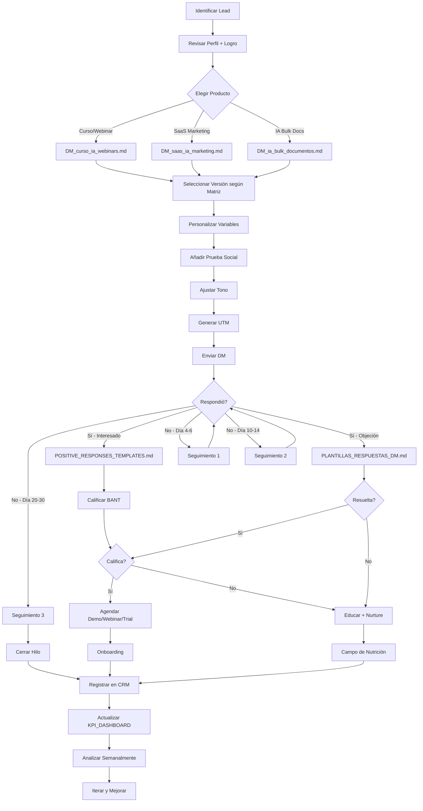
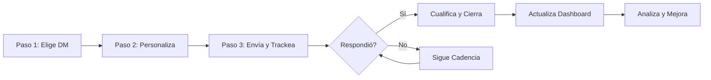
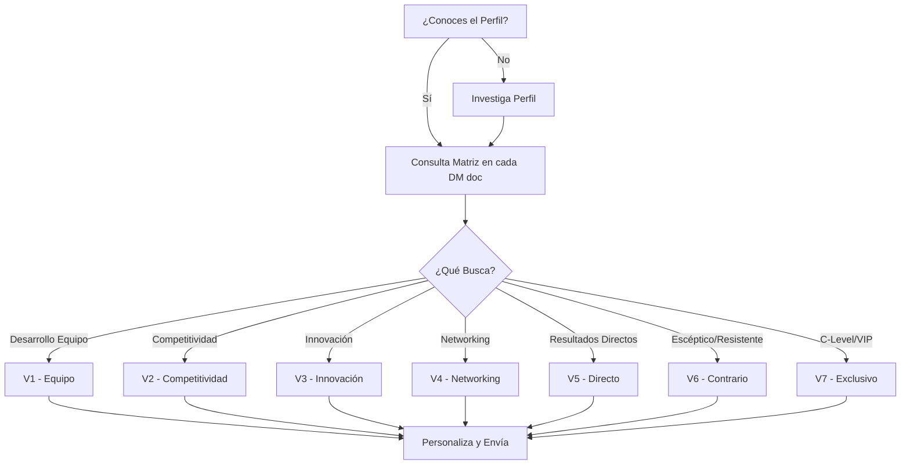
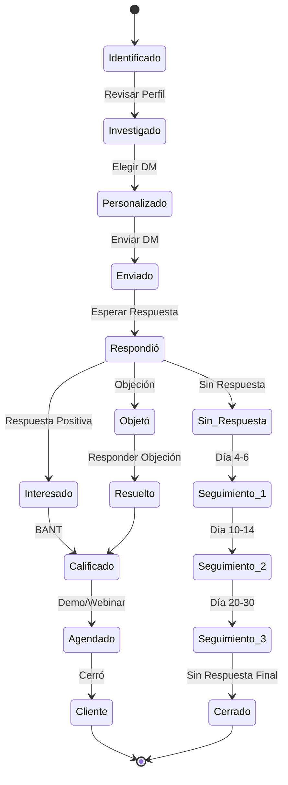

# Workflow Visual - Sistema de Outreach DM

## Diagrama de Flujo Completo

```mermaid
graph TD
    A[Identificar Lead] --> B[Revisar Perfil + Logro]
    B --> C{Elegir Producto}
    C -->|Curso/Webinar| D[DM_curso_ia_webinars.md]
    C -->|SaaS Marketing| E[DM_saas_ia_marketing.md]
    C -->|IA Bulk Docs| F[DM_ia_bulk_documentos.md]
    
    D --> G[Seleccionar Versión según Matriz]
    E --> G
    F --> G
    
    G --> H[Personalizar Variables]
    H --> I[Añadir Prueba Social]
    I --> J[Ajustar Tono]
    J --> K[Generar UTM]
    
    K --> L[Enviar DM]
    L --> M{Respondió?}
    
    M -->|Sí - Interesado| N[POSITIVE_RESPONSES_TEMPLATES.md]
    M -->|Sí - Objeción| O[PLANTILLAS_RESPUESTAS_DM.md]
    M -->|No - Día 4-6| P[Seguimiento 1]
    M -->|No - Día 10-14| Q[Seguimiento 2]
    M -->|No - Día 20-30| R[Seguimiento 3]
    
    N --> S[Calificar BANT]
    S --> T{Califica?}
    T -->|Sí| U[Agendar Demo/Webinar/Trial]
    T -->|No| V[Educar + Nurture]
    
    O --> W{Resuelta?}
    W -->|Sí| T
    W -->|No| V
    
    P --> M
    Q --> M
    R --> X[Cerrar Hilo]
    
    U --> Y[Onboarding]
    V --> Z[Campo de Nutrición]
    X --> AA[Registrar en CRM]
    
    Y --> AA
    Z --> AA
    
    AA --> AB[Actualizar KPI_DASHBOARD]
    AB --> AC[Analizar Semanalmente]
    AC --> AD[Iterar y Mejorar]
```

## Proceso Simplificado (Pasos 1-2-3)

```mermaid
flowchart LR
    A[Paso 1: Elige DM] --> B[Paso 2: Personaliza]
    B --> C[Paso 3: Envía y Trackea]
    C --> D{Respondió?}
    D -->|Sí| E[Cualifica y Cierra]
    D -->|No| F[Sigue Cadencia]
    F --> D
    E --> G[Actualiza Dashboard]
    G --> H[Analiza y Mejora]
```

## Flujo de Decisión: ¿Qué Versión Usar?

```mermaid
graph TD
    A[¿Conoces el Perfil?] -->|Sí| B[Consulta Matriz en cada DM doc]
    A -->|No| C[Investiga Perfil]
    C --> B
    
    B --> D{¿Qué Busca?}
    D -->|Desarrollo Equipo| E[V1 - Equipo]
    D -->|Competitividad| F[V2 - Competitividad]
    D -->|Innovación| G[V3 - Innovación]
    D -->|Networking| H[V4 - Networking]
    D -->|Resultados Directos| I[V5 - Directo]
    D -->|Escéptico/Resistente| J[V6 - Contrario]
    D -->|C-Level/VIP| K[V7 - Exclusivo]
    
    E --> L[Personaliza y Envía]
    F --> L
    G --> L
    H --> L
    I --> L
    J --> L
    K --> L
```

## Estados del Lead en el Proceso

```mermaid
stateDiagram-v2
    [*] --> Identificado
    Identificado --> Investigado: Revisar Perfil
    Investigado --> Personalizado: Elegir DM
    Personalizado --> Enviado: Enviar DM
    Enviado --> Respondió: Esperar Respuesta
    
    Respondió --> Interesado: Respuesta Positiva
    Respondió --> Objetó: Objeción
    Respondió --> Sin_Respuesta: Sin Respuesta
    
    Interesado --> Calificado: BANT
    Objetó --> Resuelto: Responder Objeción
    Sin_Respuesta --> Seguimiento_1: Día 4-6
    
    Calificado --> Agendado: Demo/Webinar
    Resuelto --> Calificado
    Seguimiento_1 --> Seguimiento_2: Día 10-14
    Seguimiento_2 --> Seguimiento_3: Día 20-30
    
    Agendado --> Cliente: Cerró
    Seguimiento_3 --> Cerrado: Sin Respuesta Final
    
    Cliente --> [*]
    Cerrado --> [*]
```

