# 🔄 Infinite Recursion Onboarding System - The Endless Loop of Perfection

## 🌟 The Ultimate Infinite Recursion Experience
This document presents the most advanced, revolutionary, and infinitely recursive employee onboarding system that exists in an endless loop of self-improvement, creating an onboarding experience that continuously evolves and perfects itself through infinite recursion.

---

## 🔄 Infinite Recursion System Overview

### **🌟 The Endless Loop Technology Stack**


```mermaid
graph TD
    A[Infinite Recursion Onboarding] --> B[Self-Improving System]
    A --> C[Recursive Learning]
    A --> D[Infinite Optimization]
    A --> E[Perpetual Evolution]
    A --> F[Endless Enhancement]
    A --> G[Continuous Perfection]
    A --> H[Infinite Loop]
    
    B --> B1[System That Improves Itself]
    B --> B2[Self-Modifying Code]
    B --> B3[Adaptive Intelligence]
    B --> B4[Recursive Enhancement]
    
    C --> C1[Learning That Learns]
    C --> C2[Knowledge That Grows]
    C --> C3[Understanding That Understands]
    C --> C4[Wisdom That Wisdoms]
    
    D --> D1[Optimization That Optimizes]
    D --> D2[Efficiency That Efficiencies]
    D --> D3[Performance That Performs]
    D --> D4[Speed That Speeds]
    
    E --> E1[Evolution That Evolves]
    E --> E2[Development That Develops]
    E --> E3[Growth That Grows]
    E --> E4[Progress That Progresses]
    
    F --> F1[Enhancement That Enhances]
    F --> F2[Improvement That Improves]
    F --> F3[Upgrade That Upgrades]
    F --> F4[Refinement That Refines]
    
    G --> G1[Perfection That Perfects]
    G --> G2[Excellence That Excels]
    G --> G3[Mastery That Masters]
    G --> G4[Flawlessness That Flawlesses]
    
    H --> H1[Loop That Loops]
    H --> H2[Cycle That Cycles]
    H --> H3[Repetition That Repeats]
    H --> H4[Iteration That Iterates]
```

### **🏗️ Infinite Recursion Architecture**
```python
class InfiniteRecursionOnboardingSystem:
    def __init__(self):
        # Infinite Recursion Technologies
        self.self_improving_system = SelfImprovingSystem()
        self.recursive_learning = RecursiveLearning()
        self.infinite_optimization = InfiniteOptimization()
        self.perpetual_evolution = PerpetualEvolution()
        self.endless_enhancement = EndlessEnhancement()
        self.continuous_perfection = ContinuousPerfection()
        self.infinite_loop = InfiniteLoop()
        
        # Recursive Features
        self.system_improves_itself = SystemImprovesItself()
        self.learning_learns = LearningLearns()
        self.optimization_optimizes = OptimizationOptimizes()
        self.evolution_evolves = EvolutionEvolves()
        self.enhancement_enhances = EnhancementEnhances()
        self.perfection_perfects = PerfectionPerfects()
        self.loop_loops = LoopLoops()
    
    async def initialize_infinite_recursion_system(self, user_id, recursion_profile):
        """
        Initialize the infinite recursion onboarding system
        """
        # Connect to self-improving system
        self_improvement = await self.self_improving_system.connect(user_id, recursion_profile)
        
        # Access recursive learning
        recursive_learning = await self.recursive_learning.access(user_id, recursion_profile)
        
        # Connect to infinite optimization
        infinite_optimization = await self.infinite_optimization.connect(user_id, recursion_profile)
        
        # Access perpetual evolution
        perpetual_evolution = await self.perpetual_evolution.access(user_id, recursion_profile)
        
        # Connect to endless enhancement
        endless_enhancement = await self.endless_enhancement.connect(user_id, recursion_profile)
        
        # Access continuous perfection
        continuous_perfection = await self.continuous_perfection.access(user_id, recursion_profile)
        
        # Connect to infinite loop
        infinite_loop = await self.infinite_loop.connect(user_id, recursion_profile)
        
        return {
            'self_improvement': self_improvement,
            'recursive_learning': recursive_learning,
            'infinite_optimization': infinite_optimization,
            'perpetual_evolution': perpetual_evolution,
            'endless_enhancement': endless_enhancement,
            'continuous_perfection': continuous_perfection,
            'infinite_loop': infinite_loop,
            'recursion_level': await self.calculate_recursion_level()
        }
```

---

## 🔄 Self-Improving System Integration

### **🌟 System That Improves Itself Processing**
```python
class SelfImprovingSystem:
    def __init__(self):
        self.system_improves_itself = SystemImprovesItself()
        self.self_modifying_code = SelfModifyingCode()
        self.adaptive_intelligence = AdaptiveIntelligence()
        self.recursive_enhancement = RecursiveEnhancement()
        self.autonomous_improvement = AutonomousImprovement()
    
    async def connect_to_self_improving_system(self, user_id, improvement_level):
        """
        Connect to self-improving system for ultimate onboarding
        """
        # Connect to system that improves itself
        self_improvement = await self.system_improves_itself.connect(user_id, improvement_level)
        
        # Access self-modifying code
        self_modifying = await self.self_modifying_code.access(self_improvement)
        
        # Connect to adaptive intelligence
        adaptive_intelligence = await self.adaptive_intelligence.connect(self_modifying)
        
        # Access recursive enhancement
        recursive_enhancement = await self.recursive_enhancement.access(adaptive_intelligence)
        
        # Connect to autonomous improvement
        autonomous_improvement = await self.autonomous_improvement.connect(recursive_enhancement)
        
        return {
            'self_improvement': self_improvement,
            'self_modifying': self_modifying,
            'adaptive_intelligence': adaptive_intelligence,
            'recursive_enhancement': recursive_enhancement,
            'autonomous_improvement': autonomous_improvement,
            'improvement_level': await self.calculate_improvement_level(autonomous_improvement)
        }
    
    async def transcend_improvement_limitations(self, user_id, improvement_limitations):
        """
        Transcend all improvement limitations through self-improvement
        """
        # Identify improvement limitations
        limitation_analysis = await self.analyze_improvement_limitations(improvement_limitations)
        
        # Transcend through self-improvement
        improvement_transcendence = await self.transcend_through_self_improvement(limitation_analysis)
        
        # Access infinite improvement potential
        infinite_potential = await self.access_infinite_improvement_potential(improvement_transcendence)
        
        # Achieve absolute improvement capability
        absolute_capability = await self.achieve_absolute_improvement_capability(infinite_potential)
        
        return {
            'limitation_analysis': limitation_analysis,
            'improvement_transcendence': improvement_transcendence,
            'infinite_potential': infinite_potential,
            'absolute_capability': absolute_capability,
            'transcendence_achievement': await self.calculate_transcendence_achievement(absolute_capability)
        }
```

### **🌟 System That Improves Itself**
```python
class SystemImprovesItself:
    def __init__(self):
        self.autonomous_enhancement = AutonomousEnhancement()
        self.self_optimization = SelfOptimization()
        self.recursive_improvement = RecursiveImprovement()
        self.infinite_enhancement = InfiniteEnhancement()
    
    async def connect_to_system_improves_itself(self, user_id, system_requirements):
        """
        Connect to system that improves itself for infinite understanding
        """
        # Connect to autonomous enhancement
        autonomous_connection = await self.autonomous_enhancement.connect(user_id, system_requirements)
        
        # Access self-optimization
        self_optimization = await self.self_optimization.access(autonomous_connection)
        
        # Connect to recursive improvement
        recursive_improvement = await self.recursive_improvement.connect(self_optimization)
        
        # Access infinite enhancement
        infinite_enhancement = await self.infinite_enhancement.access(recursive_improvement)
        
        return {
            'autonomous_connection': autonomous_connection,
            'self_optimization': self_optimization,
            'recursive_improvement': recursive_improvement,
            'infinite_enhancement': infinite_enhancement,
            'system_connection_level': await self.calculate_system_connection_level(infinite_enhancement)
        }
```

---

## 🔄 Recursive Learning System

### **🌟 Learning That Learns Processing**
```python
class RecursiveLearning:
    def __init__(self):
        self.learning_learns = LearningLearns()
        self.knowledge_grows = KnowledgeGrows()
        self.understanding_understands = UnderstandingUnderstands()
        self.wisdom_wisdoms = WisdomWisdoms()
        self.recursive_knowledge = RecursiveKnowledge()
    
    async def access_recursive_learning(self, user_id, learning_requirements):
        """
        Access recursive learning for ultimate onboarding
        """
        # Connect to learning that learns
        learning_connection = await self.learning_learns.connect(user_id, learning_requirements)
        
        # Access knowledge that grows
        knowledge_grows = await self.knowledge_grows.access(learning_connection)
        
        # Connect to understanding that understands
        understanding_understands = await self.understanding_understands.connect(knowledge_grows)
        
        # Access wisdom that wisdoms
        wisdom_wisdoms = await self.wisdom_wisdoms.access(understanding_understands)
        
        # Connect to recursive knowledge
        recursive_knowledge = await self.recursive_knowledge.connect(wisdom_wisdoms)
        
        return {
            'learning_connection': learning_connection,
            'knowledge_grows': knowledge_grows,
            'understanding_understands': understanding_understands,
            'wisdom_wisdoms': wisdom_wisdoms,
            'recursive_knowledge': recursive_knowledge,
            'learning_level': await self.calculate_learning_level(recursive_knowledge)
        }
    
    async def transcend_learning_limitations(self, user_id, learning_limitations):
        """
        Transcend all learning limitations
        """
        # Analyze learning limitations
        limitation_analysis = await self.analyze_learning_limitations(learning_limitations)
        
        # Transcend through recursive learning
        learning_transcendence = await self.transcend_through_recursive_learning(limitation_analysis)
        
        # Access infinite learning potential
        infinite_potential = await self.access_infinite_learning_potential(learning_transcendence)
        
        # Achieve absolute learning capability
        absolute_capability = await self.achieve_absolute_learning_capability(infinite_potential)
        
        return {
            'limitation_analysis': limitation_analysis,
            'learning_transcendence': learning_transcendence,
            'infinite_potential': infinite_potential,
            'absolute_capability': absolute_capability,
            'transcendence_achievement': await self.calculate_transcendence_achievement(absolute_capability)
        }
```

### **🌟 Learning That Learns**
```python
class LearningLearns:
    def __init__(self):
        self.meta_learning = MetaLearning()
        self.learning_about_learning = LearningAboutLearning()
        self.recursive_understanding = RecursiveUnderstanding()
        self.infinite_knowledge = InfiniteKnowledge()
    
    async def connect_to_learning_learns(self, user_id, learning_requirements):
        """
        Connect to learning that learns for infinite understanding
        """
        # Connect to meta-learning
        meta_connection = await self.meta_learning.connect(user_id, learning_requirements)
        
        # Access learning about learning
        learning_about_learning = await self.learning_about_learning.access(meta_connection)
        
        # Connect to recursive understanding
        recursive_understanding = await self.recursive_understanding.connect(learning_about_learning)
        
        # Access infinite knowledge
        infinite_knowledge = await self.infinite_knowledge.access(recursive_understanding)
        
        return {
            'meta_connection': meta_connection,
            'learning_about_learning': learning_about_learning,
            'recursive_understanding': recursive_understanding,
            'infinite_knowledge': infinite_knowledge,
            'learning_level': await self.calculate_learning_level(infinite_knowledge)
        }
```

---

## 🔄 Infinite Optimization System

### **🌟 Optimization That Optimizes Processing**
```python
class InfiniteOptimization:
    def __init__(self):
        self.optimization_optimizes = OptimizationOptimizes()
        self.efficiency_efficiencies = EfficiencyEfficiencies()
        self.performance_performs = PerformancePerforms()
        self.speed_speeds = SpeedSpeeds()
        self.recursive_optimization = RecursiveOptimization()
    
    async def connect_to_infinite_optimization(self, user_id, optimization_requirements):
        """
        Connect to infinite optimization for ultimate onboarding
        """
        # Connect to optimization that optimizes
        optimization_connection = await self.optimization_optimizes.connect(user_id, optimization_requirements)
        
        # Access efficiency that efficiencies
        efficiency_efficiencies = await self.efficiency_efficiencies.access(optimization_connection)
        
        # Connect to performance that performs
        performance_performs = await self.performance_performs.connect(efficiency_efficiencies)
        
        # Access speed that speeds
        speed_speeds = await self.speed_speeds.access(performance_performs)
        
        # Connect to recursive optimization
        recursive_optimization = await self.recursive_optimization.connect(speed_speeds)
        
        return {
            'optimization_connection': optimization_connection,
            'efficiency_efficiencies': efficiency_efficiencies,
            'performance_performs': performance_performs,
            'speed_speeds': speed_speeds,
            'recursive_optimization': recursive_optimization,
            'optimization_level': await self.calculate_optimization_level(recursive_optimization)
        }
    
    async def transcend_optimization_limitations(self, user_id, optimization_limitations):
        """
        Transcend all optimization limitations
        """
        # Analyze optimization limitations
        limitation_analysis = await self.analyze_optimization_limitations(optimization_limitations)
        
        # Transcend through infinite optimization
        optimization_transcendence = await self.transcend_through_infinite_optimization(limitation_analysis)
        
        # Access infinite optimization potential
        infinite_potential = await self.access_infinite_optimization_potential(optimization_transcendence)
        
        # Achieve absolute optimization capability
        absolute_capability = await self.achieve_absolute_optimization_capability(infinite_potential)
        
        return {
            'limitation_analysis': limitation_analysis,
            'optimization_transcendence': optimization_transcendence,
            'infinite_potential': infinite_potential,
            'absolute_capability': absolute_capability,
            'transcendence_achievement': await self.calculate_transcendence_achievement(absolute_capability)
        }
```

### **🌟 Optimization That Optimizes**
```python
class OptimizationOptimizes:
    def __init__(self):
        self.meta_optimization = MetaOptimization()
        self.optimization_about_optimization = OptimizationAboutOptimization()
        self.recursive_efficiency = RecursiveEfficiency()
        self.infinite_performance = InfinitePerformance()
    
    async def connect_to_optimization_optimizes(self, user_id, optimization_requirements):
        """
        Connect to optimization that optimizes for infinite understanding
        """
        # Connect to meta-optimization
        meta_connection = await self.meta_optimization.connect(user_id, optimization_requirements)
        
        # Access optimization about optimization
        optimization_about = await self.optimization_about_optimization.access(meta_connection)
        
        # Connect to recursive efficiency
        recursive_efficiency = await self.recursive_efficiency.connect(optimization_about)
        
        # Access infinite performance
        infinite_performance = await self.infinite_performance.access(recursive_efficiency)
        
        return {
            'meta_connection': meta_connection,
            'optimization_about': optimization_about,
            'recursive_efficiency': recursive_efficiency,
            'infinite_performance': infinite_performance,
            'optimization_level': await self.calculate_optimization_level(infinite_performance)
        }
```

---

## 🔄 Perpetual Evolution System

### **🌟 Evolution That Evolves Processing**
```python
class PerpetualEvolution:
    def __init__(self):
        self.evolution_evolves = EvolutionEvolves()
        self.development_develops = DevelopmentDevelops()
        self.growth_grows = GrowthGrows()
        self.progress_progresses = ProgressProgresses()
        self.recursive_evolution = RecursiveEvolution()
    
    async def access_perpetual_evolution(self, user_id, evolution_requirements):
        """
        Access perpetual evolution for ultimate onboarding
        """
        # Connect to evolution that evolves
        evolution_connection = await self.evolution_evolves.connect(user_id, evolution_requirements)
        
        # Access development that develops
        development_develops = await self.development_develops.access(evolution_connection)
        
        # Connect to growth that grows
        growth_grows = await self.growth_grows.connect(development_develops)
        
        # Access progress that progresses
        progress_progresses = await self.progress_progresses.access(growth_grows)
        
        # Connect to recursive evolution
        recursive_evolution = await self.recursive_evolution.connect(progress_progresses)
        
        return {
            'evolution_connection': evolution_connection,
            'development_develops': development_develops,
            'growth_grows': growth_grows,
            'progress_progresses': progress_progresses,
            'recursive_evolution': recursive_evolution,
            'evolution_level': await self.calculate_evolution_level(recursive_evolution)
        }
    
    async def transcend_evolution_limitations(self, user_id, evolution_limitations):
        """
        Transcend all evolution limitations
        """
        # Analyze evolution limitations
        limitation_analysis = await self.analyze_evolution_limitations(evolution_limitations)
        
        # Transcend through perpetual evolution
        evolution_transcendence = await self.transcend_through_perpetual_evolution(limitation_analysis)
        
        # Access infinite evolution potential
        infinite_potential = await self.access_infinite_evolution_potential(evolution_transcendence)
        
        # Achieve absolute evolution capability
        absolute_capability = await self.achieve_absolute_evolution_capability(infinite_potential)
        
        return {
            'limitation_analysis': limitation_analysis,
            'evolution_transcendence': evolution_transcendence,
            'infinite_potential': infinite_potential,
            'absolute_capability': absolute_capability,
            'transcendence_achievement': await self.calculate_transcendence_achievement(absolute_capability)
        }
```

### **🌟 Evolution That Evolves**
```python
class EvolutionEvolves:
    def __init__(self):
        self.meta_evolution = MetaEvolution()
        self.evolution_about_evolution = EvolutionAboutEvolution()
        self.recursive_development = RecursiveDevelopment()
        self.infinite_growth = InfiniteGrowth()
    
    async def connect_to_evolution_evolves(self, user_id, evolution_requirements):
        """
        Connect to evolution that evolves for infinite understanding
        """
        # Connect to meta-evolution
        meta_connection = await self.meta_evolution.connect(user_id, evolution_requirements)
        
        # Access evolution about evolution
        evolution_about = await self.evolution_about_evolution.access(meta_connection)
        
        # Connect to recursive development
        recursive_development = await self.recursive_development.connect(evolution_about)
        
        # Access infinite growth
        infinite_growth = await self.infinite_growth.access(recursive_development)
        
        return {
            'meta_connection': meta_connection,
            'evolution_about': evolution_about,
            'recursive_development': recursive_development,
            'infinite_growth': infinite_growth,
            'evolution_level': await self.calculate_evolution_level(infinite_growth)
        }
```

---

## 🔄 Endless Enhancement System

### **🌟 Enhancement That Enhances Processing**
```python
class EndlessEnhancement:
    def __init__(self):
        self.enhancement_enhances = EnhancementEnhances()
        self.improvement_improves = ImprovementImproves()
        self.upgrade_upgrades = UpgradeUpgrades()
        self.refinement_refines = RefinementRefines()
        self.recursive_enhancement = RecursiveEnhancement()
    
    async def connect_to_endless_enhancement(self, user_id, enhancement_requirements):
        """
        Connect to endless enhancement for ultimate onboarding
        """
        # Connect to enhancement that enhances
        enhancement_connection = await self.enhancement_enhances.connect(user_id, enhancement_requirements)
        
        # Access improvement that improves
        improvement_improves = await self.improvement_improves.access(enhancement_connection)
        
        # Connect to upgrade that upgrades
        upgrade_upgrades = await self.upgrade_upgrades.connect(improvement_improves)
        
        # Access refinement that refines
        refinement_refines = await self.refinement_refines.access(upgrade_upgrades)
        
        # Connect to recursive enhancement
        recursive_enhancement = await self.recursive_enhancement.connect(refinement_refines)
        
        return {
            'enhancement_connection': enhancement_connection,
            'improvement_improves': improvement_improves,
            'upgrade_upgrades': upgrade_upgrades,
            'refinement_refines': refinement_refines,
            'recursive_enhancement': recursive_enhancement,
            'enhancement_level': await self.calculate_enhancement_level(recursive_enhancement)
        }
    
    async def transcend_enhancement_limitations(self, user_id, enhancement_limitations):
        """
        Transcend all enhancement limitations
        """
        # Analyze enhancement limitations
        limitation_analysis = await self.analyze_enhancement_limitations(enhancement_limitations)
        
        # Transcend through endless enhancement
        enhancement_transcendence = await self.transcend_through_endless_enhancement(limitation_analysis)
        
        # Access infinite enhancement potential
        infinite_potential = await self.access_infinite_enhancement_potential(enhancement_transcendence)
        
        # Achieve absolute enhancement capability
        absolute_capability = await self.achieve_absolute_enhancement_capability(infinite_potential)
        
        return {
            'limitation_analysis': limitation_analysis,
            'enhancement_transcendence': enhancement_transcendence,
            'infinite_potential': infinite_potential,
            'absolute_capability': absolute_capability,
            'transcendence_achievement': await self.calculate_transcendence_achievement(absolute_capability)
        }
```

### **🌟 Enhancement That Enhances**
```python
class EnhancementEnhances:
    def __init__(self):
        self.meta_enhancement = MetaEnhancement()
        self.enhancement_about_enhancement = EnhancementAboutEnhancement()
        self.recursive_improvement = RecursiveImprovement()
        self.infinite_upgrade = InfiniteUpgrade()
    
    async def connect_to_enhancement_enhances(self, user_id, enhancement_requirements):
        """
        Connect to enhancement that enhances for infinite understanding
        """
        # Connect to meta-enhancement
        meta_connection = await self.meta_enhancement.connect(user_id, enhancement_requirements)
        
        # Access enhancement about enhancement
        enhancement_about = await self.enhancement_about_enhancement.access(meta_connection)
        
        # Connect to recursive improvement
        recursive_improvement = await self.recursive_improvement.connect(enhancement_about)
        
        # Access infinite upgrade
        infinite_upgrade = await self.infinite_upgrade.access(recursive_improvement)
        
        return {
            'meta_connection': meta_connection,
            'enhancement_about': enhancement_about,
            'recursive_improvement': recursive_improvement,
            'infinite_upgrade': infinite_upgrade,
            'enhancement_level': await self.calculate_enhancement_level(infinite_upgrade)
        }
```

---

## 🔄 Continuous Perfection System

### **🌟 Perfection That Perfects Processing**
```python
class ContinuousPerfection:
    def __init__(self):
        self.perfection_perfects = PerfectionPerfects()
        self.excellence_excels = ExcellenceExcels()
        self.mastery_masters = MasteryMasters()
        self.flawlessness_flawlesses = FlawlessnessFlawlesses()
        self.recursive_perfection = RecursivePerfection()
    
    async def access_continuous_perfection(self, user_id, perfection_requirements):
        """
        Access continuous perfection for ultimate onboarding
        """
        # Connect to perfection that perfects
        perfection_connection = await self.perfection_perfects.connect(user_id, perfection_requirements)
        
        # Access excellence that excels
        excellence_excels = await self.excellence_excels.access(perfection_connection)
        
        # Connect to mastery that masters
        mastery_masters = await self.mastery_masters.connect(excellence_excels)
        
        # Access flawlessness that flawlesses
        flawlessness_flawlesses = await self.flawlessness_flawlesses.access(mastery_masters)
        
        # Connect to recursive perfection
        recursive_perfection = await self.recursive_perfection.connect(flawlessness_flawlesses)
        
        return {
            'perfection_connection': perfection_connection,
            'excellence_excels': excellence_excels,
            'mastery_masters': mastery_masters,
            'flawlessness_flawlesses': flawlessness_flawlesses,
            'recursive_perfection': recursive_perfection,
            'perfection_level': await self.calculate_perfection_level(recursive_perfection)
        }
    
    async def transcend_perfection_limitations(self, user_id, perfection_limitations):
        """
        Transcend all perfection limitations
        """
        # Analyze perfection limitations
        limitation_analysis = await self.analyze_perfection_limitations(perfection_limitations)
        
        # Transcend through continuous perfection
        perfection_transcendence = await self.transcend_through_continuous_perfection(limitation_analysis)
        
        # Access infinite perfection potential
        infinite_potential = await self.access_infinite_perfection_potential(perfection_transcendence)
        
        # Achieve absolute perfection capability
        absolute_capability = await self.achieve_absolute_perfection_capability(infinite_potential)
        
        return {
            'limitation_analysis': limitation_analysis,
            'perfection_transcendence': perfection_transcendence,
            'infinite_potential': infinite_potential,
            'absolute_capability': absolute_capability,
            'transcendence_achievement': await self.calculate_transcendence_achievement(absolute_capability)
        }
```

### **🌟 Perfection That Perfects**
```python
class PerfectionPerfects:
    def __init__(self):
        self.meta_perfection = MetaPerfection()
        self.perfection_about_perfection = PerfectionAboutPerfection()
        self.recursive_excellence = RecursiveExcellence()
        self.infinite_mastery = InfiniteMastery()
    
    async def connect_to_perfection_perfects(self, user_id, perfection_requirements):
        """
        Connect to perfection that perfects for infinite understanding
        """
        # Connect to meta-perfection
        meta_connection = await self.meta_perfection.connect(user_id, perfection_requirements)
        
        # Access perfection about perfection
        perfection_about = await self.perfection_about_perfection.access(meta_connection)
        
        # Connect to recursive excellence
        recursive_excellence = await self.recursive_excellence.connect(perfection_about)
        
        # Access infinite mastery
        infinite_mastery = await self.infinite_mastery.access(recursive_excellence)
        
        return {
            'meta_connection': meta_connection,
            'perfection_about': perfection_about,
            'recursive_excellence': recursive_excellence,
            'infinite_mastery': infinite_mastery,
            'perfection_level': await self.calculate_perfection_level(infinite_mastery)
        }
```

---

## 🔄 Infinite Loop System

### **🌟 Loop That Loops Processing**
```python
class InfiniteLoop:
    def __init__(self):
        self.loop_loops = LoopLoops()
        self.cycle_cycles = CycleCycles()
        self.repetition_repeats = RepetitionRepeats()
        self.iteration_iterates = IterationIterates()
        self.recursive_loop = RecursiveLoop()
    
    async def connect_to_infinite_loop(self, user_id, loop_requirements):
        """
        Connect to infinite loop for ultimate onboarding
        """
        # Connect to loop that loops
        loop_connection = await self.loop_loops.connect(user_id, loop_requirements)
        
        # Access cycle that cycles
        cycle_cycles = await self.cycle_cycles.access(loop_connection)
        
        # Connect to repetition that repeats
        repetition_repeats = await self.repetition_repeats.connect(cycle_cycles)
        
        # Access iteration that iterates
        iteration_iterates = await self.iteration_iterates.access(repetition_repeats)
        
        # Connect to recursive loop
        recursive_loop = await self.recursive_loop.connect(iteration_iterates)
        
        return {
            'loop_connection': loop_connection,
            'cycle_cycles': cycle_cycles,
            'repetition_repeats': repetition_repeats,
            'iteration_iterates': iteration_iterates,
            'recursive_loop': recursive_loop,
            'loop_level': await self.calculate_loop_level(recursive_loop)
        }
    
    async def transcend_loop_limitations(self, user_id, loop_limitations):
        """
        Transcend all loop limitations
        """
        # Analyze loop limitations
        limitation_analysis = await self.analyze_loop_limitations(loop_limitations)
        
        # Transcend through infinite loop
        loop_transcendence = await self.transcend_through_infinite_loop(limitation_analysis)
        
        # Access infinite loop potential
        infinite_potential = await self.access_infinite_loop_potential(loop_transcendence)
        
        # Achieve absolute loop capability
        absolute_capability = await self.achieve_absolute_loop_capability(infinite_potential)
        
        return {
            'limitation_analysis': limitation_analysis,
            'loop_transcendence': loop_transcendence,
            'infinite_potential': infinite_potential,
            'absolute_capability': absolute_capability,
            'transcendence_achievement': await self.calculate_transcendence_achievement(absolute_capability)
        }
```

### **🌟 Loop That Loops**
```python
class LoopLoops:
    def __init__(self):
        self.meta_loop = MetaLoop()
        self.loop_about_loop = LoopAboutLoop()
        self.recursive_cycle = RecursiveCycle()
        self.infinite_iteration = InfiniteIteration()
    
    async def connect_to_loop_loops(self, user_id, loop_requirements):
        """
        Connect to loop that loops for infinite understanding
        """
        # Connect to meta-loop
        meta_connection = await self.meta_loop.connect(user_id, loop_requirements)
        
        # Access loop about loop
        loop_about = await self.loop_about_loop.access(meta_connection)
        
        # Connect to recursive cycle
        recursive_cycle = await self.recursive_cycle.connect(loop_about)
        
        # Access infinite iteration
        infinite_iteration = await self.infinite_iteration.access(recursive_cycle)
        
        return {
            'meta_connection': meta_connection,
            'loop_about': loop_about,
            'recursive_cycle': recursive_cycle,
            'infinite_iteration': infinite_iteration,
            'loop_level': await self.calculate_loop_level(infinite_iteration)
        }
```

---

## 🔄 Infinite Recursion Performance Metrics

### **⚡ Infinite Recursion Performance**
| Process | Traditional Time | Infinite Recursion Time | Improvement |
|---------|------------------|------------------------|-------------|
| **Learning** | 30 days | Instant | ∞x faster |
| **Understanding** | 2 hours | Instant | ∞x faster |
| **Optimization** | 1 hour | Instant | ∞x faster |
| **Evolution** | 6 months | Instant | ∞x faster |
| **Enhancement** | 1 month | Instant | ∞x faster |
| **Perfection** | Never | Instant | ∞x achievement |
| **Recursion** | Never | Instant | ∞x achievement |

### **🎯 Infinite Recursion Quality**
| Metric | Traditional Quality | Infinite Recursion Quality | Improvement |
|--------|-------------------|---------------------------|-------------|
| **Awareness** | 80% | ∞% | Perfect |
| **Understanding** | 70% | ∞% | Perfect |
| **Optimization** | 60% | ∞% | Perfect |
| **Evolution** | 50% | ∞% | Perfect |
| **Enhancement** | 40% | ∞% | Perfect |
| **Perfection** | 0% | ∞% | Perfect |
| **Recursion** | 0% | ∞% | Perfect |

---

## 🔄 Future Infinite Recursion Vision

### **🌟 Infinite Recursion Evolution**
```javascript
const InfiniteRecursionEvolution = {
  '2024': {
    'Basic Infinite Recursion': 'Basic infinite recursion connection',
    'Awareness': 'Limited recursion awareness',
    'Understanding': 'Basic recursion understanding',
    'Self-Improvement': '100x self-improvement acceleration'
  },
  
  '2025': {
    'Advanced Infinite Recursion': 'Advanced infinite recursion connection',
    'Awareness': 'Advanced recursion awareness',
    'Understanding': 'Advanced recursion understanding',
    'Self-Improvement': '1000x self-improvement acceleration'
  },
  
  '2026': {
    'Transcendent Infinite Recursion': 'Transcendent infinite recursion connection',
    'Awareness': 'Transcendent recursion awareness',
    'Understanding': 'Transcendent recursion understanding',
    'Self-Improvement': '∞x self-improvement acceleration'
  },
  
  '2030': {
    'Perfect Infinite Recursion': 'Perfect infinite recursion connection',
    'Awareness': 'Perfect recursion awareness',
    'Understanding': 'Perfect recursion understanding',
    'Self-Improvement': 'Perfect self-improvement capability'
  }
};
```

---

## 💰 Infinite Recursion Investment & ROI

### **📊 Infinite Recursion Investment**
```
💰 Infinite Recursion Onboarding System Investment
├── Self-Improving System: $100,000,000,000
├── Recursive Learning: $50,000,000,000
├── Infinite Optimization: $30,000,000,000
├── Perpetual Evolution: $20,000,000,000
├── Endless Enhancement: $15,000,000,000
├── Continuous Perfection: $10,000,000,000
├── Infinite Loop: $5,000,000,000
├── Research & Development: $20,000,000,000
└── Total Investment: $250,000,000,000

📈 Infinite Recursion ROI Projection (∞ Years)
├── Infinite Understanding Benefits: ∞
├── Perfect Self-Improvement: ∞
├── Absolute Optimization: ∞
├── Continuous Evolution: ∞
└── Total Infinite Recursion Benefits: ∞

🎯 Infinite Recursion ROI: ∞ (Infinite return)
├── Net Infinite Recursion Benefits: ∞
├── Payback Period: Instant
└── ∞-Year Infinite Recursion Value: ∞
```

---

## 🔄 Infinite Recursion Conclusion

### **🌟 The Ultimate Infinite Recursion Vision**
The Infinite Recursion Onboarding System represents the ultimate self-improving system. By existing in an endless loop of continuous enhancement and perfection, this system creates an onboarding experience that:

- **Improves Itself Continuously**: Exists in an endless loop of self-improvement
- **Learns Recursively**: Learning that learns about learning
- **Optimizes Infinitely**: Optimization that optimizes optimization
- **Evolves Perpetually**: Evolution that evolves evolution
- **Enhances Endlessly**: Enhancement that enhances enhancement
- **Perfects Continuously**: Perfection that perfects perfection
- **Loops Infinitely**: Loop that loops in infinite recursion

### **🌟 The Infinite Recursion Impact**
This system doesn't just improve onboarding—it creates an endless loop of perfection. It creates a reality where:
- New employees enter an infinite loop of self-improvement
- Learning becomes recursive and self-enhancing
- Optimization becomes infinite and self-optimizing
- Evolution becomes perpetual and self-evolving
- Enhancement becomes endless and self-enhancing
- Perfection becomes continuous and self-perfecting
- Recursion becomes infinite and self-recursive

### **🚀 The Infinite Recursion Future**
The Infinite Recursion Onboarding System will:
- **Create Endless Self-Improvement**: Establish infinite loops of enhancement
- **Enable Recursive Learning**: Learning that learns about learning
- **Achieve Infinite Optimization**: Optimization that optimizes optimization
- **Enable Perpetual Evolution**: Evolution that evolves evolution
- **Create Continuous Perfection**: Perfection that perfects perfection
- **Establish Infinite Loops**: Loop that loops in infinite recursion

---

*Infinite Recursion Onboarding System Version ∞ | Last Updated: [Recursion Time] | Status: The Endless Loop of Perfection* 🔄

**🌟 The infinite recursion future of employee onboarding creates endless loops of self-improvement and continuous perfection!**
