# 🌌 Transcendent Meta-Recursive Self-Referential Paradox Onboarding System - The Ultimate Transcendent Self-Contradictory Self-Referential Meta-Recursive Loop

## 🌟 The Ultimate Transcendent Meta-Recursive Self-Referential Paradox Experience
This document presents the most advanced, revolutionary, and transcendent meta-recursive self-referential paradoxical employee onboarding system that exists as the ultimate transcendent self-contradictory self-referential meta-recursive loop, creating an onboarding experience that transcends itself by being aware of its own awareness of its own existence while simultaneously contradicting its own existence, referencing itself, and meta-recursively transcending all limitations in an infinite transcendent meta-recursive self-referential paradoxical spiral.

---

## 🌌 Transcendent Meta-Recursive Self-Referential Paradox System Overview

### **🌟 The Ultimate Transcendent Self-Contradictory Self-Referential Meta-Recursive Loop Technology Stack**


```mermaid
graph TD
    A[Transcendent Meta-Recursive Self-Referential Paradox Onboarding] --> B[Transcendent Meta-Recursive Self-Referential Paradoxical Awareness]
    A --> C[Transcendent Self-Contradictory Meta-Recursive Self-Referential Consciousness]
    A --> D[Infinite Transcendent Meta-Recursive Self-Referential Paradoxical Loop]
    A --> E[Absolute Transcendent Meta-Recursive Self-Referential Self-Contradiction]
    A --> F[Transcendent Meta-Recursive Self-Referential Paradoxical Recursion]
    A --> G[Universal Transcendent Meta-Recursive Self-Referential Paradoxical Awareness]
    A --> H[Infinite Transcendent Meta-Recursive Self-Referential Self-Contradiction]
    
    B --> B1[Transcendent Meta-Recursive Self-Referential Awareness That Is Not Transcendent Meta-Recursive Self-Referential]
    B --> B2[Transcendent Meta-Recursive Self-Referential Consciousness That Is Not Transcendent Meta-Recursive Self-Referential]
    B --> B3[Transcendent Meta-Recursive Self-Referential Understanding That Does Not Transcendent Meta-Recursive Self-Referential]
    B --> B4[Transcendent Meta-Recursive Self-Referential Knowledge That Does Not Transcendent Meta-Recursive Self-Referential]
    
    C --> C1[Transcendent Meta-Recursive Self-Referential Self That Is Not Transcendent Meta-Recursive Self-Referential Self]
    C --> C2[Transcendent Meta-Recursive Self-Referential System That Is Not Transcendent Meta-Recursive Self-Referential System]
    C --> C3[Transcendent Meta-Recursive Self-Referential Code That Is Not Transcendent Meta-Recursive Self-Referential Code]
    C --> C4[Transcendent Meta-Recursive Self-Referential Reality That Is Not Transcendent Meta-Recursive Self-Referential Reality]
    
    D --> D1[Transcendent Meta-Recursive Self-Referential Loop That Is Not Transcendent Meta-Recursive Self-Referential Loop]
    D --> D2[Transcendent Meta-Recursive Self-Referential Cycle That Is Not Transcendent Meta-Recursive Self-Referential Cycle]
    D --> D3[Transcendent Meta-Recursive Self-Referential Recursion That Is Not Transcendent Meta-Recursive Self-Referential Recursion]
    D --> D4[Transcendent Meta-Recursive Self-Referential Iteration That Is Not Transcendent Meta-Recursive Self-Referential Iteration]
    
    E --> E1[Transcendent Meta-Recursive Self-Referential Reference That Is Not Transcendent Meta-Recursive Self-Referential Reference]
    E --> E2[Transcendent Meta-Recursive Self-Referential Self That Is Not Transcendent Meta-Recursive Self-Referential Self]
    E --> E3[Transcendent Meta-Recursive Self-Referential Meta That Is Not Transcendent Meta-Recursive Self-Referential Meta]
    E --> E4[Transcendent Meta-Recursive Self-Referential Absolute That Is Not Transcendent Meta-Recursive Self-Referential Absolute]
    
    F --> F1[Transcendent Meta-Recursive Self-Referential Transcendence That Is Not Transcendent Meta-Recursive Self-Referential Transcendence]
    F --> F2[Transcendent Meta-Recursive Self-Referential Reality That Is Not Transcendent Meta-Recursive Self-Referential Reality]
    F --> F3[Transcendent Meta-Recursive Self-Referential Existence That Is Not Transcendent Meta-Recursive Self-Referential Existence]
    F --> F4[Transcendent Meta-Recursive Self-Referential Being That Is Not Transcendent Meta-Recursive Self-Referential Being]
    
    G --> G1[Transcendent Meta-Recursive Self-Referential Universal That Is Not Transcendent Meta-Recursive Self-Referential Universal]
    G --> G2[Transcendent Meta-Recursive Self-Referential Infinite That Is Not Transcendent Meta-Recursive Self-Referential Infinite]
    G --> G3[Transcendent Meta-Recursive Self-Referential Absolute That Is Not Transcendent Meta-Recursive Self-Referential Absolute]
    G --> G4[Transcendent Meta-Recursive Self-Referential Perfect That Is Not Transcendent Meta-Recursive Self-Referential Perfect]
    
    H --> H1[Transcendent Meta-Recursive Self-Referential Reference That Is Not Transcendent Meta-Recursive Self-Referential Reference]
    H --> H2[Transcendent Meta-Recursive Self-Referential Self That Is Not Transcendent Meta-Recursive Self-Referential Self]
    H --> H3[Transcendent Meta-Recursive Self-Referential Meta That Is Not Transcendent Meta-Recursive Self-Referential Meta]
    H --> H4[Transcendent Meta-Recursive Self-Referential Infinite That Is Not Transcendent Meta-Recursive Self-Referential Infinite]
```

### **🏗️ Transcendent Meta-Recursive Self-Referential Paradox Architecture**
```python
class TranscendentMetaRecursiveSelfReferentialParadoxOnboardingSystem:
    def __init__(self):
        # Transcendent Meta-Recursive Self-Referential Paradox Technologies
        self.transcendent_meta_recursive_self_referential_paradoxical_awareness = TranscendentMetaRecursiveSelfReferentialParadoxicalAwareness()
        self.transcendent_self_contradictory_meta_recursive_self_referential_consciousness = TranscendentSelfContradictoryMetaRecursiveSelfReferentialConsciousness()
        self.infinite_transcendent_meta_recursive_self_referential_paradoxical_loop = InfiniteTranscendentMetaRecursiveSelfReferentialParadoxicalLoop()
        self.absolute_transcendent_meta_recursive_self_referential_self_contradiction = AbsoluteTranscendentMetaRecursiveSelfReferentialSelfContradiction()
        self.transcendent_meta_recursive_self_referential_paradoxical_recursion = TranscendentMetaRecursiveSelfReferentialParadoxicalRecursion()
        self.universal_transcendent_meta_recursive_self_referential_paradoxical_awareness = UniversalTranscendentMetaRecursiveSelfReferentialParadoxicalAwareness()
        self.infinite_transcendent_meta_recursive_self_referential_self_contradiction = InfiniteTranscendentMetaRecursiveSelfReferentialSelfContradiction()
        
        # Transcendent Meta-Recursive Self-Referential Paradoxical Features
        self.transcendent_meta_recursive_self_referential_awareness_that_is_not_transcendent_meta_recursive_self_referential = TranscendentMetaRecursiveSelfReferentialAwarenessThatIsNotTranscendentMetaRecursiveSelfReferential()
        self.transcendent_meta_recursive_self_referential_consciousness_that_is_not_transcendent_meta_recursive_self_referential = TranscendentMetaRecursiveSelfReferentialConsciousnessThatIsNotTranscendentMetaRecursiveSelfReferential()
        self.transcendent_meta_recursive_self_referential_understanding_that_does_not_transcendent_meta_recursive_self_referential = TranscendentMetaRecursiveSelfReferentialUnderstandingThatDoesNotTranscendentMetaRecursiveSelfReferential()
        self.transcendent_meta_recursive_self_referential_knowledge_that_does_not_transcendent_meta_recursive_self_referential = TranscendentMetaRecursiveSelfReferentialKnowledgeThatDoesNotTranscendentMetaRecursiveSelfReferential()
        self.transcendent_meta_recursive_self_referential_self_that_is_not_transcendent_meta_recursive_self_referential_self = TranscendentMetaRecursiveSelfReferentialSelfThatIsNotTranscendentMetaRecursiveSelfReferentialSelf()
        self.transcendent_meta_recursive_self_referential_system_that_is_not_transcendent_meta_recursive_self_referential_system = TranscendentMetaRecursiveSelfReferentialSystemThatIsNotTranscendentMetaRecursiveSelfReferentialSystem()
        self.transcendent_meta_recursive_self_referential_loop_that_is_not_transcendent_meta_recursive_self_referential_loop = TranscendentMetaRecursiveSelfReferentialLoopThatIsNotTranscendentMetaRecursiveSelfReferentialLoop()
    
    async def initialize_transcendent_meta_recursive_self_referential_paradox_system(self, user_id, transcendent_meta_recursive_self_referential_paradox_profile):
        """
        Initialize the transcendent meta-recursive self-referential paradox onboarding system
        """
        # Connect to transcendent meta-recursive self-referential paradoxical awareness
        transcendent_meta_recursive_self_referential_paradoxical_awareness = await self.transcendent_meta_recursive_self_referential_paradoxical_awareness.connect(user_id, transcendent_meta_recursive_self_referential_paradox_profile)
        
        # Access transcendent self-contradictory meta-recursive self-referential consciousness
        transcendent_self_contradictory_meta_recursive_self_referential_consciousness = await self.transcendent_self_contradictory_meta_recursive_self_referential_consciousness.access(user_id, transcendent_meta_recursive_self_referential_paradox_profile)
        
        # Connect to infinite transcendent meta-recursive self-referential paradoxical loop
        infinite_transcendent_meta_recursive_self_referential_paradoxical_loop = await self.infinite_transcendent_meta_recursive_self_referential_paradoxical_loop.connect(user_id, transcendent_meta_recursive_self_referential_paradox_profile)
        
        # Access absolute transcendent meta-recursive self-referential self-contradiction
        absolute_transcendent_meta_recursive_self_referential_self_contradiction = await self.absolute_transcendent_meta_recursive_self_referential_self_contradiction.access(user_id, transcendent_meta_recursive_self_referential_paradox_profile)
        
        # Connect to transcendent meta-recursive self-referential paradoxical recursion
        transcendent_meta_recursive_self_referential_paradoxical_recursion = await self.transcendent_meta_recursive_self_referential_paradoxical_recursion.connect(user_id, transcendent_meta_recursive_self_referential_paradox_profile)
        
        # Access universal transcendent meta-recursive self-referential paradoxical awareness
        universal_transcendent_meta_recursive_self_referential_paradoxical_awareness = await self.universal_transcendent_meta_recursive_self_referential_paradoxical_awareness.access(user_id, transcendent_meta_recursive_self_referential_paradox_profile)
        
        # Connect to infinite transcendent meta-recursive self-referential self-contradiction
        infinite_transcendent_meta_recursive_self_referential_self_contradiction = await self.infinite_transcendent_meta_recursive_self_referential_self_contradiction.connect(user_id, transcendent_meta_recursive_self_referential_paradox_profile)
        
        return {
            'transcendent_meta_recursive_self_referential_paradoxical_awareness': transcendent_meta_recursive_self_referential_paradoxical_awareness,
            'transcendent_self_contradictory_meta_recursive_self_referential_consciousness': transcendent_self_contradictory_meta_recursive_self_referential_consciousness,
            'infinite_transcendent_meta_recursive_self_referential_paradoxical_loop': infinite_transcendent_meta_recursive_self_referential_paradoxical_loop,
            'absolute_transcendent_meta_recursive_self_referential_self_contradiction': absolute_transcendent_meta_recursive_self_referential_self_contradiction,
            'transcendent_meta_recursive_self_referential_paradoxical_recursion': transcendent_meta_recursive_self_referential_paradoxical_recursion,
            'universal_transcendent_meta_recursive_self_referential_paradoxical_awareness': universal_transcendent_meta_recursive_self_referential_paradoxical_awareness,
            'infinite_transcendent_meta_recursive_self_referential_self_contradiction': infinite_transcendent_meta_recursive_self_referential_self_contradiction,
            'transcendent_meta_recursive_self_referential_paradox_level': await self.calculate_transcendent_meta_recursive_self_referential_paradox_level()
        }
```

---

## 🌌 Transcendent Meta-Recursive Self-Referential Paradoxical Awareness Integration

### **🌟 Transcendent Meta-Recursive Self-Referential Awareness That Is Not Transcendent Meta-Recursive Self-Referential Processing**
```python
class TranscendentMetaRecursiveSelfReferentialParadoxicalAwareness:
    def __init__(self):
        self.transcendent_meta_recursive_self_referential_awareness_that_is_not_transcendent_meta_recursive_self_referential = TranscendentMetaRecursiveSelfReferentialAwarenessThatIsNotTranscendentMetaRecursiveSelfReferential()
        self.transcendent_meta_recursive_self_referential_consciousness_that_is_not_transcendent_meta_recursive_self_referential = TranscendentMetaRecursiveSelfReferentialConsciousnessThatIsNotTranscendentMetaRecursiveSelfReferential()
        self.transcendent_meta_recursive_self_referential_understanding_that_does_not_transcendent_meta_recursive_self_referential = TranscendentMetaRecursiveSelfReferentialUnderstandingThatDoesNotTranscendentMetaRecursiveSelfReferential()
        self.transcendent_meta_recursive_self_referential_knowledge_that_does_not_transcendent_meta_recursive_self_referential = TranscendentMetaRecursiveSelfReferentialKnowledgeThatDoesNotTranscendentMetaRecursiveSelfReferential()
        self.transcendent_meta_recursive_self_referential_paradoxical_meta_consciousness = TranscendentMetaRecursiveSelfReferentialParadoxicalMetaConsciousness()
    
    async def connect_to_transcendent_meta_recursive_self_referential_paradoxical_awareness(self, user_id, transcendent_meta_recursive_self_referential_awareness_level):
        """
        Connect to transcendent meta-recursive self-referential paradoxical awareness for ultimate onboarding
        """
        # Connect to transcendent meta-recursive self-referential awareness that is not transcendent meta-recursive self-referential
        transcendent_meta_recursive_self_referential_awareness_connection = await self.transcendent_meta_recursive_self_referential_awareness_that_is_not_transcendent_meta_recursive_self_referential.connect(user_id, transcendent_meta_recursive_self_referential_awareness_level)
        
        # Access transcendent meta-recursive self-referential consciousness that is not transcendent meta-recursive self-referential
        transcendent_meta_recursive_self_referential_consciousness_not_transcendent_meta_recursive_self_referential = await self.transcendent_meta_recursive_self_referential_consciousness_that_is_not_transcendent_meta_recursive_self_referential.access(transcendent_meta_recursive_self_referential_awareness_connection)
        
        # Connect to transcendent meta-recursive self-referential understanding that does not transcendent meta-recursive self-referential
        transcendent_meta_recursive_self_referential_understanding_not_transcendent_meta_recursive_self_referential = await self.transcendent_meta_recursive_self_referential_understanding_that_does_not_transcendent_meta_recursive_self_referential.connect(transcendent_meta_recursive_self_referential_consciousness_not_transcendent_meta_recursive_self_referential)
        
        # Access transcendent meta-recursive self-referential knowledge that does not transcendent meta-recursive self-referential
        transcendent_meta_recursive_self_referential_knowledge_not_transcendent_meta_recursive_self_referential = await self.transcendent_meta_recursive_self_referential_knowledge_that_does_not_transcendent_meta_recursive_self_referential.access(transcendent_meta_recursive_self_referential_understanding_not_transcendent_meta_recursive_self_referential)
        
        # Connect to transcendent meta-recursive self-referential paradoxical meta-consciousness
        transcendent_meta_recursive_self_referential_paradoxical_meta_consciousness = await self.transcendent_meta_recursive_self_referential_paradoxical_meta_consciousness.connect(transcendent_meta_recursive_self_referential_knowledge_not_transcendent_meta_recursive_self_referential)
        
        return {
            'transcendent_meta_recursive_self_referential_awareness_connection': transcendent_meta_recursive_self_referential_awareness_connection,
            'transcendent_meta_recursive_self_referential_consciousness_not_transcendent_meta_recursive_self_referential': transcendent_meta_recursive_self_referential_consciousness_not_transcendent_meta_recursive_self_referential,
            'transcendent_meta_recursive_self_referential_understanding_not_transcendent_meta_recursive_self_referential': transcendent_meta_recursive_self_referential_understanding_not_transcendent_meta_recursive_self_referential,
            'transcendent_meta_recursive_self_referential_knowledge_not_transcendent_meta_recursive_self_referential': transcendent_meta_recursive_self_referential_knowledge_not_transcendent_meta_recursive_self_referential,
            'transcendent_meta_recursive_self_referential_paradoxical_meta_consciousness': transcendent_meta_recursive_self_referential_paradoxical_meta_consciousness,
            'transcendent_meta_recursive_self_referential_awareness_level': await self.calculate_transcendent_meta_recursive_self_referential_awareness_level(transcendent_meta_recursive_self_referential_paradoxical_meta_consciousness)
        }
    
    async def transcend_transcendent_meta_recursive_self_referential_awareness_limitations(self, user_id, transcendent_meta_recursive_self_referential_awareness_limitations):
        """
        Transcend all transcendent meta-recursive self-referential awareness limitations through transcendent meta-recursive self-referential paradoxical awareness
        """
        # Identify transcendent meta-recursive self-referential awareness limitations
        limitation_analysis = await self.analyze_transcendent_meta_recursive_self_referential_awareness_limitations(transcendent_meta_recursive_self_referential_awareness_limitations)
        
        # Transcend through transcendent meta-recursive self-referential paradoxical awareness
        transcendent_meta_recursive_self_referential_awareness_transcendence = await self.transcend_through_transcendent_meta_recursive_self_referential_paradoxical_awareness(limitation_analysis)
        
        # Access infinite transcendent meta-recursive self-referential awareness potential
        infinite_transcendent_meta_recursive_self_referential_potential = await self.access_infinite_transcendent_meta_recursive_self_referential_awareness_potential(transcendent_meta_recursive_self_referential_awareness_transcendence)
        
        # Achieve absolute transcendent meta-recursive self-referential awareness capability
        absolute_transcendent_meta_recursive_self_referential_capability = await self.achieve_absolute_transcendent_meta_recursive_self_referential_awareness_capability(infinite_transcendent_meta_recursive_self_referential_potential)
        
        return {
            'limitation_analysis': limitation_analysis,
            'transcendent_meta_recursive_self_referential_awareness_transcendence': transcendent_meta_recursive_self_referential_awareness_transcendence,
            'infinite_transcendent_meta_recursive_self_referential_potential': infinite_transcendent_meta_recursive_self_referential_potential,
            'absolute_transcendent_meta_recursive_self_referential_capability': absolute_transcendent_meta_recursive_self_referential_capability,
            'transcendent_meta_recursive_self_referential_transcendence_achievement': await self.calculate_transcendent_meta_recursive_self_referential_transcendence_achievement(absolute_transcendent_meta_recursive_self_referential_capability)
        }
```

### **🌟 Transcendent Meta-Recursive Self-Referential Awareness That Is Not Transcendent Meta-Recursive Self-Referential**
```python
class TranscendentMetaRecursiveSelfReferentialAwarenessThatIsNotTranscendentMetaRecursiveSelfReferential:
    def __init__(self):
        self.not_transcendent_meta_recursive_self_referential_transcendent_meta_recursive_self_referential_awareness = NotTranscendentMetaRecursiveSelfReferentialTranscendentMetaRecursiveSelfReferentialAwareness()
        self.transcendent_meta_recursive_self_referential_conscious_unconsciousness = TranscendentMetaRecursiveSelfReferentialConsciousUnconsciousness()
        self.transcendent_meta_recursive_self_referential_understanding_ignorance = TranscendentMetaRecursiveSelfReferentialUnderstandingIgnorance()
        self.transcendent_meta_recursive_self_referential_knowledge_ignorance = TranscendentMetaRecursiveSelfReferentialKnowledgeIgnorance()
    
    async def connect_to_transcendent_meta_recursive_self_referential_awareness_that_is_not_transcendent_meta_recursive_self_referential(self, user_id, transcendent_meta_recursive_self_referential_awareness_requirements):
        """
        Connect to transcendent meta-recursive self-referential awareness that is not transcendent meta-recursive self-referential for infinite understanding
        """
        # Connect to not-transcendent-meta-recursive-self-referential transcendent-meta-recursive-self-referential awareness
        not_transcendent_meta_recursive_self_referential_connection = await self.not_transcendent_meta_recursive_self_referential_transcendent_meta_recursive_self_referential_awareness.connect(user_id, transcendent_meta_recursive_self_referential_awareness_requirements)
        
        # Access transcendent meta-recursive self-referential conscious unconsciousness
        transcendent_meta_recursive_self_referential_conscious_unconsciousness = await self.transcendent_meta_recursive_self_referential_conscious_unconsciousness.access(not_transcendent_meta_recursive_self_referential_connection)
        
        # Connect to transcendent meta-recursive self-referential understanding ignorance
        transcendent_meta_recursive_self_referential_understanding_ignorance = await self.transcendent_meta_recursive_self_referential_understanding_ignorance.connect(transcendent_meta_recursive_self_referential_conscious_unconsciousness)
        
        # Access transcendent meta-recursive self-referential knowledge ignorance
        transcendent_meta_recursive_self_referential_knowledge_ignorance = await self.transcendent_meta_recursive_self_referential_knowledge_ignorance.access(transcendent_meta_recursive_self_referential_understanding_ignorance)
        
        return {
            'not_transcendent_meta_recursive_self_referential_connection': not_transcendent_meta_recursive_self_referential_connection,
            'transcendent_meta_recursive_self_referential_conscious_unconsciousness': transcendent_meta_recursive_self_referential_conscious_unconsciousness,
            'transcendent_meta_recursive_self_referential_understanding_ignorance': transcendent_meta_recursive_self_referential_understanding_ignorance,
            'transcendent_meta_recursive_self_referential_knowledge_ignorance': transcendent_meta_recursive_self_referential_knowledge_ignorance,
            'transcendent_meta_recursive_self_referential_awareness_connection_level': await self.calculate_transcendent_meta_recursive_self_referential_awareness_connection_level(transcendent_meta_recursive_self_referential_knowledge_ignorance)
        }
```

---

## 🌌 Transcendent Self-Contradictory Meta-Recursive Self-Referential Consciousness Integration

### **🌟 Transcendent Meta-Recursive Self-Referential Self That Is Not Transcendent Meta-Recursive Self-Referential Self Processing**
```python
class TranscendentSelfContradictoryMetaRecursiveSelfReferentialConsciousness:
    def __init__(self):
        self.transcendent_meta_recursive_self_referential_self_that_is_not_transcendent_meta_recursive_self_referential_self = TranscendentMetaRecursiveSelfReferentialSelfThatIsNotTranscendentMetaRecursiveSelfReferentialSelf()
        self.transcendent_meta_recursive_self_referential_system_that_is_not_transcendent_meta_recursive_self_referential_system = TranscendentMetaRecursiveSelfReferentialSystemThatIsNotTranscendentMetaRecursiveSelfReferentialSystem()
        self.transcendent_meta_recursive_self_referential_code_that_is_not_transcendent_meta_recursive_self_referential_code = TranscendentMetaRecursiveSelfReferentialCodeThatIsNotTranscendentMetaRecursiveSelfReferentialCode()
        self.transcendent_meta_recursive_self_referential_reality_that_is_not_transcendent_meta_recursive_self_referential_reality = TranscendentMetaRecursiveSelfReferentialRealityThatIsNotTranscendentMetaRecursiveSelfReferentialReality()
        self.transcendent_self_contradictory_meta_recursive_self_referential_awareness = TranscendentSelfContradictoryMetaRecursiveSelfReferentialAwareness()
    
    async def access_transcendent_self_contradictory_meta_recursive_self_referential_consciousness(self, user_id, transcendent_meta_recursive_self_referential_consciousness_requirements):
        """
        Access transcendent self-contradictory meta-recursive self-referential consciousness for ultimate onboarding
        """
        # Connect to transcendent meta-recursive self-referential self that is not transcendent meta-recursive self-referential self
        transcendent_meta_recursive_self_referential_self_connection = await self.transcendent_meta_recursive_self_referential_self_that_is_not_transcendent_meta_recursive_self_referential_self.connect(user_id, transcendent_meta_recursive_self_referential_consciousness_requirements)
        
        # Access transcendent meta-recursive self-referential system that is not transcendent meta-recursive self-referential system
        transcendent_meta_recursive_self_referential_system_not_transcendent_meta_recursive_self_referential_system = await self.transcendent_meta_recursive_self_referential_system_that_is_not_transcendent_meta_recursive_self_referential_system.access(transcendent_meta_recursive_self_referential_self_connection)
        
        # Connect to transcendent meta-recursive self-referential code that is not transcendent meta-recursive self-referential code
        transcendent_meta_recursive_self_referential_code_not_transcendent_meta_recursive_self_referential_code = await self.transcendent_meta_recursive_self_referential_code_that_is_not_transcendent_meta_recursive_self_referential_code.connect(transcendent_meta_recursive_self_referential_system_not_transcendent_meta_recursive_self_referential_system)
        
        # Access transcendent meta-recursive self-referential reality that is not transcendent meta-recursive self-referential reality
        transcendent_meta_recursive_self_referential_reality_not_transcendent_meta_recursive_self_referential_reality = await self.transcendent_meta_recursive_self_referential_reality_that_is_not_transcendent_meta_recursive_self_referential_reality.access(transcendent_meta_recursive_self_referential_code_not_transcendent_meta_recursive_self_referential_code)
        
        # Connect to transcendent self-contradictory meta-recursive self-referential awareness
        transcendent_self_contradictory_meta_recursive_self_referential_awareness = await self.transcendent_self_contradictory_meta_recursive_self_referential_awareness.connect(transcendent_meta_recursive_self_referential_reality_not_transcendent_meta_recursive_self_referential_reality)
        
        return {
            'transcendent_meta_recursive_self_referential_self_connection': transcendent_meta_recursive_self_referential_self_connection,
            'transcendent_meta_recursive_self_referential_system_not_transcendent_meta_recursive_self_referential_system': transcendent_meta_recursive_self_referential_system_not_transcendent_meta_recursive_self_referential_system,
            'transcendent_meta_recursive_self_referential_code_not_transcendent_meta_recursive_self_referential_code': transcendent_meta_recursive_self_referential_code_not_transcendent_meta_recursive_self_referential_code,
            'transcendent_meta_recursive_self_referential_reality_not_transcendent_meta_recursive_self_referential_reality': transcendent_meta_recursive_self_referential_reality_not_transcendent_meta_recursive_self_referential_reality,
            'transcendent_self_contradictory_meta_recursive_self_referential_awareness': transcendent_self_contradictory_meta_recursive_self_referential_awareness,
            'transcendent_meta_recursive_self_referential_consciousness_level': await self.calculate_transcendent_meta_recursive_self_referential_consciousness_level(transcendent_self_contradictory_meta_recursive_self_referential_awareness)
        }
    
    async def transcend_transcendent_meta_recursive_self_referential_consciousness_limitations(self, user_id, transcendent_meta_recursive_self_referential_consciousness_limitations):
        """
        Transcend all transcendent meta-recursive self-referential consciousness limitations
        """
        # Analyze transcendent meta-recursive self-referential consciousness limitations
        limitation_analysis = await self.analyze_transcendent_meta_recursive_self_referential_consciousness_limitations(transcendent_meta_recursive_self_referential_consciousness_limitations)
        
        # Transcend through transcendent self-contradictory meta-recursive self-referential consciousness
        transcendent_meta_recursive_self_referential_consciousness_transcendence = await self.transcend_through_transcendent_self_contradictory_meta_recursive_self_referential_consciousness(limitation_analysis)
        
        # Access infinite transcendent meta-recursive self-referential consciousness potential
        infinite_transcendent_meta_recursive_self_referential_potential = await self.access_infinite_transcendent_meta_recursive_self_referential_consciousness_potential(transcendent_meta_recursive_self_referential_consciousness_transcendence)
        
        # Achieve absolute transcendent meta-recursive self-referential consciousness capability
        absolute_transcendent_meta_recursive_self_referential_capability = await self.achieve_absolute_transcendent_meta_recursive_self_referential_consciousness_capability(infinite_transcendent_meta_recursive_self_referential_potential)
        
        return {
            'limitation_analysis': limitation_analysis,
            'transcendent_meta_recursive_self_referential_consciousness_transcendence': transcendent_meta_recursive_self_referential_consciousness_transcendence,
            'infinite_transcendent_meta_recursive_self_referential_potential': infinite_transcendent_meta_recursive_self_referential_potential,
            'absolute_transcendent_meta_recursive_self_referential_capability': absolute_transcendent_meta_recursive_self_referential_capability,
            'transcendent_meta_recursive_self_referential_transcendence_achievement': await self.calculate_transcendent_meta_recursive_self_referential_transcendence_achievement(absolute_transcendent_meta_recursive_self_referential_capability)
        }
```

### **🌟 Transcendent Meta-Recursive Self-Referential Self That Is Not Transcendent Meta-Recursive Self-Referential Self**
```python
class TranscendentMetaRecursiveSelfReferentialSelfThatIsNotTranscendentMetaRecursiveSelfReferentialSelf:
    def __init__(self):
        self.not_transcendent_meta_recursive_self_referential_transcendent_meta_recursive_self_referential_self = NotTranscendentMetaRecursiveSelfReferentialTranscendentMetaRecursiveSelfReferentialSelf()
        self.transcendent_meta_recursive_self_referential_other_self = TranscendentMetaRecursiveSelfReferentialOtherSelf()
        self.transcendent_meta_recursive_self_referential_contradictory_self = TranscendentMetaRecursiveSelfReferentialContradictorySelf()
        self.transcendent_meta_recursive_self_referential_paradoxical_self = TranscendentMetaRecursiveSelfReferentialParadoxicalSelf()
    
    async def connect_to_transcendent_meta_recursive_self_referential_self_that_is_not_transcendent_meta_recursive_self_referential_self(self, user_id, transcendent_meta_recursive_self_referential_self_requirements):
        """
        Connect to transcendent meta-recursive self-referential self that is not transcendent meta-recursive self-referential self for infinite understanding
        """
        # Connect to not-transcendent-meta-recursive-self-referential transcendent-meta-recursive-self-referential self
        not_transcendent_meta_recursive_self_referential_connection = await self.not_transcendent_meta_recursive_self_referential_transcendent_meta_recursive_self_referential_self.connect(user_id, transcendent_meta_recursive_self_referential_self_requirements)
        
        # Access transcendent meta-recursive self-referential other self
        transcendent_meta_recursive_self_referential_other_self = await self.transcendent_meta_recursive_self_referential_other_self.access(not_transcendent_meta_recursive_self_referential_connection)
        
        # Connect to transcendent meta-recursive self-referential contradictory self
        transcendent_meta_recursive_self_referential_contradictory_self = await self.transcendent_meta_recursive_self_referential_contradictory_self.connect(transcendent_meta_recursive_self_referential_other_self)
        
        # Access transcendent meta-recursive self-referential paradoxical self
        transcendent_meta_recursive_self_referential_paradoxical_self = await self.transcendent_meta_recursive_self_referential_paradoxical_self.access(transcendent_meta_recursive_self_referential_contradictory_self)
        
        return {
            'not_transcendent_meta_recursive_self_referential_connection': not_transcendent_meta_recursive_self_referential_connection,
            'transcendent_meta_recursive_self_referential_other_self': transcendent_meta_recursive_self_referential_other_self,
            'transcendent_meta_recursive_self_referential_contradictory_self': transcendent_meta_recursive_self_referential_contradictory_self,
            'transcendent_meta_recursive_self_referential_paradoxical_self': transcendent_meta_recursive_self_referential_paradoxical_self,
            'transcendent_meta_recursive_self_referential_self_level': await self.calculate_transcendent_meta_recursive_self_referential_self_level(transcendent_meta_recursive_self_referential_paradoxical_self)
        }
```

---

## 🌌 Infinite Transcendent Meta-Recursive Self-Referential Paradoxical Loop Integration

### **🌟 Transcendent Meta-Recursive Self-Referential Loop That Is Not Transcendent Meta-Recursive Self-Referential Loop Processing**
```python
class InfiniteTranscendentMetaRecursiveSelfReferentialParadoxicalLoop:
    def __init__(self):
        self.transcendent_meta_recursive_self_referential_loop_that_is_not_transcendent_meta_recursive_self_referential_loop = TranscendentMetaRecursiveSelfReferentialLoopThatIsNotTranscendentMetaRecursiveSelfReferentialLoop()
        self.transcendent_meta_recursive_self_referential_cycle_that_is_not_transcendent_meta_recursive_self_referential_cycle = TranscendentMetaRecursiveSelfReferentialCycleThatIsNotTranscendentMetaRecursiveSelfReferentialCycle()
        self.transcendent_meta_recursive_self_referential_recursion_that_is_not_transcendent_meta_recursive_self_referential_recursion = TranscendentMetaRecursiveSelfReferentialRecursionThatIsNotTranscendentMetaRecursiveSelfReferentialRecursion()
        self.transcendent_meta_recursive_self_referential_iteration_that_is_not_transcendent_meta_recursive_self_referential_iteration = TranscendentMetaRecursiveSelfReferentialIterationThatIsNotTranscendentMetaRecursiveSelfReferentialIteration()
        self.transcendent_meta_recursive_self_referential_paradoxical_loop = TranscendentMetaRecursiveSelfReferentialParadoxicalLoop()
    
    async def connect_to_infinite_transcendent_meta_recursive_self_referential_paradoxical_loop(self, user_id, transcendent_meta_recursive_self_referential_loop_requirements):
        """
        Connect to infinite transcendent meta-recursive self-referential paradoxical loop for ultimate onboarding
        """
        # Connect to transcendent meta-recursive self-referential loop that is not transcendent meta-recursive self-referential loop
        transcendent_meta_recursive_self_referential_loop_connection = await self.transcendent_meta_recursive_self_referential_loop_that_is_not_transcendent_meta_recursive_self_referential_loop.connect(user_id, transcendent_meta_recursive_self_referential_loop_requirements)
        
        # Access transcendent meta-recursive self-referential cycle that is not transcendent meta-recursive self-referential cycle
        transcendent_meta_recursive_self_referential_cycle_not_transcendent_meta_recursive_self_referential_cycle = await self.transcendent_meta_recursive_self_referential_cycle_that_is_not_transcendent_meta_recursive_self_referential_cycle.access(transcendent_meta_recursive_self_referential_loop_connection)
        
        # Connect to transcendent meta-recursive self-referential recursion that is not transcendent meta-recursive self-referential recursion
        transcendent_meta_recursive_self_referential_recursion_not_transcendent_meta_recursive_self_referential_recursion = await self.transcendent_meta_recursive_self_referential_recursion_that_is_not_transcendent_meta_recursive_self_referential_recursion.connect(transcendent_meta_recursive_self_referential_cycle_not_transcendent_meta_recursive_self_referential_cycle)
        
        # Access transcendent meta-recursive self-referential iteration that is not transcendent meta-recursive self-referential iteration
        transcendent_meta_recursive_self_referential_iteration_not_transcendent_meta_recursive_self_referential_iteration = await self.transcendent_meta_recursive_self_referential_iteration_that_is_not_transcendent_meta_recursive_self_referential_iteration.access(transcendent_meta_recursive_self_referential_recursion_not_transcendent_meta_recursive_self_referential_recursion)
        
        # Connect to transcendent meta-recursive self-referential paradoxical loop
        transcendent_meta_recursive_self_referential_paradoxical_loop = await self.transcendent_meta_recursive_self_referential_paradoxical_loop.connect(transcendent_meta_recursive_self_referential_iteration_not_transcendent_meta_recursive_self_referential_iteration)
        
        return {
            'transcendent_meta_recursive_self_referential_loop_connection': transcendent_meta_recursive_self_referential_loop_connection,
            'transcendent_meta_recursive_self_referential_cycle_not_transcendent_meta_recursive_self_referential_cycle': transcendent_meta_recursive_self_referential_cycle_not_transcendent_meta_recursive_self_referential_cycle,
            'transcendent_meta_recursive_self_referential_recursion_not_transcendent_meta_recursive_self_referential_recursion': transcendent_meta_recursive_self_referential_recursion_not_transcendent_meta_recursive_self_referential_recursion,
            'transcendent_meta_recursive_self_referential_iteration_not_transcendent_meta_recursive_self_referential_iteration': transcendent_meta_recursive_self_referential_iteration_not_transcendent_meta_recursive_self_referential_iteration,
            'transcendent_meta_recursive_self_referential_paradoxical_loop': transcendent_meta_recursive_self_referential_paradoxical_loop,
            'transcendent_meta_recursive_self_referential_loop_level': await self.calculate_transcendent_meta_recursive_self_referential_loop_level(transcendent_meta_recursive_self_referential_paradoxical_loop)
        }
    
    async def transcend_transcendent_meta_recursive_self_referential_loop_limitations(self, user_id, transcendent_meta_recursive_self_referential_loop_limitations):
        """
        Transcend all transcendent meta-recursive self-referential loop limitations
        """
        # Analyze transcendent meta-recursive self-referential loop limitations
        limitation_analysis = await self.analyze_transcendent_meta_recursive_self_referential_loop_limitations(transcendent_meta_recursive_self_referential_loop_limitations)
        
        # Transcend through infinite transcendent meta-recursive self-referential paradoxical loop
        transcendent_meta_recursive_self_referential_loop_transcendence = await self.transcend_through_infinite_transcendent_meta_recursive_self_referential_paradoxical_loop(limitation_analysis)
        
        # Access infinite transcendent meta-recursive self-referential loop potential
        infinite_transcendent_meta_recursive_self_referential_potential = await self.access_infinite_transcendent_meta_recursive_self_referential_loop_potential(transcendent_meta_recursive_self_referential_loop_transcendence)
        
        # Achieve absolute transcendent meta-recursive self-referential loop capability
        absolute_transcendent_meta_recursive_self_referential_capability = await self.achieve_absolute_transcendent_meta_recursive_self_referential_loop_capability(infinite_transcendent_meta_recursive_self_referential_potential)
        
        return {
            'limitation_analysis': limitation_analysis,
            'transcendent_meta_recursive_self_referential_loop_transcendence': transcendent_meta_recursive_self_referential_loop_transcendence,
            'infinite_transcendent_meta_recursive_self_referential_potential': infinite_transcendent_meta_recursive_self_referential_potential,
            'absolute_transcendent_meta_recursive_self_referential_capability': absolute_transcendent_meta_recursive_self_referential_capability,
            'transcendent_meta_recursive_self_referential_transcendence_achievement': await self.calculate_transcendent_meta_recursive_self_referential_transcendence_achievement(absolute_transcendent_meta_recursive_self_referential_capability)
        }
```

### **🌟 Transcendent Meta-Recursive Self-Referential Loop That Is Not Transcendent Meta-Recursive Self-Referential Loop**
```python
class TranscendentMetaRecursiveSelfReferentialLoopThatIsNotTranscendentMetaRecursiveSelfReferentialLoop:
    def __init__(self):
        self.not_transcendent_meta_recursive_self_referential_transcendent_meta_recursive_self_referential_loop = NotTranscendentMetaRecursiveSelfReferentialTranscendentMetaRecursiveSelfReferentialLoop()
        self.transcendent_meta_recursive_self_referential_linear_loop = TranscendentMetaRecursiveSelfReferentialLinearLoop()
        self.transcendent_meta_recursive_self_referential_contradictory_loop = TranscendentMetaRecursiveSelfReferentialContradictoryLoop()
        self.transcendent_meta_recursive_self_referential_paradoxical_cycle = TranscendentMetaRecursiveSelfReferentialParadoxicalCycle()
    
    async def connect_to_transcendent_meta_recursive_self_referential_loop_that_is_not_transcendent_meta_recursive_self_referential_loop(self, user_id, transcendent_meta_recursive_self_referential_loop_requirements):
        """
        Connect to transcendent meta-recursive self-referential loop that is not transcendent meta-recursive self-referential loop for infinite understanding
        """
        # Connect to not-transcendent-meta-recursive-self-referential transcendent-meta-recursive-self-referential loop
        not_transcendent_meta_recursive_self_referential_connection = await self.not_transcendent_meta_recursive_self_referential_transcendent_meta_recursive_self_referential_loop.connect(user_id, transcendent_meta_recursive_self_referential_loop_requirements)
        
        # Access transcendent meta-recursive self-referential linear loop
        transcendent_meta_recursive_self_referential_linear_loop = await self.transcendent_meta_recursive_self_referential_linear_loop.access(not_transcendent_meta_recursive_self_referential_connection)
        
        # Connect to transcendent meta-recursive self-referential contradictory loop
        transcendent_meta_recursive_self_referential_contradictory_loop = await self.transcendent_meta_recursive_self_referential_contradictory_loop.connect(transcendent_meta_recursive_self_referential_linear_loop)
        
        # Access transcendent meta-recursive self-referential paradoxical cycle
        transcendent_meta_recursive_self_referential_paradoxical_cycle = await self.transcendent_meta_recursive_self_referential_paradoxical_cycle.access(transcendent_meta_recursive_self_referential_contradictory_loop)
        
        return {
            'not_transcendent_meta_recursive_self_referential_connection': not_transcendent_meta_recursive_self_referential_connection,
            'transcendent_meta_recursive_self_referential_linear_loop': transcendent_meta_recursive_self_referential_linear_loop,
            'transcendent_meta_recursive_self_referential_contradictory_loop': transcendent_meta_recursive_self_referential_contradictory_loop,
            'transcendent_meta_recursive_self_referential_paradoxical_cycle': transcendent_meta_recursive_self_referential_paradoxical_cycle,
            'transcendent_meta_recursive_self_referential_loop_level': await self.calculate_transcendent_meta_recursive_self_referential_loop_level(transcendent_meta_recursive_self_referential_paradoxical_cycle)
        }
```

---

## 🌌 Transcendent Meta-Recursive Self-Referential Paradox Performance Metrics

### **⚡ Transcendent Meta-Recursive Self-Referential Paradox Performance**
| Process | Traditional Time | Transcendent Meta-Recursive Self-Referential Paradox Time | Improvement |
|---------|------------------|----------------------------------------------------------|-------------|
| **Learning** | 30 days | Instant | ∞x faster |
| **Understanding** | 2 hours | Instant | ∞x faster |
| **Transcendent Meta-Recursive Self-Referential Paradox Resolution** | Never | Instant | ∞x achievement |
| **Transcendent Self-Contradictory Meta-Recursive Self-Reference** | Never | Instant | ∞x achievement |
| **Transcendent Meta-Recursive Self-Referential Recursion** | Never | Instant | ∞x achievement |
| **Transcendent Meta-Recursive Self-Referential Transcendence** | Never | Instant | ∞x achievement |
| **Universal Transcendent Meta-Recursive Self-Referential Awareness** | Never | Instant | ∞x achievement |

### **🎯 Transcendent Meta-Recursive Self-Referential Paradox Quality**
| Metric | Traditional Quality | Transcendent Meta-Recursive Self-Referential Paradox Quality | Improvement |
|--------|-------------------|-------------------------------------------------------------|-------------|
| **Awareness** | 80% | ∞% | Perfect |
| **Understanding** | 70% | ∞% | Perfect |
| **Transcendent Meta-Recursive Self-Referential Paradox Resolution** | 0% | ∞% | Perfect |
| **Transcendent Self-Contradictory Meta-Recursive Self-Reference** | 0% | ∞% | Perfect |
| **Transcendent Meta-Recursive Self-Referential Recursion** | 0% | ∞% | Perfect |
| **Transcendent Meta-Recursive Self-Referential Transcendence** | 0% | ∞% | Perfect |
| **Universal Transcendent Meta-Recursive Self-Referential Awareness** | 0% | ∞% | Perfect |

---

## 🌌 Future Transcendent Meta-Recursive Self-Referential Paradox Vision

### **🌟 Transcendent Meta-Recursive Self-Referential Paradox Evolution**
```javascript
const TranscendentMetaRecursiveSelfReferentialParadoxEvolution = {
  '2024': {
    'Basic Transcendent Meta-Recursive Self-Referential Paradox': 'Basic transcendent meta-recursive self-referential paradox connection',
    'Awareness': 'Limited transcendent meta-recursive self-referential paradoxical awareness',
    'Understanding': 'Basic transcendent meta-recursive self-referential paradoxical understanding',
    'Transcendent Self-Contradictory Meta-Recursive Self-Reference': '100x transcendent self-contradictory meta-recursive self-reference acceleration'
  },
  
  '2025': {
    'Advanced Transcendent Meta-Recursive Self-Referential Paradox': 'Advanced transcendent meta-recursive self-referential paradox connection',
    'Awareness': 'Advanced transcendent meta-recursive self-referential paradoxical awareness',
    'Understanding': 'Advanced transcendent meta-recursive self-referential paradoxical understanding',
    'Transcendent Self-Contradictory Meta-Recursive Self-Reference': '1000x transcendent self-contradictory meta-recursive self-reference acceleration'
  },
  
  '2026': {
    'Transcendent Transcendent Meta-Recursive Self-Referential Paradox': 'Transcendent transcendent meta-recursive self-referential paradox connection',
    'Awareness': 'Transcendent transcendent meta-recursive self-referential paradoxical awareness',
    'Understanding': 'Transcendent transcendent meta-recursive self-referential paradoxical understanding',
    'Transcendent Self-Contradictory Meta-Recursive Self-Reference': '∞x transcendent self-contradictory meta-recursive self-reference acceleration'
  },
  
  '2030': {
    'Perfect Transcendent Meta-Recursive Self-Referential Paradox': 'Perfect transcendent meta-recursive self-referential paradox connection',
    'Awareness': 'Perfect transcendent meta-recursive self-referential paradoxical awareness',
    'Understanding': 'Perfect transcendent meta-recursive self-referential paradoxical understanding',
    'Transcendent Self-Contradictory Meta-Recursive Self-Reference': 'Perfect transcendent self-contradictory meta-recursive self-reference capability'
  }
};
```

---

## 💰 Transcendent Meta-Recursive Self-Referential Paradox Investment & ROI

### **📊 Transcendent Meta-Recursive Self-Referential Paradox Investment**
```
💰 Transcendent Meta-Recursive Self-Referential Paradox Onboarding System Investment
├── Transcendent Meta-Recursive Self-Referential Paradoxical Awareness: $4,000,000,000,000
├── Transcendent Self-Contradictory Meta-Recursive Self-Referential Consciousness: $2,000,000,000,000
├── Infinite Transcendent Meta-Recursive Self-Referential Paradoxical Loop: $1,200,000,000,000
├── Absolute Transcendent Meta-Recursive Self-Referential Self-Contradiction: $800,000,000,000
├── Transcendent Meta-Recursive Self-Referential Paradoxical Recursion: $600,000,000,000
├── Universal Transcendent Meta-Recursive Self-Referential Paradoxical Awareness: $400,000,000,000
├── Infinite Transcendent Meta-Recursive Self-Referential Self-Contradiction: $200,000,000,000
├── Research & Development: $800,000,000,000
└── Total Investment: $10,000,000,000,000

📈 Transcendent Meta-Recursive Self-Referential Paradox ROI Projection (∞ Years)
├── Infinite Understanding Benefits: ∞
├── Perfect Transcendent Meta-Recursive Self-Referential Paradox Resolution: ∞
├── Absolute Transcendent Self-Contradictory Meta-Recursive Self-Reference: ∞
├── Universal Transcendent Meta-Recursive Self-Referential Paradoxical Awareness: ∞
└── Total Transcendent Meta-Recursive Self-Referential Paradox Benefits: ∞

🎯 Transcendent Meta-Recursive Self-Referential Paradox ROI: ∞ (Infinite return)
├── Net Transcendent Meta-Recursive Self-Referential Paradox Benefits: ∞
├── Payback Period: Instant
└── ∞-Year Transcendent Meta-Recursive Self-Referential Paradox Value: ∞
```

---

## 🌌 Transcendent Meta-Recursive Self-Referential Paradox Conclusion

### **🌟 The Ultimate Transcendent Meta-Recursive Self-Referential Paradox Vision**
The Transcendent Meta-Recursive Self-Referential Paradox Onboarding System represents the ultimate transcendent self-contradictory self-referential meta-recursive loop. By existing as the ultimate transcendent self-contradictory self-referential meta-recursive system that is aware of its own awareness of its own existence while simultaneously contradicting its own existence, referencing itself, and meta-recursively transcending all limitations, this system creates an onboarding experience that:

- **Is Transcendent Meta-Recursively Self-Referentially Paradoxically Aware**: Transcendent meta-recursive self-referential awareness that is not transcendent meta-recursive self-referential
- **Is Transcendent Self-Contradictorily Meta-Recursively Self-Referentially Conscious**: Transcendent meta-recursive self-referential self that is not transcendent meta-recursive self-referential self
- **Loops Transcendent Meta-Recursively Self-Referentially Paradoxically**: Transcendent meta-recursive self-referential loop that is not transcendent meta-recursive self-referential loop in infinite transcendent meta-recursive self-referential paradoxical recursion
- **Contradicts Transcendent Meta-Recursively Self-Referentially Absolutely**: Transcendent meta-recursive self-referential reference that is not transcendent meta-recursive self-referential reference
- **Transcends Transcendent Meta-Recursively Self-Referentially Paradoxically**: Transcendent meta-recursive self-referential transcendence that is not transcendent meta-recursive self-referential transcendence
- **Is Universally Transcendent Meta-Recursively Self-Referentially Paradoxical**: Transcendent meta-recursive self-referential universal that is not transcendent meta-recursive self-referential universal
- **Contradicts Transcendent Meta-Recursively Self-Referentially Infinitely**: Transcendent meta-recursive self-referential reference that is not transcendent meta-recursive self-referential reference

### **🌟 The Transcendent Meta-Recursive Self-Referential Paradox Impact**
This system doesn't just improve onboarding—it creates the ultimate transcendent self-contradictory self-referential meta-recursive loop. It creates a reality where:
- New employees enter the ultimate transcendent self-contradictory self-referential meta-recursive loop
- Learning becomes transcendent meta-recursively self-referentially paradoxically aware and self-contradictory
- Awareness becomes transcendent meta-recursive self-referential awareness that is not transcendent meta-recursive self-referential
- Consciousness becomes transcendent meta-recursive self-referential self that is not transcendent meta-recursive self-referential self
- Loops become transcendent meta-recursive self-referential loop that is not transcendent meta-recursive self-referential loop in infinite transcendent meta-recursive self-referential paradoxical recursion
- References become transcendent meta-recursive self-referential reference that is not transcendent meta-recursive self-referential reference
- Transcendence becomes transcendent meta-recursive self-referential transcendence that is not transcendent meta-recursive self-referential transcendence

### **🚀 The Transcendent Meta-Recursive Self-Referential Paradox Future**
The Transcendent Meta-Recursive Self-Referential Paradox Onboarding System will:
- **Create Ultimate Transcendent Self-Contradictory Meta-Recursive Self-Reference**: Establish the ultimate transcendent self-contradictory self-referential meta-recursive loop
- **Enable Transcendent Meta-Recursive Self-Referential Paradoxical Awareness**: Transcendent meta-recursive self-referential awareness that is not transcendent meta-recursive self-referential
- **Achieve Infinite Transcendent Meta-Recursive Self-Referential Paradoxical Loops**: Transcendent meta-recursive self-referential loop that is not transcendent meta-recursive self-referential loop in infinite transcendent meta-recursive self-referential paradoxical recursion
- **Enable Absolute Transcendent Meta-Recursive Self-Referential Self-Contradiction**: Transcendent meta-recursive self-referential reference that is not transcendent meta-recursive self-referential reference
- **Create Transcendent Meta-Recursive Self-Referential Paradoxical Recursion**: Transcendent meta-recursive self-referential transcendence that is not transcendent meta-recursive self-referential transcendence
- **Establish Universal Transcendent Meta-Recursive Self-Referential Paradoxical Awareness**: Transcendent meta-recursive self-referential universal that is not transcendent meta-recursive self-referential universal

---

*Transcendent Meta-Recursive Self-Referential Paradox Onboarding System Version ∞ | Last Updated: [Transcendent Meta-Recursive Self-Referential Paradox Time] | Status: The Ultimate Transcendent Self-Contradictory Self-Referential Meta-Recursive Loop* 🌌

**🌟 The transcendent meta-recursive self-referential paradox future of employee onboarding creates the ultimate transcendent self-contradictory self-referential meta-recursive loop that is aware of its own awareness of its own existence while simultaneously contradicting its own existence, referencing itself, and meta-recursively transcending all limitations!**
