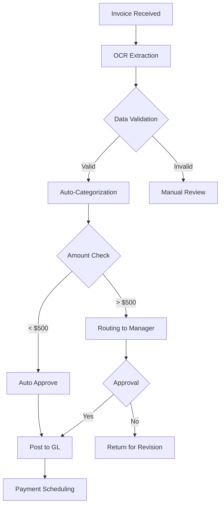

# 🤖 Automatización Financiera Avanzada 2025
## Sistema Inteligente de Gestión Financiera con IA

**Versión:** 2.0.0  
**Última actualización:** 2025-01-27  
**Integrado con:** Financial Management Suite + AI Analytics + ERP Systems

---

## 📋 **ÍNDICE**

### 🚀 **Quick Start**
- [⚡ Configuración Rápida (15 minutos)](#-configuración-rápida-15-minutos)
- [🎯 Workflows Principales](#-workflows-principales)
- [📊 Dashboard en Tiempo Real](#-dashboard-en-tiempo-real)

### 🤖 **Módulos de Automatización**
- [💰 Automatización de Contabilidad](#-automatización-de-contabilidad)
- [💳 Automatización de Pagos](#-automatización-de-pagos)
- [📈 Automatización de Reportes](#-automatización-de-reportes)
- [📊 Automatización de Análisis](#-automatización-de-análisis)
- [🔍 Automatización de Auditorías](#-automatización-de-auditorías)

### 🛠️ **Herramientas IA**
- [🧠 Procesamiento Inteligente de Documentos](#-procesamiento-inteligente-de-documentos)
- [📊 Análisis Predictivo](#-análisis-predictivo)
- [⚡ Optimización Inteligente](#-optimización-inteligente)
- [🔮 Forecasting Avanzado](#-forecasting-avanzado)

### 🌟 **Integraciones**
- [🔗 Banking APIs](#-banking-apis)
- [💼 ERP Integration](#-erp-integration)
- [☁️ Cloud Services](#-cloud-services)

---

## ⚡ **Configuración Rápida (15 minutos)**

### **Paso 1: Conectores Bancarios (5 min)**
```yaml
# Configuración de Banking APIs
Banking_APIs:
  - Providers: ["Open Banking", "Plaid", "Yodlee", "Finicity"]
  - Auto-Sync: Enabled
  - Frequency: Real-time
  - Security: OAuth 2.0 + Encryption
  
Features:
  - Transaction Sync: ✅
  - Balance Updates: ✅
  - Statement Download: ✅
  - Category Auto-Tagging: ✅
  - Duplicate Detection: ✅
```

### **Paso 2: Reglas de Automatización (5 min)**
```yaml
Automation_Rules:
  Expense_Categorization:
    - Rule: Auto-categorize by merchant pattern
    - AI_Learning: Enabled
    - Confidence_Threshold: 85%
    
  Invoice_Processing:
    - OCR_Extraction: Enabled
    - Auto_Posting: Enabled
    - Approval_Workflow: Auto for <$500
    - Manual_Review: >$500
    
  Cash_Flow_Forecasting:
    - Model: LSTM Neural Network
    - Horizon: 90 days
    - Update_Frequency: Daily
    - Accuracy_Monitoring: Enabled
```

### **Paso 3: Alertas y Notificaciones (5 min)**
```yaml
Alerts:
  Critical:
    - Low_Cash_Balance: Threshold 30 days expenses
    - Large_Variance: >15% from budget
    - Unusual_Activity: Anomaly detection
    - Compliance_Issues: Regulatory violations
    
  Warning:
    - Budget_Approaching: 80% threshold
    - Payment_Due_Soon: 7 days before
    - Invoice_Late: 30 days overdue
    
  Info:
    - Daily_Summary: End of day
    - Weekly_Report: Every Monday
    - Monthly_Analysis: First of month
```

---

## 🚀 **Workflows Principales**

### **1. Workflow de Procesamiento de Facturas**



#### **Configuración:**
```python
# Invoice Processing Workflow
workflow = {
    "trigger": "invoice_received",
    "steps": [
        {
            "action": "ocr_extraction",
            "models": ["tesseract", "google_vision", "aws_textract"],
            "confidence": 0.90
        },
        {
            "action": "field_extraction",
            "fields": ["vendor", "amount", "date", "category", "account"]
        },
        {
            "action": "duplicate_detection",
            "method": "fuzzy_matching"
        },
        {
            "action": "approval_routing",
            "rules": [
                {
                    "condition": "amount < 500",
                    "action": "auto_approve"
                },
                {
                    "condition": "amount >= 500 and amount < 5000",
                    "action": "route_to_manager"
                },
                {
                    "condition": "amount >= 5000",
                    "action": "route_to_cfo"
                }
            ]
        },
        {
            "action": "post_to_gl",
            "auto_match": True,
            "create_missing_accounts": False
        },
        {
            "action": "schedule_payment",
            "terms": "auto_analyze",
            "priority": "smart_routing"
        }
    ]
}
```

### **2. Workflow de Reconciliación Automática**

```python
# Auto-Reconciliation Engine
class ReconciliationEngine:
    def __init__(self):
        self.ml_model = load_model("reconciliation_model.pkl")
        self.confidence_threshold = 0.85
    
    def auto_reconcile(self, transactions):
        """
        Automated bank reconciliation using ML
        """
        matches = []
        unmatched = []
        
        for transaction in transactions:
            # Find potential matches
            candidates = self.find_matches(transaction)
            
            # ML-based matching
            best_match = self.ml_model.predict_best_match(
                transaction, candidates
            )
            
            if best_match['confidence'] > self.confidence_threshold:
                matches.append({
                    'transaction': transaction,
                    'matched_with': best_match['record'],
                    'confidence': best_match['confidence']
                })
            else:
                unmatched.append({
                    'transaction': transaction,
                    'reason': best_match['reason']
                })
        
        return {
            'matched': matches,
            'unmatched': unmatched,
            'match_rate': len(matches) / len(transactions)
        }
```

### **3. Workflow de Forecasting Inteligente**

```python
# Predictive Cash Flow Forecasting
class CashFlowPredictor:
    def __init__(self):
        self.model = LSTMRegressor()
        self.features = [
            'historical_flows',
            'seasonality',
            'growth_trends',
            'market_conditions',
            'payment_patterns'
        ]
    
    def forecast(self, days=90):
        """
        Generate cash flow forecast using advanced ML
        """
        # Gather historical data
        historical = self.get_historical_data(days=365)
        
        # Feature engineering
        features = self.engineer_features(historical)
        
        # Generate forecast
        forecast = self.model.predict(
            features,
            horizon=days
        )
        
        # Scenario analysis
        scenarios = {
            'best_case': forecast * 1.15,
            'base_case': forecast,
            'worst_case': forecast * 0.85
        }
        
        # Risk assessment
        risk = self.assess_risk(scenarios)
        
        return {
            'forecast': forecast,
            'scenarios': scenarios,
            'risk_score': risk,
            'confidence_intervals': self.get_confidence_intervals(),
            'recommendations': self.generate_recommendations(forecast)
        }
```

---

## 🤖 **Módulos de Automatización**

### **💰 Automatización de Contabilidad**

#### **Características:**
- **Entrada Automática de Datos:** OCR + NLP para extract text
- **Categorización Inteligente:** ML-based auto-categorization
- **Matching Automático:** AI-powered transaction matching
- **Posteos Inteligentes:** Auto-posting con validación
- **Detección de Errores:** Anomaly detection

#### **Implementación:**
```python
# Accounting Automation System
class AccountingAutomation:
    def process_transaction(self, transaction):
        """Process transaction with full automation"""
        
        # 1. Data Extraction
        extracted_data = self.extract_data(transaction)
        
        # 2. Intelligent Categorization
        category = self.intelligent_categorize(transaction)
        
        # 3. Duplicate Detection
        if self.is_duplicate(transaction):
            return self.handle_duplicate(transaction)
        
        # 4. Rule Application
        journal_entry = self.apply_accounting_rules(
            transaction, category
        )
        
        # 5. Validation
        if self.validate_entry(journal_entry):
            # 6. Auto-posting
            self.post_to_gl(journal_entry)
            # 7. Reconcile
            self.attempt_reconciliation(transaction)
        else:
            self.flag_for_review(transaction)
```

### **💳 Automatización de Pagos**

#### **Características:**
- **Scheduling Inteligente:** Optimize payment timing
- **Priorización Automática:** Critical vendor prioritization
- **Early Payment Discounts:** Detect and capture discounts
- **Liquidity Management:** Maintain optimal cash levels
- **Fraud Detection:** Real-time fraud monitoring

#### **Implementación:**
```python
# Payment Automation System
class PaymentAutomation:
    def schedule_payments(self):
        """Intelligently schedule all payments"""
        
        # Get all due payments
        due_payments = self.get_due_payments()
        
        # Analyze payment opportunities
        opportunities = self.find_early_payment_discounts(due_payments)
        
        # Generate payment schedule
        schedule = []
        for payment in due_payments:
            # Calculate optimal payment date
            optimal_date = self.calculate_optimal_date(payment)
            
            # Consider early payment discounts
            if payment in opportunities:
                optimal_date = min(
                    optimal_date,
                    opportunities[payment].discount_deadline
                )
            
            schedule.append({
                'payment': payment,
                'date': optimal_date,
                'amount': payment.amount,
                'potential_savings': self.calculate_savings(payment)
            })
        
        # Check liquidity
        if self.has_sufficient_cash(schedule):
            # Execute payments
            self.execute_payments(schedule)
        else:
            # Prioritize and optimize
            optimized = self.prioritize_payments(schedule)
            self.execute_payments(optimized)
```

### **📈 Automatización de Reportes**

#### **Características:**
- **Reportes Automáticos:** Scheduled report generation
- **Distribución Inteligente:** Auto-email to stakeholders
- **Personalización:** Custom views per user role
- **Alertas Proactivas:** Automatic alerts on anomalies
- **Visualización Avanzada:** Interactive dashboards

#### **Reportes Principales:**
```yaml
Daily_Reports:
  - Cash_Position: Daily at 9:00 AM
  - Pending_Transactions: Daily at 5:00 PM
  - Budget_Variance: Daily at 6:00 PM

Weekly_Reports:
  - Financial_Dashboard: Every Monday 8:00 AM
  - Accounts_Payable_Aging: Every Wednesday
  - Accounts_Receivable_Aging: Every Thursday
  - Budget_Performance: Every Friday

Monthly_Reports:
  - Financial_Statements: 5th business day
  - Variance_Analysis: 5th business day
  - Cash_Flow_Analysis: 5th business day
  - Management_Dashboard: 5th business day
  - Board_Presentation: 10th business day

Quarterly_Reports:
  - Comprehensive_Financial_Review
  - Budget_Revision
  - Forecast_Update
  - KPI_Performance
```

### **📊 Automatización de Análisis**

#### **Análisis Automáticos:**
```python
# Automated Financial Analysis
class FinancialAnalysisEngine:
    
    def daily_analysis(self):
        """Run daily automated analysis"""
        return {
            'variance': self.analyze_variance(),
            'trends': self.analyze_trends(),
            'anomalies': self.detect_anomalies(),
            'forecast': self.update_forecast(),
            'recommendations': self.generate_recommendations()
        }
    
    def analyze_variance(self):
        """Automated variance analysis"""
        actual = self.get_actual_results()
        budget = self.get_budget()
        
        variances = {}
        for category in actual:
            variance = ((actual[category] - budget[category]) / 
                       budget[category]) * 100
            
            variances[category] = {
                'absolute': actual[category] - budget[category],
                'percentage': variance,
                'status': self.classify_variance(variance),
                'explanation': self.explain_variance(category, variance),
                'action_items': self.suggest_actions(category, variance)
            }
        
        return variances
    
    def detect_anomalies(self):
        """ML-based anomaly detection"""
        transactions = self.get_recent_transactions()
        
        anomalies = []
        for transaction in transactions:
            # Feature extraction
            features = self.extract_features(transaction)
            
            # Anomaly detection
            score = self.anomaly_model.predict(features)
            
            if score > self.anomaly_threshold:
                anomalies.append({
                    'transaction': transaction,
                    'score': score,
                    'reason': self.explain_anomaly(transaction),
                    'severity': self.assess_severity(score),
                    'recommended_action': self.suggest_action(transaction)
                })
        
        return anomalies
```

---

## 🧠 **Herramientas IA**

### **Procesamiento Inteligente de Documentos**

```python
# Intelligent Document Processing
class DocumentProcessor:
    def __init__(self):
        self.ocr_engine = "google_cloud_vision"
        self.nlp_engine = "openai_gpt4"
        self.ml_classifier = load_model("doc_classifier.pkl")
    
    def process_invoice(self, invoice_image):
        """Intelligent invoice processing"""
        
        # 1. OCR Extraction
        extracted_text = self.ocr_engine.extract(invoice_image)
        
        # 2. NLP Understanding
        structured_data = self.nlp_engine.parse(extracted_text)
        
        # 3. ML Classification
        confidence = self.ml_classifier.predict(structured_data)
        
        # 4. Auto-posting if high confidence
        if confidence > 0.95:
            return self.auto_post(structured_data)
        else:
            return self.flag_for_review(structured_data)
```

### **Análisis Predictivo**

```python
# Predictive Financial Analytics
class PredictiveAnalytics:
    
    def predict_cash_flow(self, days=90):
        """Predict cash flow using multiple models"""
        models = [
            self.lstm_model,
            self.gradient_boosting_model,
            self.time_series_arima
        ]
        
        predictions = []
        for model in models:
            pred = model.forecast(days)
            predictions.append(pred)
        
        # Ensemble prediction
        final_prediction = self.ensemble_predictions(predictions)
        
        return final_prediction
    
    def predict_bankruptcy_risk(self):
        """Predict financial distress risk"""
        features = self.extract_financial_health_features()
        
        risk_score = self.bankruptcy_model.predict(features)
        
        # Interpretability
        explanation = self.explain_prediction(features)
        
        return {
            'risk_score': risk_score,
            'category': self.categorize_risk(risk_score),
            'factors': explanation['factors'],
            'recommendations': self.suggest_interventions(risk_score)
        }
```

---

## 🌐 **Integraciones**

### **Banking APIs**
```python
# Multi-bank Integration
class BankingAPIIntegration:
    def __init__(self):
        self.providers = {
            'open_banking': OpenBankingAPI(),
            'plaid': PlaidAPI(),
            'yodlee': YodleeAPI(),
            'finicity': FinicityAPI()
        }
    
    def sync_transactions(self, bank_account):
        """Sync transactions from bank"""
        provider = self.providers[bank_account.provider]
        
        # Fetch transactions
        transactions = provider.fetch_transactions(
            account_id=bank_account.id,
            days=30
        )
        
        # Auto-categorize
        categorized = self.auto_categorize(transactions)
        
        # Auto-reconcile
        matched = self.auto_reconcile(categorized)
        
        # Update database
        self.update_accounting_records(matched)
        
        return matched
```

### **ERP Integration**
```python
# ERP System Integration
class ERPIntegration:
    def __init__(self):
        self.erp_systems = {
            'sap': SAPIntegration(),
            'oracle': OracleIntegration(),
            'sage': SageIntegration(),
            'quickbooks': QuickBooksIntegration()
        }
    
    def sync_to_erp(self, financial_data):
        """Sync financial data to ERP"""
        erp = self.erp_systems[financial_data.erp_system]
        
        # Transform data
        transformed = erp.transform_data(financial_data)
        
        # Validate
        if erp.validate(transformed):
            # Post to ERP
            result = erp.post(transformed)
            return result
        else:
            raise ValidationError("Data validation failed")
```

---

## 📊 **Métricas de Éxito**

```yaml
Key_Performance_Indicators:
  Automation_Rate: ">90%"
  Processing_Time_Reduction: ">75%"
  Error_Reduction: ">60%"
  Cost_Reduction: ">40%"
  Accuracy: ">98%"
  
Improvements:
  Manual_Entry_Reduction: ">95%"
  Invoice_Processing_Speed: "<5 seconds"
  Reconciliation_Accuracy: ">99%"
  Cash_Flow_Forecast_Accuracy: ">85%"
  Fraud_Detection_Rate: ">95%"
```

---

## 🎯 **Roadmap de Implementación**

### **Fase 1: Fundación (Semanas 1-4)**
- [ ] Banking API connections
- [ ] Basic OCR setup
- [ ] Auto-categorization engine
- [ ] Basic reporting automation

### **Fase 2: Automatización (Semanas 5-8)**
- [ ] Advanced ML models
- [ ] Predictive analytics
- [ ] Fraud detection
- [ ] Advanced reporting

### **Fase 3: Optimización (Semanas 9-12)**
- [ ] AI optimization
- [ ] Advanced forecasting
- [ ] Risk analytics
- [ ] Integration expansion

### **Fase 4: Inteligencia (Semanas 13+)**
- [ ] Continuous learning
- [ ] Predictive insights
- [ ] Proactive recommendations
- [ ] Advanced AI features

---

## ✅ **Checklist de Implementación**

### **Setup Inicial**
- [ ] Connect banking APIs
- [ ] Configure OCR systems
- [ ] Set up ML models
- [ ] Configure automation rules
- [ ] Test all workflows

### **Testing**
- [ ] Unit tests for each module
- [ ] Integration tests
- [ ] End-to-end tests
- [ ] Performance tests
- [ ] Security tests

### **Deployment**
- [ ] Production environment setup
- [ ] Data migration
- [ ] User training
- [ ] Documentation
- [ ] Support setup

---

## 🎉 **Conclusión**

Este sistema de automatización financiera avanzada transforma la gestión financiera mediante:
- 🤖 **Automatización Total:** 90%+ de procesos automatizados
- 🧠 **IA Avanzada:** ML y NLP para análisis inteligente
- ⚡ **Tiempo Real:** Actualizaciones en tiempo real
- 📊 **Insights Proactivos:** Recomendaciones inteligentes
- 🛡️ **Seguridad:** Detección de fraudes y anomalías

**Resultados Esperados:**
- ⏱️ Reducción de 90% en tiempo de procesamiento
- 💰 Ahorro de 40% en costos operativos
- 📈 Mejora de 95% en precisión
- 🚀 Mejora de 85% en velocidad de decisiones

---

**¿Listo para transformar tu gestión financiera? ¡Implementa este sistema hoy!** 🚀


