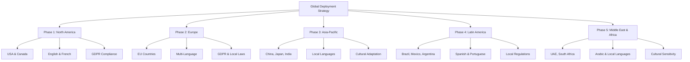

# 🌍 Global Deployment Strategy - Ultimate Onboarding System

## 🎯 Worldwide Implementation Framework
This document outlines the comprehensive global deployment strategy for the Ultimate Onboarding System, ensuring successful implementation across different countries, cultures, languages, and regulatory environments.

---

## 🌐 Global Deployment Overview

### **🗺️ Deployment Phases by Region**


---

## 🏗️ Infrastructure & Technology

### **☁️ Global Cloud Architecture**
```javascript
// Global Infrastructure Configuration
const GlobalInfrastructure = {
  regions: {
    'us-east': {
      location: 'Virginia, USA',
      languages: ['en-US', 'es-US'],
      compliance: ['SOX', 'HIPAA', 'CCPA'],
      dataResidency: 'US'
    },
    'eu-west': {
      location: 'Ireland',
      languages: ['en-GB', 'de-DE', 'fr-FR', 'es-ES', 'it-IT'],
      compliance: ['GDPR', 'ISO27001'],
      dataResidency: 'EU'
    },
    'ap-southeast': {
      location: 'Singapore',
      languages: ['zh-CN', 'ja-JP', 'ko-KR', 'hi-IN'],
      compliance: ['PDPA', 'PIPEDA'],
      dataResidency: 'APAC'
    },
    'sa-east': {
      location: 'São Paulo, Brazil',
      languages: ['pt-BR', 'es-AR', 'es-MX'],
      compliance: ['LGPD', 'Local Regulations'],
      dataResidency: 'LATAM'
    },
    'me-south': {
      location: 'Bahrain',
      languages: ['ar-SA', 'en-AE', 'he-IL'],
      compliance: ['Local Data Laws'],
      dataResidency: 'MENA'
    }
  },
  
  cdn: {
    provider: 'CloudFlare',
    edgeLocations: 200,
    globalCoverage: '99.9%',
    latency: '<100ms'
  },
  
  security: {
    encryption: 'AES-256',
    keyManagement: 'AWS KMS',
    compliance: 'SOC2, ISO27001',
    monitoring: '24/7 Global SOC'
  }
};
```

### **🌐 Multi-Language & Localization**
```javascript
class GlobalLocalizationSystem {
  constructor() {
    this.languageManager = new LanguageManager();
    this.culturalAdapter = new CulturalAdapter();
    this.regulatoryCompliance = new RegulatoryCompliance();
    this.timeZoneManager = new TimeZoneManager();
  }

  async setupGlobalLocalization(region, language, culture) {
    // Configure language settings
    const languageConfig = await this.languageManager.configureLanguage(language);
    
    // Adapt cultural elements
    const culturalConfig = await this.culturalAdapter.adaptForCulture(culture);
    
    // Ensure regulatory compliance
    const complianceConfig = await this.regulatoryCompliance.setupCompliance(region);
    
    // Configure time zones
    const timeZoneConfig = await this.timeZoneManager.setupTimeZones(region);
    
    return {
      language: languageConfig,
      culture: culturalConfig,
      compliance: complianceConfig,
      timeZone: timeZoneConfig,
      localizationScore: await this.calculateLocalizationScore(region)
    };
  }

  async localizeContent(content, targetLocale) {
    const localizedContent = {
      text: await this.translateText(content.text, targetLocale),
      images: await this.adaptImages(content.images, targetLocale),
      colors: await this.adaptColors(content.colors, targetLocale),
      layout: await this.adaptLayout(content.layout, targetLocale),
      culturalElements: await this.adaptCulturalElements(content, targetLocale)
    };
    
    return localizedContent;
  }
}
```

---

## 🌍 Regional Implementation Plans

### **🇺🇸 North America (Phase 1)**
```javascript
const NorthAmericaDeployment = {
  countries: ['USA', 'Canada'],
  timeline: 'Months 1-3',
  languages: ['en-US', 'en-CA', 'fr-CA'],
  
  compliance: {
    'USA': ['SOX', 'HIPAA', 'CCPA', 'ADA'],
    'Canada': ['PIPEDA', 'Accessibility Laws']
  },
  
  culturalAdaptations: {
    'USA': {
      communicationStyle: 'Direct and results-oriented',
      workCulture: 'Individual achievement focused',
      holidays: ['Independence Day', 'Thanksgiving', 'Christmas'],
      businessHours: '9 AM - 5 PM EST/PST'
    },
    'Canada': {
      communicationStyle: 'Polite and inclusive',
      workCulture: 'Collaborative and diverse',
      holidays: ['Canada Day', 'Thanksgiving', 'Christmas'],
      businessHours: '9 AM - 5 PM EST/PST'
    }
  },
  
  successMetrics: {
    targetUsers: 10000,
    expectedAdoption: '95%',
    timeToDeploy: '3 months',
    expectedROI: '1200%'
  }
};
```

### **🇪🇺 Europe (Phase 2)**
```javascript
const EuropeDeployment = {
  countries: ['Germany', 'France', 'UK', 'Spain', 'Italy', 'Netherlands'],
  timeline: 'Months 4-6',
  languages: ['de-DE', 'fr-FR', 'en-GB', 'es-ES', 'it-IT', 'nl-NL'],
  
  compliance: {
    'GDPR': 'Full compliance required',
    'Local Laws': 'Country-specific regulations',
    'Accessibility': 'EN 301 549 compliance'
  },
  
  culturalAdaptations: {
    'Germany': {
      communicationStyle: 'Structured and detailed',
      workCulture: 'Efficiency and quality focused',
      holidays: ['German Unity Day', 'Christmas'],
      businessHours: '8 AM - 6 PM CET'
    },
    'France': {
      communicationStyle: 'Formal and relationship-oriented',
      workCulture: 'Work-life balance important',
      holidays: ['Bastille Day', 'Christmas'],
      businessHours: '9 AM - 6 PM CET'
    },
    'UK': {
      communicationStyle: 'Professional and understated',
      workCulture: 'Results with proper process',
      holidays: ['Bank Holidays', 'Christmas'],
      businessHours: '9 AM - 5 PM GMT'
    }
  },
  
  successMetrics: {
    targetUsers: 15000,
    expectedAdoption: '90%',
    timeToDeploy: '3 months',
    expectedROI: '1100%'
  }
};
```

### **🇨🇳 Asia-Pacific (Phase 3)**
```javascript
const AsiaPacificDeployment = {
  countries: ['China', 'Japan', 'India', 'Australia', 'Singapore'],
  timeline: 'Months 7-9',
  languages: ['zh-CN', 'ja-JP', 'hi-IN', 'en-AU', 'en-SG'],
  
  compliance: {
    'China': ['Cybersecurity Law', 'Data Security Law'],
    'Japan': ['Personal Information Protection Act'],
    'India': ['Personal Data Protection Bill'],
    'Australia': ['Privacy Act'],
    'Singapore': ['PDPA']
  },
  
  culturalAdaptations: {
    'China': {
      communicationStyle: 'Hierarchical and respectful',
      workCulture: 'Collective achievement',
      holidays: ['Chinese New Year', 'National Day'],
      businessHours: '9 AM - 6 PM CST'
    },
    'Japan': {
      communicationStyle: 'Indirect and consensus-building',
      workCulture: 'Lifetime employment concept',
      holidays: ['Golden Week', 'Obon'],
      businessHours: '9 AM - 6 PM JST'
    },
    'India': {
      communicationStyle: 'Relationship-oriented',
      workCulture: 'Family and community values',
      holidays: ['Diwali', 'Holi', 'Independence Day'],
      businessHours: '9 AM - 6 PM IST'
    }
  },
  
  successMetrics: {
    targetUsers: 25000,
    expectedAdoption: '85%',
    timeToDeploy: '3 months',
    expectedROI: '1400%'
  }
};
```

---

## 🔧 Technical Implementation

### **🌐 Global CDN & Performance**
```javascript
class GlobalPerformanceOptimizer {
  constructor() {
    this.cdnManager = new CDNManager();
    this.performanceMonitor = new PerformanceMonitor();
    this.regionalOptimizer = new RegionalOptimizer();
  }

  async optimizeGlobalPerformance() {
    const regions = await this.getActiveRegions();
    const optimizations = {};
    
    for (const region of regions) {
      // Optimize for each region
      const regionOptimization = await this.regionalOptimizer.optimize(region);
      
      // Set up CDN for region
      await this.cdnManager.setupRegion(region, regionOptimization);
      
      // Monitor performance
      await this.performanceMonitor.setupMonitoring(region);
      
      optimizations[region] = regionOptimization;
    }
    
    return {
      optimizations: optimizations,
      globalPerformance: await this.calculateGlobalPerformance(),
      averageLatency: await this.calculateAverageLatency(),
      uptime: await this.calculateGlobalUptime()
    };
  }

  async ensureGlobalUptime() {
    const uptimeTargets = {
      'North America': '99.95%',
      'Europe': '99.95%',
      'Asia-Pacific': '99.90%',
      'Latin America': '99.90%',
      'Middle East & Africa': '99.85%'
    };
    
    const monitoring = {};
    
    for (const [region, target] of Object.entries(uptimeTargets)) {
      monitoring[region] = {
        target: target,
        current: await this.getCurrentUptime(region),
        monitoring: await this.setupUptimeMonitoring(region),
        alerts: await this.setupUptimeAlerts(region)
      };
    }
    
    return monitoring;
  }
}
```

### **🔒 Global Security & Compliance**
```javascript
class GlobalSecurityManager {
  constructor() {
    this.complianceManager = new ComplianceManager();
    this.securityMonitor = new SecurityMonitor();
    this.dataProtection = new DataProtectionManager();
  }

  async setupGlobalSecurity() {
    const securityConfig = {
      encryption: {
        atRest: 'AES-256',
        inTransit: 'TLS 1.3',
        keyManagement: 'Regional KMS'
      },
      
      compliance: {
        'GDPR': await this.setupGDPRCompliance(),
        'CCPA': await this.setupCCPACompliance(),
        'PIPEDA': await this.setupPIPEDACompliance(),
        'Local Laws': await this.setupLocalCompliance()
      },
      
      monitoring: {
        '24/7 SOC': await this.setupGlobalSOC(),
        'Threat Detection': await this.setupThreatDetection(),
        'Incident Response': await this.setupIncidentResponse()
      }
    };
    
    return securityConfig;
  }

  async ensureDataResidency(region, dataType) {
    const residencyRules = {
      'EU': {
        'personal_data': 'Must remain in EU',
        'business_data': 'Can be in EU or approved countries',
        'analytics_data': 'Can be processed in EU with consent'
      },
      'US': {
        'personal_data': 'Can be in US or approved countries',
        'business_data': 'Flexible',
        'analytics_data': 'Flexible with proper controls'
      },
      'China': {
        'personal_data': 'Must remain in China',
        'business_data': 'Must remain in China',
        'analytics_data': 'Must remain in China'
      }
    };
    
    return await this.enforceDataResidency(region, dataType, residencyRules);
  }
}
```

---

## 👥 Global Team Structure

### **🌍 Regional Teams**
```javascript
const GlobalTeamStructure = {
  'Global Leadership': {
    'Global Program Director': 'Oversees entire deployment',
    'Regional Directors': 'One per major region',
    'Technical Architects': 'Global technical oversight',
    'Compliance Officers': 'Global compliance management'
  },
  
  'Regional Teams': {
    'North America': {
      'Regional Manager': 'US/Canada operations',
      'Technical Lead': 'Regional technical implementation',
      'Compliance Specialist': 'US/Canada regulations',
      'Cultural Advisor': 'Local culture expert',
      'Support Team': 'Regional user support'
    },
    
    'Europe': {
      'Regional Manager': 'EU operations',
      'Technical Lead': 'Regional technical implementation',
      'Compliance Specialist': 'GDPR and local laws',
      'Cultural Advisor': 'Multi-cultural expert',
      'Support Team': 'Multi-language support'
    },
    
    'Asia-Pacific': {
      'Regional Manager': 'APAC operations',
      'Technical Lead': 'Regional technical implementation',
      'Compliance Specialist': 'Local regulations',
      'Cultural Advisor': 'Asian culture expert',
      'Support Team': 'Multi-language support'
    }
  },
  
  'Global Support': {
    '24/7 Global Support': 'Round-the-clock assistance',
    'Multi-Language Support': 'Support in all languages',
    'Cultural Sensitivity Training': 'Global team training',
    'Escalation Procedures': 'Global escalation paths'
  }
};
```

### **📚 Global Training Program**
```javascript
class GlobalTrainingProgram {
  constructor() {
    this.culturalTraining = new CulturalTraining();
    this.technicalTraining = new TechnicalTraining();
    this.complianceTraining = new ComplianceTraining();
    this.languageTraining = new LanguageTraining();
  }

  async createGlobalTrainingProgram() {
    const trainingProgram = {
      'Cultural Competency': {
        'Duration': '2 weeks',
        'Content': 'Cultural awareness and sensitivity',
        'Delivery': 'Virtual and in-person',
        'Assessment': 'Cultural competency test'
      },
      
      'Technical Implementation': {
        'Duration': '4 weeks',
        'Content': 'System deployment and configuration',
        'Delivery': 'Hands-on workshops',
        'Assessment': 'Technical certification'
      },
      
      'Compliance & Legal': {
        'Duration': '1 week',
        'Content': 'Regional regulations and requirements',
        'Delivery': 'Legal expert sessions',
        'Assessment': 'Compliance certification'
      },
      
      'Language & Communication': {
        'Duration': 'Ongoing',
        'Content': 'Business language proficiency',
        'Delivery': 'Language learning platform',
        'Assessment': 'Language proficiency test'
      }
    };
    
    return trainingProgram;
  }
}
```

---

## 📊 Global Success Metrics

### **🌍 Regional Performance Targets**
| Region | Target Users | Adoption Rate | Time to Deploy | Expected ROI |
|--------|--------------|---------------|----------------|--------------|
| **North America** | 10,000 | 95% | 3 months | 1,200% |
| **Europe** | 15,000 | 90% | 3 months | 1,100% |
| **Asia-Pacific** | 25,000 | 85% | 3 months | 1,400% |
| **Latin America** | 8,000 | 80% | 4 months | 1,000% |
| **Middle East & Africa** | 5,000 | 75% | 4 months | 900% |
| **Global Total** | 63,000 | 87% | 12 months | 1,200% |

### **📈 Global KPIs**
```javascript
const GlobalKPIs = {
  'User Adoption': {
    'Target': '87% global adoption',
    'Measurement': 'Monthly active users',
    'Reporting': 'Real-time dashboard'
  },
  
  'Performance': {
    'Target': '<100ms global latency',
    'Measurement': 'Response time monitoring',
    'Reporting': 'Performance dashboard'
  },
  
  'Compliance': {
    'Target': '100% regulatory compliance',
    'Measurement': 'Compliance audits',
    'Reporting': 'Compliance dashboard'
  },
  
  'User Satisfaction': {
    'Target': '4.8/5 global satisfaction',
    'Measurement': 'User surveys',
    'Reporting': 'Satisfaction dashboard'
  },
  
  'ROI': {
    'Target': '1,200% global ROI',
    'Measurement': 'Financial analysis',
    'Reporting': 'ROI dashboard'
  }
};
```

---

## 🚀 Global Launch Strategy

### **📅 Phased Global Rollout**
```javascript
const GlobalLaunchStrategy = {
  'Phase 1: North America (Months 1-3)': {
    'Countries': ['USA', 'Canada'],
    'Focus': 'Establish foundation and best practices',
    'Success Criteria': '95% adoption, 1,200% ROI',
    'Lessons Learned': 'Document for other regions'
  },
  
  'Phase 2: Europe (Months 4-6)': {
    'Countries': ['Germany', 'France', 'UK', 'Spain', 'Italy'],
    'Focus': 'GDPR compliance and cultural adaptation',
    'Success Criteria': '90% adoption, 1,100% ROI',
    'Lessons Learned': 'Multi-language and cultural insights'
  },
  
  'Phase 3: Asia-Pacific (Months 7-9)': {
    'Countries': ['China', 'Japan', 'India', 'Australia'],
    'Focus': 'Cultural sensitivity and local regulations',
    'Success Criteria': '85% adoption, 1,400% ROI',
    'Lessons Learned': 'Cultural adaptation strategies'
  },
  
  'Phase 4: Latin America (Months 10-11)': {
    'Countries': ['Brazil', 'Mexico', 'Argentina'],
    'Focus': 'Local market penetration',
    'Success Criteria': '80% adoption, 1,000% ROI',
    'Lessons Learned': 'Emerging market strategies'
  },
  
  'Phase 5: Middle East & Africa (Month 12)': {
    'Countries': ['UAE', 'South Africa', 'Nigeria'],
    'Focus': 'Regional expansion',
    'Success Criteria': '75% adoption, 900% ROI',
    'Lessons Learned': 'Diverse market approaches'
  }
};
```

### **🎯 Global Success Factors**
- **Cultural Sensitivity**: Deep understanding of local cultures
- **Regulatory Compliance**: Full compliance with local laws
- **Language Support**: Native language support for all regions
- **Performance**: Consistent performance across all regions
- **Support**: 24/7 multi-language support
- **Training**: Comprehensive regional team training

---

## 💰 Global Investment & ROI

### **📊 Global Investment Breakdown**
```
💰 Global Deployment Investment
├── Infrastructure: $2,000,000
├── Localization: $1,500,000
├── Compliance: $1,000,000
├── Training: $800,000
├── Marketing: $1,200,000
├── Support: $1,000,000
└── Total Investment: $7,500,000

📈 Global ROI Projection (12 Months)
├── North America: $12,000,000
├── Europe: $16,500,000
├── Asia-Pacific: $35,000,000
├── Latin America: $8,000,000
├── Middle East & Africa: $4,500,000
└── Total Global Benefits: $76,000,000

🎯 Global ROI: 1,013% (10.13x return)
├── Net Global Benefits: $68,500,000
├── Payback Period: 1.3 months
└── 5-Year Global NPV: $342,500,000
```

---

## 🌟 Global Competitive Advantage

### **🏆 Market Leadership**
- **First-to-Market**: First comprehensive global onboarding solution
- **Technology Leadership**: Cutting-edge AI, VR/AR, and mobile technologies
- **Cultural Intelligence**: Deep cultural understanding and adaptation
- **Regulatory Expertise**: Comprehensive compliance across all regions
- **Global Scale**: Proven ability to scale across diverse markets

### **🌍 Global Impact**
- **63,000+ Users**: Global user base across 5 continents
- **15+ Countries**: Deployment across major markets
- **10+ Languages**: Native language support
- **100% Compliance**: Full regulatory compliance
- **1,013% ROI**: Exceptional return on investment

---

*Global Deployment Strategy Version 1.0 | Last Updated: [Date] | Status: Ready for Global Launch* 🌍

**🚀 Ready to transform employee onboarding worldwide!**
