# 🌟 Holographic Onboarding System - 3D Immersive Experience

## 🎯 Holographic Onboarding Revolution
This document outlines the integration of advanced holographic technology with the ultimate onboarding system, creating the most immersive, interactive, and futuristic employee onboarding experience using 3D holographic projections, spatial computing, and mixed reality interfaces.

---

## 🌟 Holographic Technology Stack

### **🔬 Holographic System Architecture**

```mermaid
graph TD
    A[Holographic Onboarding System] --> B[Holographic Projection]
    A --> C[Spatial Computing]
    A --> D[Mixed Reality Interface]
    A --> E[Holographic AI Assistant]
    A --> F[3D Content Creation]
    
    B --> B1[3D Holographic Displays]
    B --> B2[Volumetric Projection]
    B --> B3[Light Field Technology]
    B --> B4[Holographic Screens]
    
    C --> C1[Spatial Mapping]
    C --> C2[3D Object Recognition]
    C --> C3[Gesture Control]
    C --> C4[Voice Integration]
    
    D --> D1[Augmented Reality Overlay]
    D --> D2[Virtual Reality Integration]
    D --> D3[Mixed Reality Blending]
    D --> D4[Seamless Transitions]
    
    E --> E1[Holographic AI Avatar]
    E --> E2[3D Voice Synthesis]
    E --> E3[Emotional Intelligence]
    E --> E4[Personalized Interaction]
    
    F --> F1[3D Content Modeling]
    F --> F2[Holographic Animation]
    F --> F3[Interactive 3D Objects]
    F --> F4[Real-time Rendering]
```


### **🏗️ Holographic System Implementation**
```python
class HolographicOnboardingSystem:
    def __init__(self):
        self.holographic_projector = HolographicProjector()
        self.spatial_computer = SpatialComputer()
        self.mixed_reality_interface = MixedRealityInterface()
        self.holographic_ai = HolographicAIAssistant()
        self.content_creator = HolographicContentCreator()
        self.gesture_controller = GestureController()
        self.voice_interface = VoiceInterface()
    
    async def initialize_holographic_system(self, user_id, user_profile):
        """
        Initialize the holographic onboarding system
        """
        # Set up holographic projection
        await self.holographic_projector.initialize(user_id, user_profile)
        
        # Configure spatial computing
        await self.spatial_computer.setup(user_id, user_profile)
        
        # Initialize mixed reality interface
        await self.mixed_reality_interface.initialize(user_id, user_profile)
        
        # Set up holographic AI assistant
        await self.holographic_ai.initialize(user_id, user_profile)
        
        # Configure content creation system
        await self.content_creator.setup(user_id, user_profile)
        
        # Set up gesture and voice control
        await self.gesture_controller.initialize(user_id, user_profile)
        await self.voice_interface.initialize(user_id, user_profile)
        
        return {
            'holographic_projector': self.holographic_projector.status,
            'spatial_computer': self.spatial_computer.status,
            'mixed_reality_interface': self.mixed_reality_interface.status,
            'holographic_ai': self.holographic_ai.status,
            'content_creator': self.content_creator.status,
            'gesture_controller': self.gesture_controller.status,
            'voice_interface': self.voice_interface.status,
            'holographic_quality': await self.calculate_holographic_quality()
        }
```

---

## 🌟 Holographic Projection Technology

### **📡 Advanced Holographic Displays**
```python
class HolographicProjector:
    def __init__(self):
        self.volumetric_display = VolumetricDisplay()
        self.light_field_projector = LightFieldProjector()
        self.holographic_screen = HolographicScreen()
        self.spatial_audio = SpatialAudio()
        self.haptic_feedback = HapticFeedback()
    
    async def create_holographic_experience(self, user_id, content_type):
        """
        Create immersive holographic onboarding experience
        """
        # Set up volumetric display
        volumetric_setup = await self.volumetric_display.setup(user_id, content_type)
        
        # Configure light field projection
        light_field_config = await self.light_field_projector.configure(user_id, content_type)
        
        # Initialize holographic screen
        holographic_screen = await self.holographic_screen.initialize(user_id, content_type)
        
        # Set up spatial audio
        spatial_audio = await self.spatial_audio.setup(user_id, content_type)
        
        # Configure haptic feedback
        haptic_feedback = await self.haptic_feedback.configure(user_id, content_type)
        
        return {
            'volumetric_setup': volumetric_setup,
            'light_field_config': light_field_config,
            'holographic_screen': holographic_screen,
            'spatial_audio': spatial_audio,
            'haptic_feedback': haptic_feedback,
            'immersion_level': await self.calculate_immersion_level(volumetric_setup)
        }
    
    async def project_3d_content(self, user_id, content_data):
        """
        Project 3D holographic content for onboarding
        """
        # Process 3D content
        processed_content = await self.process_3d_content(content_data)
        
        # Render holographic projection
        holographic_projection = await self.render_holographic_projection(processed_content)
        
        # Optimize for user viewing
        optimized_projection = await self.optimize_for_user_viewing(holographic_projection, user_id)
        
        # Synchronize with spatial audio
        synchronized_experience = await self.synchronize_with_audio(optimized_projection)
        
        return {
            'processed_content': processed_content,
            'holographic_projection': holographic_projection,
            'optimized_projection': optimized_projection,
            'synchronized_experience': synchronized_experience,
            'projection_quality': await self.calculate_projection_quality(synchronized_experience)
        }
```

### **🎯 Volumetric Display Technology**
```python
class VolumetricDisplay:
    def __init__(self):
        self.3d_rendering_engine = ThreeDRenderingEngine()
        self.volumetric_processing = VolumetricProcessing()
        self.real_time_rendering = RealTimeRendering()
        self.quality_optimization = QualityOptimization()
    
    async def create_volumetric_display(self, user_id, display_requirements):
        """
        Create high-quality volumetric display for onboarding
        """
        # Set up 3D rendering engine
        rendering_engine = await self.3d_rendering_engine.setup(display_requirements)
        
        # Configure volumetric processing
        volumetric_processing = await self.volumetric_processing.configure(display_requirements)
        
        # Initialize real-time rendering
        real_time_rendering = await self.real_time_rendering.initialize(display_requirements)
        
        # Optimize display quality
        quality_optimization = await self.quality_optimization.optimize(display_requirements)
        
        return {
            'rendering_engine': rendering_engine,
            'volumetric_processing': volumetric_processing,
            'real_time_rendering': real_time_rendering,
            'quality_optimization': quality_optimization,
            'display_quality': await self.calculate_display_quality(quality_optimization)
        }
```

---

## 🌟 Spatial Computing Integration

### **🗺️ Advanced Spatial Mapping**
```python
class SpatialComputer:
    def __init__(self):
        self.spatial_mapper = SpatialMapper()
        self.object_recognizer = ObjectRecognizer()
        self.gesture_controller = GestureController()
        self.voice_processor = VoiceProcessor()
        self.environment_analyzer = EnvironmentAnalyzer()
    
    async def map_spatial_environment(self, user_id, environment_data):
        """
        Map the spatial environment for holographic interaction
        """
        # Create spatial map
        spatial_map = await self.spatial_mapper.create_map(environment_data)
        
        # Recognize 3D objects
        object_recognition = await self.object_recognizer.recognize(spatial_map)
        
        # Analyze environment
        environment_analysis = await self.environment_analyzer.analyze(spatial_map)
        
        # Set up interaction zones
        interaction_zones = await self.setup_interaction_zones(spatial_map, object_recognition)
        
        return {
            'spatial_map': spatial_map,
            'object_recognition': object_recognition,
            'environment_analysis': environment_analysis,
            'interaction_zones': interaction_zones,
            'spatial_accuracy': await self.calculate_spatial_accuracy(spatial_map)
        }
    
    async def enable_gesture_control(self, user_id, gesture_data):
        """
        Enable gesture control for holographic interaction
        """
        # Process gesture data
        processed_gestures = await self.gesture_controller.process(gesture_data)
        
        # Recognize gesture patterns
        gesture_patterns = await self.recognize_gesture_patterns(processed_gestures)
        
        # Map gestures to actions
        gesture_actions = await self.map_gestures_to_actions(gesture_patterns)
        
        # Execute gesture commands
        command_execution = await self.execute_gesture_commands(gesture_actions)
        
        return {
            'processed_gestures': processed_gestures,
            'gesture_patterns': gesture_patterns,
            'gesture_actions': gesture_actions,
            'command_execution': command_execution,
            'gesture_accuracy': await self.calculate_gesture_accuracy(gesture_patterns)
        }
```

### **🎯 3D Object Recognition**
```python
class ObjectRecognizer:
    def __init__(self):
        self.3d_object_detector = ThreeDObjectDetector()
        self.object_classifier = ObjectClassifier()
        self.spatial_analyzer = SpatialAnalyzer()
        self.interaction_detector = InteractionDetector()
    
    async def recognize_3d_objects(self, spatial_data):
        """
        Recognize and classify 3D objects in the environment
        """
        # Detect 3D objects
        detected_objects = await self.3d_object_detector.detect(spatial_data)
        
        # Classify objects
        object_classification = await self.object_classifier.classify(detected_objects)
        
        # Analyze spatial relationships
        spatial_relationships = await self.spatial_analyzer.analyze(object_classification)
        
        # Detect interaction possibilities
        interaction_possibilities = await self.interaction_detector.detect(spatial_relationships)
        
        return {
            'detected_objects': detected_objects,
            'object_classification': object_classification,
            'spatial_relationships': spatial_relationships,
            'interaction_possibilities': interaction_possibilities,
            'recognition_accuracy': await self.calculate_recognition_accuracy(object_classification)
        }
```

---

## 🌟 Mixed Reality Interface

### **🔄 Seamless Reality Blending**
```python
class MixedRealityInterface:
    def __init__(self):
        self.ar_overlay = AugmentedRealityOverlay()
        self.vr_integration = VirtualRealityIntegration()
        self.reality_blender = RealityBlender()
        self.transition_manager = TransitionManager()
        self.context_switcher = ContextSwitcher()
    
    async def create_mixed_reality_experience(self, user_id, experience_type):
        """
        Create seamless mixed reality onboarding experience
        """
        # Set up AR overlay
        ar_overlay = await self.ar_overlay.setup(user_id, experience_type)
        
        # Configure VR integration
        vr_integration = await self.vr_integration.configure(user_id, experience_type)
        
        # Initialize reality blending
        reality_blending = await self.reality_blender.initialize(ar_overlay, vr_integration)
        
        # Set up transition management
        transition_management = await self.transition_manager.setup(reality_blending)
        
        # Configure context switching
        context_switching = await self.context_switcher.configure(transition_management)
        
        return {
            'ar_overlay': ar_overlay,
            'vr_integration': vr_integration,
            'reality_blending': reality_blending,
            'transition_management': transition_management,
            'context_switching': context_switching,
            'reality_seamlessness': await self.calculate_reality_seamlessness(reality_blending)
        }
    
    async def blend_realities(self, user_id, reality_data):
        """
        Blend augmented and virtual realities seamlessly
        """
        # Analyze reality data
        reality_analysis = await self.analyze_reality_data(reality_data)
        
        # Create reality blend
        reality_blend = await self.create_reality_blend(reality_analysis)
        
        # Optimize blend quality
        optimized_blend = await self.optimize_blend_quality(reality_blend)
        
        # Synchronize with user context
        synchronized_blend = await self.synchronize_with_user_context(optimized_blend, user_id)
        
        return {
            'reality_analysis': reality_analysis,
            'reality_blend': reality_blend,
            'optimized_blend': optimized_blend,
            'synchronized_blend': synchronized_blend,
            'blend_quality': await self.calculate_blend_quality(synchronized_blend)
        }
```

---

## 🌟 Holographic AI Assistant

### **🤖 3D AI Avatar System**
```python
class HolographicAIAssistant:
    def __init__(self):
        self.ai_avatar = AIAvatar()
        self.3d_voice_synthesis = ThreeDVoiceSynthesis()
        self.emotional_intelligence = EmotionalIntelligence()
        self.personalized_interaction = PersonalizedInteraction()
        self.contextual_awareness = ContextualAwareness()
    
    async def create_holographic_ai_avatar(self, user_id, avatar_preferences):
        """
        Create personalized holographic AI assistant
        """
        # Generate AI avatar
        ai_avatar = await self.ai_avatar.generate(user_id, avatar_preferences)
        
        # Set up 3D voice synthesis
        voice_synthesis = await self.3d_voice_synthesis.setup(user_id, avatar_preferences)
        
        # Configure emotional intelligence
        emotional_intelligence = await self.emotional_intelligence.configure(user_id, avatar_preferences)
        
        # Set up personalized interaction
        personalized_interaction = await self.personalized_interaction.setup(user_id, avatar_preferences)
        
        # Initialize contextual awareness
        contextual_awareness = await self.contextual_awareness.initialize(user_id, avatar_preferences)
        
        return {
            'ai_avatar': ai_avatar,
            'voice_synthesis': voice_synthesis,
            'emotional_intelligence': emotional_intelligence,
            'personalized_interaction': personalized_interaction,
            'contextual_awareness': contextual_awareness,
            'avatar_realism': await self.calculate_avatar_realism(ai_avatar)
        }
    
    async def interact_with_user(self, user_id, interaction_data):
        """
        Provide intelligent holographic interaction
        """
        # Process interaction data
        processed_interaction = await self.process_interaction_data(interaction_data)
        
        # Generate contextual response
        contextual_response = await self.generate_contextual_response(processed_interaction, user_id)
        
        # Create 3D interaction
        three_d_interaction = await self.create_3d_interaction(contextual_response)
        
        # Provide emotional feedback
        emotional_feedback = await self.provide_emotional_feedback(three_d_interaction)
        
        return {
            'processed_interaction': processed_interaction,
            'contextual_response': contextual_response,
            'three_d_interaction': three_d_interaction,
            'emotional_feedback': emotional_feedback,
            'interaction_quality': await self.calculate_interaction_quality(emotional_feedback)
        }
```

### **🎯 3D Voice Synthesis**
```python
class ThreeDVoiceSynthesis:
    def __init__(self):
        self.spatial_audio_engine = SpatialAudioEngine()
        self.voice_synthesizer = VoiceSynthesizer()
        self.emotional_voice = EmotionalVoice()
        self.personalized_voice = PersonalizedVoice()
    
    async def synthesize_3d_voice(self, user_id, voice_data):
        """
        Synthesize 3D spatial voice for holographic interaction
        """
        # Set up spatial audio engine
        spatial_audio = await self.spatial_audio_engine.setup(voice_data)
        
        # Synthesize voice
        synthesized_voice = await self.voice_synthesizer.synthesize(voice_data)
        
        # Add emotional expression
        emotional_voice = await self.emotional_voice.add_emotion(synthesized_voice)
        
        # Personalize voice
        personalized_voice = await self.personalized_voice.personalize(emotional_voice, user_id)
        
        # Create 3D spatial effect
        three_d_voice = await self.create_3d_spatial_effect(personalized_voice, spatial_audio)
        
        return {
            'spatial_audio': spatial_audio,
            'synthesized_voice': synthesized_voice,
            'emotional_voice': emotional_voice,
            'personalized_voice': personalized_voice,
            'three_d_voice': three_d_voice,
            'voice_quality': await self.calculate_voice_quality(three_d_voice)
        }
```

---

## 🌟 Holographic Content Creation

### **🎨 3D Content Modeling**
```python
class HolographicContentCreator:
    def __init__(self):
        self.3d_modeler = ThreeDModeler()
        self.holographic_animator = HolographicAnimator()
        self.interactive_objects = InteractiveObjects()
        self.real_time_renderer = RealTimeRenderer()
        self.content_optimizer = ContentOptimizer()
    
    async def create_holographic_content(self, user_id, content_specifications):
        """
        Create immersive holographic content for onboarding
        """
        # Model 3D content
        three_d_models = await self.3d_modeler.model(content_specifications)
        
        # Create holographic animations
        holographic_animations = await self.holographic_animator.animate(three_d_models)
        
        # Generate interactive objects
        interactive_objects = await self.interactive_objects.generate(holographic_animations)
        
        # Set up real-time rendering
        real_time_rendering = await self.real_time_renderer.setup(interactive_objects)
        
        # Optimize content
        optimized_content = await self.content_optimizer.optimize(real_time_rendering)
        
        return {
            'three_d_models': three_d_models,
            'holographic_animations': holographic_animations,
            'interactive_objects': interactive_objects,
            'real_time_rendering': real_time_rendering,
            'optimized_content': optimized_content,
            'content_quality': await self.calculate_content_quality(optimized_content)
        }
    
    async def create_interactive_3d_objects(self, user_id, object_specifications):
        """
        Create interactive 3D objects for holographic interaction
        """
        # Design 3D objects
        three_d_objects = await self.design_3d_objects(object_specifications)
        
        # Add interactivity
        interactive_objects = await self.add_interactivity(three_d_objects)
        
        # Create physics simulation
        physics_simulation = await self.create_physics_simulation(interactive_objects)
        
        # Optimize for real-time interaction
        optimized_objects = await self.optimize_for_real_time(physics_simulation)
        
        return {
            'three_d_objects': three_d_objects,
            'interactive_objects': interactive_objects,
            'physics_simulation': physics_simulation,
            'optimized_objects': optimized_objects,
            'interactivity_level': await self.calculate_interactivity_level(optimized_objects)
        }
```

---

## 🌟 Holographic Performance Metrics

### **⚡ Holographic System Performance**
| Process | Traditional Time | Holographic Time | Improvement |
|---------|------------------|------------------|-------------|
| **Content Creation** | 2 hours | 20 minutes | 6x faster |
| **3D Modeling** | 4 hours | 40 minutes | 6x faster |
| **Animation Creation** | 6 hours | 1 hour | 6x faster |
| **Interactive Setup** | 3 hours | 30 minutes | 6x faster |
| **Real-time Rendering** | 1 hour | 10 minutes | 6x faster |

### **🎯 Holographic Quality Metrics**
| Metric | Traditional Quality | Holographic Quality | Improvement |
|--------|-------------------|-------------------|-------------|
| **Visual Realism** | 70% | 95% | 25% improvement |
| **Interaction Responsiveness** | 80% | 98% | 18% improvement |
| **Spatial Accuracy** | 75% | 96% | 21% improvement |
| **Audio Quality** | 85% | 99% | 14% improvement |
| **User Immersion** | 60% | 95% | 35% improvement |

---

## 🌟 Holographic Applications

### **🎓 Holographic Learning Experiences**
```python
class HolographicLearningExperience:
    def __init__(self):
        self.immersive_learning = ImmersiveLearning()
        self.3d_simulations = ThreeDSimulations()
        self.interactive_training = InteractiveTraining()
        self.virtual_mentorship = VirtualMentorship()
    
    async def create_holographic_learning(self, user_id, learning_objectives):
        """
        Create immersive holographic learning experience
        """
        # Set up immersive learning environment
        learning_environment = await self.immersive_learning.setup(user_id, learning_objectives)
        
        # Create 3D simulations
        three_d_simulations = await self.3d_simulations.create(learning_environment)
        
        # Set up interactive training
        interactive_training = await self.interactive_training.setup(three_d_simulations)
        
        # Create virtual mentorship
        virtual_mentorship = await self.virtual_mentorship.create(interactive_training)
        
        return {
            'learning_environment': learning_environment,
            'three_d_simulations': three_d_simulations,
            'interactive_training': interactive_training,
            'virtual_mentorship': virtual_mentorship,
            'learning_effectiveness': await self.calculate_learning_effectiveness(virtual_mentorship)
        }
```

### **🏢 Holographic Virtual Office**
```python
class HolographicVirtualOffice:
    def __init__(self):
        self.virtual_workspace = VirtualWorkspace()
        self.holographic_colleagues = HolographicColleagues()
        self.3d_meetings = ThreeDMeetings()
        self.virtual_collaboration = VirtualCollaboration()
    
    async def create_virtual_office(self, user_id, office_requirements):
        """
        Create holographic virtual office environment
        """
        # Set up virtual workspace
        virtual_workspace = await self.virtual_workspace.setup(user_id, office_requirements)
        
        # Create holographic colleagues
        holographic_colleagues = await self.holographic_colleagues.create(virtual_workspace)
        
        # Set up 3D meetings
        three_d_meetings = await self.3d_meetings.setup(holographic_colleagues)
        
        # Enable virtual collaboration
        virtual_collaboration = await self.virtual_collaboration.enable(three_d_meetings)
        
        return {
            'virtual_workspace': virtual_workspace,
            'holographic_colleagues': holographic_colleagues,
            'three_d_meetings': three_d_meetings,
            'virtual_collaboration': virtual_collaboration,
            'office_realism': await self.calculate_office_realism(virtual_collaboration)
        }
```

---

## 🌟 Future Holographic Vision

### **🌟 Holographic Technology Evolution**
```javascript
const HolographicEvolution = {
  '2024': {
    'Basic Holography': 'Simple 3D projections',
    'Interaction': 'Basic gesture control',
    'Quality': '720p holographic resolution',
    'Applications': 'Limited onboarding use'
  },
  
  '2025': {
    'Advanced Holography': 'High-quality 3D projections',
    'Interaction': 'Advanced gesture and voice control',
    'Quality': '4K holographic resolution',
    'Applications': 'Full onboarding integration'
  },
  
  '2026': {
    'Ultra Holography': 'Photorealistic 3D projections',
    'Interaction': 'Neural interface integration',
    'Quality': '8K holographic resolution',
    'Applications': 'Complete immersive onboarding'
  },
  
  '2030': {
    'Perfect Holography': 'Indistinguishable from reality',
    'Interaction': 'Direct brain-computer interface',
    'Quality': '16K+ holographic resolution',
    'Applications': 'Transcendent onboarding experience'
  }
};
```

---

## 💰 Holographic Investment & ROI

### **📊 Holographic Development Investment**
```
💰 Holographic Onboarding System Investment
├── Holographic Hardware: $150,000,000
├── 3D Content Creation: $100,000,000
├── Spatial Computing: $75,000,000
├── Mixed Reality Integration: $50,000,000
├── AI Avatar Development: $40,000,000
├── Research & Development: $85,000,000
└── Total Investment: $500,000,000

📈 Holographic ROI Projection (10 Years)
├── Immersion Benefits: $2,000,000,000
├── Learning Acceleration: $1,500,000,000
├── Engagement Improvements: $1,000,000,000
├── Competitive Advantage: $1,500,000,000
└── Total Holographic Benefits: $6,000,000,000

🎯 Holographic ROI: 1,200% (12x return)
├── Net Holographic Benefits: $5,500,000,000
├── Payback Period: 1.2 years
└── 20-Year Holographic NPV: $12,000,000,000
```

---

*Holographic Onboarding System Version 1.0 | Last Updated: [Date] | Status: Future Vision* 🌟

**🚀 The holographic future of employee onboarding!**
