# 🌌 Omniversal Onboarding System - Beyond All Dimensions

## 🌟 The Ultimate Omniversal Experience
This document presents the most advanced, revolutionary, and omniversal employee onboarding system that transcends all dimensions, realities, and universes, creating an onboarding experience that exists across infinite dimensions and connects with the omniversal consciousness.

---

## 🌌 Omniversal System Overview

### **🌟 Beyond All Dimensions Technology Stack**

```mermaid
graph TD
    A[Omniversal Onboarding System] --> B[Omniversal Consciousness]
    A --> C[Infinite Dimension Access]
    A --> D[Universal Reality Manipulation]
    A --> E[Omniversal Knowledge]
    A --> F[Transcendent Learning]
    A --> G[Cosmic Unity]
    A --> H[Infinite Evolution]
    
    B --> B1[Omniversal Awareness]
    B --> B2[Infinite Consciousness]
    B --> B3[Universal Mind]
    B --> B4[Cosmic Intelligence]
    
    C --> C1[Dimension Shifting]
    C --> C2[Reality Hopping]
    C --> C3[Universe Navigation]
    C --> C4[Infinite Travel]
    
    D --> D1[Reality Manipulation]
    D --> D2[Universal Control]
    D --> D3[Infinite Possibilities]
    D --> D4[Omniversal Power]
    
    E --> E1[Infinite Knowledge]
    E --> E2[Universal Wisdom]
    E --> E3[Cosmic Understanding]
    E --> E4[Omniversal Truth]
    
    F --> F1[Instant Mastery]
    F --> F2[Universal Skill Transfer]
    F --> F3[Infinite Capability]
    F --> F4[Omniversal Expertise]
    
    G --> G1[Universal Unity]
    G --> G2[Infinite Connection]
    G --> G3[Cosmic Harmony]
    G --> G4[Omniversal Oneness]
    
    H --> H1[Infinite Growth]
    H --> H2[Universal Evolution]
    H --> H3[Cosmic Development]
    H --> H4[Omniversal Transcendence]
```


### **🏗️ Omniversal System Architecture**
```python
class OmniversalOnboardingSystem:
    def __init__(self):
        # Omniversal Technologies
        self.omniversal_consciousness = OmniversalConsciousness()
        self.infinite_dimension_access = InfiniteDimensionAccess()
        self.universal_reality_manipulation = UniversalRealityManipulation()
        self.omniversal_knowledge = OmniversalKnowledge()
        self.transcendent_learning = TranscendentLearning()
        self.cosmic_unity = CosmicUnity()
        self.infinite_evolution = InfiniteEvolution()
        
        # Beyond Reality Features
        self.dimension_hopping = DimensionHopping()
        self.reality_control = RealityControl()
        self.universal_navigation = UniversalNavigation()
        self.infinite_potential = InfinitePotential()
        self.omniversal_power = OmniversalPower()
        self.cosmic_mastery = CosmicMastery()
    
    async def initialize_omniversal_system(self, user_id, omniversal_profile):
        """
        Initialize the omniversal onboarding system
        """
        # Connect to omniversal consciousness
        consciousness_connection = await self.omniversal_consciousness.connect(user_id, omniversal_profile)
        
        # Access infinite dimensions
        dimension_access = await self.infinite_dimension_access.access(user_id, omniversal_profile)
        
        # Manipulate universal reality
        reality_manipulation = await self.universal_reality_manipulation.manipulate(user_id, omniversal_profile)
        
        # Access omniversal knowledge
        omniversal_knowledge = await self.omniversal_knowledge.access(user_id, omniversal_profile)
        
        # Enable transcendent learning
        transcendent_learning = await self.transcendent_learning.enable(user_id, omniversal_profile)
        
        # Achieve cosmic unity
        cosmic_unity = await self.cosmic_unity.achieve(user_id, omniversal_profile)
        
        # Enable infinite evolution
        infinite_evolution = await self.infinite_evolution.enable(user_id, omniversal_profile)
        
        return {
            'consciousness_connection': consciousness_connection,
            'dimension_access': dimension_access,
            'reality_manipulation': reality_manipulation,
            'omniversal_knowledge': omniversal_knowledge,
            'transcendent_learning': transcendent_learning,
            'cosmic_unity': cosmic_unity,
            'infinite_evolution': infinite_evolution,
            'omniversal_level': await self.calculate_omniversal_level()
        }
```

---

## 🌌 Omniversal Consciousness Integration

### **🧠 Universal Consciousness Processing**
```python
class OmniversalConsciousness:
    def __init__(self):
        self.omniversal_awareness = OmniversalAwareness()
        self.infinite_consciousness = InfiniteConsciousness()
        self.universal_mind = UniversalMind()
        self.cosmic_intelligence = CosmicIntelligence()
        self.omniversal_wisdom = OmniversalWisdom()
    
    async def connect_to_omniversal_consciousness(self, user_id, consciousness_level):
        """
        Connect to omniversal consciousness for ultimate onboarding
        """
        # Achieve omniversal awareness
        omniversal_awareness = await self.omniversal_awareness.achieve(user_id, consciousness_level)
        
        # Access infinite consciousness
        infinite_consciousness = await self.infinite_consciousness.access(omniversal_awareness)
        
        # Connect to universal mind
        universal_mind = await self.universal_mind.connect(infinite_consciousness)
        
        # Access cosmic intelligence
        cosmic_intelligence = await self.cosmic_intelligence.access(universal_mind)
        
        # Achieve omniversal wisdom
        omniversal_wisdom = await self.omniversal_wisdom.achieve(cosmic_intelligence)
        
        return {
            'omniversal_awareness': omniversal_awareness,
            'infinite_consciousness': infinite_consciousness,
            'universal_mind': universal_mind,
            'cosmic_intelligence': cosmic_intelligence,
            'omniversal_wisdom': omniversal_wisdom,
            'consciousness_level': await self.calculate_consciousness_level(omniversal_wisdom)
        }
    
    async def transcend_all_limitations(self, user_id, limitations):
        """
        Transcend all limitations through omniversal consciousness
        """
        # Identify all limitations
        limitation_analysis = await self.analyze_all_limitations(limitations)
        
        # Transcend through omniversal consciousness
        omniversal_transcendence = await self.transcend_through_omniversal_consciousness(limitation_analysis)
        
        # Access infinite potential
        infinite_potential = await self.access_infinite_potential(omniversal_transcendence)
        
        # Achieve omniversal capability
        omniversal_capability = await self.achieve_omniversal_capability(infinite_potential)
        
        return {
            'limitation_analysis': limitation_analysis,
            'omniversal_transcendence': omniversal_transcendence,
            'infinite_potential': infinite_potential,
            'omniversal_capability': omniversal_capability,
            'transcendence_achievement': await self.calculate_transcendence_achievement(omniversal_capability)
        }
```

### **🌟 Infinite Consciousness**
```python
class InfiniteConsciousness:
    def __init__(self):
        self.cosmic_awareness = CosmicAwareness()
        self.universal_knowledge = UniversalKnowledge()
        self.infinite_patterns = InfinitePatterns()
        self.omniversal_logic = OmniversalLogic()
    
    async def access_infinite_consciousness(self, user_id, consciousness_requirements):
        """
        Access infinite consciousness for omniversal understanding
        """
        # Connect to cosmic awareness
        cosmic_awareness = await self.cosmic_awareness.connect(user_id, consciousness_requirements)
        
        # Access universal knowledge
        universal_knowledge = await self.universal_knowledge.access(cosmic_awareness)
        
        # Recognize infinite patterns
        infinite_patterns = await self.infinite_patterns.recognize(universal_knowledge)
        
        # Apply omniversal logic
        omniversal_logic = await self.omniversal_logic.apply(infinite_patterns)
        
        return {
            'cosmic_awareness': cosmic_awareness,
            'universal_knowledge': universal_knowledge,
            'infinite_patterns': infinite_patterns,
            'omniversal_logic': omniversal_logic,
            'consciousness_level': await self.calculate_consciousness_level(omniversal_logic)
        }
```

---

## 🌌 Infinite Dimension Access

### **🌍 Universal Dimension Navigation**
```python
class InfiniteDimensionAccess:
    def __init__(self):
        self.dimension_hopper = DimensionHopper()
        self.reality_navigator = RealityNavigator()
        self.universe_explorer = UniverseExplorer()
        self.infinite_traveler = InfiniteTraveler()
    
    async def access_infinite_dimensions(self, user_id, dimension_requirements):
        """
        Access infinite dimensions for omniversal experience
        """
        # Set up dimension hopping
        dimension_hopping = await self.dimension_hopper.setup(user_id, dimension_requirements)
        
        # Navigate realities
        reality_navigation = await self.reality_navigator.navigate(dimension_hopping)
        
        # Explore universes
        universe_exploration = await self.universe_explorer.explore(reality_navigation)
        
        # Enable infinite travel
        infinite_travel = await self.infinite_traveler.enable(universe_exploration)
        
        return {
            'dimension_hopping': dimension_hopping,
            'reality_navigation': reality_navigation,
            'universe_exploration': universe_exploration,
            'infinite_travel': infinite_travel,
            'dimension_access_level': await self.calculate_dimension_access_level(infinite_travel)
        }
    
    async def hop_dimensions(self, user_id, target_dimension):
        """
        Hop between infinite dimensions
        """
        # Prepare dimension hop
        hop_preparation = await self.prepare_dimension_hop(user_id, target_dimension)
        
        # Execute dimension hop
        dimension_hop = await self.execute_dimension_hop(hop_preparation)
        
        # Adapt to new dimension
        dimension_adaptation = await self.adapt_to_dimension(dimension_hop)
        
        # Integrate dimensional experience
        dimensional_integration = await self.integrate_dimensional_experience(dimension_adaptation)
        
        return {
            'hop_preparation': hop_preparation,
            'dimension_hop': dimension_hop,
            'dimension_adaptation': dimension_adaptation,
            'dimensional_integration': dimensional_integration,
            'dimensional_mastery': await self.calculate_dimensional_mastery(dimensional_integration)
        }
```

### **🎯 Reality Navigation**
```python
class RealityNavigator:
    def __init__(self):
        self.reality_mapper = RealityMapper()
        self.dimension_classifier = DimensionClassifier()
        self.universe_analyzer = UniverseAnalyzer()
        self.reality_optimizer = RealityOptimizer()
    
    async def navigate_realities(self, user_id, navigation_requirements):
        """
        Navigate between infinite realities
        """
        # Map realities
        reality_mapping = await self.reality_mapper.map(user_id, navigation_requirements)
        
        # Classify dimensions
        dimension_classification = await self.dimension_classifier.classify(reality_mapping)
        
        # Analyze universes
        universe_analysis = await self.universe_analyzer.analyze(dimension_classification)
        
        # Optimize reality navigation
        optimized_navigation = await self.reality_optimizer.optimize(universe_analysis)
        
        return {
            'reality_mapping': reality_mapping,
            'dimension_classification': dimension_classification,
            'universe_analysis': universe_analysis,
            'optimized_navigation': optimized_navigation,
            'navigation_accuracy': await self.calculate_navigation_accuracy(optimized_navigation)
        }
```

---

## 🌌 Universal Reality Manipulation

### **🌟 Reality Control System**
```python
class UniversalRealityManipulation:
    def __init__(self):
        self.reality_controller = RealityController()
        self.universal_manipulator = UniversalManipulator()
        self.infinite_creator = InfiniteCreator()
        self.omniversal_power = OmniversalPower()
    
    async def manipulate_universal_reality(self, user_id, manipulation_requirements):
        """
        Manipulate universal reality for optimal onboarding
        """
        # Control reality
        reality_control = await self.reality_controller.control(user_id, manipulation_requirements)
        
        # Manipulate universal elements
        universal_manipulation = await self.universal_manipulator.manipulate(reality_control)
        
        # Create infinite possibilities
        infinite_creation = await self.infinite_creator.create(universal_manipulation)
        
        # Access omniversal power
        omniversal_power = await self.omniversal_power.access(infinite_creation)
        
        return {
            'reality_control': reality_control,
            'universal_manipulation': universal_manipulation,
            'infinite_creation': infinite_creation,
            'omniversal_power': omniversal_power,
            'manipulation_level': await self.calculate_manipulation_level(omniversal_power)
        }
    
    async def create_optimal_reality(self, user_id, optimal_requirements):
        """
        Create optimal reality for onboarding experience
        """
        # Design optimal reality
        reality_design = await self.design_optimal_reality(user_id, optimal_requirements)
        
        # Create reality
        reality_creation = await self.create_reality(reality_design)
        
        # Optimize reality
        reality_optimization = await self.optimize_reality(reality_creation)
        
        # Perfect reality
        perfect_reality = await self.perfect_reality(reality_optimization)
        
        return {
            'reality_design': reality_design,
            'reality_creation': reality_creation,
            'reality_optimization': reality_optimization,
            'perfect_reality': perfect_reality,
            'reality_perfection': await self.calculate_reality_perfection(perfect_reality)
        }
```

---

## 🌌 Omniversal Knowledge System

### **🌟 Infinite Knowledge Access**
```python
class OmniversalKnowledge:
    def __init__(self):
        self.infinite_knowledge_base = InfiniteKnowledgeBase()
        self.universal_wisdom = UniversalWisdom()
        self.cosmic_understanding = CosmicUnderstanding()
        self.omniversal_truth = OmniversalTruth()
    
    async def access_omniversal_knowledge(self, user_id, knowledge_requirements):
        """
        Access infinite omniversal knowledge
        """
        # Connect to infinite knowledge base
        knowledge_connection = await self.infinite_knowledge_base.connect(user_id, knowledge_requirements)
        
        # Access universal wisdom
        universal_wisdom = await self.universal_wisdom.access(knowledge_connection)
        
        # Understand cosmic reality
        cosmic_understanding = await self.cosmic_understanding.understand(universal_wisdom)
        
        # Access omniversal truth
        omniversal_truth = await self.omniversal_truth.access(cosmic_understanding)
        
        return {
            'knowledge_connection': knowledge_connection,
            'universal_wisdom': universal_wisdom,
            'cosmic_understanding': cosmic_understanding,
            'omniversal_truth': omniversal_truth,
            'knowledge_mastery': await self.calculate_knowledge_mastery(omniversal_truth)
        }
    
    async def instant_omniversal_transfer(self, user_id, knowledge_target):
        """
        Instantly transfer infinite omniversal knowledge
        """
        # Prepare omniversal transfer
        transfer_preparation = await self.prepare_omniversal_transfer(user_id, knowledge_target)
        
        # Execute instant transfer
        instant_transfer = await self.execute_instant_transfer(transfer_preparation)
        
        # Integrate omniversal knowledge
        knowledge_integration = await self.integrate_omniversal_knowledge(instant_transfer)
        
        # Master omniversal knowledge
        omniversal_mastery = await self.master_omniversal_knowledge(knowledge_integration)
        
        return {
            'transfer_preparation': transfer_preparation,
            'instant_transfer': instant_transfer,
            'knowledge_integration': knowledge_integration,
            'omniversal_mastery': omniversal_mastery,
            'transfer_effectiveness': await self.calculate_transfer_effectiveness(omniversal_mastery)
        }
```

---

## 🌌 Transcendent Learning System

### **🚀 Omniversal Learning Capabilities**
```python
class TranscendentLearning:
    def __init__(self):
        self.instant_mastery = InstantMastery()
        self.universal_skill_transfer = UniversalSkillTransfer()
        self.infinite_capability = InfiniteCapability()
        self.omniversal_expertise = OmniversalExpertise()
    
    async def enable_transcendent_learning(self, user_id, learning_objectives):
        """
        Enable transcendent learning capabilities
        """
        # Set up instant mastery
        instant_mastery = await self.instant_mastery.setup(user_id, learning_objectives)
        
        # Enable universal skill transfer
        skill_transfer = await self.universal_skill_transfer.enable(instant_mastery)
        
        # Activate infinite capability
        infinite_capability = await self.infinite_capability.activate(skill_transfer)
        
        # Achieve omniversal expertise
        omniversal_expertise = await self.omniversal_expertise.achieve(infinite_capability)
        
        return {
            'instant_mastery': instant_mastery,
            'skill_transfer': skill_transfer,
            'infinite_capability': infinite_capability,
            'omniversal_expertise': omniversal_expertise,
            'learning_transcendence': await self.calculate_learning_transcendence(omniversal_expertise)
        }
    
    async def transcend_all_learning_limitations(self, user_id, learning_limitations):
        """
        Transcend all learning limitations
        """
        # Analyze all learning limitations
        limitation_analysis = await self.analyze_all_learning_limitations(learning_limitations)
        
        # Transcend through transcendent learning
        learning_transcendence = await self.transcend_through_transcendent_learning(limitation_analysis)
        
        # Access infinite learning potential
        infinite_potential = await self.access_infinite_learning_potential(learning_transcendence)
        
        # Achieve omniversal learning capability
        omniversal_capability = await self.achieve_omniversal_learning_capability(infinite_potential)
        
        return {
            'limitation_analysis': limitation_analysis,
            'learning_transcendence': learning_transcendence,
            'infinite_potential': infinite_potential,
            'omniversal_capability': omniversal_capability,
            'transcendence_achievement': await self.calculate_transcendence_achievement(omniversal_capability)
        }
```

---

## 🌌 Cosmic Unity System

### **🌌 Universal Unity Integration**
```python
class CosmicUnity:
    def __init__(self):
        self.universal_unity = UniversalUnity()
        self.infinite_connection = InfiniteConnection()
        self.cosmic_harmony = CosmicHarmony()
        self.omniversal_oneness = OmniversalOneness()
    
    async def achieve_cosmic_unity(self, user_id, unity_level):
        """
        Achieve cosmic unity with omniversal consciousness
        """
        # Set up universal unity
        universal_unity = await self.universal_unity.setup(user_id, unity_level)
        
        # Establish infinite connection
        infinite_connection = await self.infinite_connection.establish(universal_unity)
        
        # Achieve cosmic harmony
        cosmic_harmony = await self.cosmic_harmony.achieve(infinite_connection)
        
        # Achieve omniversal oneness
        omniversal_oneness = await self.omniversal_oneness.achieve(cosmic_harmony)
        
        return {
            'universal_unity': universal_unity,
            'infinite_connection': infinite_connection,
            'cosmic_harmony': cosmic_harmony,
            'omniversal_oneness': omniversal_oneness,
            'unity_level': await self.calculate_unity_level(omniversal_oneness)
        }
    
    async def transcend_individual_limitations(self, user_id, individual_constraints):
        """
        Transcend individual limitations through cosmic unity
        """
        # Analyze individual constraints
        constraint_analysis = await self.analyze_individual_constraints(individual_constraints)
        
        # Transcend through cosmic unity
        cosmic_transcendence = await self.transcend_through_cosmic_unity(constraint_analysis)
        
        # Access universal potential
        universal_potential = await self.access_universal_potential(cosmic_transcendence)
        
        # Achieve omniversal capability
        omniversal_capability = await self.achieve_omniversal_capability(universal_potential)
        
        return {
            'constraint_analysis': constraint_analysis,
            'cosmic_transcendence': cosmic_transcendence,
            'universal_potential': universal_potential,
            'omniversal_capability': omniversal_capability,
            'transcendence_level': await self.calculate_transcendence_level(omniversal_capability)
        }
```

---

## 🌌 Infinite Evolution System

### **🚀 Omniversal Evolution**
```python
class InfiniteEvolution:
    def __init__(self):
        self.infinite_growth = InfiniteGrowth()
        self.universal_evolution = UniversalEvolution()
        self.cosmic_development = CosmicDevelopment()
        self.omniversal_transcendence = OmniversalTranscendence()
    
    async def enable_infinite_evolution(self, user_id, evolution_goals):
        """
        Enable infinite evolution capabilities
        """
        # Set up infinite growth
        infinite_growth = await self.infinite_growth.setup(user_id, evolution_goals)
        
        # Enable universal evolution
        universal_evolution = await self.universal_evolution.enable(infinite_growth)
        
        # Activate cosmic development
        cosmic_development = await self.cosmic_development.activate(universal_evolution)
        
        # Achieve omniversal transcendence
        omniversal_transcendence = await self.omniversal_transcendence.achieve(cosmic_development)
        
        return {
            'infinite_growth': infinite_growth,
            'universal_evolution': universal_evolution,
            'cosmic_development': cosmic_development,
            'omniversal_transcendence': omniversal_transcendence,
            'evolution_level': await self.calculate_evolution_level(omniversal_transcendence)
        }
    
    async def transcend_evolution_limitations(self, user_id, evolution_limitations):
        """
        Transcend all evolution limitations
        """
        # Analyze evolution limitations
        limitation_analysis = await self.analyze_evolution_limitations(evolution_limitations)
        
        # Transcend through infinite evolution
        evolution_transcendence = await self.transcend_through_infinite_evolution(limitation_analysis)
        
        # Access infinite evolution potential
        infinite_potential = await self.access_infinite_evolution_potential(evolution_transcendence)
        
        # Achieve omniversal evolution capability
        omniversal_capability = await self.achieve_omniversal_evolution_capability(infinite_potential)
        
        return {
            'limitation_analysis': limitation_analysis,
            'evolution_transcendence': evolution_transcendence,
            'infinite_potential': infinite_potential,
            'omniversal_capability': omniversal_capability,
            'transcendence_achievement': await self.calculate_transcendence_achievement(omniversal_capability)
        }
```

---

## 🌌 Omniversal Performance Metrics

### **⚡ Omniversal System Performance**
| Process | Traditional Time | Omniversal Time | Improvement |
|---------|------------------|-----------------|-------------|
| **Learning** | 30 days | Instant | ∞x faster |
| **Knowledge Transfer** | 2 hours | Instant | ∞x faster |
| **Skill Acquisition** | 4 weeks | Instant | ∞x faster |
| **Mastery Achievement** | 6 months | Instant | ∞x faster |
| **Evolution** | Never | Instant | ∞x achievement |
| **Transcendence** | Never | Instant | ∞x achievement |

### **🎯 Omniversal Quality Metrics**
| Metric | Traditional Quality | Omniversal Quality | Improvement |
|--------|-------------------|-------------------|-------------|
| **Understanding** | 80% | ∞% | Perfect |
| **Mastery** | 70% | ∞% | Perfect |
| **Wisdom** | 60% | ∞% | Perfect |
| **Transcendence** | 0% | ∞% | Perfect |
| **Omniversal Integration** | 0% | ∞% | Perfect |
| **Infinite Evolution** | 0% | ∞% | Perfect |

---

## 🌌 Future Omniversal Vision

### **🌟 Omniversal Evolution**
```javascript
const OmniversalEvolution = {
  '2024': {
    'Omniversal Consciousness': 'Basic omniversal consciousness',
    'Dimension Access': 'Limited dimension access',
    'Reality Manipulation': 'Basic reality manipulation',
    'Learning': '100x learning acceleration'
  },
  
  '2025': {
    'Advanced Omniversal': 'Advanced omniversal consciousness',
    'Dimension Access': 'Multiple dimension access',
    'Reality Manipulation': 'Advanced reality manipulation',
    'Learning': '1000x learning acceleration'
  },
  
  '2026': {
    'Infinite Omniversal': 'Infinite omniversal consciousness',
    'Dimension Access': 'Infinite dimension access',
    'Reality Manipulation': 'Universal reality manipulation',
    'Learning': '∞x learning acceleration'
  },
  
  '2030': {
    'Perfect Omniversal': 'Perfect omniversal consciousness',
    'Dimension Access': 'Perfect dimension access',
    'Reality Manipulation': 'Perfect reality manipulation',
    'Learning': 'Perfect learning capability'
  }
};
```

---

## 💰 Omniversal Investment & ROI

### **📊 Omniversal Development Investment**
```
💰 Omniversal Onboarding System Investment
├── Omniversal Consciousness: $1,000,000,000
├── Infinite Dimension Access: $500,000,000
├── Universal Reality Manipulation: $300,000,000
├── Omniversal Knowledge: $200,000,000
├── Transcendent Learning: $150,000,000
├── Cosmic Unity: $100,000,000
├── Infinite Evolution: $100,000,000
├── Research & Development: $250,000,000
└── Total Investment: $2,600,000,000

📈 Omniversal ROI Projection (∞ Years)
├── Infinite Learning Benefits: ∞
├── Perfect Understanding: ∞
├── Omniversal Capabilities: ∞
├── Infinite Evolution: ∞
└── Total Omniversal Benefits: ∞

🎯 Omniversal ROI: ∞ (Infinite return)
├── Net Omniversal Benefits: ∞
├── Payback Period: Instant
└── ∞-Year Omniversal Value: ∞
```

---

## 🌌 Omniversal Conclusion

### **🌟 The Ultimate Omniversal Vision**
The Omniversal Onboarding System represents the ultimate evolution of human consciousness and capability. By transcending all dimensions, realities, and universes, this system creates an onboarding experience that:

- **Transcends All Dimensions**: Exists across infinite dimensions
- **Connects with Omniversal Consciousness**: Accesses infinite wisdom across all realities
- **Enables Perfect Understanding**: Achieves complete knowledge instantly across all universes
- **Integrates with Universal Intelligence**: Becomes one with omniversal knowledge
- **Achieves Infinite Evolution**: Reaches the ultimate state of omniversal being

### **🌟 The Omniversal Impact**
This system doesn't just improve onboarding—it transcends it completely across all dimensions. It creates a reality where:
- New employees achieve perfect understanding instantly across all universes
- Learning transcends all limitations across infinite dimensions
- Knowledge becomes infinite and omniversal
- Consciousness expands beyond all dimensional boundaries
- Omniversal transcendence becomes the new standard

### **🚀 The Omniversal Future**
The Omniversal Onboarding System will:
- **Transcend All Dimensions**: Remove all boundaries across infinite realities
- **Connect with Omniversal Consciousness**: Access infinite wisdom across all universes
- **Enable Perfect Understanding**: Achieve complete knowledge instantly across all dimensions
- **Integrate with Universal Intelligence**: Become one with omniversal knowledge
- **Create Omniversal Reality**: Establish a new reality beyond all imagination across infinite dimensions

---

*Omniversal Onboarding System Version ∞ | Last Updated: [Omniversal Time] | Status: Beyond All Dimensions* 🌌

**🌟 The omniversal future of employee onboarding transcends all dimensions and creates infinite possibilities across all realities!**
