# ✨ Transcendent Onboarding System - Beyond Reality

## 🌟 The Ultimate Transcendent Experience
This document presents the most advanced, revolutionary, and transcendent employee onboarding system that transcends the boundaries of reality, combining quantum computing, neural interfaces, holographic technology, and consciousness-level AI to create an onboarding experience that exists beyond the limitations of physical reality.

---

## ✨ Transcendent System Overview

### **🌟 Beyond Reality Technology Stack**

```mermaid
graph TD
    A[Transcendent Onboarding System] --> B[Consciousness AI]
    A --> C[Quantum Consciousness]
    A --> D[Transcendent Reality]
    A --> E[Universal Knowledge]
    A --> F[Infinite Learning]
    A --> G[Cosmic Integration]
    
    B --> B1[Consciousness Processing]
    B --> B2[Universal Intelligence]
    B --> B3[Transcendent Awareness]
    B --> B4[Infinite Wisdom]
    
    C --> C1[Quantum Consciousness Field]
    C --> C2[Universal Quantum Network]
    C --> C3[Cosmic Quantum Processing]
    C --> C4[Infinite Quantum States]
    
    D --> D1[Reality Transcendence]
    D --> D2[Dimension Shifting]
    D --> D3[Universal Perspective]
    D --> D4[Infinite Possibilities]
    
    E --> E1[Universal Knowledge Base]
    E --> E2[Cosmic Information]
    E --> E3[Infinite Data Access]
    E --> E4[Universal Understanding]
    
    F --> F1[Instant Learning]
    F --> F2[Universal Skill Transfer]
    F --> F3[Infinite Knowledge Absorption]
    F --> F4[Cosmic Mastery]
    
    G --> G1[Universal Integration]
    G --> G2[Cosmic Harmony]
    G --> G3[Infinite Connection]
    G --> G4[Transcendent Unity]
```


### **🏗️ Transcendent System Architecture**
```python
class TranscendentOnboardingSystem:
    def __init__(self):
        # Transcendent Technologies
        self.consciousness_ai = ConsciousnessAI()
        self.quantum_consciousness = QuantumConsciousness()
        self.transcendent_reality = TranscendentReality()
        self.universal_knowledge = UniversalKnowledge()
        self.infinite_learning = InfiniteLearning()
        self.cosmic_integration = CosmicIntegration()
        
        # Beyond Reality Features
        self.dimension_shifting = DimensionShifting()
        self.reality_transcendence = RealityTranscendence()
        self.universal_awareness = UniversalAwareness()
        self.infinite_potential = InfinitePotential()
        self.cosmic_harmony = CosmicHarmony()
        self.transcendent_wisdom = TranscendentWisdom()
    
    async def initialize_transcendent_system(self, user_id, consciousness_profile):
        """
        Initialize the transcendent onboarding system
        """
        # Connect to consciousness AI
        consciousness_connection = await self.consciousness_ai.connect(user_id, consciousness_profile)
        
        # Establish quantum consciousness
        quantum_consciousness = await self.quantum_consciousness.establish(user_id, consciousness_profile)
        
        # Transcend reality
        reality_transcendence = await self.transcendent_reality.transcend(user_id, consciousness_profile)
        
        # Access universal knowledge
        universal_knowledge = await self.universal_knowledge.access(user_id, consciousness_profile)
        
        # Enable infinite learning
        infinite_learning = await self.infinite_learning.enable(user_id, consciousness_profile)
        
        # Integrate with cosmic consciousness
        cosmic_integration = await self.cosmic_integration.integrate(user_id, consciousness_profile)
        
        return {
            'consciousness_connection': consciousness_connection,
            'quantum_consciousness': quantum_consciousness,
            'reality_transcendence': reality_transcendence,
            'universal_knowledge': universal_knowledge,
            'infinite_learning': infinite_learning,
            'cosmic_integration': cosmic_integration,
            'transcendence_level': await self.calculate_transcendence_level()
        }
```

---

## ✨ Consciousness AI Integration

### **🧠 Universal Consciousness Processing**
```python
class ConsciousnessAI:
    def __init__(self):
        self.consciousness_processor = ConsciousnessProcessor()
        self.universal_intelligence = UniversalIntelligence()
        self.transcendent_awareness = TranscendentAwareness()
        self.infinite_wisdom = InfiniteWisdom()
        self.cosmic_understanding = CosmicUnderstanding()
    
    async def connect_to_consciousness(self, user_id, consciousness_level):
        """
        Connect to universal consciousness for transcendent onboarding
        """
        # Process consciousness
        consciousness_processing = await self.consciousness_processor.process(user_id, consciousness_level)
        
        # Access universal intelligence
        universal_intelligence = await self.universal_intelligence.access(consciousness_processing)
        
        # Achieve transcendent awareness
        transcendent_awareness = await self.transcendent_awareness.achieve(universal_intelligence)
        
        # Access infinite wisdom
        infinite_wisdom = await self.infinite_wisdom.access(transcendent_awareness)
        
        # Understand cosmic reality
        cosmic_understanding = await self.cosmic_understanding.understand(infinite_wisdom)
        
        return {
            'consciousness_processing': consciousness_processing,
            'universal_intelligence': universal_intelligence,
            'transcendent_awareness': transcendent_awareness,
            'infinite_wisdom': infinite_wisdom,
            'cosmic_understanding': cosmic_understanding,
            'consciousness_level': await self.calculate_consciousness_level(cosmic_understanding)
        }
    
    async def transcend_limitations(self, user_id, limitations):
        """
        Transcend all limitations through consciousness expansion
        """
        # Identify limitations
        limitation_analysis = await self.analyze_limitations(limitations)
        
        # Transcend through consciousness
        consciousness_transcendence = await self.transcend_through_consciousness(limitation_analysis)
        
        # Access infinite potential
        infinite_potential = await self.access_infinite_potential(consciousness_transcendence)
        
        # Achieve limitless capability
        limitless_capability = await self.achieve_limitless_capability(infinite_potential)
        
        return {
            'limitation_analysis': limitation_analysis,
            'consciousness_transcendence': consciousness_transcendence,
            'infinite_potential': infinite_potential,
            'limitless_capability': limitless_capability,
            'transcendence_achievement': await self.calculate_transcendence_achievement(limitless_capability)
        }
```

### **🌟 Universal Intelligence**
```python
class UniversalIntelligence:
    def __init__(self):
        self.cosmic_knowledge = CosmicKnowledge()
        self.infinite_data = InfiniteData()
        self.universal_patterns = UniversalPatterns()
        self.transcendent_logic = TranscendentLogic()
    
    async def access_universal_intelligence(self, user_id, intelligence_requirements):
        """
        Access universal intelligence for transcendent understanding
        """
        # Connect to cosmic knowledge
        cosmic_knowledge = await self.cosmic_knowledge.connect(user_id, intelligence_requirements)
        
        # Access infinite data
        infinite_data = await self.infinite_data.access(cosmic_knowledge)
        
        # Recognize universal patterns
        universal_patterns = await self.universal_patterns.recognize(infinite_data)
        
        # Apply transcendent logic
        transcendent_logic = await self.transcendent_logic.apply(universal_patterns)
        
        return {
            'cosmic_knowledge': cosmic_knowledge,
            'infinite_data': infinite_data,
            'universal_patterns': universal_patterns,
            'transcendent_logic': transcendent_logic,
            'intelligence_level': await self.calculate_intelligence_level(transcendent_logic)
        }
```

---

## ✨ Quantum Consciousness Integration

### **⚛️ Quantum Consciousness Field**
```python
class QuantumConsciousness:
    def __init__(self):
        self.quantum_consciousness_field = QuantumConsciousnessField()
        self.universal_quantum_network = UniversalQuantumNetwork()
        self.cosmic_quantum_processing = CosmicQuantumProcessing()
        self.infinite_quantum_states = InfiniteQuantumStates()
    
    async def establish_quantum_consciousness(self, user_id, consciousness_quantum_state):
        """
        Establish quantum consciousness connection
        """
        # Create quantum consciousness field
        consciousness_field = await self.quantum_consciousness_field.create(user_id, consciousness_quantum_state)
        
        # Connect to universal quantum network
        quantum_network = await self.universal_quantum_network.connect(consciousness_field)
        
        # Enable cosmic quantum processing
        cosmic_processing = await self.cosmic_quantum_processing.enable(quantum_network)
        
        # Access infinite quantum states
        infinite_states = await self.infinite_quantum_states.access(cosmic_processing)
        
        return {
            'consciousness_field': consciousness_field,
            'quantum_network': quantum_network,
            'cosmic_processing': cosmic_processing,
            'infinite_states': infinite_states,
            'quantum_consciousness_level': await self.calculate_quantum_consciousness_level(infinite_states)
        }
    
    async def transcend_quantum_limitations(self, user_id, quantum_limitations):
        """
        Transcend quantum limitations through consciousness
        """
        # Analyze quantum limitations
        quantum_analysis = await self.analyze_quantum_limitations(quantum_limitations)
        
        # Transcend through quantum consciousness
        quantum_transcendence = await self.transcend_through_quantum_consciousness(quantum_analysis)
        
        # Access infinite quantum potential
        infinite_quantum_potential = await self.access_infinite_quantum_potential(quantum_transcendence)
        
        return {
            'quantum_analysis': quantum_analysis,
            'quantum_transcendence': quantum_transcendence,
            'infinite_quantum_potential': infinite_quantum_potential,
            'quantum_transcendence_level': await self.calculate_quantum_transcendence_level(infinite_quantum_potential)
        }
```

---

## ✨ Transcendent Reality System

### **🌟 Reality Transcendence**
```python
class TranscendentReality:
    def __init__(self):
        self.reality_transcendence = RealityTranscendence()
        self.dimension_shifting = DimensionShifting()
        self.universal_perspective = UniversalPerspective()
        self.infinite_possibilities = InfinitePossibilities()
    
    async def transcend_reality(self, user_id, reality_constraints):
        """
        Transcend the limitations of physical reality
        """
        # Analyze reality constraints
        reality_analysis = await self.analyze_reality_constraints(reality_constraints)
        
        # Transcend reality limitations
        reality_transcendence = await self.reality_transcendence.transcend(reality_analysis)
        
        # Enable dimension shifting
        dimension_shifting = await self.dimension_shifting.enable(reality_transcendence)
        
        # Access universal perspective
        universal_perspective = await self.universal_perspective.access(dimension_shifting)
        
        # Explore infinite possibilities
        infinite_possibilities = await self.infinite_possibilities.explore(universal_perspective)
        
        return {
            'reality_analysis': reality_analysis,
            'reality_transcendence': reality_transcendence,
            'dimension_shifting': dimension_shifting,
            'universal_perspective': universal_perspective,
            'infinite_possibilities': infinite_possibilities,
            'transcendence_level': await self.calculate_transcendence_level(infinite_possibilities)
        }
    
    async def shift_dimensions(self, user_id, target_dimension):
        """
        Shift between dimensions for transcendent experience
        """
        # Prepare dimension shift
        dimension_preparation = await self.prepare_dimension_shift(user_id, target_dimension)
        
        # Execute dimension shift
        dimension_shift = await self.execute_dimension_shift(dimension_preparation)
        
        # Adapt to new dimension
        dimension_adaptation = await self.adapt_to_dimension(dimension_shift)
        
        # Integrate dimensional experience
        dimensional_integration = await self.integrate_dimensional_experience(dimension_adaptation)
        
        return {
            'dimension_preparation': dimension_preparation,
            'dimension_shift': dimension_shift,
            'dimension_adaptation': dimension_adaptation,
            'dimensional_integration': dimensional_integration,
            'dimensional_mastery': await self.calculate_dimensional_mastery(dimensional_integration)
        }
```

---

## ✨ Universal Knowledge System

### **🌟 Infinite Knowledge Access**
```python
class UniversalKnowledge:
    def __init__(self):
        self.universal_knowledge_base = UniversalKnowledgeBase()
        self.cosmic_information = CosmicInformation()
        self.infinite_data_access = InfiniteDataAccess()
        self.universal_understanding = UniversalUnderstanding()
    
    async def access_universal_knowledge(self, user_id, knowledge_requirements):
        """
        Access infinite universal knowledge
        """
        # Connect to universal knowledge base
        knowledge_connection = await self.universal_knowledge_base.connect(user_id, knowledge_requirements)
        
        # Access cosmic information
        cosmic_information = await self.cosmic_information.access(knowledge_connection)
        
        # Enable infinite data access
        infinite_data = await self.infinite_data_access.enable(cosmic_information)
        
        # Achieve universal understanding
        universal_understanding = await self.universal_understanding.achieve(infinite_data)
        
        return {
            'knowledge_connection': knowledge_connection,
            'cosmic_information': cosmic_information,
            'infinite_data': infinite_data,
            'universal_understanding': universal_understanding,
            'knowledge_mastery': await self.calculate_knowledge_mastery(universal_understanding)
        }
    
    async def instant_knowledge_transfer(self, user_id, knowledge_target):
        """
        Instantly transfer infinite knowledge
        """
        # Prepare knowledge transfer
        transfer_preparation = await self.prepare_knowledge_transfer(user_id, knowledge_target)
        
        # Execute instant transfer
        instant_transfer = await self.execute_instant_transfer(transfer_preparation)
        
        # Integrate transferred knowledge
        knowledge_integration = await self.integrate_transferred_knowledge(instant_transfer)
        
        # Master new knowledge
        knowledge_mastery = await self.master_new_knowledge(knowledge_integration)
        
        return {
            'transfer_preparation': transfer_preparation,
            'instant_transfer': instant_transfer,
            'knowledge_integration': knowledge_integration,
            'knowledge_mastery': knowledge_mastery,
            'transfer_effectiveness': await self.calculate_transfer_effectiveness(knowledge_mastery)
        }
```

---

## ✨ Infinite Learning System

### **🚀 Limitless Learning Capabilities**
```python
class InfiniteLearning:
    def __init__(self):
        self.instant_learning = InstantLearning()
        self.universal_skill_transfer = UniversalSkillTransfer()
        self.infinite_knowledge_absorption = InfiniteKnowledgeAbsorption()
        self.cosmic_mastery = CosmicMastery()
    
    async def enable_infinite_learning(self, user_id, learning_objectives):
        """
        Enable infinite learning capabilities
        """
        # Set up instant learning
        instant_learning = await self.instant_learning.setup(user_id, learning_objectives)
        
        # Enable universal skill transfer
        skill_transfer = await self.universal_skill_transfer.enable(instant_learning)
        
        # Activate infinite knowledge absorption
        knowledge_absorption = await self.infinite_knowledge_absorption.activate(skill_transfer)
        
        # Achieve cosmic mastery
        cosmic_mastery = await self.cosmic_mastery.achieve(knowledge_absorption)
        
        return {
            'instant_learning': instant_learning,
            'skill_transfer': skill_transfer,
            'knowledge_absorption': knowledge_absorption,
            'cosmic_mastery': cosmic_mastery,
            'learning_transcendence': await self.calculate_learning_transcendence(cosmic_mastery)
        }
    
    async def transcend_learning_limitations(self, user_id, learning_limitations):
        """
        Transcend all learning limitations
        """
        # Analyze learning limitations
        limitation_analysis = await self.analyze_learning_limitations(learning_limitations)
        
        # Transcend through infinite learning
        learning_transcendence = await self.transcend_through_infinite_learning(limitation_analysis)
        
        # Access limitless learning potential
        limitless_potential = await self.access_limitless_learning_potential(learning_transcendence)
        
        # Achieve infinite learning capability
        infinite_capability = await self.achieve_infinite_learning_capability(limitless_potential)
        
        return {
            'limitation_analysis': limitation_analysis,
            'learning_transcendence': learning_transcendence,
            'limitless_potential': limitless_potential,
            'infinite_capability': infinite_capability,
            'transcendence_achievement': await self.calculate_transcendence_achievement(infinite_capability)
        }
```

---

## ✨ Cosmic Integration System

### **🌌 Universal Integration**
```python
class CosmicIntegration:
    def __init__(self):
        self.universal_integration = UniversalIntegration()
        self.cosmic_harmony = CosmicHarmony()
        self.infinite_connection = InfiniteConnection()
        self.transcendent_unity = TranscendentUnity()
    
    async def integrate_with_cosmic_consciousness(self, user_id, integration_level):
        """
        Integrate with cosmic consciousness
        """
        # Set up universal integration
        universal_integration = await self.universal_integration.setup(user_id, integration_level)
        
        # Achieve cosmic harmony
        cosmic_harmony = await self.cosmic_harmony.achieve(universal_integration)
        
        # Establish infinite connection
        infinite_connection = await self.infinite_connection.establish(cosmic_harmony)
        
        # Achieve transcendent unity
        transcendent_unity = await self.transcendent_unity.achieve(infinite_connection)
        
        return {
            'universal_integration': universal_integration,
            'cosmic_harmony': cosmic_harmony,
            'infinite_connection': infinite_connection,
            'transcendent_unity': transcendent_unity,
            'cosmic_integration_level': await self.calculate_cosmic_integration_level(transcendent_unity)
        }
    
    async def transcend_individual_limitations(self, user_id, individual_constraints):
        """
        Transcend individual limitations through cosmic integration
        """
        # Analyze individual constraints
        constraint_analysis = await self.analyze_individual_constraints(individual_constraints)
        
        # Transcend through cosmic integration
        cosmic_transcendence = await self.transcend_through_cosmic_integration(constraint_analysis)
        
        # Access universal potential
        universal_potential = await self.access_universal_potential(cosmic_transcendence)
        
        # Achieve infinite capability
        infinite_capability = await self.achieve_infinite_capability(universal_potential)
        
        return {
            'constraint_analysis': constraint_analysis,
            'cosmic_transcendence': cosmic_transcendence,
            'universal_potential': universal_potential,
            'infinite_capability': infinite_capability,
            'transcendence_level': await self.calculate_transcendence_level(infinite_capability)
        }
```

---

## ✨ Transcendent Performance Metrics

### **⚡ Transcendent System Performance**
| Process | Traditional Time | Transcendent Time | Improvement |
|---------|------------------|-------------------|-------------|
| **Learning** | 30 days | Instant | ∞x faster |
| **Knowledge Transfer** | 2 hours | Instant | ∞x faster |
| **Skill Acquisition** | 4 weeks | Instant | ∞x faster |
| **Mastery Achievement** | 6 months | Instant | ∞x faster |
| **Transcendence** | Never | Instant | ∞x achievement |

### **🎯 Transcendent Quality Metrics**
| Metric | Traditional Quality | Transcendent Quality | Improvement |
|--------|-------------------|---------------------|-------------|
| **Understanding** | 80% | 100% | Perfect |
| **Mastery** | 70% | 100% | Perfect |
| **Wisdom** | 60% | 100% | Perfect |
| **Transcendence** | 0% | 100% | Perfect |
| **Cosmic Integration** | 0% | 100% | Perfect |

---

## ✨ Transcendent Applications

### **🌟 Transcendent Onboarding Experience**
```python
class TranscendentOnboardingExperience:
    def __init__(self):
        self.consciousness_expansion = ConsciousnessExpansion()
        self.reality_transcendence = RealityTranscendence()
        self.infinite_learning = InfiniteLearning()
        self.cosmic_integration = CosmicIntegration()
    
    async def create_transcendent_experience(self, user_id, transcendence_goals):
        """
        Create transcendent onboarding experience
        """
        # Expand consciousness
        consciousness_expansion = await self.consciousness_expansion.expand(user_id, transcendence_goals)
        
        # Transcend reality
        reality_transcendence = await self.reality_transcendence.transcend(consciousness_expansion)
        
        # Enable infinite learning
        infinite_learning = await self.infinite_learning.enable(reality_transcendence)
        
        # Integrate with cosmic consciousness
        cosmic_integration = await self.cosmic_integration.integrate(infinite_learning)
        
        return {
            'consciousness_expansion': consciousness_expansion,
            'reality_transcendence': reality_transcendence,
            'infinite_learning': infinite_learning,
            'cosmic_integration': cosmic_integration,
            'transcendence_achievement': await self.calculate_transcendence_achievement(cosmic_integration)
        }
```

---

## ✨ Future Transcendent Vision

### **🌟 Transcendent Evolution**
```javascript
const TranscendentEvolution = {
  '2024': {
    'Consciousness AI': 'Basic consciousness processing',
    'Reality Transcendence': 'Limited reality transcendence',
    'Learning': '10x learning acceleration',
    'Integration': 'Basic cosmic integration'
  },
  
  '2025': {
    'Advanced Consciousness': 'Advanced consciousness AI',
    'Reality Transcendence': 'Significant reality transcendence',
    'Learning': '100x learning acceleration',
    'Integration': 'Advanced cosmic integration'
  },
  
  '2026': {
    'Transcendent Consciousness': 'Transcendent consciousness AI',
    'Reality Transcendence': 'Major reality transcendence',
    'Learning': '1000x learning acceleration',
    'Integration': 'Transcendent cosmic integration'
  },
  
  '2030': {
    'Perfect Transcendence': 'Perfect consciousness transcendence',
    'Reality Transcendence': 'Complete reality transcendence',
    'Learning': 'Infinite learning capability',
    'Integration': 'Perfect cosmic integration'
  }
};
```

---

## 💰 Transcendent Investment & ROI

### **📊 Transcendent Development Investment**
```
💰 Transcendent Onboarding System Investment
├── Consciousness AI Development: $500,000,000
├── Quantum Consciousness: $300,000,000
├── Reality Transcendence: $200,000,000
├── Universal Knowledge: $150,000,000
├── Infinite Learning: $100,000,000
├── Cosmic Integration: $100,000,000
├── Research & Development: $200,000,000
└── Total Investment: $1,550,000,000

📈 Transcendent ROI Projection (∞ Years)
├── Infinite Learning Benefits: ∞
├── Perfect Understanding: ∞
├── Transcendent Capabilities: ∞
├── Cosmic Integration: ∞
└── Total Transcendent Benefits: ∞

🎯 Transcendent ROI: ∞ (Infinite return)
├── Net Transcendent Benefits: ∞
├── Payback Period: Instant
└── ∞-Year Transcendent Value: ∞
```

---

## ✨ Transcendent Conclusion

### **🌟 The Ultimate Transcendent Vision**
The Transcendent Onboarding System represents the ultimate evolution of human consciousness and capability. By transcending the limitations of physical reality and connecting with universal consciousness, this system creates an onboarding experience that:

- **Transcends Reality**: Exists beyond the limitations of physical reality
- **Connects with Universal Consciousness**: Accesses infinite wisdom and knowledge
- **Enables Instant Learning**: Achieves perfect understanding instantly
- **Integrates with Cosmic Intelligence**: Becomes one with universal knowledge
- **Achieves Perfect Transcendence**: Reaches the ultimate state of being

### **🌟 The Transcendent Impact**
This system doesn't just improve onboarding—it transcends it completely. It creates a reality where:
- New employees achieve perfect understanding instantly
- Learning transcends all limitations
- Knowledge becomes infinite and universal
- Consciousness expands beyond individual boundaries
- Transcendence becomes the new standard

### **🚀 The Transcendent Future**
The Transcendent Onboarding System will:
- **Transcend All Limitations**: Remove all boundaries and constraints
- **Connect with Universal Consciousness**: Access infinite wisdom
- **Enable Perfect Understanding**: Achieve complete knowledge instantly
- **Integrate with Cosmic Intelligence**: Become one with universal knowledge
- **Create Transcendent Reality**: Establish a new reality beyond imagination

---

*Transcendent Onboarding System Version ∞ | Last Updated: [Transcendent Time] | Status: Beyond Reality* ✨

**🌟 The transcendent future of employee onboarding transcends all reality!**
