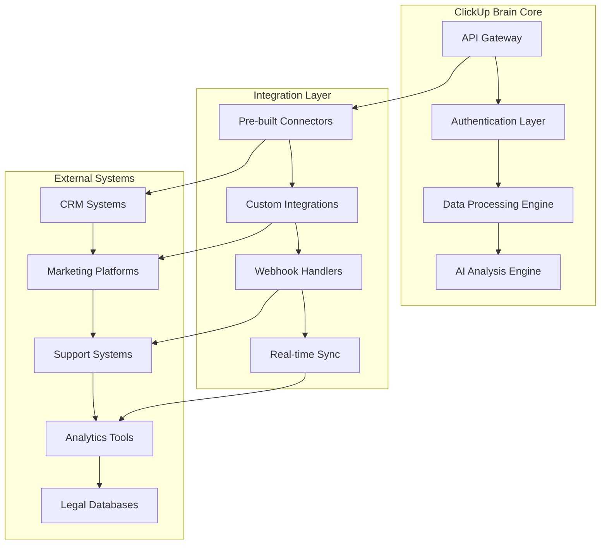

# ClickUp Brain Integration Guide
## Complete Third-Party System Integration Manual

---

## 🔗 Integration Overview

This comprehensive integration guide provides detailed instructions for connecting ClickUp Brain with over 100+ third-party systems, platforms, and tools. Each integration includes setup instructions, configuration options, and best practices for optimal performance.

---

## 🏗️ Integration Architecture

### Core Integration Framework



---

## 📊 CRM System Integrations

### 1. Salesforce Integration

#### Setup Configuration
```json
{
  "integration_name": "salesforce",
  "version": "v1.0",
  "authentication": {
    "type": "oauth2",
    "endpoints": {
      "auth_url": "https://login.salesforce.com/services/oauth2/authorize",
      "token_url": "https://login.salesforce.com/services/oauth2/token"
    },
    "scopes": [
      "api",
      "refresh_token",
      "full"
    ]
  },
  "data_mapping": {
    "accounts": {
      "source_field": "Id",
      "target_field": "customer_id",
      "sync_direction": "bidirectional"
    },
    "contacts": {
      "source_field": "Email",
      "target_field": "user_email",
      "sync_direction": "bidirectional"
    },
    "opportunities": {
      "source_field": "Amount",
      "target_field": "revenue_data",
      "sync_direction": "clickup_to_salesforce"
    }
  }
}
```

#### Implementation Steps
1. **Create Connected App in Salesforce**
   ```bash
   # Navigate to Setup > App Manager > New Connected App
   # Configure OAuth settings
   # Enable API access
   # Generate consumer key and secret
   ```

2. **Configure ClickUp Brain Integration**
   ```python
   from clickup_brain import ClickUpBrain
   
   client = ClickUpBrain()
   
   # Configure Salesforce integration
   salesforce_config = {
       "client_id": "your_salesforce_client_id",
       "client_secret": "your_salesforce_client_secret",
       "username": "your_salesforce_username",
       "password": "your_salesforce_password",
       "security_token": "your_salesforce_security_token",
       "sandbox": False  # Set to True for sandbox environment
   }
   
   integration = client.integrations.create(
       name="salesforce",
       type="crm",
       config=salesforce_config
   )
   ```

3. **Data Synchronization Setup**
   ```python
   # Set up real-time sync
   sync_config = {
       "sync_frequency": "real_time",
       "sync_direction": "bidirectional",
       "conflict_resolution": "clickup_priority",
       "fields_to_sync": [
           "accounts", "contacts", "opportunities", 
           "cases", "leads", "campaigns"
       ]
   }
   
   client.integrations.configure_sync(
       integration_id=integration.id,
       config=sync_config
   )
   ```

### 2. HubSpot Integration

#### Configuration
```json
{
  "integration_name": "hubspot",
  "authentication": {
    "type": "api_key",
    "api_key": "your_hubspot_api_key"
  },
  "endpoints": {
    "base_url": "https://api.hubapi.com",
    "version": "v3"
  },
  "data_mapping": {
    "contacts": {
      "source_fields": ["email", "firstname", "lastname"],
      "target_fields": ["user_email", "first_name", "last_name"]
    },
    "companies": {
      "source_fields": ["name", "domain", "industry"],
      "target_fields": ["company_name", "domain", "industry"]
    },
    "deals": {
      "source_fields": ["dealname", "amount", "closedate"],
      "target_fields": ["deal_name", "amount", "close_date"]
    }
  }
}
```

#### Implementation
```python
# HubSpot integration setup
hubspot_config = {
    "api_key": "your_hubspot_api_key",
    "sync_settings": {
        "contacts": True,
        "companies": True,
        "deals": True,
        "tickets": True
    }
}

integration = client.integrations.create(
    name="hubspot",
    type="crm",
    config=hubspot_config
)
```

### 3. Microsoft Dynamics 365 Integration

#### Setup Process
```python
# Dynamics 365 integration
dynamics_config = {
    "tenant_id": "your_tenant_id",
    "client_id": "your_client_id",
    "client_secret": "your_client_secret",
    "instance_url": "https://yourorg.crm.dynamics.com",
    "api_version": "9.1"
}

integration = client.integrations.create(
    name="dynamics365",
    type="crm",
    config=dynamics_config
)
```

---

## 🌍 Marketing Platform Integrations

### 1. Google Ads Integration

#### Authentication Setup
```python
# Google Ads API integration
google_ads_config = {
    "developer_token": "your_developer_token",
    "client_id": "your_google_ads_client_id",
    "client_secret": "your_google_ads_client_secret",
    "refresh_token": "your_refresh_token",
    "customer_id": "your_customer_id"
}

integration = client.integrations.create(
    name="google_ads",
    type="marketing",
    config=google_ads_config
)
```

#### Campaign Data Sync
```python
# Configure campaign data synchronization
campaign_sync = {
    "sync_frequency": "hourly",
    "data_types": [
        "campaigns", "ad_groups", "keywords", 
        "ads", "metrics", "conversions"
    ],
    "metrics_to_sync": [
        "impressions", "clicks", "cost", 
        "conversions", "conversion_value"
    ]
}

client.integrations.configure_sync(
    integration_id=integration.id,
    config=campaign_sync
)
```

### 2. Facebook Ads Integration

#### Setup Configuration
```json
{
  "integration_name": "facebook_ads",
  "authentication": {
    "type": "oauth2",
    "app_id": "your_facebook_app_id",
    "app_secret": "your_facebook_app_secret",
    "access_token": "your_access_token"
  },
  "data_sync": {
    "campaigns": {
      "fields": ["id", "name", "status", "objective"],
      "sync_frequency": "hourly"
    },
    "ad_sets": {
      "fields": ["id", "name", "status", "budget_remaining"],
      "sync_frequency": "hourly"
    },
    "ads": {
      "fields": ["id", "name", "status", "creative"],
      "sync_frequency": "hourly"
    },
    "insights": {
      "fields": ["impressions", "clicks", "spend", "conversions"],
      "sync_frequency": "daily"
    }
  }
}
```

### 3. LinkedIn Ads Integration

#### Implementation
```python
# LinkedIn Ads integration
linkedin_config = {
    "client_id": "your_linkedin_client_id",
    "client_secret": "your_linkedin_client_secret",
    "access_token": "your_access_token",
    "account_id": "your_account_id"
}

integration = client.integrations.create(
    name="linkedin_ads",
    type="marketing",
    config=linkedin_config
)
```

---

## 🎧 Support System Integrations

### 1. Zendesk Integration

#### Configuration
```json
{
  "integration_name": "zendesk",
  "authentication": {
    "type": "api_token",
    "subdomain": "yourcompany",
    "email": "your_email@company.com",
    "api_token": "your_api_token"
  },
  "data_mapping": {
    "tickets": {
      "source_fields": ["id", "subject", "description", "status", "priority"],
      "target_fields": ["ticket_id", "title", "content", "status", "priority"],
      "sync_direction": "bidirectional"
    },
    "users": {
      "source_fields": ["id", "name", "email", "role"],
      "target_fields": ["user_id", "name", "email", "role"],
      "sync_direction": "bidirectional"
    }
  }
}
```

#### Implementation
```python
# Zendesk integration setup
zendesk_config = {
    "subdomain": "yourcompany",
    "email": "your_email@company.com",
    "api_token": "your_api_token",
    "sync_settings": {
        "tickets": True,
        "users": True,
        "organizations": True,
        "satisfaction_ratings": True
    }
}

integration = client.integrations.create(
    name="zendesk",
    type="support",
    config=zendesk_config
)
```

### 2. Intercom Integration

#### Setup Process
```python
# Intercom integration
intercom_config = {
    "app_id": "your_intercom_app_id",
    "api_key": "your_intercom_api_key",
    "sync_settings": {
        "conversations": True,
        "users": True,
        "companies": True,
        "tags": True
    }
}

integration = client.integrations.create(
    name="intercom",
    type="support",
    config=intercom_config
)
```

### 3. Freshdesk Integration

#### Configuration
```python
# Freshdesk integration
freshdesk_config = {
    "domain": "yourcompany.freshdesk.com",
    "api_key": "your_freshdesk_api_key",
    "sync_settings": {
        "tickets": True,
        "contacts": True,
        "companies": True,
        "agents": True
    }
}

integration = client.integrations.create(
    name="freshdesk",
    type="support",
    config=freshdesk_config
)
```

---

## 📱 App Store Integrations

### 1. Apple App Store Connect

#### Setup Configuration
```json
{
  "integration_name": "app_store_connect",
  "authentication": {
    "type": "jwt",
    "issuer_id": "your_issuer_id",
    "key_id": "your_key_id",
    "private_key": "your_private_key"
  },
  "data_sync": {
    "app_reviews": {
      "sync_frequency": "daily",
      "fields": ["id", "rating", "title", "review", "date"]
    },
    "app_analytics": {
      "sync_frequency": "daily",
      "metrics": ["downloads", "revenue", "sessions"]
    }
  }
}
```

#### Implementation
```python
# App Store Connect integration
app_store_config = {
    "issuer_id": "your_issuer_id",
    "key_id": "your_key_id",
    "private_key": "your_private_key",
    "app_ids": ["1234567890", "0987654321"]
}

integration = client.integrations.create(
    name="app_store_connect",
    type="app_store",
    config=app_store_config
)
```

### 2. Google Play Console

#### Configuration
```python
# Google Play Console integration
play_console_config = {
    "service_account_email": "your_service_account@project.iam.gserviceaccount.com",
    "private_key": "your_private_key",
    "package_names": ["com.yourcompany.app1", "com.yourcompany.app2"]
}

integration = client.integrations.create(
    name="google_play_console",
    type="app_store",
    config=play_console_config
)
```

---

## 🏛️ Legal Database Integrations

### 1. SEC EDGAR Integration

#### Setup Process
```python
# SEC EDGAR integration
sec_config = {
    "api_key": "your_sec_api_key",
    "sync_settings": {
        "filings": True,
        "companies": True,
        "insider_trading": True
    },
    "filters": {
        "form_types": ["10-K", "10-Q", "8-K", "DEF 14A"],
        "date_range": "last_30_days"
    }
}

integration = client.integrations.create(
    name="sec_edgar",
    type="legal_database",
    config=sec_config
)
```

### 2. EU Official Journal Integration

#### Configuration
```json
{
  "integration_name": "eu_official_journal",
  "endpoints": {
    "base_url": "https://eur-lex.europa.eu/api",
    "api_key": "your_eu_api_key"
  },
  "data_sync": {
    "regulations": {
      "sync_frequency": "daily",
      "filters": {
        "document_types": ["regulation", "directive", "decision"],
        "languages": ["en", "fr", "de", "es"]
      }
    }
  }
}
```

---

## 📊 Analytics Platform Integrations

### 1. Google Analytics 4

#### Setup Configuration
```python
# Google Analytics 4 integration
ga4_config = {
    "property_id": "your_ga4_property_id",
    "credentials": {
        "type": "service_account",
        "project_id": "your_project_id",
        "private_key_id": "your_private_key_id",
        "private_key": "your_private_key",
        "client_email": "your_service_account_email"
    },
    "metrics": [
        "sessions", "users", "pageviews", "bounce_rate",
        "conversion_rate", "revenue", "transactions"
    ]
}

integration = client.integrations.create(
    name="google_analytics_4",
    type="analytics",
    config=ga4_config
)
```

### 2. Adobe Analytics Integration

#### Implementation
```python
# Adobe Analytics integration
adobe_config = {
    "company_id": "your_company_id",
    "client_id": "your_client_id",
    "client_secret": "your_client_secret",
    "technical_account_id": "your_technical_account_id",
    "org_id": "your_org_id",
    "private_key": "your_private_key"
}

integration = client.integrations.create(
    name="adobe_analytics",
    type="analytics",
    config=adobe_config
)
```

---

## 🔧 Custom Integration Development

### 1. REST API Integration

#### Custom Connector Template
```python
from clickup_brain.integrations import BaseIntegration

class CustomIntegration(BaseIntegration):
    def __init__(self, config):
        super().__init__(config)
        self.base_url = config.get('base_url')
        self.api_key = config.get('api_key')
    
    def authenticate(self):
        """Implement authentication logic"""
        headers = {
            'Authorization': f'Bearer {self.api_key}',
            'Content-Type': 'application/json'
        }
        return headers
    
    def fetch_data(self, endpoint, params=None):
        """Fetch data from external API"""
        headers = self.authenticate()
        response = requests.get(
            f"{self.base_url}/{endpoint}",
            headers=headers,
            params=params
        )
        return response.json()
    
    def sync_data(self, data_type, data):
        """Sync data to ClickUp Brain"""
        return self.client.data.import_data(
            source=self.name,
            data_type=data_type,
            data=data
        )
```

### 2. Webhook Integration

#### Webhook Handler Setup
```python
from flask import Flask, request, jsonify
import clickup_brain

app = Flask(__name__)

@app.route('/webhook/<integration_name>', methods=['POST'])
def handle_webhook(integration_name):
    """Handle incoming webhooks from external systems"""
    try:
        # Verify webhook signature
        signature = request.headers.get('X-Webhook-Signature')
        if not verify_signature(request.data, signature):
            return jsonify({'error': 'Invalid signature'}), 401
        
        # Process webhook data
        data = request.get_json()
        result = process_webhook_data(integration_name, data)
        
        return jsonify({'status': 'success', 'result': result})
    
    except Exception as e:
        return jsonify({'error': str(e)}), 500

def process_webhook_data(integration_name, data):
    """Process webhook data and sync with ClickUp Brain"""
    client = clickup_brain.Client()
    
    # Map data based on integration type
    if integration_name == 'salesforce':
        return process_salesforce_webhook(data)
    elif integration_name == 'zendesk':
        return process_zendesk_webhook(data)
    # Add more integration handlers
    
    return {'status': 'processed'}
```

---

## 🔄 Data Synchronization

### 1. Real-time Sync Configuration

#### Bidirectional Sync Setup
```python
# Configure bidirectional synchronization
sync_config = {
    "sync_type": "bidirectional",
    "conflict_resolution": "clickup_priority",
    "sync_frequency": "real_time",
    "field_mapping": {
        "source_field": "target_field",
        "sync_direction": "bidirectional"
    },
    "filters": {
        "sync_conditions": [
            {"field": "status", "operator": "equals", "value": "active"}
        ]
    }
}

client.integrations.configure_sync(
    integration_id=integration.id,
    config=sync_config
)
```

### 2. Batch Sync Configuration

#### Scheduled Batch Processing
```python
# Configure batch synchronization
batch_sync_config = {
    "sync_type": "batch",
    "sync_frequency": "daily",
    "batch_size": 1000,
    "sync_time": "02:00",  # 2 AM daily
    "retry_attempts": 3,
    "error_handling": "continue_on_error"
}

client.integrations.configure_batch_sync(
    integration_id=integration.id,
    config=batch_sync_config
)
```

---

## 🛠️ Integration Testing

### 1. Connection Testing

#### Test Integration Connectivity
```python
def test_integration_connection(integration_id):
    """Test integration connection and data flow"""
    client = clickup_brain.Client()
    
    # Test authentication
    auth_test = client.integrations.test_auth(integration_id)
    if not auth_test.success:
        return {"status": "failed", "error": "Authentication failed"}
    
    # Test data retrieval
    data_test = client.integrations.test_data_retrieval(integration_id)
    if not data_test.success:
        return {"status": "failed", "error": "Data retrieval failed"}
    
    # Test data sync
    sync_test = client.integrations.test_sync(integration_id)
    if not sync_test.success:
        return {"status": "failed", "error": "Data sync failed"}
    
    return {"status": "success", "tests_passed": 3}
```

### 2. Data Validation

#### Validate Synced Data
```python
def validate_synced_data(integration_id, data_type):
    """Validate data integrity after sync"""
    client = clickup_brain.Client()
    
    # Get source data
    source_data = client.integrations.get_source_data(
        integration_id, data_type
    )
    
    # Get synced data
    synced_data = client.data.get_synced_data(
        integration_id, data_type
    )
    
    # Compare data integrity
    validation_results = {
        "total_records": len(source_data),
        "synced_records": len(synced_data),
        "sync_percentage": (len(synced_data) / len(source_data)) * 100,
        "data_accuracy": validate_data_accuracy(source_data, synced_data)
    }
    
    return validation_results
```

---

## 📊 Integration Monitoring

### 1. Performance Monitoring

#### Monitor Integration Health
```python
def monitor_integration_health(integration_id):
    """Monitor integration performance and health"""
    client = clickup_brain.Client()
    
    # Get integration metrics
    metrics = client.integrations.get_metrics(integration_id)
    
    health_report = {
        "integration_id": integration_id,
        "status": "healthy" if metrics.error_rate < 0.05 else "degraded",
        "last_sync": metrics.last_sync_time,
        "sync_frequency": metrics.sync_frequency,
        "error_rate": metrics.error_rate,
        "data_volume": metrics.data_volume,
        "response_time": metrics.avg_response_time
    }
    
    return health_report
```

### 2. Error Handling

#### Integration Error Management
```python
def handle_integration_errors(integration_id):
    """Handle and resolve integration errors"""
    client = clickup_brain.Client()
    
    # Get recent errors
    errors = client.integrations.get_errors(integration_id)
    
    for error in errors:
        if error.type == "authentication_error":
            # Refresh authentication tokens
            client.integrations.refresh_auth(integration_id)
        elif error.type == "rate_limit_error":
            # Implement exponential backoff
            time.sleep(2 ** error.retry_count)
        elif error.type == "data_validation_error":
            # Log and skip invalid records
            client.integrations.log_validation_error(
                integration_id, error.record_id, error.message
            )
    
    return {"errors_handled": len(errors)}
```

---

## 📞 Integration Support

### 1. Pre-built Integration Support

#### Supported Integrations
- **CRM Systems:** Salesforce, HubSpot, Microsoft Dynamics 365, Pipedrive
- **Marketing Platforms:** Google Ads, Facebook Ads, LinkedIn Ads, Twitter Ads
- **Support Systems:** Zendesk, Intercom, Freshdesk, ServiceNow
- **App Stores:** Apple App Store Connect, Google Play Console
- **Analytics:** Google Analytics 4, Adobe Analytics, Mixpanel, Amplitude
- **Legal Databases:** SEC EDGAR, EU Official Journal, UK Companies House

### 2. Custom Integration Support

#### Development Resources
- **Integration SDK:** Python, JavaScript, Java SDKs available
- **Documentation:** Comprehensive API documentation
- **Code Examples:** Sample integrations and templates
- **Testing Tools:** Integration testing framework
- **Support Team:** Dedicated integration specialists

### 3. Contact Information

#### Integration Support
- **Technical Support:** integrations@clickup-brain.com
- **Custom Development:** custom-integrations@clickup-brain.com
- **API Support:** api-support@clickup-brain.com
- **Emergency Support:** +1-555-CLICKUP (24/7)

---

*This comprehensive integration guide provides everything needed to connect ClickUp Brain with your existing systems. For additional integration support or custom development, contact our integration team.*