# ClickUp Brain Global Expansion Strategy
## Comprehensive International Market Entry & Growth Strategy

---

## 🌍 Executive Overview

This comprehensive global expansion strategy provides a detailed roadmap for international market entry, localization, and sustainable growth across key global markets. Based on analysis of successful international AI platform expansions and market penetration strategies across 50+ countries.

---

## 🗺️ Global Market Analysis

### 1. Global Market Opportunity

#### Total Addressable Market by Region
```
📊 Global Market Analysis:

North America:
• Market Size: $18.2B (54.7% of global market)
• Growth Rate: 12.5% CAGR
• Key Markets: USA, Canada, Mexico
• Market Maturity: High
• Competition Level: Intense

Europe:
• Market Size: $8.9B (26.7% of global market)
• Growth Rate: 11.8% CAGR
• Key Markets: UK, Germany, France, Netherlands
• Market Maturity: High
• Competition Level: Moderate

Asia-Pacific:
• Market Size: $4.8B (14.4% of global market)
• Growth Rate: 15.2% CAGR
• Key Markets: Australia, Singapore, Japan, India
• Market Maturity: Medium
• Competition Level: Growing

Latin America:
• Market Size: $1.2B (3.6% of global market)
• Growth Rate: 18.5% CAGR
• Key Markets: Brazil, Argentina, Chile
• Market Maturity: Low
• Competition Level: Low

Middle East & Africa:
• Market Size: $0.2B (0.6% of global market)
• Growth Rate: 22.3% CAGR
• Key Markets: UAE, Saudi Arabia, South Africa
• Market Maturity: Low
• Competition Level: Emerging
```

#### Market Segmentation by Priority

```mermaid
graph TB
    subgraph "Tier 1 Markets (Immediate Entry)"
        A[United States<br/>$12.8B] --> B[United Kingdom<br/>$2.1B]
        B --> C[Germany<br/>$1.8B]
        C --> D[Australia<br/>$1.2B]
    end
    
    subgraph "Tier 2 Markets (12-18 Months)"
        E[Canada<br/>$1.1B] --> F[France<br/>$1.0B]
        F --> G[Netherlands<br/>$0.8B]
        G --> H[Singapore<br/>$0.6B]
    end
    
    subgraph "Tier 3 Markets (18-36 Months)"
        I[Japan<br/>$0.9B] --> J[India<br/>$0.7B]
        J --> K[Brazil<br/>$0.5B]
        K --> L[Mexico<br/>$0.4B]
    end
    
    subgraph "Tier 4 Markets (36+ Months)"
        M[Argentina<br/>$0.3B] --> N[Chile<br/>$0.2B]
        N --> O[UAE<br/>$0.1B]
        O --> P[South Africa<br/>$0.1B]
    end
```


---

## 🎯 Market Entry Strategy

### 1. Phase 1: North America Expansion (Months 1-12)

#### United States Market Entry
```
🇺🇸 US Market Strategy:

Market Entry Approach:
• Direct sales and marketing
• Partner channel development
• Industry conference participation
• Thought leadership establishment

Target Segments:
• Financial services (primary)
• Healthcare (primary)
• Technology (secondary)
• Manufacturing (secondary)

Success Metrics:
• $10M ARR within 12 months
• 50+ enterprise customers
• 25% market awareness
• 10% market share in target segments

Investment Required:
• $15M initial investment
• 50+ team members
• 5 regional offices
• Comprehensive marketing campaign
```

#### Canada Market Entry
```
🇨🇦 Canada Market Strategy:

Market Entry Approach:
• Partner-led expansion
• Local team building
• Regulatory compliance
• Cultural adaptation

Target Segments:
• Banking and financial services
• Healthcare and life sciences
• Government and public sector
• Energy and utilities

Success Metrics:
• $2M ARR within 12 months
• 20+ enterprise customers
• 15% market awareness
• 5% market share in target segments

Investment Required:
• $3M initial investment
• 15+ team members
• 2 regional offices
• Local partnership development
```

### 2. Phase 2: European Expansion (Months 12-24)

#### United Kingdom Market Entry
```
🇬🇧 UK Market Strategy:

Market Entry Approach:
• Direct market entry
• Local team establishment
• GDPR compliance
• Industry partnership development

Target Segments:
• Financial services (primary)
• Healthcare (primary)
• Government (secondary)
• Professional services (secondary)

Success Metrics:
• $5M ARR within 12 months
• 30+ enterprise customers
• 20% market awareness
• 8% market share in target segments

Investment Required:
• $8M initial investment
• 25+ team members
• 3 regional offices
• Comprehensive compliance program
```

#### Germany Market Entry
```
🇩🇪 Germany Market Strategy:

Market Entry Approach:
• Joint venture partnership
• Local team building
• Regulatory compliance
• Cultural localization

Target Segments:
• Manufacturing (primary)
• Automotive (primary)
• Financial services (secondary)
• Healthcare (secondary)

Success Metrics:
• $4M ARR within 12 months
• 25+ enterprise customers
• 18% market awareness
• 6% market share in target segments

Investment Required:
• $6M initial investment
• 20+ team members
• 2 regional offices
• Local partnership development
```

### 3. Phase 3: Asia-Pacific Expansion (Months 24-36)

#### Australia Market Entry
```
🇦🇺 Australia Market Strategy:

Market Entry Approach:
• Direct market entry
• Local team establishment
• Regulatory compliance
• Industry partnership development

Target Segments:
• Financial services (primary)
• Healthcare (primary)
• Government (secondary)
• Mining and resources (secondary)

Success Metrics:
• $3M ARR within 12 months
• 20+ enterprise customers
• 15% market awareness
• 5% market share in target segments

Investment Required:
• $4M initial investment
• 15+ team members
• 2 regional offices
• Local partnership development
```

#### Singapore Market Entry
```
🇸🇬 Singapore Market Strategy:

Market Entry Approach:
• Regional hub establishment
• Partner channel development
• Government partnership
• Regional expansion base

Target Segments:
• Financial services (primary)
• Technology (primary)
• Government (secondary)
• Professional services (secondary)

Success Metrics:
• $2M ARR within 12 months
• 15+ enterprise customers
• 12% market awareness
• 4% market share in target segments

Investment Required:
• $3M initial investment
• 12+ team members
• 1 regional office
• Regional partnership development
```

---

## 🌐 Localization Strategy

### 1. Product Localization

#### Language and Cultural Adaptation
```
🌍 Localization Framework:

Language Support:
• Primary Languages: English, Spanish, French, German, Japanese, Chinese
• Secondary Languages: Portuguese, Italian, Dutch, Korean, Arabic
• Localization Depth: UI, documentation, training, support
• Quality Assurance: Native speaker review, cultural validation

Cultural Adaptation:
• Business practices and workflows
• Regulatory compliance requirements
• Data privacy and security standards
• User interface and experience design
• Communication and marketing materials

Technical Localization:
• Data residency requirements
• Currency and number formatting
• Date and time formats
• Measurement units
• Legal and compliance frameworks
```

#### Regulatory Compliance
```
📋 Compliance Framework:

Data Privacy Regulations:
• GDPR (European Union)
• CCPA (California, USA)
• PIPEDA (Canada)
• Privacy Act (Australia)
• PDPA (Singapore)

Industry Regulations:
• SOX (Financial Services)
• HIPAA (Healthcare)
• ISO 27001 (Information Security)
• SOC 2 (Service Organizations)
• PCI DSS (Payment Card Industry)

Local Regulations:
• Country-specific data protection laws
• Industry-specific compliance requirements
• Government contracting regulations
• Export control regulations
• Tax and accounting requirements
```

### 2. Business Model Localization

#### Pricing and Packaging
```
💰 Localized Pricing Strategy:

Regional Pricing Models:
• North America: Premium pricing, value-based
• Europe: Competitive pricing, compliance-focused
• Asia-Pacific: Market penetration pricing
• Latin America: Localized pricing, payment flexibility

Currency and Payment:
• Local currency support
• Regional payment methods
• Tax calculation and compliance
• Billing and invoicing localization
• Financial reporting requirements

Packaging Adaptation:
• Feature sets by market needs
• Industry-specific solutions
• Compliance-focused packages
• Local partnership integrations
• Custom development options
```

---

## 🤝 Partnership Strategy

### 1. Global Partnership Framework

#### Strategic Partnerships
```
🤝 Partnership Types:

Technology Partners:
• Cloud providers (AWS, Azure, GCP)
• Integration partners (Salesforce, Microsoft)
• AI/ML platform partners
• Security and compliance partners

Channel Partners:
• System integrators
• Consulting firms
• Reseller partners
• Industry specialists

Strategic Partners:
• Industry leaders
• Technology innovators
• Academic institutions
• Government agencies

Regional Partners:
• Local technology companies
• Regional system integrators
• Industry associations
• Government agencies
```

#### Partnership Development
```
📈 Partnership Development Process:

Phase 1: Partner Identification
• Market analysis and partner mapping
• Strategic fit assessment
• Value proposition alignment
• Mutual benefit identification

Phase 2: Partner Engagement
• Initial relationship building
• Partnership opportunity exploration
• Joint value proposition development
• Pilot project planning

Phase 3: Partnership Formalization
• Partnership agreement development
• Joint go-to-market strategy
• Training and certification
• Success metrics definition

Phase 4: Partnership Execution
• Joint sales and marketing
• Customer success collaboration
• Continuous optimization
• Relationship expansion
```

### 2. Regional Partnership Strategy

#### North America Partnerships
```
🇺🇸🇨🇦 North America Partners:

Technology Partners:
• AWS (Cloud infrastructure)
• Microsoft (Office 365 integration)
• Salesforce (CRM integration)
• Google (Workspace integration)

Channel Partners:
• Accenture (System integration)
• Deloitte (Consulting services)
• IBM (Enterprise solutions)
• PwC (Professional services)

Industry Partners:
• Financial services associations
• Healthcare technology organizations
• Manufacturing industry groups
• Government contracting partners
```

#### European Partnerships
```
🇪🇺 European Partners:

Technology Partners:
• SAP (Enterprise software)
• Oracle (Database and applications)
• ServiceNow (IT service management)
• Atlassian (Collaboration tools)

Channel Partners:
• Capgemini (System integration)
• Atos (Digital transformation)
• T-Systems (IT services)
• Sopra Steria (Digital services)

Industry Partners:
• European banking associations
• Healthcare technology organizations
• Manufacturing industry groups
• Government agencies
```

---

## 🏢 Organizational Structure

### 1. Global Organization

#### Regional Structure
```
🌍 Global Organization:

North America Region:
• Regional President
• Sales Director
• Marketing Director
• Customer Success Director
• Operations Director

Europe Region:
• Regional President
• Sales Director
• Marketing Director
• Customer Success Director
• Operations Director

Asia-Pacific Region:
• Regional President
• Sales Director
• Marketing Director
• Customer Success Director
• Operations Director

Latin America Region:
• Regional President
• Sales Director
• Marketing Director
• Customer Success Director
• Operations Director
```

#### Global Functions
```
🌐 Global Functions:

Global Leadership:
• Chief Executive Officer (CEO)
• Chief Operating Officer (COO)
• Chief Technology Officer (CTO)
• Chief Financial Officer (CFO)
• Chief Marketing Officer (CMO)

Global Support Functions:
• Global Sales Operations
• Global Marketing Operations
• Global Customer Success
• Global Product Management
• Global Engineering
• Global Human Resources
• Global Legal and Compliance
• Global Finance and Accounting
```

### 2. Local Team Building

#### Talent Acquisition Strategy
```
👥 Talent Acquisition:

Local Hiring Strategy:
• Local talent acquisition
• Cultural fit assessment
• Language proficiency requirements
• Industry experience preferences
• Leadership development programs

Global Talent Programs:
• International assignment programs
• Cross-cultural training
• Global leadership development
• Knowledge transfer programs
• Mentorship and coaching

Retention Strategies:
• Competitive compensation packages
• Career development opportunities
• Work-life balance programs
• Cultural integration support
• Recognition and rewards programs
```

---

## 📊 Market Entry Metrics

### 1. Success Metrics by Phase

#### Phase 1: North America (Months 1-12)
```
📈 North America Metrics:

Financial Metrics:
• Revenue: $12M ARR
• Customers: 70+ enterprise customers
• Market Share: 15% in target segments
• Customer Acquisition Cost: <$50K

Operational Metrics:
• Team Size: 65+ team members
• Office Locations: 7 regional offices
• Partner Network: 25+ partners
• Market Awareness: 30%

Customer Metrics:
• Customer Satisfaction: 4.7+
• Net Promoter Score: 60+
• Customer Retention: 95%+
• Reference Rate: 80%+
```

#### Phase 2: Europe (Months 12-24)
```
📈 Europe Metrics:

Financial Metrics:
• Revenue: $9M ARR
• Customers: 55+ enterprise customers
• Market Share: 12% in target segments
• Customer Acquisition Cost: <$45K

Operational Metrics:
• Team Size: 45+ team members
• Office Locations: 5 regional offices
• Partner Network: 20+ partners
• Market Awareness: 25%

Customer Metrics:
• Customer Satisfaction: 4.6+
• Net Promoter Score: 55+
• Customer Retention: 94%+
• Reference Rate: 75%+
```

#### Phase 3: Asia-Pacific (Months 24-36)
```
📈 Asia-Pacific Metrics:

Financial Metrics:
• Revenue: $5M ARR
• Customers: 35+ enterprise customers
• Market Share: 8% in target segments
• Customer Acquisition Cost: <$40K

Operational Metrics:
• Team Size: 27+ team members
• Office Locations: 3 regional offices
• Partner Network: 15+ partners
• Market Awareness: 20%

Customer Metrics:
• Customer Satisfaction: 4.5+
• Net Promoter Score: 50+
• Customer Retention: 93%+
• Reference Rate: 70%+
```

---

## 💰 Investment Strategy

### 1. Investment Allocation

#### Regional Investment Distribution
```
💰 Investment Allocation (3-Year Plan):

North America (60%):
• Sales and Marketing: $45M
• Operations: $15M
• Technology: $10M
• Total: $70M

Europe (25%):
• Sales and Marketing: $18M
• Operations: $7M
• Technology: $5M
• Total: $30M

Asia-Pacific (12%):
• Sales and Marketing: $8M
• Operations: $3M
• Technology: $2M
• Total: $13M

Latin America (3%):
• Sales and Marketing: $2M
• Operations: $1M
• Technology: $1M
• Total: $4M

Total Investment: $117M over 3 years
```

#### ROI Projections
```
📈 ROI Projections:

Year 1:
• Investment: $40M
• Revenue: $12M
• ROI: -70% (expected loss)

Year 2:
• Investment: $40M
• Revenue: $35M
• ROI: -12% (reduced loss)

Year 3:
• Investment: $37M
• Revenue: $75M
• ROI: 103% (profitable)

3-Year Total:
• Investment: $117M
• Revenue: $122M
• ROI: 4% (break-even)
```

---

## 🚨 Risk Management

### 1. Global Expansion Risks

#### Risk Assessment
```
⚠️ Expansion Risks:

Market Risks:
• Economic downturns
• Currency fluctuations
• Political instability
• Regulatory changes
• Competitive threats

Operational Risks:
• Cultural barriers
• Language barriers
• Talent acquisition challenges
• Partner relationship issues
• Technology infrastructure

Financial Risks:
• Investment overruns
• Revenue shortfalls
• Currency exposure
• Tax implications
• Compliance costs
```

#### Risk Mitigation Strategies
```
🛡️ Risk Mitigation:

Market Risk Mitigation:
• Diversified market entry
• Local market research
• Regulatory compliance
• Competitive analysis
• Economic monitoring

Operational Risk Mitigation:
• Cultural training programs
• Local team building
• Partner relationship management
• Technology standardization
• Process documentation

Financial Risk Mitigation:
• Phased investment approach
• Currency hedging
• Local financial partnerships
• Tax optimization
• Cost control measures
```

---

## 📞 Global Expansion Support

### 1. Global Support Team

#### Expansion Team Structure
```
🌍 Global Expansion Team:

Global Leadership:
• Chief Global Officer (CGO)
• VP of International Operations
• Regional Presidents
• Global Strategy Director

Regional Teams:
• Regional Sales Directors
• Regional Marketing Directors
• Regional Customer Success Directors
• Regional Operations Directors

Global Support Functions:
• Global Legal and Compliance
• Global Finance and Accounting
• Global Human Resources
• Global Technology
• Global Marketing
```

### 2. Contact Information

#### Global Expansion Support
- **Global Strategy:** global-strategy@clickup-brain.com
- **International Operations:** international@clickup-brain.com
- **Regional Expansion:** expansion@clickup-brain.com
- **Partnership Development:** global-partnerships@clickup-brain.com

---

*This comprehensive global expansion strategy provides a detailed roadmap for international market entry and growth. For global expansion consultation or partnership opportunities, contact our global expansion team.*


