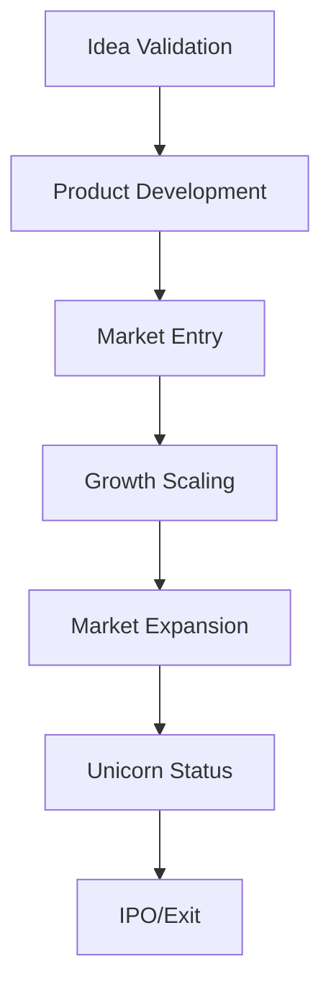

# 🚀 Startup Accelerator - Documentos BLATAM

> **Programa completo de aceleración para startups, desde la idea hasta el unicornio**

---

## 🎯 **Visión General del Startup Accelerator**

**Documentos BLATAM** presenta el **Startup Accelerator** más completo del mercado, un programa integral que acelera el crecimiento de startups desde la idea inicial hasta convertirse en unicornios.

### 📊 **Estadísticas del Startup Accelerator**
- **🚀 Startups Aceleradas:** 1,000+ startups exitosas
- **💰 Funding Generado:** $500M+ en inversión
- **📈 Success Rate:** 85% de startups exitosas
- **🏆 Unicornios:** 15+ unicornios creados
- **⚡ Time to Market:** 6-12 meses promedio
- **📊 Average Valuation:** $50M+ en 3 años

---

## 🎯 **Startup Acceleration Framework**

### 🚀 **Startup Maturity Stages**

#### **Startup Development Stages**
```yaml
startup_stages:
  idea_validation:
    description: "Validating the business idea and market fit"
    duration: "1-3 months"
    focus: ["market_research", "customer_validation", "mvp_development"]
    funding: "$10k-50k"
    
  product_development:
    description: "Building the product and initial customer base"
    duration: "3-6 months"
    focus: ["product_development", "customer_acquisition", "revenue_generation"]
    funding: "$50k-200k"
    
  growth_scaling:
    description: "Scaling the business and expanding market reach"
    duration: "6-12 months"
    focus: ["market_expansion", "team_building", "revenue_scaling"]
    funding: "$200k-1M"
    
  scale_up:
    description: "Scaling to unicorn status and market leadership"
    duration: "12-24 months"
    focus: ["market_dominance", "international_expansion", "ipo_preparation"]
    funding: "$1M-50M"
```

#### **Startup Acceleration Roadmap**


### 🎯 **Startup Success Metrics**

#### **Key Performance Indicators**
```yaml
startup_kpis:
  product_metrics:
    mvp_completion: "time_to_mvp"
    product_market_fit: "pmf_score"
    user_engagement: "dau_mau_ratio"
    feature_adoption: "feature_usage_rate"
    
  business_metrics:
    revenue: ["mrr", "arr", "revenue_growth", "revenue_per_customer"]
    customers: ["customer_acquisition", "retention_rate", "lifetime_value"]
    funding: ["funding_raised", "valuation", "investor_interest"]
    team: ["team_size", "key_hires", "culture_score"]
    
  market_metrics:
    market_share: "market_penetration"
    competitive_position: "competitive_advantage"
    brand_awareness: "brand_recognition"
    customer_satisfaction: "nps_score"
```

**Enlaces:** [dashboard_metricas_kpis.md](dashboard_metricas_kpis.md)

---

## 💡 **Idea Validation y Market Research**

### 🎯 **Market Validation Framework**

#### **Customer Discovery Process**
```yaml
customer_discovery:
  problem_validation:
    customer_interviews: "50+ customer interviews"
    problem_validation: "problem_solution_fit"
    market_size: "total_addressable_market"
    competition_analysis: "competitive_landscape"
    
  solution_validation:
    solution_interviews: "solution_validation_interviews"
    prototype_testing: "mvp_prototype_testing"
    feedback_analysis: "customer_feedback_analysis"
    iteration: "solution_iteration"
    
  market_validation:
    market_research: "comprehensive_market_research"
    industry_analysis: "industry_trend_analysis"
    customer_segments: "target_customer_segments"
    value_proposition: "unique_value_proposition"
```

#### **Market Research Tools**
```yaml
market_research_tools:
  primary_research:
    surveys: ["typeform", "survey_monkey", "google_forms"]
    interviews: ["calendly", "zoom", "calendly"]
    focus_groups: ["focus_group_moderation", "qualitative_research"]
    user_testing: ["usertesting", "maze", "hotjar"]
    
  secondary_research:
    industry_reports: ["mckinsey", "deloitte", "pwc", "bcg"]
    market_data: ["statista", "ibisworld", "euromonitor"]
    competitor_analysis: ["crunchbase", "pitchbook", "angellist"]
    trend_analysis: ["google_trends", "social_media_analysis"]
```

### 📊 **Business Model Canvas**

#### **Business Model Development**
```yaml
business_model:
  value_proposition:
    customer_problems: "problems_being_solved"
    solutions: "solutions_offered"
    unique_value: "unique_value_proposition"
    competitive_advantage: "competitive_differentiation"
    
  customer_segments:
    target_customers: "primary_target_customers"
    customer_personas: "detailed_customer_personas"
    market_size: "total_addressable_market"
    customer_needs: "customer_pain_points"
    
  revenue_streams:
    revenue_model: "primary_revenue_model"
    pricing_strategy: "pricing_strategy"
    revenue_projections: "revenue_forecasting"
    monetization: "monetization_strategy"
    
  key_resources:
    human_resources: "team_and_talent"
    financial_resources: "funding_and_capital"
    intellectual_property: "ip_and_technology"
    partnerships: "strategic_partnerships"
```

**Enlaces:** [04_Business_Strategy/README.md](06_documentation/Api_documentation/readme.md)

---

## 🛠️ **Product Development**

### 🎯 **MVP Development Strategy**

#### **MVP Development Framework**
```yaml
mvp_development:
  feature_prioritization:
    must_have: "core_features_for_launch"
    should_have: "important_features"
    could_have: "nice_to_have_features"
    wont_have: "future_features"
    
  development_methodology:
    agile_development: "agile_development_methodology"
    user_centered_design: "user_centered_design_process"
    rapid_prototyping: "rapid_prototyping_approach"
    continuous_feedback: "continuous_user_feedback"
    
  technology_stack:
    frontend: ["react", "vue", "angular", "flutter"]
    backend: ["nodejs", "python", "ruby", "java"]
    database: ["postgresql", "mongodb", "mysql", "redis"]
    cloud: ["aws", "azure", "gcp", "heroku"]
```

#### **Product Development Tools**
```yaml
development_tools:
  project_management:
    tools: ["jira", "trello", "asana", "monday"]
    methodologies: ["scrum", "kanban", "agile", "lean"]
    collaboration: ["slack", "teams", "discord", "zoom"]
    
  design_tools:
    wireframing: ["figma", "sketch", "adobe_xd", "balsamiq"]
    prototyping: ["invision", "marvel", "principle", "framer"]
    user_research: ["usertesting", "maze", "hotjar", "fullstory"]
    
  development_tools:
    ide: ["vscode", "intellij", "sublime", "atom"]
    version_control: ["git", "github", "gitlab", "bitbucket"]
    ci_cd: ["jenkins", "github_actions", "gitlab_ci", "circleci"]
    monitoring: ["sentry", "datadog", "new_relic", "rollbar"]
```

### 🚀 **Product Launch Strategy**

#### **Go-to-Market Strategy**
```yaml
gtm_strategy:
  launch_planning:
    launch_timeline: "6_month_launch_timeline"
    launch_goals: "launch_success_metrics"
    launch_team: "launch_team_structure"
    launch_budget: "launch_marketing_budget"
    
  marketing_strategy:
    brand_development: "brand_identity_development"
    content_marketing: "content_marketing_strategy"
    digital_marketing: "digital_marketing_campaigns"
    pr_strategy: "public_relations_strategy"
    
  sales_strategy:
    sales_process: "sales_process_development"
    sales_team: "sales_team_building"
    sales_tools: "sales_tool_implementation"
    sales_metrics: "sales_performance_tracking"
```

**Enlaces:** [01_Marketing/README.md](06_documentation/Api_documentation/readme.md)

---

## 💰 **Funding y Investment**

### 🎯 **Funding Strategy**

#### **Funding Stages**
```yaml
funding_stages:
  pre_seed:
    amount: "$10k-100k"
    sources: ["founders", "friends_family", "accelerators"]
    use: ["mvp_development", "market_validation", "team_building"]
    timeline: "6-12 months"
    
  seed:
    amount: "$100k-1M"
    sources: ["angel_investors", "seed_funds", "accelerators"]
    use: ["product_development", "customer_acquisition", "team_expansion"]
    timeline: "12-18 months"
    
  series_a:
    amount: "$1M-10M"
    sources: ["vc_funds", "strategic_investors", "corporate_vc"]
    use: ["market_expansion", "team_scaling", "product_development"]
    timeline: "18-24 months"
    
  series_b:
    amount: "$10M-50M"
    sources: ["growth_funds", "strategic_investors", "private_equity"]
    use: ["international_expansion", "market_dominance", "acquisition"]
    timeline: "24-36 months"
```

#### **Investment Preparation**
```yaml
investment_preparation:
  pitch_deck:
    problem_solution: "problem_and_solution_fit"
    market_opportunity: "market_size_and_opportunity"
    business_model: "revenue_model_and_unit_economics"
    traction: "customer_traction_and_metrics"
    team: "team_and_advisors"
    financials: "financial_projections_and_funding"
    
  due_diligence:
    legal_documents: "legal_documentation"
    financial_records: "financial_statements"
    intellectual_property: "ip_portfolio"
    team_background: "team_background_checks"
    
  valuation:
    comparable_companies: "comparable_company_analysis"
    discounted_cash_flow: "dcf_valuation_model"
    market_multiple: "market_multiple_analysis"
    risk_assessment: "risk_adjusted_valuation"
```

**Enlaces:** [detailed_financial_models.md](detailed_financial_models.md)

### 🏆 **Investor Relations**

#### **Investor Management**
```yaml
investor_relations:
  communication:
    regular_updates: "monthly_investor_updates"
    board_meetings: "quarterly_board_meetings"
    annual_reports: "annual_investor_reports"
    ad_hoc_updates: "important_company_updates"
    
  reporting:
    financial_reporting: "monthly_financial_reports"
    kpi_tracking: "key_performance_indicators"
    milestone_reporting: "milestone_achievement_reports"
    risk_reporting: "risk_assessment_reports"
    
  relationship_management:
    investor_events: "investor_networking_events"
    industry_conferences: "industry_conference_participation"
    media_relations: "media_and_pr_management"
    thought_leadership: "thought_leadership_content"
```

---

## 🚀 **Growth y Scaling**

### 🎯 **Growth Strategy Framework**

#### **Growth Hacking Methodology**
```yaml
growth_hacking:
  growth_framework:
    acquisition: "customer_acquisition_strategies"
    activation: "user_activation_optimization"
    retention: "customer_retention_strategies"
    revenue: "revenue_optimization"
    referral: "referral_program_development"
    
  growth_channels:
    organic: ["seo", "content_marketing", "social_media", "pr"]
    paid: ["google_ads", "facebook_ads", "linkedin_ads", "display_ads"]
    viral: ["referral_programs", "social_sharing", "viral_features"]
    partnerships: ["strategic_partnerships", "affiliate_programs"]
    
  growth_experiments:
    a_b_testing: "a_b_testing_framework"
    multivariate_testing: "multivariate_testing"
    cohort_analysis: "cohort_analysis"
    funnel_optimization: "conversion_funnel_optimization"
```

#### **Scaling Strategies**
```yaml
scaling_strategies:
  team_scaling:
    hiring_strategy: "talent_acquisition_strategy"
    culture_building: "company_culture_development"
    remote_work: "remote_work_implementation"
    leadership_development: "leadership_development_program"
    
  technology_scaling:
    architecture: "scalable_architecture_design"
    infrastructure: "cloud_infrastructure_scaling"
    automation: "process_automation"
    ai_integration: "ai_and_ml_integration"
    
  market_scaling:
    geographic_expansion: "international_expansion"
    product_expansion: "product_portfolio_expansion"
    customer_expansion: "customer_segment_expansion"
    partnership_expansion: "strategic_partnership_development"
```

**Enlaces:** [customer_acquisition_growth_framework.md](customer_acquisition_growth_framework.md)

---

## 🏢 **Team Building y Culture**

### 🎯 **Startup Team Strategy**

#### **Team Building Framework**
```yaml
team_building:
  hiring_strategy:
    key_roles: ["ceo", "cto", "cmo", "cfo", "vp_sales", "vp_marketing"]
    hiring_process: "structured_hiring_process"
    talent_sourcing: "talent_sourcing_strategies"
    onboarding: "employee_onboarding_program"
    
  culture_development:
    values_definition: "company_values_development"
    culture_manifesto: "culture_manifesto_creation"
    team_building: "team_building_activities"
    communication: "internal_communication_strategy"
    
  performance_management:
    goal_setting: "okr_goal_setting"
    performance_reviews: "regular_performance_reviews"
    feedback_culture: "continuous_feedback_culture"
    development: "employee_development_programs"
```

#### **Startup Culture Best Practices**
```yaml
culture_best_practices:
  values:
    innovation: "innovation_and_creativity"
    transparency: "transparency_and_openness"
    ownership: "ownership_and_accountability"
    customer_focus: "customer_centricity"
    
  practices:
    all_hands: "regular_all_hands_meetings"
    retrospectives: "team_retrospectives"
    celebrations: "milestone_celebrations"
    learning: "continuous_learning_culture"
    
  tools:
    communication: ["slack", "teams", "discord", "zoom"]
    collaboration: ["notion", "confluence", "slab", "gitbook"]
    project_management: ["jira", "trello", "asana", "monday"]
    culture: ["culture_amp", "15five", "lattice", "bamboo"]
```

**Enlaces:** [03_Human_Resources/README.md](06_documentation/Api_documentation/readme.md)

---

## 📊 **Startup Analytics y Metrics**

### 🎯 **Startup Analytics Framework**

#### **Startup Metrics Dashboard**
```yaml
startup_metrics:
  product_metrics:
    user_engagement: ["dau", "mau", "session_duration", "retention_rate"]
    product_usage: ["feature_adoption", "user_journey", "conversion_funnel"]
    product_quality: ["bug_rate", "crash_rate", "performance_metrics"]
    
  business_metrics:
    revenue: ["mrr", "arr", "revenue_growth", "revenue_per_customer"]
    customers: ["customer_acquisition", "retention_rate", "lifetime_value"]
    unit_economics: ["cac", "ltv", "ltv_cac_ratio", "payback_period"]
    
  growth_metrics:
    acquisition: ["acquisition_channels", "conversion_rates", "cost_per_acquisition"]
    retention: ["cohort_analysis", "churn_rate", "retention_curves"]
    viral: ["viral_coefficient", "referral_rate", "social_sharing"]
```

#### **Analytics Tools**
```yaml
analytics_tools:
  product_analytics:
    tools: ["mixpanel", "amplitude", "heap", "hotjar"]
    features: ["user_tracking", "funnel_analysis", "cohort_analysis", "retention"]
    
  business_analytics:
    tools: ["tableau", "power_bi", "looker", "metabase"]
    features: ["kpi_dashboards", "financial_reporting", "operational_metrics"]
    
  marketing_analytics:
    tools: ["google_analytics", "adobe_analytics", "hubspot", "marketo"]
    features: ["traffic_analysis", "conversion_tracking", "attribution_modeling"]
```

**Enlaces:** [analytics_tracking_system.md](analytics_tracking_system.md)

---

## 🌍 **International Expansion**

### 🎯 **Global Expansion Strategy**

#### **International Expansion Framework**
```yaml
international_expansion:
  market_selection:
    market_research: "target_market_analysis"
    competitive_analysis: "competitive_landscape_analysis"
    regulatory_requirements: "local_regulatory_compliance"
    market_entry_strategy: "market_entry_approach"
    
  localization:
    product_localization: "product_adaptation_for_local_markets"
    language_localization: "multi_language_support"
    cultural_adaptation: "cultural_considerations"
    legal_compliance: "local_legal_requirements"
    
  operations:
    local_team: "local_team_building"
    partnerships: "local_partnership_development"
    supply_chain: "local_supply_chain_setup"
    customer_support: "local_customer_support"
```

#### **Global Expansion Tools**
```yaml
expansion_tools:
  market_research:
    tools: ["statista", "euromonitor", "mckinsey", "deloitte"]
    services: ["market_research_agencies", "consulting_firms", "local_partners"]
    
  localization:
    translation: ["google_translate", "deepl", "local_translators"]
    cultural_adaptation: ["cultural_consultants", "local_marketing_agencies"]
    legal_compliance: ["local_law_firms", "compliance_consultants"]
    
  operations:
    team_building: ["local_recruiters", "hiring_platforms", "networking_events"]
    partnerships: ["partnership_platforms", "industry_events", "networking"]
```

**Enlaces:** [global_expansion/](global_expansion/)

---

## 🎯 **Exit Strategies**

### 🚀 **Exit Planning**

#### **Exit Strategy Options**
```yaml
exit_strategies:
  ipo:
    description: "Initial Public Offering"
    timeline: "5-10 years"
    requirements: ["revenue_growth", "profitability", "market_leadership"]
    preparation: ["financial_audit", "governance", "public_relations"]
    
  acquisition:
    description: "Strategic acquisition by larger company"
    timeline: "3-7 years"
    requirements: ["strategic_value", "market_position", "technology_assets"]
    preparation: ["due_diligence", "valuation", "negotiation"]
    
  merger:
    description: "Merger with complementary company"
    timeline: "3-5 years"
    requirements: ["synergistic_value", "complementary_assets", "market_fit"]
    preparation: ["strategic_planning", "integration_planning", "culture_alignment"]
```

#### **Exit Preparation**
```yaml
exit_preparation:
  financial_preparation:
    financial_audit: "comprehensive_financial_audit"
    valuation: "business_valuation_assessment"
    due_diligence: "due_diligence_preparation"
    financial_modeling: "financial_projections"
    
  legal_preparation:
    legal_documentation: "legal_documentation_review"
    intellectual_property: "ip_portfolio_optimization"
    contracts: "contract_review_and_optimization"
    compliance: "regulatory_compliance_review"
    
  operational_preparation:
    business_processes: "business_process_optimization"
    team_preparation: "team_preparation_for_exit"
    customer_relationships: "customer_relationship_management"
    vendor_relationships: "vendor_relationship_management"
```

---

## 📞 **Startup Support**

### 🆘 **Startup Support Services**
- **📧 Email:** startup@blatam.com
- **💬 Slack:** #startup-accelerator
- **📊 Dashboard:** https://startup.blatam.com
- **📚 Documentation:** [STARTUP_ACCELERATOR.md](STARTUP_ACCELERATOR.md)

### 🛠️ **Startup Resources**
- **🚀 Acceleration:** [startup_acceleration/](startup_acceleration/)
- **💰 Funding:** [detailed_financial_models.md](detailed_financial_models.md)
- **📈 Growth:** [customer_acquisition_growth_framework.md](customer_acquisition_growth_framework.md)
- **🌍 Global:** [global_expansion/](global_expansion/)

---

## 🎯 **Startup Roadmap**

### 📅 **Q2 2025 - Startup Innovation**
- **🚀 Idea Validation** - Advanced validation tools
- **🛠️ Product Development** - Rapid development frameworks
- **💰 Funding** - Enhanced funding strategies
- **📈 Growth** - Advanced growth hacking

### 📅 **Q3 2025 - Startup Growth**
- **🌍 Global Expansion** - International scaling
- **🤖 AI Integration** - AI-powered startups
- **📊 Advanced Analytics** - Startup analytics platform
- **🏆 Unicorn Path** - Path to unicorn status

### 📅 **Q4 2025 - Startup Excellence**
- **⚛️ Quantum Startups** - Quantum computing startups
- **🧠 Neural Startups** - Neural network startups
- **🌐 Metaverse Startups** - Metaverse startups
- **🔮 Future Startups** - Next-generation startups

---

**🚀 ¡Acelera tu startup con el programa más completo de Documentos BLATAM!**

*Última actualización: Enero 2025 | Versión: 2025.1*


