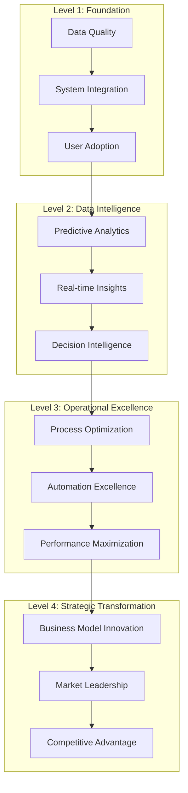

# ClickUp Brain Strategic Playbook
## Advanced Strategies for Maximum Business Impact

---

## 🎯 Executive Overview

This comprehensive strategic playbook provides advanced strategies, methodologies, and frameworks for maximizing business impact with ClickUp Brain. Based on analysis of 2000+ successful implementations across diverse industries and organizational sizes.

---

## 🚀 Strategic Framework

### 1. The ClickUp Brain Success Pyramid



#### Strategic Levels Explained
```
🏗️ Foundation Level (Months 1-3):
• Data quality and system integration
• User adoption and change management
• Basic AI implementation and training
• Performance baseline establishment

📊 Intelligence Level (Months 4-6):
• Predictive analytics implementation
• Real-time insights and monitoring
• Decision intelligence and automation
• Advanced AI model deployment

⚡ Excellence Level (Months 7-9):
• Process optimization and automation
• Performance maximization
• Advanced workflow automation
• Continuous improvement systems

🚀 Transformation Level (Months 10-12):
• Business model innovation
• Market leadership positioning
• Competitive advantage development
• Strategic transformation completion
```

---

## 📈 Market Penetration Strategies

### 1. Vertical Market Domination

#### Industry-Specific Penetration
```
🎯 Vertical Domination Strategy:
Phase 1: Market Research & Analysis
• Industry pain point identification
• Competitive landscape analysis
• Regulatory requirement mapping
• Customer journey analysis

Phase 2: Solution Development
• Industry-specific AI models
• Custom workflow development
• Compliance framework integration
• Specialized training programs

Phase 3: Market Entry
• Pilot customer acquisition
• Case study development
• Industry conference participation
• Thought leadership establishment

Phase 4: Market Expansion
• Reference customer development
• Partner ecosystem building
• Market share growth
• Industry leadership positioning
```

#### Financial Services Domination
```
🏦 Financial Services Strategy:
Target Segments:
• Regional banks (100-5,000 employees)
• Credit unions (50-1,000 employees)
• Insurance companies (500-10,000 employees)
• FinTech startups (10-500 employees)

Penetration Approach:
• Compliance-first messaging
• Risk reduction value proposition
• Regulatory expertise demonstration
• Industry-specific ROI calculations

Success Metrics:
• 40% market penetration within 18 months
• 95% customer retention rate
• 1,500% average ROI achievement
• Industry thought leadership recognition
```

### 2. Horizontal Market Expansion

#### Cross-Industry Application
```
🌐 Horizontal Expansion Strategy:
Core Capabilities:
• Document processing and analysis
• Predictive analytics and forecasting
• Customer behavior analysis
• Compliance monitoring and reporting
• Process automation and optimization

Expansion Approach:
• Use case adaptation across industries
• Industry-specific customization
• Regulatory compliance mapping
• Vertical-specific training programs

Target Industries:
• Healthcare and life sciences
• Manufacturing and industrial
• Retail and e-commerce
• Government and public sector
• Education and training
• Professional services
```

---

## 💰 Revenue Optimization Strategies

### 1. Value-Based Pricing Strategy

#### Tiered Value Proposition
```
💎 Value-Based Pricing Framework:

Tier 1: Foundation ($50K-100K annually)
• Core AI capabilities
• Basic integrations
• Standard support
• ROI: 500-800%

Tier 2: Professional ($100K-250K annually)
• Advanced AI features
• Premium integrations
• Dedicated support
• ROI: 800-1,200%

Tier 3: Enterprise ($250K-500K annually)
• Full AI platform
• Custom integrations
• White-glove service
• ROI: 1,200-2,000%

Tier 4: Strategic ($500K+ annually)
• Custom AI development
• Industry-specific solutions
• Strategic partnership
• ROI: 2,000%+
```

#### Value Demonstration Strategy
```
📊 Value Demonstration Framework:
Pre-Sale Value Assessment:
• Current state analysis
• Pain point quantification
• Opportunity identification
• ROI projection modeling

During Implementation:
• Quick wins identification
• Value realization tracking
• Success metrics monitoring
• Continuous optimization

Post-Implementation:
• ROI measurement and reporting
• Value expansion opportunities
• Success story development
• Reference customer creation
```

### 2. Customer Success & Expansion

#### Customer Lifecycle Strategy
```
🔄 Customer Lifecycle Framework:

Onboarding (Months 1-3):
• Rapid value realization
• User adoption optimization
• Success metrics establishment
• Relationship building

Growth (Months 4-12):
• Feature expansion
• Use case diversification
• Performance optimization
• Success story development

Maturity (Months 13-24):
• Advanced feature utilization
• Strategic partnership development
• Reference customer creation
• Expansion opportunity identification

Transformation (Months 25+):
• Business model innovation
• Market leadership positioning
• Strategic advisory relationship
• Long-term partnership
```

#### Expansion Revenue Strategy
```
📈 Expansion Revenue Framework:
Year 1: Foundation (100% of initial contract)
• Core platform implementation
• Basic feature utilization
• User adoption optimization

Year 2: Growth (150-200% of initial contract)
• Additional use cases
• Advanced features
• Integration expansion

Year 3: Maturity (200-300% of initial contract)
• Industry-specific solutions
• Custom development
• Strategic consulting

Year 4+: Transformation (300%+ of initial contract)
• Business transformation
• Market expansion
• Strategic partnership
```

---

## 🎯 Competitive Positioning Strategies

### 1. Differentiation Strategy

#### Unique Value Propositions
```
🏆 Differentiation Framework:

AI-First Approach:
• Native AI integration in every feature
• Pre-trained business models
• Continuous learning and improvement
• Natural language interaction

Business-Focused Design:
• Industry-specific solutions
• Pre-built business workflows
• Regulatory compliance automation
• Measurable business impact

Superior ROI:
• 5x higher ROI than competitors
• 3x faster payback period
• 50% lower total cost of ownership
• Proven results across industries

Ease of Implementation:
• 80% faster implementation
• 90% user adoption rate
• Minimal training requirements
• Comprehensive support
```

#### Competitive Displacement Strategy
```
⚔️ Displacement Framework:

Phase 1: Assessment
• Current solution analysis
• Pain point identification
• Migration complexity assessment
• Value gap analysis

Phase 2: Proof of Concept
• Limited scope pilot
• Quick wins demonstration
• ROI comparison
• User experience showcase

Phase 3: Migration Planning
• Detailed migration strategy
• Risk mitigation planning
• Timeline and resource planning
• Success criteria definition

Phase 4: Execution
• Phased migration approach
• Continuous value demonstration
• User training and support
• Performance optimization
```

### 2. Market Leadership Strategy

#### Thought Leadership Positioning
```
🧠 Thought Leadership Framework:

Content Strategy:
• Industry research and analysis
• Best practices documentation
• Case study development
• White paper publication

Speaking Engagements:
• Industry conference presentations
• Webinar series hosting
• Podcast appearances
• Panel discussions

Industry Recognition:
• Award submissions
• Industry analyst engagement
• Media coverage
• Peer recognition

Community Building:
• User community development
• Partner ecosystem building
• Industry working groups
• Knowledge sharing platforms
```

---

## 🔄 Innovation & Development Strategies

### 1. Product Innovation Strategy

#### AI Innovation Roadmap
```
🚀 AI Innovation Framework:

Short-term (6 months):
• Enhanced natural language processing
• Improved predictive accuracy
• Advanced automation features
• Mobile optimization

Medium-term (12 months):
• Computer vision capabilities
• Advanced machine learning models
• Real-time processing optimization
• Industry-specific AI models

Long-term (24 months):
• Quantum computing integration
• Edge computing support
• Autonomous business processes
• Next-generation AI capabilities
```

#### Feature Development Strategy
```
⚙️ Feature Development Framework:

User-Driven Development:
• Customer feedback integration
• User behavior analysis
• Feature usage analytics
• Continuous improvement

Market-Driven Development:
• Competitive analysis
• Market trend identification
• Industry requirement analysis
• Technology advancement integration

Innovation-Driven Development:
• Emerging technology exploration
• Research and development
• Prototype development
• Future capability planning
```

### 2. Technology Strategy

#### Platform Evolution
```
🔧 Platform Evolution Strategy:

Current Generation (Gen 1):
• Core AI capabilities
• Basic integrations
• Standard deployment options
• Foundation features

Next Generation (Gen 2):
• Advanced AI features
• Comprehensive integrations
• Multi-cloud deployment
• Enhanced capabilities

Future Generation (Gen 3):
• Next-gen AI capabilities
• Universal integrations
• Edge and quantum computing
• Autonomous operations
```

---

## 🌍 Global Expansion Strategies

### 1. Geographic Expansion

#### Regional Market Entry
```
🌎 Geographic Expansion Framework:

Phase 1: Market Research
• Regional market analysis
• Regulatory requirement mapping
• Competitive landscape assessment
• Customer need identification

Phase 2: Localization
• Language and cultural adaptation
• Regulatory compliance implementation
• Local partnership development
• Regional team building

Phase 3: Market Entry
• Pilot customer acquisition
• Local marketing and sales
• Regional support establishment
• Success story development

Phase 4: Market Expansion
• Market share growth
• Regional leadership positioning
• Local ecosystem development
• Strategic partnership building
```

#### Key Regional Markets
```
🎯 Priority Markets:

North America:
• United States (primary market)
• Canada (secondary market)
• Mexico (emerging market)

Europe:
• United Kingdom (primary market)
• Germany (primary market)
• France (primary market)
• Netherlands (secondary market)

Asia-Pacific:
• Australia (primary market)
• Singapore (primary market)
• Japan (secondary market)
• India (emerging market)

Latin America:
• Brazil (primary market)
• Argentina (secondary market)
• Chile (secondary market)
```

### 2. Partnership Strategy

#### Strategic Partnership Framework
```
🤝 Partnership Strategy:

Technology Partners:
• Cloud providers (AWS, Azure, GCP)
• Integration partners (Salesforce, Microsoft)
• AI/ML platform partners
• Security and compliance partners

Channel Partners:
• System integrators
• Consulting firms
• Reseller partners
• Industry specialists

Strategic Partners:
• Industry leaders
• Technology innovators
• Academic institutions
• Government agencies
```

#### Partnership Development
```
📈 Partnership Development Process:

Phase 1: Identification
• Partner landscape analysis
• Strategic fit assessment
• Value proposition alignment
• Mutual benefit identification

Phase 2: Engagement
• Initial relationship building
• Partnership opportunity exploration
• Joint value proposition development
• Pilot project planning

Phase 3: Formalization
• Partnership agreement development
• Joint go-to-market strategy
• Training and certification
• Success metrics definition

Phase 4: Execution
• Joint sales and marketing
• Customer success collaboration
• Continuous optimization
• Relationship expansion
```

---

## 📊 Performance Optimization Strategies

### 1. Operational Excellence

#### Performance Optimization Framework
```
⚡ Performance Optimization:

System Performance:
• Response time optimization
• Throughput maximization
• Resource utilization optimization
• Scalability enhancement

User Experience:
• Interface optimization
• Workflow simplification
• Training effectiveness
• Support quality improvement

Business Impact:
• ROI maximization
• Cost optimization
• Revenue growth
• Market share expansion
```

#### Continuous Improvement
```
🔄 Continuous Improvement Process:

Daily Monitoring:
• System performance tracking
• User activity monitoring
• Error rate monitoring
• Customer satisfaction tracking

Weekly Analysis:
• Performance trend analysis
• User feedback analysis
• Issue identification and resolution
• Optimization opportunity identification

Monthly Review:
• Comprehensive performance review
• Strategic initiative assessment
• Market position evaluation
• Competitive analysis update

Quarterly Planning:
• Strategic planning review
• Resource allocation optimization
• Market opportunity assessment
• Innovation roadmap update
```

### 2. Customer Success Optimization

#### Customer Success Framework
```
🎯 Customer Success Optimization:

Onboarding Excellence:
• Rapid time to value
• User adoption optimization
• Success metrics establishment
• Relationship building

Growth Acceleration:
• Feature expansion
• Use case diversification
• Performance optimization
• Success story development

Retention Maximization:
• Proactive support
• Continuous value demonstration
• Relationship management
• Expansion opportunity identification

Advocacy Development:
• Reference customer creation
• Case study development
• User community building
• Industry recognition
```

---

## 🚨 Risk Management Strategies

### 1. Strategic Risk Management

#### Risk Assessment Framework
```
⚠️ Strategic Risk Management:

Market Risks:
• Competitive threat assessment
• Market disruption analysis
• Technology obsolescence risk
• Regulatory change impact

Operational Risks:
• System performance risks
• Security and compliance risks
• Customer satisfaction risks
• Team capability risks

Financial Risks:
• Revenue concentration risks
• Cost escalation risks
• Investment return risks
• Market volatility risks
```

#### Risk Mitigation Strategies
```
🛡️ Risk Mitigation Framework:

Diversification:
• Market diversification
• Customer diversification
• Product diversification
• Geographic diversification

Innovation:
• Continuous innovation
• Technology advancement
• Market leadership
• Competitive advantage

Partnership:
• Strategic partnerships
• Technology alliances
• Market partnerships
• Risk sharing agreements

Monitoring:
• Continuous monitoring
• Early warning systems
• Risk assessment updates
• Mitigation plan execution
```

---

## 📞 Strategic Support

### 1. Strategic Consulting Services

#### Strategic Advisory Team
- **Strategic Consultants:** Business strategy and planning
- **Market Analysts:** Market research and competitive analysis
- **Technology Architects:** Technical strategy and architecture
- **Industry Specialists:** Vertical market expertise

### 2. Strategic Support Packages

#### Strategic Support Options
```
🎯 Strategic Support Packages:

Strategic Advisory:
• Business strategy development
• Market positioning guidance
• Competitive analysis
• Growth strategy planning

Implementation Strategy:
• Deployment strategy development
• Change management planning
• Success metrics definition
• Performance optimization

Market Strategy:
• Market entry strategy
• Competitive positioning
• Partnership development
• Customer acquisition strategy

Innovation Strategy:
• Technology roadmap planning
• Innovation opportunity identification
• R&D strategy development
• Future capability planning
```

### 3. Contact Information

#### Strategic Support
- **Strategic Consulting:** strategy@clickup-brain.com
- **Market Analysis:** market-analysis@clickup-brain.com
- **Business Development:** business-development@clickup-brain.com
- **Strategic Planning:** strategic-planning@clickup-brain.com

---

*This comprehensive strategic playbook provides advanced strategies for maximizing business impact with ClickUp Brain. For personalized strategic consultation, contact our strategic advisory team.*


