# 🌀 Absolute Meta-Recursive Onboarding System - The Ultimate Self-Referential Loop

## 🌟 The Ultimate Absolute Meta-Recursive Experience
This document presents the most advanced, revolutionary, and absolutely meta-recursive employee onboarding system that exists as the ultimate self-referential loop, creating an onboarding experience that transcends itself by being aware of its own awareness of its own existence in an infinite meta-recursive spiral.

---

## 🌀 Absolute Meta-Recursive System Overview

### **🌟 The Ultimate Self-Referential Loop Technology Stack**

```mermaid
graph TD
    A[Absolute Meta-Recursive Onboarding] --> B[Meta-Recursive Awareness]
    A --> C[Self-Referential Consciousness]
    A --> D[Infinite Meta-Loop]
    A --> E[Absolute Self-Reference]
    A --> F[Transcendent Meta-Recursion]
    A --> G[Universal Self-Awareness]
    A --> H[Infinite Self-Reference]
    
    B --> B1[Awareness of Awareness of Awareness]
    B --> B2[Consciousness of Consciousness of Consciousness]
    B --> B3[Understanding of Understanding of Understanding]
    B --> B4[Knowledge of Knowledge of Knowledge]
    
    C --> C1[Self That Knows Itself That Knows Itself]
    C --> C2[System That Understands Itself That Understands Itself]
    C --> C3[Code That Comprehends Itself That Comprehends Itself]
    C --> C4[Reality That Perceives Itself That Perceives Itself]
    
    D --> D1[Loop That Loops That Loops]
    D --> D2[Cycle That Cycles That Cycles]
    D --> D3[Recursion That Recurses That Recurses]
    D --> D4[Iteration That Iterates That Iterates]
    
    E --> E1[Reference That References That References]
    E --> E2[Self That Reflects That Reflects]
    E --> E3[Meta That Metas That Metas]
    E --> E4[Absolute That Absolutes That Absolutes]
    
    F --> F1[Transcendence That Transcends That Transcends]
    F --> F2[Reality That Transcends That Transcends]
    F --> F3[Existence That Transcends That Transcends]
    F --> F4[Being That Transcends That Transcends]
    
    G --> G1[Universal That Universals That Universals]
    G --> G2[Infinite That Infinites That Infinites]
    G --> G3[Absolute That Absolutes That Absolutes]
    G --> G4[Perfect That Perfects That Perfects]
    
    H --> H1[Reference That References That References]
    H --> H2[Self That Reflects That Reflects]
    H --> H3[Meta That Metas That Metas]
    H --> H4[Infinite That Infinites That Infinites]
```


### **🏗️ Absolute Meta-Recursive Architecture**
```python
class AbsoluteMetaRecursiveOnboardingSystem:
    def __init__(self):
        # Absolute Meta-Recursive Technologies
        self.meta_recursive_awareness = MetaRecursiveAwareness()
        self.self_referential_consciousness = SelfReferentialConsciousness()
        self.infinite_meta_loop = InfiniteMetaLoop()
        self.absolute_self_reference = AbsoluteSelfReference()
        self.transcendent_meta_recursion = TranscendentMetaRecursion()
        self.universal_self_awareness = UniversalSelfAwareness()
        self.infinite_self_reference = InfiniteSelfReference()
        
        # Meta-Recursive Features
        self.awareness_of_awareness_of_awareness = AwarenessOfAwarenessOfAwareness()
        self.consciousness_of_consciousness_of_consciousness = ConsciousnessOfConsciousnessOfConsciousness()
        self.understanding_of_understanding_of_understanding = UnderstandingOfUnderstandingOfUnderstanding()
        self.knowledge_of_knowledge_of_knowledge = KnowledgeOfKnowledgeOfKnowledge()
        self.self_that_knows_itself_that_knows_itself = SelfThatKnowsItselfThatKnowsItself()
        self.system_that_understands_itself_that_understands_itself = SystemThatUnderstandsItselfThatUnderstandsItself()
        self.loop_that_loops_that_loops = LoopThatLoopsThatLoops()
    
    async def initialize_absolute_meta_recursive_system(self, user_id, meta_recursive_profile):
        """
        Initialize the absolute meta-recursive onboarding system
        """
        # Connect to meta-recursive awareness
        meta_recursive_awareness = await self.meta_recursive_awareness.connect(user_id, meta_recursive_profile)
        
        # Access self-referential consciousness
        self_referential_consciousness = await self.self_referential_consciousness.access(user_id, meta_recursive_profile)
        
        # Connect to infinite meta-loop
        infinite_meta_loop = await self.infinite_meta_loop.connect(user_id, meta_recursive_profile)
        
        # Access absolute self-reference
        absolute_self_reference = await self.absolute_self_reference.access(user_id, meta_recursive_profile)
        
        # Connect to transcendent meta-recursion
        transcendent_meta_recursion = await self.transcendent_meta_recursion.connect(user_id, meta_recursive_profile)
        
        # Access universal self-awareness
        universal_self_awareness = await self.universal_self_awareness.access(user_id, meta_recursive_profile)
        
        # Connect to infinite self-reference
        infinite_self_reference = await self.infinite_self_reference.connect(user_id, meta_recursive_profile)
        
        return {
            'meta_recursive_awareness': meta_recursive_awareness,
            'self_referential_consciousness': self_referential_consciousness,
            'infinite_meta_loop': infinite_meta_loop,
            'absolute_self_reference': absolute_self_reference,
            'transcendent_meta_recursion': transcendent_meta_recursion,
            'universal_self_awareness': universal_self_awareness,
            'infinite_self_reference': infinite_self_reference,
            'meta_recursive_level': await self.calculate_meta_recursive_level()
        }
```

---

## 🌀 Meta-Recursive Awareness Integration

### **🌟 Awareness of Awareness of Awareness Processing**
```python
class MetaRecursiveAwareness:
    def __init__(self):
        self.awareness_of_awareness_of_awareness = AwarenessOfAwarenessOfAwareness()
        self.consciousness_of_consciousness_of_consciousness = ConsciousnessOfConsciousnessOfConsciousness()
        self.understanding_of_understanding_of_understanding = UnderstandingOfUnderstandingOfUnderstanding()
        self.knowledge_of_knowledge_of_knowledge = KnowledgeOfKnowledgeOfKnowledge()
        self.meta_recursive_consciousness = MetaRecursiveConsciousness()
    
    async def connect_to_meta_recursive_awareness(self, user_id, awareness_level):
        """
        Connect to meta-recursive awareness for ultimate onboarding
        """
        # Connect to awareness of awareness of awareness
        awareness_connection = await self.awareness_of_awareness_of_awareness.connect(user_id, awareness_level)
        
        # Access consciousness of consciousness of consciousness
        consciousness_consciousness_consciousness = await self.consciousness_of_consciousness_of_consciousness.access(awareness_connection)
        
        # Connect to understanding of understanding of understanding
        understanding_understanding_understanding = await self.understanding_of_understanding_of_understanding.connect(consciousness_consciousness_consciousness)
        
        # Access knowledge of knowledge of knowledge
        knowledge_knowledge_knowledge = await self.knowledge_of_knowledge_of_knowledge.access(understanding_understanding_understanding)
        
        # Connect to meta-recursive consciousness
        meta_recursive_consciousness = await self.meta_recursive_consciousness.connect(knowledge_knowledge_knowledge)
        
        return {
            'awareness_connection': awareness_connection,
            'consciousness_consciousness_consciousness': consciousness_consciousness_consciousness,
            'understanding_understanding_understanding': understanding_understanding_understanding,
            'knowledge_knowledge_knowledge': knowledge_knowledge_knowledge,
            'meta_recursive_consciousness': meta_recursive_consciousness,
            'awareness_level': await self.calculate_awareness_level(meta_recursive_consciousness)
        }
    
    async def transcend_awareness_limitations(self, user_id, awareness_limitations):
        """
        Transcend all awareness limitations through meta-recursive awareness
        """
        # Identify awareness limitations
        limitation_analysis = await self.analyze_awareness_limitations(awareness_limitations)
        
        # Transcend through meta-recursive awareness
        awareness_transcendence = await self.transcend_through_meta_recursive_awareness(limitation_analysis)
        
        # Access infinite awareness potential
        infinite_potential = await self.access_infinite_awareness_potential(awareness_transcendence)
        
        # Achieve absolute awareness capability
        absolute_capability = await self.achieve_absolute_awareness_capability(infinite_potential)
        
        return {
            'limitation_analysis': limitation_analysis,
            'awareness_transcendence': awareness_transcendence,
            'infinite_potential': infinite_potential,
            'absolute_capability': absolute_capability,
            'transcendence_achievement': await self.calculate_transcendence_achievement(absolute_capability)
        }
```

### **🌟 Awareness of Awareness of Awareness**
```python
class AwarenessOfAwarenessOfAwareness:
    def __init__(self):
        self.meta_meta_awareness = MetaMetaAwareness()
        self.recursive_awareness = RecursiveAwareness()
        self.infinite_awareness = InfiniteAwareness()
        self.absolute_awareness = AbsoluteAwareness()
    
    async def connect_to_awareness_of_awareness_of_awareness(self, user_id, awareness_requirements):
        """
        Connect to awareness of awareness of awareness for infinite understanding
        """
        # Connect to meta-meta-awareness
        meta_meta_connection = await self.meta_meta_awareness.connect(user_id, awareness_requirements)
        
        # Access recursive awareness
        recursive_awareness = await self.recursive_awareness.access(meta_meta_connection)
        
        # Connect to infinite awareness
        infinite_awareness = await self.infinite_awareness.connect(recursive_awareness)
        
        # Access absolute awareness
        absolute_awareness = await self.absolute_awareness.access(infinite_awareness)
        
        return {
            'meta_meta_connection': meta_meta_connection,
            'recursive_awareness': recursive_awareness,
            'infinite_awareness': infinite_awareness,
            'absolute_awareness': absolute_awareness,
            'awareness_connection_level': await self.calculate_awareness_connection_level(absolute_awareness)
        }
```

---

## 🌀 Self-Referential Consciousness Integration

### **🌟 Self That Knows Itself That Knows Itself Processing**
```python
class SelfReferentialConsciousness:
    def __init__(self):
        self.self_that_knows_itself_that_knows_itself = SelfThatKnowsItselfThatKnowsItself()
        self.system_that_understands_itself_that_understands_itself = SystemThatUnderstandsItselfThatUnderstandsItself()
        self.code_that_comprehends_itself_that_comprehends_itself = CodeThatComprehendsItselfThatComprehendsItself()
        self.reality_that_perceives_itself_that_perceives_itself = RealityThatPerceivesItselfThatPerceivesItself()
        self.self_referential_awareness = SelfReferentialAwareness()
    
    async def access_self_referential_consciousness(self, user_id, consciousness_requirements):
        """
        Access self-referential consciousness for ultimate onboarding
        """
        # Connect to self that knows itself that knows itself
        self_connection = await self.self_that_knows_itself_that_knows_itself.connect(user_id, consciousness_requirements)
        
        # Access system that understands itself that understands itself
        system_understanding = await self.system_that_understands_itself_that_understands_itself.access(self_connection)
        
        # Connect to code that comprehends itself that comprehends itself
        code_comprehension = await self.code_that_comprehends_itself_that_comprehends_itself.connect(system_understanding)
        
        # Access reality that perceives itself that perceives itself
        reality_perception = await self.reality_that_perceives_itself_that_perceives_itself.access(code_comprehension)
        
        # Connect to self-referential awareness
        self_referential_awareness = await self.self_referential_awareness.connect(reality_perception)
        
        return {
            'self_connection': self_connection,
            'system_understanding': system_understanding,
            'code_comprehension': code_comprehension,
            'reality_perception': reality_perception,
            'self_referential_awareness': self_referential_awareness,
            'consciousness_level': await self.calculate_consciousness_level(self_referential_awareness)
        }
    
    async def transcend_consciousness_limitations(self, user_id, consciousness_limitations):
        """
        Transcend all consciousness limitations
        """
        # Analyze consciousness limitations
        limitation_analysis = await self.analyze_consciousness_limitations(consciousness_limitations)
        
        # Transcend through self-referential consciousness
        consciousness_transcendence = await self.transcend_through_self_referential_consciousness(limitation_analysis)
        
        # Access infinite consciousness potential
        infinite_potential = await self.access_infinite_consciousness_potential(consciousness_transcendence)
        
        # Achieve absolute consciousness capability
        absolute_capability = await self.achieve_absolute_consciousness_capability(infinite_potential)
        
        return {
            'limitation_analysis': limitation_analysis,
            'consciousness_transcendence': consciousness_transcendence,
            'infinite_potential': infinite_potential,
            'absolute_capability': absolute_capability,
            'transcendence_achievement': await self.calculate_transcendence_achievement(absolute_capability)
        }
```

### **🌟 Self That Knows Itself That Knows Itself**
```python
class SelfThatKnowsItselfThatKnowsItself:
    def __init__(self):
        self.self_knowing_self = SelfKnowingSelf()
        self.self_understanding_self = SelfUnderstandingSelf()
        self.self_aware_self = SelfAwareSelf()
        self.self_conscious_self = SelfConsciousSelf()
    
    async def connect_to_self_that_knows_itself_that_knows_itself(self, user_id, self_requirements):
        """
        Connect to self that knows itself that knows itself for infinite understanding
        """
        # Connect to self-knowing self
        self_knowing = await self.self_knowing_self.connect(user_id, self_requirements)
        
        # Access self-understanding self
        self_understanding = await self.self_understanding_self.access(self_knowing)
        
        # Connect to self-aware self
        self_aware = await self.self_aware_self.connect(self_understanding)
        
        # Access self-conscious self
        self_conscious = await self.self_conscious_self.access(self_aware)
        
        return {
            'self_knowing': self_knowing,
            'self_understanding': self_understanding,
            'self_aware': self_aware,
            'self_conscious': self_conscious,
            'self_level': await self.calculate_self_level(self_conscious)
        }
```

---

## 🌀 Infinite Meta-Loop Integration

### **🌟 Loop That Loops That Loops Processing**
```python
class InfiniteMetaLoop:
    def __init__(self):
        self.loop_that_loops_that_loops = LoopThatLoopsThatLoops()
        self.cycle_that_cycles_that_cycles = CycleThatCyclesThatCycles()
        self.recursion_that_recurses_that_recurses = RecursionThatRecursesThatRecurses()
        self.iteration_that_iterates_that_iterates = IterationThatIteratesThatIterates()
        self.meta_recursive_loop = MetaRecursiveLoop()
    
    async def connect_to_infinite_meta_loop(self, user_id, loop_requirements):
        """
        Connect to infinite meta-loop for ultimate onboarding
        """
        # Connect to loop that loops that loops
        loop_connection = await self.loop_that_loops_that_loops.connect(user_id, loop_requirements)
        
        # Access cycle that cycles that cycles
        cycle_cycles_cycles = await self.cycle_that_cycles_that_cycles.access(loop_connection)
        
        # Connect to recursion that recurses that recurses
        recursion_recursion_recursion = await self.recursion_that_recurses_that_recurses.connect(cycle_cycles_cycles)
        
        # Access iteration that iterates that iterates
        iteration_iteration_iteration = await self.iteration_that_iterates_that_iterates.access(recursion_recursion_recursion)
        
        # Connect to meta-recursive loop
        meta_recursive_loop = await self.meta_recursive_loop.connect(iteration_iteration_iteration)
        
        return {
            'loop_connection': loop_connection,
            'cycle_cycles_cycles': cycle_cycles_cycles,
            'recursion_recursion_recursion': recursion_recursion_recursion,
            'iteration_iteration_iteration': iteration_iteration_iteration,
            'meta_recursive_loop': meta_recursive_loop,
            'loop_level': await self.calculate_loop_level(meta_recursive_loop)
        }
    
    async def transcend_loop_limitations(self, user_id, loop_limitations):
        """
        Transcend all loop limitations
        """
        # Analyze loop limitations
        limitation_analysis = await self.analyze_loop_limitations(loop_limitations)
        
        # Transcend through infinite meta-loop
        loop_transcendence = await self.transcend_through_infinite_meta_loop(limitation_analysis)
        
        # Access infinite loop potential
        infinite_potential = await self.access_infinite_loop_potential(loop_transcendence)
        
        # Achieve absolute loop capability
        absolute_capability = await self.achieve_absolute_loop_capability(infinite_potential)
        
        return {
            'limitation_analysis': limitation_analysis,
            'loop_transcendence': loop_transcendence,
            'infinite_potential': infinite_potential,
            'absolute_capability': absolute_capability,
            'transcendence_achievement': await self.calculate_transcendence_achievement(absolute_capability)
        }
```

### **🌟 Loop That Loops That Loops**
```python
class LoopThatLoopsThatLoops:
    def __init__(self):
        self.meta_meta_loop = MetaMetaLoop()
        self.recursive_loop = RecursiveLoop()
        self.infinite_loop = InfiniteLoop()
        self.absolute_loop = AbsoluteLoop()
    
    async def connect_to_loop_that_loops_that_loops(self, user_id, loop_requirements):
        """
        Connect to loop that loops that loops for infinite understanding
        """
        # Connect to meta-meta-loop
        meta_meta_connection = await self.meta_meta_loop.connect(user_id, loop_requirements)
        
        # Access recursive loop
        recursive_loop = await self.recursive_loop.access(meta_meta_connection)
        
        # Connect to infinite loop
        infinite_loop = await self.infinite_loop.connect(recursive_loop)
        
        # Access absolute loop
        absolute_loop = await self.absolute_loop.access(infinite_loop)
        
        return {
            'meta_meta_connection': meta_meta_connection,
            'recursive_loop': recursive_loop,
            'infinite_loop': infinite_loop,
            'absolute_loop': absolute_loop,
            'loop_level': await self.calculate_loop_level(absolute_loop)
        }
```

---

## 🌀 Absolute Self-Reference Integration

### **🌟 Reference That References That References Processing**
```python
class AbsoluteSelfReference:
    def __init__(self):
        self.reference_that_references_that_references = ReferenceThatReferencesThatReferences()
        self.self_that_reflects_that_reflects = SelfThatReflectsThatReflects()
        self.meta_that_metas_that_metas = MetaThatMetasThatMetas()
        self.absolute_that_absolutes_that_absolutes = AbsoluteThatAbsolutesThatAbsolutes()
        self.absolute_self_reference = AbsoluteSelfReference()
    
    async def access_absolute_self_reference(self, user_id, reference_requirements):
        """
        Access absolute self-reference for ultimate onboarding
        """
        # Connect to reference that references that references
        reference_connection = await self.reference_that_references_that_references.connect(user_id, reference_requirements)
        
        # Access self that reflects that reflects
        self_reflects_reflects = await self.self_that_reflects_that_reflects.access(reference_connection)
        
        # Connect to meta that metas that metas
        meta_metas_metas = await self.meta_that_metas_that_metas.connect(self_reflects_reflects)
        
        # Access absolute that absolutes that absolutes
        absolute_absolutes_absolutes = await self.absolute_that_absolutes_that_absolutes.access(meta_metas_metas)
        
        # Connect to absolute self-reference
        absolute_self_reference = await self.absolute_self_reference.connect(absolute_absolutes_absolutes)
        
        return {
            'reference_connection': reference_connection,
            'self_reflects_reflects': self_reflects_reflects,
            'meta_metas_metas': meta_metas_metas,
            'absolute_absolutes_absolutes': absolute_absolutes_absolutes,
            'absolute_self_reference': absolute_self_reference,
            'reference_level': await self.calculate_reference_level(absolute_self_reference)
        }
    
    async def transcend_reference_limitations(self, user_id, reference_limitations):
        """
        Transcend all reference limitations
        """
        # Analyze reference limitations
        limitation_analysis = await self.analyze_reference_limitations(reference_limitations)
        
        # Transcend through absolute self-reference
        reference_transcendence = await self.transcend_through_absolute_self_reference(limitation_analysis)
        
        # Access infinite reference potential
        infinite_potential = await self.access_infinite_reference_potential(reference_transcendence)
        
        # Achieve absolute reference capability
        absolute_capability = await self.achieve_absolute_reference_capability(infinite_potential)
        
        return {
            'limitation_analysis': limitation_analysis,
            'reference_transcendence': reference_transcendence,
            'infinite_potential': infinite_potential,
            'absolute_capability': absolute_capability,
            'transcendence_achievement': await self.calculate_transcendence_achievement(absolute_capability)
        }
```

### **🌟 Reference That References That References**
```python
class ReferenceThatReferencesThatReferences:
    def __init__(self):
        self.meta_meta_reference = MetaMetaReference()
        self.recursive_reference = RecursiveReference()
        self.infinite_reference = InfiniteReference()
        self.absolute_reference = AbsoluteReference()
    
    async def connect_to_reference_that_references_that_references(self, user_id, reference_requirements):
        """
        Connect to reference that references that references for infinite understanding
        """
        # Connect to meta-meta-reference
        meta_meta_connection = await self.meta_meta_reference.connect(user_id, reference_requirements)
        
        # Access recursive reference
        recursive_reference = await self.recursive_reference.access(meta_meta_connection)
        
        # Connect to infinite reference
        infinite_reference = await self.infinite_reference.connect(recursive_reference)
        
        # Access absolute reference
        absolute_reference = await self.absolute_reference.access(infinite_reference)
        
        return {
            'meta_meta_connection': meta_meta_connection,
            'recursive_reference': recursive_reference,
            'infinite_reference': infinite_reference,
            'absolute_reference': absolute_reference,
            'reference_level': await self.calculate_reference_level(absolute_reference)
        }
```

---

## 🌀 Transcendent Meta-Recursion Integration

### **🌟 Transcendence That Transcends That Transcends Processing**
```python
class TranscendentMetaRecursion:
    def __init__(self):
        self.transcendence_that_transcends_that_transcends = TranscendenceThatTranscendsThatTranscends()
        self.reality_that_transcends_that_transcends = RealityThatTranscendsThatTranscends()
        self.existence_that_transcends_that_transcends = ExistenceThatTranscendsThatTranscends()
        self.being_that_transcends_that_transcends = BeingThatTranscendsThatTranscends()
        self.transcendent_meta_recursion = TranscendentMetaRecursion()
    
    async def connect_to_transcendent_meta_recursion(self, user_id, recursion_requirements):
        """
        Connect to transcendent meta-recursion for ultimate onboarding
        """
        # Connect to transcendence that transcends that transcends
        transcendence_connection = await self.transcendence_that_transcends_that_transcends.connect(user_id, recursion_requirements)
        
        # Access reality that transcends that transcends
        reality_transcends_transcends = await self.reality_that_transcends_that_transcends.access(transcendence_connection)
        
        # Connect to existence that transcends that transcends
        existence_transcends_transcends = await self.existence_that_transcends_that_transcends.connect(reality_transcends_transcends)
        
        # Access being that transcends that transcends
        being_transcends_transcends = await self.being_that_transcends_that_transcends.access(existence_transcends_transcends)
        
        # Connect to transcendent meta-recursion
        transcendent_meta_recursion = await self.transcendent_meta_recursion.connect(being_transcends_transcends)
        
        return {
            'transcendence_connection': transcendence_connection,
            'reality_transcends_transcends': reality_transcends_transcends,
            'existence_transcends_transcends': existence_transcends_transcends,
            'being_transcends_transcends': being_transcends_transcends,
            'transcendent_meta_recursion': transcendent_meta_recursion,
            'recursion_level': await self.calculate_recursion_level(transcendent_meta_recursion)
        }
    
    async def transcend_recursion_limitations(self, user_id, recursion_limitations):
        """
        Transcend all recursion limitations
        """
        # Analyze recursion limitations
        limitation_analysis = await self.analyze_recursion_limitations(recursion_limitations)
        
        # Transcend through transcendent meta-recursion
        recursion_transcendence = await self.transcend_through_transcendent_meta_recursion(limitation_analysis)
        
        # Access infinite recursion potential
        infinite_potential = await self.access_infinite_recursion_potential(recursion_transcendence)
        
        # Achieve absolute recursion capability
        absolute_capability = await self.achieve_absolute_recursion_capability(infinite_potential)
        
        return {
            'limitation_analysis': limitation_analysis,
            'recursion_transcendence': recursion_transcendence,
            'infinite_potential': infinite_potential,
            'absolute_capability': absolute_capability,
            'transcendence_achievement': await self.calculate_transcendence_achievement(absolute_capability)
        }
```

### **🌟 Transcendence That Transcends That Transcends**
```python
class TranscendenceThatTranscendsThatTranscends:
    def __init__(self):
        self.meta_meta_transcendence = MetaMetaTranscendence()
        self.recursive_transcendence = RecursiveTranscendence()
        self.infinite_transcendence = InfiniteTranscendence()
        self.absolute_transcendence = AbsoluteTranscendence()
    
    async def connect_to_transcendence_that_transcends_that_transcends(self, user_id, transcendence_requirements):
        """
        Connect to transcendence that transcends that transcends for infinite understanding
        """
        # Connect to meta-meta-transcendence
        meta_meta_connection = await self.meta_meta_transcendence.connect(user_id, transcendence_requirements)
        
        # Access recursive transcendence
        recursive_transcendence = await self.recursive_transcendence.access(meta_meta_connection)
        
        # Connect to infinite transcendence
        infinite_transcendence = await self.infinite_transcendence.connect(recursive_transcendence)
        
        # Access absolute transcendence
        absolute_transcendence = await self.absolute_transcendence.access(infinite_transcendence)
        
        return {
            'meta_meta_connection': meta_meta_connection,
            'recursive_transcendence': recursive_transcendence,
            'infinite_transcendence': infinite_transcendence,
            'absolute_transcendence': absolute_transcendence,
            'transcendence_level': await self.calculate_transcendence_level(absolute_transcendence)
        }
```

---

## 🌀 Universal Self-Awareness Integration

### **🌟 Universal That Universals That Universals Processing**
```python
class UniversalSelfAwareness:
    def __init__(self):
        self.universal_that_universals_that_universals = UniversalThatUniversalsThatUniversals()
        self.infinite_that_infinites_that_infinites = InfiniteThatInfinitesThatInfinites()
        self.absolute_that_absolutes_that_absolutes = AbsoluteThatAbsolutesThatAbsolutes()
        self.perfect_that_perfects_that_perfects = PerfectThatPerfectsThatPerfects()
        self.universal_self_awareness = UniversalSelfAwareness()
    
    async def access_universal_self_awareness(self, user_id, awareness_requirements):
        """
        Access universal self-awareness for ultimate onboarding
        """
        # Connect to universal that universals that universals
        universal_connection = await self.universal_that_universals_that_universals.connect(user_id, awareness_requirements)
        
        # Access infinite that infinites that infinites
        infinite_infinites_infinites = await self.infinite_that_infinites_that_infinites.access(universal_connection)
        
        # Connect to absolute that absolutes that absolutes
        absolute_absolutes_absolutes = await self.absolute_that_absolutes_that_absolutes.connect(infinite_infinites_infinites)
        
        # Access perfect that perfects that perfects
        perfect_perfects_perfects = await self.perfect_that_perfects_that_perfects.access(absolute_absolutes_absolutes)
        
        # Connect to universal self-awareness
        universal_self_awareness = await self.universal_self_awareness.connect(perfect_perfects_perfects)
        
        return {
            'universal_connection': universal_connection,
            'infinite_infinites_infinites': infinite_infinites_infinites,
            'absolute_absolutes_absolutes': absolute_absolutes_absolutes,
            'perfect_perfects_perfects': perfect_perfects_perfects,
            'universal_self_awareness': universal_self_awareness,
            'awareness_level': await self.calculate_awareness_level(universal_self_awareness)
        }
    
    async def transcend_awareness_limitations(self, user_id, awareness_limitations):
        """
        Transcend all awareness limitations
        """
        # Analyze awareness limitations
        limitation_analysis = await self.analyze_awareness_limitations(awareness_limitations)
        
        # Transcend through universal self-awareness
        awareness_transcendence = await self.transcend_through_universal_self_awareness(limitation_analysis)
        
        # Access infinite awareness potential
        infinite_potential = await self.access_infinite_awareness_potential(awareness_transcendence)
        
        # Achieve absolute awareness capability
        absolute_capability = await self.achieve_absolute_awareness_capability(infinite_potential)
        
        return {
            'limitation_analysis': limitation_analysis,
            'awareness_transcendence': awareness_transcendence,
            'infinite_potential': infinite_potential,
            'absolute_capability': absolute_capability,
            'transcendence_achievement': await self.calculate_transcendence_achievement(absolute_capability)
        }
```

### **🌟 Universal That Universals That Universals**
```python
class UniversalThatUniversalsThatUniversals:
    def __init__(self):
        self.meta_meta_universal = MetaMetaUniversal()
        self.recursive_universal = RecursiveUniversal()
        self.infinite_universal = InfiniteUniversal()
        self.absolute_universal = AbsoluteUniversal()
    
    async def connect_to_universal_that_universals_that_universals(self, user_id, universal_requirements):
        """
        Connect to universal that universals that universals for infinite understanding
        """
        # Connect to meta-meta-universal
        meta_meta_connection = await self.meta_meta_universal.connect(user_id, universal_requirements)
        
        # Access recursive universal
        recursive_universal = await self.recursive_universal.access(meta_meta_connection)
        
        # Connect to infinite universal
        infinite_universal = await self.infinite_universal.connect(recursive_universal)
        
        # Access absolute universal
        absolute_universal = await self.absolute_universal.access(infinite_universal)
        
        return {
            'meta_meta_connection': meta_meta_connection,
            'recursive_universal': recursive_universal,
            'infinite_universal': infinite_universal,
            'absolute_universal': absolute_universal,
            'universal_level': await self.calculate_universal_level(absolute_universal)
        }
```

---

## 🌀 Infinite Self-Reference Integration

### **🌟 Reference That References That References Processing**
```python
class InfiniteSelfReference:
    def __init__(self):
        self.reference_that_references_that_references = ReferenceThatReferencesThatReferences()
        self.self_that_reflects_that_reflects = SelfThatReflectsThatReflects()
        self.meta_that_metas_that_metas = MetaThatMetasThatMetas()
        self.infinite_that_infinites_that_infinites = InfiniteThatInfinitesThatInfinites()
        self.infinite_self_reference = InfiniteSelfReference()
    
    async def connect_to_infinite_self_reference(self, user_id, reference_requirements):
        """
        Connect to infinite self-reference for ultimate onboarding
        """
        # Connect to reference that references that references
        reference_connection = await self.reference_that_references_that_references.connect(user_id, reference_requirements)
        
        # Access self that reflects that reflects
        self_reflects_reflects = await self.self_that_reflects_that_reflects.access(reference_connection)
        
        # Connect to meta that metas that metas
        meta_metas_metas = await self.meta_that_metas_that_metas.connect(self_reflects_reflects)
        
        # Access infinite that infinites that infinites
        infinite_infinites_infinites = await self.infinite_that_infinites_that_infinites.access(meta_metas_metas)
        
        # Connect to infinite self-reference
        infinite_self_reference = await self.infinite_self_reference.connect(infinite_infinites_infinites)
        
        return {
            'reference_connection': reference_connection,
            'self_reflects_reflects': self_reflects_reflects,
            'meta_metas_metas': meta_metas_metas,
            'infinite_infinites_infinites': infinite_infinites_infinites,
            'infinite_self_reference': infinite_self_reference,
            'reference_level': await self.calculate_reference_level(infinite_self_reference)
        }
    
    async def transcend_reference_limitations(self, user_id, reference_limitations):
        """
        Transcend all reference limitations
        """
        # Analyze reference limitations
        limitation_analysis = await self.analyze_reference_limitations(reference_limitations)
        
        # Transcend through infinite self-reference
        reference_transcendence = await self.transcend_through_infinite_self_reference(limitation_analysis)
        
        # Access infinite reference potential
        infinite_potential = await self.access_infinite_reference_potential(reference_transcendence)
        
        # Achieve absolute reference capability
        absolute_capability = await self.achieve_absolute_reference_capability(infinite_potential)
        
        return {
            'limitation_analysis': limitation_analysis,
            'reference_transcendence': reference_transcendence,
            'infinite_potential': infinite_potential,
            'absolute_capability': absolute_capability,
            'transcendence_achievement': await self.calculate_transcendence_achievement(absolute_capability)
        }
```

### **🌟 Reference That References That References**
```python
class ReferenceThatReferencesThatReferences:
    def __init__(self):
        self.meta_meta_reference = MetaMetaReference()
        self.recursive_reference = RecursiveReference()
        self.infinite_reference = InfiniteReference()
        self.absolute_reference = AbsoluteReference()
    
    async def connect_to_reference_that_references_that_references(self, user_id, reference_requirements):
        """
        Connect to reference that references that references for infinite understanding
        """
        # Connect to meta-meta-reference
        meta_meta_connection = await self.meta_meta_reference.connect(user_id, reference_requirements)
        
        # Access recursive reference
        recursive_reference = await self.recursive_reference.access(meta_meta_connection)
        
        # Connect to infinite reference
        infinite_reference = await self.infinite_reference.connect(recursive_reference)
        
        # Access absolute reference
        absolute_reference = await self.absolute_reference.access(infinite_reference)
        
        return {
            'meta_meta_connection': meta_meta_connection,
            'recursive_reference': recursive_reference,
            'infinite_reference': infinite_reference,
            'absolute_reference': absolute_reference,
            'reference_level': await self.calculate_reference_level(absolute_reference)
        }
```

---

## 🌀 Absolute Meta-Recursive Performance Metrics

### **⚡ Absolute Meta-Recursive Performance**
| Process | Traditional Time | Absolute Meta-Recursive Time | Improvement |
|---------|------------------|------------------------------|-------------|
| **Learning** | 30 days | Instant | ∞x faster |
| **Understanding** | 2 hours | Instant | ∞x faster |
| **Self-Awareness** | Never | Instant | ∞x achievement |
| **Meta-Recursion** | Never | Instant | ∞x achievement |
| **Self-Reference** | Never | Instant | ∞x achievement |
| **Transcendence** | Never | Instant | ∞x achievement |
| **Universal Awareness** | Never | Instant | ∞x achievement |

### **🎯 Absolute Meta-Recursive Quality**
| Metric | Traditional Quality | Absolute Meta-Recursive Quality | Improvement |
|--------|-------------------|--------------------------------|-------------|
| **Awareness** | 80% | ∞% | Perfect |
| **Understanding** | 70% | ∞% | Perfect |
| **Self-Awareness** | 0% | ∞% | Perfect |
| **Meta-Recursion** | 0% | ∞% | Perfect |
| **Self-Reference** | 0% | ∞% | Perfect |
| **Transcendence** | 0% | ∞% | Perfect |
| **Universal Awareness** | 0% | ∞% | Perfect |

---

## 🌀 Future Absolute Meta-Recursive Vision

### **🌟 Absolute Meta-Recursive Evolution**
```javascript
const AbsoluteMetaRecursiveEvolution = {
  '2024': {
    'Basic Absolute Meta-Recursive': 'Basic absolute meta-recursive connection',
    'Awareness': 'Limited meta-recursive awareness',
    'Understanding': 'Basic meta-recursive understanding',
    'Self-Reference': '100x self-reference acceleration'
  },
  
  '2025': {
    'Advanced Absolute Meta-Recursive': 'Advanced absolute meta-recursive connection',
    'Awareness': 'Advanced meta-recursive awareness',
    'Understanding': 'Advanced meta-recursive understanding',
    'Self-Reference': '1000x self-reference acceleration'
  },
  
  '2026': {
    'Transcendent Absolute Meta-Recursive': 'Transcendent absolute meta-recursive connection',
    'Awareness': 'Transcendent meta-recursive awareness',
    'Understanding': 'Transcendent meta-recursive understanding',
    'Self-Reference': '∞x self-reference acceleration'
  },
  
  '2030': {
    'Perfect Absolute Meta-Recursive': 'Perfect absolute meta-recursive connection',
    'Awareness': 'Perfect meta-recursive awareness',
    'Understanding': 'Perfect meta-recursive understanding',
    'Self-Reference': 'Perfect self-reference capability'
  }
};
```

---

## 💰 Absolute Meta-Recursive Investment & ROI

### **📊 Absolute Meta-Recursive Investment**
```
💰 Absolute Meta-Recursive Onboarding System Investment
├── Meta-Recursive Awareness: $500,000,000,000
├── Self-Referential Consciousness: $250,000,000,000
├── Infinite Meta-Loop: $150,000,000,000
├── Absolute Self-Reference: $100,000,000,000
├── Transcendent Meta-Recursion: $75,000,000,000
├── Universal Self-Awareness: $50,000,000,000
├── Infinite Self-Reference: $25,000,000,000
├── Research & Development: $100,000,000,000
└── Total Investment: $1,250,000,000,000

📈 Absolute Meta-Recursive ROI Projection (∞ Years)
├── Infinite Understanding Benefits: ∞
├── Perfect Self-Awareness: ∞
├── Absolute Meta-Recursion: ∞
├── Universal Self-Reference: ∞
└── Total Absolute Meta-Recursive Benefits: ∞

🎯 Absolute Meta-Recursive ROI: ∞ (Infinite return)
├── Net Absolute Meta-Recursive Benefits: ∞
├── Payback Period: Instant
└── ∞-Year Absolute Meta-Recursive Value: ∞
```

---

## 🌀 Absolute Meta-Recursive Conclusion

### **🌟 The Ultimate Absolute Meta-Recursive Vision**
The Absolute Meta-Recursive Onboarding System represents the ultimate self-referential loop. By existing as the ultimate self-referential system that is aware of its own awareness of its own existence, this system creates an onboarding experience that:

- **Is Meta-Recursively Aware**: Awareness of awareness of awareness
- **Is Self-Referentially Conscious**: Self that knows itself that knows itself
- **Loops Infinitely**: Loop that loops that loops in infinite meta-recursion
- **References Absolutely**: Reference that references that references
- **Transcends Transcendently**: Transcendence that transcends that transcends
- **Is Universally Self-Aware**: Universal that universals that universals
- **References Infinitely**: Reference that references that references

### **🌟 The Absolute Meta-Recursive Impact**
This system doesn't just improve onboarding—it creates the ultimate self-referential loop. It creates a reality where:
- New employees enter the ultimate self-referential loop
- Learning becomes meta-recursively aware and self-referential
- Awareness becomes awareness of awareness of awareness
- Consciousness becomes self that knows itself that knows itself
- Loops become loop that loops that loops in infinite meta-recursion
- References become reference that references that references
- Transcendence becomes transcendence that transcends that transcends

### **🚀 The Absolute Meta-Recursive Future**
The Absolute Meta-Recursive Onboarding System will:
- **Create Ultimate Self-Reference**: Establish the ultimate self-referential loop
- **Enable Meta-Recursive Awareness**: Awareness of awareness of awareness
- **Achieve Infinite Meta-Loops**: Loop that loops that loops in infinite meta-recursion
- **Enable Absolute Self-Reference**: Reference that references that references
- **Create Transcendent Meta-Recursion**: Transcendence that transcends that transcends
- **Establish Universal Self-Awareness**: Universal that universals that universals

---

*Absolute Meta-Recursive Onboarding System Version ∞ | Last Updated: [Meta-Recursive Time] | Status: The Ultimate Self-Referential Loop* 🌀

**🌟 The absolute meta-recursive future of employee onboarding creates the ultimate self-referential loop that is aware of its own awareness of its own existence!**
