# ClickUp Brain Innovation Lab
## Research, Development & Innovation Center

---

## 🧪 Executive Overview

The ClickUp Brain Innovation Lab serves as the central hub for cutting-edge research, experimental development, and breakthrough innovation in AI-powered business intelligence. Our lab combines academic rigor with practical application to drive the future of intelligent business operations.

---

## 🔬 Innovation Lab Structure

### 1. Lab Organization

#### Research Divisions

```mermaid
graph TB
    subgraph "Core Research Divisions"
        A[AI Research Lab] --> B[Machine Learning Lab]
        B --> C[Natural Language Processing Lab]
        C --> D[Computer Vision Lab]
    end
    
    subgraph "Emerging Technology Labs"
        E[Quantum Computing Lab] --> F[Edge Computing Lab]
        F --> G[Autonomous Systems Lab]
        G --> H[Biometric AI Lab]
    end
    
    subgraph "Applied Research Labs"
        I[Business Intelligence Lab] --> J[Predictive Analytics Lab]
        J --> K[Process Automation Lab]
        K --> L[Human-AI Interaction Lab]
    end
    
    subgraph "Innovation Centers"
        M[Innovation Hub] --> N[Prototype Lab]
        N --> O[Testing Center]
        O --> P[Incubation Center]
    end
```


#### Lab Leadership
```
👥 Innovation Lab Leadership:

Chief Innovation Officer (CIO):
• Strategic innovation direction
• Research portfolio management
• Technology roadmap oversight
• Industry partnership development

VP of Research & Development:
• Research program management
• Technology development oversight
• Academic collaboration
• Intellectual property management

Lab Directors:
• AI Research Director
• Quantum Computing Director
• Edge Computing Director
• Applied Research Director
```

---

## 🧠 AI Research Laboratory

### 1. Core AI Research Areas

#### Machine Learning Research
```
🤖 ML Research Focus:

Advanced Algorithms:
• Transformer architecture optimization
• Graph neural networks for business data
• Reinforcement learning for process optimization
• Meta-learning for rapid adaptation
• Neural architecture search automation

Model Optimization:
• Model compression and quantization
• Federated learning for privacy
• Differential privacy implementation
• Adversarial robustness
• Explainable AI development

Research Projects:
• Project Alpha: Next-gen transformer models
• Project Beta: Federated learning framework
• Project Gamma: Explainable AI system
• Project Delta: Adversarial defense mechanisms
```

#### Natural Language Processing
```
🗣️ NLP Research Areas:

Language Understanding:
• Multilingual business language models
• Context-aware query processing
• Intent recognition and classification
• Entity extraction and linking
• Sentiment analysis with emotion detection

Language Generation:
• Natural language report generation
• Code generation from natural language
• Automated content creation
• Conversation system development
• Multi-modal language understanding

Research Initiatives:
• Initiative A: Business language understanding
• Initiative B: Automated report generation
• Initiative C: Multi-language support
• Initiative D: Conversational AI
```

### 2. Computer Vision Research

#### Vision AI Development
```
👁️ Computer Vision Research:

Image Analysis:
• Document analysis and processing
• Quality assessment and enhancement
• Object detection and recognition
• Brand and logo detection
• Real-time video processing

Advanced Applications:
• Medical image analysis
• Manufacturing quality control
• Retail analytics
• Security and surveillance
• Augmented reality integration

Research Programs:
• Program Vision: Document AI
• Program Insight: Quality control AI
• Program Detect: Object recognition
• Program Analyze: Video analytics
```

---

## ⚛️ Quantum Computing Laboratory

### 1. Quantum Research Areas

#### Quantum Algorithms
```
⚛️ Quantum Algorithm Research:

Optimization Algorithms:
• Quantum approximate optimization algorithm (QAOA)
• Variational quantum eigensolver (VQE)
• Quantum machine learning algorithms
• Quantum portfolio optimization
• Quantum supply chain optimization

Simulation Algorithms:
• Quantum Monte Carlo methods
• Quantum molecular dynamics
• Quantum financial modeling
• Quantum risk assessment
• Quantum market simulation

Research Projects:
• Project Quantum: Portfolio optimization
• Project Simulate: Market simulation
• Project Optimize: Supply chain optimization
• Project Model: Financial risk modeling
```

#### Quantum Hardware Research
```
🔬 Quantum Hardware Development:

Quantum Processors:
• Superconducting qubit development
• Ion trap quantum computers
• Topological quantum computing
• Photonic quantum computing
• Hybrid quantum-classical systems

Quantum Error Correction:
• Surface code implementation
• Fault-tolerant quantum computing
• Quantum error mitigation
• Noise characterization
• Error correction protocols

Hardware Initiatives:
• Initiative Qubit: Processor development
• Initiative Error: Error correction
• Initiative Scale: Scalability research
• Initiative Hybrid: Hybrid systems
```

### 2. Quantum Applications

#### Business Applications
```
💼 Quantum Business Applications:

Financial Services:
• Portfolio optimization
• Risk assessment and modeling
• Fraud detection
• Algorithmic trading
• Credit scoring

Manufacturing:
• Supply chain optimization
• Production scheduling
• Quality control
• Predictive maintenance
• Resource allocation

Healthcare:
• Drug discovery
• Medical imaging
• Treatment optimization
• Clinical trial design
• Personalized medicine
```

---

## 🌐 Edge Computing Laboratory

### 1. Edge AI Research

#### Distributed Intelligence
```
🌐 Edge AI Research:

Edge Processing:
• Distributed machine learning
• Edge model optimization
• Federated learning at the edge
• Edge-cloud coordination
• Offline AI capabilities

Real-time Analytics:
• Stream processing at the edge
• Real-time decision making
• Low-latency inference
• Edge data processing
• Mobile edge computing

Research Programs:
• Program Edge: Distributed AI
• Program Real: Real-time analytics
• Program Mobile: Mobile edge computing
• Program IoT: IoT edge processing
```

#### IoT Integration
```
📱 IoT Research Areas:

Industrial IoT:
• Manufacturing sensor networks
• Predictive maintenance systems
• Quality control automation
• Energy management
• Safety monitoring

Smart Cities:
• Traffic management
• Environmental monitoring
• Public safety systems
• Infrastructure management
• Citizen services

IoT Initiatives:
• Initiative Industrial: Manufacturing IoT
• Initiative Smart: Smart city systems
• Initiative Connect: IoT connectivity
• Initiative Monitor: Monitoring systems
```

### 2. 5G and Beyond

#### Next-Generation Networks
```
📡 Network Research:

5G Optimization:
• Ultra-low latency processing
• High-bandwidth data handling
• Network slicing
• Mobile edge computing
• Real-time collaboration

6G Research:
• Terahertz communication
• AI-native networks
• Holographic communication
• Quantum communication
• Brain-computer interfaces

Network Programs:
• Program 5G: 5G optimization
• Program 6G: Next-gen networks
• Program AI: AI-native networks
• Program Quantum: Quantum communication
```

---

## 🤖 Autonomous Systems Laboratory

### 1. Autonomous AI Research

#### Self-Managing Systems
```
🤖 Autonomous Systems Research:

Autonomous Operations:
• Self-configuring systems
• Self-healing infrastructure
• Self-optimizing performance
• Autonomous decision making
• Self-learning algorithms

Business Automation:
• Autonomous business processes
• Self-managing workflows
• Autonomous customer service
• Self-optimizing operations
• Autonomous business intelligence

Research Projects:
• Project Auto: Autonomous operations
• Project Self: Self-managing systems
• Project Learn: Self-learning AI
• Project Optimize: Self-optimization
```

#### Human-AI Collaboration
```
👥 Human-AI Interaction Research:

Collaborative Intelligence:
• Human-AI teaming
• Augmented intelligence
• Human-in-the-loop systems
• AI-assisted decision making
• Collaborative problem solving

Interface Design:
• Natural language interfaces
• Gesture-based interaction
• Brain-computer interfaces
• Augmented reality interfaces
• Voice-activated systems

Interaction Programs:
• Program Collaborate: Human-AI teaming
• Program Interface: Advanced interfaces
• Program Augment: Augmented intelligence
• Program Natural: Natural interaction
```

---

## 🏭 Applied Research Laboratory

### 1. Business Intelligence Research

#### Advanced Analytics
```
📊 Business Intelligence Research:

Predictive Analytics:
• Advanced forecasting models
• Causal inference
• Anomaly detection
• Pattern recognition
• Trend analysis

Real-time Analytics:
• Stream processing
• Real-time dashboards
• Live data visualization
• Instant insights
• Dynamic reporting

Analytics Programs:
• Program Predict: Predictive analytics
• Program Real: Real-time analytics
• Program Insight: Business insights
• Program Visual: Data visualization
```

#### Process Automation
```
⚙️ Process Automation Research:

Intelligent Automation:
• Process discovery
• Workflow optimization
• Automated decision making
• Process monitoring
• Performance optimization

Business Process Management:
• Process modeling
• Process simulation
• Process optimization
• Process mining
• Process intelligence

Automation Initiatives:
• Initiative Auto: Intelligent automation
• Initiative Process: Process management
• Initiative Optimize: Process optimization
• Initiative Monitor: Process monitoring
```

### 2. Industry-Specific Research

#### Vertical Solutions
```
🏭 Industry Research:

Financial Services:
• Risk management AI
• Fraud detection systems
• Compliance automation
• Trading algorithms
• Credit assessment

Healthcare:
• Medical AI systems
• Patient monitoring
• Drug discovery
• Clinical decision support
• Medical imaging

Manufacturing:
• Quality control AI
• Predictive maintenance
• Supply chain optimization
• Production optimization
• Safety monitoring

Retail:
• Customer analytics
• Inventory optimization
• Price optimization
• Recommendation systems
• Fraud prevention
```

---

## 🚀 Innovation Hub

### 1. Innovation Programs

#### Innovation Incubation
```
🚀 Innovation Incubation:

Startup Incubation:
• AI startup acceleration
• Technology transfer
• Venture capital partnerships
• Mentorship programs
• Resource sharing

Internal Innovation:
• Employee innovation programs
• Hackathons and competitions
• Innovation challenges
• Idea generation platforms
• Innovation rewards

Incubation Programs:
• Program Start: Startup incubation
• Program Internal: Internal innovation
• Program Transfer: Technology transfer
• Program Venture: Venture partnerships
```

#### Prototype Development
```
🔧 Prototype Lab:

Rapid Prototyping:
• 3D printing and fabrication
• Software prototyping
• Hardware prototyping
• System integration
• Testing and validation

Proof of Concept:
• Technology validation
• Feasibility studies
• Performance testing
• User experience testing
• Market validation

Prototype Programs:
• Program Rapid: Rapid prototyping
• Program Proof: Proof of concept
• Program Test: Testing and validation
• Program Market: Market validation
```

### 2. Innovation Partnerships

#### Academic Collaborations
```
🎓 Academic Partnerships:

Research Universities:
• MIT (AI and ML research)
• Stanford (Computer science)
• Oxford (Quantum computing)
• Cambridge (Edge computing)
• Carnegie Mellon (Robotics)

Joint Research Programs:
• PhD student programs
• Postdoctoral fellowships
• Faculty collaborations
• Research grants
• Technology transfer

Collaboration Programs:
• Program Academic: University partnerships
• Program Research: Joint research
• Program Student: Student programs
• Program Faculty: Faculty collaboration
```

#### Industry Partnerships
```
🏢 Industry Collaborations:

Technology Partners:
• NVIDIA (GPU computing)
• Intel (CPU optimization)
• Google (Quantum computing)
• Microsoft (Cloud AI)
• Amazon (Edge computing)

Joint Development:
• Co-development projects
• Technology licensing
• Market partnerships
• Innovation challenges
• Knowledge sharing

Partnership Programs:
• Program Tech: Technology partnerships
• Program Joint: Joint development
• Program Market: Market partnerships
• Program Innovation: Innovation collaboration
```

---

## 📊 Innovation Metrics & KPIs

### 1. Research Metrics

#### Research Performance
```
📈 Research KPIs:

Research Output:
• Patents filed: 50+ per year
• Research papers published: 100+ per year
• Prototypes developed: 200+ per year
• Technologies transferred: 25+ per year

Innovation Impact:
• Technologies commercialized: 15+ per year
• Revenue from innovations: $50M+ per year
• Market impact: 10+ new markets
• Customer impact: 1M+ users affected

Research Quality:
• Citation impact: Top 10% globally
• Patent quality: 90%+ approval rate
• Technology readiness: TRL 6+ average
• Market readiness: 80%+ commercial viability
```

### 2. Innovation ROI

#### Investment Returns
```
💰 Innovation ROI:

Research Investment:
• Annual R&D budget: $100M+
• Research team: 500+ researchers
• Lab facilities: 10+ specialized labs
• Equipment investment: $50M+

Expected Returns:
• Technology licensing revenue: $25M+ per year
• Product innovation revenue: $200M+ per year
• Market expansion revenue: $100M+ per year
• Competitive advantage value: $500M+ per year

ROI Projections:
• Short-term ROI (1-2 years): 200%
• Medium-term ROI (3-4 years): 400%
• Long-term ROI (5+ years): 800%
```

---

## 🌍 Global Innovation Network

### 1. Global Research Centers

#### Regional Labs
```
🌐 Global Lab Network:

North America:
• Silicon Valley Lab (AI/ML)
• Seattle Lab (Cloud Computing)
• Boston Lab (Quantum Computing)
• Toronto Lab (Edge Computing)

Europe:
• London Lab (Financial AI)
• Berlin Lab (Industrial AI)
• Paris Lab (Healthcare AI)
• Amsterdam Lab (Data Privacy)

Asia-Pacific:
• Singapore Lab (Smart Cities)
• Tokyo Lab (Robotics AI)
• Sydney Lab (Climate AI)
• Bangalore Lab (Software AI)
```

### 2. Innovation Ecosystem

#### Ecosystem Partners
```
🤝 Innovation Ecosystem:

Academic Partners:
• 50+ research universities
• 100+ research collaborations
• 500+ joint research projects
• 1,000+ academic publications

Industry Partners:
• 25+ technology companies
• 50+ industry collaborations
• 100+ joint development projects
• 200+ technology transfers

Government Partners:
• 10+ government agencies
• 25+ research grants
• 50+ policy collaborations
• 100+ public-private partnerships
```

---

## 📞 Innovation Lab Support

### 1. Lab Access & Resources

#### Research Resources
```
🔬 Lab Resources:

Research Facilities:
• 10+ specialized laboratories
• $50M+ in research equipment
• 24/7 lab access
• Advanced computing resources

Research Support:
• Research methodology training
• Statistical analysis support
• Publication assistance
• Patent filing support

Collaboration Tools:
• Virtual collaboration platforms
• Shared research databases
• Communication tools
• Project management systems
```

### 2. Contact Information

#### Innovation Lab Support
- **Innovation Lab:** innovation-lab@clickup-brain.com
- **Research Programs:** research@clickup-brain.com
- **Technology Transfer:** tech-transfer@clickup-brain.com
- **Partnerships:** partnerships@clickup-brain.com

---

*The ClickUp Brain Innovation Lab represents the cutting edge of AI research and development. For research collaboration or innovation partnership opportunities, contact our innovation team.*


