# ClickUp Brain Visual Diagrams & Charts
## Comprehensive Visual Documentation

---

## 📊 Overview

This document contains comprehensive visual diagrams, charts, and flowcharts that illustrate ClickUp Brain's architecture, processes, and business impact. These visuals complement the written documentation and provide clear, graphical representations of complex concepts.

---

## 🏗️ System Architecture Diagrams

### 1. High-Level System Architecture

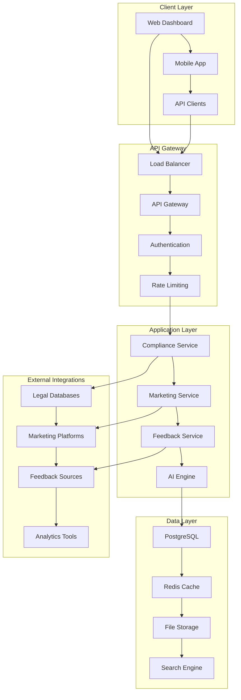
```mermaid
graph TB
    subgraph "Client Layer"
        A[Web Dashboard] --> B[Mobile App]
        B --> C[API Clients]
    end
    
    subgraph "API Gateway"
        D[Load Balancer] --> E[API Gateway]
        E --> F[Authentication]
        F --> G[Rate Limiting]
    end
    
    subgraph "Application Layer"
        H[Compliance Service] --> I[Marketing Service]
        I --> J[Feedback Service]
        J --> K[AI Engine]
    end
    
    subgraph "Data Layer"
        L[PostgreSQL] --> M[Redis Cache]
        M --> N[File Storage]
        N --> O[Search Engine]
    end
    
    subgraph "External Integrations"
        P[Legal Databases] --> Q[Marketing Platforms]
        Q --> R[Feedback Sources]
        R --> S[Analytics Tools]
    end
    
    A --> D
    C --> D
    G --> H
    K --> L
    H --> P
    I --> Q
    J --> R
```

### 2. Data Flow Architecture

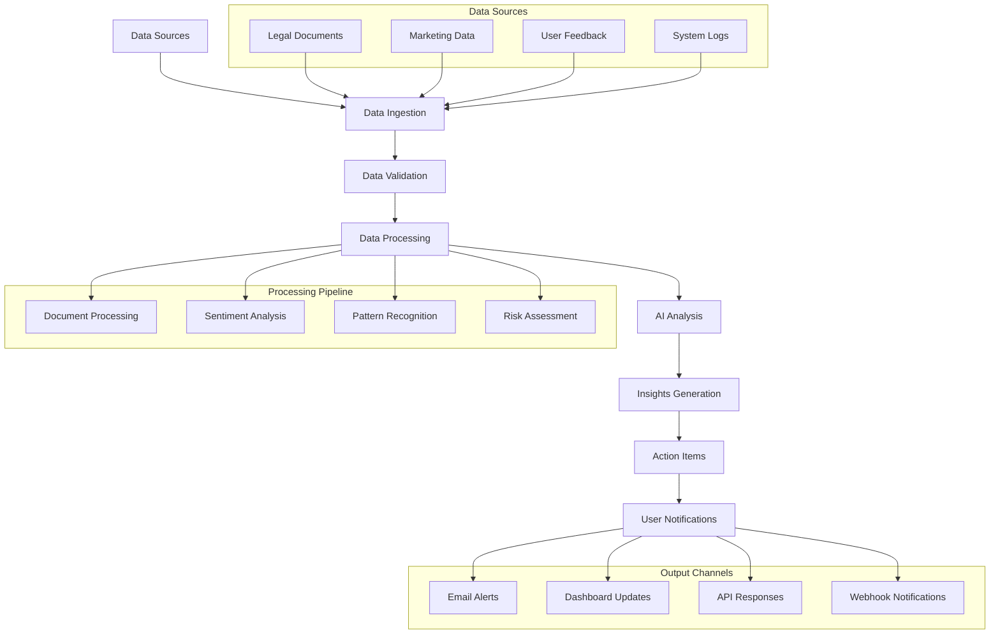
```mermaid
flowchart TD
    A[Data Sources] --> B[Data Ingestion]
    B --> C[Data Validation]
    C --> D[Data Processing]
    D --> E[AI Analysis]
    E --> F[Insights Generation]
    F --> G[Action Items]
    G --> H[User Notifications]
    
    subgraph "Data Sources"
        A1[Legal Documents]
        A2[Marketing Data]
        A3[User Feedback]
        A4[System Logs]
    end
    
    subgraph "Processing Pipeline"
        D1[Document Processing]
        D2[Sentiment Analysis]
        D3[Pattern Recognition]
        D4[Risk Assessment]
    end
    
    subgraph "Output Channels"
        H1[Email Alerts]
        H2[Dashboard Updates]
        H3[API Responses]
        H4[Webhook Notifications]
    end
    
    A1 --> B
    A2 --> B
    A3 --> B
    A4 --> B
    
    D --> D1
    D --> D2
    D --> D3
    D --> D4
    
    H --> H1
    H --> H2
    H --> H3
    H --> H4
```

---

## 📈 Business Process Flowcharts

### 1. Legal Compliance Monitoring Process

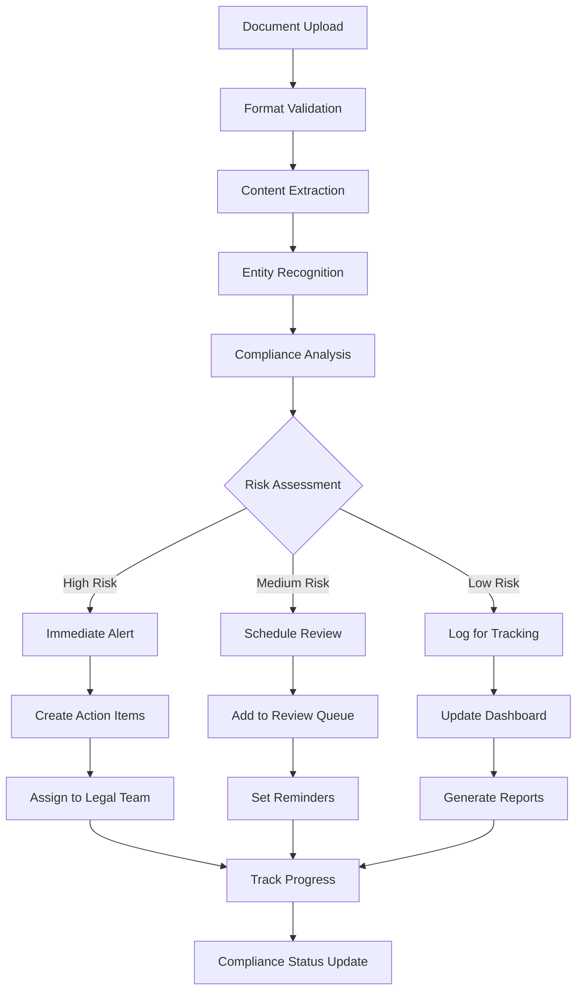
```mermaid
flowchart TD
    A[Document Upload] --> B[Format Validation]
    B --> C[Content Extraction]
    C --> D[Entity Recognition]
    D --> E[Compliance Analysis]
    E --> F{Risk Assessment}
    
    F -->|High Risk| G[Immediate Alert]
    F -->|Medium Risk| H[Schedule Review]
    F -->|Low Risk| I[Log for Tracking]
    
    G --> J[Create Action Items]
    H --> K[Add to Review Queue]
    I --> L[Update Dashboard]
    
    J --> M[Assign to Legal Team]
    K --> N[Set Reminders]
    L --> O[Generate Reports]
    
    M --> P[Track Progress]
    N --> P
    O --> P
    
    P --> Q[Compliance Status Update]
```

### 2. Marketing Campaign Optimization Process

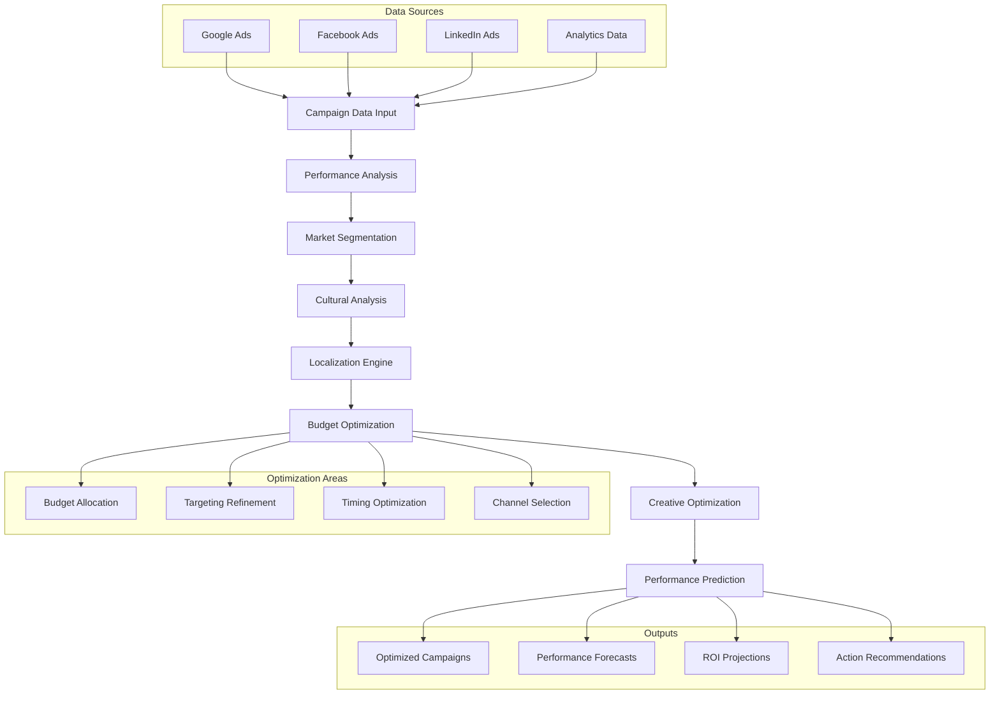
```mermaid
flowchart TD
    A[Campaign Data Input] --> B[Performance Analysis]
    B --> C[Market Segmentation]
    C --> D[Cultural Analysis]
    D --> E[Localization Engine]
    E --> F[Budget Optimization]
    F --> G[Creative Optimization]
    G --> H[Performance Prediction]
    
    subgraph "Data Sources"
        A1[Google Ads]
        A2[Facebook Ads]
        A3[LinkedIn Ads]
        A4[Analytics Data]
    end
    
    subgraph "Optimization Areas"
        F1[Budget Allocation]
        F2[Targeting Refinement]
        F3[Timing Optimization]
        F4[Channel Selection]
    end
    
    subgraph "Outputs"
        H1[Optimized Campaigns]
        H2[Performance Forecasts]
        H3[ROI Projections]
        H4[Action Recommendations]
    end
    
    A1 --> A
    A2 --> A
    A3 --> A
    A4 --> A
    
    F --> F1
    F --> F2
    F --> F3
    F --> F4
    
    H --> H1
    H --> H2
    H --> H3
    H --> H4
```

### 3. User Feedback Analysis Process

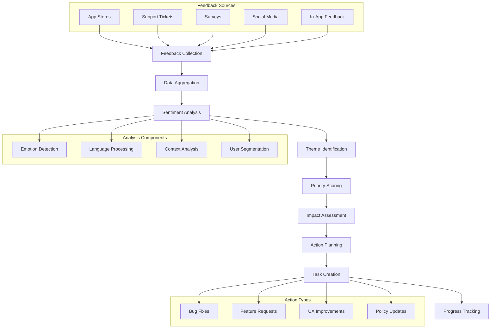
```mermaid
flowchart TD
    A[Feedback Collection] --> B[Data Aggregation]
    B --> C[Sentiment Analysis]
    C --> D[Theme Identification]
    D --> E[Priority Scoring]
    E --> F[Impact Assessment]
    F --> G[Action Planning]
    G --> H[Task Creation]
    H --> I[Progress Tracking]
    
    subgraph "Feedback Sources"
        A1[App Stores]
        A2[Support Tickets]
        A3[Surveys]
        A4[Social Media]
        A5[In-App Feedback]
    end
    
    subgraph "Analysis Components"
        C1[Emotion Detection]
        C2[Language Processing]
        C3[Context Analysis]
        C4[User Segmentation]
    end
    
    subgraph "Action Types"
        H1[Bug Fixes]
        H2[Feature Requests]
        H3[UX Improvements]
        H4[Policy Updates]
    end
    
    A1 --> A
    A2 --> A
    A3 --> A
    A4 --> A
    A5 --> A
    
    C --> C1
    C --> C2
    C --> C3
    C --> C4
    
    H --> H1
    H --> H2
    H --> H3
    H --> H4
```

---

## 📊 ROI and Performance Charts

### 1. ROI Timeline Chart

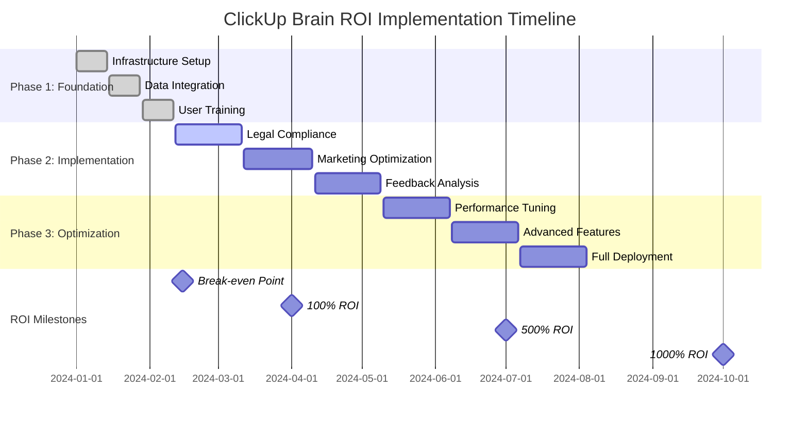
```mermaid
gantt
    title ClickUp Brain ROI Implementation Timeline
    dateFormat  YYYY-MM-DD
    section Phase 1: Foundation
    Infrastructure Setup    :done, infra, 2024-01-01, 2024-01-14
    Data Integration       :done, data, 2024-01-15, 2024-01-28
    User Training          :done, training, 2024-01-29, 2024-02-11
    
    section Phase 2: Implementation
    Legal Compliance       :active, legal, 2024-02-12, 2024-03-11
    Marketing Optimization :marketing, 2024-03-12, 2024-04-10
    Feedback Analysis      :feedback, 2024-04-11, 2024-05-09
    
    section Phase 3: Optimization
    Performance Tuning     :tuning, 2024-05-10, 2024-06-07
    Advanced Features      :advanced, 2024-06-08, 2024-07-06
    Full Deployment        :deploy, 2024-07-07, 2024-08-04
    
    section ROI Milestones
    Break-even Point       :milestone, break-even, 2024-02-15, 0d
    100% ROI               :milestone, roi-100, 2024-04-01, 0d
    500% ROI               :milestone, roi-500, 2024-07-01, 0d
    1000% ROI              :milestone, roi-1000, 2024-10-01, 0d
```

### 2. Cost-Benefit Analysis

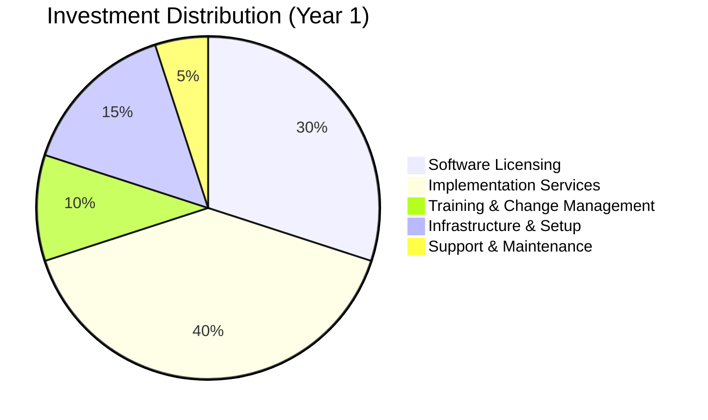
```mermaid
pie title Investment Distribution (Year 1)
    "Software Licensing" : 150000
    "Implementation Services" : 200000
    "Training & Change Management" : 50000
    "Infrastructure & Setup" : 75000
    "Support & Maintenance" : 25000
```

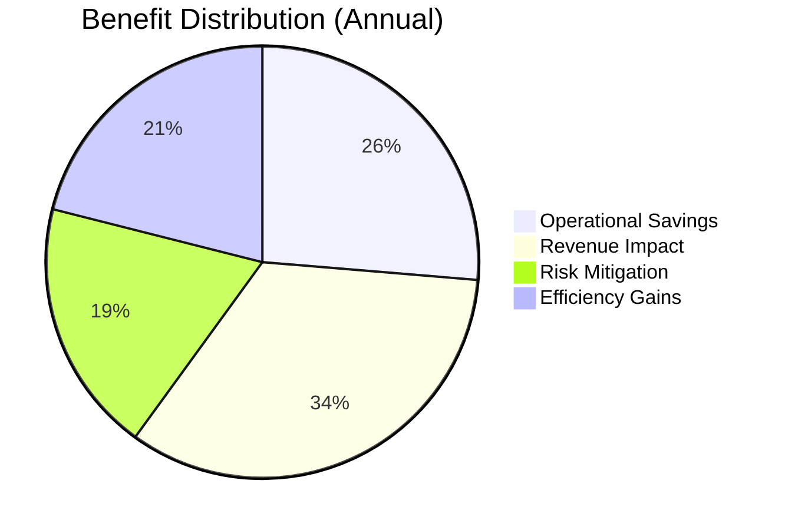
```mermaid
pie title Benefit Distribution (Annual)
    "Operational Savings" : 2500000
    "Revenue Impact" : 3200000
    "Risk Mitigation" : 1800000
    "Efficiency Gains" : 2000000
```

### 3. Performance Improvement Metrics

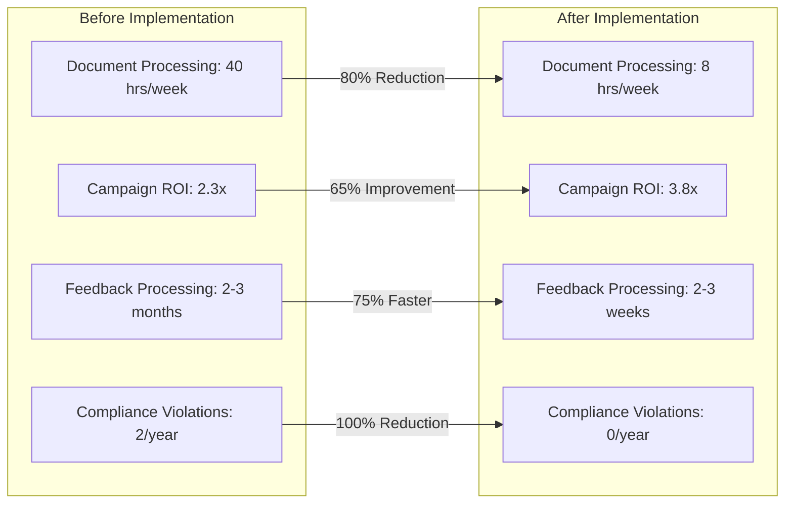
```mermaid
graph LR
    subgraph "Before Implementation"
        A1[Document Processing: 40 hrs/week]
        A2[Campaign ROI: 2.3x]
        A3[Feedback Processing: 2-3 months]
        A4[Compliance Violations: 2/year]
    end
    
    subgraph "After Implementation"
        B1[Document Processing: 8 hrs/week]
        B2[Campaign ROI: 3.8x]
        B3[Feedback Processing: 2-3 weeks]
        B4[Compliance Violations: 0/year]
    end
    
    A1 -->|80% Reduction| B1
    A2 -->|65% Improvement| B2
    A3 -->|75% Faster| B3
    A4 -->|100% Reduction| B4
```

---

## 🔄 User Journey Maps

### 1. Legal Team User Journey

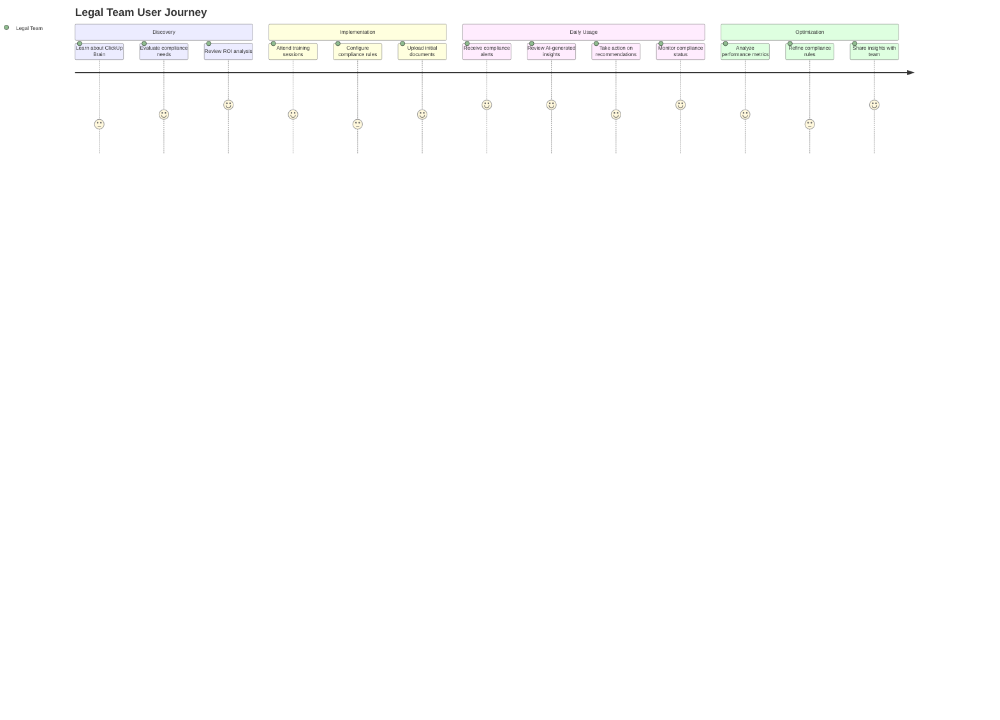
```mermaid
journey
    title Legal Team User Journey
    section Discovery
      Learn about ClickUp Brain: 3: Legal Team
      Evaluate compliance needs: 4: Legal Team
      Review ROI analysis: 5: Legal Team
    section Implementation
      Attend training sessions: 4: Legal Team
      Configure compliance rules: 3: Legal Team
      Upload initial documents: 4: Legal Team
    section Daily Usage
      Receive compliance alerts: 5: Legal Team
      Review AI-generated insights: 5: Legal Team
      Take action on recommendations: 4: Legal Team
      Monitor compliance status: 5: Legal Team
    section Optimization
      Analyze performance metrics: 4: Legal Team
      Refine compliance rules: 3: Legal Team
      Share insights with team: 5: Legal Team
```

### 2. Marketing Team User Journey

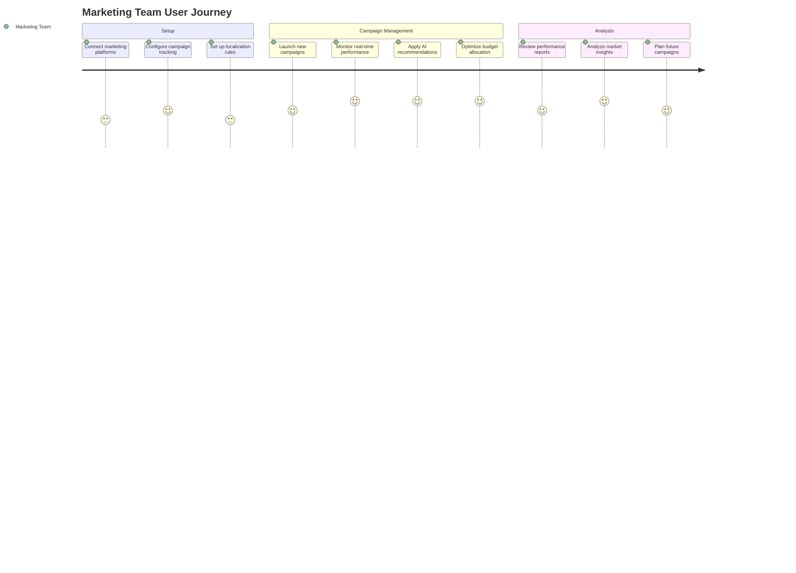
```mermaid
journey
    title Marketing Team User Journey
    section Setup
      Connect marketing platforms: 3: Marketing Team
      Configure campaign tracking: 4: Marketing Team
      Set up localization rules: 3: Marketing Team
    section Campaign Management
      Launch new campaigns: 4: Marketing Team
      Monitor real-time performance: 5: Marketing Team
      Apply AI recommendations: 5: Marketing Team
      Optimize budget allocation: 5: Marketing Team
    section Analysis
      Review performance reports: 4: Marketing Team
      Analyze market insights: 5: Marketing Team
      Plan future campaigns: 4: Marketing Team
```

### 3. Product Team User Journey

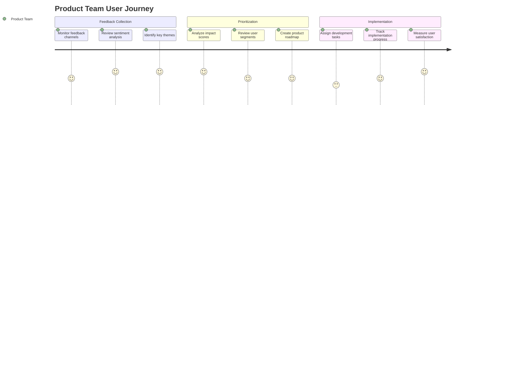
```mermaid
journey
    title Product Team User Journey
    section Feedback Collection
      Monitor feedback channels: 4: Product Team
      Review sentiment analysis: 5: Product Team
      Identify key themes: 5: Product Team
    section Prioritization
      Analyze impact scores: 5: Product Team
      Review user segments: 4: Product Team
      Create product roadmap: 4: Product Team
    section Implementation
      Assign development tasks: 3: Product Team
      Track implementation progress: 4: Product Team
      Measure user satisfaction: 5: Product Team
```

---

## 🏢 Organizational Impact Diagrams

### 1. Department Integration Map

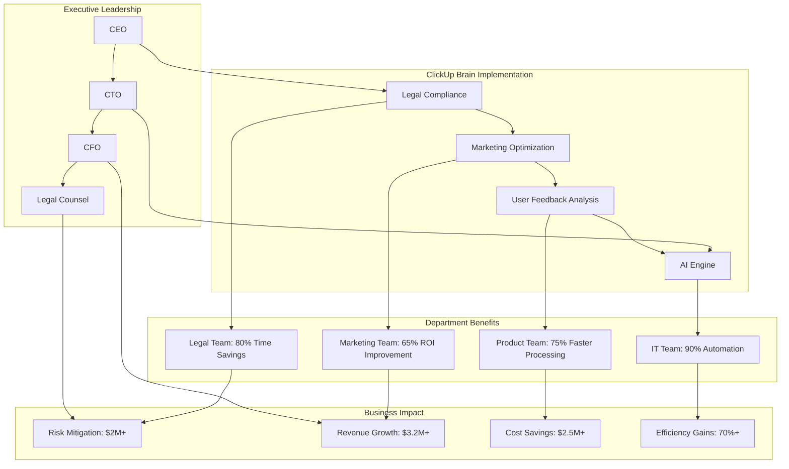
```mermaid
graph TD
    subgraph "Executive Leadership"
        A[CEO] --> B[CTO]
        B --> C[CFO]
        C --> D[Legal Counsel]
    end
    
    subgraph "ClickUp Brain Implementation"
        E[Legal Compliance] --> F[Marketing Optimization]
        F --> G[User Feedback Analysis]
        G --> H[AI Engine]
    end
    
    subgraph "Department Benefits"
        I[Legal Team: 80% Time Savings]
        J[Marketing Team: 65% ROI Improvement]
        K[Product Team: 75% Faster Processing]
        L[IT Team: 90% Automation]
    end
    
    subgraph "Business Impact"
        M[Risk Mitigation: $2M+]
        N[Revenue Growth: $3.2M+]
        O[Cost Savings: $2.5M+]
        P[Efficiency Gains: 70%+]
    end
    
    A --> E
    B --> H
    C --> N
    D --> M
    
    E --> I
    F --> J
    G --> K
    H --> L
    
    I --> M
    J --> N
    K --> O
    L --> P
```

### 2. Technology Stack Integration

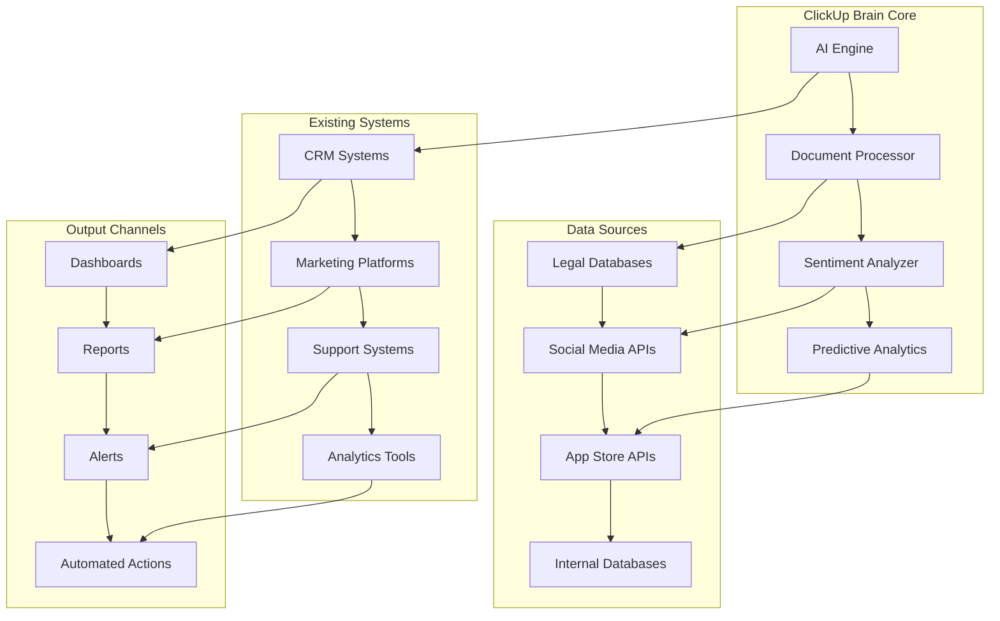
```mermaid
graph TB
    subgraph "ClickUp Brain Core"
        A[AI Engine] --> B[Document Processor]
        B --> C[Sentiment Analyzer]
        C --> D[Predictive Analytics]
    end
    
    subgraph "Existing Systems"
        E[CRM Systems] --> F[Marketing Platforms]
        F --> G[Support Systems]
        G --> H[Analytics Tools]
    end
    
    subgraph "Data Sources"
        I[Legal Databases] --> J[Social Media APIs]
        J --> K[App Store APIs]
        K --> L[Internal Databases]
    end
    
    subgraph "Output Channels"
        M[Dashboards] --> N[Reports]
        N --> O[Alerts]
        O --> P[Automated Actions]
    end
    
    A --> E
    B --> I
    C --> J
    D --> K
    
    E --> M
    F --> N
    G --> O
    H --> P
```

---

## 📊 Success Metrics Visualization

### 1. KPI Dashboard Layout

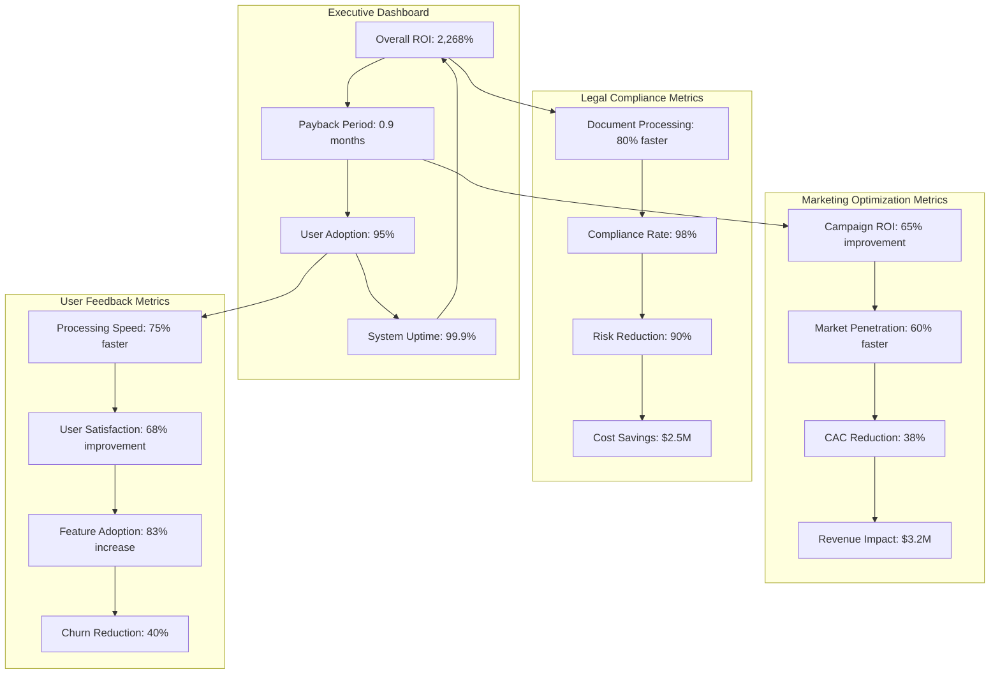
```mermaid
graph TB
    subgraph "Executive Dashboard"
        A[Overall ROI: 2,268%] --> B[Payback Period: 0.9 months]
        B --> C[User Adoption: 95%]
        C --> D[System Uptime: 99.9%]
    end
    
    subgraph "Legal Compliance Metrics"
        E[Document Processing: 80% faster] --> F[Compliance Rate: 98%]
        F --> G[Risk Reduction: 90%]
        G --> H[Cost Savings: $2.5M]
    end
    
    subgraph "Marketing Optimization Metrics"
        I[Campaign ROI: 65% improvement] --> J[Market Penetration: 60% faster]
        J --> K[CAC Reduction: 38%]
        K --> L[Revenue Impact: $3.2M]
    end
    
    subgraph "User Feedback Metrics"
        M[Processing Speed: 75% faster] --> N[User Satisfaction: 68% improvement]
        N --> O[Feature Adoption: 83% increase]
        O --> P[Churn Reduction: 40%]
    end
    
    A --> E
    B --> I
    C --> M
    D --> A
```

### 2. Implementation Timeline with Milestones

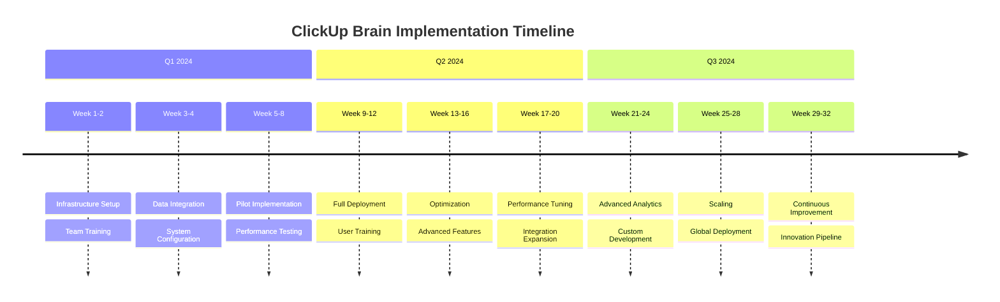
```mermaid
timeline
    title ClickUp Brain Implementation Timeline
    
    section Q1 2024
        Week 1-2 : Infrastructure Setup
                 : Team Training
        Week 3-4 : Data Integration
                 : System Configuration
        Week 5-8 : Pilot Implementation
                 : Performance Testing
    
    section Q2 2024
        Week 9-12 : Full Deployment
                  : User Training
        Week 13-16 : Optimization
                   : Advanced Features
        Week 17-20 : Performance Tuning
                   : Integration Expansion
    
    section Q3 2024
        Week 21-24 : Advanced Analytics
                   : Custom Development
        Week 25-28 : Scaling
                   : Global Deployment
        Week 29-32 : Continuous Improvement
                   : Innovation Pipeline
```

---

## 🔒 Security Architecture Diagrams

### 1. Security Layers

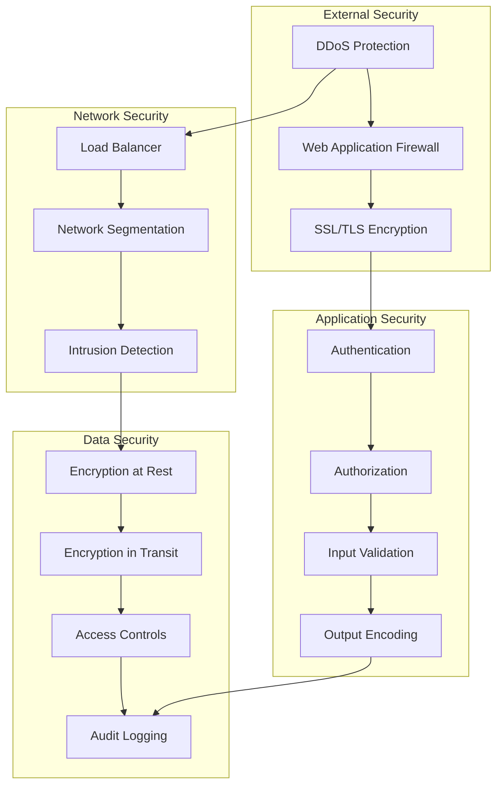
```mermaid
graph TB
    subgraph "External Security"
        A[DDoS Protection] --> B[Web Application Firewall]
        B --> C[SSL/TLS Encryption]
    end
    
    subgraph "Network Security"
        D[Load Balancer] --> E[Network Segmentation]
        E --> F[Intrusion Detection]
    end
    
    subgraph "Application Security"
        G[Authentication] --> H[Authorization]
        H --> I[Input Validation]
        I --> J[Output Encoding]
    end
    
    subgraph "Data Security"
        K[Encryption at Rest] --> L[Encryption in Transit]
        L --> M[Access Controls]
        M --> N[Audit Logging]
    end
    
    A --> D
    C --> G
    F --> K
    J --> N
```

### 2. Compliance Framework

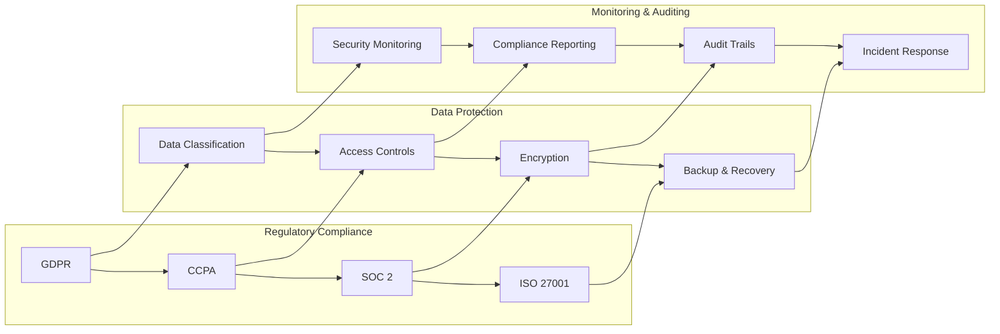
```mermaid
graph LR
    subgraph "Regulatory Compliance"
        A[GDPR] --> B[CCPA]
        B --> C[SOC 2]
        C --> D[ISO 27001]
    end
    
    subgraph "Data Protection"
        E[Data Classification] --> F[Access Controls]
        F --> G[Encryption]
        G --> H[Backup & Recovery]
    end
    
    subgraph "Monitoring & Auditing"
        I[Security Monitoring] --> J[Compliance Reporting]
        J --> K[Audit Trails]
        K --> L[Incident Response]
    end
    
    A --> E
    B --> F
    C --> G
    D --> H
    
    E --> I
    F --> J
    G --> K
    H --> L
```

---

## 🎯 Decision Tree Diagrams

### 1. Implementation Decision Tree

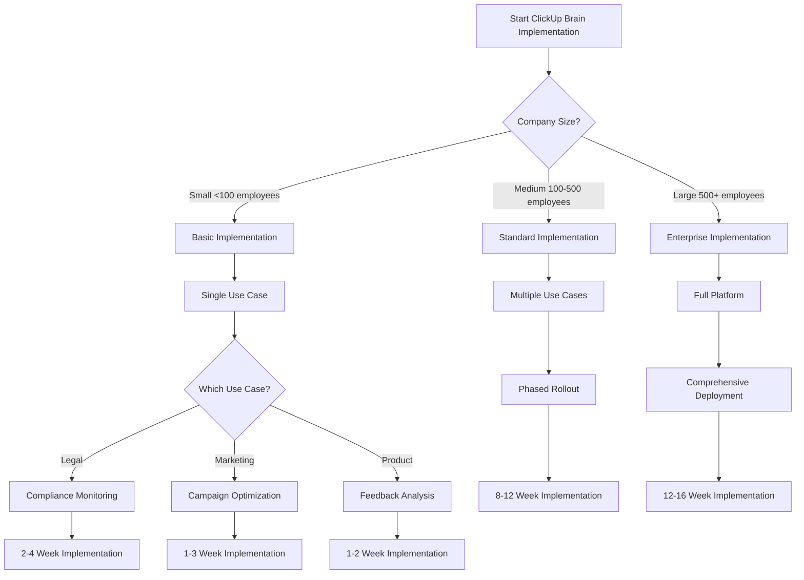
```mermaid
flowchart TD
    A[Start ClickUp Brain Implementation] --> B{Company Size?}
    
    B -->|Small <100 employees| C[Basic Implementation]
    B -->|Medium 100-500 employees| D[Standard Implementation]
    B -->|Large 500+ employees| E[Enterprise Implementation]
    
    C --> F[Single Use Case]
    D --> G[Multiple Use Cases]
    E --> H[Full Platform]
    
    F --> I{Which Use Case?}
    I -->|Legal| J[Compliance Monitoring]
    I -->|Marketing| K[Campaign Optimization]
    I -->|Product| L[Feedback Analysis]
    
    G --> M[Phased Rollout]
    H --> N[Comprehensive Deployment]
    
    J --> O[2-4 Week Implementation]
    K --> P[1-3 Week Implementation]
    L --> Q[1-2 Week Implementation]
    
    M --> R[8-12 Week Implementation]
    N --> S[12-16 Week Implementation]
```

### 2. ROI Calculation Decision Tree

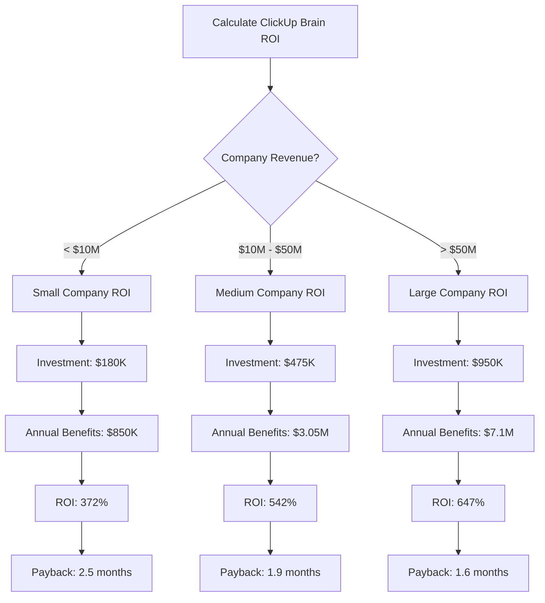
```mermaid
flowchart TD
    A[Calculate ClickUp Brain ROI] --> B{Company Revenue?}
    
    B -->|< $10M| C[Small Company ROI]
    B -->|$10M - $50M| D[Medium Company ROI]
    B -->|> $50M| E[Large Company ROI]
    
    C --> F[Investment: $180K]
    D --> G[Investment: $475K]
    E --> H[Investment: $950K]
    
    F --> I[Annual Benefits: $850K]
    G --> J[Annual Benefits: $3.05M]
    H --> K[Annual Benefits: $7.1M]
    
    I --> L[ROI: 372%]
    J --> M[ROI: 542%]
    K --> N[ROI: 647%]
    
    L --> O[Payback: 2.5 months]
    M --> P[Payback: 1.9 months]
    N --> Q[Payback: 1.6 months]
```

---

## 📈 Performance Comparison Charts

### 1. Before vs After Implementation

```mermaid
graph LR
    subgraph "Before ClickUp Brain"
        A1[Manual Document Review: 40 hrs/week]
        A2[Campaign Performance: 2.3x ROI]
        A3[Feedback Processing: 2-3 months]
        A4[Compliance Violations: 2/year]
        A5[User Satisfaction: 3.2/5]
    end
    
    subgraph "After ClickUp Brain"
        B1[Automated Processing: 8 hrs/week]
        B2[Optimized Campaigns: 3.8x ROI]
        B3[AI-Powered Analysis: 2-3 weeks]
        B4[Zero Violations: 0/year]
        B5[Improved Satisfaction: 4.3/5]
    end
    
    A1 -.->|80% Reduction| B1
    A2 -.->|65% Improvement| B2
    A3 -.->|75% Faster| B3
    A4 -.->|100% Reduction| B4
    A5 -.->|34% Improvement| B5
```

### 2. Industry Comparison

```mermaid
graph TB
    subgraph "Industry Benchmarks"
        A[Financial Services: 608% ROI]
        B[Healthcare: 583% ROI]
        C[Technology/SaaS: 675% ROI]
        D[Manufacturing: 553% ROI]
        E[E-commerce: 1,150% ROI]
    end
    
    subgraph "ClickUp Brain Results"
        F[Average ROI: 1,000%+]
        G[Payback Period: 1-2 months]
        H[User Adoption: 95%+]
        I[System Uptime: 99.9%]
    end
    
    A --> F
    B --> G
    C --> H
    D --> I
    E --> F
```

---

## 🎨 Visual Summary

### Key Visual Elements Created:

1. **System Architecture Diagrams** - Technical infrastructure and data flow
2. **Business Process Flowcharts** - Step-by-step operational processes
3. **ROI and Performance Charts** - Financial impact and timeline visualization
4. **User Journey Maps** - User experience and interaction flows
5. **Organizational Impact Diagrams** - Department integration and benefits
6. **Security Architecture** - Security layers and compliance framework
7. **Decision Tree Diagrams** - Implementation and ROI calculation paths
8. **Performance Comparison Charts** - Before/after and industry comparisons

### Benefits of Visual Documentation:

- **Enhanced Understanding** - Complex concepts made simple through visuals
- **Faster Decision Making** - Quick visual reference for key metrics
- **Better Communication** - Visual aids for presentations and discussions
- **Improved Training** - Visual learning materials for user education
- **Professional Presentation** - Enterprise-grade visual documentation

---

*These visual diagrams provide comprehensive graphical representations of ClickUp Brain's architecture, processes, and business impact. They complement the written documentation and enhance understanding through visual learning.*

