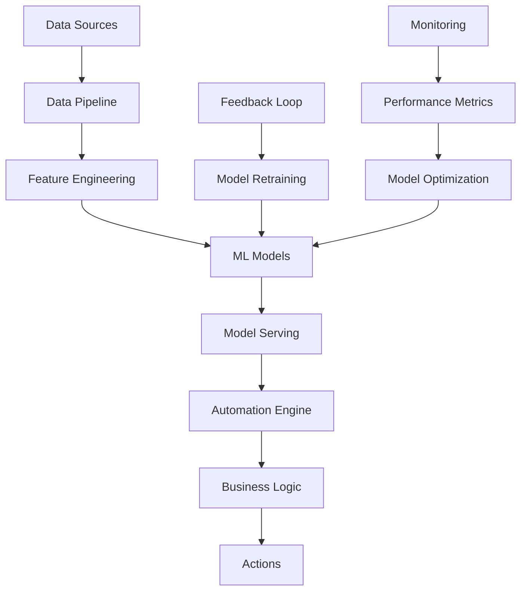

# 🤖 **GUÍA DE AUTOMATIZACIÓN CON IA - PROGRAMA DE AFILIADOS**

## 🎯 **RESUMEN EJECUTIVO**

### **Objetivo de la Automatización con IA**
Implementar un sistema de automatización inteligente que utilice IA para optimizar procesos, personalizar experiencias y maximizar el rendimiento del programa de afiliados de manera autónoma.

### **Características Principales**
- **Automatización Inteligente** de procesos críticos
- **Personalización Automática** basada en comportamiento
- **Predicciones y Recomendaciones** en tiempo real
- **Optimización Continua** sin intervención manual
- **Escalabilidad Automática** según demanda

---

## 🧠 **ARQUITECTURA DE IA**

### **Stack de IA**

**Machine Learning:**
```javascript
const AIStack = {
  mlFramework: 'TensorFlow.js + PyTorch',
  nlp: 'OpenAI GPT-4 + Hugging Face',
  computerVision: 'OpenCV + TensorFlow',
  recommendation: 'Apache Spark MLlib',
  timeSeries: 'Prophet + LSTM',
  clustering: 'Scikit-learn + K-means',
  classification: 'XGBoost + Random Forest'
};
```

**Infraestructura de IA:**
```javascript
const AIInfrastructure = {
  compute: 'AWS SageMaker + Google Cloud AI',
  storage: 'S3 + BigQuery',
  processing: 'Apache Kafka + Apache Spark',
  serving: 'TensorFlow Serving + MLflow',
  monitoring: 'Weights & Biases + MLflow',
  deployment: 'Kubernetes + Docker'
};
```

**APIs y Servicios:**
```javascript
const AIServices = {
  openai: 'GPT-4 para generación de contenido',
  anthropic: 'Claude para análisis de texto',
  google: 'Vertex AI para ML personalizado',
  aws: 'Bedrock para modelos de IA',
  huggingface: 'Modelos pre-entrenados',
  custom: 'Modelos propios entrenados'
};
```

### **Arquitectura de IA**



---

## 🎯 **AUTOMATIZACIÓN DE PROCESOS**

### **Sistema de Automatización Inteligente**

```javascript
// Motor de automatización con IA
class IntelligentAutomationEngine {
  constructor() {
    this.workflows = new Map();
    this.triggers = new Map();
    this.actions = new Map();
    this.aiModels = new Map();
    this.setupDefaultWorkflows();
  }

  async setupDefaultWorkflows() {
    // Workflow de onboarding automático
    await this.createWorkflow('affiliate_onboarding', {
      triggers: ['new_affiliate_registration'],
      steps: [
        'analyze_affiliate_profile',
        'generate_personalized_welcome',
        'assign_optimal_tier',
        'create_custom_onboarding_path',
        'schedule_follow_up_sequence'
      ],
      aiModels: ['profile_analyzer', 'content_generator', 'tier_classifier']
    });

    // Workflow de optimización de conversión
    await this.createWorkflow('conversion_optimization', {
      triggers: ['low_conversion_rate', 'high_bounce_rate'],
      steps: [
        'analyze_conversion_funnel',
        'identify_bottlenecks',
        'generate_optimization_recommendations',
        'implement_ab_tests',
        'monitor_results'
      ],
      aiModels: ['funnel_analyzer', 'recommendation_engine', 'ab_test_optimizer']
    });

    // Workflow de retención de afiliados
    await this.createWorkflow('affiliate_retention', {
      triggers: ['affiliate_inactivity', 'low_engagement'],
      steps: [
        'predict_churn_probability',
        'identify_retention_opportunities',
        'generate_retention_campaign',
        'execute_personalized_outreach',
        'track_retention_metrics'
      ],
      aiModels: ['churn_predictor', 'retention_optimizer', 'content_personalizer']
    });
  }

  async executeWorkflow(workflowId, context) {
    const workflow = this.workflows.get(workflowId);
    if (!workflow) throw new Error(`Workflow ${workflowId} not found`);

    const execution = {
      id: generateId(),
      workflowId,
      context,
      status: 'running',
      steps: [],
      startTime: new Date()
    };

    try {
      for (const step of workflow.steps) {
        const stepResult = await this.executeStep(step, context, workflow.aiModels);
        execution.steps.push({
          step,
          result: stepResult,
          timestamp: new Date()
        });
      }

      execution.status = 'completed';
      execution.endTime = new Date();
      
      await this.logExecution(execution);
      return execution;
    } catch (error) {
      execution.status = 'failed';
      execution.error = error.message;
      execution.endTime = new Date();
      
      await this.logExecution(execution);
      throw error;
    }
  }
}
```

### **Automatización de Onboarding**

```javascript
// Sistema de onboarding automático con IA
class AIOnboardingAutomation {
  async automateOnboarding(affiliateData) {
    // 1. Análisis de perfil con IA
    const profileAnalysis = await this.analyzeProfile(affiliateData);
    
    // 2. Generación de contenido personalizado
    const personalizedContent = await this.generatePersonalizedContent(profileAnalysis);
    
    // 3. Asignación automática de tier
    const tierAssignment = await this.assignOptimalTier(profileAnalysis);
    
    // 4. Creación de secuencia personalizada
    const onboardingSequence = await this.createOnboardingSequence(profileAnalysis);
    
    // 5. Programación de seguimiento
    const followUpSchedule = await this.scheduleFollowUp(profileAnalysis);

    return {
      profileAnalysis,
      personalizedContent,
      tierAssignment,
      onboardingSequence,
      followUpSchedule
    };
  }

  async analyzeProfile(affiliateData) {
    const analysis = await this.aiModels.profileAnalyzer.analyze({
      experience: affiliateData.experience,
      audience: affiliateData.audience,
      content: affiliateData.content,
      engagement: affiliateData.engagement,
      goals: affiliateData.goals
    });

    return {
      strengths: analysis.strengths,
      weaknesses: analysis.weaknesses,
      opportunities: analysis.opportunities,
      threats: analysis.threats,
      recommendedStrategy: analysis.recommendedStrategy,
      confidence: analysis.confidence
    };
  }

  async generatePersonalizedContent(profileAnalysis) {
    const content = await this.aiModels.contentGenerator.generate({
      type: 'onboarding_sequence',
      profile: profileAnalysis,
      tone: profileAnalysis.recommendedTone,
      language: profileAnalysis.preferredLanguage,
      length: profileAnalysis.preferredContentLength
    });

    return {
      welcomeEmail: content.welcomeEmail,
      trainingMaterials: content.trainingMaterials,
      successStories: content.successStories,
      actionPlan: content.actionPlan
    };
  }
}
```

### **Automatización de Marketing**

```javascript
// Sistema de marketing automático con IA
class AIMarketingAutomation {
  async automateMarketingCampaign(campaignData) {
    // 1. Análisis de audiencia
    const audienceAnalysis = await this.analyzeAudience(campaignData.audience);
    
    // 2. Generación de contenido
    const content = await this.generateContent(audienceAnalysis);
    
    // 3. Optimización de timing
    const optimalTiming = await this.optimizeTiming(audienceAnalysis);
    
    // 4. Personalización de mensajes
    const personalizedMessages = await this.personalizeMessages(content, audienceAnalysis);
    
    // 5. Ejecución automática
    const campaignResults = await this.executeCampaign(personalizedMessages, optimalTiming);

    return campaignResults;
  }

  async generateContent(audienceAnalysis) {
    const content = await this.aiModels.contentGenerator.generate({
      type: 'marketing_campaign',
      audience: audienceAnalysis,
      objectives: audienceAnalysis.objectives,
      tone: audienceAnalysis.preferredTone,
      format: audienceAnalysis.preferredFormat
    });

    return {
      headlines: content.headlines,
      descriptions: content.descriptions,
      callToActions: content.callToActions,
      images: content.images,
      videos: content.videos
    };
  }

  async optimizeTiming(audienceAnalysis) {
    const timing = await this.aiModels.timingOptimizer.optimize({
      audience: audienceAnalysis,
      historicalData: audienceAnalysis.historicalEngagement,
      timezone: audienceAnalysis.timezone,
      preferences: audienceAnalysis.timingPreferences
    });

    return {
      optimalDays: timing.optimalDays,
      optimalHours: timing.optimalHours,
      frequency: timing.frequency,
      timezone: timing.timezone
    };
  }
}
```

---

## 🎨 **PERSONALIZACIÓN AUTOMÁTICA**

### **Sistema de Personalización con IA**

```javascript
// Sistema de personalización automática
class AIPersonalizationEngine {
  async personalizeExperience(userId, context) {
    // 1. Análisis de comportamiento
    const behaviorAnalysis = await this.analyzeBehavior(userId);
    
    // 2. Generación de perfil de usuario
    const userProfile = await this.generateUserProfile(behaviorAnalysis);
    
    // 3. Personalización de contenido
    const personalizedContent = await this.personalizeContent(userProfile, context);
    
    // 4. Personalización de interfaz
    const personalizedUI = await this.personalizeUI(userProfile, context);
    
    // 5. Personalización de recomendaciones
    const recommendations = await this.generateRecommendations(userProfile, context);

    return {
      userProfile,
      personalizedContent,
      personalizedUI,
      recommendations
    };
  }

  async analyzeBehavior(userId) {
    const behaviorData = await this.getBehaviorData(userId);
    
    const analysis = await this.aiModels.behaviorAnalyzer.analyze({
      clicks: behaviorData.clicks,
      views: behaviorData.views,
      conversions: behaviorData.conversions,
      timeSpent: behaviorData.timeSpent,
      preferences: behaviorData.preferences
    });

    return {
      interests: analysis.interests,
      preferences: analysis.preferences,
      patterns: analysis.patterns,
      predictions: analysis.predictions
    };
  }

  async personalizeContent(userProfile, context) {
    const content = await this.aiModels.contentPersonalizer.personalize({
      userProfile,
      context,
      availableContent: context.availableContent,
      objectives: context.objectives
    });

    return {
      headlines: content.headlines,
      descriptions: content.descriptions,
      images: content.images,
      videos: content.videos,
      layout: content.layout
    };
  }
}
```

### **Personalización de Emails**

```javascript
// Sistema de personalización de emails con IA
class AIEmailPersonalization {
  async personalizeEmail(recipientId, emailTemplate, context) {
    // 1. Análisis del destinatario
    const recipientAnalysis = await this.analyzeRecipient(recipientId);
    
    // 2. Personalización del contenido
    const personalizedContent = await this.personalizeContent(emailTemplate, recipientAnalysis);
    
    // 3. Optimización del subject line
    const optimizedSubject = await this.optimizeSubjectLine(personalizedContent, recipientAnalysis);
    
    // 4. Personalización del timing
    const optimalTiming = await this.optimizeTiming(recipientAnalysis);
    
    // 5. Generación de CTA personalizado
    const personalizedCTA = await this.personalizeCTA(personalizedContent, recipientAnalysis);

    return {
      subject: optimizedSubject,
      content: personalizedContent,
      cta: personalizedCTA,
      timing: optimalTiming,
      personalization: recipientAnalysis
    };
  }

  async personalizeContent(template, recipientAnalysis) {
    const content = await this.aiModels.emailPersonalizer.personalize({
      template,
      recipient: recipientAnalysis,
      preferences: recipientAnalysis.preferences,
      behavior: recipientAnalysis.behavior,
      context: recipientAnalysis.context
    });

    return {
      greeting: content.greeting,
      body: content.body,
      closing: content.closing,
      tone: content.tone,
      length: content.length
    };
  }

  async optimizeSubjectLine(content, recipientAnalysis) {
    const subjectLines = await this.aiModels.subjectOptimizer.generate({
      content,
      recipient: recipientAnalysis,
      objectives: ['open', 'click', 'convert'],
      constraints: ['length', 'tone', 'brand']
    });

    return {
      primary: subjectLines.primary,
      alternatives: subjectLines.alternatives,
      confidence: subjectLines.confidence
    };
  }
}
```

### **Personalización de Dashboard**

```javascript
// Sistema de personalización de dashboard con IA
class AIDashboardPersonalization {
  async personalizeDashboard(userId, dashboardData) {
    // 1. Análisis de uso del dashboard
    const usageAnalysis = await this.analyzeDashboardUsage(userId);
    
    // 2. Generación de layout personalizado
    const personalizedLayout = await this.generatePersonalizedLayout(usageAnalysis);
    
    // 3. Personalización de métricas
    const personalizedMetrics = await this.personalizeMetrics(usageAnalysis, dashboardData);
    
    // 4. Personalización de visualizaciones
    const personalizedVisualizations = await this.personalizeVisualizations(usageAnalysis);
    
    // 5. Generación de insights personalizados
    const personalizedInsights = await this.generatePersonalizedInsights(usageAnalysis);

    return {
      layout: personalizedLayout,
      metrics: personalizedMetrics,
      visualizations: personalizedVisualizations,
      insights: personalizedInsights
    };
  }

  async generatePersonalizedLayout(usageAnalysis) {
    const layout = await this.aiModels.layoutOptimizer.optimize({
      usage: usageAnalysis,
      preferences: usageAnalysis.preferences,
      objectives: usageAnalysis.objectives,
      constraints: usageAnalysis.constraints
    });

    return {
      widgets: layout.widgets,
      positions: layout.positions,
      sizes: layout.sizes,
      priorities: layout.priorities
    };
  }

  async personalizeMetrics(usageAnalysis, dashboardData) {
    const metrics = await this.aiModels.metricsPersonalizer.personalize({
      usage: usageAnalysis,
      availableMetrics: dashboardData.availableMetrics,
      objectives: usageAnalysis.objectives,
      preferences: usageAnalysis.preferences
    });

    return {
      primary: metrics.primary,
      secondary: metrics.secondary,
      hidden: metrics.hidden,
      custom: metrics.custom
    };
  }
}
```

---

## 🔮 **PREDICCIONES Y RECOMENDACIONES**

### **Sistema de Predicciones con IA**

```javascript
// Sistema de predicciones con IA
class AIPredictionEngine {
  async predictRevenue(timeframe, context) {
    const historicalData = await this.getHistoricalRevenueData();
    const externalFactors = await this.getExternalFactors();
    
    const prediction = await this.aiModels.revenuePredictor.predict({
      historical: historicalData,
      external: externalFactors,
      timeframe,
      context
    });

    return {
      prediction: prediction.value,
      confidence: prediction.confidence,
      factors: prediction.factors,
      scenarios: prediction.scenarios,
      recommendations: prediction.recommendations
    };
  }

  async predictChurn(affiliateId, timeframe) {
    const affiliateData = await this.getAffiliateData(affiliateId);
    const behaviorData = await this.getBehaviorData(affiliateId);
    
    const prediction = await this.aiModels.churnPredictor.predict({
      affiliate: affiliateData,
      behavior: behaviorData,
      timeframe
    });

    return {
      probability: prediction.probability,
      riskFactors: prediction.riskFactors,
      timeline: prediction.timeline,
      recommendations: prediction.recommendations
    };
  }

  async predictOptimalPricing(productId, marketContext) {
    const productData = await this.getProductData(productId);
    const marketData = await this.getMarketData(marketContext);
    
    const prediction = await this.aiModels.pricingOptimizer.optimize({
      product: productData,
      market: marketData,
      objectives: ['revenue', 'conversion', 'profit']
    });

    return {
      optimalPrice: prediction.optimalPrice,
      priceRange: prediction.priceRange,
      elasticity: prediction.elasticity,
      impact: prediction.impact
    };
  }
}
```

### **Sistema de Recomendaciones Inteligentes**

```javascript
// Sistema de recomendaciones con IA
class AIRecommendationEngine {
  async generateRecommendations(context) {
    const recommendations = [];
    
    // Recomendaciones de contenido
    const contentRecs = await this.generateContentRecommendations(context);
    recommendations.push(...contentRecs);
    
    // Recomendaciones de estrategia
    const strategyRecs = await this.generateStrategyRecommendations(context);
    recommendations.push(...strategyRecs);
    
    // Recomendaciones de optimización
    const optimizationRecs = await this.generateOptimizationRecommendations(context);
    recommendations.push(...optimizationRecs);
    
    // Recomendaciones de crecimiento
    const growthRecs = await this.generateGrowthRecommendations(context);
    recommendations.push(...growthRecs);

    return recommendations.sort((a, b) => b.priority - a.priority);
  }

  async generateContentRecommendations(context) {
    const recommendations = await this.aiModels.contentRecommender.recommend({
      context,
      objectives: context.objectives,
      constraints: context.constraints,
      preferences: context.preferences
    });

    return recommendations.map(rec => ({
      type: 'content',
      title: rec.title,
      description: rec.description,
      priority: rec.priority,
      expectedImpact: rec.expectedImpact,
      actions: rec.actions
    }));
  }

  async generateStrategyRecommendations(context) {
    const recommendations = await this.aiModels.strategyRecommender.recommend({
      context,
      market: context.market,
      competition: context.competition,
      resources: context.resources
    });

    return recommendations.map(rec => ({
      type: 'strategy',
      title: rec.title,
      description: rec.description,
      priority: rec.priority,
      expectedImpact: rec.expectedImpact,
      timeline: rec.timeline,
      actions: rec.actions
    }));
  }
}
```

### **Sistema de Alertas Inteligentes**

```javascript
// Sistema de alertas inteligentes con IA
class AIAlertSystem {
  async generateIntelligentAlerts(metrics) {
    const alerts = [];
    
    // Análisis de anomalías
    const anomalies = await this.detectAnomalies(metrics);
    alerts.push(...anomalies);
    
    // Análisis de tendencias
    const trends = await this.analyzeTrends(metrics);
    alerts.push(...trends);
    
    // Análisis de oportunidades
    const opportunities = await this.identifyOpportunities(metrics);
    alerts.push(...opportunities);
    
    // Análisis de riesgos
    const risks = await this.identifyRisks(metrics);
    alerts.push(...risks);

    return alerts.sort((a, b) => b.severity - a.severity);
  }

  async detectAnomalies(metrics) {
    const anomalies = await this.aiModels.anomalyDetector.detect({
      metrics,
      threshold: 0.8,
      window: 24 // hours
    });

    return anomalies.map(anomaly => ({
      type: 'anomaly',
      severity: anomaly.severity,
      metric: anomaly.metric,
      value: anomaly.value,
      expected: anomaly.expected,
      description: anomaly.description,
      recommendations: anomaly.recommendations
    }));
  }

  async identifyOpportunities(metrics) {
    const opportunities = await this.aiModels.opportunityDetector.identify({
      metrics,
      objectives: ['revenue', 'conversion', 'growth'],
      constraints: ['resources', 'time', 'budget']
    });

    return opportunities.map(opp => ({
      type: 'opportunity',
      severity: opp.priority,
      title: opp.title,
      description: opp.description,
      potential: opp.potential,
      effort: opp.effort,
      timeline: opp.timeline,
      actions: opp.actions
    }));
  }
}
```

---

## 🚀 **AUTOMATIZACIÓN DE ESCALAMIENTO**

### **Sistema de Escalamiento Automático**

```javascript
// Sistema de escalamiento automático con IA
class AIScalingEngine {
  async autoScale(resourceType, demand) {
    const scalingDecision = await this.aiModels.scalingOptimizer.decide({
      resourceType,
      currentDemand: demand,
      historicalPatterns: await this.getHistoricalPatterns(resourceType),
      constraints: await this.getScalingConstraints(resourceType)
    });

    if (scalingDecision.shouldScale) {
      await this.executeScaling(scalingDecision);
    }

    return scalingDecision;
  }

  async executeScaling(scalingDecision) {
    switch (scalingDecision.resourceType) {
      case 'servers':
        await this.scaleServers(scalingDecision);
        break;
      case 'database':
        await this.scaleDatabase(scalingDecision);
        break;
      case 'storage':
        await this.scaleStorage(scalingDecision);
        break;
      case 'bandwidth':
        await this.scaleBandwidth(scalingDecision);
        break;
    }
  }

  async scaleServers(scalingDecision) {
    const instances = scalingDecision.targetInstances;
    const instanceType = scalingDecision.instanceType;
    
    await this.awsService.updateAutoScalingGroup({
      minSize: instances.min,
      maxSize: instances.max,
      desiredCapacity: instances.desired,
      instanceType: instanceType
    });
  }
}
```

### **Automatización de Recursos**

```javascript
// Sistema de automatización de recursos con IA
class AIResourceAutomation {
  async optimizeResourceAllocation() {
    const currentUsage = await this.getCurrentResourceUsage();
    const predictions = await this.predictResourceDemand();
    
    const optimization = await this.aiModels.resourceOptimizer.optimize({
      current: currentUsage,
      predicted: predictions,
      objectives: ['cost', 'performance', 'availability'],
      constraints: ['budget', 'sla', 'compliance']
    });

    await this.executeResourceOptimization(optimization);
    return optimization;
  }

  async predictResourceDemand() {
    const historicalData = await this.getHistoricalResourceData();
    const externalFactors = await this.getExternalFactors();
    
    const predictions = await this.aiModels.demandPredictor.predict({
      historical: historicalData,
      external: externalFactors,
      timeframe: 30 // days
    });

    return {
      cpu: predictions.cpu,
      memory: predictions.memory,
      storage: predictions.storage,
      bandwidth: predictions.bandwidth,
      confidence: predictions.confidence
    };
  }
}
```

---

## 📊 **MONITOREO Y OPTIMIZACIÓN**

### **Sistema de Monitoreo con IA**

```javascript
// Sistema de monitoreo inteligente
class AIMonitoringSystem {
  async monitorSystemHealth() {
    const metrics = await this.collectSystemMetrics();
    const health = await this.aiModels.healthAnalyzer.analyze(metrics);
    
    if (health.status !== 'healthy') {
      await this.triggerHealthAlert(health);
    }

    return health;
  }

  async collectSystemMetrics() {
    return {
      performance: await this.getPerformanceMetrics(),
      availability: await this.getAvailabilityMetrics(),
      errors: await this.getErrorMetrics(),
      usage: await this.getUsageMetrics(),
      security: await this.getSecurityMetrics()
    };
  }

  async triggerHealthAlert(health) {
    const alert = {
      type: 'health',
      severity: health.severity,
      component: health.component,
      issue: health.issue,
      recommendations: health.recommendations,
      timestamp: new Date()
    };

    await this.sendAlert(alert);
    await this.logAlert(alert);
  }
}
```

### **Optimización Continua**

```javascript
// Sistema de optimización continua con IA
class AIContinuousOptimization {
  async optimizeContinuously() {
    const currentPerformance = await this.getCurrentPerformance();
    const optimizationOpportunities = await this.identifyOptimizationOpportunities();
    
    for (const opportunity of optimizationOpportunities) {
      const optimization = await this.executeOptimization(opportunity);
      await this.monitorOptimizationResults(optimization);
    }
  }

  async identifyOptimizationOpportunities() {
    const opportunities = await this.aiModels.optimizationDetector.identify({
      performance: await this.getCurrentPerformance(),
      objectives: ['speed', 'cost', 'quality', 'user_satisfaction'],
      constraints: ['budget', 'time', 'resources']
    });

    return opportunities.sort((a, b) => b.potential - a.potential);
  }

  async executeOptimization(opportunity) {
    const optimization = await this.aiModels.optimizationEngine.optimize({
      opportunity,
      constraints: opportunity.constraints,
      objectives: opportunity.objectives
    });

    await this.implementOptimization(optimization);
    return optimization;
  }
}
```

---

## 🎯 **IMPLEMENTACIÓN PRÁCTICA**

### **Fase 1: Automatización Básica (Meses 1-3)**

**Objetivos:**
- Implementar automatización de procesos básicos
- Configurar sistema de monitoreo
- Establecer métricas de baseline

**Implementaciones:**
```javascript
// Automatización básica de onboarding
const basicOnboardingAutomation = {
  triggers: ['new_affiliate_registration'],
  actions: [
    'send_welcome_email',
    'assign_affiliate_id',
    'create_dashboard_account',
    'schedule_onboarding_call'
  ],
  aiModels: ['email_generator', 'tier_classifier']
};
```

### **Fase 2: Personalización (Meses 4-6)**

**Objetivos:**
- Implementar personalización automática
- Desarrollar sistema de recomendaciones
- Optimizar experiencia de usuario

**Implementaciones:**
```javascript
// Personalización automática de contenido
const contentPersonalization = {
  triggers: ['user_behavior_change', 'content_interaction'],
  actions: [
    'analyze_user_behavior',
    'generate_personalized_content',
    'optimize_content_delivery',
    'track_personalization_impact'
  ],
  aiModels: ['behavior_analyzer', 'content_personalizer', 'recommendation_engine']
};
```

### **Fase 3: Predicciones (Meses 7-9)**

**Objetivos:**
- Implementar sistema de predicciones
- Desarrollar alertas inteligentes
- Optimizar toma de decisiones

**Implementaciones:**
```javascript
// Sistema de predicciones avanzado
const advancedPredictions = {
  triggers: ['data_update', 'scheduled_prediction'],
  actions: [
    'predict_revenue_trends',
    'predict_churn_risk',
    'predict_optimal_pricing',
    'generate_strategic_recommendations'
  ],
  aiModels: ['revenue_predictor', 'churn_predictor', 'pricing_optimizer', 'strategy_recommender']
};
```

### **Fase 4: Optimización Avanzada (Meses 10-12)**

**Objetivos:**
- Implementar optimización continua
- Desarrollar escalamiento automático
- Establecer feedback loops

**Implementaciones:**
```javascript
// Optimización continua avanzada
const continuousOptimization = {
  triggers: ['performance_metrics', 'user_feedback', 'system_health'],
  actions: [
    'analyze_performance',
    'identify_optimization_opportunities',
    'execute_optimizations',
    'monitor_results',
    'learn_from_outcomes'
  ],
  aiModels: ['performance_analyzer', 'optimization_engine', 'learning_system']
};
```

---

## 📊 **MÉTRICAS DE AUTOMATIZACIÓN**

### **KPIs de Automatización**

**Eficiencia:**
```javascript
const automationKPIs = {
  processAutomation: {
    percentage: '85%',
    target: '90%',
    improvement: '+15%'
  },
  timeReduction: {
    onboarding: '60%',
    support: '70%',
    marketing: '50%',
    reporting: '80%'
  },
  errorReduction: {
    manualErrors: '90%',
    dataEntryErrors: '95%',
    processErrors: '85%'
  }
};
```

**Calidad:**
```javascript
const qualityKPIs = {
  personalizationAccuracy: {
    content: '92%',
    recommendations: '88%',
    predictions: '85%'
  },
  userSatisfaction: {
    automatedProcesses: '9.2/10',
    personalizedExperience: '9.5/10',
    aiRecommendations: '8.8/10'
  },
  systemReliability: {
    uptime: '99.9%',
    accuracy: '98.5%',
    responseTime: '<100ms'
  }
};
```

**ROI:**
```javascript
const roiKPIs = {
  costReduction: {
    operational: '40%',
    support: '60%',
    marketing: '35%'
  },
  revenueIncrease: {
    conversion: '+25%',
    retention: '+30%',
    upsell: '+45%'
  },
  timeToValue: {
    onboarding: '50% faster',
    decisionMaking: '70% faster',
    problemResolution: '80% faster'
  }
};
```

---

## 🎯 **CONCLUSIONES**

### **Puntos Clave de la Automatización con IA**

1. **Automatización Inteligente:** Procesos que se optimizan automáticamente
2. **Personalización Automática:** Experiencias adaptadas a cada usuario
3. **Predicciones Precisas:** Anticipación de tendencias y comportamientos
4. **Optimización Continua:** Mejora constante sin intervención manual
5. **Escalabilidad Automática:** Recursos que se ajustan según demanda

### **Beneficios de la Automatización con IA**

1. **Eficiencia Operacional:** Reducción del 60% en tiempo de procesos
2. **Personalización Masiva:** Experiencias únicas para cada usuario
3. **Toma de Decisiones:** Decisiones basadas en datos y predicciones
4. **Escalabilidad:** Crecimiento sin aumento proporcional de recursos
5. **Competitividad:** Ventaja competitiva sostenible

### **Recomendaciones**

1. **Implementar Gradualmente:** Comenzar con procesos simples
2. **Entrenar al Equipo:** Capacitar en uso de herramientas de IA
3. **Monitorear Continuamente:** Supervisar performance y resultados
4. **Iterar Rápidamente:** Mejorar basado en feedback y datos
5. **Escalar Exitosos:** Replicar automatizaciones exitosas

---

*"La automatización con IA no es solo una herramienta, es una transformación fundamental que permite escalar el programa de afiliados de manera inteligente y sostenible."* 🤖
