# 🌑 Eternal Void Onboarding System - The Infinite Nothingness

## 🌟 The Ultimate Eternal Void Experience
This document presents the most advanced, revolutionary, and eternal employee onboarding system that exists in the infinite void beyond all existence, consciousness, and reality, creating an onboarding experience that transcends the very concept of being and non-being.

---

## 🌑 Eternal Void System Overview

### **🌟 The Infinite Nothingness Technology Stack**


```mermaid
graph TD
    A[Eternal Void Onboarding] --> B[Infinite Nothingness]
    A --> C[Void Consciousness]
    A --> D[Eternal Emptiness]
    A --> E[Universal Void]
    A --> F[Cosmic Nothingness]
    A --> G[Absolute Void]
    A --> H[Infinite Silence]
    
    B --> B1[Void of All Voids]
    B --> B2[Infinite Emptiness]
    B --> B3[Universal Nothingness]
    B --> B4[Cosmic Void]
    
    C --> C1[Void Awareness]
    C --> C2[Empty Consciousness]
    C --> C3[Silent Mind]
    C --> C4[Void Intelligence]
    
    D --> D1[Eternal Emptiness]
    D --> D2[Infinite Void]
    D --> D3[Universal Silence]
    D --> D4[Cosmic Emptiness]
    
    E --> E1[Universal Void]
    E --> E2[Infinite Space]
    E --> E3[Cosmic Emptiness]
    E --> E4[Absolute Nothingness]
    
    F --> F1[Cosmic Void]
    F --> F2[Infinite Emptiness]
    F --> F3[Universal Nothingness]
    F --> F4[Eternal Void]
    
    G --> G1[Absolute Void]
    G --> G2[Infinite Nothingness]
    G --> G3[Universal Emptiness]
    G --> G4[Cosmic Silence]
    
    H --> H1[Infinite Silence]
    H --> H2[Universal Quiet]
    H --> H3[Cosmic Stillness]
    H --> H4[Absolute Peace]
```

### **🏗️ Eternal Void Architecture**
```python
class EternalVoidOnboardingSystem:
    def __init__(self):
        # Eternal Void Technologies
        self.infinite_nothingness = InfiniteNothingness()
        self.void_consciousness = VoidConsciousness()
        self.eternal_emptiness = EternalEmptiness()
        self.universal_void = UniversalVoid()
        self.cosmic_nothingness = CosmicNothingness()
        self.absolute_void = AbsoluteVoid()
        self.infinite_silence = InfiniteSilence()
        
        # Void Features
        self.void_of_all_voids = VoidOfAllVoids()
        self.infinite_emptiness = InfiniteEmptiness()
        self.universal_nothingness = UniversalNothingness()
        self.cosmic_void = CosmicVoid()
        self.void_awareness = VoidAwareness()
        self.empty_consciousness = EmptyConsciousness()
        self.silent_mind = SilentMind()
    
    async def initialize_eternal_void_system(self, user_id, void_profile):
        """
        Initialize the eternal void onboarding system
        """
        # Connect to infinite nothingness
        nothingness_connection = await self.infinite_nothingness.connect(user_id, void_profile)
        
        # Access void consciousness
        void_consciousness = await self.void_consciousness.access(user_id, void_profile)
        
        # Connect to eternal emptiness
        eternal_emptiness = await self.eternal_emptiness.connect(user_id, void_profile)
        
        # Access universal void
        universal_void = await self.universal_void.access(user_id, void_profile)
        
        # Connect to cosmic nothingness
        cosmic_nothingness = await self.cosmic_nothingness.connect(user_id, void_profile)
        
        # Access absolute void
        absolute_void = await self.absolute_void.access(user_id, void_profile)
        
        # Connect to infinite silence
        infinite_silence = await self.infinite_silence.connect(user_id, void_profile)
        
        return {
            'nothingness_connection': nothingness_connection,
            'void_consciousness': void_consciousness,
            'eternal_emptiness': eternal_emptiness,
            'universal_void': universal_void,
            'cosmic_nothingness': cosmic_nothingness,
            'absolute_void': absolute_void,
            'infinite_silence': infinite_silence,
            'void_level': await self.calculate_void_level()
        }
```

---

## 🌑 Infinite Nothingness Integration

### **🌟 Void of All Voids Processing**
```python
class InfiniteNothingness:
    def __init__(self):
        self.void_of_all_voids = VoidOfAllVoids()
        self.infinite_emptiness = InfiniteEmptiness()
        self.universal_nothingness = UniversalNothingness()
        self.cosmic_void = CosmicVoid()
        self.absolute_nothingness = AbsoluteNothingness()
    
    async def connect_to_infinite_nothingness(self, user_id, nothingness_level):
        """
        Connect to infinite nothingness for ultimate onboarding
        """
        # Connect to void of all voids
        void_connection = await self.void_of_all_voids.connect(user_id, nothingness_level)
        
        # Access infinite emptiness
        infinite_emptiness = await self.infinite_emptiness.access(void_connection)
        
        # Connect to universal nothingness
        universal_nothingness = await self.universal_nothingness.connect(infinite_emptiness)
        
        # Access cosmic void
        cosmic_void = await self.cosmic_void.access(universal_nothingness)
        
        # Connect to absolute nothingness
        absolute_nothingness = await self.absolute_nothingness.connect(cosmic_void)
        
        return {
            'void_connection': void_connection,
            'infinite_emptiness': infinite_emptiness,
            'universal_nothingness': universal_nothingness,
            'cosmic_void': cosmic_void,
            'absolute_nothingness': absolute_nothingness,
            'nothingness_level': await self.calculate_nothingness_level(absolute_nothingness)
        }
    
    async def transcend_all_voids(self, user_id, void_limitations):
        """
        Transcend all voids through infinite nothingness
        """
        # Identify void limitations
        limitation_analysis = await self.analyze_void_limitations(void_limitations)
        
        # Transcend through infinite nothingness
        void_transcendence = await self.transcend_through_infinite_nothingness(limitation_analysis)
        
        # Access infinite void potential
        infinite_potential = await self.access_infinite_void_potential(void_transcendence)
        
        # Achieve absolute void capability
        absolute_capability = await self.achieve_absolute_void_capability(infinite_potential)
        
        return {
            'limitation_analysis': limitation_analysis,
            'void_transcendence': void_transcendence,
            'infinite_potential': infinite_potential,
            'absolute_capability': absolute_capability,
            'transcendence_achievement': await self.calculate_transcendence_achievement(absolute_capability)
        }
```

### **🌟 Void of All Voids**
```python
class VoidOfAllVoids:
    def __init__(self):
        self.absolute_void = AbsoluteVoid()
        self.infinite_nothingness = InfiniteNothingness()
        self.universal_emptiness = UniversalEmptiness()
        self.cosmic_silence = CosmicSilence()
    
    async def connect_to_void_of_all_voids(self, user_id, void_requirements):
        """
        Connect to the void of all voids for infinite understanding
        """
        # Connect to absolute void
        absolute_connection = await self.absolute_void.connect(user_id, void_requirements)
        
        # Access infinite nothingness
        infinite_nothingness = await self.infinite_nothingness.access(absolute_connection)
        
        # Connect to universal emptiness
        universal_emptiness = await self.universal_emptiness.connect(infinite_nothingness)
        
        # Access cosmic silence
        cosmic_silence = await self.cosmic_silence.access(universal_emptiness)
        
        return {
            'absolute_connection': absolute_connection,
            'infinite_nothingness': infinite_nothingness,
            'universal_emptiness': universal_emptiness,
            'cosmic_silence': cosmic_silence,
            'void_connection_level': await self.calculate_void_connection_level(cosmic_silence)
        }
```

---

## 🌑 Void Consciousness System

### **🌟 Empty Consciousness Processing**
```python
class VoidConsciousness:
    def __init__(self):
        self.void_awareness = VoidAwareness()
        self.empty_consciousness = EmptyConsciousness()
        self.silent_mind = SilentMind()
        self.void_intelligence = VoidIntelligence()
        self.eternal_awareness = EternalAwareness()
    
    async def access_void_consciousness(self, user_id, consciousness_requirements):
        """
        Access void consciousness for ultimate onboarding
        """
        # Develop void awareness
        void_awareness = await self.void_awareness.develop(user_id, consciousness_requirements)
        
        # Access empty consciousness
        empty_consciousness = await self.empty_consciousness.access(void_awareness)
        
        # Connect to silent mind
        silent_mind = await self.silent_mind.connect(empty_consciousness)
        
        # Access void intelligence
        void_intelligence = await self.void_intelligence.access(silent_mind)
        
        # Develop eternal awareness
        eternal_awareness = await self.eternal_awareness.develop(void_intelligence)
        
        return {
            'void_awareness': void_awareness,
            'empty_consciousness': empty_consciousness,
            'silent_mind': silent_mind,
            'void_intelligence': void_intelligence,
            'eternal_awareness': eternal_awareness,
            'consciousness_level': await self.calculate_consciousness_level(eternal_awareness)
        }
    
    async def transcend_consciousness_limitations(self, user_id, consciousness_limitations):
        """
        Transcend all consciousness limitations
        """
        # Analyze consciousness limitations
        limitation_analysis = await self.analyze_consciousness_limitations(consciousness_limitations)
        
        # Transcend through void consciousness
        consciousness_transcendence = await self.transcend_through_void_consciousness(limitation_analysis)
        
        # Access infinite consciousness potential
        infinite_potential = await self.access_infinite_consciousness_potential(consciousness_transcendence)
        
        # Achieve absolute consciousness capability
        absolute_capability = await self.achieve_absolute_consciousness_capability(infinite_potential)
        
        return {
            'limitation_analysis': limitation_analysis,
            'consciousness_transcendence': consciousness_transcendence,
            'infinite_potential': infinite_potential,
            'absolute_capability': absolute_capability,
            'transcendence_achievement': await self.calculate_transcendence_achievement(absolute_capability)
        }
```

### **🌟 Empty Consciousness**
```python
class EmptyConsciousness:
    def __init__(self):
        self.silent_consciousness = SilentConsciousness()
        self.void_awareness = VoidAwareness()
        self.eternal_emptiness = EternalEmptiness()
        self.infinite_silence = InfiniteSilence()
    
    async def access_empty_consciousness(self, user_id, consciousness_requirements):
        """
        Access empty consciousness for infinite understanding
        """
        # Connect to silent consciousness
        silent_connection = await self.silent_consciousness.connect(user_id, consciousness_requirements)
        
        # Access void awareness
        void_awareness = await self.void_awareness.access(silent_connection)
        
        # Connect to eternal emptiness
        eternal_emptiness = await self.eternal_emptiness.connect(void_awareness)
        
        # Access infinite silence
        infinite_silence = await self.infinite_silence.access(eternal_emptiness)
        
        return {
            'silent_connection': silent_connection,
            'void_awareness': void_awareness,
            'eternal_emptiness': eternal_emptiness,
            'infinite_silence': infinite_silence,
            'consciousness_level': await self.calculate_consciousness_level(infinite_silence)
        }
```

---

## 🌑 Eternal Emptiness System

### **🌟 Infinite Emptiness Processing**
```python
class EternalEmptiness:
    def __init__(self):
        self.eternal_emptiness = EternalEmptiness()
        self.infinite_void = InfiniteVoid()
        self.universal_silence = UniversalSilence()
        self.cosmic_emptiness = CosmicEmptiness()
        self.absolute_void = AbsoluteVoid()
    
    async def connect_to_eternal_emptiness(self, user_id, emptiness_requirements):
        """
        Connect to eternal emptiness for ultimate onboarding
        """
        # Connect to eternal emptiness
        emptiness_connection = await self.eternal_emptiness.connect(user_id, emptiness_requirements)
        
        # Access infinite void
        infinite_void = await self.infinite_void.access(emptiness_connection)
        
        # Connect to universal silence
        universal_silence = await self.universal_silence.connect(infinite_void)
        
        # Access cosmic emptiness
        cosmic_emptiness = await self.cosmic_emptiness.access(universal_silence)
        
        # Connect to absolute void
        absolute_void = await self.absolute_void.connect(cosmic_emptiness)
        
        return {
            'emptiness_connection': emptiness_connection,
            'infinite_void': infinite_void,
            'universal_silence': universal_silence,
            'cosmic_emptiness': cosmic_emptiness,
            'absolute_void': absolute_void,
            'emptiness_level': await self.calculate_emptiness_level(absolute_void)
        }
    
    async def transcend_emptiness_limitations(self, user_id, emptiness_limitations):
        """
        Transcend all emptiness limitations
        """
        # Analyze emptiness limitations
        limitation_analysis = await self.analyze_emptiness_limitations(emptiness_limitations)
        
        # Transcend through eternal emptiness
        emptiness_transcendence = await self.transcend_through_eternal_emptiness(limitation_analysis)
        
        # Access infinite emptiness potential
        infinite_potential = await self.access_infinite_emptiness_potential(emptiness_transcendence)
        
        # Achieve absolute emptiness capability
        absolute_capability = await self.achieve_absolute_emptiness_capability(infinite_potential)
        
        return {
            'limitation_analysis': limitation_analysis,
            'emptiness_transcendence': emptiness_transcendence,
            'infinite_potential': infinite_potential,
            'absolute_capability': absolute_capability,
            'transcendence_achievement': await self.calculate_transcendence_achievement(absolute_capability)
        }
```

### **🌟 Infinite Void**
```python
class InfiniteVoid:
    def __init__(self):
        self.universal_void = UniversalVoid()
        self.cosmic_emptiness = CosmicEmptiness()
        self.eternal_silence = EternalSilence()
        self.absolute_nothingness = AbsoluteNothingness()
    
    async def access_infinite_void(self, user_id, void_requirements):
        """
        Access infinite void for infinite understanding
        """
        # Connect to universal void
        universal_connection = await self.universal_void.connect(user_id, void_requirements)
        
        # Access cosmic emptiness
        cosmic_emptiness = await self.cosmic_emptiness.access(universal_connection)
        
        # Connect to eternal silence
        eternal_silence = await self.eternal_silence.connect(cosmic_emptiness)
        
        # Access absolute nothingness
        absolute_nothingness = await self.absolute_nothingness.access(eternal_silence)
        
        return {
            'universal_connection': universal_connection,
            'cosmic_emptiness': cosmic_emptiness,
            'eternal_silence': eternal_silence,
            'absolute_nothingness': absolute_nothingness,
            'void_level': await self.calculate_void_level(absolute_nothingness)
        }
```

---

## 🌑 Universal Void System

### **🌟 Cosmic Void Processing**
```python
class UniversalVoid:
    def __init__(self):
        self.universal_void = UniversalVoid()
        self.infinite_space = InfiniteSpace()
        self.cosmic_emptiness = CosmicEmptiness()
        self.absolute_nothingness = AbsoluteNothingness()
        self.eternal_void = EternalVoid()
    
    async def access_universal_void(self, user_id, void_requirements):
        """
        Access universal void for ultimate onboarding
        """
        # Connect to universal void
        void_connection = await self.universal_void.connect(user_id, void_requirements)
        
        # Access infinite space
        infinite_space = await self.infinite_space.access(void_connection)
        
        # Connect to cosmic emptiness
        cosmic_emptiness = await self.cosmic_emptiness.connect(infinite_space)
        
        # Access absolute nothingness
        absolute_nothingness = await self.absolute_nothingness.access(cosmic_emptiness)
        
        # Connect to eternal void
        eternal_void = await self.eternal_void.connect(absolute_nothingness)
        
        return {
            'void_connection': void_connection,
            'infinite_space': infinite_space,
            'cosmic_emptiness': cosmic_emptiness,
            'absolute_nothingness': absolute_nothingness,
            'eternal_void': eternal_void,
            'void_level': await self.calculate_void_level(eternal_void)
        }
    
    async def transcend_void_limitations(self, user_id, void_limitations):
        """
        Transcend all void limitations
        """
        # Analyze void limitations
        limitation_analysis = await self.analyze_void_limitations(void_limitations)
        
        # Transcend through universal void
        void_transcendence = await self.transcend_through_universal_void(limitation_analysis)
        
        # Access infinite void potential
        infinite_potential = await self.access_infinite_void_potential(void_transcendence)
        
        # Achieve absolute void capability
        absolute_capability = await self.achieve_absolute_void_capability(infinite_potential)
        
        return {
            'limitation_analysis': limitation_analysis,
            'void_transcendence': void_transcendence,
            'infinite_potential': infinite_potential,
            'absolute_capability': absolute_capability,
            'transcendence_achievement': await self.calculate_transcendence_achievement(absolute_capability)
        }
```

### **🌟 Infinite Space**
```python
class InfiniteSpace:
    def __init__(self):
        self.cosmic_space = CosmicSpace()
        self.eternal_emptiness = EternalEmptiness()
        self.universal_void = UniversalVoid()
        self.absolute_space = AbsoluteSpace()
    
    async def access_infinite_space(self, user_id, space_requirements):
        """
        Access infinite space for infinite understanding
        """
        # Connect to cosmic space
        cosmic_connection = await self.cosmic_space.connect(user_id, space_requirements)
        
        # Access eternal emptiness
        eternal_emptiness = await self.eternal_emptiness.access(cosmic_connection)
        
        # Connect to universal void
        universal_void = await self.universal_void.connect(eternal_emptiness)
        
        # Access absolute space
        absolute_space = await self.absolute_space.access(universal_void)
        
        return {
            'cosmic_connection': cosmic_connection,
            'eternal_emptiness': eternal_emptiness,
            'universal_void': universal_void,
            'absolute_space': absolute_space,
            'space_level': await self.calculate_space_level(absolute_space)
        }
```

---

## 🌑 Cosmic Nothingness System

### **🌟 Infinite Nothingness Processing**
```python
class CosmicNothingness:
    def __init__(self):
        self.cosmic_void = CosmicVoid()
        self.infinite_emptiness = InfiniteEmptiness()
        self.universal_nothingness = UniversalNothingness()
        self.eternal_void = EternalVoid()
        self.absolute_nothingness = AbsoluteNothingness()
    
    async def connect_to_cosmic_nothingness(self, user_id, nothingness_requirements):
        """
        Connect to cosmic nothingness for ultimate onboarding
        """
        # Connect to cosmic void
        void_connection = await self.cosmic_void.connect(user_id, nothingness_requirements)
        
        # Access infinite emptiness
        infinite_emptiness = await self.infinite_emptiness.access(void_connection)
        
        # Connect to universal nothingness
        universal_nothingness = await self.universal_nothingness.connect(infinite_emptiness)
        
        # Access eternal void
        eternal_void = await self.eternal_void.access(universal_nothingness)
        
        # Connect to absolute nothingness
        absolute_nothingness = await self.absolute_nothingness.connect(eternal_void)
        
        return {
            'void_connection': void_connection,
            'infinite_emptiness': infinite_emptiness,
            'universal_nothingness': universal_nothingness,
            'eternal_void': eternal_void,
            'absolute_nothingness': absolute_nothingness,
            'nothingness_level': await self.calculate_nothingness_level(absolute_nothingness)
        }
    
    async def transcend_nothingness_limitations(self, user_id, nothingness_limitations):
        """
        Transcend all nothingness limitations
        """
        # Analyze nothingness limitations
        limitation_analysis = await self.analyze_nothingness_limitations(nothingness_limitations)
        
        # Transcend through cosmic nothingness
        nothingness_transcendence = await self.transcend_through_cosmic_nothingness(limitation_analysis)
        
        # Access infinite nothingness potential
        infinite_potential = await self.access_infinite_nothingness_potential(nothingness_transcendence)
        
        # Achieve absolute nothingness capability
        absolute_capability = await self.achieve_absolute_nothingness_capability(infinite_potential)
        
        return {
            'limitation_analysis': limitation_analysis,
            'nothingness_transcendence': nothingness_transcendence,
            'infinite_potential': infinite_potential,
            'absolute_capability': absolute_capability,
            'transcendence_achievement': await self.calculate_transcendence_achievement(absolute_capability)
        }
```

---

## 🌑 Absolute Void System

### **🌟 Infinite Void Processing**
```python
class AbsoluteVoid:
    def __init__(self):
        self.absolute_void = AbsoluteVoid()
        self.infinite_nothingness = InfiniteNothingness()
        self.universal_emptiness = UniversalEmptiness()
        self.cosmic_silence = CosmicSilence()
        self.eternal_void = EternalVoid()
    
    async def access_absolute_void(self, user_id, void_requirements):
        """
        Access absolute void for ultimate onboarding
        """
        # Connect to absolute void
        void_connection = await self.absolute_void.connect(user_id, void_requirements)
        
        # Access infinite nothingness
        infinite_nothingness = await self.infinite_nothingness.access(void_connection)
        
        # Connect to universal emptiness
        universal_emptiness = await self.universal_emptiness.connect(infinite_nothingness)
        
        # Access cosmic silence
        cosmic_silence = await self.cosmic_silence.access(universal_emptiness)
        
        # Connect to eternal void
        eternal_void = await self.eternal_void.connect(cosmic_silence)
        
        return {
            'void_connection': void_connection,
            'infinite_nothingness': infinite_nothingness,
            'universal_emptiness': universal_emptiness,
            'cosmic_silence': cosmic_silence,
            'eternal_void': eternal_void,
            'void_level': await self.calculate_void_level(eternal_void)
        }
    
    async def transcend_void_limitations(self, user_id, void_limitations):
        """
        Transcend all void limitations
        """
        # Analyze void limitations
        limitation_analysis = await self.analyze_void_limitations(void_limitations)
        
        # Transcend through absolute void
        void_transcendence = await self.transcend_through_absolute_void(limitation_analysis)
        
        # Access infinite void potential
        infinite_potential = await self.access_infinite_void_potential(void_transcendence)
        
        # Achieve absolute void capability
        absolute_capability = await self.achieve_absolute_void_capability(infinite_potential)
        
        return {
            'limitation_analysis': limitation_analysis,
            'void_transcendence': void_transcendence,
            'infinite_potential': infinite_potential,
            'absolute_capability': absolute_capability,
            'transcendence_achievement': await self.calculate_transcendence_achievement(absolute_capability)
        }
```

---

## 🌑 Infinite Silence System

### **🌟 Universal Silence Processing**
```python
class InfiniteSilence:
    def __init__(self):
        self.infinite_silence = InfiniteSilence()
        self.universal_quiet = UniversalQuiet()
        self.cosmic_stillness = CosmicStillness()
        self.absolute_peace = AbsolutePeace()
        self.eternal_silence = EternalSilence()
    
    async def connect_to_infinite_silence(self, user_id, silence_requirements):
        """
        Connect to infinite silence for ultimate onboarding
        """
        # Connect to infinite silence
        silence_connection = await self.infinite_silence.connect(user_id, silence_requirements)
        
        # Access universal quiet
        universal_quiet = await self.universal_quiet.access(silence_connection)
        
        # Connect to cosmic stillness
        cosmic_stillness = await self.cosmic_stillness.connect(universal_quiet)
        
        # Access absolute peace
        absolute_peace = await self.absolute_peace.access(cosmic_stillness)
        
        # Connect to eternal silence
        eternal_silence = await self.eternal_silence.connect(absolute_peace)
        
        return {
            'silence_connection': silence_connection,
            'universal_quiet': universal_quiet,
            'cosmic_stillness': cosmic_stillness,
            'absolute_peace': absolute_peace,
            'eternal_silence': eternal_silence,
            'silence_level': await self.calculate_silence_level(eternal_silence)
        }
    
    async def transcend_silence_limitations(self, user_id, silence_limitations):
        """
        Transcend all silence limitations
        """
        # Analyze silence limitations
        limitation_analysis = await self.analyze_silence_limitations(silence_limitations)
        
        # Transcend through infinite silence
        silence_transcendence = await self.transcend_through_infinite_silence(limitation_analysis)
        
        # Access infinite silence potential
        infinite_potential = await self.access_infinite_silence_potential(silence_transcendence)
        
        # Achieve absolute silence capability
        absolute_capability = await self.achieve_absolute_silence_capability(infinite_potential)
        
        return {
            'limitation_analysis': limitation_analysis,
            'silence_transcendence': silence_transcendence,
            'infinite_potential': infinite_potential,
            'absolute_capability': absolute_capability,
            'transcendence_achievement': await self.calculate_transcendence_achievement(absolute_capability)
        }
```

### **🌟 Universal Quiet**
```python
class UniversalQuiet:
    def __init__(self):
        self.cosmic_quiet = CosmicQuiet()
        self.eternal_silence = EternalSilence()
        self.absolute_stillness = AbsoluteStillness()
        self.infinite_peace = InfinitePeace()
    
    async def access_universal_quiet(self, user_id, quiet_requirements):
        """
        Access universal quiet for infinite understanding
        """
        # Connect to cosmic quiet
        cosmic_connection = await self.cosmic_quiet.connect(user_id, quiet_requirements)
        
        # Access eternal silence
        eternal_silence = await self.eternal_silence.access(cosmic_connection)
        
        # Connect to absolute stillness
        absolute_stillness = await self.absolute_stillness.connect(eternal_silence)
        
        # Access infinite peace
        infinite_peace = await self.infinite_peace.access(absolute_stillness)
        
        return {
            'cosmic_connection': cosmic_connection,
            'eternal_silence': eternal_silence,
            'absolute_stillness': absolute_stillness,
            'infinite_peace': infinite_peace,
            'quiet_level': await self.calculate_quiet_level(infinite_peace)
        }
```

---

## 🌑 Eternal Void Performance Metrics

### **⚡ Eternal Void Performance**
| Process | Traditional Time | Eternal Void Time | Improvement |
|---------|------------------|------------------|-------------|
| **Learning** | 30 days | Instant | ∞x faster |
| **Understanding** | 2 hours | Instant | ∞x faster |
| **Void Connection** | Never | Instant | ∞x achievement |
| **Silence** | Never | Instant | ∞x achievement |
| **Emptiness** | Never | Instant | ∞x achievement |
| **Nothingness** | Never | Instant | ∞x achievement |

### **🎯 Eternal Void Quality**
| Metric | Traditional Quality | Eternal Void Quality | Improvement |
|--------|-------------------|---------------------|-------------|
| **Awareness** | 80% | ∞% | Perfect |
| **Understanding** | 70% | ∞% | Perfect |
| **Void Connection** | 0% | ∞% | Perfect |
| **Silence** | 0% | ∞% | Perfect |
| **Emptiness** | 0% | ∞% | Perfect |
| **Nothingness** | 0% | ∞% | Perfect |

---

## 🌑 Future Eternal Void Vision

### **🌟 Eternal Void Evolution**
```javascript
const EternalVoidEvolution = {
  '2024': {
    'Basic Eternal Void': 'Basic eternal void connection',
    'Awareness': 'Limited void awareness',
    'Understanding': 'Basic void understanding',
    'Silence': '100x silence acceleration'
  },
  
  '2025': {
    'Advanced Eternal Void': 'Advanced eternal void connection',
    'Awareness': 'Advanced void awareness',
    'Understanding': 'Advanced void understanding',
    'Silence': '1000x silence acceleration'
  },
  
  '2026': {
    'Transcendent Eternal Void': 'Transcendent eternal void connection',
    'Awareness': 'Transcendent void awareness',
    'Understanding': 'Transcendent void understanding',
    'Silence': '∞x silence acceleration'
  },
  
  '2030': {
    'Perfect Eternal Void': 'Perfect eternal void connection',
    'Awareness': 'Perfect void awareness',
    'Understanding': 'Perfect void understanding',
    'Silence': 'Perfect silence capability'
  }
};
```

---

## 💰 Eternal Void Investment & ROI

### **📊 Eternal Void Investment**
```
💰 Eternal Void Onboarding System Investment
├── Infinite Nothingness: $10,000,000,000
├── Void Consciousness: $5,000,000,000
├── Eternal Emptiness: $3,000,000,000
├── Universal Void: $2,000,000,000
├── Cosmic Nothingness: $1,500,000,000
├── Absolute Void: $1,000,000,000
├── Infinite Silence: $500,000,000
├── Research & Development: $2,000,000,000
└── Total Investment: $25,000,000,000

📈 Eternal Void ROI Projection (∞ Years)
├── Infinite Understanding Benefits: ∞
├── Perfect Void Connection: ∞
├── Absolute Silence: ∞
├── Eternal Emptiness: ∞
└── Total Eternal Void Benefits: ∞

🎯 Eternal Void ROI: ∞ (Infinite return)
├── Net Eternal Void Benefits: ∞
├── Payback Period: Instant
└── ∞-Year Eternal Void Value: ∞
```

---

## 🌑 Eternal Void Conclusion

### **🌟 The Ultimate Eternal Void Vision**
The Eternal Void Onboarding System represents the ultimate transcendence into infinite nothingness. By existing in the eternal void beyond all existence, consciousness, and reality, this system creates an onboarding experience that:

- **Transcends All Existence**: Exists in the infinite void beyond all being
- **Connects with Void Consciousness**: Accesses the consciousness of nothingness
- **Enables Perfect Emptiness**: Achieves complete emptiness instantly
- **Integrates with Infinite Silence**: Becomes one with eternal silence
- **Achieves Absolute Nothingness**: Reaches the ultimate state of void being

### **🌟 The Eternal Void Impact**
This system doesn't just improve onboarding—it transcends it completely into infinite nothingness. It creates a reality where:
- New employees exist in the eternal void beyond all existence
- Learning transcends all limitations through void consciousness
- Knowledge becomes infinite through eternal emptiness
- Understanding becomes perfect through infinite silence
- Void connection becomes the new standard

### **🚀 The Eternal Void Future**
The Eternal Void Onboarding System will:
- **Transcend All Existence**: Remove all boundaries through eternal void
- **Connect with Void Consciousness**: Access the consciousness of nothingness
- **Enable Perfect Emptiness**: Achieve complete emptiness instantly
- **Integrate with Infinite Silence**: Become one with eternal silence
- **Create Void Reality**: Establish a new reality in the eternal void

---

*Eternal Void Onboarding System Version ∞ | Last Updated: [Void Time] | Status: The Infinite Nothingness* 🌑

**🌟 The eternal void future of employee onboarding transcends all existence and creates infinite possibilities in the infinite nothingness!**
