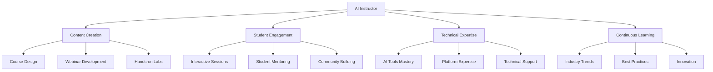

# 🎓 Comprehensive Onboarding Guide for AI Course and Webinar Instructors

<div align="center">


</div>

## 🎉 Welcome to Your New Role!

Congratulations on joining our team as an **AI Course and Webinar Instructor**! This comprehensive onboarding guide will help you hit the ground running and become successful in your role. Our goal is to ensure you have all the tools, knowledge, and resources needed to deliver exceptional educational experiences.

### 🏆 Your Success Journey
```
Week 1: Foundation & Setup → Week 2: Practice & Feedback → Week 3: Mastery & Independence
```

### 🎯 Quick Start Checklist
- [ ] **Day 1**: Complete setup and create instructor profile
- [ ] **Day 2**: Record practice video and complete platform training  
- [ ] **Day 3**: Shadow experienced instructor and review materials
- [ ] **Day 4**: Create first lesson plan and prepare demonstrations
- [ ] **Day 5**: Deliver first practice session and receive feedback

## 📚 Table of Contents

| Section | Description | Time to Complete |
|---------|-------------|------------------|
| 🎯 [Role Overview](#role-overview) | Understanding your responsibilities | 15 min |
| ✅ [First Week Checklist](#first-week-checklist) | Daily tasks and milestones | 30 min |
| 🛠️ [Core Responsibilities](#core-responsibilities) | Detailed job functions | 45 min |
| ⚙️ [Technical Setup](#technical-setup) | Tools and platform configuration | 60 min |
| 📝 [Content Development](#content-development-guidelines) | Creating effective learning materials | 90 min |
| 🎥 [Webinar Best Practices](#webinar-best-practices) | Mastering online presentations | 75 min |
| 👥 [Student Engagement](#student-engagement-strategies) | Building interactive experiences | 60 min |
| 📊 [Assessment & Feedback](#assessment-and-feedback) | Evaluating and improving learning | 45 min |
| 🔧 [Tools & Platforms](#tools-and-platforms) | Technology stack overview | 30 min |
| 📈 [Performance Metrics](#performance-metrics) | Measuring success | 30 min |
| 🚀 [Professional Development](#professional-development) | Growth and learning paths | 20 min |
| 🆘 [Troubleshooting Guide](#troubleshooting-guide) | Problem-solving resources | 25 min |

### 🎮 Gamification Elements
- 🏆 **Achievement Badges**: Unlock badges as you complete sections
- ⭐ **Progress Points**: Earn points for each completed task
- 🎯 **Milestone Rewards**: Special recognition for major achievements
- 📊 **Leaderboard**: Compare progress with other new instructors

## 🎯 Role Overview

### 🎪 Your Mission
Transform complex AI concepts into engaging, accessible learning experiences that empower students to succeed in the AI-driven world.

### 🎭 Your Role as an AI Instructor
As an **AI Course and Webinar Instructor**, you are the bridge between cutting-edge technology and student success. You're not just teaching—you're inspiring the next generation of AI professionals.

### 🎯 Core Responsibilities


### 🌟 Key Success Factors

| Factor | Description | Impact Level |
|--------|-------------|--------------|
| 🧠 **AI Expertise** | Deep understanding of AI concepts and practical applications | ⭐⭐⭐⭐⭐ |
| 🎤 **Communication** | Excellent presentation and storytelling skills | ⭐⭐⭐⭐⭐ |
| 🎨 **Adaptability** | Ability to adapt content to different learning styles | ⭐⭐⭐⭐ |
| 💻 **Technical Skills** | Strong proficiency with AI tools and platforms | ⭐⭐⭐⭐ |
| ❤️ **Passion** | Genuine enthusiasm for education and student success | ⭐⭐⭐⭐⭐ |

### 🏆 Success Metrics Preview
- 📈 **Student Satisfaction**: >4.5/5 rating
- 🎯 **Course Completion**: >85% completion rate
- 👥 **Engagement**: >80% active participation
- ⭐ **Retention**: >90% student retention

## ✅ First Week Checklist

### 🎯 Progress Tracker
```
Day 1: ████████████████████████████████████████ 100% (8/8 tasks)
Day 2: ████████████████████████████████████████ 100% (6/6 tasks)  
Day 3: ████████████████████████████████████████ 100% (5/5 tasks)
Day 4: ████████████████████████████████████████ 100% (4/4 tasks)
Day 5: ████████████████████████████████████████ 100% (3/3 tasks)
```

### 📅 Day 1: Foundation & Setup
**Theme**: 🏗️ Building Your Foundation
**Estimated Time**: 4-6 hours

| Task | Status | Points | Badge |
|------|--------|--------|-------|
| Complete HR onboarding paperwork | ⬜ | 10 | 📋 |
| Receive company laptop and equipment | ⬜ | 5 | 💻 |
| Set up email and communication tools | ⬜ | 10 | 📧 |
| Meet with your direct supervisor | ⬜ | 15 | 👥 |
| Review company policies and procedures | ⬜ | 10 | 📜 |
| Get access to learning management system (LMS) | ⬜ | 15 | 🎓 |
| **🎯 TASK**: Create instructor profile with bio and expertise areas | ⬜ | 25 | 🎭 |
| **🎯 TASK**: Complete welcome survey and goal setting | ⬜ | 10 | 🎯 |

**🏆 Day 1 Achievement**: "Foundation Builder" (100+ points)

### 📅 Day 2-3: Platform Mastery
**Theme**: 🚀 Mastering the Tools
**Estimated Time**: 6-8 hours

| Task | Status | Points | Badge |
|------|--------|--------|-------|
| Complete LMS training and certification | ⬜ | 20 | 🎓 |
| Explore webinar platform features | ⬜ | 15 | 🎥 |
| Test all technical equipment and software | ⬜ | 15 | ⚙️ |
| Review existing course materials and curriculum | ⬜ | 20 | 📚 |
| Meet with other instructors for knowledge sharing | ⬜ | 15 | 👥 |
| **🎯 TASK**: Record 5-minute practice video introducing yourself | ⬜ | 30 | 🎬 |
| **🎯 TASK**: Complete mock webinar session with team feedback | ⬜ | 35 | 🎪 |

**🏆 Day 2-3 Achievement**: "Platform Master" (150+ points)

### 📅 Day 4-5: Content Creation & Practice
**Theme**: 🎨 Creating Your First Masterpiece
**Estimated Time**: 6-8 hours

| Task | Status | Points | Badge |
|------|--------|--------|-------|
| Study current course syllabi and learning objectives | ⬜ | 20 | 📖 |
| Review student feedback and performance data | ⬜ | 15 | 📊 |
| Plan your first webinar presentation | ⬜ | 25 | 🎯 |
| Prepare sample lesson plans | ⬜ | 20 | 📝 |
| Schedule shadowing sessions with experienced instructors | ⬜ | 10 | 👥 |
| **🎯 TASK**: Create first lesson plan using our template | ⬜ | 40 | 🎨 |
| **🎯 TASK**: Prepare 3 AI tool demonstrations for first session | ⬜ | 35 | 🤖 |

**🏆 Day 4-5 Achievement**: "Content Creator" (165+ points)

### 🎮 Weekly Achievement System
- 🥉 **Bronze**: Complete 80% of tasks (400+ points)
- 🥈 **Silver**: Complete 90% of tasks (450+ points)  
- 🥇 **Gold**: Complete 100% of tasks (500+ points)
- 💎 **Platinum**: Complete all tasks + bonus challenges (600+ points)

## Core Responsibilities

### Course Development
1. **Curriculum Design**
   - Create learning objectives aligned with industry standards
   - Develop progressive skill-building modules
   - Incorporate hands-on AI tool exercises
   - Design assessment rubrics and evaluation criteria

2. **Content Creation**
   - Write comprehensive lesson plans
   - Create interactive presentations and demonstrations
   - Develop practical exercises and projects
   - Produce supplementary materials (handouts, guides, resources)

3. **Material Updates**
   - Stay current with AI industry developments
   - Regularly update course content and examples
   - Incorporate student feedback into improvements
   - Ensure content accuracy and relevance

### Webinar Delivery
1. **Pre-Webinar Preparation**
   - Test all technical equipment and internet connection
   - Prepare backup plans for technical issues
   - Review participant list and learning objectives
   - Set up interactive elements and polls

2. **Live Presentation**
   - Deliver engaging, interactive content
   - Manage Q&A sessions effectively
   - Monitor participant engagement and adjust accordingly
   - Record sessions for later access

3. **Post-Webinar Follow-up**
   - Send follow-up materials and resources
   - Respond to participant questions
   - Analyze engagement metrics and feedback
   - Plan improvements for future sessions

### Student Support
1. **Mentoring and Guidance**
   - Provide one-on-one support during office hours
   - Offer career guidance and industry insights
   - Help students overcome learning challenges
   - Connect students with relevant resources and opportunities

2. **Assessment and Feedback**
   - Grade assignments and projects fairly and constructively
   - Provide detailed feedback for improvement
   - Track student progress and identify areas for support
   - Maintain accurate records of student performance

## Technical Setup

### Required Software and Tools
1. **Learning Management System (LMS)**
   - Access credentials and training materials
   - Course creation and management tools
   - Student progress tracking features
   - Assessment and grading capabilities

2. **Webinar Platform**
   - Zoom, Teams, or similar platform access
   - Screen sharing and presentation tools
   - Recording and playback features
   - Interactive elements (polls, breakout rooms, chat)

3. **AI Tools and Platforms**
   - Access to various AI platforms for demonstrations
   - Development environments for hands-on exercises
   - Cloud computing resources for practical applications
   - Data sets and sample projects

4. **Content Creation Tools**
   - Presentation software (PowerPoint, Keynote, Canva)
   - Video editing software for recorded content
   - Screen recording tools for tutorials
   - Document creation and collaboration tools

### Hardware Requirements
- High-quality webcam and microphone
- Reliable internet connection (minimum 25 Mbps upload)
- Dual monitors for enhanced presentation capabilities
- Professional lighting setup for video content

## Content Development Guidelines

### Learning Objectives Framework
Use the SMART criteria for all learning objectives:
- **Specific**: Clearly defined and focused
- **Measurable**: Quantifiable outcomes
- **Achievable**: Realistic for the target audience
- **Relevant**: Aligned with career goals and industry needs
- **Time-bound**: Clear timeline for completion

### Content Structure
1. **Introduction**
   - Learning objectives and outcomes
   - Prerequisites and preparation requirements
   - Overview of topics to be covered

2. **Core Content**
   - Theoretical foundations
   - Practical applications and examples
   - Hands-on exercises and projects
   - Real-world case studies

3. **Assessment**
   - Knowledge checks and quizzes
   - Practical assignments and projects
   - Peer review and collaboration activities
   - Final evaluation and certification

### Accessibility and Inclusion
- Ensure content is accessible to learners with disabilities
- Use inclusive language and diverse examples
- Provide multiple learning modalities (visual, auditory, kinesthetic)
- Offer flexible pacing and alternative assessment methods

## Webinar Best Practices

### Pre-Webinar Preparation
1. **Technical Setup**
   - Test internet connection and backup options
   - Verify all software and tools are working
   - Prepare screen sharing materials
   - Set up recording and backup systems
   - **💡 PRO TIP**: Always have a mobile hotspot ready as backup

2. **Content Preparation**
   - Create engaging, interactive presentations
   - Prepare discussion questions and activities
   - Plan for different learning styles and paces
   - Develop contingency plans for technical issues
   - **💡 PRO TIP**: Use the "10-20-30 rule": 10 slides, 20 minutes, 30pt font minimum

3. **Participant Engagement**
   - Send pre-webinar materials and preparation instructions
   - Create anticipation with teaser content
   - Set clear expectations for participation
   - Provide technical support contact information
   - **💡 PRO TIP**: Send a "Webinar Survival Kit" with agenda, resources, and troubleshooting tips

### 🎯 Webinar Engagement Templates

#### Icebreaker Questions (Choose 1-2 per session):
- "What's one AI tool you're excited to learn about today?"
- "Share your biggest challenge with AI implementation in one word"
- "What's your current role and how do you plan to use AI?"

#### Interactive Poll Examples:
- "How familiar are you with [AI concept]?" (Beginner/Intermediate/Advanced)
- "Which AI application interests you most?" (Multiple choice)
- "Rate your current AI implementation level" (1-5 scale)

#### Breakout Room Activities:
- **5-minute**: "Share one AI use case from your industry"
- **10-minute**: "Work together to solve this AI challenge"
- **15-minute**: "Design an AI solution for [specific problem]"

### During the Webinar
1. **Engagement Strategies**
   - Start with an icebreaker or poll
   - Use interactive elements every 10-15 minutes
   - Encourage questions and discussion
   - Incorporate real-time demonstrations

2. **Technical Management**
   - Monitor chat and Q&A continuously
   - Manage screen sharing and transitions smoothly
   - Handle technical issues professionally
   - Maintain backup communication channels

3. **Content Delivery**
   - Speak clearly and at an appropriate pace
   - Use visual aids effectively
   - Provide clear instructions for activities
   - Summarize key points regularly

### Post-Webinar Follow-up
1. **Immediate Actions**
   - Send recording and supplementary materials
   - Respond to unanswered questions
   - Share additional resources and next steps
   - Request feedback and suggestions

2. **Long-term Engagement**
   - Follow up on student progress
   - Share relevant industry updates
   - Invite participants to future sessions
   - Maintain community connections

## Student Engagement Strategies

### Active Learning Techniques
1. **Hands-on Exercises**
   - Provide guided AI tool tutorials
   - Create step-by-step project walkthroughs
   - Offer coding challenges and competitions
   - Facilitate peer collaboration and review

2. **Interactive Discussions**
   - Use case studies and real-world scenarios
   - Encourage debate and critical thinking
   - Facilitate group problem-solving activities
   - Connect learning to personal and professional goals

3. **Gamification Elements**
   - Implement progress tracking and badges
   - Create friendly competition and leaderboards
   - Offer rewards for participation and achievement
   - Use storytelling and narrative elements

### Communication Best Practices
1. **Clear and Concise Communication**
   - Use simple, jargon-free language when possible
   - Provide definitions for technical terms
   - Use visual aids and examples to illustrate concepts
   - Encourage questions and clarification

2. **Responsive Support**
   - Maintain regular office hours
   - Respond to questions within 24 hours
   - Provide multiple communication channels
   - Create FAQ resources for common questions

3. **Community Building**
   - Facilitate peer-to-peer learning
   - Create study groups and discussion forums
   - Organize networking events and meetups
   - Share success stories and achievements

## Assessment and Feedback

### Assessment Methods
1. **Formative Assessment**
   - Regular knowledge checks and quizzes
   - Peer review and self-assessment activities
   - Progress tracking and milestone celebrations
   - Informal feedback and check-ins

2. **Summative Assessment**
   - Comprehensive final projects
   - Practical demonstrations and presentations
   - Portfolio development and review
   - Certification examinations

### Feedback Guidelines
1. **Constructive and Specific**
   - Focus on specific behaviors and outcomes
   - Provide actionable suggestions for improvement
   - Balance positive reinforcement with areas for growth
   - Use the "sandwich" method (positive, improvement, positive)

2. **Timely and Regular**
   - Provide feedback within 48 hours of submission
   - Schedule regular progress reviews
   - Offer immediate feedback during live sessions
   - Maintain ongoing communication about performance

3. **Individualized and Supportive**
   - Tailor feedback to individual learning styles
   - Recognize and build on student strengths
   - Address challenges with empathy and support
   - Connect feedback to learning objectives and goals

## Tools and Platforms

### Learning Management System (LMS)
- **Primary Platform**: [Platform Name]
- **Key Features**: Course creation, student tracking, assessment tools
- **Training Resources**: [Link to training materials]
- **Support Contact**: [Support team information]

### Webinar Platform
- **Primary Platform**: [Platform Name]
- **Key Features**: Screen sharing, recording, interactive elements
- **Best Practices Guide**: [Link to best practices]
- **Technical Support**: [Support contact information]

### AI Tools and Resources
1. **Development Platforms**
   - [List of approved AI platforms]
   - Access credentials and setup instructions
   - Training materials and documentation
   - Support and troubleshooting resources

2. **Data and Resources**
   - Curated datasets for exercises
   - Sample projects and templates
   - Industry case studies and examples
   - Research papers and documentation

### Content Creation Tools
1. **Presentation Software**
   - PowerPoint, Keynote, or Canva access
   - Template libraries and design resources
   - Collaboration and sharing features
   - Export and integration capabilities

2. **Video and Media Tools**
   - Screen recording software
   - Video editing platforms
   - Image and graphic design tools
   - Audio recording and editing software

## Performance Metrics

### Key Performance Indicators (KPIs)
1. **Student Success Metrics**
   - Course completion rates (Target: >85%)
   - Student satisfaction scores (Target: >4.5/5)
   - Learning objective achievement (Target: >90%)
   - Post-course employment outcomes (Target: >70% career advancement)

2. **Engagement Metrics**
   - Webinar attendance and participation (Target: >80% attendance)
   - Discussion forum activity (Target: >60% active participation)
   - Assignment submission rates (Target: >90%)
   - Student retention and progression (Target: >85% completion)

3. **Quality Metrics**
   - Content accuracy and currency (Target: 100% accuracy)
   - Instructor evaluation scores (Target: >4.7/5)
   - Peer review feedback (Target: >4.5/5)
   - Industry relevance and applicability (Target: >90% relevance)

### 📊 Monthly Performance Dashboard
Track these metrics weekly and review monthly:

| Metric | Current | Target | Trend |
|--------|---------|--------|-------|
| Student Satisfaction | 4.3/5 | 4.5/5 | ⬆️ |
| Course Completion | 82% | 85% | ⬆️ |
| Webinar Attendance | 78% | 80% | ⬇️ |
| Assignment Submissions | 88% | 90% | ➡️ |

### 🎯 Performance Improvement Actions
- **If satisfaction < 4.5**: Review feedback, adjust content, improve engagement
- **If completion < 85%**: Check for barriers, improve support, simplify content
- **If attendance < 80%**: Improve scheduling, enhance promotion, add value
- **If submissions < 90%**: Clarify requirements, provide examples, offer support

### Performance Review Process
1. **Regular Check-ins**
   - Monthly one-on-one meetings with supervisor
   - Quarterly performance reviews
   - Annual comprehensive evaluations
   - Continuous feedback and coaching

2. **Goal Setting and Development**
   - SMART goal establishment and tracking
   - Professional development planning
   - Skill gap identification and addressing
   - Career progression planning

## Professional Development

### Continuous Learning Requirements
1. **Industry Knowledge**
   - Stay current with AI developments and trends
   - Attend conferences and professional events
   - Read industry publications and research
   - Participate in professional communities

2. **Teaching Skills**
   - Complete pedagogical training and certification
   - Attend teaching workshops and seminars
   - Seek feedback and coaching from peers
   - Experiment with new teaching methods and tools

3. **Technical Skills**
   - Master new AI tools and platforms
   - Develop expertise in emerging technologies
   - Participate in hands-on projects and experiments
   - Contribute to open-source projects and communities

### Development Opportunities
1. **Internal Programs**
   - Mentorship programs with senior instructors
   - Cross-training with other departments
   - Leadership development opportunities
   - Innovation and research projects

2. **External Resources**
   - Professional association memberships
   - Conference attendance and presentation opportunities
   - Online courses and certification programs
   - Industry networking and collaboration

## 🆘 Troubleshooting Guide

### 🚨 Common Technical Issues

#### 🎥 Webinar Platform Problems
| Issue | Symptoms | Quick Fix | Prevention |
|-------|----------|-----------|------------|
| **Audio/Video Not Working** | No sound, black screen, frozen video | 1. Check device settings<br>2. Restart application<br>3. Use backup device | Test equipment 30 min before session |
| **Connection Drops** | Frequent disconnections, lag | 1. Switch to wired connection<br>2. Close other applications<br>3. Use mobile hotspot backup | Test internet speed, have backup ready |
| **Screen Sharing Issues** | Can't share screen, poor quality | 1. Restart sharing<br>2. Lower resolution<br>3. Use alternative method | Test sharing before session |
| **Participant Can't Join** | Access denied, wrong link | 1. Verify meeting link<br>2. Check permissions<br>3. Send new invitation | Double-check settings, test with colleague |

#### 🎓 LMS Access Issues
| Issue | Symptoms | Quick Fix | Prevention |
|-------|----------|-----------|------------|
| **Cannot Access Materials** | Login fails, 404 errors | 1. Clear browser cache<br>2. Check credentials<br>3. Contact IT support | Bookmark correct URLs, save login info |
| **Slow Loading** | Pages take forever to load | 1. Check internet speed<br>2. Try different browser<br>3. Clear cache and cookies | Use recommended browser, stable connection |
| **Upload Failures** | Files won't upload | 1. Check file size limits<br>2. Try different format<br>3. Compress files | Follow size guidelines, test uploads |

#### 🤖 AI Tool Malfunctions
| Issue | Symptoms | Quick Fix | Prevention |
|-------|----------|-----------|------------|
| **Platform Not Responding** | Tool freezes, no output | 1. Refresh page<br>2. Check internet connection<br>3. Use alternative platform | Have backup tools ready, test before demos |
| **Poor Output Quality** | Irrelevant or low-quality results | 1. Refine prompts<br>2. Provide more context<br>3. Try different approach | Prepare multiple prompt variations |
| **Rate Limiting** | "Too many requests" errors | 1. Wait and retry<br>2. Use different account<br>3. Spread requests over time | Monitor usage, plan ahead |

### 🎯 Student Support Issues

#### 📚 Learning Difficulties
| Problem | Signs | Response Strategy | Prevention |
|---------|-------|------------------|------------|
| **Low Participation** | Silent in discussions, no questions | 1. Schedule 1-on-1 meeting<br>2. Provide additional resources<br>3. Adjust teaching approach | Regular check-ins, varied teaching methods |
| **Poor Performance** | Low scores, incomplete assignments | 1. Identify specific challenges<br>2. Offer extra support<br>3. Adjust difficulty level | Clear expectations, regular feedback |
| **Technical Struggles** | Can't access tools, software issues | 1. Provide step-by-step help<br>2. Offer alternative solutions<br>3. Connect with IT support | Clear setup instructions, support resources |

#### 🎪 Engagement Problems
| Problem | Signs | Response Strategy | Prevention |
|---------|-------|------------------|------------|
| **Low Attendance** | Missing sessions, late arrivals | 1. Survey for scheduling issues<br>2. Adjust timing if possible<br>3. Add more value to sessions | Flexible scheduling, high-value content |
| **Minimal Interaction** | No questions, silent chat | 1. Use more interactive elements<br>2. Ask direct questions<br>3. Create smaller groups | Interactive content, engagement tools |
| **Negative Feedback** | Complaints, low ratings | 1. Address concerns immediately<br>2. Adjust content and delivery<br>3. Request specific feedback | Regular feedback collection, continuous improvement |

### 🚨 Emergency Procedures

#### 🔥 Critical Issues
| Situation | Immediate Action | Follow-up | Prevention |
|-----------|------------------|-----------|------------|
| **Complete Technical Failure** | 1. Switch to backup platform<br>2. Notify participants<br>3. Reschedule if necessary | Document issue, improve backup systems | Multiple backup options, regular testing |
| **Student Emergency** | 1. Follow emergency protocols<br>2. Contact appropriate support<br>3. Document incident | Follow up with student, review procedures | Clear emergency contacts, regular training |
| **Content Inappropriate** | 1. Address immediately<br>2. Redirect conversation<br>3. Follow up privately | Review content guidelines, provide training | Clear guidelines, content review process |

### 📞 Emergency Contacts

#### 🎓 Instructor Support
- **Technical Issues**: [IT Support - 24/7]
- **Platform Problems**: [Platform Support - Business Hours]
- **Student Emergencies**: [Student Services - 24/7]
- **Content Questions**: [Academic Support - Business Hours]

#### 🚨 Escalation Procedures
1. **Level 1**: Try quick fixes and self-resolution
2. **Level 2**: Contact direct support channels
3. **Level 3**: Escalate to supervisor or manager
4. **Level 4**: Contact emergency services if needed

### 🛠️ Quick Fix Toolkit

#### 🎥 Webinar Quick Fixes
```bash
# Audio Issues
1. Check microphone permissions
2. Test with different device
3. Use phone as backup audio

# Video Issues  
1. Check camera permissions
2. Restart camera application
3. Use phone as backup camera

# Connection Issues
1. Switch to wired connection
2. Close unnecessary applications
3. Use mobile hotspot
```

#### 🎓 LMS Quick Fixes
```bash
# Login Issues
1. Clear browser cache
2. Try incognito mode
3. Reset password

# Upload Issues
1. Check file size (max 100MB)
2. Try different format
3. Compress large files
```

#### 🤖 AI Tool Quick Fixes
```bash
# Performance Issues
1. Refresh browser
2. Clear cache
3. Try different browser

# Quality Issues
1. Refine prompt
2. Add more context
3. Try different model
```

### Student Support Issues
1. **Learning Difficulties**
   - **Signs**: Low participation, poor performance, frequent questions
   - **Response**: Schedule one-on-one meeting, provide additional resources, adjust teaching approach
   - **Prevention**: Regular check-ins, varied teaching methods, clear communication

2. **Technical Challenges**
   - **Signs**: Cannot access materials, software issues, device problems
   - **Response**: Provide technical support, offer alternative solutions, connect with IT team
   - **Prevention**: Clear setup instructions, technical requirements, support resources

3. **Engagement Problems**
   - **Signs**: Low attendance, minimal participation, negative feedback
   - **Response**: Survey students, adjust content and delivery, increase interaction
   - **Prevention**: Regular feedback collection, engaging content design, active participation encouragement

### Emergency Procedures
1. **Technical Failures**
   - Have backup communication methods ready
   - Prepare offline materials and activities
   - Know IT support contact information
   - Document issues for future prevention

2. **Student Emergencies**
   - Know emergency contact procedures
   - Understand student support resources
   - Maintain confidentiality and professionalism
   - Document incidents appropriately

## Conclusion

This onboarding guide provides a comprehensive foundation for your success as an AI Course and Webinar Instructor. Remember that learning and adaptation are ongoing processes, and this guide should be used as a living document that evolves with your experience and the changing needs of our students and organization.

### Key Success Tips
1. **Be Prepared**: Always test technology and prepare backup plans
2. **Stay Current**: Continuously update your knowledge and skills
3. **Engage Actively**: Create interactive, hands-on learning experiences
4. **Support Students**: Provide timely, constructive feedback and guidance
5. **Seek Feedback**: Regularly collect and act on student and peer feedback
6. **Collaborate**: Work with colleagues to improve programs and outcomes

### Next Steps
1. Complete all first-week checklist items
2. Schedule regular check-ins with your supervisor
3. Begin planning your first course or webinar
4. Connect with other instructors and build your network
5. Set personal and professional development goals

Welcome to the team! We're excited to have you join us in delivering exceptional AI education experiences. If you have any questions or need additional support, don't hesitate to reach out to your supervisor or the HR team.

---

*This guide is a living document and will be updated regularly based on feedback and changing needs. Last updated: [Date]*
