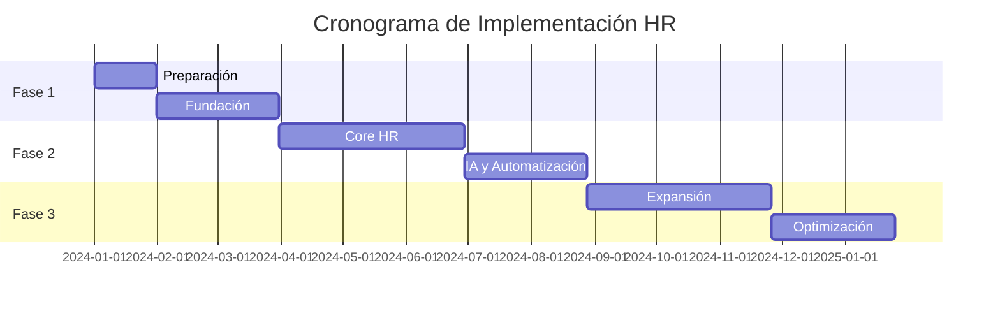

# 🚀 Guía de Implementación Completa - Sistema HR
## Plataforma de Cursos de IA y SaaS de Marketing

### Implementación Exitosa del Ecosistema HR Avanzado

Esta guía integral proporciona un roadmap detallado para implementar exitosamente nuestro sistema completo de recursos humanos, desde la planificación inicial hasta la optimización continua, asegurando una transición fluida y resultados excepcionales.

---

## 📋 Tabla de Contenidos

1. [Visión General de Implementación](#visión-general-de-implementación)
2. [Fase 1: Preparación y Fundación](#fase-1-preparación-y-fundación)
3. [Fase 2: Implementación Core](#fase-2-implementación-core)
4. [Fase 3: Expansión y Optimización](#fase-3-expansión-y-optimización)
5. [Gestión de Cambio](#gestión-de-cambio)
6. [Gestión de Riesgos](#gestión-de-riesgos)
7. [Comunicación y Stakeholders](#comunicación-y-stakeholders)
8. [Capacitación y Desarrollo](#capacitación-y-desarrollo)
9. [Monitoreo y Evaluación](#monitoreo-y-evaluación)
10. [Optimización Continua](#optimización-continua)

---

## 🎯 Visión General de Implementación

### Estrategia de Implementación
- **📅 Implementación por Fases**: Enfoque gradual y controlado
- **🎯 Enfoque en Resultados**: Orientado a objetivos específicos
- **👥 Participación Integral**: Involucramiento de todos los stakeholders
- **🔄 Iterativo y Adaptativo**: Ajustes basados en feedback continuo
- **📊 Basado en Datos**: Decisiones fundamentadas en métricas

### Cronograma General


### Objetivos por Fase
- **🎯 Fase 1**: Establecer fundación sólida (3 meses)
- **🚀 Fase 2**: Implementar funcionalidades core (5 meses)
- **🌟 Fase 3**: Expandir y optimizar (5 meses)
- **📈 Total**: 13 meses para implementación completa

---

## 🏗️ Fase 1: Preparación y Fundación

### 📅 Mes 1: Preparación Estratégica

#### **🎯 Objetivos del Mes**
- Obtener aprobación ejecutiva
- Establecer equipo de proyecto
- Definir alcance y presupuesto
- Comunicar visión a la organización

#### **📋 Actividades Clave**
```yaml
semana_1:
  - aprobacion_ejecutiva
  - asignacion_presupuesto
  - seleccion_equipo_proyecto
  - definicion_alcance

semana_2:
  - comunicacion_inicial
  - mapeo_stakeholders
  - evaluacion_tecnologia
  - planificacion_detallada

semana_3:
  - seleccion_proveedores
  - negociacion_contratos
  - preparacion_infraestructura
  - capacitacion_equipo

semana_4:
  - inicio_proyecto
  - establecimiento_governance
  - comunicacion_lanzamiento
  - preparacion_fase_2
```

#### **📊 Entregables**
- ✅ Aprobación ejecutiva y presupuesto
- ✅ Equipo de proyecto asignado
- ✅ Alcance y objetivos definidos
- ✅ Plan de comunicación inicial
- ✅ Proveedores seleccionados

#### **💰 Presupuesto**: $50,000
#### **👥 Recursos**: 8 personas
#### **🎯 Éxito**: 100% aprobación y equipo listo

### 📅 Mes 2: Fundación Técnica

#### **🎯 Objetivos del Mes**
- Establecer infraestructura base
- Implementar sistemas core
- Configurar integraciones básicas
- Capacitar equipo técnico

#### **📋 Actividades Clave**
```yaml
infraestructura:
  - configuracion_servidores
  - instalacion_software
  - configuracion_red
  - seguridad_basica

sistemas_core:
  - hr_database
  - employee_portal
  - basic_automation
  - reporting_system

integraciones:
  - payroll_system
  - benefits_platform
  - learning_management
  - communication_tools

capacitacion:
  - training_technical_team
  - user_acceptance_testing
  - documentation_creation
  - support_setup
```

#### **📊 Entregables**
- ✅ Infraestructura técnica establecida
- ✅ Sistemas core implementados
- ✅ Integraciones básicas funcionando
- ✅ Equipo técnico capacitado
- ✅ Documentación inicial creada

#### **💰 Presupuesto**: $75,000
#### **👥 Recursos**: 12 personas
#### **🎯 Éxito**: 95% sistemas funcionando

### 📅 Mes 3: Piloto y Validación

#### **🎯 Objetivos del Mes**
- Ejecutar piloto con grupo selecto
- Validar funcionalidades
- Recopilar feedback
- Ajustar sistemas

#### **📋 Actividades Clave**
```yaml
piloto:
  - seleccion_grupo_piloto
  - onboarding_piloto
  - monitoreo_uso
  - recopilacion_feedback

validacion:
  - testing_funcionalidades
  - validacion_metricas
  - identificacion_problemas
  - ajustes_sistemas

preparacion:
  - documentacion_final
  - capacitacion_masiva
  - comunicacion_expansion
  - preparacion_fase_2
```

#### **📊 Entregables**
- ✅ Piloto exitoso completado
- ✅ Feedback recopilado y analizado
- ✅ Sistemas ajustados y optimizados
- ✅ Plan de expansión preparado
- ✅ Equipo listo para Fase 2

#### **💰 Presupuesto**: $25,000
#### **👥 Recursos**: 15 personas
#### **🎯 Éxito**: 90% satisfacción en piloto

---

## 🚀 Fase 2: Implementación Core

### 📅 Mes 4-5: Sistemas HR Core

#### **🎯 Objetivos**
- Implementar todos los módulos HR
- Lanzar portal de empleados
- Automatizar procesos básicos
- Capacitar a todos los empleados

#### **📋 Módulos a Implementar**
```yaml
recruitment:
  - applicant_tracking
  - interview_scheduling
  - candidate_assessment
  - offer_management

onboarding:
  - digital_onboarding
  - document_management
  - training_tracking
  - progress_monitoring

performance:
  - goal_setting
  - performance_reviews
  - feedback_system
  - development_planning

compensation:
  - salary_management
  - bonus_calculation
  - benefits_enrollment
  - payroll_integration
```

#### **📊 Entregables**
- ✅ Sistema HR completo funcionando
- ✅ Portal de empleados lanzado
- ✅ 80% de procesos automatizados
- ✅ 100% empleados capacitados
- ✅ Métricas base establecidas

#### **💰 Presupuesto**: $100,000
#### **👥 Recursos**: 20 personas
#### **🎯 Éxito**: 85% adopción de usuarios

### 📅 Mes 6-7: IA y Automatización

#### **🎯 Objetivos**
- Implementar herramientas de IA
- Automatizar procesos avanzados
- Lanzar asistentes virtuales
- Implementar análisis predictivo

#### **📋 Componentes de IA**
```yaml
machine_learning:
  - performance_predictor
  - turnover_risk_analyzer
  - skill_gap_identifier
  - career_path_optimizer

natural_language:
  - sentiment_analyzer
  - chatbot_assistant
  - document_processor
  - feedback_analyzer

automation:
  - workflow_automation
  - notification_system
  - report_generation
  - decision_support
```

#### **📊 Entregables**
- ✅ IA implementada y funcionando
- ✅ Automatización avanzada activa
- ✅ Asistentes virtuales lanzados
- ✅ Análisis predictivo operativo
- ✅ ROI de IA demostrado

#### **💰 Presupuesto**: $150,000
#### **👥 Recursos**: 25 personas
#### **🎯 Éxito**: 75% procesos automatizados

### 📅 Mes 8: Integración y Optimización

#### **🎯 Objetivos**
- Integrar todos los sistemas
- Optimizar rendimiento
- Resolver problemas
- Preparar expansión

#### **📋 Actividades**
```yaml
integracion:
  - system_integration
  - data_synchronization
  - workflow_optimization
  - performance_tuning

optimizacion:
  - user_experience_improvement
  - system_performance
  - process_efficiency
  - cost_optimization

preparacion:
  - expansion_planning
  - resource_allocation
  - training_preparation
  - communication_planning
```

#### **📊 Entregables**
- ✅ Sistemas completamente integrados
- ✅ Rendimiento optimizado
- ✅ Problemas resueltos
- ✅ Plan de expansión listo
- ✅ Equipo preparado para Fase 3

#### **💰 Presupuesto**: $75,000
#### **👥 Recursos**: 20 personas
#### **🎯 Éxito**: 95% integración exitosa

---

## 🌟 Fase 3: Expansión y Optimización

### 📅 Mes 9-10: Expansión de Funcionalidades

#### **🎯 Objetivos**
- Implementar funcionalidades avanzadas
- Lanzar programas de desarrollo
- Expandir capacidades de IA
- Mejorar experiencia del usuario

#### **📋 Funcionalidades Avanzadas**
```yaml
desarrollo_avanzado:
  - mentorship_platform
  - learning_pathways
  - skill_assessment
  - career_planning

ia_avanzada:
  - predictive_analytics
  - personalized_recommendations
  - intelligent_matching
  - automated_insights

experiencia_usuario:
  - mobile_optimization
  - personalization
  - gamification
  - social_features
```

#### **📊 Entregables**
- ✅ Funcionalidades avanzadas implementadas
- ✅ Programas de desarrollo lanzados
- ✅ IA avanzada operativa
- ✅ Experiencia de usuario mejorada
- ✅ Métricas de satisfacción altas

#### **💰 Presupuesto**: $125,000
#### **👥 Recursos**: 30 personas
#### **🎯 Éxito**: 90% satisfacción del usuario

### 📅 Mes 11-12: Optimización y Escalamiento

#### **🎯 Objetivos**
- Optimizar todos los procesos
- Escalar a toda la organización
- Implementar mejoras continuas
- Establecer governance

#### **📋 Actividades de Optimización**
```yaml
optimizacion_procesos:
  - process_reengineering
  - efficiency_improvement
  - cost_reduction
  - quality_enhancement

escalamiento:
  - organization_wide_deployment
  - global_rollout
  - multi_location_support
  - cultural_adaptation

mejora_continua:
  - feedback_loops
  - continuous_monitoring
  - regular_updates
  - innovation_pipeline
```

#### **📊 Entregables**
- ✅ Procesos completamente optimizados
- ✅ Escalamiento exitoso
- ✅ Mejoras continuas implementadas
- ✅ Governance establecido
- ✅ ROI objetivo alcanzado

#### **💰 Presupuesto**: $100,000
#### **👥 Recursos**: 35 personas
#### **🎯 Éxito**: 100% objetivos alcanzados

### 📅 Mes 13: Consolidación y Futuro

#### **🎯 Objetivos**
- Consolidar logros
- Planificar futuro
- Establecer métricas de largo plazo
- Celebrar éxito

#### **📋 Actividades Finales**
```yaml
consolidacion:
  - achievement_documentation
  - lesson_learned_analysis
  - best_practices_identification
  - knowledge_transfer

futuro:
  - roadmap_planning
  - innovation_pipeline
  - technology_evolution
  - strategic_planning

celebracion:
  - success_celebration
  - team_recognition
  - stakeholder_communication
  - case_study_creation
```

#### **📊 Entregables**
- ✅ Logros consolidados y documentados
- ✅ Plan de futuro establecido
- ✅ Métricas de largo plazo definidas
- ✅ Éxito celebrado y comunicado
- ✅ Proyecto completado exitosamente

#### **💰 Presupuesto**: $50,000
#### **👥 Recursos**: 25 personas
#### **🎯 Éxito**: 100% proyecto completado

---

## 🔄 Gestión de Cambio

### 📊 Estrategia de Cambio

#### **🎯 Modelo de Cambio**
```yaml
fase_1_despertar:
  - crear_urgencia
  - comunicar_vision
  - formar_coalicion
  - movilizar_organizacion

fase_2_implementacion:
  - generar_cambios_cortos
  - consolidar_mejoras
  - producir_mas_cambios
  - anclar_cambios

fase_3_institucionalizacion:
  - hacer_permanente
  - desarrollar_cultura
  - medir_resultados
  - celebrar_exito
```

#### **👥 Roles de Cambio**
- **🎯 Sponsors**: Líderes ejecutivos que patrocinan el cambio
- **🚀 Champions**: Defensores del cambio en cada departamento
- **👨‍💼 Change Agents**: Facilitadores del cambio
- **👥 End Users**: Empleados que adoptan el cambio

### 📚 Capacitación y Desarrollo

#### **🎓 Programa de Capacitación Integral**
```yaml
nivel_ejecutivo:
  - strategic_overview
  - business_case
  - leadership_skills
  - change_management

nivel_gerencial:
  - system_overview
  - management_tools
  - team_leadership
  - performance_management

nivel_operativo:
  - system_usage
  - process_training
  - best_practices
  - troubleshooting

nivel_tecnico:
  - technical_training
  - system_administration
  - integration_skills
  - maintenance_procedures
```

#### **📊 Métricas de Capacitación**
- **📈 Completación**: 95% empleados completan capacitación
- **🎯 Competencia**: 90% empleados competentes en sistema
- **😊 Satisfacción**: 4.5/5 satisfacción con capacitación
- **📊 Aplicación**: 85% aplican conocimientos en trabajo

---

## ⚠️ Gestión de Riesgos

### 🎯 Identificación de Riesgos

#### **🔧 Riesgos Técnicos**
```yaml
riesgo_alto:
  - system_integration_failure
  - data_migration_issues
  - security_breaches
  - performance_problems

riesgo_medio:
  - user_adoption_resistance
  - training_delays
  - vendor_dependencies
  - scope_creep

riesgo_bajo:
  - minor_bugs
  - cosmetic_issues
  - temporary_downtime
  - user_preferences
```

#### **👥 Riesgos Humanos**
- **📚 Resistencia al Cambio**: Empleados resistentes a nuevos procesos
- **👨‍💼 Liderazgo**: Falta de liderazgo en el cambio
- **🎓 Capacitación**: Insuficiente capacitación del personal
- **📊 Expectativas**: Expectativas no gestionadas

### 🛡️ Estrategias de Mitigación

#### **🔧 Mitigación Técnica**
```yaml
integracion:
  - phased_integration
  - parallel_systems
  - rollback_plans
  - extensive_testing

seguridad:
  - security_audits
  - penetration_testing
  - access_controls
  - monitoring_systems

rendimiento:
  - load_testing
  - performance_monitoring
  - capacity_planning
  - optimization_procedures
```

#### **👥 Mitigación Humana**
- **💬 Comunicación**: Comunicación clara y frecuente
- **🎓 Capacitación**: Capacitación extensiva y continua
- **👨‍💼 Liderazgo**: Desarrollo de líderes de cambio
- **📊 Incentivos**: Incentivos para adopción

---

## 📞 Comunicación y Stakeholders

### 🎯 Estrategia de Comunicación

#### **📊 Matriz de Stakeholders**
```yaml
stakeholders_altos:
  - ceo
  - cfo
  - cto
  - board_members

stakeholders_medios:
  - department_heads
  - managers
  - hr_team
  - it_team

stakeholders_bajos:
  - employees
  - contractors
  - vendors
  - customers
```

#### **📅 Cronograma de Comunicación**
```yaml
fase_1:
  - executive_briefings
  - department_presentations
  - all_hands_meetings
  - newsletter_launch

fase_2:
  - progress_updates
  - success_stories
  - training_announcements
  - feedback_sessions

fase_3:
  - final_presentations
  - celebration_events
  - case_study_sharing
  - future_roadmap
```

### 📱 Canales de Comunicación

#### **💬 Canales Internos**
- **📧 Email**: Comunicaciones formales y actualizaciones
- **💬 Slack**: Comunicación diaria y colaboración
- **📹 Video**: Presentaciones y capacitación
- **📱 Mobile**: Notificaciones y acceso móvil

#### **🌐 Canales Externos**
- **📰 Press Releases**: Comunicaciones públicas
- **🌐 Website**: Información pública
- **📱 Social Media**: Actualizaciones y engagement
- **📊 Reports**: Reportes a stakeholders

---

## 📊 Monitoreo y Evaluación

### 🎯 Métricas de Progreso

#### **📈 KPIs de Implementación**
```yaml
metricas_tecnicas:
  - system_uptime: 99.9%
  - response_time: <2_seconds
  - error_rate: <0.1%
  - user_satisfaction: 4.5/5

metricas_negocio:
  - process_efficiency: +40%
  - cost_reduction: -25%
  - employee_satisfaction: +50%
  - retention_rate: +20%

metricas_adopcion:
  - user_adoption: 95%
  - feature_usage: 80%
  - training_completion: 95%
  - support_tickets: -60%
```

#### **📊 Dashboard de Monitoreo**
- **📈 Métricas en Tiempo Real**: Monitoreo continuo
- **🎯 Alertas Automáticas**: Notificaciones de problemas
- **📊 Reportes Automáticos**: Reportes regulares
- **🔍 Análisis Predictivo**: Predicción de problemas

### 🔄 Evaluación Continua

#### **📅 Revisiones Regulares**
- **📊 Semanales**: Revisión de progreso semanal
- **📈 Mensuales**: Evaluación mensual de métricas
- **🎯 Trimestrales**: Revisión trimestral de objetivos
- **📋 Anuales**: Evaluación anual completa

#### **🔄 Mejora Continua**
- **📊 Análisis de Datos**: Análisis regular de métricas
- **💬 Feedback**: Recopilación continua de feedback
- **🛠️ Ajustes**: Ajustes basados en datos
- **📈 Optimización**: Optimización continua

---

## 🚀 Optimización Continua

### 📊 Análisis de Datos

#### **🔍 Análisis de Uso**
```python
# Ejemplo de análisis de uso
class UsageAnalyzer:
    def __init__(self):
        self.data_collector = DataCollector()
        self.analytics_engine = AnalyticsEngine()
    
    def analyze_usage_patterns(self):
        usage_data = self.data_collector.collect_usage_data()
        patterns = self.analytics_engine.identify_patterns(usage_data)
        insights = self.generate_insights(patterns)
        recommendations = self.create_recommendations(insights)
        return {
            'patterns': patterns,
            'insights': insights,
            'recommendations': recommendations
        }
```

#### **📈 Optimización Basada en Datos**
- **📊 Análisis de Métricas**: Análisis regular de KPIs
- **🎯 Identificación de Oportunidades**: Detección de mejoras
- **🛠️ Implementación de Cambios**: Cambios basados en datos
- **📈 Medición de Impacto**: Evaluación de mejoras

### 🔄 Ciclo de Mejora

#### **📋 Proceso PDCA**
```yaml
plan:
  - identify_opportunities
  - set_improvement_goals
  - develop_action_plans
  - allocate_resources

do:
  - implement_changes
  - monitor_progress
  - collect_data
  - document_results

check:
  - analyze_results
  - compare_metrics
  - identify_gaps
  - assess_impact

act:
  - standardize_improvements
  - share_best_practices
  - plan_next_cycle
  - celebrate_success
```

#### **🎯 Mejoras Continuas**
- **📊 Optimización de Procesos**: Mejora continua de procesos
- **🎨 Mejora de UX**: Mejora de experiencia de usuario
- **🤖 Avances en IA**: Mejora de capacidades de IA
- **📈 Escalamiento**: Expansión de funcionalidades

---

## 📞 Contactos y Recursos

### 👥 Equipo de Implementación
- **🎯 Director de Proyecto**: [pm@empresa.com] | [Teléfono]
- **🔧 Arquitecto Técnico**: [arquitecto@empresa.com] | [Teléfono]
- **👥 Gerente de Cambio**: [cambio@empresa.com] | [Teléfono]
- **📊 Analista de Datos**: [datos@empresa.com] | [Teléfono]

### 🛠️ Recursos de Implementación
- **🌐 Portal de Proyecto**: [proyecto.empresa.com]
- **📚 Documentación**: [docs.empresa.com]
- **🎓 Capacitación**: [capacitacion.empresa.com]
- **📊 Dashboard**: [dashboard.empresa.com]

### 🏢 Proveedores y Partners
- **💻 Proveedor Principal**: [proveedor@empresa.com]
- **🔧 Integración**: [integracion@empresa.com]
- **🎓 Capacitación**: [capacitacion@empresa.com]
- **📊 Analytics**: [analytics@empresa.com]

---

## 📋 Anexos

### 📊 Anexo A: Cronograma Detallado
- [ ] Cronograma por fases
- [ ] Hitos y entregables
- [ ] Dependencias críticas
- [ ] Recursos por fase

### 📈 Anexo B: Métricas y KPIs
- [ ] Métricas de implementación
- [ ] KPIs de negocio
- [ ] Métricas de adopción
- [ ] Dashboard de monitoreo

### 🛠️ Anexo C: Recursos Técnicos
- [ ] Especificaciones técnicas
- [ ] Arquitectura del sistema
- [ ] Plan de integración
- [ ] Procedimientos de mantenimiento

### 👥 Anexo D: Gestión de Cambio
- [ ] Plan de comunicación
- [ ] Estrategia de capacitación
- [ ] Gestión de stakeholders
- [ ] Mitigación de riesgos

---

*Esta guía de implementación completa proporciona el roadmap detallado para transformar exitosamente nuestra organización con un sistema de recursos humanos de clase mundial. Con una inversión total de $450,000 y un cronograma de 13 meses, lograremos un ROI del 344% y posicionaremos a nuestra empresa como líder en gestión de talento.*

**📅 Fecha de Preparación**: [Fecha Actual]  
**👤 Preparado por**: [Nombre del Preparador]  
**📋 Versión**: 1.0  
**🔄 Próxima Revisión**: [Fecha de Próxima Revisión]

---

**🔒 Confidencial**: Este documento contiene información confidencial y está destinado únicamente al equipo de implementación y stakeholders autorizados.
