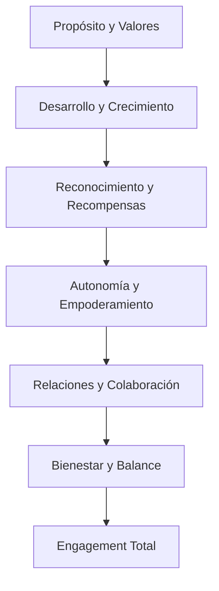

# 💝 Estrategia Integral de Engagement de Empleados
## Plataforma de Cursos de IA y SaaS de Marketing

### Construyendo una Cultura de Compromiso Extraordinario

Esta estrategia integral establece un marco completo para crear, medir y mantener niveles excepcionales de engagement de empleados en nuestra plataforma de cursos de IA y SaaS de marketing, transformando el lugar de trabajo en un entorno donde cada empleado se siente valorado, motivado y comprometido con el éxito organizacional.

---

## 📋 Tabla de Contenidos

1. [Visión del Engagement de Empleados](#visión-del-engagement-de-empleados)
2. [Modelo de Engagement](#modelo-de-engagement)
3. [Estrategias de Engagement](#estrategias-de-engagement)
4. [Programas de Engagement](#programas-de-engagement)
5. [Tecnología de Engagement](#tecnología-de-engagement)
6. [Medición y Analytics](#medición-y-analytics)
7. [Cultura de Engagement](#cultura-de-engagement)
8. [Liderazgo y Engagement](#liderazgo-y-engagement)
9. [Bienestar y Engagement](#bienestar-y-engagement)
10. [Roadmap de Engagement](#roadmap-de-engagement)

---

## 🎯 Visión del Engagement de Empleados

### Filosofía de Engagement
- **💝 Compromiso Auténtico**: Engagement genuino basado en propósito y valores
- **🎯 Impacto Significativo**: Cada empleado contribuye al éxito organizacional
- **🤝 Conexión Profunda**: Relaciones auténticas entre empleados y organización
- **🚀 Crecimiento Continuo**: Desarrollo personal y profesional constante
- **🎉 Celebración del Éxito**: Reconocimiento y celebración de logros
- **🌍 Propósito Compartido**: Visión común que inspira y motiva

### Objetivos Estratégicos
- **📊 Engagement Score**: Alcanzar 90+ en índice de engagement
- **😊 Satisfacción**: 95% de satisfacción laboral
- **🔄 Retención**: 95% de retención de empleados
- **💡 Productividad**: 40% mejora en productividad
- **🏆 Reconocimiento**: Top 10% en "Best Places to Work"
- **🌍 Impacto Social**: Contribución significativa a la sociedad

### Beneficios del Engagement Alto
- **📈 Rendimiento**: 23% mejora en rendimiento financiero
- **🔄 Retención**: 40% reducción en rotación
- **💡 Innovación**: 50% más ideas innovadoras
- **😊 Bienestar**: 60% mejora en bienestar mental
- **🤝 Colaboración**: 35% mejora en colaboración
- **🏆 Reputación**: 45% mejora en reputación empleador

---

## 🎯 Modelo de Engagement

### 🧠 Marco Teórico

#### **📊 Modelo de Engagement Integral**
```yaml
modelo_engagement:
  dimensiones_principales:
    engagement_emocional:
      - definicion: "Conexión emocional con el trabajo y la organización"
      - componentes:
        - pasion_por_trabajo
        - orgullo_organizacional
        - sentido_pertenencia
        - conexion_emocional
    
    engagement_cognitivo:
      - definicion: "Inversión mental y concentración en el trabajo"
      - componentes:
        - concentracion_trabajo
        - absorcion_tareas
        - enfoque_mental
        - dedicacion_cognitiva
    
    engagement_conductual:
      - definicion: "Acciones y comportamientos que demuestran compromiso"
      - componentes:
        - esfuerzo_extra
        - iniciativa_personal
        - colaboracion_equipo
        - contribucion_organizacional
  
  factores_drivers:
    factores_organizacionales:
      - cultura_organizacional
      - liderazgo_efectivo
      - oportunidades_desarrollo
      - reconocimiento_recompensas
    
    factores_individuales:
      - alineacion_valores
      - sentido_proposito
      - autonomia_trabajo
      - balance_vida_trabajo
    
    factores_sociales:
      - relaciones_colegas
      - apoyo_equipo
      - comunicacion_abierta
      - colaboracion_efectiva
```

#### **🎯 Pirámide de Engagement**


### 📊 Modelo de Medición

#### **📈 Índice de Engagement Compuesto**
```python
# Sistema de medición de engagement
class EngagementMeasurementSystem:
    def __init__(self):
        self.survey_engine = SurveyEngine()
        self.analytics_engine = AnalyticsEngine()
        self.pulse_surveys = PulseSurveySystem()
    
    def calculate_engagement_index(self, employee_data):
        # Componentes del índice
        emotional_engagement = self.calculate_emotional_engagement(employee_data)
        cognitive_engagement = self.calculate_cognitive_engagement(employee_data)
        behavioral_engagement = self.calculate_behavioral_engagement(employee_data)
        
        # Ponderación de componentes
        weights = {
            'emotional': 0.4,
            'cognitive': 0.3,
            'behavioral': 0.3
        }
        
        # Cálculo del índice compuesto
        engagement_index = (
            emotional_engagement * weights['emotional'] +
            cognitive_engagement * weights['cognitive'] +
            behavioral_engagement * weights['behavioral']
        )
        
        return {
            'overall_engagement': engagement_index,
            'emotional_engagement': emotional_engagement,
            'cognitive_engagement': cognitive_engagement,
            'behavioral_engagement': behavioral_engagement,
            'engagement_level': self.categorize_engagement(engagement_index),
            'recommendations': self.generate_recommendations(engagement_index)
        }
    
    def track_engagement_trends(self, historical_data):
        # Análisis de tendencias
        trends = self.analyze_engagement_trends(historical_data)
        
        # Predicción futura
        predictions = self.predict_engagement_trends(historical_data)
        
        # Identificación de patrones
        patterns = self.identify_engagement_patterns(historical_data)
        
        return {
            'trends': trends,
            'predictions': predictions,
            'patterns': patterns,
            'action_items': self.generate_action_items(trends, patterns)
        }
```

---

## 🎯 Estrategias de Engagement

### 💡 Estrategias Fundamentales

#### **🎯 Estrategia de Propósito y Valores**
```yaml
estrategia_proposito_valores:
  alineacion_valores:
    - comunicacion_valores: "Comunicación constante de valores organizacionales"
    - ejemplos_vivos: "Líderes que modelan los valores"
    - historias_inspiradoras: "Compartir historias de impacto"
    - reconocimiento_valores: "Reconocer comportamientos alineados"
  
  sentido_proposito:
    - conexion_mision: "Conectar trabajo individual con misión organizacional"
    - impacto_medible: "Mostrar impacto tangible del trabajo"
    - contribucion_sociedad: "Destacar contribución a la sociedad"
    - legado_organizacional: "Comunicar visión de largo plazo"
  
  cultura_autentica:
    - transparencia_total: "Transparencia en decisiones y procesos"
    - autenticidad_liderazgo: "Líderes auténticos y vulnerables"
    - confianza_mutua: "Construir confianza en todas las relaciones"
    - integridad_organizacional: "Actuar con integridad en todo momento"
```

#### **🚀 Estrategia de Desarrollo y Crecimiento**
```yaml
estrategia_desarrollo_crecimiento:
  desarrollo_personalizado:
    - planes_carrera_individuales: "Planes de carrera personalizados"
    - mentoría_especializada: "Programas de mentoría adaptados"
    - coaching_continuo: "Coaching individual y grupal"
    - feedback_constructivo: "Feedback regular y constructivo"
  
  oportunidades_aprendizaje:
    - capacitacion_continua: "Acceso a capacitación constante"
    - proyectos_desafiantes: "Proyectos que desafían y desarrollan"
    - rotacion_roles: "Oportunidades de rotación y crecimiento"
    - conferencias_eventos: "Participación en eventos de la industria"
  
  crecimiento_profesional:
    - promociones_meritocraticas: "Promociones basadas en mérito"
    - liderazgo_emergente: "Desarrollo de líderes emergentes"
    - especializacion_avanzada: "Oportunidades de especialización"
    - certificaciones_profesionales: "Apoyo para certificaciones"
```

### 🎉 Estrategias de Reconocimiento

#### **🏆 Sistema de Reconocimiento Integral**
```yaml
sistema_reconocimiento:
  reconocimiento_inmediato:
    - feedback_positivo: "Feedback positivo inmediato"
    - reconocimiento_publico: "Reconocimiento en reuniones y canales"
    - pequenos_premios: "Premios y recompensas pequeñas"
    - celebracion_logros: "Celebración de logros individuales y de equipo"
  
  reconocimiento_periodico:
    - premios_mensuales: "Premios mensuales por categorías"
    - reconocimiento_equipos: "Reconocimiento de equipos destacados"
    - oportunidades_presentacion: "Oportunidades de presentar logros"
    - desarrollo_profesional: "Oportunidades de desarrollo como recompensa"
  
  reconocimiento_anual:
    - premios_anuales: "Premios anuales por categorías especiales"
    - reconocimiento_liderazgo: "Reconocimiento de líderes excepcionales"
    - oportunidades_avance: "Oportunidades de avance profesional"
    - beneficios_especiales: "Beneficios y privilegios especiales"
  
  reconocimiento_largo_plazo:
    - participacion_beneficios: "Participación en beneficios organizacionales"
    - oportunidades_equity: "Oportunidades de participación accionaria"
    - reconocimiento_carrera: "Reconocimiento de carrera completa"
    - legado_organizacional: "Reconocimiento como parte del legado"
```

---

## 🎯 Programas de Engagement

### 🚀 Programas Estructurales

#### **💡 Programa de Innovación y Creatividad**
```yaml
programa_innovacion:
  hackathons_internos:
    - frecuencia: "Trimestral"
    - duracion: "48 horas"
    - participantes: "Todos los empleados"
    - premios: "Implementación de ideas ganadoras"
    - beneficios:
      - fomenta_creatividad
      - promueve_colaboracion
      - genera_ideas_nuevas
      - desarrolla_habilidades
  
  laboratorio_ideas:
    - plataforma: "Portal digital de ideas"
    - evaluacion: "Evaluación por pares y expertos"
    - implementacion: "Implementación de ideas viables"
    - reconocimiento: "Reconocimiento por contribuciones"
  
  proyectos_innovacion:
    - tiempo_dedicado: "20% del tiempo laboral"
    - recursos_asignados: "Recursos para proyectos personales"
    - mentoría: "Mentoría de expertos"
    - presentacion: "Presentación a liderazgo"
```

#### **🤝 Programa de Colaboración y Networking**
```yaml
programa_colaboracion:
  comunidades_practica:
    - grupos_interes: "Grupos por intereses profesionales"
    - reuniones_regulares: "Reuniones mensuales"
    - proyectos_conjuntos: "Proyectos colaborativos"
    - intercambio_conocimiento: "Intercambio de conocimiento"
  
  mentoría_cruzada:
    - mentoría_peer: "Mentoría entre pares"
    - mentoría_reverse: "Mentoría inversa (jóvenes a seniors)"
    - mentoría_cross_functional: "Mentoría entre departamentos"
    - mentoría_externa: "Mentoría con expertos externos"
  
  eventos_networking:
    - happy_hours: "Eventos sociales regulares"
    - conferencias_internas: "Conferencias internas"
    - workshops_colaborativos: "Talleres colaborativos"
    - actividades_team_building: "Actividades de construcción de equipo"
```

### 🎯 Programas de Bienestar

#### **💚 Programa de Bienestar Integral**
```yaml
programa_bienestar:
  bienestar_fisico:
    - gimnasio_empresa: "Acceso a gimnasio corporativo"
    - clases_fitness: "Clases de fitness en horario laboral"
    - nutricion_saludable: "Programas de nutrición saludable"
    - chequeos_medicos: "Chequeos médicos regulares"
  
  bienestar_mental:
    - counseling_psicologico: "Servicios de counseling psicológico"
    - meditacion_mindfulness: "Programas de meditación y mindfulness"
    - gestion_estres: "Talleres de gestión de estrés"
    - apoyo_emocional: "Apoyo emocional y psicológico"
  
  bienestar_social:
    - actividades_sociales: "Actividades sociales regulares"
    - voluntariado_corporativo: "Programas de voluntariado"
    - eventos_familiares: "Eventos que incluyen a las familias"
    - celebraciones_culturales: "Celebración de diversidad cultural"
  
  bienestar_financiero:
    - educacion_financiera: "Educación financiera personal"
    - planificacion_jubilacion: "Planificación de jubilación"
    - seguros_complementarios: "Seguros complementarios"
    - beneficios_flexibles: "Beneficios flexibles personalizables"
```

---

## 💻 Tecnología de Engagement

### 🤖 Plataforma de Engagement Digital

#### **📱 Aplicación de Engagement**
```python
# Plataforma digital de engagement
class EngagementPlatform:
    def __init__(self):
        self.user_interface = EngagementUI()
        self.gamification_engine = GamificationEngine()
        self.social_features = SocialFeatures()
        self.analytics_engine = EngagementAnalytics()
    
    def create_engagement_experience(self, employee_profile):
        # Personalización de experiencia
        personalized_dashboard = self.create_personalized_dashboard(employee_profile)
        
        # Gamificación
        gamification_elements = self.gamification_engine.create_gamification(employee_profile)
        
        # Características sociales
        social_features = self.social_features.enable_social_interactions(employee_profile)
        
        # Analytics personalizados
        personal_analytics = self.analytics_engine.create_personal_analytics(employee_profile)
        
        return {
            'dashboard': personalized_dashboard,
            'gamification': gamification_elements,
            'social_features': social_features,
            'analytics': personal_analytics,
            'engagement_score': self.calculate_personal_engagement(employee_profile)
        }
    
    def gamify_engagement(self, employee_actions):
        # Sistema de puntos y logros
        points_system = self.calculate_points(employee_actions)
        
        # Badges y reconocimientos
        badges = self.award_badges(employee_actions)
        
        # Rankings y competencias
        rankings = self.update_rankings(employee_actions)
        
        # Recompensas virtuales
        rewards = self.distribute_rewards(employee_actions)
        
        return {
            'points': points_system,
            'badges': badges,
            'rankings': rankings,
            'rewards': rewards,
            'motivation_level': self.calculate_motivation_level(employee_actions)
        }
```

#### **📊 Dashboard de Engagement en Tiempo Real**
```yaml
dashboard_engagement:
  metricas_individuales:
    - engagement_score_personal
    - progreso_objetivos
    - reconocimientos_recibidos
    - contribuciones_equipo
    - desarrollo_profesional
  
  metricas_equipo:
    - engagement_equipo
    - colaboracion_equipo
    - productividad_equipo
    - satisfaccion_equipo
    - logros_equipo
  
  metricas_organizacionales:
    - engagement_global
    - tendencias_engagement
    - areas_mejora
    - mejores_practicas
    - benchmarks_industria
  
  insights_predictivos:
    - prediccion_engagement
    - riesgo_desengagement
    - oportunidades_mejora
    - recomendaciones_personalizadas
    - alertas_tempranas
```

### 🔄 Automatización de Engagement

#### **🤖 Sistema de Engagement Automatizado**
```python
# Sistema automatizado de engagement
class AutomatedEngagementSystem:
    def __init__(self):
        self.ai_engine = AIEngagementEngine()
        self.trigger_system = EngagementTriggerSystem()
        self.intervention_engine = InterventionEngine()
    
    def monitor_engagement_signals(self, employee_data):
        # Monitoreo de señales de engagement
        engagement_signals = self.detect_engagement_signals(employee_data)
        
        # Identificación de patrones
        patterns = self.identify_engagement_patterns(engagement_signals)
        
        # Predicción de tendencias
        predictions = self.predict_engagement_trends(patterns)
        
        # Activación de intervenciones
        interventions = self.trigger_interventions(predictions)
        
        return {
            'signals': engagement_signals,
            'patterns': patterns,
            'predictions': predictions,
            'interventions': interventions,
            'effectiveness': self.measure_intervention_effectiveness(interventions)
        }
    
    def personalize_engagement_interventions(self, employee_profile, engagement_data):
        # Personalización de intervenciones
        personalized_interventions = self.ai_engine.personalize_interventions(
            employee_profile, engagement_data
        )
        
        # Timing óptimo
        optimal_timing = self.calculate_optimal_timing(employee_profile)
        
        # Canales preferidos
        preferred_channels = self.identify_preferred_channels(employee_profile)
        
        # Contenido personalizado
        personalized_content = self.create_personalized_content(employee_profile)
        
        return {
            'interventions': personalized_interventions,
            'timing': optimal_timing,
            'channels': preferred_channels,
            'content': personalized_content,
            'expected_impact': self.predict_intervention_impact(personalized_interventions)
        }
```

---

## 📊 Medición y Analytics

### 📈 Sistema de Medición Avanzado

#### **📊 Métricas de Engagement**
```yaml
metricas_engagement:
  metricas_principales:
    - engagement_index: "Índice compuesto de engagement"
    - satisfaccion_laboral: "Satisfacción general con el trabajo"
    - intencion_permanencia: "Intención de permanecer en la organización"
    - recomendacion_empleador: "Disposición a recomendar la organización"
    - orgullo_organizacional: "Orgullo de pertenecer a la organización"
  
  metricas_conductuales:
    - esfuerzo_extra: "Disposición a hacer esfuerzo extra"
    - iniciativa_personal: "Toma de iniciativa en el trabajo"
    - colaboracion_equipo: "Nivel de colaboración con equipos"
    - participacion_actividades: "Participación en actividades organizacionales"
    - contribucion_ideas: "Contribución de ideas y sugerencias"
  
  metricas_emocionales:
    - pasion_trabajo: "Pasión por el trabajo realizado"
    - conexion_organizacion: "Conexión emocional con la organización"
    - sentido_proposito: "Sentido de propósito en el trabajo"
    - motivacion_intrinseca: "Motivación intrínseca para el trabajo"
    - bienestar_laboral: "Bienestar general en el trabajo"
```

#### **📊 Analytics Predictivos**
```python
# Sistema de analytics predictivos de engagement
class PredictiveEngagementAnalytics:
    def __init__(self):
        self.ml_models = MachineLearningModels()
        self.pattern_analyzer = PatternAnalyzer()
        self.risk_predictor = RiskPredictor()
    
    def predict_engagement_trends(self, historical_data):
        # Modelos de predicción
        engagement_forecast = self.ml_models.forecast_engagement(historical_data)
        
        # Análisis de tendencias
        trend_analysis = self.analyze_engagement_trends(historical_data)
        
        # Identificación de factores críticos
        critical_factors = self.identify_critical_factors(historical_data)
        
        # Predicción de riesgos
        risk_predictions = self.risk_predictor.predict_engagement_risks(historical_data)
        
        return {
            'forecast': engagement_forecast,
            'trends': trend_analysis,
            'critical_factors': critical_factors,
            'risks': risk_predictions,
            'recommendations': self.generate_predictive_recommendations(engagement_forecast, risk_predictions)
        }
    
    def segment_engagement_analysis(self, employee_data):
        # Segmentación de empleados
        segments = self.segment_employees(employee_data)
        
        # Análisis por segmento
        segment_analysis = self.analyze_segments(segments)
        
        # Estrategias personalizadas
        personalized_strategies = self.create_personalized_strategies(segment_analysis)
        
        # ROI por segmento
        roi_by_segment = self.calculate_roi_by_segment(segments)
        
        return {
            'segments': segments,
            'analysis': segment_analysis,
            'strategies': personalized_strategies,
            'roi': roi_by_segment,
            'optimization_opportunities': self.identify_optimization_opportunities(segment_analysis)
        }
```

---

## 🎨 Cultura de Engagement

### 💝 Construcción de Cultura

#### **🏗️ Pilares de la Cultura de Engagement**
```yaml
pilares_cultura_engagement:
  confianza_mutua:
    - transparencia_total: "Transparencia en todas las comunicaciones"
    - vulnerabilidad_liderazgo: "Líderes que muestran vulnerabilidad"
    - feedback_abierto: "Feedback abierto y constructivo"
    - responsabilidad_compartida: "Responsabilidad compartida por resultados"
  
  reconocimiento_continuo:
    - cultura_agradecimiento: "Cultura de agradecimiento constante"
    - celebracion_logros: "Celebración de logros grandes y pequeños"
    - reconocimiento_peer: "Reconocimiento entre pares"
    - historias_inspiradoras: "Compartir historias inspiradoras"
  
  desarrollo_continuo:
    - aprendizaje_constante: "Cultura de aprendizaje continuo"
    - experimentacion_segura: "Espacio seguro para experimentar"
    - crecimiento_personal: "Apoyo al crecimiento personal"
    - innovacion_fomentada: "Fomento de la innovación y creatividad"
  
  bienestar_integral:
    - balance_vida_trabajo: "Balance saludable entre vida y trabajo"
    - salud_mental: "Priorización de la salud mental"
    - apoyo_emocional: "Apoyo emocional y psicológico"
    - comunidad_solidaria: "Comunidad solidaria y de apoyo"
```

#### **🎯 Comportamientos de Engagement**
```yaml
comportamientos_engagement:
  liderazgo_engaging:
    - comunicacion_inspiradora: "Comunicación que inspira y motiva"
    - escucha_activa: "Escucha activa y empática"
    - reconocimiento_autentico: "Reconocimiento auténtico y específico"
    - desarrollo_equipo: "Inversión en desarrollo del equipo"
  
  colaboracion_efectiva:
    - trabajo_equipo: "Trabajo en equipo efectivo"
    - apoyo_mutuo: "Apoyo mutuo entre colegas"
    - comunicacion_abierta: "Comunicación abierta y honesta"
    - construccion_consenso: "Construcción de consenso"
  
  contribucion_organizacional:
    - iniciativa_personal: "Toma de iniciativa personal"
    - mejora_continua: "Búsqueda de mejora continua"
    - innovacion_contribucion: "Contribución a la innovación"
    - responsabilidad_resultados: "Responsabilidad por resultados"
```

---

## 👨‍💼 Liderazgo y Engagement

### 🎯 Liderazgo Engaging

#### **🌟 Competencias de Liderazgo Engaging**
```yaml
competencias_liderazgo_engaging:
  inteligencia_emocional:
    - autoconciencia: "Conciencia de propias emociones y impacto"
    - autorregulacion: "Regulación de emociones y comportamientos"
    - empatia: "Comprensión y conexión con emociones de otros"
    - habilidades_sociales: "Habilidades sociales efectivas"
  
  comunicacion_inspiradora:
    - vision_clara: "Comunicación de visión clara y motivadora"
    - storytelling: "Uso efectivo de storytelling"
    - escucha_activa: "Escucha activa y empática"
    - feedback_constructivo: "Feedback constructivo y específico"
  
  desarrollo_equipo:
    - coaching_efectivo: "Coaching efectivo y personalizado"
    - mentoría: "Mentoría y desarrollo de talento"
    - delegacion_efectiva: "Delegación efectiva y empoderamiento"
    - reconocimiento_autentico: "Reconocimiento auténtico y específico"
  
  adaptabilidad:
    - flexibilidad: "Flexibilidad ante cambios y desafíos"
    - resiliencia: "Resiliencia y manejo de adversidades"
    - aprendizaje_continuo: "Aprendizaje continuo y mejora"
    - innovacion: "Fomento de innovación y creatividad"
```

#### **🎓 Desarrollo de Líderes Engaging**
```yaml
desarrollo_liderazgo_engaging:
  programa_liderazgo_engaging:
    - duracion: "12 meses"
    - participantes: "Líderes actuales y emergentes"
    - contenido:
      - competencias_emocionales
      - comunicacion_inspiradora
      - desarrollo_equipo
      - gestion_cambio
    - metodologia:
      - workshops_interactivos
      - coaching_individual
      - proyectos_aplicacion
      - feedback_360
  
  coaching_liderazgo:
    - coaching_individual: "Coaching individual para líderes"
    - coaching_equipo: "Coaching para equipos de liderazgo"
    - mentoría_liderazgo: "Mentoría entre líderes"
    - peer_coaching: "Coaching entre pares"
  
  evaluacion_liderazgo:
    - assessment_360: "Evaluación 360 grados"
    - metricas_engagement: "Métricas de engagement del equipo"
    - feedback_empleados: "Feedback de empleados"
    - desarrollo_plan: "Plan de desarrollo personalizado"
```

---

## 💚 Bienestar y Engagement

### 🌟 Bienestar Integral

#### **💚 Modelo de Bienestar Integral**
```yaml
modelo_bienestar_integral:
  bienestar_fisico:
    - salud_general: "Salud física general"
    - energia_vitalidad: "Energía y vitalidad"
    - actividad_fisica: "Actividad física regular"
    - nutricion_saludable: "Nutrición saludable"
  
  bienestar_mental:
    - salud_mental: "Salud mental y emocional"
    - gestion_estres: "Gestión efectiva del estrés"
    - resiliencia: "Resiliencia y adaptabilidad"
    - claridad_mental: "Claridad mental y enfoque"
  
  bienestar_emocional:
    - regulacion_emocional: "Regulación emocional efectiva"
    - relaciones_saludables: "Relaciones saludables"
    - sentido_proposito: "Sentido de propósito y significado"
    - satisfaccion_vida: "Satisfacción general con la vida"
  
  bienestar_social:
    - conexion_social: "Conexión social y sentido de pertenencia"
    - apoyo_social: "Red de apoyo social"
    - contribucion_comunidad: "Contribución a la comunidad"
    - relaciones_significativas: "Relaciones significativas y auténticas"
  
  bienestar_espiritual:
    - valores_personales: "Alineación con valores personales"
    - sentido_existencial: "Sentido existencial y trascendencia"
    - practicas_espirituales: "Prácticas espirituales o de mindfulness"
    - conexion_naturaleza: "Conexión con la naturaleza y el entorno"
```

#### **🎯 Programas de Bienestar**
```yaml
programas_bienestar:
  programa_salud_fisica:
    - gimnasio_corporativo: "Acceso a gimnasio corporativo"
    - clases_fitness: "Clases de fitness en horario laboral"
    - nutricion_saludable: "Programas de nutrición saludable"
    - chequeos_medicos: "Chequeos médicos regulares"
    - seguros_salud: "Seguros de salud complementarios"
  
  programa_salud_mental:
    - counseling_psicologico: "Servicios de counseling psicológico"
    - meditacion_mindfulness: "Programas de meditación y mindfulness"
    - gestion_estres: "Talleres de gestión de estrés"
    - apoyo_emocional: "Apoyo emocional y psicológico"
    - recursos_mental_health: "Recursos de salud mental"
  
  programa_balance_vida:
    - horarios_flexibles: "Horarios de trabajo flexibles"
    - trabajo_remoto: "Opciones de trabajo remoto"
    - tiempo_familiar: "Tiempo para actividades familiares"
    - vacaciones_generosas: "Política de vacaciones generosa"
    - dias_personales: "Días personales adicionales"
  
  programa_desarrollo_personal:
    - coaching_personal: "Coaching personal y profesional"
    - desarrollo_habilidades: "Desarrollo de habilidades personales"
    - crecimiento_espiritual: "Oportunidades de crecimiento espiritual"
    - voluntariado: "Programas de voluntariado corporativo"
    - hobbies_intereses: "Apoyo para hobbies e intereses personales"
```

---

## 🚀 Roadmap de Engagement

### 📅 Cronograma de Implementación

#### **🎯 Roadmap 2024-2026**
```yaml
roadmap_engagement:
  q1_2024:
    - lanzamiento_estrategia_engagement
    - implementacion_plataforma_digital
    - capacitacion_liderazgo_engaging
    - lanzamiento_programas_bienestar
  
  q2_2024:
    - implementacion_sistema_reconocimiento
    - lanzamiento_programas_innovacion
    - desarrollo_cultura_engagement
    - implementacion_metricas_engagement
  
  q3_2024:
    - optimizacion_plataforma_digital
    - expansion_programas_bienestar
    - desarrollo_liderazgo_engaging
    - implementacion_analytics_predictivos
  
  q4_2024:
    - evaluacion_impacto_engagement
    - optimizacion_programas_existentes
    - preparacion_expansion_2025
    - celebracion_logros_engagement
  
  q1_2025:
    - expansion_programas_globales
    - implementacion_ia_engagement
    - desarrollo_ecosistema_engagement
    - optimizacion_metricas_avanzadas
  
  q2_2025:
    - lanzamiento_programas_avanzados
    - implementacion_automatizacion
    - desarrollo_cultura_avanzada
    - optimizacion_analytics_predictivos
  
  q3_2025:
    - consolidacion_programas_engagement
    - implementacion_innovaciones_avanzadas
    - desarrollo_liderazgo_avanzado
    - optimizacion_bienestar_integral
  
  q4_2025:
    - evaluacion_impacto_completo
    - optimizacion_ecosistema_engagement
    - preparacion_innovaciones_2026
    - celebracion_logros_avanzados
  
  q1_2026:
    - implementacion_innovaciones_breakthrough
    - desarrollo_engagement_predictivo
    - optimizacion_ecosistema_completo
    - liderazgo_industria_engagement
  
  q2_2026:
    - consolidacion_liderazgo_engagement
    - implementacion_tecnologias_avanzadas
    - desarrollo_cultura_transformadora
    - optimizacion_impacto_social
  
  q3_2026:
    - transformacion_cultura_organizacional
    - implementacion_engagement_global
    - desarrollo_impacto_sostenible
    - optimizacion_ecosistema_completo
  
  q4_2026:
    - consolidacion_engagement_transformador
    - evaluacion_impacto_sostenible
    - desarrollo_vision_2030
    - celebracion_transformacion_completa
```

### 🎯 Objetivos de Largo Plazo

#### **🌟 Visión 2030**
```yaml
vision_2030_engagement:
  engagement_excepcional:
    - engagement_score: 95+
    - satisfaccion_empleados: 98%
    - retencion_empleados: 98%
    - recomendacion_empleador: 95%
  
  cultura_transformadora:
    - cultura_engagement: "Cultura de engagement excepcional"
    - liderazgo_engaging: "100% líderes engaging"
    - bienestar_integral: "Bienestar integral de todos los empleados"
    - impacto_social: "Impacto social significativo"
  
  reconocimiento_global:
    - best_places_work: "Top 5 Best Places to Work Global"
    - employer_branding: "Employer brand reconocido mundialmente"
    - atraccion_talento: "Atracción del mejor talento global"
    - retencion_talento: "Retención excepcional de talento"
  
  impacto_sostenible:
    - productividad_excepcional: "Productividad excepcional sostenida"
    - innovacion_constante: "Innovación constante y disruptiva"
    - crecimiento_sostenible: "Crecimiento sostenible y responsable"
    - contribucion_sociedad: "Contribución significativa a la sociedad"
```

---

## 📞 Contactos y Recursos

### 👥 Equipo de Engagement
- **💝 Chief Engagement Officer**: [ceo@empresa.com] | [Teléfono]
- **🎯 Engagement Manager**: [engagement@empresa.com] | [Teléfono]
- **📊 Analytics de Engagement**: [analytics@empresa.com] | [Teléfono]
- **🎨 Cultura y Bienestar**: [cultura@empresa.com] | [Teléfono]

### 🛠️ Recursos de Engagement
- **💝 Portal de Engagement**: [engagement.empresa.com]
- **📊 Dashboard de Engagement**: [dashboard.empresa.com]
- **🎓 Centro de Bienestar**: [bienestar.empresa.com]
- **🏆 Sistema de Reconocimiento**: [reconocimiento.empresa.com]

### 🤝 Programas y Comunidades
- **💡 Innovación y Creatividad**: [innovacion@empresa.com]
- **🤝 Colaboración y Networking**: [colaboracion@empresa.com]
- **💚 Bienestar Integral**: [bienestar@empresa.com]
- **🎯 Desarrollo de Liderazgo**: [liderazgo@empresa.com]

---

*Esta estrategia integral de engagement de empleados establece la base para crear una cultura organizacional excepcional donde cada empleado se siente valorado, motivado y comprometido con el éxito organizacional. Con programas innovadores, tecnología avanzada y un enfoque en el bienestar integral, transformaremos nuestra organización en un lugar de trabajo extraordinario.*

**📅 Última Actualización**: [Fecha Actual]  
**📋 Versión**: 1.0  
**🔄 Próxima Revisión**: [Fecha de Próxima Revisión]

---

**🔒 Aviso de Confidencialidad**: Esta estrategia contiene información confidencial y está destinada únicamente a empleados autorizados.
