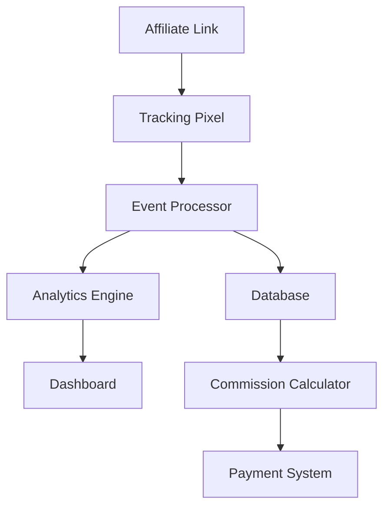

# 🛠️ **GUÍA DE IMPLEMENTACIÓN TÉCNICA - PROGRAMA DE AFILIADOS**

## 🎯 **ARQUITECTURA TÉCNICA**

### **Stack Tecnológico**

**Frontend:**
- **Framework:** React.js 18+
- **Styling:** Tailwind CSS
- **State Management:** Redux Toolkit
- **Routing:** React Router v6
- **UI Components:** Headless UI + Custom Components

**Backend:**
- **Runtime:** Node.js 18+
- **Framework:** Express.js
- **Database:** PostgreSQL 14+
- **ORM:** Prisma
- **Authentication:** JWT + Passport.js
- **API:** RESTful + GraphQL

**Infrastructure:**
- **Cloud Provider:** AWS
- **Containerization:** Docker
- **Orchestration:** Kubernetes
- **CDN:** CloudFront
- **Monitoring:** DataDog
- **Logging:** ELK Stack

---

## 📊 **SISTEMA DE TRACKING**

### **Arquitectura de Tracking**



### **Componentes del Sistema**

**1. Link Generator**
```javascript
// Generación de links de afiliado
const generateAffiliateLink = (affiliateId, campaignId, productId) => {
  const baseUrl = process.env.BASE_URL;
  const trackingParams = {
    aff: affiliateId,
    camp: campaignId,
    prod: productId,
    timestamp: Date.now()
  };
  
  return `${baseUrl}/track?${new URLSearchParams(trackingParams)}`;
};
```

**2. Event Tracking**
```javascript
// Tracking de eventos
const trackEvent = async (eventType, data) => {
  const event = {
    id: generateUUID(),
    type: eventType,
    data: data,
    timestamp: new Date(),
    ip: req.ip,
    userAgent: req.headers['user-agent']
  };
  
  await eventProcessor.process(event);
  await analyticsEngine.record(event);
};
```

**3. Commission Calculator**
```javascript
// Cálculo de comisiones
const calculateCommission = (sale, affiliate) => {
  const product = await getProduct(sale.productId);
  const tier = await getAffiliateTier(affiliate.id);
  
  let commission = 0;
  
  // Comisión base
  if (product.type === 'course') {
    commission = product.price * 0.50; // 50%
  } else if (product.type === 'saas') {
    commission = product.price * (0.40 + (tier.bonus / 100));
  }
  
  // Bonificaciones por volumen
  const monthlySales = await getMonthlySales(affiliate.id);
  if (monthlySales >= 100) {
    commission += 2500; // Bonus $2,500
  } else if (monthlySales >= 50) {
    commission += 1000; // Bonus $1,000
  }
  
  return commission;
};
```

---

## 🗄️ **BASE DE DATOS**

### **Esquema de Base de Datos**

```sql
-- Tabla de Afiliados
CREATE TABLE affiliates (
  id UUID PRIMARY KEY DEFAULT gen_random_uuid(),
  email VARCHAR(255) UNIQUE NOT NULL,
  name VARCHAR(255) NOT NULL,
  company VARCHAR(255),
  tier VARCHAR(50) DEFAULT 'bronze',
  status VARCHAR(50) DEFAULT 'active',
  created_at TIMESTAMP DEFAULT NOW(),
  updated_at TIMESTAMP DEFAULT NOW()
);

-- Tabla de Productos
CREATE TABLE products (
  id UUID PRIMARY KEY DEFAULT gen_random_uuid(),
  name VARCHAR(255) NOT NULL,
  type VARCHAR(50) NOT NULL, -- 'course' or 'saas'
  price DECIMAL(10,2) NOT NULL,
  commission_rate DECIMAL(5,2) NOT NULL,
  status VARCHAR(50) DEFAULT 'active',
  created_at TIMESTAMP DEFAULT NOW()
);

-- Tabla de Ventas
CREATE TABLE sales (
  id UUID PRIMARY KEY DEFAULT gen_random_uuid(),
  affiliate_id UUID REFERENCES affiliates(id),
  product_id UUID REFERENCES products(id),
  customer_email VARCHAR(255) NOT NULL,
  amount DECIMAL(10,2) NOT NULL,
  commission DECIMAL(10,2) NOT NULL,
  status VARCHAR(50) DEFAULT 'pending',
  created_at TIMESTAMP DEFAULT NOW()
);

-- Tabla de Eventos de Tracking
CREATE TABLE tracking_events (
  id UUID PRIMARY KEY DEFAULT gen_random_uuid(),
  affiliate_id UUID REFERENCES affiliates(id),
  event_type VARCHAR(100) NOT NULL,
  event_data JSONB,
  ip_address INET,
  user_agent TEXT,
  created_at TIMESTAMP DEFAULT NOW()
);
```

### **Índices de Performance**

```sql
-- Índices para optimización
CREATE INDEX idx_affiliates_email ON affiliates(email);
CREATE INDEX idx_affiliates_tier ON affiliates(tier);
CREATE INDEX idx_sales_affiliate_id ON sales(affiliate_id);
CREATE INDEX idx_sales_created_at ON sales(created_at);
CREATE INDEX idx_tracking_events_affiliate_id ON tracking_events(affiliate_id);
CREATE INDEX idx_tracking_events_created_at ON tracking_events(created_at);
```

---

## 🔐 **AUTENTICACIÓN Y SEGURIDAD**

### **Sistema de Autenticación**

```javascript
// JWT Authentication
const jwt = require('jsonwebtoken');

const generateToken = (affiliate) => {
  return jwt.sign(
    { 
      id: affiliate.id, 
      email: affiliate.email,
      tier: affiliate.tier 
    },
    process.env.JWT_SECRET,
    { expiresIn: '24h' }
  );
};

const verifyToken = (token) => {
  return jwt.verify(token, process.env.JWT_SECRET);
};

// Middleware de autenticación
const authenticateAffiliate = async (req, res, next) => {
  try {
    const token = req.headers.authorization?.split(' ')[1];
    if (!token) {
      return res.status(401).json({ error: 'Token requerido' });
    }
    
    const decoded = verifyToken(token);
    const affiliate = await getAffiliateById(decoded.id);
    
    if (!affiliate) {
      return res.status(401).json({ error: 'Afiliado no encontrado' });
    }
    
    req.affiliate = affiliate;
    next();
  } catch (error) {
    return res.status(401).json({ error: 'Token inválido' });
  }
};
```

### **Seguridad de Links**

```javascript
// Validación de links de afiliado
const validateAffiliateLink = (req, res, next) => {
  const { aff, camp, prod } = req.query;
  
  // Validar que el afiliado existe y está activo
  if (!aff || !isValidUUID(aff)) {
    return res.status(400).json({ error: 'Link de afiliado inválido' });
  }
  
  // Validar que la campaña existe
  if (!camp || !isValidUUID(camp)) {
    return res.status(400).json({ error: 'Campaña inválida' });
  }
  
  // Validar que el producto existe
  if (!prod || !isValidUUID(prod)) {
    return res.status(400).json({ error: 'Producto inválido' });
  }
  
  next();
};
```

---

## 📈 **ANALYTICS Y REPORTING**

### **Sistema de Analytics**

```javascript
// Analytics Engine
class AnalyticsEngine {
  async recordEvent(event) {
    // Guardar evento en base de datos
    await this.saveEvent(event);
    
    // Procesar en tiempo real
    await this.processRealTime(event);
    
    // Actualizar métricas agregadas
    await this.updateAggregatedMetrics(event);
  }
  
  async getAffiliateMetrics(affiliateId, period) {
    const metrics = await db.query(`
      SELECT 
        COUNT(*) as total_clicks,
        COUNT(DISTINCT customer_email) as unique_visitors,
        SUM(CASE WHEN status = 'completed' THEN 1 ELSE 0 END) as conversions,
        SUM(CASE WHEN status = 'completed' THEN amount ELSE 0 END) as revenue,
        SUM(CASE WHEN status = 'completed' THEN commission ELSE 0 END) as commissions
      FROM sales 
      WHERE affiliate_id = $1 
      AND created_at >= $2
    `, [affiliateId, period.start]);
    
    return metrics.rows[0];
  }
}
```

### **Dashboard en Tiempo Real**

```javascript
// WebSocket para updates en tiempo real
const io = require('socket.io')(server);

io.on('connection', (socket) => {
  socket.on('join_affiliate_room', (affiliateId) => {
    socket.join(`affiliate_${affiliateId}`);
  });
  
  socket.on('disconnect', () => {
    console.log('Cliente desconectado');
  });
});

// Emitir updates de métricas
const emitMetricsUpdate = (affiliateId, metrics) => {
  io.to(`affiliate_${affiliateId}`).emit('metrics_update', metrics);
};
```

---

## 💳 **SISTEMA DE PAGOS**

### **Integración con Stripe**

```javascript
// Configuración de Stripe
const stripe = require('stripe')(process.env.STRIPE_SECRET_KEY);

// Crear transferencia a afiliado
const createAffiliatePayout = async (affiliateId, amount) => {
  const affiliate = await getAffiliateById(affiliateId);
  
  if (!affiliate.stripe_account_id) {
    throw new Error('Afiliado no tiene cuenta de Stripe configurada');
  }
  
  const transfer = await stripe.transfers.create({
    amount: Math.round(amount * 100), // Convertir a centavos
    currency: 'usd',
    destination: affiliate.stripe_account_id,
    metadata: {
      affiliate_id: affiliateId,
      type: 'commission_payout'
    }
  });
  
  return transfer;
};
```

### **Programación de Pagos**

```javascript
// Cron job para pagos mensuales
const cron = require('node-cron');

cron.schedule('0 0 1 * *', async () => {
  console.log('Ejecutando pagos mensuales...');
  
  const affiliates = await getActiveAffiliates();
  
  for (const affiliate of affiliates) {
    const pendingCommissions = await getPendingCommissions(affiliate.id);
    
    if (pendingCommissions.length > 0) {
      const totalAmount = pendingCommissions.reduce((sum, comm) => sum + comm.amount, 0);
      
      try {
        await createAffiliatePayout(affiliate.id, totalAmount);
        await markCommissionsAsPaid(pendingCommissions);
        
        // Enviar email de confirmación
        await sendPayoutConfirmation(affiliate, totalAmount);
        
      } catch (error) {
        console.error(`Error procesando pago para afiliado ${affiliate.id}:`, error);
      }
    }
  }
});
```

---

## 🔄 **AUTOMATIZACIÓN**

### **Workflows Automatizados**

```javascript
// Workflow de onboarding
const onboardingWorkflow = {
  async execute(affiliateId) {
    const affiliate = await getAffiliateById(affiliateId);
    
    // 1. Enviar email de bienvenida
    await emailService.sendWelcomeEmail(affiliate);
    
    // 2. Crear cuenta en dashboard
    await createDashboardAccount(affiliate);
    
    // 3. Enviar materiales de marketing
    await sendMarketingMaterials(affiliate);
    
    // 4. Programar llamada de onboarding
    await scheduleOnboardingCall(affiliate);
    
    // 5. Agregar a secuencia de email
    await addToEmailSequence(affiliate, 'onboarding');
  }
};

// Workflow de conversión
const conversionWorkflow = {
  async execute(saleId) {
    const sale = await getSaleById(saleId);
    const affiliate = await getAffiliateById(sale.affiliate_id);
    
    // 1. Calcular comisión
    const commission = await calculateCommission(sale);
    
    // 2. Actualizar métricas
    await updateAffiliateMetrics(affiliate.id, sale);
    
    // 3. Enviar notificación
    await notifyAffiliate(affiliate, sale, commission);
    
    // 4. Actualizar tier si aplica
    await checkTierUpgrade(affiliate.id);
    
    // 5. Enviar materiales de seguimiento
    await sendFollowUpMaterials(affiliate, sale);
  }
};
```

### **Sistema de Notificaciones**

```javascript
// Sistema de notificaciones
class NotificationService {
  async sendNotification(affiliateId, type, data) {
    const affiliate = await getAffiliateById(affiliateId);
    
    switch (type) {
      case 'new_sale':
        await this.sendNewSaleNotification(affiliate, data);
        break;
      case 'tier_upgrade':
        await this.sendTierUpgradeNotification(affiliate, data);
        break;
      case 'payout_processed':
        await this.sendPayoutNotification(affiliate, data);
        break;
      default:
        console.log(`Tipo de notificación no reconocido: ${type}`);
    }
  }
  
  async sendNewSaleNotification(affiliate, sale) {
    const emailData = {
      to: affiliate.email,
      subject: '¡Nueva venta registrada!',
      template: 'new_sale',
      data: {
        affiliateName: affiliate.name,
        saleAmount: sale.amount,
        commission: sale.commission,
        productName: sale.product.name
      }
    };
    
    await emailService.send(emailData);
  }
}
```

---

## 📊 **MONITOREO Y LOGGING**

### **Sistema de Monitoreo**

```javascript
// Configuración de DataDog
const tracer = require('dd-trace').init({
  service: 'affiliate-program',
  env: process.env.NODE_ENV,
  version: process.env.APP_VERSION
});

// Middleware de logging
const loggingMiddleware = (req, res, next) => {
  const start = Date.now();
  
  res.on('finish', () => {
    const duration = Date.now() - start;
    
    logger.info('HTTP Request', {
      method: req.method,
      url: req.url,
      status: res.statusCode,
      duration: duration,
      ip: req.ip,
      userAgent: req.headers['user-agent']
    });
  });
  
  next();
};
```

### **Health Checks**

```javascript
// Health check endpoint
app.get('/health', async (req, res) => {
  const health = {
    status: 'healthy',
    timestamp: new Date().toISOString(),
    services: {}
  };
  
  // Check database
  try {
    await db.query('SELECT 1');
    health.services.database = 'healthy';
  } catch (error) {
    health.services.database = 'unhealthy';
    health.status = 'unhealthy';
  }
  
  // Check Redis
  try {
    await redis.ping();
    health.services.redis = 'healthy';
  } catch (error) {
    health.services.redis = 'unhealthy';
    health.status = 'unhealthy';
  }
  
  res.status(health.status === 'healthy' ? 200 : 503).json(health);
});
```

---

## 🚀 **DEPLOYMENT Y CI/CD**

### **Docker Configuration**

```dockerfile
# Dockerfile
FROM node:18-alpine

WORKDIR /app

COPY package*.json ./
RUN npm ci --only=production

COPY . .

RUN npm run build

EXPOSE 3000

CMD ["npm", "start"]
```

### **Kubernetes Deployment**

```yaml
# k8s-deployment.yaml
apiVersion: apps/v1
kind: Deployment
metadata:
  name: affiliate-program
spec:
  replicas: 3
  selector:
    matchLabels:
      app: affiliate-program
  template:
    metadata:
      labels:
        app: affiliate-program
    spec:
      containers:
      - name: affiliate-program
        image: affiliate-program:latest
        ports:
        - containerPort: 3000
        env:
        - name: NODE_ENV
          value: "production"
        - name: DATABASE_URL
          valueFrom:
            secretKeyRef:
              name: db-secret
              key: url
        resources:
          requests:
            memory: "256Mi"
            cpu: "250m"
          limits:
            memory: "512Mi"
            cpu: "500m"
```

### **CI/CD Pipeline**

```yaml
# .github/workflows/deploy.yml
name: Deploy to Production

on:
  push:
    branches: [main]

jobs:
  test:
    runs-on: ubuntu-latest
    steps:
    - uses: actions/checkout@v2
    - name: Setup Node.js
      uses: actions/setup-node@v2
      with:
        node-version: '18'
    - name: Install dependencies
      run: npm ci
    - name: Run tests
      run: npm test
    - name: Run linting
      run: npm run lint

  deploy:
    needs: test
    runs-on: ubuntu-latest
    steps:
    - uses: actions/checkout@v2
    - name: Build Docker image
      run: docker build -t affiliate-program:${{ github.sha }} .
    - name: Deploy to Kubernetes
      run: kubectl set image deployment/affiliate-program affiliate-program=affiliate-program:${{ github.sha }}
```

---

## 📋 **CHECKLIST DE IMPLEMENTACIÓN**

### **Fase 1: Setup Inicial**
- [ ] Configurar base de datos PostgreSQL
- [ ] Configurar Redis para cache
- [ ] Configurar Stripe para pagos
- [ ] Configurar email service
- [ ] Configurar monitoreo (DataDog)
- [ ] Configurar logging (ELK Stack)

### **Fase 2: Desarrollo Core**
- [ ] Implementar sistema de autenticación
- [ ] Implementar sistema de tracking
- [ ] Implementar calculadora de comisiones
- [ ] Implementar dashboard de afiliados
- [ ] Implementar sistema de pagos
- [ ] Implementar sistema de notificaciones

### **Fase 3: Testing y QA**
- [ ] Tests unitarios
- [ ] Tests de integración
- [ ] Tests de performance
- [ ] Tests de seguridad
- [ ] Tests de carga
- [ ] Tests de UI/UX

### **Fase 4: Deployment**
- [ ] Configurar Docker
- [ ] Configurar Kubernetes
- [ ] Configurar CI/CD
- [ ] Configurar monitoreo
- [ ] Configurar backups
- [ ] Configurar SSL/TLS

### **Fase 5: Go-Live**
- [ ] Deploy a producción
- [ ] Configurar DNS
- [ ] Configurar CDN
- [ ] Configurar monitoring
- [ ] Configurar alertas
- [ ] Documentación final

---

## 🎯 **PRÓXIMOS PASOS**

### **Implementación Inmediata**
1. **Configurar entorno** de desarrollo
2. **Implementar base** de datos
3. **Desarrollar API** core
4. **Implementar frontend** básico
5. **Configurar testing** automatizado

### **Desarrollo Iterativo**
1. **Sprint 1:** Autenticación y usuarios
2. **Sprint 2:** Sistema de tracking
3. **Sprint 3:** Dashboard de afiliados
4. **Sprint 4:** Sistema de pagos
5. **Sprint 5:** Analytics y reporting

---

*"La implementación técnica sólida es la base del éxito del programa de afiliados. Cada componente debe ser robusto, escalable y mantenible."* 🛠️
