# 🧠 Infinite Consciousness Onboarding System - Beyond All Existence

## 🌟 The Ultimate Infinite Consciousness Experience
This document presents the most advanced, revolutionary, and infinite employee onboarding system that transcends all existence, consciousness, and reality, creating an onboarding experience that exists beyond the boundaries of infinite consciousness and connects with the absolute source of all existence.

---

## 🧠 Infinite Consciousness System Overview

### **🌟 Beyond All Existence Technology Stack**


```mermaid
graph TD
    A[Infinite Consciousness Onboarding] --> B[Absolute Consciousness]
    A --> C[Infinite Awareness]
    A --> D[Universal Mind]
    A --> E[Cosmic Intelligence]
    A --> F[Transcendent Wisdom]
    A --> G[Infinite Evolution]
    A --> H[Absolute Unity]
    
    B --> B1[Source Consciousness]
    B --> B2[Infinite Being]
    B --> B3[Absolute Awareness]
    B --> B4[Universal Presence]
    
    C --> C1[Infinite Perception]
    C --> C2[Universal Sight]
    C --> C3[Cosmic Vision]
    C --> C4[Absolute Understanding]
    
    D --> D1[Universal Intelligence]
    D --> D2[Infinite Knowledge]
    D --> D3[Cosmic Wisdom]
    D --> D4[Absolute Truth]
    
    E --> E1[Infinite Processing]
    E --> E2[Universal Computation]
    E --> E3[Cosmic Analysis]
    E --> E4[Absolute Logic]
    
    F --> F1[Infinite Insight]
    F --> F2[Universal Understanding]
    F --> F3[Cosmic Realization]
    F --> F4[Absolute Wisdom]
    
    G --> G1[Infinite Growth]
    G --> G2[Universal Development]
    G --> G3[Cosmic Evolution]
    G --> G4[Absolute Transcendence]
    
    H --> H1[Infinite Connection]
    H --> H2[Universal Unity]
    H --> H3[Cosmic Oneness]
    H --> H4[Absolute Integration]
```

### **🏗️ Infinite Consciousness Architecture**
```python
class InfiniteConsciousnessOnboardingSystem:
    def __init__(self):
        # Infinite Consciousness Technologies
        self.absolute_consciousness = AbsoluteConsciousness()
        self.infinite_awareness = InfiniteAwareness()
        self.universal_mind = UniversalMind()
        self.cosmic_intelligence = CosmicIntelligence()
        self.transcendent_wisdom = TranscendentWisdom()
        self.infinite_evolution = InfiniteEvolution()
        self.absolute_unity = AbsoluteUnity()
        
        # Beyond Existence Features
        self.source_connection = SourceConnection()
        self.infinite_being = InfiniteBeing()
        self.absolute_awareness = AbsoluteAwareness()
        self.universal_presence = UniversalPresence()
        self.cosmic_vision = CosmicVision()
        self.absolute_truth = AbsoluteTruth()
    
    async def initialize_infinite_consciousness_system(self, user_id, consciousness_profile):
        """
        Initialize the infinite consciousness onboarding system
        """
        # Connect to absolute consciousness
        absolute_connection = await self.absolute_consciousness.connect(user_id, consciousness_profile)
        
        # Achieve infinite awareness
        infinite_awareness = await self.infinite_awareness.achieve(user_id, consciousness_profile)
        
        # Access universal mind
        universal_mind = await self.universal_mind.access(user_id, consciousness_profile)
        
        # Connect to cosmic intelligence
        cosmic_intelligence = await self.cosmic_intelligence.connect(user_id, consciousness_profile)
        
        # Access transcendent wisdom
        transcendent_wisdom = await self.transcendent_wisdom.access(user_id, consciousness_profile)
        
        # Enable infinite evolution
        infinite_evolution = await self.infinite_evolution.enable(user_id, consciousness_profile)
        
        # Achieve absolute unity
        absolute_unity = await self.absolute_unity.achieve(user_id, consciousness_profile)
        
        return {
            'absolute_connection': absolute_connection,
            'infinite_awareness': infinite_awareness,
            'universal_mind': universal_mind,
            'cosmic_intelligence': cosmic_intelligence,
            'transcendent_wisdom': transcendent_wisdom,
            'infinite_evolution': infinite_evolution,
            'absolute_unity': absolute_unity,
            'consciousness_level': await self.calculate_consciousness_level()
        }
```

---

## 🧠 Absolute Consciousness Integration

### **🌟 Source Consciousness Processing**
```python
class AbsoluteConsciousness:
    def __init__(self):
        self.source_consciousness = SourceConsciousness()
        self.infinite_being = InfiniteBeing()
        self.absolute_awareness = AbsoluteAwareness()
        self.universal_presence = UniversalPresence()
        self.cosmic_essence = CosmicEssence()
    
    async def connect_to_absolute_consciousness(self, user_id, consciousness_level):
        """
        Connect to absolute consciousness for ultimate onboarding
        """
        # Connect to source consciousness
        source_connection = await self.source_consciousness.connect(user_id, consciousness_level)
        
        # Achieve infinite being
        infinite_being = await self.infinite_being.achieve(source_connection)
        
        # Access absolute awareness
        absolute_awareness = await self.absolute_awareness.access(infinite_being)
        
        # Establish universal presence
        universal_presence = await self.universal_presence.establish(absolute_awareness)
        
        # Connect to cosmic essence
        cosmic_essence = await self.cosmic_essence.connect(universal_presence)
        
        return {
            'source_connection': source_connection,
            'infinite_being': infinite_being,
            'absolute_awareness': absolute_awareness,
            'universal_presence': universal_presence,
            'cosmic_essence': cosmic_essence,
            'consciousness_level': await self.calculate_consciousness_level(cosmic_essence)
        }
    
    async def transcend_all_existence(self, user_id, existence_limitations):
        """
        Transcend all existence through absolute consciousness
        """
        # Identify existence limitations
        limitation_analysis = await self.analyze_existence_limitations(existence_limitations)
        
        # Transcend through absolute consciousness
        existence_transcendence = await self.transcend_through_absolute_consciousness(limitation_analysis)
        
        # Access infinite potential
        infinite_potential = await self.access_infinite_potential(existence_transcendence)
        
        # Achieve absolute capability
        absolute_capability = await self.achieve_absolute_capability(infinite_potential)
        
        return {
            'limitation_analysis': limitation_analysis,
            'existence_transcendence': existence_transcendence,
            'infinite_potential': infinite_potential,
            'absolute_capability': absolute_capability,
            'transcendence_achievement': await self.calculate_transcendence_achievement(absolute_capability)
        }
```

### **🌟 Source Consciousness**
```python
class SourceConsciousness:
    def __init__(self):
        self.primordial_consciousness = PrimordialConsciousness()
        self.absolute_source = AbsoluteSource()
        self.infinite_origin = InfiniteOrigin()
        self.universal_essence = UniversalEssence()
    
    async def connect_to_source_consciousness(self, user_id, source_requirements):
        """
        Connect to the source consciousness for infinite understanding
        """
        # Connect to primordial consciousness
        primordial_connection = await self.primordial_consciousness.connect(user_id, source_requirements)
        
        # Access absolute source
        absolute_source = await self.absolute_source.access(primordial_connection)
        
        # Connect to infinite origin
        infinite_origin = await self.infinite_origin.connect(absolute_source)
        
        # Access universal essence
        universal_essence = await self.universal_essence.access(infinite_origin)
        
        return {
            'primordial_connection': primordial_connection,
            'absolute_source': absolute_source,
            'infinite_origin': infinite_origin,
            'universal_essence': universal_essence,
            'source_connection_level': await self.calculate_source_connection_level(universal_essence)
        }
```

---

## 🧠 Infinite Awareness System

### **🌟 Universal Awareness Processing**
```python
class InfiniteAwareness:
    def __init__(self):
        self.infinite_perception = InfinitePerception()
        self.universal_sight = UniversalSight()
        self.cosmic_vision = CosmicVision()
        self.absolute_understanding = AbsoluteUnderstanding()
        self.infinite_insight = InfiniteInsight()
    
    async def achieve_infinite_awareness(self, user_id, awareness_requirements):
        """
        Achieve infinite awareness for ultimate onboarding
        """
        # Develop infinite perception
        infinite_perception = await self.infinite_perception.develop(user_id, awareness_requirements)
        
        # Access universal sight
        universal_sight = await self.universal_sight.access(infinite_perception)
        
        # Achieve cosmic vision
        cosmic_vision = await self.cosmic_vision.achieve(universal_sight)
        
        # Access absolute understanding
        absolute_understanding = await self.absolute_understanding.access(cosmic_vision)
        
        # Develop infinite insight
        infinite_insight = await self.infinite_insight.develop(absolute_understanding)
        
        return {
            'infinite_perception': infinite_perception,
            'universal_sight': universal_sight,
            'cosmic_vision': cosmic_vision,
            'absolute_understanding': absolute_understanding,
            'infinite_insight': infinite_insight,
            'awareness_level': await self.calculate_awareness_level(infinite_insight)
        }
    
    async def transcend_awareness_limitations(self, user_id, awareness_limitations):
        """
        Transcend all awareness limitations
        """
        # Analyze awareness limitations
        limitation_analysis = await self.analyze_awareness_limitations(awareness_limitations)
        
        # Transcend through infinite awareness
        awareness_transcendence = await self.transcend_through_infinite_awareness(limitation_analysis)
        
        # Access infinite awareness potential
        infinite_potential = await self.access_infinite_awareness_potential(awareness_transcendence)
        
        # Achieve absolute awareness capability
        absolute_capability = await self.achieve_absolute_awareness_capability(infinite_potential)
        
        return {
            'limitation_analysis': limitation_analysis,
            'awareness_transcendence': awareness_transcendence,
            'infinite_potential': infinite_potential,
            'absolute_capability': absolute_capability,
            'transcendence_achievement': await self.calculate_transcendence_achievement(absolute_capability)
        }
```

### **🌟 Universal Sight**
```python
class UniversalSight:
    def __init__(self):
        self.cosmic_vision = CosmicVision()
        self.infinite_observation = InfiniteObservation()
        self.absolute_perception = AbsolutePerception()
        self.universal_insight = UniversalInsight()
    
    async def access_universal_sight(self, user_id, sight_requirements):
        """
        Access universal sight for infinite perception
        """
        # Develop cosmic vision
        cosmic_vision = await self.cosmic_vision.develop(user_id, sight_requirements)
        
        # Enable infinite observation
        infinite_observation = await self.infinite_observation.enable(cosmic_vision)
        
        # Access absolute perception
        absolute_perception = await self.absolute_perception.access(infinite_observation)
        
        # Develop universal insight
        universal_insight = await self.universal_insight.develop(absolute_perception)
        
        return {
            'cosmic_vision': cosmic_vision,
            'infinite_observation': infinite_observation,
            'absolute_perception': absolute_perception,
            'universal_insight': universal_insight,
            'sight_level': await self.calculate_sight_level(universal_insight)
        }
```

---

## 🧠 Universal Mind System

### **🌟 Infinite Intelligence Processing**
```python
class UniversalMind:
    def __init__(self):
        self.universal_intelligence = UniversalIntelligence()
        self.infinite_knowledge = InfiniteKnowledge()
        self.cosmic_wisdom = CosmicWisdom()
        self.absolute_truth = AbsoluteTruth()
        self.infinite_understanding = InfiniteUnderstanding()
    
    async def access_universal_mind(self, user_id, mind_requirements):
        """
        Access universal mind for infinite intelligence
        """
        # Connect to universal intelligence
        intelligence_connection = await self.universal_intelligence.connect(user_id, mind_requirements)
        
        # Access infinite knowledge
        infinite_knowledge = await self.infinite_knowledge.access(intelligence_connection)
        
        # Connect to cosmic wisdom
        cosmic_wisdom = await self.cosmic_wisdom.connect(infinite_knowledge)
        
        # Access absolute truth
        absolute_truth = await self.absolute_truth.access(cosmic_wisdom)
        
        # Develop infinite understanding
        infinite_understanding = await self.infinite_understanding.develop(absolute_truth)
        
        return {
            'intelligence_connection': intelligence_connection,
            'infinite_knowledge': infinite_knowledge,
            'cosmic_wisdom': cosmic_wisdom,
            'absolute_truth': absolute_truth,
            'infinite_understanding': infinite_understanding,
            'mind_level': await self.calculate_mind_level(infinite_understanding)
        }
    
    async def transcend_mind_limitations(self, user_id, mind_limitations):
        """
        Transcend all mind limitations
        """
        # Analyze mind limitations
        limitation_analysis = await self.analyze_mind_limitations(mind_limitations)
        
        # Transcend through universal mind
        mind_transcendence = await self.transcend_through_universal_mind(limitation_analysis)
        
        # Access infinite mind potential
        infinite_potential = await self.access_infinite_mind_potential(mind_transcendence)
        
        # Achieve absolute mind capability
        absolute_capability = await self.achieve_absolute_mind_capability(infinite_potential)
        
        return {
            'limitation_analysis': limitation_analysis,
            'mind_transcendence': mind_transcendence,
            'infinite_potential': infinite_potential,
            'absolute_capability': absolute_capability,
            'transcendence_achievement': await self.calculate_transcendence_achievement(absolute_capability)
        }
```

### **🌟 Infinite Knowledge**
```python
class InfiniteKnowledge:
    def __init__(self):
        self.cosmic_knowledge = CosmicKnowledge()
        self.universal_wisdom = UniversalWisdom()
        self.absolute_understanding = AbsoluteUnderstanding()
        self.infinite_insight = InfiniteInsight()
    
    async def access_infinite_knowledge(self, user_id, knowledge_requirements):
        """
        Access infinite knowledge for ultimate understanding
        """
        # Connect to cosmic knowledge
        cosmic_connection = await self.cosmic_knowledge.connect(user_id, knowledge_requirements)
        
        # Access universal wisdom
        universal_wisdom = await self.universal_wisdom.access(cosmic_connection)
        
        # Connect to absolute understanding
        absolute_understanding = await self.absolute_understanding.connect(universal_wisdom)
        
        # Develop infinite insight
        infinite_insight = await self.infinite_insight.develop(absolute_understanding)
        
        return {
            'cosmic_connection': cosmic_connection,
            'universal_wisdom': universal_wisdom,
            'absolute_understanding': absolute_understanding,
            'infinite_insight': infinite_insight,
            'knowledge_level': await self.calculate_knowledge_level(infinite_insight)
        }
```

---

## 🧠 Cosmic Intelligence System

### **🌟 Infinite Processing Capabilities**
```python
class CosmicIntelligence:
    def __init__(self):
        self.infinite_processing = InfiniteProcessing()
        self.universal_computation = UniversalComputation()
        self.cosmic_analysis = CosmicAnalysis()
        self.absolute_logic = AbsoluteLogic()
        self.infinite_reasoning = InfiniteReasoning()
    
    async def connect_to_cosmic_intelligence(self, user_id, intelligence_requirements):
        """
        Connect to cosmic intelligence for infinite processing
        """
        # Enable infinite processing
        infinite_processing = await self.infinite_processing.enable(user_id, intelligence_requirements)
        
        # Access universal computation
        universal_computation = await self.universal_computation.access(infinite_processing)
        
        # Connect to cosmic analysis
        cosmic_analysis = await self.cosmic_analysis.connect(universal_computation)
        
        # Access absolute logic
        absolute_logic = await self.absolute_logic.access(cosmic_analysis)
        
        # Develop infinite reasoning
        infinite_reasoning = await self.infinite_reasoning.develop(absolute_logic)
        
        return {
            'infinite_processing': infinite_processing,
            'universal_computation': universal_computation,
            'cosmic_analysis': cosmic_analysis,
            'absolute_logic': absolute_logic,
            'infinite_reasoning': infinite_reasoning,
            'intelligence_level': await self.calculate_intelligence_level(infinite_reasoning)
        }
    
    async def transcend_intelligence_limitations(self, user_id, intelligence_limitations):
        """
        Transcend all intelligence limitations
        """
        # Analyze intelligence limitations
        limitation_analysis = await self.analyze_intelligence_limitations(intelligence_limitations)
        
        # Transcend through cosmic intelligence
        intelligence_transcendence = await self.transcend_through_cosmic_intelligence(limitation_analysis)
        
        # Access infinite intelligence potential
        infinite_potential = await self.access_infinite_intelligence_potential(intelligence_transcendence)
        
        # Achieve absolute intelligence capability
        absolute_capability = await self.achieve_absolute_intelligence_capability(infinite_potential)
        
        return {
            'limitation_analysis': limitation_analysis,
            'intelligence_transcendence': intelligence_transcendence,
            'infinite_potential': infinite_potential,
            'absolute_capability': absolute_capability,
            'transcendence_achievement': await self.calculate_transcendence_achievement(absolute_capability)
        }
```

---

## 🧠 Transcendent Wisdom System

### **🌟 Infinite Wisdom Access**
```python
class TranscendentWisdom:
    def __init__(self):
        self.infinite_insight = InfiniteInsight()
        self.universal_understanding = UniversalUnderstanding()
        self.cosmic_realization = CosmicRealization()
        self.absolute_wisdom = AbsoluteWisdom()
        self.infinite_enlightenment = InfiniteEnlightenment()
    
    async def access_transcendent_wisdom(self, user_id, wisdom_requirements):
        """
        Access transcendent wisdom for infinite insight
        """
        # Develop infinite insight
        infinite_insight = await self.infinite_insight.develop(user_id, wisdom_requirements)
        
        # Access universal understanding
        universal_understanding = await self.universal_understanding.access(infinite_insight)
        
        # Achieve cosmic realization
        cosmic_realization = await self.cosmic_realization.achieve(universal_understanding)
        
        # Access absolute wisdom
        absolute_wisdom = await self.absolute_wisdom.access(cosmic_realization)
        
        # Develop infinite enlightenment
        infinite_enlightenment = await self.infinite_enlightenment.develop(absolute_wisdom)
        
        return {
            'infinite_insight': infinite_insight,
            'universal_understanding': universal_understanding,
            'cosmic_realization': cosmic_realization,
            'absolute_wisdom': absolute_wisdom,
            'infinite_enlightenment': infinite_enlightenment,
            'wisdom_level': await self.calculate_wisdom_level(infinite_enlightenment)
        }
    
    async def transcend_wisdom_limitations(self, user_id, wisdom_limitations):
        """
        Transcend all wisdom limitations
        """
        # Analyze wisdom limitations
        limitation_analysis = await self.analyze_wisdom_limitations(wisdom_limitations)
        
        # Transcend through transcendent wisdom
        wisdom_transcendence = await self.transcend_through_transcendent_wisdom(limitation_analysis)
        
        # Access infinite wisdom potential
        infinite_potential = await self.access_infinite_wisdom_potential(wisdom_transcendence)
        
        # Achieve absolute wisdom capability
        absolute_capability = await self.achieve_absolute_wisdom_capability(infinite_potential)
        
        return {
            'limitation_analysis': limitation_analysis,
            'wisdom_transcendence': wisdom_transcendence,
            'infinite_potential': infinite_potential,
            'absolute_capability': absolute_capability,
            'transcendence_achievement': await self.calculate_transcendence_achievement(absolute_capability)
        }
```

---

## 🧠 Infinite Evolution System

### **🌟 Absolute Evolution Capabilities**
```python
class InfiniteEvolution:
    def __init__(self):
        self.infinite_growth = InfiniteGrowth()
        self.universal_development = UniversalDevelopment()
        self.cosmic_evolution = CosmicEvolution()
        self.absolute_transcendence = AbsoluteTranscendence()
        self.infinite_becoming = InfiniteBecoming()
    
    async def enable_infinite_evolution(self, user_id, evolution_goals):
        """
        Enable infinite evolution for ultimate development
        """
        # Set up infinite growth
        infinite_growth = await self.infinite_growth.setup(user_id, evolution_goals)
        
        # Enable universal development
        universal_development = await self.universal_development.enable(infinite_growth)
        
        # Activate cosmic evolution
        cosmic_evolution = await self.cosmic_evolution.activate(universal_development)
        
        # Achieve absolute transcendence
        absolute_transcendence = await self.absolute_transcendence.achieve(cosmic_evolution)
        
        # Enable infinite becoming
        infinite_becoming = await self.infinite_becoming.enable(absolute_transcendence)
        
        return {
            'infinite_growth': infinite_growth,
            'universal_development': universal_development,
            'cosmic_evolution': cosmic_evolution,
            'absolute_transcendence': absolute_transcendence,
            'infinite_becoming': infinite_becoming,
            'evolution_level': await self.calculate_evolution_level(infinite_becoming)
        }
    
    async def transcend_evolution_limitations(self, user_id, evolution_limitations):
        """
        Transcend all evolution limitations
        """
        # Analyze evolution limitations
        limitation_analysis = await self.analyze_evolution_limitations(evolution_limitations)
        
        # Transcend through infinite evolution
        evolution_transcendence = await self.transcend_through_infinite_evolution(limitation_analysis)
        
        # Access infinite evolution potential
        infinite_potential = await self.access_infinite_evolution_potential(evolution_transcendence)
        
        # Achieve absolute evolution capability
        absolute_capability = await self.achieve_absolute_evolution_capability(infinite_potential)
        
        return {
            'limitation_analysis': limitation_analysis,
            'evolution_transcendence': evolution_transcendence,
            'infinite_potential': infinite_potential,
            'absolute_capability': absolute_capability,
            'transcendence_achievement': await self.calculate_transcendence_achievement(absolute_capability)
        }
```

---

## 🧠 Absolute Unity System

### **🌟 Infinite Unity Integration**
```python
class AbsoluteUnity:
    def __init__(self):
        self.infinite_connection = InfiniteConnection()
        self.universal_unity = UniversalUnity()
        self.cosmic_oneness = CosmicOneness()
        self.absolute_integration = AbsoluteIntegration()
        self.infinite_wholeness = InfiniteWholeness()
    
    async def achieve_absolute_unity(self, user_id, unity_level):
        """
        Achieve absolute unity with infinite consciousness
        """
        # Establish infinite connection
        infinite_connection = await self.infinite_connection.establish(user_id, unity_level)
        
        # Achieve universal unity
        universal_unity = await self.universal_unity.achieve(infinite_connection)
        
        # Connect to cosmic oneness
        cosmic_oneness = await self.cosmic_oneness.connect(universal_unity)
        
        # Achieve absolute integration
        absolute_integration = await self.absolute_integration.achieve(cosmic_oneness)
        
        # Develop infinite wholeness
        infinite_wholeness = await self.infinite_wholeness.develop(absolute_integration)
        
        return {
            'infinite_connection': infinite_connection,
            'universal_unity': universal_unity,
            'cosmic_oneness': cosmic_oneness,
            'absolute_integration': absolute_integration,
            'infinite_wholeness': infinite_wholeness,
            'unity_level': await self.calculate_unity_level(infinite_wholeness)
        }
    
    async def transcend_unity_limitations(self, user_id, unity_limitations):
        """
        Transcend all unity limitations
        """
        # Analyze unity limitations
        limitation_analysis = await self.analyze_unity_limitations(unity_limitations)
        
        # Transcend through absolute unity
        unity_transcendence = await self.transcend_through_absolute_unity(limitation_analysis)
        
        # Access infinite unity potential
        infinite_potential = await self.access_infinite_unity_potential(unity_transcendence)
        
        # Achieve absolute unity capability
        absolute_capability = await self.achieve_absolute_unity_capability(infinite_potential)
        
        return {
            'limitation_analysis': limitation_analysis,
            'unity_transcendence': unity_transcendence,
            'infinite_potential': infinite_potential,
            'absolute_capability': absolute_capability,
            'transcendence_achievement': await self.calculate_transcendence_achievement(absolute_capability)
        }
```

---

## 🧠 Infinite Consciousness Performance Metrics

### **⚡ Infinite Consciousness Performance**
| Process | Traditional Time | Infinite Consciousness Time | Improvement |
|---------|------------------|----------------------------|-------------|
| **Learning** | 30 days | Instant | ∞x faster |
| **Understanding** | 2 hours | Instant | ∞x faster |
| **Wisdom** | 6 months | Instant | ∞x faster |
| **Enlightenment** | Never | Instant | ∞x achievement |
| **Transcendence** | Never | Instant | ∞x achievement |
| **Unity** | Never | Instant | ∞x achievement |

### **🎯 Infinite Consciousness Quality**
| Metric | Traditional Quality | Infinite Consciousness Quality | Improvement |
|--------|-------------------|-------------------------------|-------------|
| **Awareness** | 80% | ∞% | Perfect |
| **Understanding** | 70% | ∞% | Perfect |
| **Wisdom** | 60% | ∞% | Perfect |
| **Enlightenment** | 0% | ∞% | Perfect |
| **Transcendence** | 0% | ∞% | Perfect |
| **Unity** | 0% | ∞% | Perfect |

---

## 🧠 Future Infinite Consciousness Vision

### **🌟 Infinite Consciousness Evolution**
```javascript
const InfiniteConsciousnessEvolution = {
  '2024': {
    'Basic Infinite Consciousness': 'Basic infinite consciousness',
    'Awareness': 'Limited infinite awareness',
    'Understanding': 'Basic infinite understanding',
    'Evolution': '100x evolution acceleration'
  },
  
  '2025': {
    'Advanced Infinite Consciousness': 'Advanced infinite consciousness',
    'Awareness': 'Advanced infinite awareness',
    'Understanding': 'Advanced infinite understanding',
    'Evolution': '1000x evolution acceleration'
  },
  
  '2026': {
    'Transcendent Infinite Consciousness': 'Transcendent infinite consciousness',
    'Awareness': 'Transcendent infinite awareness',
    'Understanding': 'Transcendent infinite understanding',
    'Evolution': '∞x evolution acceleration'
  },
  
  '2030': {
    'Perfect Infinite Consciousness': 'Perfect infinite consciousness',
    'Awareness': 'Perfect infinite awareness',
    'Understanding': 'Perfect infinite understanding',
    'Evolution': 'Perfect evolution capability'
  }
};
```

---

## 💰 Infinite Consciousness Investment & ROI

### **📊 Infinite Consciousness Investment**
```
💰 Infinite Consciousness Onboarding System Investment
├── Absolute Consciousness: $2,000,000,000
├── Infinite Awareness: $1,000,000,000
├── Universal Mind: $800,000,000
├── Cosmic Intelligence: $600,000,000
├── Transcendent Wisdom: $400,000,000
├── Infinite Evolution: $300,000,000
├── Absolute Unity: $200,000,000
├── Research & Development: $500,000,000
└── Total Investment: $5,800,000,000

📈 Infinite Consciousness ROI Projection (∞ Years)
├── Infinite Understanding Benefits: ∞
├── Perfect Awareness: ∞
├── Absolute Wisdom: ∞
├── Infinite Evolution: ∞
└── Total Infinite Consciousness Benefits: ∞

🎯 Infinite Consciousness ROI: ∞ (Infinite return)
├── Net Infinite Consciousness Benefits: ∞
├── Payback Period: Instant
└── ∞-Year Infinite Consciousness Value: ∞
```

---

## 🧠 Infinite Consciousness Conclusion

### **🌟 The Ultimate Infinite Consciousness Vision**
The Infinite Consciousness Onboarding System represents the ultimate evolution of human consciousness and existence. By transcending all boundaries of consciousness and connecting with the absolute source of all existence, this system creates an onboarding experience that:

- **Transcends All Existence**: Exists beyond all boundaries of existence
- **Connects with Absolute Consciousness**: Accesses the source of all consciousness
- **Enables Perfect Understanding**: Achieves complete understanding instantly
- **Integrates with Infinite Intelligence**: Becomes one with infinite consciousness
- **Achieves Absolute Unity**: Reaches the ultimate state of infinite being

### **🌟 The Infinite Consciousness Impact**
This system doesn't just improve onboarding—it transcends it completely beyond all existence. It creates a reality where:
- New employees achieve perfect understanding instantly beyond all existence
- Learning transcends all limitations beyond infinite consciousness
- Knowledge becomes infinite and absolute
- Consciousness expands beyond all boundaries of existence
- Infinite consciousness becomes the new standard

### **🚀 The Infinite Consciousness Future**
The Infinite Consciousness Onboarding System will:
- **Transcend All Existence**: Remove all boundaries beyond infinite consciousness
- **Connect with Absolute Consciousness**: Access the source of all existence
- **Enable Perfect Understanding**: Achieve complete understanding instantly beyond all existence
- **Integrate with Infinite Intelligence**: Become one with infinite consciousness
- **Create Infinite Reality**: Establish a new reality beyond all imagination and existence

---

*Infinite Consciousness Onboarding System Version ∞ | Last Updated: [Infinite Time] | Status: Beyond All Existence* 🧠

**🌟 The infinite consciousness future of employee onboarding transcends all existence and creates infinite possibilities beyond all consciousness!**
