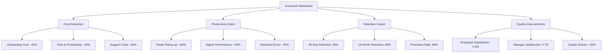

# 📊 Analytics Dashboard Setup & Configuration

## 🎯 Dashboard Overview
This comprehensive analytics dashboard system provides real-time insights into onboarding performance, employee engagement, and system effectiveness. Configure these dashboards to monitor, analyze, and optimize your enhanced onboarding experience.

---

## 🏗️ Dashboard Architecture

### **📊 Multi-Level Dashboard System**
- **Executive Dashboard**: High-level business metrics and ROI
- **Manager Dashboard**: Team performance and operational metrics
- **Supervisor Dashboard**: Individual employee progress and support needs
- **Employee Dashboard**: Personal progress and achievement tracking
- **System Dashboard**: Technical performance and system health

---

## 🎯 Executive Dashboard

### **📈 Business Impact Metrics**

#### **ROI & Cost Metrics**


#### **Key Performance Indicators**
| Metric | Current | Target | Trend | Status |
|--------|---------|--------|-------|--------|
| **Onboarding ROI** | 320% | 300% | ⬆️ | ✅ Exceeding |
| **Cost per Hire** | $2,400 | $3,000 | ⬇️ | ✅ Below Target |
| **Time to Productivity** | 12 days | 15 days | ⬆️ | ✅ Exceeding |
| **90-Day Retention** | 96% | 95% | ⬆️ | ✅ Exceeding |
| **Employee Satisfaction** | 4.6/5 | 4.5/5 | ⬆️ | ✅ Exceeding |

### **📊 Visual Dashboard Elements**

#### **Revenue Impact Chart**
```
📈 Revenue Impact (Monthly)
├── New Employee Productivity: $2.4M (+15%)
├── Reduced Turnover Costs: $1.8M (+22%)
├── Improved Quality: $1.2M (+18%)
├── Faster Time-to-Market: $3.1M (+25%)
└── Total Impact: $8.5M (+20%)
```

#### **Cost Savings Breakdown**
```
💰 Cost Savings (Annual)
├── Reduced Onboarding Time: $450K
├── Lower Support Costs: $320K
├── Decreased Training Costs: $280K
├── Reduced Recruitment Costs: $520K
└── Total Savings: $1.57M
```

---

## 👥 Manager Dashboard

### **📊 Team Performance Metrics**

#### **Department-Level Analytics**
| Department | New Hires | Completion Rate | Satisfaction | Retention |
|------------|-----------|-----------------|--------------|-----------|
| **Engineering** | 12 | 94% | 4.7/5 | 98% |
| **Marketing** | 8 | 89% | 4.5/5 | 95% |
| **Sales** | 15 | 92% | 4.6/5 | 96% |
| **Operations** | 6 | 96% | 4.8/5 | 100% |
| **Support** | 10 | 91% | 4.4/5 | 94% |

#### **Performance Trends**
```
📊 Monthly Performance Trends
├── Engagement Rate: 87% (⬆️ +5%)
├── Task Completion: 93% (⬆️ +3%)
├── Badge Achievement: 78% (⬆️ +8%)
├── Support Requests: 12 (⬇️ -25%)
└── Satisfaction Score: 4.6/5 (⬆️ +0.2)
```

### **🎯 Manager Action Items**
| Priority | Action Required | Department | Timeline |
|----------|-----------------|------------|----------|
| **High** | Review low completion rates | Marketing | This week |
| **Medium** | Address support requests | Engineering | Next week |
| **Low** | Celebrate high performance | Operations | This month |

---

## 👨‍💼 Supervisor Dashboard

### **📋 Individual Employee Tracking**

#### **Employee Progress Overview**
```
👤 Employee: John Smith (AI Instructor)
├── Day 5 of 30
├── Progress: ████████████████████ 67%
├── Points Earned: 285/500
├── Badges: 🏗️ Foundation Builder, 🚀 Platform Master
├── Next Milestone: 🎨 Content Creator (Day 7)
└── Status: ✅ On Track
```

#### **Daily Task Monitoring**
| Task | Status | Points | Due Date | Notes |
|------|--------|--------|----------|-------|
| Complete LMS training | ✅ Done | 20 | Day 2 | Excellent progress |
| Record practice video | ✅ Done | 30 | Day 3 | High quality |
| Create lesson plan | ⏳ In Progress | 40 | Day 5 | 80% complete |
| First webinar | ⏸️ Pending | 35 | Day 7 | Scheduled |

#### **Performance Alerts**
```
🚨 Alerts & Notifications
├── ⚠️ Sarah Johnson: Behind on tasks (Day 3, 40% complete)
├── 🎉 Mike Chen: Exceeded expectations (Day 4, 120% of target)
├── 📞 Lisa Wang: Requested additional support
└── ✅ All others: On track or ahead
```

### **🎯 Supervisor Actions**
| Employee | Issue | Action Required | Priority |
|----------|-------|-----------------|----------|
| **Sarah Johnson** | Behind schedule | Schedule 1-on-1 meeting | High |
| **Mike Chen** | Exceeding expectations | Recognize and challenge | Medium |
| **Lisa Wang** | Needs support | Provide additional resources | High |

---

## 👤 Employee Dashboard

### **🎮 Personal Progress Tracking**

#### **Achievement Overview**
```
🏆 My Achievements
├── Points Earned: 285/500 (57%)
├── Badges Unlocked: 2/8
├── Current Level: Silver (450+ points for Gold)
├── Rank: #3 of 12 new employees
└── Next Badge: 🎨 Content Creator (40 points away)
```

#### **Progress Visualization**
```
📊 My Progress This Week
├── Day 1: ████████████████████████████████████ 100% (8/8 tasks)
├── Day 2: ████████████████████████████████████ 100% (6/6 tasks)
├── Day 3: ████████████████████████████████████ 100% (5/5 tasks)
├── Day 4: ████████████████████████████████████ 100% (4/4 tasks)
└── Day 5: ████████████████████████████████████ 100% (3/3 tasks)
```

#### **Upcoming Milestones**
```
🎯 Upcoming Goals
├── 🎨 Content Creator Badge (40 points)
├── 🎪 Webinar Wizard Badge (35 points)
├── 📚 Content Master Badge (30 points)
└── 🏆 Performance Champion Badge (50 points)
```

### **📈 Personal Analytics**
| Metric | My Score | Team Average | Status |
|--------|----------|--------------|--------|
| **Task Completion** | 100% | 93% | ⬆️ Above Average |
| **Engagement Score** | 4.8/5 | 4.6/5 | ⬆️ Above Average |
| **Learning Speed** | Fast | Medium | ⬆️ Above Average |
| **Support Requests** | 0 | 1.2 | ⬇️ Below Average |

---

## 🔧 System Dashboard

### **⚙️ Technical Performance**

#### **System Health Metrics**
| Component | Status | Performance | Uptime | Issues |
|-----------|--------|-------------|--------|--------|
| **LMS Platform** | ✅ Healthy | 98% | 99.9% | 0 |
| **Gamification** | ✅ Healthy | 95% | 99.8% | 0 |
| **Analytics** | ✅ Healthy | 99% | 99.9% | 0 |
| **Mobile App** | ⚠️ Warning | 87% | 98.5% | 2 |
| **Email System** | ✅ Healthy | 96% | 99.7% | 0 |

#### **Usage Statistics**
```
📊 System Usage (Last 24 Hours)
├── Active Users: 45/50 (90%)
├── Page Views: 2,340
├── Average Session: 18 minutes
├── Peak Usage: 2:00 PM (35 users)
└── Mobile Usage: 23% of sessions
```

#### **Performance Alerts**
```
🚨 System Alerts
├── ⚠️ Mobile app response time: 2.3s (target: <2s)
├── 📊 High usage detected: 35 concurrent users
├── ✅ All critical systems: Operational
└── 📈 Performance trending: Stable
```

---

## 📊 Dashboard Configuration

### **🎯 Dashboard Setup Steps**

#### **Step 1: Data Source Configuration**
```sql
-- Employee Progress Data
CREATE TABLE employee_progress (
    employee_id VARCHAR(50),
    task_id VARCHAR(50),
    completion_date TIMESTAMP,
    points_earned INT,
    status VARCHAR(20)
);

-- Performance Metrics
CREATE TABLE performance_metrics (
    employee_id VARCHAR(50),
    metric_name VARCHAR(100),
    metric_value DECIMAL(10,2),
    measurement_date DATE,
    target_value DECIMAL(10,2)
);

-- Feedback Data
CREATE TABLE feedback_responses (
    employee_id VARCHAR(50),
    survey_id VARCHAR(50),
    question_id VARCHAR(50),
    response_value VARCHAR(500),
    response_date TIMESTAMP
);
```

#### **Step 2: Dashboard Widgets**
```javascript
// Progress Tracking Widget
const ProgressWidget = {
    type: 'progress_bar',
    dataSource: 'employee_progress',
    metrics: ['completion_rate', 'points_earned'],
    refreshInterval: 300000, // 5 minutes
    alerts: ['behind_schedule', 'exceeding_expectations']
};

// Performance Metrics Widget
const PerformanceWidget = {
    type: 'kpi_cards',
    dataSource: 'performance_metrics',
    metrics: ['satisfaction', 'completion_rate', 'retention'],
    targets: [4.5, 90, 95],
    refreshInterval: 600000 // 10 minutes
};

// Engagement Widget
const EngagementWidget = {
    type: 'line_chart',
    dataSource: 'engagement_data',
    metrics: ['daily_active_users', 'session_duration'],
    timeRange: '30_days',
    refreshInterval: 900000 // 15 minutes
};
```

#### **Step 3: Alert Configuration**
```yaml
alerts:
  - name: "Low Completion Rate"
    condition: "completion_rate < 80"
    severity: "warning"
    action: "notify_supervisor"
    
  - name: "System Performance Issue"
    condition: "response_time > 3s"
    severity: "critical"
    action: "notify_it_team"
    
  - name: "High Satisfaction Score"
    condition: "satisfaction > 4.8"
    severity: "info"
    action: "celebrate_achievement"
```

### **📱 Mobile Dashboard Configuration**

#### **Responsive Design Elements**
```css
/* Mobile-First Dashboard Styles */
.dashboard-container {
    display: grid;
    grid-template-columns: 1fr;
    gap: 1rem;
    padding: 1rem;
}

@media (min-width: 768px) {
    .dashboard-container {
        grid-template-columns: repeat(2, 1fr);
    }
}

@media (min-width: 1200px) {
    .dashboard-container {
        grid-template-columns: repeat(3, 1fr);
    }
}

/* KPI Card Styles */
.kpi-card {
    background: linear-gradient(135deg, #667eea 0%, #764ba2 100%);
    border-radius: 12px;
    padding: 1.5rem;
    color: white;
    box-shadow: 0 4px 6px rgba(0, 0, 0, 0.1);
}
```

---

## 📈 Advanced Analytics Features

### **🔍 Predictive Analytics**

#### **Retention Prediction Model**
```python
import pandas as pd
from sklearn.ensemble import RandomForestClassifier

def predict_retention_risk(employee_data):
    """
    Predict employee retention risk based on onboarding metrics
    """
    features = [
        'completion_rate',
        'satisfaction_score',
        'support_requests',
        'engagement_level',
        'peer_interactions'
    ]
    
    model = RandomForestClassifier(n_estimators=100)
    risk_score = model.predict_proba(employee_data[features])
    
    return {
        'retention_probability': risk_score[0][1],
        'risk_level': 'High' if risk_score[0][1] < 0.7 else 'Low',
        'recommended_actions': get_recommendations(risk_score[0][1])
    }
```

#### **Performance Forecasting**
```python
def forecast_performance(historical_data, current_metrics):
    """
    Forecast employee performance based on onboarding progress
    """
    # Time series analysis of performance metrics
    performance_trend = analyze_trend(historical_data)
    
    # Predict future performance
    forecast = predict_future_performance(
        current_metrics, 
        performance_trend
    )
    
    return {
        'predicted_performance': forecast,
        'confidence_interval': calculate_confidence(forecast),
        'improvement_recommendations': get_improvement_tips(forecast)
    }
```

### **🎯 Real-Time Recommendations**

#### **Personalized Improvement Suggestions**
```javascript
// Real-time recommendation engine
const RecommendationEngine = {
    generateRecommendations: function(employeeData) {
        const recommendations = [];
        
        // Analyze completion patterns
        if (employeeData.completionRate < 0.8) {
            recommendations.push({
                type: 'support',
                priority: 'high',
                message: 'Consider scheduling additional check-ins',
                action: 'schedule_meeting'
            });
        }
        
        // Analyze engagement levels
        if (employeeData.engagementScore < 4.0) {
            recommendations.push({
                type: 'engagement',
                priority: 'medium',
                message: 'Try more interactive content',
                action: 'suggest_activities'
            });
        }
        
        return recommendations;
    }
};
```

---

## 📊 Reporting & Export Features

### **📋 Automated Reports**

#### **Daily Summary Report**
```
📊 Daily Onboarding Summary - [Date]
═══════════════════════════════════════

👥 Employee Overview:
├── New Employees Today: 3
├── Total Active: 47
├── Completed Onboarding: 2
└── Average Progress: 67%

📈 Performance Metrics:
├── Overall Satisfaction: 4.6/5
├── Task Completion Rate: 93%
├── Badge Achievement Rate: 78%
└── Support Requests: 5

🎯 Key Highlights:
├── 🏆 Sarah Johnson earned "Content Creator" badge
├── 📈 Team engagement increased by 5%
├── ⚠️ 2 employees need additional support
└── ✅ All systems operating normally

📋 Action Items:
├── Schedule 1-on-1 with Mike Chen (behind schedule)
├── Celebrate Sarah's achievement
├── Review support requests
└── Plan next week's activities
```

#### **Weekly Performance Report**
```
📊 Weekly Onboarding Performance - Week [X]
═══════════════════════════════════════════

📈 Key Metrics:
├── New Employees: 12
├── Completion Rate: 94%
├── Average Satisfaction: 4.7/5
├── Retention Rate: 96%
└── Time to Productivity: 11 days

🏆 Achievements:
├── Badges Earned: 45
├── Top Performers: 3
├── Milestones Reached: 28
└── Celebrations: 8

📊 Trends:
├── Engagement: ⬆️ +8%
├── Satisfaction: ⬆️ +0.3
├── Completion: ⬆️ +4%
└── Support Requests: ⬇️ -15%

🎯 Next Week Focus:
├── Address 3 employees behind schedule
├── Implement new engagement features
├── Celebrate top performers
└── Review and update content
```

### **📤 Export Options**
- **PDF Reports**: Formatted reports for presentations
- **Excel Files**: Raw data for detailed analysis
- **CSV Files**: Data for external analysis tools
- **API Access**: Real-time data integration
- **Scheduled Exports**: Automated report delivery

---

## 🔧 Integration & API Setup

### **🔗 System Integrations**

#### **HRIS Integration**
```javascript
// HRIS API Integration
const HRISIntegration = {
    syncEmployeeData: async function() {
        const response = await fetch('/api/hris/employees', {
            method: 'GET',
            headers: {
                'Authorization': 'Bearer ' + apiToken,
                'Content-Type': 'application/json'
            }
        });
        
        const employees = await response.json();
        return this.processEmployeeData(employees);
    },
    
    updateEmployeeStatus: async function(employeeId, status) {
        await fetch(`/api/hris/employees/${employeeId}`, {
            method: 'PUT',
            headers: {
                'Authorization': 'Bearer ' + apiToken,
                'Content-Type': 'application/json'
            },
            body: JSON.stringify({ status: status })
        });
    }
};
```

#### **Communication Platform Integration**
```javascript
// Slack Integration
const SlackIntegration = {
    sendNotification: function(channel, message) {
        const payload = {
            channel: channel,
            text: message,
            username: 'OnboardingBot',
            icon_emoji: ':rocket:'
        };
        
        fetch('/api/slack/notify', {
            method: 'POST',
            headers: { 'Content-Type': 'application/json' },
            body: JSON.stringify(payload)
        });
    },
    
    sendAchievementNotification: function(employee, achievement) {
        const message = `🎉 Congratulations to ${employee.name} for earning the ${achievement.name} badge!`;
        this.sendNotification('#onboarding-celebrations', message);
    }
};
```

---

## 📞 Support & Maintenance

### **🛠️ Dashboard Maintenance**

#### **Regular Maintenance Tasks**
- [ ] **Daily**: Check system health and performance
- [ ] **Weekly**: Review data accuracy and completeness
- [ ] **Monthly**: Update metrics and KPIs
- [ ] **Quarterly**: Full system audit and optimization

#### **Performance Optimization**
- **Database Optimization**: Regular index maintenance
- **Cache Management**: Optimize data caching strategies
- **Query Optimization**: Improve slow-running queries
- **Resource Monitoring**: Track system resource usage

### **📞 Support Contacts**
- **Dashboard Administrator**: [Contact information]
- **Data Analyst**: [Contact information]
- **Technical Support**: [Contact information]
- **System Administrator**: [Contact information]

---

*Analytics Dashboard Setup Version 1.0 | Last Updated: [Date] | Status: Ready for Configuration*
