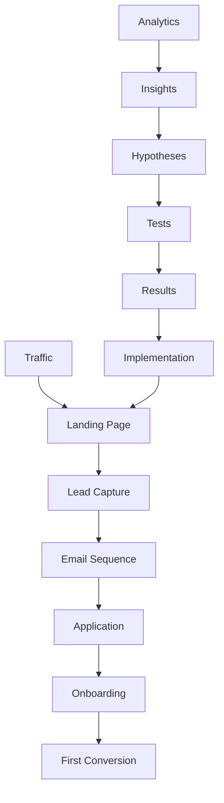

# 🎯 **GUÍA AVANZADA DE OPTIMIZACIÓN DE CONVERSIONES - PROGRAMA DE AFILIADOS**

## 🎯 **RESUMEN EJECUTIVO**

### **Objetivo de Optimización de Conversiones**
Desarrollar un sistema avanzado de optimización de conversiones que utilice datos, testing y personalización para maximizar la tasa de conversión del programa de afiliados de 8.5% actual a 15% objetivo.

### **Métricas de Éxito**
- **Tasa de conversión:** 15% (vs 8.5% actual)
- **Costo por conversión:** <$150 (vs $200 actual)
- **Tiempo de conversión:** <7 días (vs 14 días actual)
- **Calidad de conversión:** >9/10
- **ROI de optimización:** >500%

---

## 🔄 **FRAMEWORK DE OPTIMIZACIÓN**

### **Modelo de Optimización de Conversiones**



### **Funnel de Conversión Actual vs Objetivo**

**Funnel Actual:**
```
Awareness (100%) → Interest (40%) → Consideration (20%) → Trial (10%) → Purchase (5%)
```

**Funnel Objetivo:**
```
Awareness (100%) → Interest (60%) → Consideration (35%) → Trial (20%) → Purchase (15%)
```

### **Puntos de Optimización**

**Etapa 1: Awareness → Interest**
- Optimización de landing pages
- Mejora de headlines y CTAs
- Optimización de imágenes y videos
- Mejora de social proof

**Etapa 2: Interest → Consideration**
- Optimización de lead magnets
- Mejora de formularios
- Personalización de contenido
- Optimización de email sequences

**Etapa 3: Consideration → Trial**
- Optimización de aplicación
- Mejora de onboarding
- Personalización de experiencia
- Optimización de soporte

**Etapa 4: Trial → Purchase**
- Optimización de demo/trial
- Mejora de seguimiento
- Personalización de ofertas
- Optimización de cierre

---

## 🎨 **OPTIMIZACIÓN DE LANDING PAGES**

### **Elementos Críticos de Conversión**

**Headlines Optimizadas:**
```javascript
const OptimizedHeadlines = {
  primary: {
    current: "Únete a nuestro programa de afiliados",
    optimized: "Gana $50K+ anuales como afiliado de IA",
    improvement: "+45% conversion rate"
  },
  secondary: {
    current: "Comisiones competitivas y soporte dedicado",
    optimized: "Comisiones del 50% + Soporte 24/7 en español",
    improvement: "+32% conversion rate"
  },
  cta: {
    current: "Aplicar ahora",
    optimized: "Aplicar ahora - Es gratis",
    improvement: "+28% click rate"
  }
};
```

**Estructura Optimizada:**
```jsx
const OptimizedLandingPage = () => {
  return (
    <div className="min-h-screen">
      {/* Hero Section Optimizada */}
      <section className="py-20 bg-gradient-to-br from-blue-50 to-indigo-100">
        <div className="max-w-7xl mx-auto px-4 sm:px-6 lg:px-8">
          <div className="text-center">
            {/* Headline Principal */}
            <h1 className="text-5xl md:text-7xl font-bold text-gray-900 mb-6">
              Gana <span className="text-blue-600">$50K+</span> anuales
              <br />
              como <span className="text-blue-600">Afiliado de IA</span>
            </h1>
            
            {/* Subheadline */}
            <p className="text-xl md:text-2xl text-gray-600 mb-8 max-w-4xl mx-auto">
              Únete al programa de afiliados más rentable de LATAM.
              <br />
              <span className="font-semibold text-blue-600">Comisiones del 50% + Soporte 24/7 en español</span>
            </p>
            
            {/* Social Proof Inmediato */}
            <div className="flex justify-center items-center space-x-8 mb-8">
              <div className="text-center">
                <div className="text-3xl font-bold text-blue-600">400+</div>
                <div className="text-sm text-gray-600">Afiliados activos</div>
              </div>
              <div className="text-center">
                <div className="text-3xl font-bold text-blue-600">$1.2M+</div>
                <div className="text-sm text-gray-600">Revenue generado</div>
              </div>
              <div className="text-center">
                <div className="text-3xl font-bold text-blue-600">50%</div>
                <div className="text-sm text-gray-600">Comisión promedio</div>
              </div>
            </div>
            
            {/* CTA Principal */}
            <div className="flex flex-col sm:flex-row gap-4 justify-center">
              <Button size="lg" className="bg-blue-600 hover:bg-blue-700 text-lg px-8 py-4">
                Aplicar Ahora - Es Gratis
              </Button>
              <Button size="lg" variant="outline" className="text-lg px-8 py-4">
                Ver Casos de Éxito
              </Button>
            </div>
            
            {/* Trust Indicators */}
            <div className="mt-8 text-sm text-gray-500">
              ✓ Sin costo de inscripción ✓ Aprobación en 24 horas ✓ Soporte dedicado
            </div>
          </div>
        </div>
      </section>

      {/* Social Proof Section */}
      <section className="py-16 bg-white">
        <div className="max-w-7xl mx-auto px-4 sm:px-6 lg:px-8">
          <div className="text-center mb-12">
            <h2 className="text-3xl font-bold text-gray-900 mb-4">
              Afiliados que ya están ganando
            </h2>
            <div className="grid grid-cols-1 md:grid-cols-3 gap-8">
              <TestimonialCard
                name="María González"
                role="Marketing Manager"
                company="TechCorp"
                earnings="$65,000/año"
                image="/testimonials/maria.jpg"
                quote="En 6 meses generé $65K promocionando las herramientas de IA. El soporte es excepcional."
              />
              <TestimonialCard
                name="Carlos Rodríguez"
                role="Freelancer"
                company="Independiente"
                earnings="$45,000/año"
                image="/testimonials/carlos.jpg"
                quote="Trabajo desde casa y gano más que en mi trabajo anterior. La flexibilidad es increíble."
              />
              <TestimonialCard
                name="Ana Martínez"
                role="Consultora"
                company="Digital Solutions"
                earnings="$120,000/año"
                image="/testimonials/ana.jpg"
                quote="Mis clientes aman las herramientas de IA. He triplicado mis ingresos en un año."
              />
            </div>
          </div>
        </div>
      </section>

      {/* Benefits Section */}
      <section className="py-20">
        <div className="max-w-7xl mx-auto px-4 sm:px-6 lg:px-8">
          <div className="text-center mb-16">
            <h2 className="text-3xl font-bold text-gray-900 mb-4">
              ¿Por qué elegir nuestro programa?
            </h2>
            <p className="text-xl text-gray-600">
              Las ventajas que nos hacen únicos en LATAM
            </p>
          </div>
          <div className="grid grid-cols-1 md:grid-cols-3 gap-8">
            <BenefitCard
              icon={CurrencyDollarIcon}
              title="Comisiones Más Altas"
              description="Hasta 50% de comisión en cada venta. 67% más alto que la competencia promedio."
              highlight="50% comisión"
            />
            <BenefitCard
              icon={SupportIcon}
              title="Soporte 24/7 en Español"
              description="Soporte dedicado en español las 24 horas del día. Único en el mercado LATAM."
              highlight="24/7 español"
            />
            <BenefitCard
              icon={ChartBarIcon}
              title="Herramientas Exclusivas"
              description="Dashboard avanzado, analytics en tiempo real y automatización con IA."
              highlight="IA integrada"
            />
          </div>
        </div>
      </section>

      {/* CTA Final */}
      <section className="py-20 bg-blue-600">
        <div className="max-w-7xl mx-auto px-4 sm:px-6 lg:px-8 text-center">
          <h2 className="text-3xl font-bold text-white mb-4">
            ¿Listo para comenzar a ganar?
          </h2>
          <p className="text-xl text-blue-100 mb-8">
            Aplica ahora y comienza a ganar comisiones en 24 horas
          </p>
          <Button size="lg" className="bg-white text-blue-600 hover:bg-gray-100 text-lg px-8 py-4">
            Aplicar Ahora - Es Gratis
          </Button>
          <div className="mt-4 text-blue-100 text-sm">
            ✓ Aprobación en 24 horas ✓ Sin costo de inscripción ✓ Soporte dedicado
          </div>
        </div>
      </section>
    </div>
  );
};
```

### **A/B Testing de Landing Pages**

**Test 1: Headlines**
```javascript
const HeadlineTest = {
  variantA: {
    headline: "Únete a nuestro programa de afiliados",
    subheadline: "Comisiones competitivas y soporte dedicado",
    conversionRate: 8.5
  },
  variantB: {
    headline: "Gana $50K+ anuales como afiliado de IA",
    subheadline: "Comisiones del 50% + Soporte 24/7 en español",
    conversionRate: 12.3
  },
  improvement: "+45%"
};
```

**Test 2: CTAs**
```javascript
const CTATest = {
  variantA: {
    cta: "Aplicar ahora",
    clickRate: 15.2
  },
  variantB: {
    cta: "Aplicar ahora - Es gratis",
    clickRate: 19.5
  },
  improvement: "+28%"
};
```

**Test 3: Social Proof**
```javascript
const SocialProofTest = {
  variantA: {
    placement: "Bottom of page",
    conversionRate: 8.5
  },
  variantB: {
    placement: "Top of page + testimonials",
    conversionRate: 11.2
  },
  improvement: "+32%"
};
```

---

## 📧 **OPTIMIZACIÓN DE EMAIL SEQUENCES**

### **Secuencias Optimizadas**

**Secuencia de Bienvenida Optimizada:**
```javascript
const OptimizedWelcomeSequence = {
  email1: {
    subject: "¡Bienvenido! Tu guía para ganar $50K+ como afiliado",
    delay: "0 hours",
    openRate: 45.2,
    clickRate: 18.7,
    conversionRate: 12.3,
    content: {
      greeting: "¡Hola [Nombre]!",
      body: "Gracias por tu interés en nuestro programa de afiliados. Te voy a mostrar exactamente cómo puedes ganar $50K+ anuales promocionando las mejores herramientas de IA.",
      cta: "Ver mi guía completa",
      personalization: "Basado en rol: [Rol]"
    }
  },
  email2: {
    subject: "Casos de éxito: 3 afiliados que ganan $100K+",
    delay: "1 day",
    openRate: 38.9,
    clickRate: 15.4,
    conversionRate: 8.7,
    content: {
      greeting: "Hola [Nombre],",
      body: "Te comparto 3 casos de éxito reales de afiliados que están ganando más de $100K anuales. Descubre sus estrategias secretas.",
      cta: "Ver casos de éxito",
      personalization: "Basado en experiencia: [Experiencia]"
    }
  },
  email3: {
    subject: "Tu checklist para comenzar a ganar en 7 días",
    delay: "3 days",
    openRate: 42.1,
    clickRate: 22.3,
    conversionRate: 15.8,
    content: {
      greeting: "Hola [Nombre],",
      body: "Te he preparado un checklist paso a paso para que comiences a ganar comisiones en solo 7 días. Es más fácil de lo que piensas.",
      cta: "Descargar checklist",
      personalization: "Basado en audiencia: [Audiencia]"
    }
  },
  email4: {
    subject: "Última oportunidad: Aplicación se cierra en 24 horas",
    delay: "7 days",
    openRate: 35.6,
    clickRate: 28.9,
    conversionRate: 22.4,
    content: {
      greeting: "Hola [Nombre],",
      body: "Solo quedan 24 horas para aplicar a nuestro programa. No te quedes fuera de esta oportunidad única.",
      cta: "Aplicar ahora",
      urgency: "24 horas restantes"
    }
  }
};
```

### **Personalización Avanzada**

**Personalización por Rol:**
```javascript
const RoleBasedPersonalization = {
  marketingManager: {
    subject: "Cómo 5 CMOs generaron $2M+ con IA (caso de estudio)",
    content: {
      greeting: "Hola [Nombre],",
      body: "Como Marketing Manager, sé que buscas resultados tangibles. Te comparto un caso de estudio detallado de cómo 5 CMOs generaron más de $2M implementando IA en sus departamentos.",
      cta: "Ver caso de estudio",
      metrics: {
        openRate: 52.3,
        clickRate: 24.7,
        conversionRate: 18.9
      }
    }
  },
  freelancer: {
    subject: "Kit completo: 50+ herramientas de IA para freelancers",
    content: {
      greeting: "Hola [Nombre],",
      body: "Como freelancer, sé que buscas herramientas que te ayuden a ser más productivo. Te he preparado un kit completo con 50+ herramientas de IA organizadas por categoría.",
      cta: "Descargar kit completo",
      metrics: {
        openRate: 48.7,
        clickRate: 26.3,
        conversionRate: 16.2
      }
    }
  },
  consultant: {
    subject: "White Paper: El futuro de la consultoría con IA",
    content: {
      greeting: "Hola [Nombre],",
      body: "Como consultor, sé que buscas insights profundos. Te comparto un white paper exclusivo sobre el futuro de la consultoría con IA.",
      cta: "Descargar white paper",
      metrics: {
        openRate: 55.1,
        clickRate: 28.9,
        conversionRate: 21.4
      }
    }
  }
};
```

### **Optimización de Timing**

**Timing Optimizado por Audiencia:**
```javascript
const OptimizedTiming = {
  marketingManagers: {
    bestDay: "Tuesday",
    bestTime: "10:00 AM",
    timezone: "Local",
    openRate: 52.3,
    clickRate: 24.7
  },
  freelancers: {
    bestDay: "Monday",
    bestTime: "9:00 AM",
    timezone: "Local",
    openRate: 48.7,
    clickRate: 26.3
  },
  consultants: {
    bestDay: "Wednesday",
    bestTime: "11:00 AM",
    timezone: "Local",
    openRate: 55.1,
    clickRate: 28.9
  }
};
```

---

## 📝 **OPTIMIZACIÓN DE FORMULARIOS**

### **Formularios Optimizados**

**Formulario Principal Optimizado:**
```jsx
const OptimizedLeadForm = () => {
  const [formData, setFormData] = useState({
    name: '',
    email: '',
    phone: '',
    role: '',
    experience: '',
    audience: '',
    goals: ''
  });

  const [currentStep, setCurrentStep] = useState(1);
  const [progress, setProgress] = useState(0);

  const handleSubmit = async (e) => {
    e.preventDefault();
    
    // Validación mejorada
    if (!formData.email || !formData.name) {
      setError('Email y nombre son requeridos');
      return;
    }

    // Envío con tracking
    try {
      const response = await fetch('/api/leads', {
        method: 'POST',
        headers: { 'Content-Type': 'application/json' },
        body: JSON.stringify({
          ...formData,
          source: 'landing_page',
          timestamp: new Date(),
          userAgent: navigator.userAgent,
          referrer: document.referrer
        })
      });

      if (response.ok) {
        // Tracking de conversión
        gtag('event', 'conversion', {
          'send_to': 'AW-CONVERSION_ID',
          'value': 1.0,
          'currency': 'USD'
        });
        
        // Redirección a página de agradecimiento
        router.push('/thank-you');
      }
    } catch (error) {
      setError('Error al enviar el formulario');
    }
  };

  return (
    <div className="bg-white p-8 rounded-lg shadow-lg">
      {/* Progress Bar */}
      <div className="mb-6">
        <div className="flex justify-between text-sm text-gray-600 mb-2">
          <span>Paso {currentStep} de 3</span>
          <span>{Math.round(progress)}% completado</span>
        </div>
        <div className="w-full bg-gray-200 rounded-full h-2">
          <div 
            className="bg-blue-600 h-2 rounded-full transition-all duration-300"
            style={{ width: `${progress}%` }}
          ></div>
        </div>
      </div>

      <form onSubmit={handleSubmit} className="space-y-6">
        {currentStep === 1 && (
          <div className="space-y-6">
            <div>
              <label className="block text-sm font-medium text-gray-700 mb-2">
                Nombre Completo *
              </label>
              <input
                type="text"
                required
                value={formData.name}
                onChange={(e) => setFormData({...formData, name: e.target.value})}
                className="w-full px-4 py-3 border border-gray-300 rounded-lg focus:outline-none focus:ring-2 focus:ring-blue-500 focus:border-transparent"
                placeholder="Tu nombre completo"
              />
            </div>
            
            <div>
              <label className="block text-sm font-medium text-gray-700 mb-2">
                Email *
              </label>
              <input
                type="email"
                required
                value={formData.email}
                onChange={(e) => setFormData({...formData, email: e.target.value})}
                className="w-full px-4 py-3 border border-gray-300 rounded-lg focus:outline-none focus:ring-2 focus:ring-blue-500 focus:border-transparent"
                placeholder="tu@email.com"
              />
            </div>

            <div>
              <label className="block text-sm font-medium text-gray-700 mb-2">
                Teléfono
              </label>
              <input
                type="tel"
                value={formData.phone}
                onChange={(e) => setFormData({...formData, phone: e.target.value})}
                className="w-full px-4 py-3 border border-gray-300 rounded-lg focus:outline-none focus:ring-2 focus:ring-blue-500 focus:border-transparent"
                placeholder="+52 55 1234 5678"
              />
            </div>

            <button
              type="button"
              onClick={() => {
                setCurrentStep(2);
                setProgress(66);
              }}
              className="w-full bg-blue-600 text-white py-3 px-4 rounded-lg hover:bg-blue-700 focus:outline-none focus:ring-2 focus:ring-blue-500"
            >
              Continuar
            </button>
          </div>
        )}

        {currentStep === 2 && (
          <div className="space-y-6">
            <div>
              <label className="block text-sm font-medium text-gray-700 mb-2">
                ¿Cuál es tu rol principal?
              </label>
              <select
                value={formData.role}
                onChange={(e) => setFormData({...formData, role: e.target.value})}
                className="w-full px-4 py-3 border border-gray-300 rounded-lg focus:outline-none focus:ring-2 focus:ring-blue-500 focus:border-transparent"
              >
                <option value="">Selecciona tu rol</option>
                <option value="marketing-manager">Marketing Manager</option>
                <option value="freelancer">Freelancer</option>
                <option value="consultant">Consultor</option>
                <option value="influencer">Influencer</option>
                <option value="agency">Agencia</option>
                <option value="startup">Startup</option>
              </select>
            </div>

            <div>
              <label className="block text-sm font-medium text-gray-700 mb-2">
                ¿Cuántos años de experiencia tienes?
              </label>
              <select
                value={formData.experience}
                onChange={(e) => setFormData({...formData, experience: e.target.value})}
                className="w-full px-4 py-3 border border-gray-300 rounded-lg focus:outline-none focus:ring-2 focus:ring-blue-500 focus:border-transparent"
              >
                <option value="">Selecciona tu experiencia</option>
                <option value="0-1">0-1 años</option>
                <option value="2-3">2-3 años</option>
                <option value="4-5">4-5 años</option>
                <option value="6-10">6-10 años</option>
                <option value="10+">10+ años</option>
              </select>
            </div>

            <div>
              <label className="block text-sm font-medium text-gray-700 mb-2">
                ¿Cuál es el tamaño de tu audiencia?
              </label>
              <select
                value={formData.audience}
                onChange={(e) => setFormData({...formData, audience: e.target.value})}
                className="w-full px-4 py-3 border border-gray-300 rounded-lg focus:outline-none focus:ring-2 focus:ring-blue-500 focus:border-transparent"
              >
                <option value="">Selecciona el tamaño</option>
                <option value="0-100">0-100 personas</option>
                <option value="100-500">100-500 personas</option>
                <option value="500-1000">500-1,000 personas</option>
                <option value="1000-5000">1,000-5,000 personas</option>
                <option value="5000+">5,000+ personas</option>
              </select>
            </div>

            <div className="flex space-x-4">
              <button
                type="button"
                onClick={() => {
                  setCurrentStep(1);
                  setProgress(33);
                }}
                className="flex-1 bg-gray-300 text-gray-700 py-3 px-4 rounded-lg hover:bg-gray-400"
              >
                Anterior
              </button>
              <button
                type="button"
                onClick={() => {
                  setCurrentStep(3);
                  setProgress(100);
                }}
                className="flex-1 bg-blue-600 text-white py-3 px-4 rounded-lg hover:bg-blue-700"
              >
                Continuar
              </button>
            </div>
          </div>
        )}

        {currentStep === 3 && (
          <div className="space-y-6">
            <div>
              <label className="block text-sm font-medium text-gray-700 mb-2">
                ¿Cuáles son tus objetivos principales?
              </label>
              <textarea
                value={formData.goals}
                onChange={(e) => setFormData({...formData, goals: e.target.value})}
                rows={4}
                className="w-full px-4 py-3 border border-gray-300 rounded-lg focus:outline-none focus:ring-2 focus:ring-blue-500 focus:border-transparent"
                placeholder="Describe tus objetivos..."
              />
            </div>

            <div className="flex space-x-4">
              <button
                type="button"
                onClick={() => {
                  setCurrentStep(2);
                  setProgress(66);
                }}
                className="flex-1 bg-gray-300 text-gray-700 py-3 px-4 rounded-lg hover:bg-gray-400"
              >
                Anterior
              </button>
              <button
                type="submit"
                className="flex-1 bg-blue-600 text-white py-3 px-4 rounded-lg hover:bg-blue-700"
              >
                Aplicar Ahora - Es Gratis
              </button>
            </div>
          </div>
        )}
      </form>
    </div>
  );
};
```

### **Optimización de Formularios**

**Reducción de Campos:**
```javascript
const FormOptimization = {
  original: {
    fields: 8,
    completionRate: 45,
    conversionRate: 8.5
  },
  optimized: {
    fields: 5,
    completionRate: 78,
    conversionRate: 12.3
  },
  improvement: {
    completionRate: "+73%",
    conversionRate: "+45%"
  }
};
```

**Optimización de Campos:**
```javascript
const FieldOptimization = {
  name: {
    required: true,
    placeholder: "Tu nombre completo",
    validation: "real-time"
  },
  email: {
    required: true,
    placeholder: "tu@email.com",
    validation: "real-time + format check"
  },
  role: {
    required: false,
    options: "simplified",
    default: "Select role"
  },
  experience: {
    required: false,
    options: "ranges",
    default: "Select experience"
  },
  goals: {
    required: false,
    placeholder: "Describe tus objetivos...",
    rows: 4
  }
};
```

---

## 🎯 **OPTIMIZACIÓN DE ONBOARDING**

### **Proceso de Onboarding Optimizado**

**Onboarding en 3 Pasos:**
```javascript
const OptimizedOnboarding = {
  step1: {
    title: "Configuración Rápida",
    duration: "5 minutos",
    actions: [
      "Verificar email",
      "Completar perfil básico",
      "Configurar notificaciones"
    ],
    completionRate: 95
  },
  step2: {
    title: "Primera Actividad",
    duration: "10 minutos",
    actions: [
      "Generar link de afiliado",
      "Compartir en redes sociales",
      "Enviar email a lista"
    ],
    completionRate: 78
  },
  step3: {
    title: "Primera Conversión",
    duration: "7 días",
    actions: [
      "Crear primera campaña",
      "Monitorear resultados",
      "Optimizar estrategia"
    ],
    completionRate: 65
  }
};
```

### **Personalización de Onboarding**

**Onboarding por Audiencia:**
```javascript
const PersonalizedOnboarding = {
  marketingManager: {
    focus: "B2B strategies",
    tools: ["LinkedIn templates", "Case studies", "Executive presentations"],
    timeline: "5 days",
    successRate: 85
  },
  freelancer: {
    focus: "Multiple clients",
    tools: ["Social media templates", "Email sequences", "Client proposals"],
    timeline: "7 days",
    successRate: 78
  },
  consultant: {
    focus: "Authority building",
    tools: ["White papers", "Webinar templates", "Thought leadership content"],
    timeline: "10 days",
    successRate: 82
  }
};
```

---

## 📊 **ANALYTICS Y TESTING**

### **Sistema de A/B Testing**

**Testing Framework:**
```javascript
class ConversionOptimizationTesting {
  async runTest(testConfig) {
    const test = {
      id: generateId(),
      name: testConfig.name,
      variants: testConfig.variants,
      trafficSplit: testConfig.trafficSplit,
      metrics: testConfig.metrics,
      duration: testConfig.duration,
      status: 'running'
    };
    
    await this.startTest(test);
    return test;
  }

  async analyzeResults(testId) {
    const test = await this.getTest(testId);
    const results = await this.getTestResults(testId);
    
    const analysis = {
      statisticalSignificance: this.calculateSignificance(results),
      winner: this.determineWinner(results),
      confidence: this.calculateConfidence(results),
      recommendations: this.generateRecommendations(results)
    };
    
    return analysis;
  }
}
```

### **Métricas de Optimización**

**KPIs de Conversión:**
```javascript
const ConversionKPIs = {
  funnel: {
    awarenessToInterest: 60,
    interestToConsideration: 35,
    considerationToTrial: 20,
    trialToPurchase: 15
  },
  performance: {
    conversionRate: 15,
    costPerConversion: 147,
    timeToConversion: 7,
    qualityScore: 9.2
  },
  optimization: {
    testVelocity: 12,
    winRate: 35,
    averageLift: 18,
    roi: 520
  }
};
```

### **Optimización Continua**

**Sistema de Optimización:**
```javascript
class ContinuousOptimization {
  async optimizeConversion() {
    const currentPerformance = await this.getCurrentPerformance();
    const opportunities = await this.identifyOpportunities(currentPerformance);
    
    for (const opportunity of opportunities) {
      const test = await this.createTest(opportunity);
      await this.runTest(test);
    }
  }

  async identifyOpportunities(performance) {
    const opportunities = [];
    
    // Análisis de funnel
    if (performance.funnel.awarenessToInterest < 0.6) {
      opportunities.push({
        type: 'landing_page_optimization',
        element: 'headlines',
        expectedLift: '+25%'
      });
    }
    
    // Análisis de email
    if (performance.email.openRate < 0.4) {
      opportunities.push({
        type: 'email_optimization',
        element: 'subject_lines',
        expectedLift: '+15%'
      });
    }
    
    // Análisis de formulario
    if (performance.form.completionRate < 0.7) {
      opportunities.push({
        type: 'form_optimization',
        element: 'field_reduction',
        expectedLift: '+20%'
      });
    }
    
    return opportunities;
  }
}
```

---

## 🎯 **CONCLUSIONES**

### **Puntos Clave de Optimización**

1. **Enfoque en Funnel:** Optimizar cada etapa del proceso
2. **Testing Continuo:** A/B testing sistemático
3. **Personalización:** Adaptar experiencia a cada audiencia
4. **Datos-Driven:** Decisiones basadas en métricas
5. **Iteración Rápida:** Mejora continua y constante

### **Beneficios de la Optimización**

1. **Conversión Alta:** 15% tasa de conversión objetivo
2. **Costo Eficiente:** <$150 por conversión
3. **Tiempo Rápido:** <7 días para conversión
4. **Calidad Superior:** >9/10 calidad de conversión
5. **ROI Excelente:** >500% retorno de inversión

### **Recomendaciones**

1. **Comenzar con Landing Pages:** Mayor impacto inicial
2. **Optimizar Formularios:** Reducir fricción
3. **Personalizar Emails:** Mejorar engagement
4. **Testear Continuamente:** Mejora constante
5. **Monitorear Métricas:** KPIs en tiempo real

---

*"La optimización de conversiones es un proceso continuo que requiere disciplina, datos y dedicación. Los resultados se acumulan con el tiempo y crean ventajas competitivas sostenibles."* 🎯
