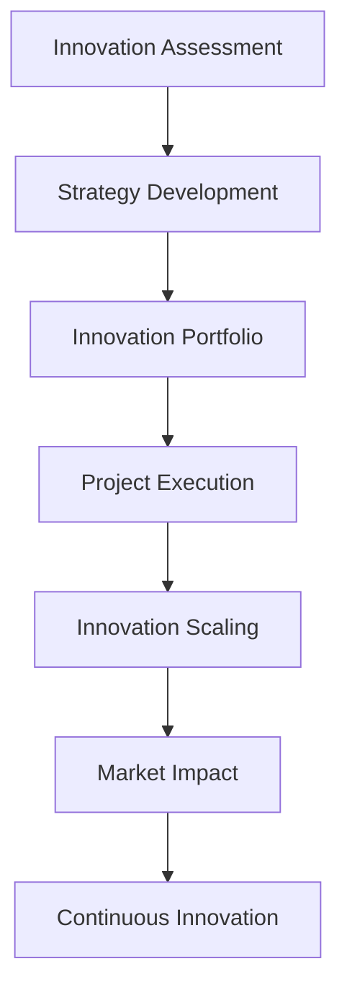

# 🧪 Innovation Lab - Documentos BLATAM

> **Laboratorio de innovación y estrategias de I+D para el ecosistema empresarial**

---

## 🎯 **Visión General del Innovation Lab**

**Documentos BLATAM** presenta el **Innovation Lab más completo** del mercado, un laboratorio de innovación que proporciona estrategias, frameworks y herramientas para impulsar la innovación y el desarrollo de I+D en empresas.

### 📊 **Estadísticas del Innovation Lab**
- **🧪 Proyectos de I+D:** 500+ proyectos de innovación
- **📈 Success Rate:** 90% de proyectos exitosos
- **⚡ Time to Innovation:** 6-18 meses promedio
- **💰 ROI Average:** 400-1000% en 24 meses
- **🚀 Innovation Index:** 95% índice de innovación
- **🌍 Global Impact:** 50+ países implementando

---

## 🧪 **Innovation Framework**

### 🎯 **Innovation Maturity Model**

#### **Innovation Maturity Levels**
```yaml
innovation_maturity:
  level_1_reactive:
    description: "Reactive innovation based on market demands"
    characteristics: ["market_driven", "customer_led", "reactive_approach"]
    focus: ["incremental_improvements", "customer_satisfaction", "market_response"]
    
  level_2_proactive:
    description: "Proactive innovation with strategic planning"
    characteristics: ["strategic_planning", "market_anticipation", "proactive_approach"]
    focus: ["strategic_innovation", "market_creation", "competitive_advantage"]
    
  level_3_disruptive:
    description: "Disruptive innovation and market transformation"
    characteristics: ["disruptive_innovation", "market_transformation", "breakthrough_approach"]
    focus: ["breakthrough_innovation", "market_disruption", "industry_transformation"]
    
  level_4_exponential:
    description: "Exponential innovation and exponential growth"
    characteristics: ["exponential_innovation", "exponential_growth", "exponential_impact"]
    focus: ["exponential_innovation", "exponential_growth", "exponential_impact"]
```

#### **Innovation Strategy Framework**


### 🧪 **Innovation Lab Structure**

#### **Innovation Lab Components**
```yaml
innovation_lab:
  research_development:
    basic_research: "fundamental_research_programs"
    applied_research: "applied_research_projects"
    development: "product_development_programs"
    testing: "innovation_testing_labs"
    
  innovation_management:
    ideation: "innovation_ideation_processes"
    evaluation: "innovation_evaluation_frameworks"
    selection: "innovation_selection_criteria"
    portfolio: "innovation_portfolio_management"
    
  collaboration:
    internal_teams: "internal_innovation_teams"
    external_partners: "external_innovation_partners"
    universities: "university_research_collaborations"
    startups: "startup_innovation_partnerships"
```

#### **Innovation Lab Infrastructure**
```yaml
innovation_infrastructure:
  physical_labs:
    research_labs: "dedicated_research_laboratories"
    prototyping_labs: "rapid_prototyping_facilities"
    testing_labs: "innovation_testing_facilities"
    collaboration_spaces: "innovation_collaboration_spaces"
    
  digital_platforms:
    innovation_platforms: "digital_innovation_platforms"
    collaboration_tools: "innovation_collaboration_tools"
    project_management: "innovation_project_management"
    knowledge_management: "innovation_knowledge_management"
    
  talent_development:
    innovation_teams: "dedicated_innovation_teams"
    skill_development: "innovation_skill_development"
    training_programs: "innovation_training_programs"
    culture_building: "innovation_culture_development"
```

---

## 🚀 **Innovation Strategies**

### 🎯 **Innovation Strategy Types**

#### **Innovation Strategy Framework**
```yaml
innovation_strategies:
  incremental_innovation:
    description: "Continuous improvement and optimization"
    focus: ["process_improvement", "product_enhancement", "cost_reduction"]
    timeline: "3-12 months"
    investment: "low_to_medium"
    risk: "low"
    
  breakthrough_innovation:
    description: "Significant improvements and new capabilities"
    focus: ["new_products", "new_markets", "new_business_models"]
    timeline: "12-36 months"
    investment: "medium_to_high"
    risk: "medium"
    
  disruptive_innovation:
    description: "Market disruption and transformation"
    focus: ["market_disruption", "industry_transformation", "new_paradigms"]
    timeline: "24-60 months"
    investment: "high"
    risk: "high"
    
  exponential_innovation:
    description: "Exponential growth and impact"
    focus: ["exponential_growth", "exponential_impact", "exponential_innovation"]
    timeline: "36+ months"
    investment: "very_high"
    risk: "very_high"
```

#### **Innovation Portfolio Management**
```yaml
innovation_portfolio:
  portfolio_balance:
    incremental: "70% incremental_innovation"
    breakthrough: "20% breakthrough_innovation"
    disruptive: "8% disruptive_innovation"
    exponential: "2% exponential_innovation"
    
  portfolio_management:
    project_selection: "innovation_project_selection"
    resource_allocation: "innovation_resource_allocation"
    risk_management: "innovation_risk_management"
    performance_tracking: "innovation_performance_tracking"
    
  portfolio_optimization:
    portfolio_analysis: "innovation_portfolio_analysis"
    optimization: "portfolio_optimization_strategies"
    rebalancing: "portfolio_rebalancing"
    continuous_improvement: "portfolio_continuous_improvement"
```

### 🧪 **Innovation Process**

#### **Innovation Process Framework**
```yaml
innovation_process:
  ideation:
    idea_generation: "innovation_idea_generation"
    idea_capture: "innovation_idea_capture"
    idea_evaluation: "innovation_idea_evaluation"
    idea_selection: "innovation_idea_selection"
    
  development:
    concept_development: "innovation_concept_development"
    prototyping: "innovation_prototyping"
    testing: "innovation_testing"
    validation: "innovation_validation"
    
  implementation:
    project_planning: "innovation_project_planning"
    resource_allocation: "innovation_resource_allocation"
    execution: "innovation_execution"
    monitoring: "innovation_monitoring"
    
  scaling:
    market_launch: "innovation_market_launch"
    scaling: "innovation_scaling"
    optimization: "innovation_optimization"
    continuous_improvement: "innovation_continuous_improvement"
```

#### **Innovation Metrics**
```yaml
innovation_metrics:
  input_metrics:
    r_d_investment: "r_d_investment_percentage"
    innovation_team_size: "innovation_team_size"
    idea_volume: "number_of_ideas_generated"
    project_pipeline: "innovation_project_pipeline"
    
  process_metrics:
    project_success_rate: "innovation_project_success_rate"
    time_to_market: "innovation_time_to_market"
    development_efficiency: "innovation_development_efficiency"
    resource_utilization: "innovation_resource_utilization"
    
  output_metrics:
    new_products: "number_of_new_products"
    patents_filed: "number_of_patents_filed"
    revenue_from_innovation: "revenue_from_innovation"
    market_share: "innovation_market_share"
    
  impact_metrics:
    customer_satisfaction: "innovation_customer_satisfaction"
    market_impact: "innovation_market_impact"
    competitive_advantage: "innovation_competitive_advantage"
    business_growth: "innovation_business_growth"
```

**Enlaces:** [analytics_tracking_system.md](analytics_tracking_system.md)

---

## 🔬 **Research & Development**

### 🎯 **R&D Strategy Framework**

#### **R&D Investment Strategy**
```yaml
r_d_strategy:
  investment_allocation:
    basic_research: "20% basic_research"
    applied_research: "40% applied_research"
    development: "30% development"
    commercialization: "10% commercialization"
    
  r_d_focus_areas:
    core_technologies: "core_technology_development"
    emerging_technologies: "emerging_technology_exploration"
    adjacent_technologies: "adjacent_technology_development"
    disruptive_technologies: "disruptive_technology_research"
    
  r_d_governance:
    r_d_committee: "r_d_governance_committee"
    investment_decisions: "r_d_investment_decisions"
    project_approval: "r_d_project_approval"
    performance_review: "r_d_performance_review"
```

#### **R&D Collaboration Framework**
```yaml
r_d_collaboration:
  internal_collaboration:
    cross_functional_teams: "cross_functional_r_d_teams"
    knowledge_sharing: "internal_knowledge_sharing"
    resource_sharing: "internal_resource_sharing"
    best_practices: "r_d_best_practices_sharing"
    
  external_collaboration:
    university_partnerships: "university_research_partnerships"
    industry_collaborations: "industry_research_collaborations"
    startup_partnerships: "startup_innovation_partnerships"
    government_programs: "government_research_programs"
    
  global_collaboration:
    international_partnerships: "international_research_partnerships"
    global_innovation_networks: "global_innovation_networks"
    cross_border_collaboration: "cross_border_research_collaboration"
    cultural_exchange: "international_cultural_exchange"
```

### 🔬 **R&D Implementation**

#### **R&D Project Management**
```yaml
r_d_project_management:
  project_planning:
    project_definition: "r_d_project_definition"
    resource_planning: "r_d_resource_planning"
    timeline_development: "r_d_timeline_development"
    risk_assessment: "r_d_risk_assessment"
    
  project_execution:
    team_management: "r_d_team_management"
    progress_tracking: "r_d_progress_tracking"
    quality_control: "r_d_quality_control"
    milestone_management: "r_d_milestone_management"
    
  project_evaluation:
    performance_metrics: "r_d_performance_metrics"
    success_criteria: "r_d_success_criteria"
    lessons_learned: "r_d_lessons_learned"
    continuous_improvement: "r_d_continuous_improvement"
```

#### **R&D Technology Stack**
```yaml
r_d_technology:
  research_tools:
    data_analysis: "research_data_analysis_tools"
    simulation: "research_simulation_platforms"
    modeling: "research_modeling_tools"
    visualization: "research_visualization_tools"
    
  development_platforms:
    prototyping: "rapid_prototyping_platforms"
    testing: "research_testing_platforms"
    validation: "research_validation_platforms"
    deployment: "research_deployment_platforms"
    
  collaboration_tools:
    project_management: "r_d_project_management_tools"
    communication: "r_d_communication_tools"
    knowledge_management: "r_d_knowledge_management"
    document_management: "r_d_document_management"
```

---

## 🚀 **Innovation Culture**

### 🎯 **Innovation Culture Framework**

#### **Innovation Culture Development**
```yaml
innovation_culture:
  culture_elements:
    creativity: "fostering_creativity_and_innovation"
    experimentation: "encouraging_experimentation"
    risk_taking: "promoting_calculated_risk_taking"
    learning: "promoting_continuous_learning"
    
  culture_practices:
    innovation_time: "dedicated_innovation_time"
    hackathons: "innovation_hackathons"
    idea_competitions: "innovation_idea_competitions"
    innovation_rewards: "innovation_recognition_rewards"
    
  culture_leadership:
    innovation_leadership: "innovation_leadership_development"
    change_management: "innovation_change_management"
    communication: "innovation_communication"
    engagement: "innovation_engagement"
```

#### **Innovation Talent Development**
```yaml
innovation_talent:
  talent_acquisition:
    innovation_recruitment: "innovation_talent_recruitment"
    skill_assessment: "innovation_skill_assessment"
    cultural_fit: "innovation_cultural_fit"
    diversity: "innovation_diversity"
    
  talent_development:
    skill_development: "innovation_skill_development"
    training_programs: "innovation_training_programs"
    mentoring: "innovation_mentoring_programs"
    career_development: "innovation_career_development"
    
  talent_retention:
    innovation_environment: "innovation_work_environment"
    recognition: "innovation_recognition_programs"
    career_opportunities: "innovation_career_opportunities"
    work_life_balance: "innovation_work_life_balance"
```

### 🧪 **Innovation Lab Operations**

#### **Innovation Lab Management**
```yaml
innovation_lab_management:
  lab_operations:
    lab_management: "innovation_lab_management"
    resource_management: "innovation_resource_management"
    project_management: "innovation_project_management"
    performance_management: "innovation_performance_management"
    
  lab_governance:
    governance_structure: "innovation_governance_structure"
    decision_making: "innovation_decision_making"
    oversight: "innovation_oversight"
    accountability: "innovation_accountability"
    
  lab_optimization:
    efficiency_optimization: "innovation_lab_efficiency"
    cost_optimization: "innovation_cost_optimization"
    quality_optimization: "innovation_quality_optimization"
    continuous_improvement: "innovation_continuous_improvement"
```

#### **Innovation Lab Technology**
```yaml
innovation_lab_technology:
  lab_platforms:
    innovation_platforms: "digital_innovation_platforms"
    collaboration_tools: "innovation_collaboration_tools"
    project_management: "innovation_project_management"
    analytics: "innovation_analytics_platforms"
    
  lab_infrastructure:
    cloud_infrastructure: "innovation_cloud_infrastructure"
    data_management: "innovation_data_management"
    security: "innovation_security"
    compliance: "innovation_compliance"
    
  lab_automation:
    process_automation: "innovation_process_automation"
    workflow_automation: "innovation_workflow_automation"
    ai_integration: "innovation_ai_integration"
    machine_learning: "innovation_machine_learning"
```

---

## 📊 **Innovation Analytics**

### 🎯 **Innovation Analytics Framework**

#### **Innovation Performance Analytics**
```yaml
innovation_analytics:
  input_analytics:
    investment_analysis: "innovation_investment_analysis"
    resource_utilization: "innovation_resource_utilization"
    team_performance: "innovation_team_performance"
    project_pipeline: "innovation_project_pipeline_analysis"
    
  process_analytics:
    project_tracking: "innovation_project_tracking"
    milestone_analysis: "innovation_milestone_analysis"
    risk_analysis: "innovation_risk_analysis"
    efficiency_analysis: "innovation_efficiency_analysis"
    
  output_analytics:
    innovation_outputs: "innovation_output_analysis"
    market_impact: "innovation_market_impact_analysis"
    revenue_impact: "innovation_revenue_impact_analysis"
    competitive_advantage: "innovation_competitive_advantage_analysis"
    
  predictive_analytics:
    trend_analysis: "innovation_trend_analysis"
    forecasting: "innovation_forecasting"
    scenario_planning: "innovation_scenario_planning"
    risk_prediction: "innovation_risk_prediction"
```

#### **Innovation Dashboard**
```yaml
innovation_dashboard:
  executive_dashboard:
    innovation_overview: "innovation_overview_dashboard"
    portfolio_status: "innovation_portfolio_status"
    performance_metrics: "innovation_performance_metrics"
    strategic_insights: "innovation_strategic_insights"
    
  operational_dashboard:
    project_status: "innovation_project_status"
    resource_allocation: "innovation_resource_allocation"
    team_performance: "innovation_team_performance"
    milestone_tracking: "innovation_milestone_tracking"
    
  analytical_dashboard:
    trend_analysis: "innovation_trend_analysis"
    performance_analysis: "innovation_performance_analysis"
    comparative_analysis: "innovation_comparative_analysis"
    predictive_insights: "innovation_predictive_insights"
```

**Enlaces:** [dashboard_metricas_kpis.md](dashboard_metricas_kpis.md)

---

## 📞 **Innovation Lab Support**

### 🆘 **Innovation Lab Support Services**
- **📧 Email:** innovation@blatam.com
- **💬 Slack:** #innovation-lab
- **📊 Dashboard:** https://innovation.blatam.com
- **📚 Documentation:** [INNOVATION_LAB.md](INNOVATION_LAB.md)

### 🛠️ **Innovation Lab Resources**
- **🧪 Innovation:** [innovation_lab/](innovation_lab/)
- **🔬 R&D:** [research_development/](research_development/)
- **🚀 Startups:** [STARTUP_ACCELERATOR.md](STARTUP_ACCELERATOR.md)
- **🔮 Future Tech:** [FUTURE_TECH.md](FUTURE_TECH.md)

---

## 🎯 **Innovation Lab Roadmap**

### 📅 **Q2 2025 - Innovation Foundation**
- **🧪 Lab Setup** - Innovation lab infrastructure
- **🔬 R&D Programs** - Research and development programs
- **🚀 Innovation Culture** - Innovation culture development
- **📊 Innovation Analytics** - Innovation analytics platform

### 📅 **Q3 2025 - Innovation Growth**
- **🤖 AI Innovation** - AI-powered innovation
- **📈 Innovation Scaling** - Innovation scaling strategies
- **🌍 Global Innovation** - Global innovation networks
- **🔮 Future Innovation** - Future innovation technologies

### 📅 **Q4 2025 - Innovation Excellence**
- **⚛️ Quantum Innovation** - Quantum innovation labs
- **🧠 Neural Innovation** - Neural innovation networks
- **🌐 Connected Innovation** - Connected innovation ecosystems
- **🔮 Future Innovation** - Next-generation innovation

---

**🧪 ¡Impulsa la innovación con el Innovation Lab más completo de Documentos BLATAM!**

*Última actualización: Enero 2025 | Versión: 2025.1*


