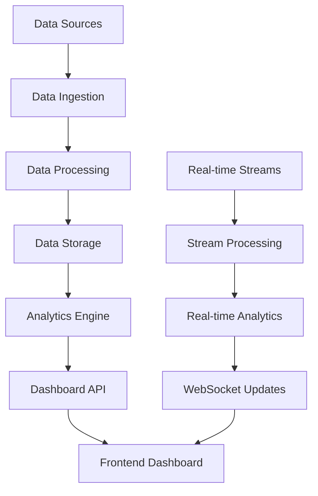

# 📊 **GUÍA DE DASHBOARD DE ANALYTICS AVANZADO - PROGRAMA DE AFILIADOS**

## 🎯 **RESUMEN EJECUTIVO**

### **Objetivo del Dashboard**
Crear un sistema de analytics avanzado que proporcione insights en tiempo real sobre el performance del programa de afiliados, permitiendo toma de decisiones basada en datos y optimización continua.

### **Características Principales**
- **Analytics en tiempo real** con actualización cada 5 minutos
- **Métricas personalizadas** por audiencia y segmento
- **Predicciones con IA** para forecasting y tendencias
- **Alertas inteligentes** basadas en umbrales y patrones
- **Visualizaciones interactivas** con drill-down capabilities

---

## 🏗️ **ARQUITECTURA DEL DASHBOARD**

### **Stack Tecnológico**

**Frontend:**
```javascript
// Dashboard React con componentes avanzados
const DashboardStack = {
  framework: 'React 18+',
  stateManagement: 'Redux Toolkit + RTK Query',
  charts: 'D3.js + Recharts',
  tables: 'TanStack Table',
  maps: 'Mapbox GL JS',
  realTime: 'Socket.io Client',
  styling: 'Tailwind CSS + Headless UI'
};
```

**Backend:**
```javascript
// API de analytics con procesamiento en tiempo real
const BackendStack = {
  runtime: 'Node.js 18+',
  framework: 'Express.js + Fastify',
  database: 'PostgreSQL + TimescaleDB',
  cache: 'Redis + Redis Streams',
  queue: 'Bull Queue',
  realTime: 'Socket.io',
  analytics: 'ClickHouse + Apache Kafka'
};
```

**Infrastructure:**
```javascript
// Infraestructura escalable para analytics
const InfrastructureStack = {
  cloud: 'AWS',
  containers: 'Docker + Kubernetes',
  monitoring: 'DataDog + Prometheus',
  logging: 'ELK Stack',
  cdn: 'CloudFront',
  storage: 'S3 + Glacier'
};
```

### **Arquitectura de Datos**



---

## 📊 **MÉTRICAS Y KPIs**

### **Métricas Principales**

**Revenue Metrics:**
```javascript
const RevenueMetrics = {
  totalRevenue: {
    label: 'Revenue Total',
    value: '$1,250,000',
    change: '+15.3%',
    trend: 'up',
    period: 'MTD'
  },
  revenuePerAffiliate: {
    label: 'Revenue por Afiliado',
    value: '$3,125',
    change: '+8.7%',
    trend: 'up',
    period: 'MTD'
  },
  averageOrderValue: {
    label: 'Valor Promedio de Orden',
    value: '$2,997',
    change: '+2.1%',
    trend: 'up',
    period: 'MTD'
  },
  monthlyRecurringRevenue: {
    label: 'MRR',
    value: '$125,000',
    change: '+12.4%',
    trend: 'up',
    period: 'MTD'
  }
};
```

**Conversion Metrics:**
```javascript
const ConversionMetrics = {
  conversionRate: {
    label: 'Tasa de Conversión',
    value: '8.5%',
    change: '+1.2%',
    trend: 'up',
    period: 'MTD'
  },
  leadToAffiliateRate: {
    label: 'Lead a Afiliado',
    value: '12.3%',
    change: '+0.8%',
    trend: 'up',
    period: 'MTD'
  },
  affiliateToCustomerRate: {
    label: 'Afiliado a Cliente',
    value: '6.8%',
    change: '+1.1%',
    trend: 'up',
    period: 'MTD'
  },
  customerLifetimeValue: {
    label: 'LTV',
    value: '$4,250',
    change: '+5.2%',
    trend: 'up',
    period: 'MTD'
  }
};
```

**Performance Metrics:**
```javascript
const PerformanceMetrics = {
  activeAffiliates: {
    label: 'Afiliados Activos',
    value: '400',
    change: '+25',
    trend: 'up',
    period: 'MTD'
  },
  newAffiliates: {
    label: 'Nuevos Afiliados',
    value: '45',
    change: '+8',
    trend: 'up',
    period: 'MTD'
  },
  churnRate: {
    label: 'Tasa de Churn',
    value: '3.2%',
    change: '-0.5%',
    trend: 'down',
    period: 'MTD'
  },
  retentionRate: {
    label: 'Tasa de Retención',
    value: '85.3%',
    change: '+2.1%',
    trend: 'up',
    period: 'MTD'
  }
};
```

### **Métricas por Segmento**

**Por Audiencia:**
```javascript
const AudienceMetrics = {
  marketingManagers: {
    count: 120,
    revenue: '$450,000',
    conversionRate: '12.5%',
    avgRevenue: '$3,750'
  },
  freelancers: {
    count: 150,
    revenue: '$375,000',
    conversionRate: '8.2%',
    avgRevenue: '$2,500'
  },
  consultants: {
    count: 80,
    revenue: '$400,000',
    conversionRate: '15.8%',
    avgRevenue: '$5,000'
  },
  influencers: {
    count: 100,
    revenue: '$300,000',
    conversionRate: '9.1%',
    avgRevenue: '$3,000'
  },
  agencies: {
    count: 60,
    revenue: '$360,000',
    conversionRate: '18.3%',
    avgRevenue: '$6,000'
  },
  startups: {
    count: 90,
    revenue: '$180,000',
    conversionRate: '7.5%',
    avgRevenue: '$2,000'
  }
};
```

**Por Región:**
```javascript
const RegionalMetrics = {
  mexico: {
    affiliates: 150,
    revenue: '$375,000',
    growth: '+18.5%'
  },
  brazil: {
    affiliates: 120,
    revenue: '$300,000',
    growth: '+22.1%'
  },
  argentina: {
    affiliates: 80,
    revenue: '$200,000',
    growth: '+15.3%'
  },
  colombia: {
    affiliates: 70,
    revenue: '$175,000',
    growth: '+19.7%'
  },
  spain: {
    affiliates: 60,
    revenue: '$150,000',
    growth: '+12.8%'
  },
  chile: {
    affiliates: 50,
    revenue: '$125,000',
    growth: '+25.4%'
  }
};
```

---

## 🎨 **COMPONENTES DEL DASHBOARD**

### **Dashboard Principal**

**Header con Métricas Clave:**
```jsx
const DashboardHeader = () => {
  return (
    <div className="bg-white shadow-sm border-b">
      <div className="max-w-7xl mx-auto px-4 sm:px-6 lg:px-8">
        <div className="py-6">
          <div className="grid grid-cols-1 md:grid-cols-4 gap-6">
            <MetricCard
              title="Revenue Total"
              value="$1,250,000"
              change="+15.3%"
              trend="up"
              icon={CurrencyDollarIcon}
            />
            <MetricCard
              title="Afiliados Activos"
              value="400"
              change="+25"
              trend="up"
              icon={UsersIcon}
            />
            <MetricCard
              title="Tasa de Conversión"
              value="8.5%"
              change="+1.2%"
              trend="up"
              icon={ChartBarIcon}
            />
            <MetricCard
              title="LTV"
              value="$4,250"
              change="+5.2%"
              trend="up"
              icon={TrendingUpIcon}
            />
          </div>
        </div>
      </div>
    </div>
  );
};
```

**Gráficos Principales:**
```jsx
const MainCharts = () => {
  return (
    <div className="grid grid-cols-1 lg:grid-cols-2 gap-6">
      <ChartCard
        title="Revenue por Mes"
        type="line"
        data={revenueData}
        height={300}
      />
      <ChartCard
        title="Conversiones por Canal"
        type="doughnut"
        data={conversionData}
        height={300}
      />
      <ChartCard
        title="Afiliados por Región"
        type="bar"
        data={regionalData}
        height={300}
      />
      <ChartCard
        title="Performance por Audiencia"
        type="radar"
        data={audienceData}
        height={300}
      />
    </div>
  );
};
```

### **Dashboard de Afiliados**

**Vista de Lista:**
```jsx
const AffiliatesTable = () => {
  const columns = [
    {
      accessorKey: 'name',
      header: 'Nombre',
      cell: ({ row }) => (
        <div className="flex items-center">
          <Avatar src={row.original.avatar} />
          <div className="ml-3">
            <div className="font-medium">{row.original.name}</div>
            <div className="text-sm text-gray-500">{row.original.email}</div>
          </div>
        </div>
      )
    },
    {
      accessorKey: 'tier',
      header: 'Tier',
      cell: ({ row }) => (
        <Badge variant={getTierVariant(row.original.tier)}>
          {row.original.tier}
        </Badge>
      )
    },
    {
      accessorKey: 'revenue',
      header: 'Revenue',
      cell: ({ row }) => (
        <div className="text-right">
          <div className="font-medium">${row.original.revenue}</div>
          <div className="text-sm text-gray-500">
            {row.original.conversions} conversiones
          </div>
        </div>
      )
    },
    {
      accessorKey: 'status',
      header: 'Estado',
      cell: ({ row }) => (
        <StatusBadge status={row.original.status} />
      )
    },
    {
      accessorKey: 'actions',
      header: 'Acciones',
      cell: ({ row }) => (
        <DropdownMenu>
          <DropdownMenuItem>Ver Detalles</DropdownMenuItem>
          <DropdownMenuItem>Enviar Mensaje</DropdownMenuItem>
          <DropdownMenuItem>Programar Llamada</DropdownMenuItem>
        </DropdownMenu>
      )
    }
  ];

  return (
    <DataTable
      columns={columns}
      data={affiliates}
      pagination
      sorting
      filtering
      searchable
    />
  );
};
```

**Vista de Detalle:**
```jsx
const AffiliateDetail = ({ affiliateId }) => {
  const { data: affiliate } = useGetAffiliateQuery(affiliateId);
  const { data: metrics } = useGetAffiliateMetricsQuery(affiliateId);
  const { data: timeline } = useGetAffiliateTimelineQuery(affiliateId);

  return (
    <div className="space-y-6">
      <AffiliateHeader affiliate={affiliate} />
      
      <div className="grid grid-cols-1 lg:grid-cols-3 gap-6">
        <div className="lg:col-span-2">
          <ChartCard
            title="Performance Histórico"
            type="line"
            data={metrics.historical}
            height={400}
          />
        </div>
        <div>
          <MetricCard
            title="Revenue Total"
            value={`$${metrics.totalRevenue}`}
            change={`+${metrics.revenueGrowth}%`}
          />
          <MetricCard
            title="Conversiones"
            value={metrics.conversions}
            change={`+${metrics.conversionGrowth}%`}
          />
          <MetricCard
            title="Tasa de Conversión"
            value={`${metrics.conversionRate}%`}
            change={`+${metrics.rateGrowth}%`}
          />
        </div>
      </div>

      <TimelineCard events={timeline} />
    </div>
  );
};
```

### **Dashboard de Analytics Avanzado**

**Análisis de Cohortes:**
```jsx
const CohortAnalysis = () => {
  const { data: cohortData } = useGetCohortAnalysisQuery();

  return (
    <div className="space-y-6">
      <div className="flex justify-between items-center">
        <h2 className="text-2xl font-bold">Análisis de Cohortes</h2>
        <Select defaultValue="monthly">
          <SelectItem value="weekly">Semanal</SelectItem>
          <SelectItem value="monthly">Mensual</SelectItem>
          <SelectItem value="quarterly">Trimestral</SelectItem>
        </Select>
      </div>
      
      <CohortTable data={cohortData} />
    </div>
  );
};
```

**Análisis de Funnel:**
```jsx
const FunnelAnalysis = () => {
  const { data: funnelData } = useGetFunnelAnalysisQuery();

  return (
    <div className="space-y-6">
      <h2 className="text-2xl font-bold">Análisis de Funnel</h2>
      
      <div className="grid grid-cols-1 md:grid-cols-5 gap-4">
        {funnelData.steps.map((step, index) => (
          <FunnelStep
            key={step.id}
            step={step}
            index={index}
            total={funnelData.steps.length}
          />
        ))}
      </div>
      
      <FunnelChart data={funnelData} />
    </div>
  );
};
```

**Análisis Predictivo:**
```jsx
const PredictiveAnalysis = () => {
  const { data: predictions } = useGetPredictionsQuery();

  return (
    <div className="space-y-6">
      <h2 className="text-2xl font-bold">Análisis Predictivo</h2>
      
      <div className="grid grid-cols-1 lg:grid-cols-2 gap-6">
        <ChartCard
          title="Predicción de Revenue"
          type="line"
          data={predictions.revenue}
          height={300}
          showPrediction={true}
        />
        <ChartCard
          title="Predicción de Churn"
          type="line"
          data={predictions.churn}
          height={300}
          showPrediction={true}
        />
      </div>
      
      <PredictiveInsights insights={predictions.insights} />
    </div>
  );
};
```

---

## 🔄 **ANALYTICS EN TIEMPO REAL**

### **Sistema de Streaming**

```javascript
// Sistema de streaming de datos en tiempo real
class RealTimeAnalytics {
  constructor() {
    this.socket = io('/analytics');
    this.subscribers = new Map();
    this.setupEventHandlers();
  }

  setupEventHandlers() {
    this.socket.on('metric_update', (data) => {
      this.updateMetrics(data);
    });

    this.socket.on('conversion_event', (data) => {
      this.updateConversions(data);
    });

    this.socket.on('affiliate_activity', (data) => {
      this.updateAffiliateActivity(data);
    });
  }

  subscribeToMetric(metricId, callback) {
    if (!this.subscribers.has(metricId)) {
      this.subscribers.set(metricId, new Set());
    }
    this.subscribers.get(metricId).add(callback);
  }

  updateMetrics(data) {
    const callbacks = this.subscribers.get(data.metricId);
    if (callbacks) {
      callbacks.forEach(callback => callback(data));
    }
  }
}
```

### **WebSocket Updates**

```javascript
// Hook para updates en tiempo real
const useRealTimeMetrics = (metricIds) => {
  const [metrics, setMetrics] = useState({});
  const analytics = useRef(new RealTimeAnalytics());

  useEffect(() => {
    const updateMetric = (data) => {
      setMetrics(prev => ({
        ...prev,
        [data.metricId]: data.value
      }));
    };

    metricIds.forEach(metricId => {
      analytics.current.subscribeToMetric(metricId, updateMetric);
    });

    return () => {
      metricIds.forEach(metricId => {
        analytics.current.unsubscribeFromMetric(metricId, updateMetric);
      });
    };
  }, [metricIds]);

  return metrics;
};
```

### **Alertas Inteligentes**

```javascript
// Sistema de alertas inteligentes
class IntelligentAlerts {
  async checkAlerts(metrics) {
    const alerts = await this.getActiveAlerts();
    
    for (const alert of alerts) {
      const condition = await this.evaluateCondition(alert.condition, metrics);
      
      if (condition) {
        await this.triggerAlert(alert);
      }
    }
  }

  async evaluateCondition(condition, metrics) {
    switch (condition.type) {
      case 'threshold':
        return this.evaluateThreshold(condition, metrics);
      case 'trend':
        return this.evaluateTrend(condition, metrics);
      case 'anomaly':
        return this.evaluateAnomaly(condition, metrics);
      default:
        return false;
    }
  }

  async triggerAlert(alert) {
    // Enviar notificación
    await this.sendNotification(alert);
    
    // Actualizar dashboard
    await this.updateDashboard(alert);
    
    // Registrar en logs
    await this.logAlert(alert);
  }
}
```

---

## 📈 **VISUALIZACIONES AVANZADAS**

### **Gráficos Interactivos**

**Gráfico de Revenue con Drill-down:**
```jsx
const RevenueChart = () => {
  const [selectedPeriod, setSelectedPeriod] = useState('monthly');
  const [selectedRegion, setSelectedRegion] = useState('all');
  const { data: revenueData } = useGetRevenueDataQuery({
    period: selectedPeriod,
    region: selectedRegion
  });

  return (
    <div className="space-y-4">
      <div className="flex justify-between items-center">
        <h3 className="text-lg font-semibold">Revenue por Período</h3>
        <div className="flex space-x-2">
          <Select value={selectedPeriod} onValueChange={setSelectedPeriod}>
            <SelectItem value="daily">Diario</SelectItem>
            <SelectItem value="weekly">Semanal</SelectItem>
            <SelectItem value="monthly">Mensual</SelectItem>
            <SelectItem value="quarterly">Trimestral</SelectItem>
          </Select>
          <Select value={selectedRegion} onValueChange={setSelectedRegion}>
            <SelectItem value="all">Todas las Regiones</SelectItem>
            <SelectItem value="mexico">México</SelectItem>
            <SelectItem value="brazil">Brasil</SelectItem>
            <SelectItem value="argentina">Argentina</SelectItem>
          </Select>
        </div>
      </div>
      
      <ResponsiveContainer width="100%" height={400}>
        <LineChart data={revenueData}>
          <XAxis dataKey="date" />
          <YAxis />
          <Tooltip />
          <Legend />
          <Line
            type="monotone"
            dataKey="revenue"
            stroke="#3B82F6"
            strokeWidth={2}
            dot={{ fill: '#3B82F6', strokeWidth: 2, r: 4 }}
          />
          <Line
            type="monotone"
            dataKey="target"
            stroke="#EF4444"
            strokeWidth={2}
            strokeDasharray="5 5"
          />
        </LineChart>
      </ResponsiveContainer>
    </div>
  );
};
```

**Mapa de Calor de Conversiones:**
```jsx
const ConversionHeatmap = () => {
  const { data: heatmapData } = useGetConversionHeatmapQuery();

  return (
    <div className="space-y-4">
      <h3 className="text-lg font-semibold">Mapa de Calor de Conversiones</h3>
      
      <div className="grid grid-cols-7 gap-1">
        {heatmapData.map((day, index) => (
          <div key={index} className="space-y-1">
            <div className="text-xs text-gray-500 text-center">
              {day.day}
            </div>
            {day.hours.map((hour, hourIndex) => (
              <div
                key={hourIndex}
                className={`w-4 h-4 rounded-sm ${
                  hour.conversions > 10 ? 'bg-green-600' :
                  hour.conversions > 5 ? 'bg-green-400' :
                  hour.conversions > 2 ? 'bg-yellow-400' :
                  hour.conversions > 0 ? 'bg-yellow-200' :
                  'bg-gray-100'
                }`}
                title={`${day.day} ${hour.hour}:00 - ${hour.conversions} conversiones`}
              />
            ))}
          </div>
        ))}
      </div>
      
      <div className="flex items-center space-x-4 text-sm">
        <div className="flex items-center space-x-1">
          <div className="w-4 h-4 bg-gray-100 rounded-sm"></div>
          <span>0</span>
        </div>
        <div className="flex items-center space-x-1">
          <div className="w-4 h-4 bg-yellow-200 rounded-sm"></div>
          <span>1-2</span>
        </div>
        <div className="flex items-center space-x-1">
          <div className="w-4 h-4 bg-yellow-400 rounded-sm"></div>
          <span>3-5</span>
        </div>
        <div className="flex items-center space-x-1">
          <div className="w-4 h-4 bg-green-400 rounded-sm"></div>
          <span>6-10</span>
        </div>
        <div className="flex items-center space-x-1">
          <div className="w-4 h-4 bg-green-600 rounded-sm"></div>
          <span>10+</span>
        </div>
      </div>
    </div>
  );
};
```

**Gráfico de Sankey para Flujo de Conversiones:**
```jsx
const ConversionSankey = () => {
  const { data: sankeyData } = useGetConversionSankeyQuery();

  return (
    <div className="space-y-4">
      <h3 className="text-lg font-semibold">Flujo de Conversiones</h3>
      
      <ResponsiveContainer width="100%" height={500}>
        <Sankey
          data={sankeyData}
          nodeWidth={20}
          nodePadding={50}
          linkOpacity={0.6}
        >
          <Tooltip />
        </Sankey>
      </ResponsiveContainer>
    </div>
  );
};
```

---

## 🤖 **ANALYTICS CON IA**

### **Predicciones con Machine Learning**

```javascript
// Sistema de predicciones con ML
class MLPredictions {
  async predictRevenue(timeframe) {
    const historicalData = await this.getHistoricalRevenue();
    const features = await this.extractFeatures(historicalData);
    
    const prediction = await this.mlModel.predict(features, {
      timeframe: timeframe,
      confidence: 0.95
    });
    
    return {
      prediction: prediction.value,
      confidence: prediction.confidence,
      factors: prediction.factors,
      recommendations: prediction.recommendations
    };
  }

  async predictChurn(affiliateId) {
    const affiliateData = await this.getAffiliateData(affiliateId);
    const features = await this.extractChurnFeatures(affiliateData);
    
    const prediction = await this.churnModel.predict(features);
    
    return {
      churnProbability: prediction.probability,
      riskFactors: prediction.riskFactors,
      recommendations: prediction.recommendations
    };
  }

  async detectAnomalies(metricData) {
    const anomalies = await this.anomalyDetector.detect(metricData);
    
    return anomalies.map(anomaly => ({
      timestamp: anomaly.timestamp,
      metric: anomaly.metric,
      severity: anomaly.severity,
      description: anomaly.description,
      recommendations: anomaly.recommendations
    }));
  }
}
```

### **Insights Automáticos**

```javascript
// Sistema de insights automáticos
class AutomatedInsights {
  async generateInsights(metrics) {
    const insights = [];
    
    // Análisis de tendencias
    const trends = await this.analyzeTrends(metrics);
    insights.push(...trends);
    
    // Análisis de correlaciones
    const correlations = await this.analyzeCorrelations(metrics);
    insights.push(...correlations);
    
    // Análisis de outliers
    const outliers = await this.analyzeOutliers(metrics);
    insights.push(...outliers);
    
    // Análisis de estacionalidad
    const seasonality = await this.analyzeSeasonality(metrics);
    insights.push(...seasonality);
    
    return insights.sort((a, b) => b.importance - a.importance);
  }

  async analyzeTrends(metrics) {
    const trends = [];
    
    for (const metric of metrics) {
      const trend = await this.calculateTrend(metric);
      
      if (trend.significance > 0.8) {
        trends.push({
          type: 'trend',
          metric: metric.name,
          direction: trend.direction,
          strength: trend.strength,
          significance: trend.significance,
          description: this.generateTrendDescription(trend),
          recommendation: this.generateTrendRecommendation(trend)
        });
      }
    }
    
    return trends;
  }
}
```

### **Recomendaciones Inteligentes**

```javascript
// Sistema de recomendaciones inteligentes
class IntelligentRecommendations {
  async generateRecommendations(context) {
    const recommendations = [];
    
    // Análisis de performance
    const performanceRecs = await this.analyzePerformance(context);
    recommendations.push(...performanceRecs);
    
    // Análisis de oportunidades
    const opportunityRecs = await this.analyzeOpportunities(context);
    recommendations.push(...opportunityRecs);
    
    // Análisis de riesgos
    const riskRecs = await this.analyzeRisks(context);
    recommendations.push(...riskRecs);
    
    return recommendations.sort((a, b) => b.priority - a.priority);
  }

  async analyzePerformance(context) {
    const recommendations = [];
    
    // Análisis de conversión
    if (context.conversionRate < 0.05) {
      recommendations.push({
        type: 'performance',
        priority: 'high',
        title: 'Optimizar Tasa de Conversión',
        description: 'La tasa de conversión está por debajo del promedio. Considera optimizar el funnel de conversión.',
        actions: [
          'Revisar landing pages',
          'Optimizar call-to-actions',
          'Mejorar targeting de audiencia',
          'Implementar A/B testing'
        ],
        expectedImpact: '+2.5% conversión'
      });
    }
    
    return recommendations;
  }
}
```

---

## 📱 **DASHBOARD MÓVIL**

### **App Móvil React Native**

```javascript
// Dashboard móvil con React Native
const MobileDashboard = () => {
  const [selectedTab, setSelectedTab] = useState('overview');
  const { data: metrics } = useGetMetricsQuery();

  return (
    <SafeAreaView style={styles.container}>
      <ScrollView style={styles.scrollView}>
        <View style={styles.header}>
          <Text style={styles.title}>Analytics</Text>
          <TouchableOpacity style={styles.refreshButton}>
            <Icon name="refresh" size={20} color="#3B82F6" />
          </TouchableOpacity>
        </View>

        <View style={styles.metricsGrid}>
          <MetricCard
            title="Revenue"
            value={`$${metrics.revenue}`}
            change={`+${metrics.revenueChange}%`}
            trend="up"
          />
          <MetricCard
            title="Afiliados"
            value={metrics.affiliates}
            change={`+${metrics.affiliatesChange}`}
            trend="up"
          />
          <MetricCard
            title="Conversiones"
            value={metrics.conversions}
            change={`+${metrics.conversionsChange}%`}
            trend="up"
          />
          <MetricCard
            title="LTV"
            value={`$${metrics.ltv}`}
            change={`+${metrics.ltvChange}%`}
            trend="up"
          />
        </View>

        <View style={styles.chartContainer}>
          <Text style={styles.chartTitle}>Revenue por Mes</Text>
          <LineChart
            data={metrics.revenueChart}
            width={screenWidth - 32}
            height={200}
            chartConfig={chartConfig}
          />
        </View>

        <View style={styles.chartContainer}>
          <Text style={styles.chartTitle}>Conversiones por Canal</Text>
          <PieChart
            data={metrics.conversionChart}
            width={screenWidth - 32}
            height={200}
            chartConfig={chartConfig}
          />
        </View>
      </ScrollView>

      <TabBar
        selectedTab={selectedTab}
        onTabChange={setSelectedTab}
        tabs={['overview', 'affiliates', 'conversions', 'revenue']}
      />
    </SafeAreaView>
  );
};
```

### **Notificaciones Push**

```javascript
// Sistema de notificaciones push
class PushNotifications {
  async sendMetricAlert(metric, value, threshold) {
    const notification = {
      title: `Alerta de ${metric}`,
      body: `${metric} alcanzó ${value}, superando el umbral de ${threshold}`,
      data: {
        type: 'metric_alert',
        metric: metric,
        value: value,
        threshold: threshold
      }
    };

    await this.sendNotification(notification);
  }

  async sendConversionAlert(conversion) {
    const notification = {
      title: 'Nueva Conversión',
      body: `${conversion.affiliateName} generó una conversión de $${conversion.amount}`,
      data: {
        type: 'conversion',
        affiliateId: conversion.affiliateId,
        amount: conversion.amount
      }
    };

    await this.sendNotification(notification);
  }

  async sendDailySummary(summary) {
    const notification = {
      title: 'Resumen Diario',
      body: `Revenue: $${summary.revenue} | Conversiones: ${summary.conversions} | Nuevos Afiliados: ${summary.newAffiliates}`,
      data: {
        type: 'daily_summary',
        summary: summary
      }
    };

    await this.sendNotification(notification);
  }
}
```

---

## 📊 **REPORTES AUTOMATIZADOS**

### **Generación de Reportes**

```javascript
// Sistema de generación de reportes
class ReportGenerator {
  async generateDailyReport(date) {
    const data = await this.getDailyData(date);
    
    const report = {
      date: date,
      summary: {
        revenue: data.revenue,
        conversions: data.conversions,
        newAffiliates: data.newAffiliates,
        activeAffiliates: data.activeAffiliates
      },
      charts: {
        revenueByHour: data.revenueByHour,
        conversionsByChannel: data.conversionsByChannel,
        topAffiliates: data.topAffiliates
      },
      insights: await this.generateInsights(data),
      recommendations: await this.generateRecommendations(data)
    };

    return report;
  }

  async generateWeeklyReport(week) {
    const data = await this.getWeeklyData(week);
    
    const report = {
      week: week,
      summary: {
        revenue: data.revenue,
        growth: data.growth,
        conversions: data.conversions,
        churn: data.churn
      },
      trends: await this.analyzeTrends(data),
      performance: await this.analyzePerformance(data),
      insights: await this.generateInsights(data)
    };

    return report;
  }

  async generateMonthlyReport(month) {
    const data = await this.getMonthlyData(month);
    
    const report = {
      month: month,
      executiveSummary: await this.generateExecutiveSummary(data),
      financialMetrics: await this.generateFinancialMetrics(data),
      operationalMetrics: await this.generateOperationalMetrics(data),
      strategicInsights: await this.generateStrategicInsights(data),
      recommendations: await this.generateStrategicRecommendations(data)
    };

    return report;
  }
}
```

### **Distribución de Reportes**

```javascript
// Sistema de distribución de reportes
class ReportDistribution {
  async distributeReport(report, recipients) {
    for (const recipient of recipients) {
      switch (recipient.type) {
        case 'email':
          await this.sendEmailReport(report, recipient);
          break;
        case 'slack':
          await this.sendSlackReport(report, recipient);
          break;
        case 'webhook':
          await this.sendWebhookReport(report, recipient);
          break;
        case 'dashboard':
          await this.updateDashboard(report, recipient);
          break;
      }
    }
  }

  async sendEmailReport(report, recipient) {
    const html = await this.generateHTMLReport(report);
    const pdf = await this.generatePDFReport(report);
    
    await this.emailService.send({
      to: recipient.email,
      subject: `${report.type} Report - ${report.period}`,
      html: html,
      attachments: [
        {
          filename: `${report.type}_report.pdf`,
          content: pdf
        }
      ]
    });
  }

  async sendSlackReport(report, recipient) {
    const blocks = await this.generateSlackBlocks(report);
    
    await this.slackService.sendMessage({
      channel: recipient.channel,
      blocks: blocks
    });
  }
}
```

---

## 🎯 **CONCLUSIONES**

### **Puntos Clave del Dashboard**

1. **Analytics en Tiempo Real:** Datos actualizados cada 5 minutos
2. **Visualizaciones Interactivas:** Gráficos con drill-down capabilities
3. **IA y Machine Learning:** Predicciones y insights automáticos
4. **Móvil First:** Dashboard optimizado para dispositivos móviles
5. **Reportes Automatizados:** Generación y distribución automática

### **Beneficios del Dashboard**

1. **Toma de Decisiones:** Datos en tiempo real para decisiones informadas
2. **Optimización Continua:** Identificación automática de oportunidades
3. **Alertas Proactivas:** Notificaciones inteligentes de problemas
4. **Escalabilidad:** Arquitectura que crece con el programa
5. **ROI Mejorado:** Optimización basada en datos reales

### **Recomendaciones**

1. **Implementar Gradualmente:** Comenzar con métricas básicas
2. **Entrenar al Equipo:** Capacitar en uso del dashboard
3. **Iterar Continuamente:** Mejorar basado en feedback
4. **Monitorear Performance:** Optimizar velocidad y usabilidad
5. **Escalar Exitosos:** Replicar funcionalidades exitosas

---

*"Un dashboard de analytics avanzado es la base para la optimización continua del programa de afiliados. Los datos en tiempo real y las predicciones con IA permiten tomar decisiones informadas y anticipar tendencias."* 📊
