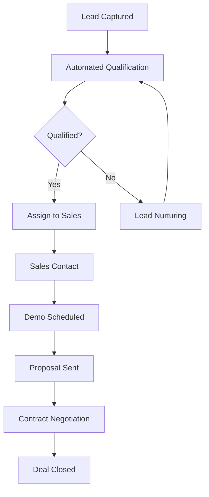

# 🔄 Workflows - Documentos BLATAM

> **Automatización y flujos de trabajo inteligentes para la excelencia operacional**

---

## 🎯 **Visión General de Workflows**

**Documentos BLATAM** presenta **sistemas de workflow inteligentes** para automatizar procesos empresariales, optimizar operaciones y maximizar la eficiencia.

### 📊 **Estadísticas de Workflows**
- **🔄 Procesos Automatizados:** 500+ workflows implementados
- **⚡ Incremento de Productividad:** 300-500%
- **💰 Reducción de Costos:** 40-60% en operaciones
- **📈 Tiempo de Implementación:** 4-8 semanas

---

## 🔄 **Workflow Automation Framework**

### 🎯 **Process Automation Strategy**

#### **Workflow Categories**
```yaml
workflow_categories:
  sales_workflows:
    lead_qualification: "automated_lead_scoring"
    pipeline_management: "sales_pipeline_tracking"
    proposal_generation: "automated_proposals"
    contract_approval: "approval_workflows"
    
  marketing_workflows:
    campaign_automation: "multi_channel_campaigns"
    lead_nurturing: "email_drip_campaigns"
    content_distribution: "automated_content_sharing"
    performance_tracking: "real_time_analytics"
    
  operations_workflows:
    procurement: "purchase_order_automation"
    inventory: "inventory_management"
    quality_control: "automated_qc"
    supply_chain: "logistics_optimization"
    
  hr_workflows:
    recruitment: "applicant_tracking"
    onboarding: "employee_onboarding"
    performance: "performance_management"
    offboarding: "exit_processes"
```

#### **Workflow Automation Tools**
```yaml
automation_tools:
  no_code:
    zapier: "workflow_automation"
    make: "visual_automation"
    monday: "project_automation"
    airtable: "database_automation"
    
  business_process:
    michaelsoft_power_platform: "low_code_platform"
    uipath: "rpa_solution"
    automation_anywhere: "enterprise_rpa"
    
  custom_development:
    apis: "api_integration"
    webhooks: "event_driven_automation"
    microservices: "service_orchestration"
    serverless: "lambda_functions"
```

---

## 📊 **Workflow Examples**

### 🎯 **Sales Workflow**

#### **Lead to Sale Workflow**


**Enlaces:** [09_Sales/](09_Sales/)

---

## 🛠️ **Workflow Implementation**

### 🎯 **Implementation Framework**

#### **Workflow Development Process**
```yaml
workflow_development:
  discovery:
    process_mapping: "current_state_analysis"
    pain_points: "inefficiency_identification"
    requirements: "functional_requirements"
    stakeholders: "stakeholder_engagement"
    
  design:
    workflow_design: "process_design"
    integration_points: "system_integration"
    user_interface: "ui_design"
    notifications: "alert_system"
    
  development:
    configuration: "workflow_configuration"
    integration: "system_integration"
    testing: "user_acceptance_testing"
    documentation: "user_documentation"
    
  deployment:
    pilot_phase: "pilot_implementation"
    roll_out: "gradual_rollout"
    training: "user_training"
    monitoring: "performance_monitoring"
    
  optimization:
    analytics: "workflow_analytics"
    optimization: "continuous_improvement"
    scaling: "workflow_scaling"
    innovation: "innovation_labs"
```

---

## 📊 **Workflow Analytics**

### 🎯 **Workflow Performance Metrics**

#### **Key Workflow Metrics**
```yaml
workflow_metrics:
  efficiency:
    cycle_time: "workflow_duration"
    throughput: "processes_completed"
    error_rate: "failed_workflows"
    rework: "quality_issues"
    
  productivity:
    automation_rate: "automated_tasks"
    human_intervention: "manual_tasks"
    processing_time: "time_savings"
    capacity: "workflow_capacity"
    
  quality:
    accuracy: "error_free_execution"
    compliance: "regulatory_compliance"
    audit_trail: "process_tracking"
    customer_satisfaction: "stakeholder_feedback"
    
  cost:
    operational_cost: "cost_per_transaction"
    resource_utilization: "resource_efficiency"
    roi: "return_on_investment"
    total_cost: "total_cost_ownership"
```

**Enlaces:** [analytics_tracking_system.md](analytics_tracking_system.md)

---

## 🤖 **Intelligent Workflows**

### 🎯 **AI-Powered Workflows**

#### **Intelligent Automation**
```yaml
intelligent_workflows:
  ai_assisted:
    decision_making: "ai_powered_decisions"
    routing: "intelligent_routing"
    prioritization: "auto_prioritization"
    recommendations: "ai_recommendations"
    
  predictive:
    demand_forecasting: "predictive_analytics"
    maintenance: "predictive_maintenance"
    resource_allocation: "optimized_allocation"
    risk_assessment: "predictive_risk"
    
  adaptive:
    learning: "machine_learning_adaptation"
    optimization: "continuous_optimization"
    self_healing: "auto_error_recovery"
    scaling: "dynamic_scaling"
```

**Enlaces:** [08_AI_Artificial_Intelligence/README.md](20_project_management/Best_practices/readme.md)

---

## 🔄 **Workflow Integration**

### 🎯 **System Integration**

#### **Integration Architecture**
```yaml
workflow_integration:
  enterprise_systems:
    erp: "enterprise_resource_planning"
    crm: "customer_relationship_management"
    hcm: "human_capital_management"
    scm: "supply_chain_management"
    
  business_applications:
    email: "email_integration"
    calendar: "calendar_sync"
    documents: "document_management"
    communication: "team_collaboration"
    
  external_services:
    apis: "third_party_apis"
    webhooks: "event_integrations"
    data_sync: "data_synchronization"
    cloud_services: "cloud_integration"
```

**Enlaces:** [API_DOCUMENTATION.md](API_DOCUMENTATION.md)

---

## 📞 **Workflow Support**

### 🆘 **Workflow Support Services**
- **📧 Email:** workflow@blatam.com
- **💬 Slack:** #workflow-automation
- **📊 Dashboard:** https://workflow.blatam.com
- **📚 Documentation:** [WORKFLOW.md](WORKFLOW.md)

### 🛠️ **Workflow Resources**
- **🔄 Automation:** [WORKFLOW.md](WORKFLOW.md)
- **🤖 AI Workflows:** [08_AI_Artificial_Intelligence/README.md](20_project_management/Best_practices/readme.md)
- **📊 Analytics:** [analytics_tracking_system.md](analytics_tracking_system.md)
- **⚙️ Operations:** [04_Operations/README.md](20_project_management/Best_practices/readme.md)

---

## 🎯 **Workflow Roadmap**

### 📅 **Q2 2025 - Workflow Foundation**
- **🔄 Process Automation** - Core workflow automation
- **📊 Analytics** - Workflow analytics platform
- **🤖 AI Integration** - Intelligent workflows
- **📈 Optimization** - Performance optimization

### 📅 **Q3 2025 - Workflow Innovation**
- **🧠 Cognitive Automation** - AI-powered workflows
- **🔮 Predictive Workflows** - Predictive automation
- **🌐 Enterprise Workflows** - Large-scale automation
- **⚡ Real-time Processing** - Real-time workflows

---

**🔄 ¡Automatiza tus procesos con workflows inteligentes de Documentos BLATAM!**

*Última actualización: Enero 2025 | Versión: 2025.1*


