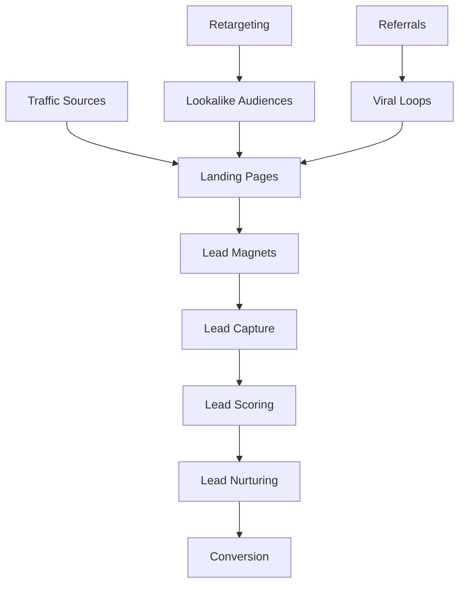

# 🎯 **GUÍA AVANZADA DE GENERACIÓN DE LEADS - PROGRAMA DE AFILIADOS**

## 🎯 **RESUMEN EJECUTIVO**

### **Objetivo de Generación de Leads**
Desarrollar un sistema avanzado de generación de leads que utilice múltiples canales, automatización inteligente y personalización para atraer y convertir afiliados de alta calidad para el programa IA/SaaS.

### **Métricas de Éxito**
- **Leads generados:** 2,000/mes
- **Tasa de conversión:** 15%
- **Costo por lead:** <$25
- **Calidad de leads:** >8/10
- **ROI:** >400%

---

## 🚀 **ESTRATEGIA DE GENERACIÓN DE LEADS**

### **Modelo de Generación de Leads**



### **Canales de Generación de Leads**

**Canales Orgánicos:**
```javascript
const OrganicChannels = {
  seo: {
    potential: '40%',
    cost: 'Low',
    quality: 'High',
    strategy: 'Content marketing + SEO optimization'
  },
  socialMedia: {
    potential: '25%',
    cost: 'Medium',
    quality: 'Medium',
    strategy: 'Organic content + community building'
  },
  referrals: {
    potential: '20%',
    cost: 'Low',
    quality: 'Very High',
    strategy: 'Referral program + viral loops'
  },
  partnerships: {
    potential: '15%',
    cost: 'Medium',
    quality: 'High',
    strategy: 'Strategic partnerships + collaborations'
  }
};
```

**Canales Pagados:**
```javascript
const PaidChannels = {
  googleAds: {
    potential: '30%',
    cost: 'High',
    quality: 'High',
    strategy: 'Search + Display + YouTube'
  },
  facebookAds: {
    potential: '25%',
    cost: 'Medium',
    quality: 'Medium',
    strategy: 'Lookalike audiences + retargeting'
  },
  linkedinAds: {
    potential: '20%',
    cost: 'High',
    quality: 'Very High',
    strategy: 'B2B targeting + thought leadership'
  },
  influencerMarketing: {
    potential: '15%',
    cost: 'Medium',
    quality: 'High',
    strategy: 'Micro-influencers + nano-influencers'
  },
  contentMarketing: {
    potential: '10%',
    cost: 'Low',
    quality: 'Very High',
    strategy: 'Sponsored content + native advertising'
  }
};
```

---

## 🎨 **LANDING PAGES OPTIMIZADAS**

### **Arquitectura de Landing Pages**

**Landing Page Principal:**
```jsx
const MainLandingPage = () => {
  return (
    <div className="min-h-screen bg-gradient-to-br from-blue-50 to-indigo-100">
      {/* Hero Section */}
      <section className="py-20">
        <div className="max-w-7xl mx-auto px-4 sm:px-6 lg:px-8">
          <div className="text-center">
            <h1 className="text-4xl md:text-6xl font-bold text-gray-900 mb-6">
              Gana <span className="text-blue-600">$50K+</span> anuales
              <br />
              como Afiliado de IA
            </h1>
            <p className="text-xl text-gray-600 mb-8 max-w-3xl mx-auto">
              Únete al programa de afiliados más rentable de LATAM. 
              Comisiones del 50%, soporte 24/7 y herramientas exclusivas.
            </p>
            <div className="flex flex-col sm:flex-row gap-4 justify-center">
              <Button size="lg" className="bg-blue-600 hover:bg-blue-700">
                Aplicar Ahora - Gratis
              </Button>
              <Button size="lg" variant="outline">
                Ver Casos de Éxito
              </Button>
            </div>
          </div>
        </div>
      </section>

      {/* Social Proof */}
      <section className="py-16 bg-white">
        <div className="max-w-7xl mx-auto px-4 sm:px-6 lg:px-8">
          <div className="text-center mb-12">
            <h2 className="text-3xl font-bold text-gray-900 mb-4">
              Más de 400 afiliados ya están ganando
            </h2>
            <div className="grid grid-cols-1 md:grid-cols-3 gap-8">
              <div className="text-center">
                <div className="text-4xl font-bold text-blue-600 mb-2">$1.2M+</div>
                <div className="text-gray-600">Revenue generado</div>
              </div>
              <div className="text-center">
                <div className="text-4xl font-bold text-blue-600 mb-2">50%</div>
                <div className="text-gray-600">Comisión promedio</div>
              </div>
              <div className="text-center">
                <div className="text-4xl font-bold text-blue-600 mb-2">24/7</div>
                <div className="text-gray-600">Soporte en español</div>
              </div>
            </div>
          </div>
        </div>
      </section>

      {/* Benefits */}
      <section className="py-20">
        <div className="max-w-7xl mx-auto px-4 sm:px-6 lg:px-8">
          <div className="text-center mb-16">
            <h2 className="text-3xl font-bold text-gray-900 mb-4">
              쯇or qué elegir nuestro programa?
            </h2>
          </div>
          <div className="grid grid-cols-1 md:grid-cols-3 gap-8">
            <BenefitCard
              icon={CurrencyDollarIcon}
              title="Comisiones Altas"
              description="Hasta 50% de comisión en cada venta. 67% más alto que la competencia."
            />
            <BenefitCard
              icon={SupportIcon}
              title="Soporte 24/7"
              description="Soporte dedicado en español las 24 horas del día, 7 días a la semana."
            />
            <BenefitCard
              icon={ChartBarIcon}
              title="Herramientas Exclusivas"
              description="Dashboard avanzado, analytics en tiempo real y automatización con IA."
            />
          </div>
        </div>
      </section>

      {/* CTA Final */}
      <section className="py-20 bg-blue-600">
        <div className="max-w-7xl mx-auto px-4 sm:px-6 lg:px-8 text-center">
          <h2 className="text-3xl font-bold text-white mb-4">
            쯃isto para comenzar a ganar?
          </h2>
          <p className="text-xl text-blue-100 mb-8">
            Aplica ahora y comienza a ganar comisiones en 24 horas
          </p>
          <Button size="lg" className="bg-white text-blue-600 hover:bg-gray-100">
            Aplicar Ahora - Es Gratis
          </Button>
        </div>
      </section>
    </div>
  );
};
```

**Landing Pages Específicas por Audiencia:**

**Para Marketing Managers:**
```jsx
const MarketingManagerLanding = () => {
  return (
    <div className="min-h-screen">
      <HeroSection
        title="Revoluciona tu Carrera en Marketing con IA"
        subtitle="Gana $60K+ anuales promocionando las mejores herramientas de IA para empresas"
        cta="Aplicar como Marketing Manager"
      />
      
      <BenefitsSection
        benefits={[
          {
            title: "Acceso a C-Level",
            description: "Conecta directamente con directores de marketing y CMOs"
          },
          {
            title: "Casos de Estudio Exclusivos",
            description: "Materiales profesionales para presentaciones ejecutivas"
          },
          {
            title: "Networking Premium",
            description: "Acceso a eventos exclusivos y comunidad de marketing"
          }
        ]}
      />
      
      <SocialProofSection
        testimonials={marketingManagerTestimonials}
        stats={{
          averageEarnings: "$60,000",
          conversionRate: "12.5%",
          satisfaction: "9.2/10"
        }}
      />
    </div>
  );
};
```

**Para Freelancers:**
```jsx
const FreelancerLanding = () => {
  return (
    <div className="min-h-screen">
      <HeroSection
        title="Libera tu Potencial como Freelancer"
        subtitle="Gana $30K+ anuales trabajando desde casa con las mejores herramientas de IA"
        cta="Aplicar como Freelancer"
      />
      
      <BenefitsSection
        benefits={[
          {
            title: "Flexibilidad Total",
            description: "Trabaja cuando quieras, desde donde quieras"
          },
          {
            title: "Múltiples Clientes",
            description: "Diversifica tus ingresos con diferentes clientes"
          },
          {
            title: "Herramientas Gratuitas",
            description: "Acceso completo a todas las herramientas de IA"
          }
        ]}
      />
      
      <SocialProofSection
        testimonials={freelancerTestimonials}
        stats={{
          averageEarnings: "$30,000",
          conversionRate: "8.2%",
          satisfaction: "8.8/10"
        }}
      />
    </div>
  );
};
```

---

## 🎁 **LEAD MAGNETS EFECTIVOS**

### **Tipos de Lead Magnets**

**Lead Magnets por Audiencia:**

**Para Marketing Managers:**
```javascript
const MarketingManagerLeadMagnets = {
  caseStudy: {
    title: "Casos de Éxito: Cómo 5 CMOs Generaron $2M+ con IA",
    description: "Estudio detallado de implementaciones exitosas de IA en marketing",
    format: "PDF + Video",
    value: "High",
    conversionRate: "15%"
  },
  template: {
    title: "Template: Presentación Ejecutiva para IA",
    description: "Plantilla profesional para presentar IA a C-level",
    format: "PowerPoint + Canva",
    value: "High",
    conversionRate: "18%"
  },
  checklist: {
    title: "Checklist: Implementación de IA en Marketing",
    description: "Lista completa para implementar IA en tu departamento",
    format: "PDF + Interactive",
    value: "Medium",
    conversionRate: "12%"
  }
};
```

**Para Freelancers:**
```javascript
const FreelancerLeadMagnets = {
  toolkit: {
    title: "Kit Completo: Herramientas de IA para Freelancers",
    description: "50+ herramientas de IA organizadas por categoría",
    format: "PDF + Links",
    value: "High",
    conversionRate: "20%"
  },
  course: {
    title: "Mini-Curso: Automatiza tu Trabajo con IA",
    description: "5 lecciones para automatizar tareas repetitivas",
    format: "Video + PDF",
    value: "High",
    conversionRate: "16%"
  },
  calculator: {
    title: "Calculadora: ROI de Herramientas de IA",
    description: "Calcula cuánto puedes ahorrar con IA",
    format: "Interactive Tool",
    value: "Medium",
    conversionRate: "14%"
  }
};
```

**Para Consultores:**
```javascript
const ConsultantLeadMagnets = {
  whitepaper: {
    title: "White Paper: El Futuro de la Consultoría con IA",
    description: "Análisis profundo del impacto de IA en consultoría",
    format: "PDF + Audio",
    value: "Very High",
    conversionRate: "22%"
  },
  framework: {
    title: "Framework: Transformación Digital con IA",
    description: "Metodología probada para implementar IA en empresas",
    format: "PDF + Templates",
    value: "Very High",
    conversionRate: "25%"
  },
  webinar: {
    title: "Webinar: Cómo Vender IA a C-Level",
    description: "Estrategias para presentar IA a ejecutivos",
    format: "Live + Recording",
    value: "High",
    conversionRate: "18%"
  }
};
```

### **Creación de Lead Magnets**

**Proceso de Creación:**
```javascript
class LeadMagnetCreator {
  async createLeadMagnet(type, audience, topic) {
    const content = await this.generateContent(type, audience, topic);
    const design = await this.createDesign(content);
    const landingPage = await this.createLandingPage(content, design);
    const emailSequence = await this.createEmailSequence(content);
    
    return {
      content,
      design,
      landingPage,
      emailSequence,
      tracking: await this.setupTracking(landingPage)
    };
  }

  async generateContent(type, audience, topic) {
    const prompt = `
      Create a ${type} for ${audience} about ${topic}.
      Make it valuable, actionable, and specific to their needs.
      Include practical examples and step-by-step instructions.
    `;
    
    const content = await this.aiService.generateContent(prompt);
    return content;
  }

  async createDesign(content) {
    const design = await this.designService.createDesign({
      content,
      brand: this.brandGuidelines,
      format: content.format,
      audience: content.audience
    });
    
    return design;
  }
}
```

---

## 📧 **SISTEMA DE CAPTURA DE LEADS**

### **Formularios Optimizados**

**Formulario Principal:**
```jsx
const LeadCaptureForm = () => {
  const [formData, setFormData] = useState({
    name: '',
    email: '',
    phone: '',
    company: '',
    role: '',
    experience: '',
    audience: '',
    goals: ''
  });

  const handleSubmit = async (e) => {
    e.preventDefault();
    
    // Validación
    if (!formData.email || !formData.name) {
      setError('Email y nombre son requeridos');
      return;
    }

    // Envío
    try {
      const response = await fetch('/api/leads', {
        method: 'POST',
        headers: { 'Content-Type': 'application/json' },
        body: JSON.stringify(formData)
      });

      if (response.ok) {
        // Redirección a página de agradecimiento
        router.push('/thank-you');
      }
    } catch (error) {
      setError('Error al enviar el formulario');
    }
  };

  return (
    <form onSubmit={handleSubmit} className="space-y-6">
      <div className="grid grid-cols-1 md:grid-cols-2 gap-6">
        <div>
          <label className="block text-sm font-medium text-gray-700 mb-2">
            Nombre Completo *
          </label>
          <input
            type="text"
            required
            value={formData.name}
            onChange={(e) => setFormData({...formData, name: e.target.value})}
            className="w-full px-3 py-2 border border-gray-300 rounded-md focus:outline-none focus:ring-2 focus:ring-blue-500"
          />
        </div>
        
        <div>
          <label className="block text-sm font-medium text-gray-700 mb-2">
            Email *
          </label>
          <input
            type="email"
            required
            value={formData.email}
            onChange={(e) => setFormData({...formData, email: e.target.value})}
            className="w-full px-3 py-2 border border-gray-300 rounded-md focus:outline-none focus:ring-2 focus:ring-blue-500"
          />
        </div>
      </div>

      <div>
        <label className="block text-sm font-medium text-gray-700 mb-2">
          쮺uál es tu rol principal?
        </label>
        <select
          value={formData.role}
          onChange={(e) => setFormData({...formData, role: e.target.value})}
          className="w-full px-3 py-2 border border-gray-300 rounded-md focus:outline-none focus:ring-2 focus:ring-blue-500"
        >
          <option value="">Selecciona tu rol</option>
          <option value="marketing-manager">Marketing Manager</option>
          <option value="freelancer">Freelancer</option>
          <option value="consultant">Consultor</option>
          <option value="influencer">Influencer</option>
          <option value="agency">Agencia</option>
          <option value="startup">Startup</option>
        </select>
      </div>

      <div>
        <label className="block text-sm font-medium text-gray-700 mb-2">
          쮺uántos años de experiencia tienes?
        </label>
        <select
          value={formData.experience}
          onChange={(e) => setFormData({...formData, experience: e.target.value})}
          className="w-full px-3 py-2 border border-gray-300 rounded-md focus:outline-none focus:ring-2 focus:ring-blue-500"
        >
          <option value="">Selecciona tu experiencia</option>
          <option value="0-1">0-1 años</option>
          <option value="2-3">2-3 años</option>
          <option value="4-5">4-5 años</option>
          <option value="6-10">6-10 años</option>
          <option value="10+">10+ años</option>
        </select>
      </div>

      <div>
        <label className="block text-sm font-medium text-gray-700 mb-2">
          쮺uál es el tamaño de tu audiencia?
        </label>
        <select
          value={formData.audience}
          onChange={(e) => setFormData({...formData, audience: e.target.value})}
          className="w-full px-3 py-2 border border-gray-300 rounded-md focus:outline-none focus:ring-2 focus:ring-blue-500"
        >
          <option value="">Selecciona el tamaño</option>
          <option value="0-100">0-100 personas</option>
          <option value="100-500">100-500 personas</option>
          <option value="500-1000">500-1,000 personas</option>
          <option value="1000-5000">1,000-5,000 personas</option>
          <option value="5000+">5,000+ personas</option>
        </select>
      </div>

      <div>
        <label className="block text-sm font-medium text-gray-700 mb-2">
          쮺uáles son tus objetivos principales?
        </label>
        <textarea
          value={formData.goals}
          onChange={(e) => setFormData({...formData, goals: e.target.value})}
          rows={3}
          className="w-full px-3 py-2 border border-gray-300 rounded-md focus:outline-none focus:ring-2 focus:ring-blue-500"
          placeholder="Describe tus objetivos..."
        />
      </div>

      <button
        type="submit"
        className="w-full bg-blue-600 text-white py-3 px-4 rounded-md hover:bg-blue-700 focus:outline-none focus:ring-2 focus:ring-blue-500"
      >
        Aplicar Ahora - Es Gratis
      </button>
    </form>
  );
};
```

### **Sistema de Lead Scoring**

```javascript
// Sistema de lead scoring automático
class LeadScoringSystem {
  async scoreLead(leadData) {
    let score = 0;
    
    // Scoring por rol
    const roleScores = {
      'marketing-manager': 25,
      'consultant': 30,
      'agency': 35,
      'influencer': 20,
      'freelancer': 15,
      'startup': 10
    };
    score += roleScores[leadData.role] || 0;
    
    // Scoring por experiencia
    const experienceScores = {
      '0-1': 5,
      '2-3': 10,
      '4-5': 15,
      '6-10': 20,
      '10+': 25
    };
    score += experienceScores[leadData.experience] || 0;
    
    // Scoring por audiencia
    const audienceScores = {
      '0-100': 5,
      '100-500': 10,
      '500-1000': 15,
      '1000-5000': 20,
      '5000+': 25
    };
    score += audienceScores[leadData.audience] || 0;
    
    // Scoring por calidad del email
    if (this.isBusinessEmail(leadData.email)) score += 10;
    
    // Scoring por completitud del formulario
    const completeness = this.calculateCompleteness(leadData);
    score += completeness * 5;
    
    return {
      score,
      grade: this.getGrade(score),
      recommendations: this.getRecommendations(score, leadData)
    };
  }

  getGrade(score) {
    if (score >= 80) return 'A';
    if (score >= 60) return 'B';
    if (score >= 40) return 'C';
    if (score >= 20) return 'D';
    return 'F';
  }

  getRecommendations(score, leadData) {
    const recommendations = [];
    
    if (score < 40) {
      recommendations.push('Lead de baja calidad - Enviar a nurturing básico');
    } else if (score < 60) {
      recommendations.push('Lead de calidad media - Enviar a nurturing intermedio');
    } else if (score < 80) {
      recommendations.push('Lead de alta calidad - Enviar a nurturing avanzado');
    } else {
      recommendations.push('Lead de muy alta calidad - Contactar inmediatamente');
    }
    
    return recommendations;
  }
}
```

---

## 🔄 **SISTEMA DE NURTURING**

### **Secuencias de Email Automatizadas**

**Secuencia de Bienvenida:**
```javascript
const WelcomeSequence = {
  email1: {
    subject: "¡Bienvenido! Tu guía para ganar $50K+ como afiliado",
    delay: "0 hours",
    content: {
      greeting: "¡Hola [Nombre]!",
      body: "Gracias por tu interés en nuestro programa de afiliados. Te voy a mostrar exactamente cómo puedes ganar $50K+ anuales promocionando las mejores herramientas de IA.",
      cta: "Ver mi guía completa"
    }
  },
  email2: {
    subject: "Casos de éxito: 3 afiliados que ganan $100K+",
    delay: "1 day",
    content: {
      greeting: "Hola [Nombre],",
      body: "Te comparto 3 casos de éxito reales de afiliados que están ganando más de $100K anuales. Descubre sus estrategias secretas.",
      cta: "Ver casos de éxito"
    }
  },
  email3: {
    subject: "Tu checklist para comenzar a ganar en 7 días",
    delay: "3 days",
    content: {
      greeting: "Hola [Nombre],",
      body: "Te he preparado un checklist paso a paso para que comiences a ganar comisiones en solo 7 días. Es más fácil de lo que piensas.",
      cta: "Descargar checklist"
    }
  },
  email4: {
    subject: "Última oportunidad: Aplicación se cierra en 24 horas",
    delay: "7 days",
    content: {
      greeting: "Hola [Nombre],",
      body: "Solo quedan 24 horas para aplicar a nuestro programa. No te quedes fuera de esta oportunidad única.",
      cta: "Aplicar ahora"
    }
  }
};
```

**Secuencia por Audiencia:**

**Para Marketing Managers:**
```javascript
const MarketingManagerSequence = {
  email1: {
    subject: "Cómo 5 CMOs generaron $2M+ con IA (caso de estudio)",
    delay: "0 hours",
    content: {
      greeting: "Hola [Nombre],",
      body: "Como Marketing Manager, sé que buscas resultados tangibles. Te comparto un caso de estudio detallado de cómo 5 CMOs generaron más de $2M implementando IA en sus departamentos.",
      cta: "Ver caso de estudio"
    }
  },
  email2: {
    subject: "Template: Presentación ejecutiva para IA",
    delay: "2 days",
    content: {
      greeting: "Hola [Nombre],",
      body: "Te he preparado una plantilla profesional para presentar IA a tu C-level. Incluye datos, estadísticas y argumentos convincentes.",
      cta: "Descargar template"
    }
  },
  email3: {
    subject: "Networking exclusivo: Conecta con otros CMOs",
    delay: "5 days",
    content: {
      greeting: "Hola [Nombre],",
      body: "Únete a nuestra comunidad exclusiva de Marketing Managers y CMOs que están implementando IA. Networking de alto nivel.",
      cta: "Unirse a la comunidad"
    }
  }
};
```

### **Sistema de Nurturing Inteligente**

```javascript
// Sistema de nurturing con IA
class IntelligentNurturingSystem {
  async personalizeNurturing(leadId, sequence) {
    const lead = await this.getLead(leadId);
    const behavior = await this.getLeadBehavior(leadId);
    
    const personalizedSequence = await this.aiService.personalizeSequence({
      sequence,
      lead,
      behavior,
      preferences: lead.preferences
    });
    
    return personalizedSequence;
  }

  async optimizeTiming(leadId, email) {
    const lead = await this.getLead(leadId);
    const optimalTime = await this.aiService.predictOptimalTime({
      lead,
      email,
      historicalData: await this.getHistoricalEngagement(lead.email)
    });
    
    return optimalTime;
  }

  async generatePersonalizedContent(leadId, emailTemplate) {
    const lead = await this.getLead(leadId);
    const content = await this.aiService.generatePersonalizedContent({
      template: emailTemplate,
      lead,
      context: await this.getLeadContext(leadId)
    });
    
    return content;
  }
}
```

---

## 📊 **ANALYTICS Y OPTIMIZACIÓN**

### **Métricas de Generación de Leads**

**KPIs Principales:**
```javascript
const LeadGenerationKPIs = {
  volume: {
    totalLeads: 2000,
    monthlyGrowth: '+15%',
    target: 2500
  },
  quality: {
    averageScore: 7.2,
    highQualityLeads: '35%',
    conversionRate: '15%'
  },
  cost: {
    costPerLead: '$22',
    costPerConversion: '$147',
    roi: '420%'
  },
  channels: {
    organic: '40%',
    paid: '35%',
    referrals: '15%',
    partnerships: '10%'
  }
};
```

### **Sistema de A/B Testing**

```javascript
// Sistema de A/B testing para generación de leads
class LeadGenerationABTesting {
  async testLandingPage(variants) {
    const test = {
      id: generateId(),
      name: 'Landing Page Optimization',
      variants: variants,
      trafficSplit: [50, 50],
      metrics: ['conversion_rate', 'cost_per_lead', 'lead_quality'],
      duration: 14 // days
    };
    
    await this.startTest(test);
    return test;
  }

  async testLeadMagnet(magnets) {
    const test = {
      id: generateId(),
      name: 'Lead Magnet Optimization',
      variants: magnets,
      trafficSplit: [33, 33, 34],
      metrics: ['download_rate', 'conversion_rate', 'engagement'],
      duration: 21 // days
    };
    
    await this.startTest(test);
    return test;
  }

  async testEmailSequence(sequences) {
    const test = {
      id: generateId(),
      name: 'Email Sequence Optimization',
      variants: sequences,
      trafficSplit: [50, 50],
      metrics: ['open_rate', 'click_rate', 'conversion_rate'],
      duration: 30 // days
    };
    
    await this.startTest(test);
    return test;
  }
}
```

### **Optimización Continua**

```javascript
// Sistema de optimización continua
class ContinuousOptimization {
  async optimizeLeadGeneration() {
    const currentPerformance = await this.getCurrentPerformance();
    const opportunities = await this.identifyOpportunities(currentPerformance);
    
    for (const opportunity of opportunities) {
      await this.implementOptimization(opportunity);
    }
  }

  async identifyOpportunities(performance) {
    const opportunities = [];
    
    // Análisis de canales
    if (performance.channels.organic.conversionRate < 0.12) {
      opportunities.push({
        type: 'channel_optimization',
        channel: 'organic',
        action: 'improve_seo_content',
        expectedImpact: '+2% conversion rate'
      });
    }
    
    // Análisis de landing pages
    if (performance.landingPages.conversionRate < 0.15) {
      opportunities.push({
        type: 'landing_page_optimization',
        action: 'improve_cta_placement',
        expectedImpact: '+3% conversion rate'
      });
    }
    
    // Análisis de lead magnets
    if (performance.leadMagnets.downloadRate < 0.25) {
      opportunities.push({
        type: 'lead_magnet_optimization',
        action: 'improve_value_proposition',
        expectedImpact: '+5% download rate'
      });
    }
    
    return opportunities;
  }
}
```

---

## 🎯 **ESTRATEGIAS AVANZADAS**

### **Retargeting Inteligente**

```javascript
// Sistema de retargeting inteligente
class IntelligentRetargeting {
  async createRetargetingAudiences() {
    const audiences = [
      {
        name: 'Landing Page Visitors',
        criteria: 'visited_landing_page',
        size: 5000,
        bid: 1.5
      },
      {
        name: 'Lead Magnet Downloaders',
        criteria: 'downloaded_lead_magnet',
        size: 1200,
        bid: 2.0
      },
      {
        name: 'Email Subscribers',
        criteria: 'subscribed_to_email',
        size: 800,
        bid: 2.5
      },
      {
        name: 'High-Intent Visitors',
        criteria: 'visited_pricing_page',
        size: 300,
        bid: 3.0
      }
    ];
    
    for (const audience of audiences) {
      await this.createAudience(audience);
    }
  }

  async createLookalikeAudiences() {
    const sourceAudiences = [
      'converted_affiliates',
      'high_value_leads',
      'engaged_subscribers'
    ];
    
    for (const source of sourceAudiences) {
      await this.createLookalikeAudience(source, {
        similarity: 0.01, // 1% lookalike
        countries: ['MX', 'BR', 'AR', 'CO'],
        interests: ['artificial intelligence', 'saas', 'marketing']
      });
    }
  }
}
```

### **Viral Loops y Referencias**

```javascript
// Sistema de viral loops
class ViralLoopSystem {
  async implementReferralProgram() {
    const referralProgram = {
      rewards: {
        referrer: '$100 credit',
        referee: '$50 credit'
      },
      tracking: {
        uniqueCodes: true,
        attribution: 'first_click',
        expiration: '30 days'
      },
      sharing: {
        socialMedia: true,
        email: true,
        whatsapp: true
      }
    };
    
    await this.setupReferralProgram(referralProgram);
  }

  async createViralContent() {
    const viralContent = [
      {
        type: 'calculator',
        title: 'Calculadora: 쮺uánto puedes ganar como afiliado?',
        shareability: 'high',
        virality: 'medium'
      },
      {
        type: 'quiz',
        title: 'Quiz: 쯈ué tipo de afiliado eres?',
        shareability: 'very_high',
        virality: 'high'
      },
      {
        type: 'infographic',
        title: 'Infografía: El futuro de los afiliados en LATAM',
        shareability: 'high',
        virality: 'medium'
      }
    ];
    
    for (const content of viralContent) {
      await this.createViralContent(content);
    }
  }
}
```

---

## 🎯 **CONCLUSIONES**

### **Puntos Clave de la Generación de Leads**

1. **Estrategia Multi-Canal:** Combinación de canales orgánicos y pagados
2. **Personalización Avanzada:** Contenido adaptado a cada audiencia
3. **Lead Magnets de Alto Valor:** Recursos que realmente aportan valor
4. **Nurturing Inteligente:** Secuencias automatizadas con IA
5. **Optimización Continua:** Mejora constante basada en datos

### **Beneficios del Sistema**

1. **Volumen Alto:** 2,000 leads/mes objetivo
2. **Calidad Superior:** Lead scoring automático
3. **Costo Eficiente:** <$25 por lead
4. **Conversión Alta:** 15% tasa de conversión
5. **ROI Excelente:** >400% retorno de inversión

### **Recomendaciones**

1. **Comenzar con Canales Orgánicos:** Construir base sólida
2. **Optimizar Continuamente:** A/B testing sistemático
3. **Personalizar por Audiencia:** Contenido específico
4. **Monitorear Métricas:** KPIs en tiempo real
5. **Escalar Exitosos:** Replicar estrategias ganadoras

---

*"La generación de leads efectiva es la base del crecimiento del programa de afiliados. Un sistema bien diseñado genera leads de alta calidad de manera consistente y escalable."* 🎯
