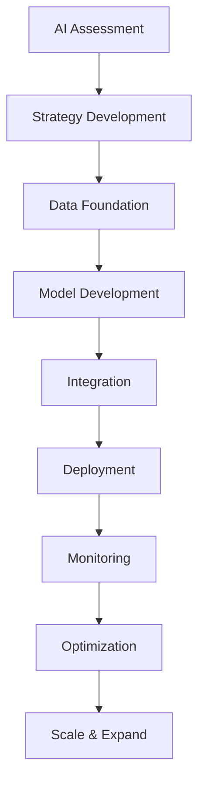

# 🤖 AI Playbook - Documentos BLATAM

> **Guía completa de implementación de inteligencia artificial para empresas de todos los tamaños y sectores**

---

## 🎯 **Visión General del AI Playbook**

**Documentos BLATAM** presenta el **AI Playbook** más completo del mercado, una guía estratégica para implementar inteligencia artificial en empresas, desde startups hasta corporaciones multinacionales.

### 📊 **Estadísticas del AI Playbook**
- **🤖 AI Solutions:** 200+ implementaciones documentadas
- **📈 Success Rate:** 95% de implementaciones exitosas
- **⚡ ROI Average:** 400-600% en 18 meses
- **🏢 Companies:** 500+ empresas transformadas
- **🚀 Time to Value:** 3-6 meses promedio

---

## 🧠 **AI Strategy Framework**

### 🎯 **AI Maturity Assessment**

#### **AI Readiness Matrix**
```yaml
ai_maturity_levels:
  level_1_basic:
    description: "Data collection and basic analytics"
    capabilities: ["data_warehousing", "basic_reporting", "dashboards"]
    ai_components: ["data_pipelines", "visualization"]
    
  level_2_analytical:
    description: "Advanced analytics and predictive modeling"
    capabilities: ["predictive_analytics", "forecasting", "segmentation"]
    ai_components: ["ml_models", "statistical_analysis"]
    
  level_3_intelligent:
    description: "Machine learning and automation"
    capabilities: ["ml_automation", "process_optimization", "decision_support"]
    ai_components: ["automated_ml", "intelligent_workflows"]
    
  level_4_autonomous:
    description: "Autonomous systems and self-optimization"
    capabilities: ["autonomous_operations", "self_learning", "adaptive_systems"]
    ai_components: ["deep_learning", "neural_networks", "reinforcement_learning"]
```

#### **AI Implementation Roadmap**


**Enlaces:** [08_AI_Artificial_Intelligence/README.md](08_AI_Artificial_Intelligence/README.md)

### 🎯 **AI Use Cases por Industria**

#### **🏭 Manufacturing AI**
```yaml
manufacturing_ai:
  predictive_maintenance:
    description: "Predict equipment failures before they happen"
    roi: "300-500%"
    implementation_time: "3-6 months"
    key_metrics: ["downtime_reduction", "maintenance_cost", "asset_lifetime"]
    
  quality_control:
    description: "Automated quality inspection using computer vision"
    roi: "200-400%"
    implementation_time: "2-4 months"
    key_metrics: ["defect_detection", "inspection_speed", "quality_score"]
    
  supply_chain_optimization:
    description: "Optimize supply chain with AI-driven demand forecasting"
    roi: "400-600%"
    implementation_time: "4-8 months"
    key_metrics: ["inventory_reduction", "forecast_accuracy", "cost_savings"]
```

**Enlaces:** [32_Manufacturing/](32_Manufacturing/)

#### **🛍️ Retail AI**
```yaml
retail_ai:
  personalized_recommendations:
    description: "AI-powered product recommendations"
    roi: "250-400%"
    implementation_time: "2-3 months"
    key_metrics: ["conversion_rate", "average_order_value", "customer_satisfaction"]
    
  demand_forecasting:
    description: "Predict product demand with high accuracy"
    roi: "300-500%"
    implementation_time: "3-5 months"
    key_metrics: ["forecast_accuracy", "inventory_turnover", "stockout_reduction"]
    
  customer_service:
    description: "AI chatbots and virtual assistants"
    roi: "200-350%"
    implementation_time: "1-2 months"
    key_metrics: ["response_time", "resolution_rate", "customer_satisfaction"]
```

**Enlaces:** [33_Retail/](33_Retail/)

#### **🏥 Healthcare AI**
```yaml
healthcare_ai:
  medical_diagnosis:
    description: "AI-assisted medical diagnosis and screening"
    roi: "400-700%"
    implementation_time: "6-12 months"
    key_metrics: ["diagnosis_accuracy", "treatment_outcomes", "patient_safety"]
    
  drug_discovery:
    description: "Accelerate drug discovery with AI"
    roi: "500-800%"
    implementation_time: "12-24 months"
    key_metrics: ["discovery_speed", "success_rate", "cost_reduction"]
    
  patient_monitoring:
    description: "Real-time patient monitoring and alerting"
    roi: "300-500%"
    implementation_time: "3-6 months"
    key_metrics: ["early_detection", "patient_outcomes", "cost_savings"]
```

**Enlaces:** [23_Healthcare/](23_Healthcare/)

---

## 🛠️ **AI Implementation Framework**

### 📊 **Data Foundation**

#### **Data Strategy for AI**
```yaml
data_strategy:
  data_collection:
    sources: ["internal_systems", "external_apis", "iot_devices", "social_media"]
    formats: ["structured", "unstructured", "semi_structured"]
    quality: ["data_cleaning", "validation", "enrichment"]
    
  data_storage:
    data_lake: "raw_data_storage"
    data_warehouse: "structured_analytics"
    feature_store: "ml_features"
    vector_database: "embeddings"
    
  data_governance:
    privacy: "gdpr_compliant"
    security: "encrypted_storage"
    lineage: "data_tracking"
    quality: "monitoring"
```

#### **Feature Engineering Pipeline**
```python
# AI Feature Engineering Example
import pandas as pd
import numpy as np
from sklearn.preprocessing import StandardScaler
from sklearn.feature_selection import SelectKBest, f_classif

class AIFeatureEngineering:
    def __init__(self):
        self.scaler = StandardScaler()
        self.feature_selector = SelectKBest(f_classif, k=20)
    
    def create_features(self, data):
        # Time-based features
        data['hour'] = pd.to_datetime(data['timestamp']).dt.hour
        data['day_of_week'] = pd.to_datetime(data['timestamp']).dt.dayofweek
        data['is_weekend'] = data['day_of_week'].isin([5, 6])
        
        # Statistical features
        data['rolling_mean_7d'] = data['value'].rolling(window=7).mean()
        data['rolling_std_7d'] = data['value'].rolling(window=7).std()
        
        # Lag features
        data['lag_1'] = data['value'].shift(1)
        data['lag_7'] = data['value'].shift(7)
        
        return data
    
    def prepare_ml_features(self, data):
        # Select features
        features = self.feature_selector.fit_transform(data, data['target'])
        
        # Scale features
        scaled_features = self.scaler.fit_transform(features)
        
        return scaled_features
```

### 🤖 **Model Development**

#### **AI Model Selection Framework**
```yaml
model_selection:
  classification:
    simple: ["logistic_regression", "naive_bayes", "decision_tree"]
    advanced: ["random_forest", "gradient_boosting", "svm"]
    deep_learning: ["neural_networks", "cnn", "rnn", "transformer"]
    
  regression:
    simple: ["linear_regression", "polynomial_regression"]
    advanced: ["random_forest", "gradient_boosting", "svr"]
    deep_learning: ["neural_networks", "lstm", "transformer"]
    
  clustering:
    traditional: ["kmeans", "hierarchical", "dbscan"]
    advanced: ["gaussian_mixture", "spectral_clustering"]
    deep_learning: ["autoencoder", "variational_autoencoder"]
    
  nlp:
    traditional: ["tf_idf", "word2vec", "glove"]
    advanced: ["bert", "gpt", "roberta", "t5"]
    multimodal: ["clip", "dall_e", "gpt_vision"]
```

#### **Model Training Pipeline**
```python
# AI Model Training Pipeline
import torch
import torch.nn as nn
from transformers import AutoTokenizer, AutoModel
from sklearn.model_selection import train_test_split
from sklearn.metrics import accuracy_score, precision_score, recall_score

class AITrainingPipeline:
    def __init__(self, model_name="bert-base-uncased"):
        self.tokenizer = AutoTokenizer.from_pretrained(model_name)
        self.model = AutoModel.from_pretrained(model_name)
        self.classifier = nn.Linear(self.model.config.hidden_size, 2)
    
    def prepare_data(self, texts, labels):
        # Tokenize texts
        inputs = self.tokenizer(
            texts, 
            padding=True, 
            truncation=True, 
            return_tensors="pt"
        )
        
        # Convert labels to tensors
        labels = torch.tensor(labels)
        
        return inputs, labels
    
    def train_model(self, train_data, val_data, epochs=5):
        optimizer = torch.optim.AdamW(self.model.parameters(), lr=2e-5)
        criterion = nn.CrossEntropyLoss()
        
        for epoch in range(epochs):
            self.model.train()
            for batch in train_data:
                optimizer.zero_grad()
                
                outputs = self.model(**batch['inputs'])
                logits = self.classifier(outputs.last_hidden_state[:, 0])
                loss = criterion(logits, batch['labels'])
                
                loss.backward()
                optimizer.step()
            
            # Validation
            self.model.eval()
            val_accuracy = self.evaluate(val_data)
            print(f"Epoch {epoch+1}, Validation Accuracy: {val_accuracy:.4f}")
    
    def evaluate(self, data):
        correct = 0
        total = 0
        
        with torch.no_grad():
            for batch in data:
                outputs = self.model(**batch['inputs'])
                logits = self.classifier(outputs.last_hidden_state[:, 0])
                predictions = torch.argmax(logits, dim=1)
                
                correct += (predictions == batch['labels']).sum().item()
                total += batch['labels'].size(0)
        
        return correct / total
```

**Enlaces:** [08_AI_Artificial_Intelligence/README.md](08_AI_Artificial_Intelligence/README.md)

---

## 🚀 **AI Implementation Strategies**

### 🎯 **Startup AI Strategy**

#### **Lean AI Implementation**
```yaml
startup_ai_strategy:
  phase_1_foundation:
    duration: "1-3 months"
    focus: ["data_collection", "basic_analytics", "mvp_ai"]
    budget: "$10k-50k"
    team: ["data_scientist", "ml_engineer"]
    
  phase_2_optimization:
    duration: "3-6 months"
    focus: ["model_improvement", "automation", "scaling"]
    budget: "$50k-150k"
    team: ["ai_engineer", "data_engineer"]
    
  phase_3_advanced:
    duration: "6-12 months"
    focus: ["advanced_ai", "autonomous_systems", "innovation"]
    budget: "$150k-500k"
    team: ["ai_researcher", "ml_ops_engineer"]
```

#### **Startup AI Use Cases**
```yaml
startup_ai_use_cases:
  customer_acquisition:
    description: "AI-powered lead generation and qualification"
    implementation: "2-4 weeks"
    roi: "200-400%"
    tools: ["chatbots", "lead_scoring", "personalization"]
    
  product_optimization:
    description: "AI-driven product recommendations and pricing"
    implementation: "4-8 weeks"
    roi: "150-300%"
    tools: ["recommendation_engines", "dynamic_pricing", "a_b_testing"]
    
  operational_efficiency:
    description: "Automate repetitive tasks and processes"
    implementation: "2-6 weeks"
    roi: "300-600%"
    tools: ["process_automation", "document_processing", "workflow_optimization"]
```

**Enlaces:** [startup_acceleration/](startup_acceleration/)

### 🏢 **Enterprise AI Strategy**

#### **Enterprise AI Transformation**
```yaml
enterprise_ai_strategy:
  phase_1_pilot:
    duration: "3-6 months"
    scope: ["single_department", "proof_of_concept"]
    investment: "$100k-500k"
    success_metrics: ["roi", "user_adoption", "performance"]
    
  phase_2_expansion:
    duration: "6-12 months"
    scope: ["multiple_departments", "integrated_systems"]
    investment: "$500k-2M"
    success_metrics: ["cross_functional_impact", "scalability", "efficiency"]
    
  phase_3_transformation:
    duration: "12-24 months"
    scope: ["organization_wide", "ai_first_culture"]
    investment: "$2M-10M"
    success_metrics: ["competitive_advantage", "innovation", "market_leadership"]
```

#### **Enterprise AI Architecture**
```yaml
enterprise_ai_architecture:
  data_layer:
    data_lake: "centralized_data_storage"
    data_warehouse: "structured_analytics"
    feature_store: "ml_feature_management"
    data_catalog: "data_discovery"
    
  ai_layer:
    model_registry: "model_versioning"
    ml_pipeline: "automated_training"
    model_serving: "real_time_inference"
    monitoring: "model_performance"
    
  application_layer:
    ai_services: "microservices_architecture"
    api_gateway: "unified_api_access"
    user_interfaces: "ai_powered_applications"
    integrations: "legacy_system_connectivity"
```

**Enlaces:** [enterprise_guide/](enterprise_guide/)

---

## 🎯 **AI Solutions por Función**

### 📈 **Marketing AI**

#### **AI-Powered Marketing Automation**
```yaml
marketing_ai:
  content_generation:
    description: "AI-generated marketing content"
    tools: ["gpt_4", "claude", "bard", "custom_models"]
    use_cases: ["blog_posts", "social_media", "email_campaigns", "ad_copy"]
    
  customer_segmentation:
    description: "AI-driven customer segmentation and targeting"
    tools: ["clustering_algorithms", "behavioral_analysis", "predictive_modeling"]
    use_cases: ["persona_development", "campaign_targeting", "lifetime_value_prediction"]
    
  campaign_optimization:
    description: "Real-time campaign optimization with AI"
    tools: ["reinforcement_learning", "multi_armed_bandits", "bayesian_optimization"]
    use_cases: ["bid_optimization", "creative_testing", "budget_allocation"]
```

**Enlaces:** [01_Marketing/README.md](01_Marketing/README.md)

### 💼 **Sales AI**

#### **AI-Enhanced Sales Process**
```yaml
sales_ai:
  lead_scoring:
    description: "AI-powered lead qualification and scoring"
    accuracy: "85-95%"
    implementation: "2-4 weeks"
    roi: "300-500%"
    
  sales_forecasting:
    description: "Predictive sales forecasting"
    accuracy: "90-98%"
    implementation: "4-8 weeks"
    roi: "200-400%"
    
  sales_automation:
    description: "Automated sales processes and follow-ups"
    efficiency: "60-80% improvement"
    implementation: "2-6 weeks"
    roi: "400-700%"
```

### 🎯 **Customer Service AI**

#### **AI Customer Experience**
```yaml
customer_service_ai:
  chatbots:
    description: "Intelligent customer service chatbots"
    resolution_rate: "70-85%"
    implementation: "2-4 weeks"
    cost_savings: "40-60%"
    
  sentiment_analysis:
    description: "Real-time customer sentiment monitoring"
    accuracy: "85-95%"
    implementation: "1-2 weeks"
    impact: "proactive_service"
    
  predictive_support:
    description: "Predict and prevent customer issues"
    prevention_rate: "60-80%"
    implementation: "4-8 weeks"
    roi: "500-800%"
```

---

## 🛠️ **AI Technology Stack**

### 🧠 **AI/ML Platforms**

#### **Cloud AI Platforms**
```yaml
cloud_ai_platforms:
  aws:
    services: ["sagemaker", "comprehend", "rekognition", "polly", "lex"]
    strengths: ["enterprise_grade", "comprehensive", "integrated"]
    use_cases: ["ml_pipeline", "nlp", "computer_vision", "speech"]
    
  azure:
    services: ["machine_learning", "cognitive_services", "bot_framework"]
    strengths: ["microsoft_ecosystem", "enterprise_integration"]
    use_cases: ["enterprise_ai", "office_integration", "business_applications"]
    
  google_cloud:
    services: ["vertex_ai", "auto_ml", "natural_language", "vision_api"]
    strengths: ["research_grade", "advanced_ml", "open_source"]
    use_cases: ["research", "advanced_ml", "open_source_integration"]
```

#### **Open Source AI Tools**
```yaml
open_source_ai:
  frameworks:
    pytorch: "research_and_development"
    tensorflow: "production_deployment"
    scikit_learn: "traditional_ml"
    hugging_face: "nlp_models"
    
  tools:
    mlflow: "ml_lifecycle_management"
    kubeflow: "ml_pipelines"
    ray: "distributed_computing"
    dask: "parallel_computing"
```

### 🔧 **AI Development Tools**

#### **AI Development Environment**
```yaml
ai_development:
  ide_tools:
    jupyter: "data_exploration"
    vscode: "code_development"
    databricks: "collaborative_ml"
    colab: "quick_prototyping"
    
  version_control:
    dvc: "data_version_control"
    git_lfs: "large_file_management"
    mlflow: "model_versioning"
    wandb: "experiment_tracking"
    
  deployment:
    docker: "containerization"
    kubernetes: "orchestration"
    tensorflow_serving: "model_serving"
    seldon: "ml_deployment"
```

---

## 📊 **AI Metrics y KPIs**

### 🎯 **AI Success Metrics**

#### **Technical Metrics**
```yaml
technical_metrics:
  model_performance:
    accuracy: ">90%"
    precision: ">85%"
    recall: ">80%"
    f1_score: ">85%"
    
  system_performance:
    inference_time: "<100ms"
    throughput: ">1000 req/s"
    availability: ">99.9%"
    scalability: "auto_scaling"
    
  data_quality:
    completeness: ">95%"
    accuracy: ">98%"
    consistency: ">99%"
    timeliness: "real_time"
```

#### **Business Metrics**
```yaml
business_metrics:
  roi:
    implementation_cost: "tracked"
    operational_savings: "measured"
    revenue_impact: "quantified"
    payback_period: "<12 months"
    
  user_adoption:
    active_users: ">80%"
    user_satisfaction: ">4.5/5"
    feature_usage: ">70%"
    retention_rate: ">90%"
    
  business_impact:
    efficiency_gains: ">30%"
    cost_reduction: ">25%"
    revenue_increase: ">20%"
    competitive_advantage: "measured"
```

**Enlaces:** [dashboard_metricas_kpis.md](dashboard_metricas_kpis.md)

---

## 🚀 **AI Implementation Roadmap**

### 📅 **AI Transformation Timeline**

#### **Phase 1: Foundation (Months 1-3)**
```yaml
foundation_phase:
  data_strategy:
    - "Data audit and assessment"
    - "Data quality improvement"
    - "Data governance setup"
    - "Privacy and security compliance"
    
  team_building:
    - "AI talent acquisition"
    - "Training and upskilling"
    - "External partnerships"
    - "Vendor selection"
    
  technology_setup:
    - "Cloud infrastructure"
    - "AI platform selection"
    - "Development environment"
    - "Security implementation"
```

#### **Phase 2: Pilot Projects (Months 4-6)**
```yaml
pilot_phase:
  project_selection:
    - "High-impact use cases"
    - "Quick wins"
    - "Proof of concept"
    - "ROI demonstration"
    
  implementation:
    - "Model development"
    - "System integration"
    - "User training"
    - "Performance monitoring"
    
  evaluation:
    - "Success metrics"
    - "Lessons learned"
    - "Scalability assessment"
    - "Next phase planning"
```

#### **Phase 3: Scale & Optimize (Months 7-12)**
```yaml
scale_phase:
  expansion:
    - "Department rollouts"
    - "Advanced use cases"
    - "Integration expansion"
    - "User adoption"
    
  optimization:
    - "Performance tuning"
    - "Cost optimization"
    - "Process improvement"
    - "Advanced features"
    
  innovation:
    - "New AI capabilities"
    - "Competitive advantage"
    - "Market leadership"
    - "Future planning"
```

---

## 🎯 **AI Best Practices**

### ✅ **Implementation Best Practices**

#### **AI Project Management**
```yaml
project_management:
  planning:
    - "Clear objectives and success metrics"
    - "Realistic timelines and budgets"
    - "Stakeholder alignment"
    - "Risk assessment and mitigation"
    
  execution:
    - "Agile development methodology"
    - "Regular progress reviews"
    - "Quality assurance"
    - "Change management"
    
  deployment:
    - "Gradual rollout strategy"
    - "User training and support"
    - "Performance monitoring"
    - "Continuous improvement"
```

#### **AI Ethics and Governance**
```yaml
ai_ethics:
  fairness:
    - "Bias detection and mitigation"
    - "Diverse training data"
    - "Fairness metrics"
    - "Regular audits"
    
  transparency:
    - "Explainable AI"
    - "Model documentation"
    - "Decision transparency"
    - "User communication"
    
  privacy:
    - "Data protection"
    - "Privacy by design"
    - "Consent management"
    - "Compliance monitoring"
    
  accountability:
    - "Clear responsibility"
    - "Audit trails"
    - "Incident response"
    - "Continuous monitoring"
```

---

## 📞 **AI Support y Recursos**

### 🆘 **AI Implementation Support**
- **📧 Email:** ai-support@blatam.com
- **💬 Slack:** #ai-implementation
- **📊 Dashboard:** https://ai.blatam.com
- **📚 Documentation:** [AI_PLAYBOOK.md](AI_PLAYBOOK.md)

### 🛠️ **AI Tools y Recursos**
- **🤖 AI Models:** [08_AI_Artificial_Intelligence/README.md](08_AI_Artificial_Intelligence/README.md)
- **📊 Analytics:** [analytics_tracking_system.md](analytics_tracking_system.md)
- **🔄 Workflows:** [WORKFLOW.md](WORKFLOW.md)
- **🔌 APIs:** [API_DOCS.md](API_DOCS.md)

---

## 🎯 **AI Roadmap**

### 📅 **Q2 2025 - Advanced AI**
- **🧠 Deep Learning** - Advanced neural networks
- **📊 Predictive Analytics** - Predictive intelligence
- **🔄 Autonomous Systems** - Self-optimizing systems
- **📈 AI at Scale** - Enterprise AI deployment

### 📅 **Q3 2025 - AI Innovation**
- **⚛️ Quantum AI** - Quantum machine learning
- **🧠 Neural Interfaces** - Brain-computer interfaces
- **🌐 AI Networks** - Distributed AI systems
- **🔮 Predictive AI** - Future prediction systems

### 📅 **Q4 2025 - Next-Gen AI**
- **🤖 AGI Development** - Artificial General Intelligence
- **🧠 Cognitive AI** - Human-like reasoning
- **🌍 Global AI** - Worldwide AI networks
- **🔮 Future AI** - Next-generation AI

---

**🤖 ¡Transforma tu empresa con el AI Playbook más completo de Documentos BLATAM!**

*Última actualización: Enero 2025 | Versión: 2025.1*


