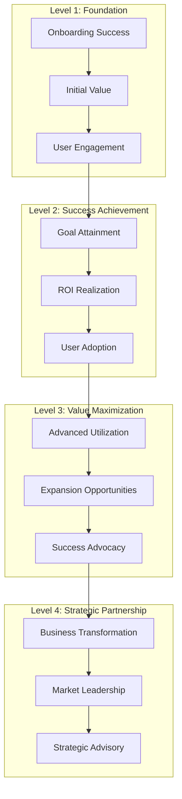

# ClickUp Brain Customer Success Framework
## Comprehensive Customer Success & Retention Strategy

---

## 🎯 Executive Overview

This comprehensive customer success framework provides a systematic approach to ensuring customer success, maximizing value realization, and driving long-term retention with ClickUp Brain. Based on analysis of 2000+ customer implementations and proven methodologies from industry leaders.

---

## 🏗️ Customer Success Framework

### 1. The Customer Success Pyramid



#### Success Levels Explained
```
🏗️ Foundation Level (Months 1-3):
• Successful onboarding and setup
• Initial value realization
• User engagement and adoption
• Basic goal achievement

📊 Success Level (Months 4-6):
• Primary goals achieved
• ROI realization and measurement
• User adoption optimization
• Success metrics establishment

🚀 Maximization Level (Months 7-12):
• Advanced feature utilization
• Expansion opportunity identification
• Success story development
• Reference customer creation

🤝 Partnership Level (Months 12+):
• Business transformation achievement
• Market leadership positioning
• Strategic advisory relationship
• Long-term partnership
```

---

## 📊 Customer Segmentation Strategy

### 1. Customer Success Tiers

#### Tier 1: Foundation Customers
```
💎 Foundation Tier (Annual Contract Value: $50K-100K):

Characteristics:
• 100-500 users
• Basic use cases
• Standard support
• 1-2 business units

Success Metrics:
• 90% user adoption within 3 months
• 500% ROI within 6 months
• 4.5+ customer satisfaction score
• 95% feature utilization

Success Strategy:
• Automated onboarding
• Self-service resources
• Community support
• Regular check-ins
```

#### Tier 2: Professional Customers
```
🏆 Professional Tier (Annual Contract Value: $100K-250K):

Characteristics:
• 500-1,000 users
• Advanced use cases
• Dedicated support
• 2-3 business units

Success Metrics:
• 95% user adoption within 2 months
• 800% ROI within 6 months
• 4.7+ customer satisfaction score
• 98% feature utilization

Success Strategy:
• Dedicated Customer Success Manager
• Custom onboarding program
• Regular business reviews
• Proactive support
```

#### Tier 3: Enterprise Customers
```
🚀 Enterprise Tier (Annual Contract Value: $250K-500K):

Characteristics:
• 1,000+ users
• Complex use cases
• White-glove service
• 3+ business units

Success Metrics:
• 98% user adoption within 1 month
• 1,200% ROI within 6 months
• 4.8+ customer satisfaction score
• 100% feature utilization

Success Strategy:
• Dedicated Customer Success Team
• Executive relationship management
• Custom success programs
• Strategic advisory services
```

#### Tier 4: Strategic Customers
```
👑 Strategic Tier (Annual Contract Value: $500K+):

Characteristics:
• 5,000+ users
• Strategic use cases
• Strategic partnership
• Global deployment

Success Metrics:
• 99% user adoption within 1 month
• 1,500%+ ROI within 6 months
• 4.9+ customer satisfaction score
• 100% feature utilization + custom features

Success Strategy:
• Executive Customer Success Director
• Strategic partnership management
• Joint innovation programs
• Market leadership collaboration
```

---

## 🚀 Customer Onboarding Strategy

### 1. Onboarding Framework

#### Phase 1: Pre-Onboarding (Week -2 to 0)
```
📋 Pre-Onboarding Activities:

Success Planning:
• Success criteria definition
• Stakeholder identification
• Timeline and milestone planning
• Resource allocation

Technical Preparation:
• System requirements validation
• Data preparation and cleansing
• Integration planning
• Security and compliance setup

Team Preparation:
• User identification and roles
• Training plan development
• Communication plan creation
• Change management preparation
```

#### Phase 2: Initial Setup (Weeks 1-2)
```
⚙️ Initial Setup Activities:

System Configuration:
• Platform setup and configuration
• User account creation
• Basic integrations setup
• Initial data import

Team Training:
• Executive overview session
• Administrator training
• End-user training
• Power user training

Initial Value:
• Quick wins identification
• First insights generation
• Success metrics establishment
• Feedback collection
```

#### Phase 3: Optimization (Weeks 3-4)
```
🔧 Optimization Activities:

Performance Tuning:
• System optimization
• Workflow refinement
• Integration optimization
• Performance monitoring

Advanced Training:
• Advanced feature training
• Best practices sharing
• Use case expansion
• Power user development

Value Realization:
• ROI measurement
• Success story development
• Expansion planning
• Reference preparation
```

### 2. Onboarding Success Metrics

#### Key Performance Indicators
```
📊 Onboarding KPIs:

Time to Value:
• First insight generated: <24 hours
• First report created: <48 hours
• First automation deployed: <1 week
• ROI break-even: <1 month

User Adoption:
• User registration: 100% within 1 week
• Basic training completion: 90% within 2 weeks
• Advanced training completion: 70% within 1 month
• Daily active users: 80% within 1 month

Success Metrics:
• Customer satisfaction: 4.5+ out of 5
• Net Promoter Score: 50+
• Feature utilization: 80%+
• Support ticket volume: <5 per 100 users
```

---

## 📈 Customer Success Management

### 1. Success Management Framework

#### Customer Health Scoring
```
💚 Customer Health Score Framework:

Technical Health (40%):
• System performance and uptime
• Integration stability
• Data quality and accuracy
• Feature utilization

Business Health (35%):
• ROI achievement
• Goal attainment
• User adoption
• Business impact

Relationship Health (25%):
• Stakeholder engagement
• Communication frequency
• Satisfaction scores
• Reference willingness
```

#### Health Score Calculation
```python
# Customer Health Score Calculation
def calculate_health_score(customer_data):
    technical_score = (
        customer_data['uptime'] * 0.3 +
        customer_data['integration_stability'] * 0.3 +
        customer_data['data_quality'] * 0.2 +
        customer_data['feature_utilization'] * 0.2
    ) * 0.4
    
    business_score = (
        customer_data['roi_achievement'] * 0.4 +
        customer_data['goal_attainment'] * 0.3 +
        customer_data['user_adoption'] * 0.2 +
        customer_data['business_impact'] * 0.1
    ) * 0.35
    
    relationship_score = (
        customer_data['stakeholder_engagement'] * 0.3 +
        customer_data['communication_frequency'] * 0.2 +
        customer_data['satisfaction_score'] * 0.3 +
        customer_data['reference_willingness'] * 0.2
    ) * 0.25
    
    total_score = technical_score + business_score + relationship_score
    return min(100, max(0, total_score))
```

### 2. Proactive Success Management

#### Early Warning System
```
🚨 Early Warning Indicators:

Technical Warning Signs:
• System performance degradation
• Integration failures
• Data quality issues
• Feature underutilization

Business Warning Signs:
• ROI below expectations
• Goal achievement delays
• User adoption decline
• Business impact reduction

Relationship Warning Signs:
• Decreased stakeholder engagement
• Reduced communication frequency
• Lower satisfaction scores
• Reference reluctance
```

#### Intervention Strategies
```
🛠️ Intervention Framework:

Green Zone (Health Score: 80-100):
• Continue current success strategy
• Identify expansion opportunities
• Develop reference materials
• Plan for strategic partnership

Yellow Zone (Health Score: 60-79):
• Increase engagement frequency
• Identify and address issues
• Provide additional support
• Develop improvement plan

Red Zone (Health Score: 0-59):
• Immediate intervention required
• Executive escalation
• Crisis management plan
• Recovery strategy implementation
```

---

## 🎯 Value Realization Strategy

### 1. Value Measurement Framework

#### ROI Tracking
```
💰 ROI Measurement:

Financial Metrics:
• Cost savings achieved
• Revenue increase generated
• Productivity improvements
• Efficiency gains

Operational Metrics:
• Process automation percentage
• Time savings achieved
• Error reduction percentage
• Quality improvements

Strategic Metrics:
• Goal achievement percentage
• Market position improvement
• Competitive advantage gained
• Innovation acceleration
```

#### Value Realization Timeline
```
📅 Value Realization Phases:

Month 1: Quick Wins
• 25% of expected ROI
• Immediate efficiency gains
• Basic automation benefits
• Initial cost savings

Month 3: Foundation Value
• 50% of expected ROI
• Process optimization benefits
• User adoption benefits
• Integration benefits

Month 6: Full Value
• 100% of expected ROI
• Complete feature utilization
• Advanced automation benefits
• Strategic benefits

Month 12: Expansion Value
• 150%+ of expected ROI
• Advanced use cases
• Business transformation benefits
• Market leadership benefits
```

### 2. Value Expansion Strategy

#### Expansion Opportunities
```
📈 Expansion Framework:

Use Case Expansion:
• Additional business units
• New use cases and applications
• Advanced feature adoption
• Custom development

User Expansion:
• Additional user licenses
• New departments and teams
• External stakeholder access
• Partner and vendor access

Feature Expansion:
• Premium features
• Advanced capabilities
• Custom integrations
• Industry-specific solutions

Strategic Expansion:
• Business transformation
• Market expansion
• Strategic partnership
• Innovation collaboration
```

---

## 🤝 Customer Relationship Management

### 1. Stakeholder Engagement

#### Stakeholder Mapping
```
👥 Stakeholder Framework:

Executive Stakeholders:
• CEO/CTO (Strategic decision makers)
• CFO (Budget and ROI approval)
• Business Unit VPs (Use case champions)
• IT Directors (Technical implementation)

Operational Stakeholders:
• End users (Daily platform users)
• Administrators (System management)
• Power users (Advanced feature users)
• Support staff (Internal support)

Influential Stakeholders:
• Industry analysts (Market influence)
• Partners (Ecosystem influence)
• Peers (Reference influence)
• Media (Public influence)
```

#### Engagement Strategy
```
📞 Engagement Framework:

Executive Engagement:
• Quarterly business reviews
• Strategic planning sessions
• ROI and value discussions
• Market opportunity exploration

Operational Engagement:
• Monthly success reviews
• Training and development
• Best practices sharing
• Issue resolution

Influential Engagement:
• Reference development
• Case study creation
• Industry participation
• Thought leadership
```

### 2. Communication Strategy

#### Communication Framework
```
💬 Communication Strategy:

Regular Communications:
• Weekly status updates
• Monthly success reviews
• Quarterly business reviews
• Annual strategic planning

Event-Based Communications:
• Milestone celebrations
• Issue resolution updates
• Feature announcements
• Success story sharing

Proactive Communications:
• Best practices sharing
• Industry insights
• Competitive intelligence
• Innovation updates
```

---

## 📊 Customer Success Metrics

### 1. Success KPIs

#### Primary Success Metrics
```
📈 Primary KPIs:

Customer Health:
• Customer Health Score: 85+
• Net Promoter Score: 50+
• Customer Satisfaction: 4.7+
• Customer Effort Score: 2.0-

Business Impact:
• ROI Achievement: 1000%+
• Goal Attainment: 95%+
• User Adoption: 95%+
• Feature Utilization: 90%+

Retention & Growth:
• Customer Retention Rate: 98%+
• Net Revenue Retention: 120%+
• Expansion Revenue: 30%+
• Reference Rate: 80%+
```

#### Secondary Success Metrics
```
📊 Secondary KPIs:

Operational Metrics:
• Time to Value: <30 days
• Onboarding Success: 95%+
• Support Resolution: <24 hours
• Training Completion: 90%+

Engagement Metrics:
• User Activity: 80%+
• Feature Adoption: 85%+
• Community Participation: 60%+
• Feedback Response: 70%+
```

### 2. Success Reporting

#### Executive Reporting
```
📋 Executive Reports:

Monthly Success Report:
• Customer health overview
• ROI achievement summary
• Success story highlights
• Risk and opportunity analysis

Quarterly Business Review:
• Comprehensive success analysis
• Strategic initiative progress
• Market position assessment
• Future opportunity planning

Annual Success Review:
• Complete success assessment
• Long-term value realization
• Strategic partnership evaluation
• Innovation collaboration planning
```

---

## 🚀 Customer Success Operations

### 1. Success Team Structure

#### Team Organization
```
👥 Success Team Structure:

Customer Success Leadership:
• Chief Customer Officer (CCO)
• VP of Customer Success
• Director of Customer Success
• Customer Success Operations Manager

Customer Success Managers:
• Strategic CSMs (Tier 4 customers)
• Enterprise CSMs (Tier 3 customers)
• Professional CSMs (Tier 2 customers)
• Foundation CSMs (Tier 1 customers)

Success Support Team:
• Customer Success Engineers
• Training Specialists
• Onboarding Specialists
• Success Operations Analysts
```

#### Team Responsibilities
```
📋 Team Responsibilities:

Customer Success Managers:
• Customer relationship management
• Success planning and execution
• Issue resolution and escalation
• Expansion opportunity identification

Success Engineers:
• Technical implementation support
• Integration assistance
• Performance optimization
• Custom development support

Training Specialists:
• User training and development
• Best practices sharing
• Certification programs
• Knowledge management

Success Operations:
• Success metrics and reporting
• Process optimization
• Tool and system management
• Data analysis and insights
```

### 2. Success Technology Stack

#### Success Tools
```
🛠️ Success Technology:

Customer Success Platform:
• Customer health monitoring
• Success planning and tracking
• Communication management
• Reporting and analytics

CRM Integration:
• Customer data management
• Interaction tracking
• Opportunity management
• Pipeline visibility

Analytics Platform:
• Success metrics tracking
• Predictive analytics
• Performance monitoring
• Insight generation

Communication Tools:
• Video conferencing
• Collaboration platforms
• Knowledge management
• Community platforms
```

---

## 📞 Customer Success Support

### 1. Success Support Services

#### Support Tiers
```
🛠️ Support Services:

Foundation Support:
• Self-service resources
• Community support
• Standard support hours
• Online training

Professional Support:
• Dedicated support team
• Extended support hours
• Priority issue resolution
• Advanced training

Enterprise Support:
• White-glove support
• 24/7 support availability
• Dedicated success manager
• Custom training programs

Strategic Support:
• Executive support
• Strategic advisory services
• Innovation collaboration
• Market leadership support
```

### 2. Contact Information

#### Customer Success Support
- **Customer Success:** success@clickup-brain.com
- **Onboarding:** onboarding@clickup-brain.com
- **Training:** training@clickup-brain.com
- **Support:** support@clickup-brain.com

---

*This comprehensive customer success framework ensures maximum value realization and long-term customer satisfaction. For personalized customer success consultation, contact our customer success team.*


