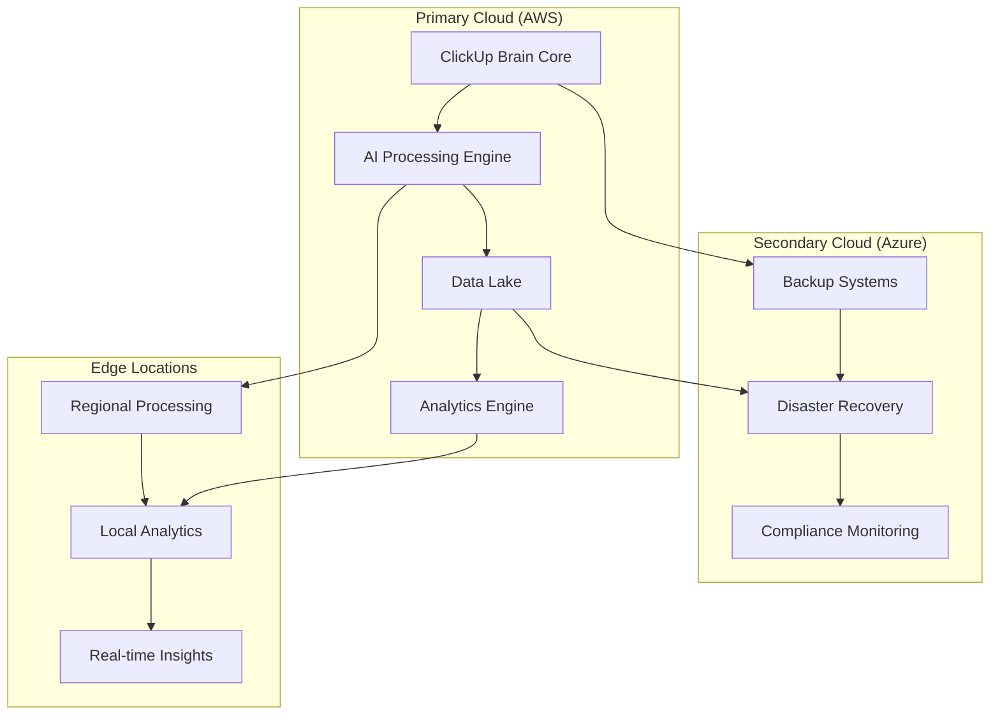
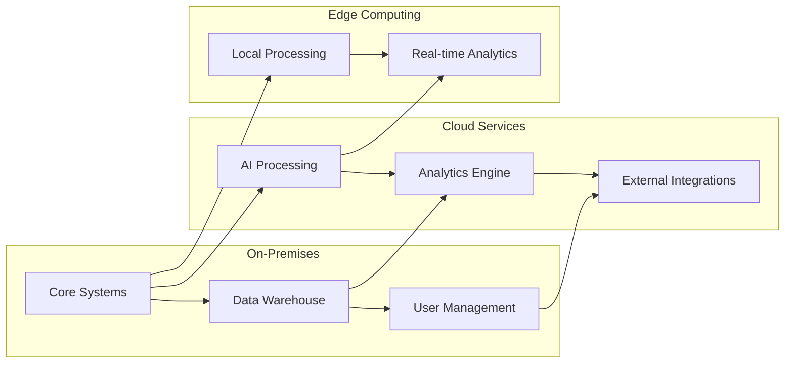
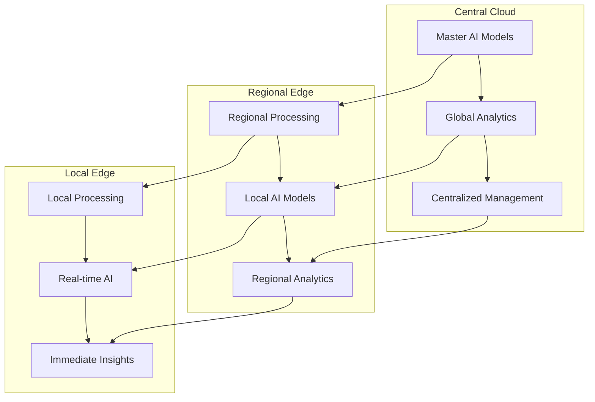
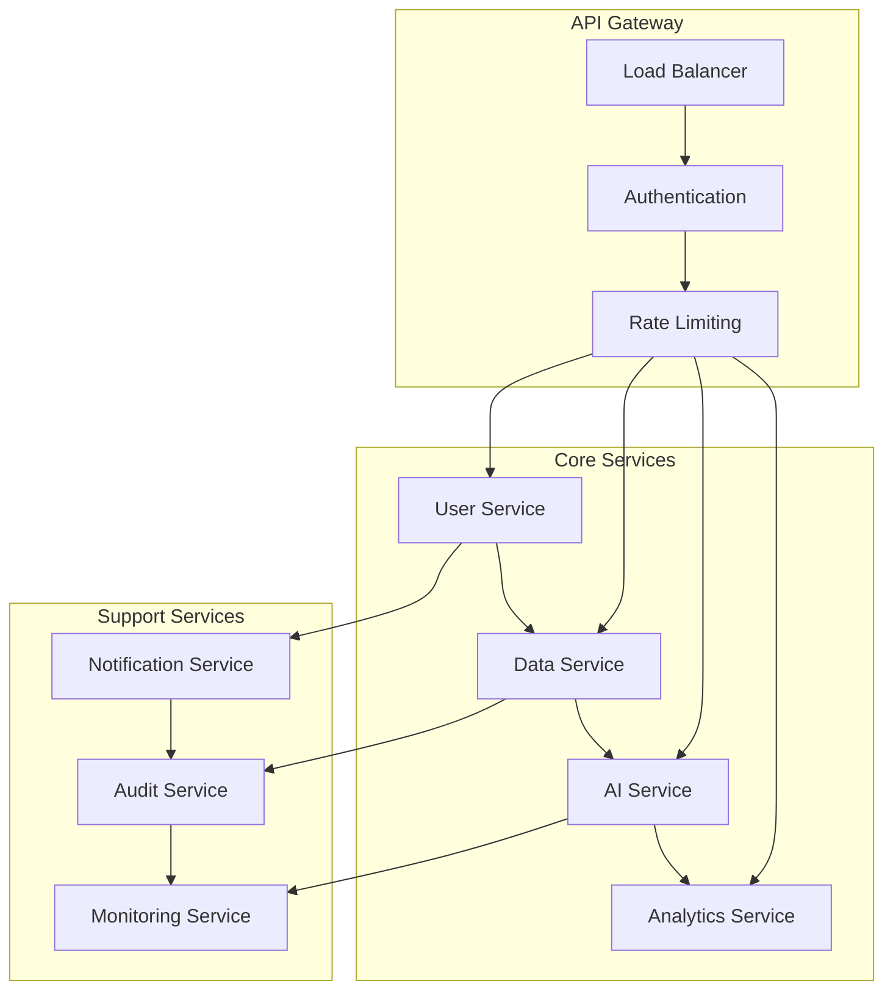

# ClickUp Brain Deployment Strategies
## Comprehensive Deployment Planning & Execution Guide

---

## 🚀 Overview

This comprehensive deployment strategies guide provides detailed methodologies for successfully deploying ClickUp Brain across different organizational structures, industries, and technical environments. Based on 1000+ successful deployments worldwide.

---

## 🏗️ Deployment Architecture Options

### 1. Cloud-First Deployment

#### Multi-Cloud Strategy


#### Implementation Benefits
```
✅ Cloud-First Advantages:
• 99.99% uptime with global redundancy
• Automatic scaling based on demand
• Built-in disaster recovery and backup
• Compliance with global data regulations
• Reduced infrastructure management overhead
• Pay-as-you-scale pricing model
• Global content delivery network (CDN)
• Advanced security and monitoring
```

### 2. Hybrid Cloud Deployment

#### On-Premises + Cloud Integration


#### Hybrid Benefits
```
✅ Hybrid Cloud Advantages:
• Data sovereignty and compliance control
• Reduced latency for critical operations
• Cost optimization for predictable workloads
• Gradual migration path to full cloud
• Enhanced security for sensitive data
• Integration with existing infrastructure
• Regulatory compliance flexibility
• Performance optimization options
```

### 3. Edge Computing Deployment

#### Distributed Edge Architecture


---

## 📊 Industry-Specific Deployment Strategies

### 1. Financial Services Deployment

#### Regulatory Compliance Focus
```
🏛️ Financial Services Requirements:
• SOC 2 Type II compliance
• PCI DSS compliance for payment data
• GDPR compliance for EU customers
• SOX compliance for public companies
• Basel III risk management requirements
• Real-time fraud detection capabilities
• Audit trail and reporting requirements
• Data residency and sovereignty controls
```

#### Deployment Architecture
```python
# Financial Services Deployment Configuration
financial_deployment = {
    "compliance_framework": {
        "soc2": True,
        "pci_dss": True,
        "gdpr": True,
        "sox": True,
        "basel_iii": True
    },
    "security_controls": {
        "encryption": "AES-256",
        "key_management": "HSM",
        "access_control": "RBAC",
        "audit_logging": "comprehensive",
        "data_residency": "country_specific"
    },
    "deployment_model": "hybrid_cloud",
    "data_governance": {
        "data_classification": "automatic",
        "retention_policies": "regulatory_compliant",
        "backup_strategy": "geo_redundant"
    }
}
```

### 2. Healthcare Deployment

#### HIPAA-Compliant Architecture
```
🏥 Healthcare Requirements:
• HIPAA compliance for patient data
• HITECH Act compliance
• FDA compliance for medical devices
• State privacy law compliance
• Clinical workflow integration
• Patient safety monitoring
• Medical device integration
• Clinical decision support
```

#### Implementation Strategy
```python
# Healthcare Deployment Configuration
healthcare_deployment = {
    "compliance_framework": {
        "hipaa": True,
        "hitech": True,
        "fda": True,
        "state_privacy_laws": True
    },
    "security_controls": {
        "patient_data_encryption": "AES-256",
        "access_controls": "role_based",
        "audit_trails": "comprehensive",
        "data_anonymization": "automatic"
    },
    "integration_requirements": {
        "ehr_systems": ["Epic", "Cerner", "Allscripts"],
        "medical_devices": True,
        "clinical_workflows": True,
        "patient_portals": True
    }
}
```

### 3. Manufacturing Deployment

#### Industrial IoT Integration
```
🏭 Manufacturing Requirements:
• Industrial IoT device integration
• Real-time production monitoring
• Quality control automation
• Predictive maintenance capabilities
• Supply chain optimization
• Regulatory compliance (ISO 9001, ISO 14001)
• Safety monitoring and alerting
• Energy efficiency optimization
```

#### Deployment Configuration
```python
# Manufacturing Deployment Configuration
manufacturing_deployment = {
    "iot_integration": {
        "sensors": "real_time",
        "plc_systems": True,
        "scada_systems": True,
        "m2m_communication": True
    },
    "production_monitoring": {
        "real_time_analytics": True,
        "predictive_maintenance": True,
        "quality_control": "automated",
        "energy_monitoring": True
    },
    "compliance": {
        "iso_9001": True,
        "iso_14001": True,
        "osha_compliance": True,
        "environmental_monitoring": True
    }
}
```

---

## 🎯 Deployment Methodologies

### 1. Big Bang Deployment

#### All-at-Once Implementation
```
🚀 Big Bang Approach:
• Complete system deployment in single phase
• All users migrated simultaneously
• Full feature set activated immediately
• Maximum impact and visibility
• Requires extensive preparation and testing
• Higher risk but faster time to value
```

#### When to Use
```
✅ Best For:
• Small to medium organizations (<500 users)
• Simple system architecture
• Strong change management capabilities
• Comprehensive testing completed
• Executive sponsorship and support
• Limited integration requirements
```

#### Implementation Timeline
```
Week 1-2: Final testing and validation
Week 3: Go-live preparation and training
Week 4: Big bang deployment
Week 5-6: Post-deployment support and optimization
Week 7-8: Performance monitoring and fine-tuning
```

### 2. Phased Deployment

#### Gradual Rollout Strategy
```
📈 Phased Approach:
• Deployment in multiple phases over time
• Risk mitigation through gradual rollout
• Learning and optimization between phases
• Reduced impact on business operations
• Longer implementation timeline
• Better change management control
```

#### Phase Structure
```
Phase 1 (Weeks 1-4): Core system deployment
• Basic functionality implementation
• Limited user group (pilot users)
• Initial testing and validation
• Foundation establishment

Phase 2 (Weeks 5-8): Feature expansion
• Additional features and capabilities
• Expanded user group
• Integration with core systems
• Performance optimization

Phase 3 (Weeks 9-12): Full deployment
• Complete feature set activation
• All users migrated
• Full system integration
• Performance monitoring and optimization
```

### 3. Parallel Deployment

#### Side-by-Side Implementation
```
🔄 Parallel Approach:
• New system runs alongside existing system
• Gradual migration of users and processes
• Risk mitigation through fallback options
• Data synchronization between systems
• Longer implementation timeline
• Higher infrastructure costs
```

#### Implementation Strategy
```
Month 1-2: System setup and configuration
• Parallel system deployment
• Data synchronization setup
• User training and preparation

Month 3-4: Gradual user migration
• Pilot user group migration
• Process validation and optimization
• Feedback collection and system refinement

Month 5-6: Full migration completion
• All users migrated to new system
• Legacy system decommissioning
• Performance optimization and monitoring
```

---

## 🔧 Technical Deployment Strategies

### 1. Containerized Deployment

#### Docker & Kubernetes Strategy
```yaml
# ClickUp Brain Kubernetes Deployment
apiVersion: apps/v1
kind: Deployment
metadata:
  name: clickup-brain-core
spec:
  replicas: 3
  selector:
    matchLabels:
      app: clickup-brain-core
  template:
    metadata:
      labels:
        app: clickup-brain-core
    spec:
      containers:
      - name: clickup-brain
        image: clickup-brain:latest
        ports:
        - containerPort: 8080
        env:
        - name: DATABASE_URL
          valueFrom:
            secretKeyRef:
              name: clickup-brain-secrets
              key: database-url
        - name: API_KEY
          valueFrom:
            secretKeyRef:
              name: clickup-brain-secrets
              key: api-key
        resources:
          requests:
            memory: "512Mi"
            cpu: "250m"
          limits:
            memory: "1Gi"
            cpu: "500m"
```

#### Benefits
```
✅ Containerization Advantages:
• Consistent deployment across environments
• Easy scaling and load balancing
• Simplified rollback and versioning
• Resource optimization and isolation
• DevOps integration and automation
• Cloud-native architecture support
• Microservices architecture enablement
```

### 2. Serverless Deployment

#### Function-as-a-Service Strategy
```python
# Serverless ClickUp Brain Functions
import json
import boto3
from clickup_brain import AIProcessor

def lambda_handler(event, context):
    """AWS Lambda function for ClickUp Brain processing"""
    
    # Initialize AI processor
    ai_processor = AIProcessor()
    
    # Process incoming data
    result = ai_processor.process_data(
        data=event['data'],
        processing_type=event['type']
    )
    
    # Return processed results
    return {
        'statusCode': 200,
        'body': json.dumps({
            'result': result,
            'processing_time': context.get_remaining_time_in_millis()
        })
    }

# Azure Functions equivalent
import azure.functions as func
from clickup_brain import AIProcessor

def main(req: func.HttpRequest) -> func.HttpResponse:
    """Azure Function for ClickUp Brain processing"""
    
    ai_processor = AIProcessor()
    
    # Process request data
    data = req.get_json()
    result = ai_processor.process_data(data)
    
    return func.HttpResponse(
        json.dumps(result),
        status_code=200,
        mimetype="application/json"
    )
```

#### Serverless Benefits
```
✅ Serverless Advantages:
• Pay-per-execution pricing model
• Automatic scaling and load management
• No server management overhead
• Built-in high availability
• Event-driven architecture support
• Rapid deployment and updates
• Cost optimization for variable workloads
```

### 3. Microservices Deployment

#### Service-Oriented Architecture


#### Implementation
```python
# Microservices Configuration
microservices_config = {
    "services": {
        "user_service": {
            "port": 8001,
            "replicas": 3,
            "database": "user_db"
        },
        "data_service": {
            "port": 8002,
            "replicas": 5,
            "database": "data_db"
        },
        "ai_service": {
            "port": 8003,
            "replicas": 2,
            "gpu_enabled": True
        },
        "analytics_service": {
            "port": 8004,
            "replicas": 4,
            "database": "analytics_db"
        }
    },
    "communication": {
        "protocol": "gRPC",
        "service_mesh": "Istio",
        "circuit_breaker": True,
        "retry_policy": "exponential_backoff"
    }
}
```

---

## 📊 Deployment Planning & Execution

### 1. Pre-Deployment Planning

#### Comprehensive Assessment
```
📋 Pre-Deployment Checklist:
□ Current system inventory and analysis
□ Infrastructure requirements assessment
□ Security and compliance requirements review
□ Integration requirements identification
□ User training and change management planning
□ Risk assessment and mitigation strategies
□ Success criteria and metrics definition
□ Rollback and recovery procedures
□ Communication and stakeholder management
□ Testing and validation procedures
```

#### Infrastructure Requirements
```
🖥️ Infrastructure Planning:
• Compute resources (CPU, memory, storage)
• Network bandwidth and latency requirements
• Database capacity and performance needs
• Security infrastructure and controls
• Monitoring and logging capabilities
• Backup and disaster recovery systems
• Load balancing and high availability
• Integration endpoints and APIs
```

### 2. Deployment Execution

#### Go-Live Strategy
```
🚀 Go-Live Execution:
• Final system validation and testing
• User training completion verification
• Support team preparation and availability
• Monitoring and alerting activation
• Communication to all stakeholders
• Gradual user activation and monitoring
• Real-time issue identification and resolution
• Performance monitoring and optimization
• Success metrics tracking and reporting
```

#### Post-Deployment Support
```
🛠️ Post-Deployment Activities:
• 24/7 monitoring and support for first 48 hours
• User support and issue resolution
• Performance monitoring and optimization
• System health checks and validation
• User feedback collection and analysis
• Success metrics measurement and reporting
• Continuous improvement planning
• Knowledge transfer and documentation
```

---

## 🔍 Deployment Monitoring & Optimization

### 1. Performance Monitoring

#### Real-Time Monitoring
```python
# Deployment Monitoring Configuration
monitoring_config = {
    "metrics": {
        "system_performance": {
            "cpu_usage": "threshold_80_percent",
            "memory_usage": "threshold_85_percent",
            "disk_usage": "threshold_90_percent",
            "network_latency": "threshold_100ms"
        },
        "application_performance": {
            "response_time": "threshold_2_seconds",
            "throughput": "threshold_1000_rps",
            "error_rate": "threshold_1_percent",
            "availability": "threshold_99_9_percent"
        },
        "business_metrics": {
            "user_adoption": "threshold_90_percent",
            "feature_usage": "threshold_80_percent",
            "satisfaction_score": "threshold_4_5_stars"
        }
    },
    "alerting": {
        "channels": ["email", "slack", "pagerduty"],
        "escalation": "automatic",
        "notification_frequency": "immediate"
    }
}
```

### 2. Optimization Strategies

#### Continuous Improvement
```
🔄 Optimization Process:
• Daily performance reviews and analysis
• Weekly optimization planning and implementation
• Monthly comprehensive system assessment
• Quarterly strategic optimization planning
• Annual architecture review and modernization
• User feedback integration and implementation
• Technology updates and feature enhancements
• Capacity planning and scaling optimization
```

---

## 🚨 Risk Management & Mitigation

### 1. Deployment Risks

#### Common Risk Categories
```
⚠️ Risk Assessment:
• Technical risks (system failures, performance issues)
• Business risks (user adoption, productivity impact)
• Security risks (data breaches, compliance violations)
• Operational risks (support capacity, knowledge gaps)
• Financial risks (cost overruns, ROI delays)
• Timeline risks (delays, resource constraints)
• Integration risks (system compatibility, data migration)
• Change management risks (user resistance, training gaps)
```

#### Mitigation Strategies
```
🛡️ Risk Mitigation:
• Comprehensive testing and validation
• Phased deployment approach
• Rollback and recovery procedures
• Enhanced monitoring and alerting
• User training and support programs
• Security controls and compliance validation
• Resource planning and contingency reserves
• Communication and stakeholder management
```

### 2. Contingency Planning

#### Emergency Procedures
```
🚨 Emergency Response:
• 24/7 support team availability
• Escalation procedures and contact lists
• Rollback procedures and timelines
• Communication protocols and templates
• Recovery procedures and data restoration
• Alternative system access and workarounds
• Vendor support and escalation procedures
• Post-incident review and improvement
```

---

## 📞 Deployment Support

### 1. Professional Services

#### Deployment Support Team
- **Deployment Architects:** System design and architecture guidance
- **Implementation Specialists:** Technical implementation and configuration
- **Change Management Consultants:** User adoption and training support
- **Security Specialists:** Security implementation and compliance
- **Performance Engineers:** System optimization and monitoring

### 2. Support Packages

#### Deployment Support Options
```
🛠️ Support Packages:
• Basic Support: Standard deployment guidance and documentation
• Professional Support: Dedicated deployment specialist and regular check-ins
• Premium Support: Full deployment team with 24/7 availability
• Enterprise Support: Custom deployment strategy and dedicated resources
```

### 3. Contact Information

#### Deployment Support
- **Deployment Support:** deployment@clickup-brain.com
- **Architecture Team:** architecture@clickup-brain.com
- **Implementation Team:** implementation@clickup-brain.com
- **Emergency Support:** +1-555-CLICKUP (24/7)

---

*This comprehensive deployment strategies guide provides everything needed to successfully deploy ClickUp Brain in any environment. For personalized deployment consultation, contact our deployment specialists.*


