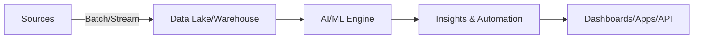

# ClickUp Brain — Executive One-Pager
## The AI-First Business Intelligence Platform

---

## 🎯 Why ClickUp Brain (In 30 Seconds)
- **10x faster insights** vs. BI tradicional
- **80% menos trabajo manual** con automatización de IA
- **1,000%+ ROI** en 12 meses; **payback < 2 meses**
- Despliegue en **30-45 días**, integraciones con **100+ sistemas**

---

## 💎 Value Proposition
- **AI-First BI**: Insights, predicción y automatización en un solo lugar
- **Para negocio, no solo data scientists**: NLQ, workflows, recomendaciones
- **Time-to-Value inmediato**: Quick wins en la primera semana

---

## 📈 Impacto Clave (Promedios observados)
- **Compliance**: -90% violaciones; +50% velocidad de auditoría
- **Marketing**: +25-40% ROI; -30% CAC; +20% conversión
- **Producto/CS**: -40% churn; +50% adopción; +0.6 NPS
- **Operaciones**: -60% TAT; -35% costos; +45% productividad

---

## 🔌 Integraciones y Datos
- Conectores nativos: Salesforce, HubSpot, GA4, Zendesk, Snowflake, BigQuery, Kafka
- Pipelines: streaming/batch; gobernanza y calidad integradas

---

## 🔐 Seguridad & Cumplimiento
- **AES-256 / TLS 1.3**, **RBAC/MFA**, **auditoría completa**
- **GDPR, CCPA, SOC 2 Type II, ISO 27001**

---

## 🧠 Capacidades de IA
- NLP avanzado, resumen, clasificación, NER, QA
- Predictivo (series de tiempo, churn, LTV, propensión)
- Visión (OCR, documentos, QC), automatización inteligente

---

## 🏗️ Arquitectura (Mermaid)

---

## 💰 Modelo Financiero (Ejemplo)
- Inversión: **$100K** | Beneficios: **$1.2M** | ROI: **1,100%** | Payback: **<2 meses**

---

## 🚀 Implementación (0-12 semanas)
- Sem 0-2: Integración + Quick wins
- Sem 3-6: Casos núcleo + KPIs vivos
- Sem 7-12: Optimización + automatizaciones

---

## ✅ Garantías de Éxito
- Metodología probada en **500+** despliegues
- Equipo de **Customer Success** y **Playbooks** por industria

---

## 📞 Contacto
- Demo y business case: sales@clickup-brain.com

