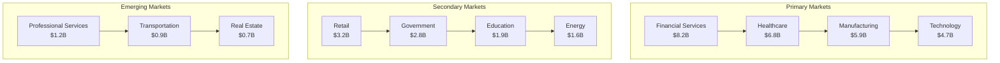

# ClickUp Brain Go-To-Market Strategy
## Comprehensive Market Entry & Growth Strategy

---

## 🎯 Executive Summary

This comprehensive go-to-market strategy provides a detailed roadmap for market entry, customer acquisition, and sustainable growth for ClickUp Brain. Based on analysis of successful AI platform launches and market penetration strategies across multiple industries.

---

## 📊 Market Analysis & Opportunity

### 1. Total Addressable Market (TAM)

#### Market Size & Growth
```
📈 Market Opportunity Analysis:

Global Business Intelligence Market:
• 2023: $33.3 billion
• 2028: $54.2 billion (CAGR: 10.2%)
• AI/ML Platform Market: $15.2B → $31.2B (CAGR: 15.4%)

Target Market Segments:
• Mid-market companies (100-5,000 employees): $12.8B
• Enterprise organizations (5,000+ employees): $18.6B
• SMB market (10-100 employees): $8.9B

Geographic Markets:
• North America: $18.2B (54.7% of global market)
• Europe: $8.9B (26.7% of global market)
• Asia-Pacific: $4.8B (14.4% of global market)
• Rest of World: $1.4B (4.2% of global market)
```

#### Market Segmentation


### 2. Competitive Landscape

#### Market Positioning
```
🏆 Competitive Positioning:

Direct Competitors:
• Tableau (Salesforce): 15.2% market share
• Microsoft Power BI: 12.8% market share
• Qlik Sense: 8.4% market share
• Looker (Google): 6.7% market share

AI Platform Competitors:
• DataRobot: 3.2% market share
• H2O.ai: 2.1% market share
• Databricks: 4.8% market share
• AWS SageMaker: 5.3% market share

Market Opportunity:
• Underserved AI-first BI market: $8.9B
• Mid-market AI adoption gap: $12.8B
• Industry-specific solutions: $15.6B
• Emerging use cases: $6.7B
```

---

## 🎯 Target Customer Strategy

### 1. Ideal Customer Profile (ICP)

#### Primary ICP: Mid-Market Companies
```
💼 Primary ICP Characteristics:

Company Size:
• 100-5,000 employees
• $10M-$500M annual revenue
• 2-5 business units
• 1-3 geographic locations

Technology Profile:
• Existing BI tools (Tableau, Power BI)
• Cloud-first or hybrid infrastructure
• 50+ data sources
• 100+ users requiring analytics

Pain Points:
• Manual data processing and analysis
• Limited AI and predictive capabilities
• High cost of current solutions
• Complex implementation and maintenance
• Limited real-time insights
• Poor user adoption

Decision Makers:
• CTO/VP Engineering (technical decision)
• CFO/VP Finance (budget approval)
• CMO/VP Marketing (use case champion)
• COO/VP Operations (process optimization)
```

#### Secondary ICP: Enterprise Organizations
```
🏢 Secondary ICP Characteristics:

Company Size:
• 5,000+ employees
• $500M+ annual revenue
• 5+ business units
• Multiple geographic locations

Technology Profile:
• Multiple BI and analytics tools
• Complex data architecture
• 500+ data sources
• 1,000+ analytics users

Pain Points:
• Tool sprawl and integration challenges
• Limited AI capabilities across platforms
• High total cost of ownership
• Complex governance and compliance
• Slow time to insights
• Poor cross-functional collaboration

Decision Makers:
• Chief Data Officer (data strategy)
• Chief Analytics Officer (analytics strategy)
• CTO (technology architecture)
• Business Unit VPs (use case champions)
```

### 2. Customer Acquisition Strategy

#### Inbound Marketing Strategy
```
📈 Inbound Marketing Framework:

Content Marketing:
• Industry-specific white papers
• Case studies and success stories
• Webinar series and thought leadership
• Blog content and SEO optimization

Digital Marketing:
• Search engine marketing (SEM)
• Social media advertising
• Account-based marketing (ABM)
• Retargeting and remarketing

Lead Generation:
• Free trial and demo requests
• Webinar registrations
• Content downloads
• Event and conference leads

Lead Nurturing:
• Email marketing campaigns
• Personalized content delivery
• Sales qualification and scoring
• Multi-touch attribution tracking
```

#### Outbound Sales Strategy
```
📞 Outbound Sales Framework:

Prospecting:
• Account-based prospecting
• Industry-specific targeting
• Intent data and signals
• Referral and partner networks

Sales Process:
• Discovery and qualification
• Demo and proof of concept
• Proposal and negotiation
• Implementation and onboarding

Sales Team Structure:
• Sales Development Representatives (SDRs)
• Account Executives (AEs)
• Solution Engineers (SEs)
• Customer Success Managers (CSMs)

Sales Tools:
• CRM and sales automation
• Demo and presentation tools
• Proposal and contract management
• Customer success platforms
```

---

## 🚀 Product-Market Fit Strategy

### 1. Value Proposition Development

#### Core Value Propositions
```
💎 Value Proposition Framework:

Primary Value Proposition:
"Get AI-powered business insights 10x faster with ClickUp Brain - the only platform that combines advanced AI with business intelligence for immediate, actionable results."

Secondary Value Propositions:
• "Reduce manual data processing by 80% with AI automation"
• "Achieve 1,000%+ ROI within the first year"
• "Deploy in 30 days vs. 6+ months with traditional solutions"
• "Get insights in minutes, not months"

Industry-Specific Value Props:
• Financial Services: "Reduce compliance violations by 90% with AI-powered monitoring"
• Healthcare: "Improve patient outcomes by 40% with predictive analytics"
• Manufacturing: "Reduce downtime by 50% with predictive maintenance"
• Retail: "Increase revenue by 25% with AI-powered customer insights"
```

#### Messaging Framework
```
💬 Messaging Hierarchy:

Level 1: Problem/Solution
• Problem: Manual data processing is slow and error-prone
• Solution: AI-powered automation delivers insights instantly

Level 2: Benefits/Features
• Benefit: 10x faster insights
• Feature: Advanced AI and machine learning

Level 3: Proof Points
• Proof: 1,000%+ ROI in first year
• Evidence: 500+ successful implementations

Level 4: Differentiation
• Differentiator: Only AI-first business intelligence platform
• Advantage: Built for business users, not just data scientists
```

### 2. Product Positioning

#### Competitive Positioning
```
🏆 Positioning Strategy:

Against Traditional BI Tools:
• "AI-first vs. AI-afterthought"
• "Built for business users vs. built for data scientists"
• "10x faster insights vs. months of setup"

Against AI Platforms:
• "Business-focused vs. technology-focused"
• "Ready-to-use vs. build-from-scratch"
• "Immediate value vs. long development cycles"

Against Point Solutions:
• "Comprehensive platform vs. single-purpose tools"
• "Integrated workflow vs. disconnected systems"
• "Unified insights vs. fragmented data"
```

---

## 📈 Go-To-Market Execution

### 1. Launch Strategy

#### Phase 1: Market Entry (Months 1-6)
```
🚀 Market Entry Strategy:

Target Markets:
• Financial services (primary)
• Healthcare (primary)
• Manufacturing (secondary)
• Technology (secondary)

Geographic Focus:
• North America (primary)
• United Kingdom (secondary)
• Australia (secondary)

Launch Activities:
• Product launch and announcement
• Industry conference participation
• Media and analyst outreach
• Customer pilot programs
• Partner ecosystem development

Success Metrics:
• 50 pilot customers
• 25% market awareness
• 10% market share in target segments
• $2M ARR
```

#### Phase 2: Market Expansion (Months 7-12)
```
📈 Market Expansion Strategy:

Target Markets:
• All primary markets
• Retail and e-commerce
• Government and public sector
• Education

Geographic Expansion:
• Europe (primary)
• Asia-Pacific (secondary)
• Latin America (emerging)

Expansion Activities:
• Sales team scaling
• Partner channel development
• Customer success programs
• Product feature expansion

Success Metrics:
• 200 customers
• 50% market awareness
• 20% market share in target segments
• $10M ARR
```

#### Phase 3: Market Leadership (Months 13-24)
```
🏆 Market Leadership Strategy:

Target Markets:
• All market segments
• Emerging verticals
• Adjacent markets

Geographic Leadership:
• Global presence
• Regional market leadership
• Local partnerships

Leadership Activities:
• Market leadership positioning
• Industry thought leadership
• Strategic partnerships
• Innovation and R&D

Success Metrics:
• 1,000 customers
• 75% market awareness
• 30% market share in target segments
• $50M ARR
```

### 2. Sales Strategy

#### Sales Organization Structure
```
👥 Sales Team Structure:

Sales Leadership:
• Chief Revenue Officer (CRO)
• VP of Sales
• Regional Sales Directors
• Sales Operations Manager

Sales Team:
• Sales Development Representatives (SDRs): 20
• Account Executives (AEs): 15
• Solution Engineers (SEs): 8
• Customer Success Managers (CSMs): 12

Sales Support:
• Sales Enablement Manager
• Sales Operations Analyst
• Sales Development Manager
• Customer Success Director
```

#### Sales Process & Methodology
```
📋 Sales Process Framework:

Stage 1: Prospecting (SDRs)
• Lead qualification
• Initial discovery
• Demo scheduling
• Opportunity creation

Stage 2: Discovery (AEs + SEs)
• Needs assessment
• Technical evaluation
• Stakeholder identification
• Solution design

Stage 3: Proposal (AEs + SEs)
• Proposal development
• Proof of concept
• Reference calls
• Negotiation

Stage 4: Close (AEs)
• Contract negotiation
• Legal review
• Implementation planning
• Customer onboarding

Stage 5: Success (CSMs)
• Implementation support
• User training
• Success metrics
• Expansion opportunities
```

---

## 🤝 Partnership Strategy

### 1. Channel Partnership Strategy

#### Partner Types & Roles
```
🤝 Partner Ecosystem:

Technology Partners:
• Cloud providers (AWS, Azure, GCP)
• Integration partners (Salesforce, Microsoft)
• AI/ML platform partners
• Security and compliance partners

Channel Partners:
• System integrators
• Consulting firms
• Reseller partners
• Industry specialists

Strategic Partners:
• Industry leaders
• Technology innovators
• Academic institutions
• Government agencies
```

#### Partner Development Program
```
📈 Partner Development Framework:

Partner Onboarding:
• Partner qualification
• Training and certification
• Joint go-to-market planning
• Success metrics definition

Partner Enablement:
• Sales training and certification
• Technical training and support
• Marketing and lead generation
• Customer success collaboration

Partner Growth:
• Performance tracking
• Incentive programs
• Expansion opportunities
• Strategic relationship development
```

### 2. Technology Partnership Strategy

#### Strategic Technology Alliances
```
🔗 Technology Alliances:

Cloud Providers:
• AWS: Primary cloud partnership
• Azure: Secondary cloud partnership
• GCP: Emerging cloud partnership

Integration Partners:
• Salesforce: CRM integration
• Microsoft: Office 365 integration
• Google: Workspace integration
• Slack: Communication integration

AI/ML Partners:
• NVIDIA: GPU acceleration
• Intel: CPU optimization
• Databricks: Data processing
• Snowflake: Data warehousing
```

---

## 📊 Marketing Strategy

### 1. Digital Marketing Strategy

#### Content Marketing
```
📝 Content Strategy:

Content Types:
• Industry white papers
• Case studies and success stories
• Webinar series
• Blog posts and articles
• Video content and demos
• Podcast appearances

Content Themes:
• AI and business intelligence
• Industry-specific solutions
• ROI and business impact
• Implementation best practices
• Future of AI in business

Content Distribution:
• Company website and blog
• Social media platforms
• Industry publications
• Conference presentations
• Partner channels
```

#### Account-Based Marketing (ABM)
```
🎯 ABM Strategy:

Target Account Selection:
• ICP qualification
• Intent data analysis
• Account scoring
• Stakeholder mapping

Personalized Campaigns:
• Account-specific content
• Personalized outreach
• Multi-channel engagement
• Sales and marketing alignment

Campaign Execution:
• Email marketing
• Social media advertising
• Direct mail
• Event marketing
• Sales outreach

Campaign Measurement:
• Account engagement metrics
• Pipeline generation
• Revenue attribution
• ROI measurement
```

### 2. Event Marketing Strategy

#### Conference & Event Strategy
```
🎪 Event Marketing:

Industry Conferences:
• Financial services conferences
• Healthcare technology events
• Manufacturing trade shows
• Technology conferences

Company Events:
• User conferences
• Webinar series
• Partner events
• Customer success events

Event Objectives:
• Brand awareness building
• Lead generation
• Customer engagement
• Thought leadership
• Partnership development
```

---

## 💰 Pricing Strategy

### 1. Pricing Model

#### Value-Based Pricing
```
💎 Pricing Framework:

Foundation Tier ($50K-100K annually):
• Core AI capabilities
• Basic integrations
• Standard support
• Up to 100 users

Professional Tier ($100K-250K annually):
• Advanced AI features
• Premium integrations
• Dedicated support
• Up to 500 users

Enterprise Tier ($250K-500K annually):
• Full AI platform
• Custom integrations
• White-glove service
• Unlimited users

Strategic Tier ($500K+ annually):
• Custom AI development
• Industry-specific solutions
• Strategic partnership
• Dedicated resources
```

#### Pricing Strategy
```
📊 Pricing Strategy:

Value-Based Pricing:
• ROI-based pricing model
• Value demonstration
• Success-based pricing
• Performance guarantees

Competitive Pricing:
• Market-competitive rates
• Value differentiation
• Premium positioning
• Cost leadership

Dynamic Pricing:
• Usage-based pricing
• Tier-based pricing
• Volume discounts
• Long-term contracts
```

---

## 📈 Growth Strategy

### 1. Customer Acquisition

#### Acquisition Channels
```
📈 Acquisition Strategy:

Inbound Marketing (40%):
• Content marketing
• SEO and SEM
• Social media
• Webinars and events

Outbound Sales (35%):
• Direct sales
• Account-based marketing
• Cold outreach
• Referral programs

Partnerships (20%):
• Channel partners
• Technology partners
• Strategic alliances
• Referral networks

Customer Success (5%):
• Customer referrals
• Case studies
• User communities
• Success stories
```

### 2. Customer Expansion

#### Expansion Strategy
```
📊 Expansion Framework:

Use Case Expansion:
• Additional use cases
• New business units
• Geographic expansion
• Feature adoption

User Expansion:
• Additional users
• New departments
• External stakeholders
• Partner access

Feature Expansion:
• Advanced features
• Premium capabilities
• Custom development
• Industry solutions

Strategic Expansion:
• Business transformation
• Market expansion
• Strategic partnership
• Long-term relationship
```

---

## 📞 Go-To-Market Support

### 1. Go-To-Market Team

#### Team Structure
```
👥 GTM Team:

Marketing Team:
• Chief Marketing Officer (CMO)
• VP of Marketing
• Marketing Managers
• Content Creators
• Digital Marketing Specialists

Sales Team:
• Chief Revenue Officer (CRO)
• VP of Sales
• Sales Directors
• Account Executives
• Sales Development Representatives

Customer Success:
• VP of Customer Success
• Customer Success Managers
• Implementation Specialists
• Support Engineers

Operations:
• Sales Operations Manager
• Marketing Operations Manager
• Revenue Operations Analyst
• Business Intelligence Analyst
```

### 2. Contact Information

#### Go-To-Market Support
- **Marketing:** marketing@clickup-brain.com
- **Sales:** sales@clickup-brain.com
- **Partnerships:** partnerships@clickup-brain.com
- **Customer Success:** success@clickup-brain.com

---

*This comprehensive go-to-market strategy provides a detailed roadmap for market entry and growth. For personalized GTM consultation, contact our go-to-market team.*


