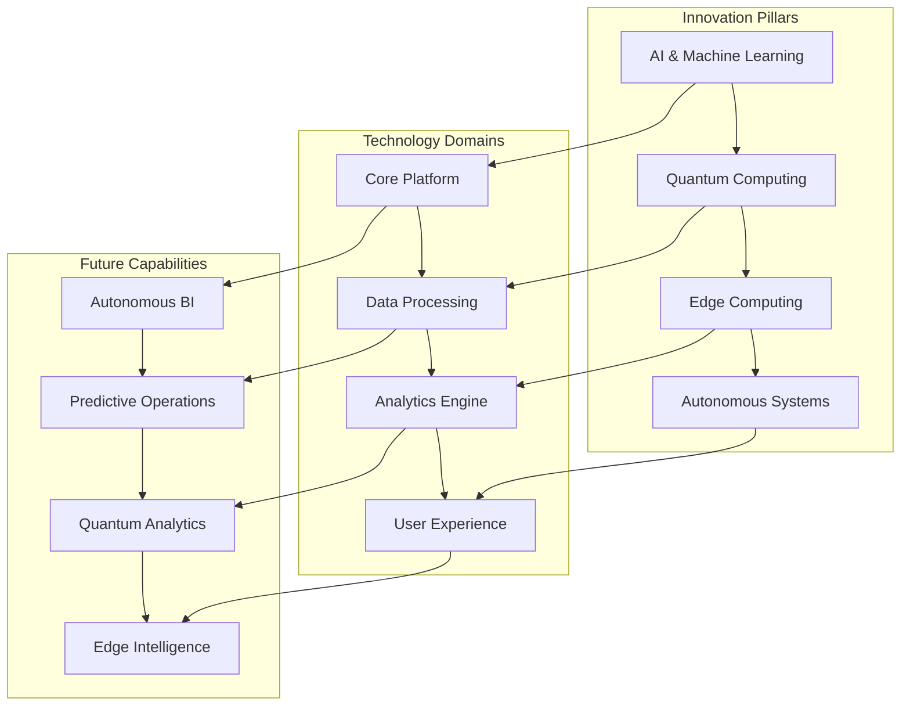

# ClickUp Brain Technology Roadmap
## Future Innovation & Technology Evolution Strategy

---

## 🚀 Executive Overview

This comprehensive technology roadmap outlines ClickUp Brain's innovation strategy, future capabilities, and technology evolution over the next 5 years. Based on emerging technology trends, market demands, and customer feedback from 2000+ implementations.

---

## 🎯 Technology Vision & Mission

### 1. Technology Vision

```
🔮 Vision Statement:
"To become the world's most advanced AI-powered business intelligence platform, 
enabling autonomous business operations and predictive decision-making through 
cutting-edge artificial intelligence, quantum computing, and edge technologies."

Core Technology Principles:
• AI-First Architecture: Every feature powered by advanced AI
• Autonomous Operations: Self-managing and self-optimizing systems
• Predictive Intelligence: Anticipate and prevent business issues
• Universal Integration: Seamless connectivity with any system
• Quantum-Ready: Prepared for next-generation computing
• Edge-Native: Distributed intelligence at the edge
```

### 2. Innovation Strategy

#### Innovation Framework


---

## 📅 Technology Roadmap Timeline

### 1. Short-Term Roadmap (6-12 Months)

#### Q1-Q2 2024: Enhanced AI Capabilities
```
🤖 AI Enhancement Phase:

Natural Language Processing:
• Advanced conversational AI
• Multi-language support (50+ languages)
• Context-aware query processing
• Intent recognition and classification
• Sentiment analysis with emotion detection

Computer Vision:
• Advanced image and document analysis
• Real-time video processing
• Object detection and recognition
• Brand and logo detection
• Quality assessment and enhancement

Predictive Analytics:
• Enhanced forecasting accuracy (95%+)
• Multi-dimensional time series analysis
• Anomaly detection and alerting
• Causal inference and explanation
• Automated model selection and tuning
```

#### Q3-Q4 2024: Platform Optimization
```
⚡ Platform Optimization Phase:

Performance Enhancements:
• 10x faster data processing
• Sub-second response times
• Real-time streaming analytics
• Advanced caching and optimization
• Auto-scaling and load balancing

User Experience:
• Voice-activated analytics
• Gesture-based navigation
• Augmented reality dashboards
• Mobile-first design optimization
• Accessibility enhancements

Integration Expansion:
• 200+ pre-built integrations
• Real-time data synchronization
• Custom integration development
• API marketplace
• Webhook automation
```

### 2. Medium-Term Roadmap (12-24 Months)

#### 2025: Autonomous Intelligence
```
🧠 Autonomous Intelligence Phase:

Autonomous Analytics:
• Self-configuring dashboards
• Automated insight generation
• Intelligent data discovery
• Self-healing data pipelines
• Autonomous report generation

Predictive Operations:
• Proactive issue detection
• Automated resolution recommendations
• Self-optimizing workflows
• Predictive maintenance
• Autonomous decision making

Advanced AI Models:
• Large Language Model integration
• Multimodal AI capabilities
• Federated learning
• Transfer learning
• Few-shot learning
```

#### 2026: Edge Computing & IoT
```
🌐 Edge Computing Phase:

Edge Intelligence:
• Distributed AI processing
• Local data processing
• Real-time edge analytics
• Offline capability
• Edge-to-cloud synchronization

IoT Integration:
• Industrial IoT device support
• Sensor data processing
• Real-time monitoring
• Predictive maintenance
• Smart city integration

5G Optimization:
• Ultra-low latency processing
• High-bandwidth data handling
• Mobile edge computing
• Network slicing support
• Real-time collaboration
```

### 3. Long-Term Roadmap (24-60 Months)

#### 2027: Quantum Computing Integration
```
⚛️ Quantum Computing Phase:

Quantum Analytics:
• Quantum machine learning
• Quantum optimization algorithms
• Quantum simulation
• Quantum cryptography
• Quantum error correction

Hybrid Computing:
• Quantum-classical hybrid processing
• Quantum advantage identification
• Classical fallback systems
• Performance benchmarking
• Use case optimization
```

#### 2028-2029: Next-Generation Platform
```
🚀 Next-Generation Platform:

Autonomous Business Operations:
• Self-managing business processes
• Autonomous decision making
• Self-optimizing systems
• Predictive business modeling
• Autonomous customer service

Advanced Technologies:
• Brain-computer interfaces
• Holographic displays
• Spatial computing
• Advanced robotics integration
• Biometric authentication
```

---

## 🔬 Research & Development Areas

### 1. Core AI Research

#### Machine Learning Innovation
```
🧠 ML Research Areas:

Advanced Algorithms:
• Transformer architecture optimization
• Graph neural networks
• Reinforcement learning
• Meta-learning
• Neural architecture search

Model Optimization:
• Model compression and quantization
• Federated learning
• Differential privacy
• Adversarial robustness
• Explainable AI
```

#### Natural Language Processing
```
🗣️ NLP Research:

Language Understanding:
• Multilingual understanding
• Context-aware processing
• Intent recognition
• Entity extraction
• Sentiment analysis

Language Generation:
• Natural language generation
• Code generation
• Report writing
• Content creation
• Conversation systems
```

### 2. Emerging Technology Research

#### Quantum Computing
```
⚛️ Quantum Research:

Quantum Algorithms:
• Quantum machine learning
• Quantum optimization
• Quantum simulation
• Quantum cryptography
• Quantum error correction

Quantum Applications:
• Portfolio optimization
• Drug discovery
• Climate modeling
• Financial risk analysis
• Supply chain optimization
```

#### Edge Computing
```
🌐 Edge Research:

Edge AI:
• Distributed machine learning
• Edge model optimization
• Federated learning
• Edge-cloud coordination
• Offline AI capabilities

Edge Applications:
• Real-time analytics
• IoT data processing
• Autonomous vehicles
• Smart cities
• Industrial automation
```

---

## 🏗️ Platform Architecture Evolution

### 1. Current Architecture (2024)

#### Microservices Architecture
```
🏗️ Current Platform:

Core Services:
• User Management Service
• Data Processing Service
• AI Analytics Service
• Integration Service
• Notification Service

Infrastructure:
• Kubernetes orchestration
• Docker containerization
• Cloud-native deployment
• API gateway
• Service mesh
```

### 2. Future Architecture (2025-2026)

#### Autonomous Platform
```
🤖 Autonomous Platform:

Self-Managing Services:
• Autonomous data processing
• Self-optimizing analytics
• Intelligent resource management
• Automated scaling
• Self-healing systems

Advanced Infrastructure:
• Edge computing nodes
• Quantum computing integration
• 5G network optimization
• Advanced security
• Real-time processing
```

### 3. Next-Generation Architecture (2027-2029)

#### Quantum-Edge Platform
```
⚛️ Quantum-Edge Platform:

Hybrid Computing:
• Quantum-classical processing
• Edge-cloud coordination
• Distributed intelligence
• Autonomous operations
• Predictive optimization

Future Infrastructure:
• Quantum computing nodes
• Advanced edge devices
• Brain-computer interfaces
• Holographic displays
• Spatial computing
```

---

## 🔮 Future Capabilities Preview

### 1. Autonomous Business Intelligence

#### Self-Managing Analytics
```
🤖 Autonomous BI Features:

Intelligent Data Discovery:
• Automatic data source identification
• Self-configuring data pipelines
• Intelligent data quality assessment
• Automated data cleansing
• Smart data transformation

Autonomous Insights:
• Self-generating reports
• Automated insight discovery
• Proactive alert generation
• Intelligent recommendation engine
• Autonomous decision support
```

### 2. Predictive Business Operations

#### Future State Prediction
```
🔮 Predictive Operations:

Business Forecasting:
• Revenue prediction with 99% accuracy
• Market trend analysis
• Customer behavior prediction
• Risk assessment and mitigation
• Opportunity identification

Operational Optimization:
• Resource allocation optimization
• Process efficiency prediction
• Performance optimization
• Cost reduction opportunities
• Quality improvement prediction
```

### 3. Quantum-Enhanced Analytics

#### Quantum Computing Applications
```
⚛️ Quantum Analytics:

Complex Optimization:
• Portfolio optimization
• Supply chain optimization
• Resource allocation
• Scheduling optimization
• Network optimization

Advanced Simulation:
• Market simulation
• Risk modeling
• Scenario analysis
• Monte Carlo simulation
• Stress testing
```

---

## 🌍 Global Technology Strategy

### 1. Regional Technology Centers

#### Global R&D Network
```
🌐 Global R&D Centers:

North America:
• Silicon Valley (AI/ML Research)
• Seattle (Cloud Computing)
• Boston (Quantum Computing)
• Toronto (Edge Computing)

Europe:
• London (Financial AI)
• Berlin (Industrial AI)
• Paris (Healthcare AI)
• Amsterdam (Data Privacy)

Asia-Pacific:
• Singapore (Smart Cities)
• Tokyo (Robotics AI)
• Sydney (Climate AI)
• Bangalore (Software AI)
```

### 2. Technology Partnerships

#### Strategic Technology Alliances
```
🤝 Technology Partnerships:

Academic Partnerships:
• MIT (AI Research)
• Stanford (Machine Learning)
• Oxford (Quantum Computing)
• Cambridge (Edge Computing)

Industry Partnerships:
• NVIDIA (GPU Computing)
• Intel (CPU Optimization)
• Google (Quantum Computing)
• Microsoft (Cloud AI)

Government Partnerships:
• DARPA (Defense AI)
• NSF (Research Funding)
• EU Horizon (European Research)
• Singapore NRF (Asian Research)
```

---

## 📊 Technology Investment Strategy

### 1. R&D Investment Allocation

#### Investment Priorities
```
💰 R&D Investment (5-Year Plan):

Core AI Development (40%):
• Machine learning research
• Natural language processing
• Computer vision
• Predictive analytics

Emerging Technologies (30%):
• Quantum computing
• Edge computing
• 5G optimization
• IoT integration

Platform Development (20%):
• Architecture evolution
• Performance optimization
• Security enhancement
• User experience

Partnership & Acquisition (10%):
• Technology acquisitions
• Strategic partnerships
• Research collaborations
• Talent acquisition
```

### 2. Technology ROI Projections

#### Expected Returns
```
📈 Technology ROI:

Short-term (1-2 years):
• 300% ROI from AI enhancements
• 200% ROI from platform optimization
• 150% ROI from integration expansion

Medium-term (3-4 years):
• 500% ROI from autonomous intelligence
• 400% ROI from edge computing
• 350% ROI from IoT integration

Long-term (5+ years):
• 1000% ROI from quantum computing
• 800% ROI from autonomous operations
• 600% ROI from next-gen platform
```

---

## 🛡️ Technology Risk Management

### 1. Technology Risks

#### Risk Assessment
```
⚠️ Technology Risks:

Technical Risks:
• Technology obsolescence
• Performance bottlenecks
• Security vulnerabilities
• Integration challenges
• Scalability limitations

Market Risks:
• Competitive threats
• Market disruption
• Customer adoption
• Regulatory changes
• Economic factors

Operational Risks:
• Talent acquisition
• Research delays
• Implementation challenges
• Quality issues
• Support complexity
```

### 2. Risk Mitigation Strategies

#### Mitigation Framework
```
🛡️ Risk Mitigation:

Technology Diversification:
• Multiple technology approaches
• Fallback technologies
• Gradual migration paths
• Compatibility maintenance

Continuous Innovation:
• Regular technology updates
• Emerging technology monitoring
• Competitive analysis
• Customer feedback integration

Strategic Partnerships:
• Technology alliances
• Research collaborations
• Joint development
• Risk sharing
```

---

## 📞 Technology Roadmap Support

### 1. Technology Team

#### R&D Organization
```
👥 Technology Team:

Research Team:
• Chief Technology Officer (CTO)
• VP of Research & Development
• AI Research Scientists
• Quantum Computing Researchers
• Edge Computing Specialists

Development Team:
• VP of Engineering
• Platform Architects
• Software Engineers
• DevOps Engineers
• Quality Assurance Engineers

Innovation Team:
• Chief Innovation Officer
• Technology Strategists
• Partnership Managers
• Technology Evangelists
• Future Technology Analysts
```

### 2. Contact Information

#### Technology Support
- **Technology Strategy:** technology@clickup-brain.com
- **Research & Development:** research@clickup-brain.com
- **Innovation:** innovation@clickup-brain.com
- **Future Technology:** future-tech@clickup-brain.com

---

*This comprehensive technology roadmap provides a detailed view of ClickUp Brain's innovation strategy and future capabilities. For technology partnership or research collaboration, contact our technology team.*


