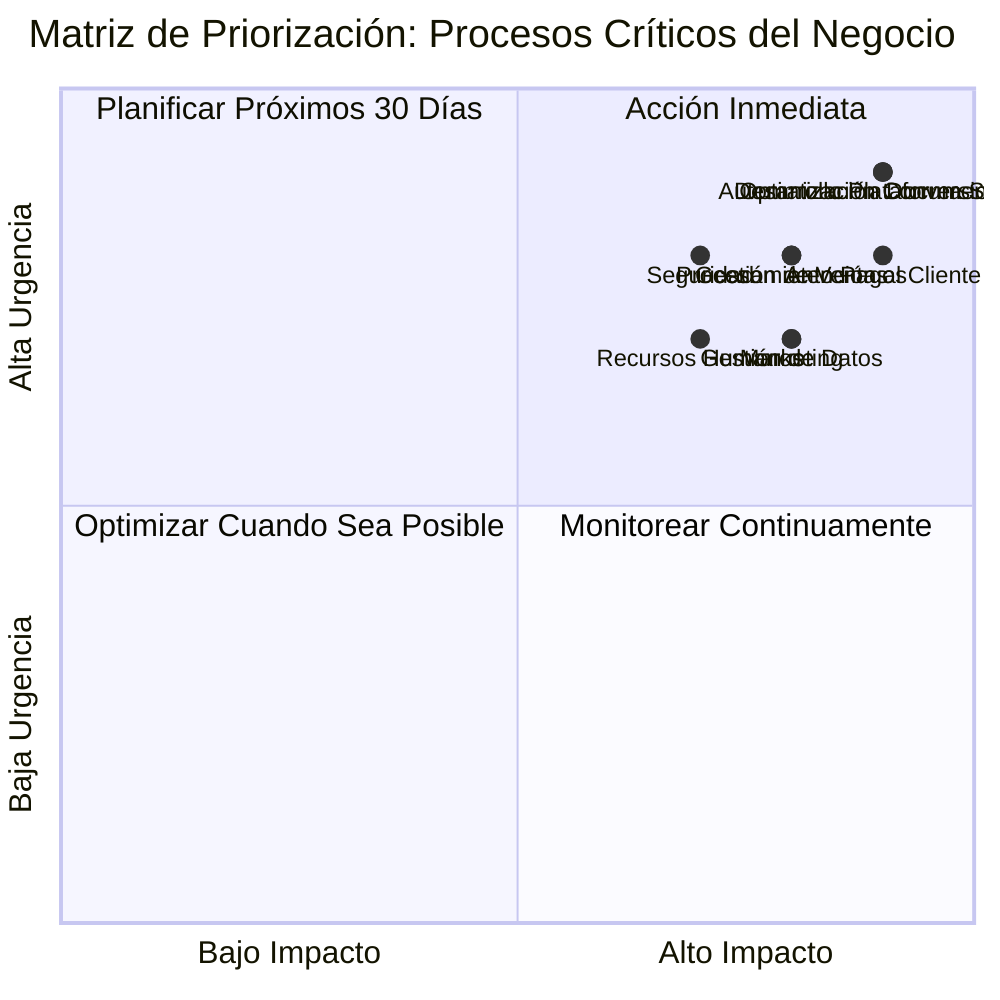
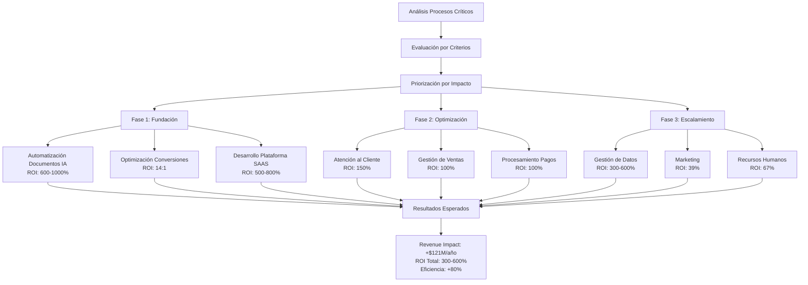
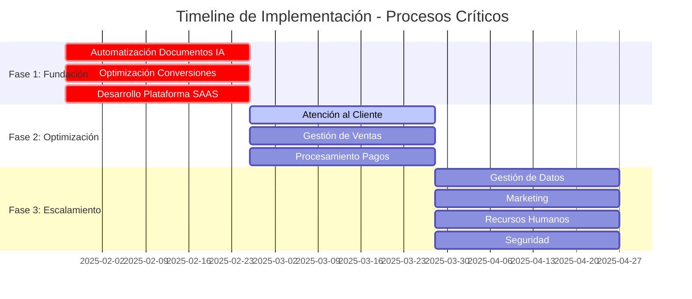
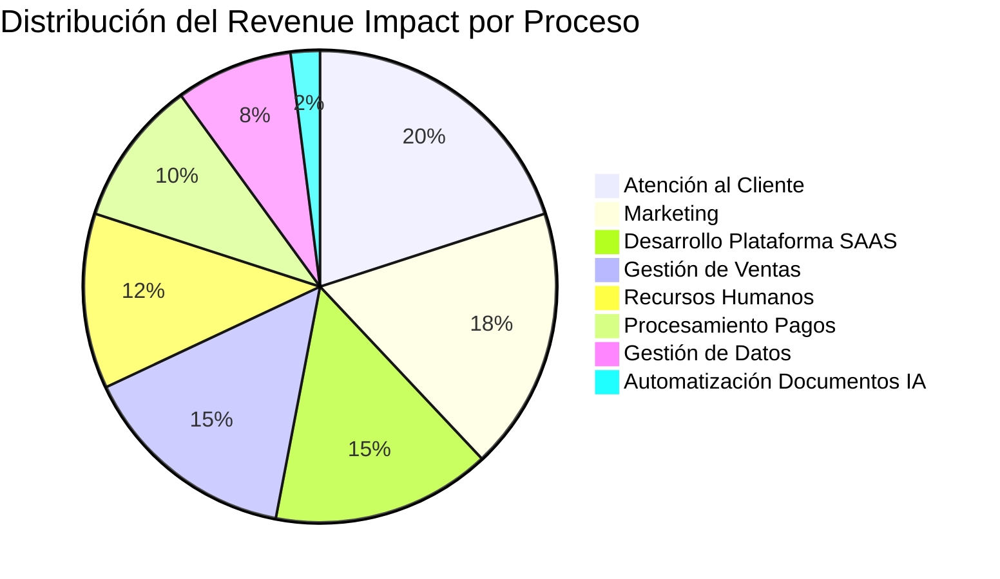
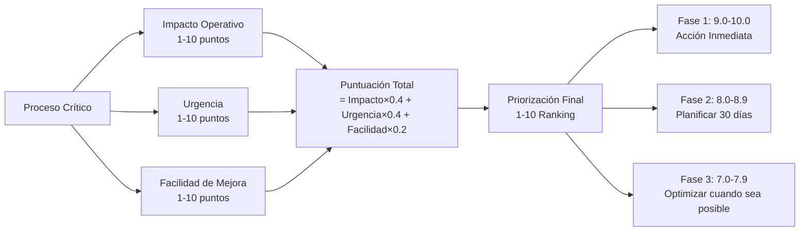

# 🎯 DIAGRAMA VISUAL - MATRIZ DE PRIORIZACIÓN DE PROCESOS CRÍTICOS

## 📊 MATRIZ DE PRIORIZACIÓN VISUAL



## 🎯 FLUJO DE IMPLEMENTACIÓN



## 📈 TIMELINE DE IMPLEMENTACIÓN



## 💰 IMPACTO FINANCIERO ESPERADO



## 🎯 CRITERIOS DE EVALUACIÓN



## 🚀 ROADMAP DE IMPLEMENTACIÓN

```mermaid
journey
    title Roadmap de Implementación - 6 Meses
    section Mes 1-2: Fundación
      Identificar procesos críticos: 5: Usuario
      Implementar automatización básica: 4: Usuario
      Establecer métricas: 3: Usuario
      Medir resultados iniciales: 4: Usuario
    
    section Mes 3-4: Optimización
      Optimizar procesos críticos: 5: Usuario
      Implementar mejoras de calidad: 4: Usuario
      Escalar procesos exitosos: 5: Usuario
      Medir ROI completo: 4: Usuario
    
    section Mes 5-6: Escalamiento
      Implementar escalabilidad: 5: Usuario
      Automatizar procesos avanzados: 4: Usuario
      Preparar siguiente fase: 3: Usuario
      Alcanzar objetivos: 5: Usuario
```

---

## 📊 RESUMEN EJECUTIVO VISUAL

### **TOP 3 PROCESOS CRÍTICOS:**

1. **🥇 Automatización Documentos IA** - Puntuación: 9.2/10
   - Impacto: 10/10 | Urgencia: 9/10 | Facilidad: 8/10
   - ROI Esperado: 600-1000%
   - Revenue Impact: $1M-10M/año

2. **🥈 Optimización Conversiones** - Puntuación: 9.0/10
   - Impacto: 10/10 | Urgencia: 9/10 | Facilidad: 8/10
   - ROI Esperado: 14:1 ratio
   - Revenue Impact: $18M/año

3. **🥉 Desarrollo Plataforma SAAS** - Puntuación: 8.8/10
   - Impacto: 9/10 | Urgencia: 9/10 | Facilidad: 8/10
   - ROI Esperado: 500-800%
   - Revenue Impact: $15M/año

### **INVERSIÓN TOTAL Y RETORNO:**
- **Inversión Total**: $13.5M
- **ROI Promedio**: 300-600%
- **Revenue Impact Total**: +$121M/año
- **Payback Period**: 1-6 meses

---

*Diagramas creados el: 2025-01-27*  
*Metodología: Análisis multicriterio con ponderación estratégica*


