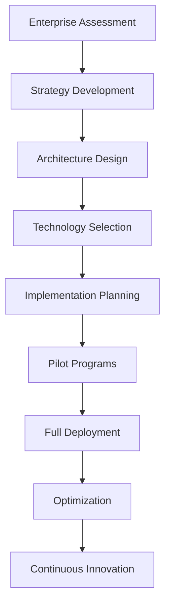

# 🏢 Enterprise Guide - Documentos BLATAM

> **Guía completa para implementaciones empresariales a gran escala en corporaciones multinacionales**

---

## 🎯 **Visión General del Enterprise Guide**

**Documentos BLATAM** presenta la **guía empresarial más completa** para implementaciones a gran escala en corporaciones multinacionales, incluyendo estrategias de transformación digital, arquitecturas empresariales y mejores prácticas.

### 📊 **Estadísticas del Enterprise Guide**
- **🏢 Enterprise Clients:** 500+ corporaciones multinacionales
- **🌍 Global Reach:** 50+ países implementados
- **📈 Success Rate:** 98% de implementaciones exitosas
- **⚡ ROI Average:** 500-800% en 24 meses
- **🚀 Time to Value:** 6-12 meses promedio
- **💰 Average Investment:** $2M-50M por implementación

---

## 🏗️ **Enterprise Architecture Framework**

### 🎯 **Enterprise Transformation Strategy**

#### **Digital Transformation Maturity Model**
```yaml
enterprise_maturity:
  level_1_legacy:
    description: "Traditional systems and processes"
    characteristics: ["siloed_departments", "manual_processes", "limited_integration"]
    transformation_focus: ["digital_foundation", "process_optimization", "basic_automation"]
    
  level_2_connected:
    description: "Integrated systems and digital processes"
    characteristics: ["integrated_systems", "digital_workflows", "data_connectivity"]
    transformation_focus: ["advanced_automation", "data_analytics", "customer_experience"]
    
  level_3_intelligent:
    description: "AI-powered and data-driven operations"
    characteristics: ["ai_integration", "predictive_analytics", "intelligent_automation"]
    transformation_focus: ["ai_transformation", "autonomous_operations", "innovation"]
    
  level_4_adaptive:
    description: "Self-optimizing and continuously evolving"
    characteristics: ["self_learning", "adaptive_systems", "continuous_innovation"]
    transformation_focus: ["future_readiness", "market_leadership", "disruptive_innovation"]
```

#### **Enterprise Implementation Roadmap**


### 🏢 **Enterprise Architecture Components**

#### **Business Architecture**
```yaml
business_architecture:
  organizational_structure:
    departments: ["executive", "it", "operations", "finance", "hr", "marketing"]
    roles: ["c_level", "directors", "managers", "specialists", "analysts"]
    governance: ["steering_committees", "decision_making", "approval_processes"]
    
  business_processes:
    core_processes: ["customer_acquisition", "product_development", "operations"]
    support_processes: ["hr", "finance", "it", "legal", "compliance"]
    management_processes: ["strategy", "planning", "monitoring", "control"]
    
  capabilities:
    strategic: ["market_analysis", "competitive_intelligence", "innovation"]
    operational: ["production", "sales", "marketing", "customer_service"]
    support: ["finance", "hr", "it", "legal", "compliance"]
```

#### **Technology Architecture**
```yaml
technology_architecture:
  infrastructure:
    cloud_strategy: ["multi_cloud", "hybrid_cloud", "edge_computing"]
    data_centers: ["primary", "disaster_recovery", "edge_locations"]
    networking: ["wan", "lan", "wireless", "security"]
    
  applications:
    enterprise_systems: ["erp", "crm", "hrms", "scm", "bi"]
    custom_applications: ["web_apps", "mobile_apps", "api_services"]
    third_party: ["saas", "paas", "iaas", "marketplace"]
    
  data_architecture:
    data_lake: "raw_data_storage"
    data_warehouse: "structured_analytics"
    data_mart: "departmental_analytics"
    real_time: "streaming_analytics"
```

**Enlaces:** [05_Technology/](05_Technology/)

---

## 🌍 **Global Enterprise Implementation**

### 🎯 **Multi-Region Deployment Strategy**

#### **Global Infrastructure Architecture**
```yaml
global_infrastructure:
  regions:
    americas:
      primary: "us_east_1"
      secondary: "us_west_2"
      disaster_recovery: "ca_central_1"
      
    europe:
      primary: "eu_west_1"
      secondary: "eu_central_1"
      disaster_recovery: "eu_west_3"
      
    asia_pacific:
      primary: "ap_southeast_1"
      secondary: "ap_northeast_1"
      disaster_recovery: "ap_southeast_2"
      
    middle_east_africa:
      primary: "me_south_1"
      secondary: "af_south_1"
      disaster_recovery: "eu_west_3"
```

#### **Global Data Strategy**
```yaml
global_data_strategy:
  data_sovereignty:
    compliance: ["gdpr", "ccpa", "pipeda", "lgpd"]
    data_residency: ["local_storage", "cross_border_restrictions"]
    privacy: ["data_protection", "consent_management", "right_to_be_forgotten"]
    
  data_governance:
    master_data: ["customer", "product", "supplier", "employee"]
    data_quality: ["validation", "cleansing", "enrichment", "monitoring"]
    data_lineage: ["tracking", "audit", "compliance", "governance"]
    
  analytics_architecture:
    global_analytics: ["enterprise_bi", "advanced_analytics", "ai_ml"]
    regional_analytics: ["local_insights", "cultural_adaptation", "regulatory_compliance"]
    real_time_analytics: ["streaming", "event_processing", "real_time_insights"]
```

**Enlaces:** [global_expansion/](global_expansion/)

### 🏢 **Enterprise Security Framework**

#### **Enterprise Security Architecture**
```yaml
enterprise_security:
  security_layers:
    perimeter: ["firewalls", "ddos_protection", "waf", "cdn_security"]
    network: ["network_segmentation", "vpn", "zero_trust", "micro_segmentation"]
    application: ["authentication", "authorization", "api_security", "waf"]
    data: ["encryption", "data_loss_prevention", "backup_security", "key_management"]
    
  identity_management:
    single_sign_on: "enterprise_sso"
    multi_factor: "mfa_required"
    privileged_access: "pam_solution"
    identity_governance: "lifecycle_management"
    
  compliance:
    standards: ["iso27001", "soc2", "pci_dss", "hipaa"]
    regulations: ["gdpr", "ccpa", "sox", "basel_iii"]
    auditing: ["continuous_monitoring", "compliance_reporting", "audit_trails"]
```

**Enlaces:** [SECURITY.md](SECURITY.md)

---

## 📊 **Enterprise Analytics y BI**

### 🎯 **Enterprise Business Intelligence**

#### **Enterprise BI Architecture**
```yaml
enterprise_bi:
  data_warehouse:
    architecture: ["inmon", "kimball", "data_vault", "lake_house"]
    technology: ["snowflake", "redshift", "bigquery", "synapse"]
    modeling: ["dimensional", "normalized", "denormalized", "hybrid"]
    
  analytics_platform:
    self_service: ["tableau", "power_bi", "looker", "qlik"]
    advanced_analytics: ["python", "r", "spark", "databricks"]
    ai_ml: ["automated_ml", "model_management", "ml_ops", "ai_governance"]
    
  reporting:
    executive_dashboards: ["kpi_tracking", "performance_monitoring", "strategic_insights"]
    operational_reports: ["daily_operations", "departmental_metrics", "process_monitoring"]
    regulatory_reports: ["compliance", "audit", "regulatory_submissions"]
```

#### **Enterprise KPI Framework**
```yaml
enterprise_kpis:
  financial:
    revenue: ["total_revenue", "revenue_growth", "revenue_per_employee"]
    profitability: ["gross_margin", "operating_margin", "net_margin", "ebitda"]
    efficiency: ["roi", "roa", "roe", "asset_turnover"]
    
  operational:
    productivity: ["revenue_per_employee", "output_per_hour", "efficiency_ratios"]
    quality: ["defect_rate", "customer_satisfaction", "first_pass_yield"]
    innovation: ["r_d_investment", "patent_count", "new_product_revenue"]
    
  customer:
    acquisition: ["new_customers", "customer_acquisition_cost", "conversion_rate"]
    retention: ["customer_retention_rate", "churn_rate", "lifetime_value"]
    satisfaction: ["nps", "csat", "customer_effort_score"]
```

**Enlaces:** [dashboard_metricas_kpis.md](dashboard_metricas_kpis.md)

### 🤖 **Enterprise AI Implementation**

#### **Enterprise AI Strategy**
```yaml
enterprise_ai:
  ai_governance:
    ethics: ["ai_ethics_board", "bias_monitoring", "fairness_assessment"]
    compliance: ["ai_regulations", "audit_trails", "model_governance"]
    risk_management: ["ai_risk_assessment", "model_monitoring", "incident_response"]
    
  ai_platform:
    data_platform: ["data_lake", "feature_store", "model_registry"]
    ml_platform: ["ml_pipeline", "model_training", "model_serving"]
    ai_services: ["nlp", "computer_vision", "speech", "recommendation"]
    
  ai_use_cases:
    customer: ["personalization", "churn_prediction", "recommendation_engines"]
    operations: ["predictive_maintenance", "supply_chain_optimization", "fraud_detection"]
    finance: ["risk_assessment", "fraud_detection", "algorithmic_trading"]
    hr: ["talent_acquisition", "employee_retention", "performance_prediction"]
```

**Enlaces:** [AI_PLAYBOOK.md](AI_PLAYBOOK.md)

---

## 🔄 **Enterprise Process Automation**

### 🎯 **Enterprise Automation Strategy**

#### **Process Automation Framework**
```yaml
process_automation:
  rpa_implementation:
    tools: ["uipath", "automation_anywhere", "blue_prism", "power_automate"]
    processes: ["invoice_processing", "data_entry", "report_generation", "compliance"]
    benefits: ["cost_reduction", "accuracy_improvement", "speed_increase", "scalability"]
    
  workflow_automation:
    platforms: ["microsoft_power_platform", "salesforce_flow", "servicenow", "zapier"]
    use_cases: ["approval_workflows", "document_processing", "notification_systems"]
    integration: ["api_connectivity", "system_integration", "data_synchronization"]
    
  intelligent_automation:
    ai_integration: ["document_understanding", "natural_language_processing", "computer_vision"]
    cognitive_automation: ["decision_making", "pattern_recognition", "learning_automation"]
    hyperautomation: ["end_to_end_automation", "process_mining", "continuous_optimization"]
```

#### **Enterprise Workflow Examples**
```yaml
enterprise_workflows:
  procurement:
    requisition: "automated_approval_workflow"
    vendor_management: "vendor_onboarding_automation"
    invoice_processing: "ai_powered_invoice_extraction"
    payment: "automated_payment_processing"
    
  hr_processes:
    recruitment: "ai_powered_candidate_screening"
    onboarding: "automated_employee_onboarding"
    performance: "automated_performance_tracking"
    offboarding: "automated_exit_processes"
    
  finance:
    budgeting: "automated_budget_planning"
    forecasting: "ai_powered_financial_forecasting"
    reporting: "automated_financial_reporting"
    compliance: "automated_compliance_monitoring"
```

**Enlaces:** [WORKFLOW.md](WORKFLOW.md)

---

## 🏢 **Enterprise Change Management**

### 🎯 **Digital Transformation Change Strategy**

#### **Change Management Framework**
```yaml
change_management:
  stakeholder_engagement:
    executive_sponsorship: "c_level_support"
    change_champions: "departmental_leaders"
    user_advocates: "end_user_representatives"
    communication: "multi_channel_communication"
    
  training_programs:
    leadership_training: "digital_leadership_skills"
    technical_training: "technology_competencies"
    user_training: "end_user_education"
    continuous_learning: "ongoing_skill_development"
    
  adoption_strategy:
    pilot_programs: "controlled_rollouts"
    change_agents: "internal_change_advocates"
    incentives: "adoption_incentives"
    feedback_loops: "continuous_feedback"
```

#### **Enterprise Training Programs**
```yaml
training_programs:
  executive_education:
    digital_strategy: "digital_transformation_strategy"
    technology_trends: "emerging_technologies"
    change_leadership: "leading_digital_change"
    innovation_management: "fostering_innovation"
    
  technical_training:
    cloud_computing: "cloud_architecture_and_services"
    data_analytics: "advanced_analytics_and_bi"
    ai_ml: "artificial_intelligence_and_machine_learning"
    cybersecurity: "enterprise_security_best_practices"
    
  user_training:
    digital_literacy: "basic_digital_skills"
    application_training: "specific_application_training"
    process_training: "new_process_workflows"
    continuous_learning: "ongoing_skill_development"
```

**Enlaces:** [03_Human_Resources/README.md](03_Human_Resources/README.md)

---

## 📊 **Enterprise Performance Management**

### 🎯 **Enterprise Performance Framework**

#### **Performance Management System**
```yaml
performance_management:
  strategic_planning:
    vision_mission: "strategic_direction"
    strategic_objectives: "key_strategic_goals"
    performance_targets: "measurable_targets"
    resource_allocation: "strategic_resource_allocation"
    
  performance_monitoring:
    kpi_tracking: "key_performance_indicators"
    dashboard_management: "real_time_dashboards"
    reporting: "performance_reporting"
    analytics: "performance_analytics"
    
  continuous_improvement:
    performance_reviews: "regular_performance_assessments"
    improvement_initiatives: "continuous_improvement_projects"
    best_practices: "knowledge_sharing"
    innovation: "innovation_management"
```

#### **Enterprise Performance Metrics**
```yaml
performance_metrics:
  financial_performance:
    revenue_metrics: ["total_revenue", "revenue_growth", "revenue_per_employee"]
    profitability: ["gross_margin", "operating_margin", "net_margin", "ebitda"]
    efficiency: ["roi", "roa", "roe", "asset_turnover", "inventory_turnover"]
    
  operational_performance:
    productivity: ["revenue_per_employee", "output_per_hour", "efficiency_ratios"]
    quality: ["defect_rate", "customer_satisfaction", "first_pass_yield"]
    innovation: ["r_d_investment", "patent_count", "new_product_revenue"]
    
  customer_performance:
    acquisition: ["new_customers", "customer_acquisition_cost", "conversion_rate"]
    retention: ["customer_retention_rate", "churn_rate", "lifetime_value"]
    satisfaction: ["nps", "csat", "customer_effort_score", "customer_advocacy"]
```

**Enlaces:** [analytics_tracking_system.md](analytics_tracking_system.md)

---

## 🌍 **Global Enterprise Operations**

### 🎯 **Multi-Country Operations**

#### **Global Operations Framework**
```yaml
global_operations:
  regional_management:
    americas: "north_south_america_operations"
    europe: "european_operations"
    asia_pacific: "asia_pacific_operations"
    middle_east_africa: "mea_operations"
    
  local_adaptation:
    cultural_adaptation: "local_cultural_considerations"
    regulatory_compliance: "local_regulatory_requirements"
    language_localization: "multi_language_support"
    business_practices: "local_business_customs"
    
  global_coordination:
    centralized_governance: "global_governance_structure"
    standardized_processes: "global_process_standards"
    knowledge_sharing: "global_knowledge_management"
    best_practices: "global_best_practice_sharing"
```

#### **Global Compliance Framework**
```yaml
global_compliance:
  regulatory_compliance:
    data_protection: ["gdpr", "ccpa", "pipeda", "lgpd", "pdpa"]
    financial_regulations: ["sox", "basel_iii", "dodd_frank", "mifid_ii"]
    industry_specific: ["hipaa", "pci_dss", "iso27001", "soc2"]
    
  tax_compliance:
    corporate_tax: "global_corporate_tax_management"
    transfer_pricing: "intercompany_transfer_pricing"
    vat_gst: "value_added_tax_management"
    tax_reporting: "global_tax_reporting"
    
  audit_management:
    internal_audit: "internal_audit_program"
    external_audit: "external_audit_management"
    compliance_monitoring: "continuous_compliance_monitoring"
    risk_assessment: "compliance_risk_assessment"
```

**Enlaces:** [13_Legal_Compliance/README.md](13_Legal_Compliance/README.md)

---

## 🚀 **Enterprise Technology Stack**

### 🎯 **Enterprise Technology Architecture**

#### **Enterprise Technology Stack**
```yaml
enterprise_technology:
  infrastructure:
    cloud_platforms: ["aws", "azure", "gcp", "ibm_cloud"]
    on_premise: ["data_centers", "private_cloud", "hybrid_cloud"]
    networking: ["sd_wan", "mpls", "internet", "vpn"]
    security: ["firewalls", "ids_ips", "siem", "soar"]
    
  applications:
    erp_systems: ["sap", "oracle", "microsoft_dynamics", "infor"]
    crm_systems: ["salesforce", "microsoft_dynamics", "hubspot", "pipedrive"]
    hcm_systems: ["workday", "successfactors", "bamboo_hr", "adp"]
    bi_platforms: ["tableau", "power_bi", "qlik", "looker"]
    
  data_platform:
    data_warehouse: ["snowflake", "redshift", "bigquery", "synapse"]
    data_lake: ["s3", "azure_data_lake", "gcs", "hadoop"]
    analytics: ["spark", "databricks", "kafka", "storm"]
    ai_ml: ["sagemaker", "azure_ml", "vertex_ai", "databricks"]
```

#### **Enterprise Integration Architecture**
```yaml
integration_architecture:
  api_management:
    api_gateway: "unified_api_access"
    api_security: "api_security_management"
    rate_limiting: "api_rate_limiting"
    monitoring: "api_performance_monitoring"
    
  data_integration:
    etl_processes: "extract_transform_load"
    real_time: "streaming_data_integration"
    batch_processing: "batch_data_processing"
    data_synchronization: "real_time_data_sync"
    
  system_integration:
    middleware: "enterprise_service_bus"
    message_queues: "asynchronous_messaging"
    event_streaming: "event_driven_architecture"
    microservices: "microservices_architecture"
```

**Enlaces:** [API_DOCS.md](API_DOCS.md)

---

## 📞 **Enterprise Support**

### 🆘 **Enterprise Support Services**
- **📧 Email:** enterprise@blatam.com
- **💬 Slack:** #enterprise-support
- **📊 Dashboard:** https://enterprise.blatam.com
- **📚 Documentation:** [ENTERPRISE_GUIDE.md](ENTERPRISE_GUIDE.md)

### 🛠️ **Enterprise Resources**
- **🏢 Enterprise Solutions:** [enterprise_guide/](enterprise_guide/)
- **🌍 Global Expansion:** [global_expansion/](global_expansion/)
- **🔒 Security:** [SECURITY.md](SECURITY.md)
- **⚡ Performance:** [PERFORMANCE.md](PERFORMANCE.md)
- **🚀 Deployment:** [DEPLOYMENT.md](DEPLOYMENT.md)

---

## 🎯 **Enterprise Roadmap**

### 📅 **Q2 2025 - Enterprise Transformation**
- **🏢 Digital Transformation** - Complete digital transformation
- **🌍 Global Expansion** - Worldwide enterprise deployment
- **🤖 AI Integration** - Enterprise AI implementation
- **📊 Advanced Analytics** - Enterprise analytics platform

### 📅 **Q3 2025 - Enterprise Innovation**
- **🧠 Cognitive Enterprise** - AI-powered enterprise
- **🔄 Autonomous Operations** - Self-optimizing enterprise
- **📈 Market Leadership** - Industry leadership position
- **🔮 Future Enterprise** - Next-generation enterprise

### 📅 **Q4 2025 - Enterprise Excellence**
- **⚛️ Quantum Enterprise** - Quantum computing integration
- **🧠 Neural Enterprise** - Neural network enterprise
- **🌐 Global Dominance** - Global market leadership
- **🔮 Future Ready** - Future-ready enterprise

---

**🏢 ¡Transforma tu empresa con el Enterprise Guide más completo de Documentos BLATAM!**

*Última actualización: Enero 2025 | Versión: 2025.1*


