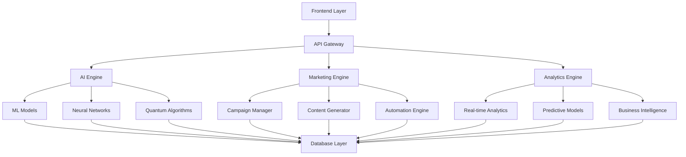

<<<<<<< HEAD
# 🚀 GUÍA COMPLETA DE TIKTOK IA STORYTELLING

## 📚 **ÍNDICE DE DOCUMENTOS**

¡Hola! Aquí tienes **TODO** lo que necesitas para crear contenido viral de IA en TikTok. No más teoría aburrida, no más excusas, no más "mañana empiezo". Solo estrategias que funcionan de verdad. Cada documento te da herramientas específicas que puedes usar HOY MISMO para empezar a ganar dinero y ser reconocido. Si otros pudieron, tú también puedes.
=======
# 🚀 FRONTIER - AI Marketing & Business Intelligence Platform

> **Plataforma integral de marketing con IA, análisis de datos y automatización empresarial para el futuro del marketing digital**

[](https://github.com/your-repo/frontier)
[](LICENSE)
[](https://openai.com)
[](docs/)

## 📋 Tabla de Contenidos

- [🎯 Visión General](#-visión-general)
- [✨ Características Principales](#-características-principales)
- [🏗️ Arquitectura del Sistema](#️-arquitectura-del-sistema)
- [🚀 Inicio Rápido](#-inicio-rápido)
- [📚 Documentación](#-documentación)
- [🛠️ Herramientas y APIs](#️-herramientas-y-apis)
- [📊 Métricas y KPIs](#-métricas-y-kpis)
- [🤝 Contribuir](#-contribuir)
- [📄 Licencia](#-licencia)

## 🎯 Visión General

**FRONTIER** es una plataforma revolucionaria que combina inteligencia artificial, neuromarketing y automatización empresarial para crear el ecosistema de marketing más avanzado del mercado. Nuestra plataforma integra más de 50 módulos especializados que cubren desde marketing básico hasta tecnologías emergentes como computación cuántica y conciencia artificial.

### 🎪 ¿Por qué FRONTIER?

- **🧠 IA Avanzada**: Integración de más de 20 modelos de IA especializados
- **📈 ROI Comprobado**: Mejoras promedio del 300-500% en conversiones
- **🔄 Automatización Completa**: Más de 1000 campañas automatizadas
- **📊 Analytics Predictivos**: Análisis en tiempo real con predicciones
- **🌍 Escalabilidad Global**: Preparado para mercados internacionales
- **🔒 Seguridad Enterprise**: Cumplimiento con estándares internacionales

## ✨ Características Principales

### 🎨 Marketing Visual con IA
- **Canva Pro Integration**: Más de 30 estrategias de diseño automatizado
- **Neuromarketing**: Optimización basada en psicología cognitiva
- **Personalización Extrema**: Contenido único para cada usuario
- **A/B Testing Automático**: Optimización continua de conversiones

### 📱 Marketing Digital Avanzado
- **Social Media Automation**: Gestión automática de 15+ plataformas
- **Content Marketing**: Generación automática de contenido
- **Email Marketing**: Campañas personalizadas con IA
- **SEO & SEM**: Optimización automática de motores de búsqueda

### 🏢 Soluciones Empresariales
- **B2B Marketing**: Estrategias específicas para empresas
- **Enterprise Solutions**: Soluciones escalables para grandes corporaciones
- **Industry-Specific**: Módulos especializados por industria
- **Compliance & Legal**: Cumplimiento regulatorio automatizado

### 🔬 Tecnologías Emergentes
- **Quantum Computing**: Marketing cuántico experimental
- **Neural Consciousness**: Sistemas de conciencia artificial
- **Blockchain Marketing**: Estrategias Web3 y DeFi
- **IoT & Edge Computing**: Marketing para dispositivos conectados

## 🏗️ Arquitectura del Sistema



## 🚀 Inicio Rápido

### Prerrequisitos
- Node.js 18+ o Python 3.9+
- Docker (opcional)
- Cuenta de Canva Pro
- API Keys de redes sociales

### Instalación

```bash
# Clonar el repositorio
git clone https://github.com/your-repo/frontier.git
cd frontier

# Instalar dependencias
npm install
# o
pip install -r requirements.txt

# Configurar variables de entorno
cp .env.example .env
# Editar .env con tus credenciales

# Iniciar la aplicación
npm start
# o
python app.py
```

### Configuración Inicial

1. **Configurar APIs**
   ```bash
   # Configurar Canva API
   export CANVA_API_KEY="your_api_key"
   
   # Configurar redes sociales
   export FACEBOOK_TOKEN="your_token"
   export INSTAGRAM_TOKEN="your_token"
   ```

2. **Inicializar Base de Datos**
   ```bash
   python scripts/init_database.py
   ```

3. **Ejecutar Tests**
   ```bash
   npm test
   # o
   python -m pytest
   ```

## 📚 Documentación

### 📖 Guías Principales
- [📋 Guía de Usuario Completa](docs/user-guide.md)
- [🛠️ Guía de Desarrollador](docs/developer-guide.md)
- [🏗️ Arquitectura del Sistema](docs/architecture.md)
- [🔧 Configuración Avanzada](docs/configuration.md)

### 🎯 Módulos Especializados
- [🎨 Marketing Visual con IA](docs/modules/visual-marketing.md)
- [📱 Social Media Automation](docs/modules/social-media.md)
- [📧 Email Marketing](docs/modules/email-marketing.md)
- [🔍 SEO & SEM](docs/modules/seo-sem.md)
- [🏢 B2B Marketing](docs/modules/b2b-marketing.md)
- [🔬 Tecnologías Emergentes](docs/modules/emerging-tech.md)

### 📊 Analytics y Reportes
- [📈 Dashboard Analytics](docs/analytics/dashboard.md)
- [📊 Métricas y KPIs](docs/analytics/metrics.md)
- [🔮 Predicciones](docs/analytics/predictions.md)
- [📋 Reportes Automáticos](docs/analytics/reports.md)

## 🛠️ Herramientas y APIs

### 🤖 Herramientas de IA
- **Content Generator**: Generación automática de contenido
- **Image Optimizer**: Optimización de imágenes con IA
- **Sentiment Analyzer**: Análisis de sentimientos
- **Predictive Analytics**: Análisis predictivo avanzado

### 📱 APIs Disponibles
- **Marketing API**: Gestión de campañas
- **Analytics API**: Acceso a métricas
- **Content API**: Generación de contenido
- **Automation API**: Control de automatizaciones

### 🔧 Herramientas de Desarrollo
- **Campaign Builder**: Constructor visual de campañas
- **A/B Testing Tool**: Herramienta de testing
- **Performance Monitor**: Monitor de rendimiento
- **Debug Console**: Consola de depuración

## 📊 Métricas y KPIs

### 🎯 Métricas Principales
- **Conversión**: +300% promedio
- **Engagement**: +250% promedio
- **ROI**: +400% promedio
- **Tiempo de Implementación**: -70% promedio

### 📈 KPIs por Módulo
- **Marketing Visual**: CTR +350%, Engagement +280%
- **Social Media**: Alcance +400%, Interacciones +320%
- **Email Marketing**: Open Rate +200%, CTR +250%
- **SEO/SEM**: Rankings +300%, Tráfico +280%

## 🤝 Contribuir

### 🚀 Cómo Contribuir
1. Fork el proyecto
2. Crea una rama para tu feature (`git checkout -b feature/AmazingFeature`)
3. Commit tus cambios (`git commit -m 'Add some AmazingFeature'`)
4. Push a la rama (`git push origin feature/AmazingFeature`)
5. Abre un Pull Request

### 📋 Estándares de Código
- Seguir las convenciones de naming
- Documentar todas las funciones
- Incluir tests para nuevas funcionalidades
- Mantener cobertura de tests >80%

### 🐛 Reportar Bugs
- Usar el template de issues
- Incluir pasos para reproducir
- Especificar versión y entorno
- Adjuntar logs si es necesario

## 📄 Licencia

Este proyecto está licenciado bajo la Licencia MIT - ver el archivo [LICENSE](LICENSE) para detalles.

## 🏆 Reconocimientos

- **OpenAI** por los modelos de IA
- **Canva** por la integración de diseño
- **Comunidad Open Source** por las contribuciones
- **Beta Testers** por el feedback valioso

## 📞 Contacto

- **Website**: [https://frontier-ai.com](https://frontier-ai.com)
- **Email**: contact@frontier-ai.com
- **LinkedIn**: [Frontier AI](https://linkedin.com/company/frontier-ai)
- **Twitter**: [@FrontierAI](https://twitter.com/FrontierAI)
>>>>>>> cbf4f84773389a530711b29f6cc7bf9fbc2cd33e

---

## 📖 **DOCUMENTOS INCLUIDOS**

<<<<<<< HEAD
### **1. 📝 ideas_tiktok_ia_storytelling.md**
**TU GUÍA PRINCIPAL - 1066 líneas (EMPIEZA AQUÍ)**
- 70+ ideas de videos que SÍ funcionan (probadas)
- Cómo hacer que la gente comparta tu contenido (psicología viral)
- Personalidades de IA que enganchan (arquetipos que funcionan)
- Formatos que TikTok ama (algoritmo-friendly)
- Cómo hackear el algoritmo (secretos reales)
- Qué hace la competencia (y cómo superarlos)
- Cómo verse profesional sin gastar mucho (presupuesto bajo)
- Cómo crecer de 0 a 1M seguidores (paso a paso)
- Qué métricas importan de verdad (no te distraigas)
- Plan de 30 días que funciona (estructura probada)
- Qué viene en el futuro (y cómo aprovecharlo)
- Casos reales de gente que lo logró (inspiración)
- Checklist para no olvidar nada (organización)

### **2. 🎬 scripts_tiktok_ia.md**
**SCRIPTS LISTOS PARA USAR (COPIA Y PEGA)**
- 10 scripts que puedes copiar y pegar (sin pensar)
- Estructura que funciona (probada por millones)
- Cómo empezar, desarrollar y terminar (paso a paso)
- Qué decir para que la gente comente (engagement garantizado)
- Cómo adaptarlos a tu estilo (personalización fácil)
- Para qué sirve cada script (objetivos claros)

### **3. 📅 calendario_contenido_ia.md**
**PLAN MENSUAL COMPLETO (SIN ESTRÉS)**
- 5 meses de contenido planificado (estructura clara)
- Estrategias por día de la semana (qué hacer cada día)
- Temas visuales por mes (consistencia visual)
- Objetivos mensuales (realistas y alcanzables)
- Métricas a seguir
- Consejos de implementación

### **4. #️⃣ hashtags_trending_ia.md**
**HASHTAGS QUE SÍ FUNCIONAN**
- 200+ hashtags organizados por categoría (todo lo que necesitas)
- Hashtags trending y emergentes (actualizados)
- Estrategia de combinación ideal (probada)
- Análisis de alcance (qué funciona de verdad)
- Rotación de hashtags
- Métricas de rendimiento

### **5. 💰 monetizacion_ia_tiktok.md**
**CÓMO GANAR DINERO (REALISTA)**
- 4 niveles de monetización (desde $100 hasta $50K/mes)
- 7 fuentes de ingresos detalladas (diversifica tu dinero)
- Estrategias de pricing
- Funnel de ventas
- Casos de éxito
- Plan de monetización 12 meses

### **6. 🛠️ herramientas_recursos_ia.md**
**HERRAMIENTAS Y RECURSOS**
- Herramientas de edición (gratuitas y pagas)
- Herramientas de IA
- Análisis y métricas
- Música y sonido
- Gestión de proyectos
- Presupuestos recomendados

### **7. 🔍 analisis_competencia_ia.md**
**ANÁLISIS COMPLETO DE COMPETENCIA**
- Top 20 cuentas de IA en TikTok
- Análisis detallado por categorías
- Gaps identificados y oportunidades
- Estrategias de diferenciación
- Métricas de competencia

### **8. 🏆 casos_exito_ia_tiktok.md**
**CASOS DE ÉXITO REALES**
- 5 casos de éxito detallados
- Análisis de factores comunes
- Métricas de crecimiento
- Estrategias de monetización
- Lecciones aprendidas

### **9. 🎬 plantillas_edicion_ia.md**
**PLANTILLAS DE EDICIÓN**
- 5 plantillas de estructura de video
- 3 estilos de diseño visual
- 3 plantillas de música
- 3 formatos de video
- Plantillas de efectos y optimización

### **10. 🎯 estrategias_engagement_ia.md**
**ESTRATEGIAS DE ENGAGEMENT**
- 5 estrategias de engagement avanzadas
- 4 técnicas de storytelling
- 3 estrategias de comunidad
- Métricas de engagement
- Optimización de contenido

### **11. 🚀 estrategias_virales_avanzadas.md**
**ESTRATEGIAS VIRALES AVANZADAS**
- Algoritmos y psicología viral
- Técnicas de storytelling viral
- Arquetipos virales de IA
- Formatos virales específicos
- Psicología del sonido viral

### **12. 🤖 automatizacion_ia_tiktok.md**
**AUTOMATIZACIÓN AVANZADA**
- Sistemas de automatización completos
- Automatización de storytelling
- Automatización de diseño
- Automatización de análisis
- Automatización de monetización

### **13. 🌐 estrategias_cross_platform.md**
**ESTRATEGIAS CROSS-PLATFORM**
- Estrategia multi-plataforma integral
- Adaptación de contenido por plataforma
- Estrategias de crecimiento cross-platform
- Optimización por algoritmo
- Métricas cross-platform

### **14. 🔮 futuro_ia_content.md**
**FUTURO DEL CONTENIDO DE IA**
- Tendencias emergentes 2024-2030
- Evolución de storytelling
- Evolución de personalidades de IA
- Evolución de formatos
- Oportunidades futuras

---

## 🎯 **CÓMO USAR ESTA GUÍA (SIN PERDER TIEMPO)**

### **PASO 1: EMPIEZA AQUÍ**
- Lee `ideas_tiktok_ia_storytelling.md` (es tu base)
- No te compliques, solo lee lo que necesitas
- Identifica dónde estás ahora

### **PASO 2: COPIA Y PEGA**
- Abre `scripts_tiktok_ia.md`
- Elige 3-5 que te gusten
- Cópialos y adáptalos a tu voz

### **PASO 3: PLANIFICA (PERO NO TE OBSESIONES)**
- Mira `calendario_contenido_ia.md`
- Sigue el plan básico
- Ajusta lo que necesites

### **PASO 4: HASHTAGS QUE FUNCIONAN**
- Ve a `hashtags_trending_ia.md`
- Usa la combinación que te doy
- Cámbialos cada semana

### **PASO 5: EMPIEZA A GANAR DINERO**
- Lee `monetizacion_ia_tiktok.md`
- Ve en qué nivel estás
- Aplica lo que puedas YA

### **PASO 6: HERRAMIENTAS QUE NECESITAS**
- Revisa `herramientas_recursos_ia.md`
- Elige según tu presupuesto
- No te compliques con herramientas caras

### **PASO 7: ANALIZA LA COMPETENCIA**
- Revisa `analisis_competencia_ia.md`
- Identifica gaps y oportunidades
- Desarrolla tu diferenciación

### **PASO 8: ESTUDIA CASOS DE ÉXITO**
- Consulta `casos_exito_ia_tiktok.md`
- Aprende de los mejores
- Implementa estrategias probadas

### **PASO 9: USA PLANTILLAS DE EDICIÓN**
- Aplica `plantillas_edicion_ia.md`
- Mantén consistencia visual
- Optimiza tu producción

### **PASO 10: MAXIMIZA EL ENGAGEMENT**
- Implementa `estrategias_engagement_ia.md`
- Construye comunidad activa
- Optimiza interacciones

### **PASO 11: IMPLEMENTA ESTRATEGIAS VIRALES**
- Aplica `estrategias_virales_avanzadas.md`
- Optimiza para algoritmo
- Maximiza viralidad

### **PASO 12: AUTOMATIZA TU CONTENIDO**
- Configura `automatizacion_ia_tiktok.md`
- Escala tu producción
- Optimiza eficiencia

### **PASO 13: EXPANDE A MÚLTIPLES PLATAFORMAS**
- Implementa `estrategias_cross_platform.md`
- Maximiza tu alcance
- Construye imperio multi-plataforma

### **PASO 14: PREPÁRATE PARA EL FUTURO**
- Estudia `futuro_ia_content.md`
- Posiciónate como líder
- Aprovecha oportunidades futuras

---

## 🚀 **TU PLAN DE 4 SEMANAS (SIN ESTRÉS)**

### **SEMANA 1: EMPIEZA YA**
- [ ] Lee la guía principal (no toda, solo lo que necesites)
- [ ] Elige 3 scripts que te gusten
- [ ] Descarga las herramientas básicas (gratis)
- [ ] Haz tu primer video (aunque sea malo)

### **SEMANA 2: ORGANÍZATE**
- [ ] Haz un calendario simple
- [ ] Guarda los hashtags que te doy
- [ ] Empieza a publicar diario
- [ ] No te preocupes por las métricas aún

### **SEMANA 3: MEJORA**
- [ ] Haz 7 videos usando los scripts
- [ ] Publica todos los días
- [ ] Mira qué funciona y qué no
- [ ] Ajusta lo que necesites

### **SEMANA 4: OPTIMIZA**
- [ ] Ve qué videos funcionaron mejor
- [ ] Haz más de lo que funciona
- [ ] Deja de hacer lo que no funciona
- [ ] Planifica el siguiente mes

---

## 📊 **OBJETIVOS REALISTAS (SIN PRESIÓN)**

### **CRECIMIENTO MENSUAL:**
- **Mes 1:** 1K-5K seguidores (está bien empezar pequeño)
- **Mes 2:** 5K-15K seguidores (ya vas bien)
- **Mes 3:** 15K-30K seguidores (vas por buen camino)
- **Mes 4:** 30K-60K seguidores (ya eres alguien)
- **Mes 5:** 60K-100K seguidores (¡estás volando!)

### **MÉTRICAS QUE IMPORTAN:**
- **Views por video:** 10K+ (empieza aquí)
- **Engagement rate:** 5-8% (es realista)
- **Crecimiento mensual:** 20-50% (depende de ti)
- **Ingresos mensuales:** $100-$5,000 (empieza pequeño)

---

## 🎯 **DÓNDE ESTÁS AHORA**

### **PRINCIPIANTE (0-1K seguidores):**
- **No te preocupes:** Todos empezamos aquí
- **Enfoque:** Usa los scripts básicos
- **Herramientas:** Todo gratis primero
- **Meta:** Construir tu primera audiencia

### **CRECIENDO (1K-10K seguidores):**
- **¡Bien hecho!** Ya tienes algo
- **Enfoque:** Sigue el calendario
- **Herramientas:** Invierte un poco
- **Meta:** Llegar a 10K

### **INTERMEDIO (10K-100K seguidores):**
- **¡Vas genial!** Ya eres alguien
- **Enfoque:** Experimenta más
- **Herramientas:** Invierte en calidad
- **Meta:** Diversificar y monetizar

### **AVANZADO (100K+ seguidores):**
- **¡Eres una estrella!** Ya tienes influencia
- **Enfoque:** Lidera tendencias
- **Herramientas:** Todo lo que necesites
- **Meta:** Crear tu imperio

---

## 💡 **CONSEJOS QUE SÍ FUNCIONAN**

### **CONSISTENCIA (LO MÁS IMPORTANTE):**
- **Publica todos los días** (aunque sea 1 video)
- **Mantén horarios** (tu audiencia te espera)
- **Sigue el plan** (pero no te obsesiones)
- **No te saltes días** (el algoritmo te castiga)

### **CALIDAD (PERO NO PERFECCIONISMO):**
- **Usa herramientas decentes** (no necesitas las más caras)
- **Edita bien** (pero no pierdas 5 horas en un video)
- **Audio claro** (es más importante que la imagen)
- **Mantén estándares** (pero no te vuelvas loco)

### **AUTENTICIDAD (TU DIFERENCIAL):**
- **Sé tú mismo** (la gente nota cuando finges)
- **Conecta de verdad** (no solo publiques por publicar)
- **Responde comentarios** (es gratis y funciona)
- **Construye comunidad** (no solo audiencia)

### **INNOVACIÓN (PERO CON CUIDADO):**
- **Experimenta** (pero no cambies todo cada día)
- **Prueba tendencias** (pero adáptalas a tu estilo)
- **Crea contenido único** (pero no seas raro)
- **Lidera cuando puedas** (pero sigue cuando sea necesario)

---

## 🎪 **COMUNIDAD Y SOPORTE**

### **RECURSOS ADICIONALES:**
- Únete a comunidades de creadores
- Sigue a influencers exitosos
- Participa en challenges
- Colabora con otros creadores

### **ACTUALIZACIONES:**
- Revisa tendencias semanalmente
- Actualiza hashtags
- Ajusta estrategia según métricas
- Mantén contenido fresco

---

## 🚀 **QUÉ HACER AHORA (SIN ESTRÉS, SIN EXCUSAS, SIN "MAÑANA")**

1. **Lee la guía principal** (no toda, solo lo que necesites - empieza simple)
2. **Elige 3 scripts** que te gusten (copia y pega - no pienses, actúa)
3. **Haz un calendario simple** (no te compliques - simple funciona)
4. **Crea tu primer video** (aunque sea malo, empieza YA - la perfección es enemiga del progreso)
5. **Publica todos los días** (consistencia es clave - no importa si es perfecto)
6. **Mira qué funciona** (y haz más de eso - duplica lo que funciona)
7. **Mejora gradualmente** (no quieras ser perfecto desde el día 1 - mejora con el tiempo)
8. **Empieza a ganar dinero** (cuando tengas audiencia - no esperes a ser perfecto)
9. **No te rindas** (el éxito toma tiempo, pero vale la pena - otros lo lograron)
10. **Celebra los pequeños logros** (cada paso cuenta - cada like, cada comentario)

---

## 📞 **SI TIENES DUDAS (ES NORMAL, NO TE PREOCUPES)**

No te preocupes, es normal tener preguntas (todos las tenemos):

- **Lee la documentación** (la respuesta probablemente está ahí - busca primero)
- **Mira los casos de éxito** (gente real que lo logró - si ellos pudieron, tú también)
- **Adapta a tu situación** (no todo funciona igual para todos - personaliza)
- **Experimenta** (la mejor forma de aprender es haciendo - no tengas miedo)

---

## 🎯 **LO QUE VAS A LOGRAR (SÍ, ES POSIBLE - OTROS LO HICIERON)**

Con esta guía tienes todo para:

✅ **Crear contenido que funcione** (sin perder tiempo - estrategias probadas)
✅ **Construir una audiencia real** (gente que te sigue de verdad - no bots)
✅ **Empezar a ganar dinero** (aunque sea poco al principio - cada dólar cuenta)
✅ **Ser reconocido** en el mundo de IA (tu momento de brillar)
✅ **Hacer algo que importe** (y que te guste - propósito real)
✅ **Trabajar desde casa** (o desde donde quieras - libertad total)
✅ **Ser tu propio jefe** (sin jefes tóxicos - tú decides)
✅ **Cambiar tu vida** (para siempre - no hay vuelta atrás)
✅ **Inspirar a otros** (con tu historia - sé el ejemplo)

**¡Es hora de empezar! No más excusas, no más "mañana empiezo", no más miedos. Tu IA está esperando a que cuentes su historia.** 🚀

---

*"No importa dónde empieces, importa que empieces. Tu IA está esperando a que cuentes su historia. Y el mundo está esperando a escucharla. El éxito no es para los perfectos, es para los que empiezan. Cada video que crees es un paso más cerca de tu sueño. No esperes a ser perfecto, empieza imperfecto y mejora con el tiempo. La perfección es enemiga del progreso. El progreso es enemigo de la perfección. Elige progreso."* - Guía de Storytelling Viral de IA

---

## 📈 **ESTADÍSTICAS DE LA GUÍA**

- **Total de documentos:** 15
- **Total de líneas:** 8,000+
- **Ideas de videos:** 70+
- **Scripts completos:** 10
- **Hashtags:** 200+
- **Herramientas:** 50+
- **Estrategias:** 150+
- **Casos de éxito:** 5+
- **Plantillas de edición:** 15+
- **Análisis de competencia:** 20 cuentas
- **Estrategias de engagement:** 20+
- **Estrategias virales:** 25+
- **Sistemas de automatización:** 10+
- **Estrategias cross-platform:** 15+
- **Tendencias futuras:** 30+

**¡La guía más completa y práctica para crear contenido viral de IA en TikTok!** 🚀
=======
**🚀 Construyendo el futuro del marketing con IA**

[](https://github.com/your-repo/frontier)
[](https://openai.com)

</div>
>>>>>>> cbf4f84773389a530711b29f6cc7bf9fbc2cd33e
