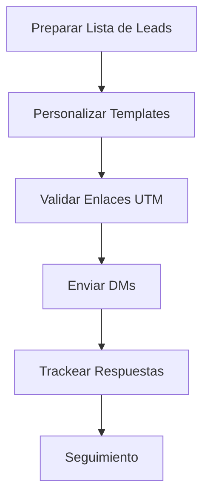

# 🔄 Flujos de Trabajo - Documentos BLATAM

Guía de flujos de trabajo comunes y mejores prácticas para usar Documentos BLATAM eficientemente.

---

## 📋 Tabla de Contenidos

- [Flujos de Marketing](#flujos-de-marketing)
- [Flujos de Ventas](#flujos-de-ventas)
- [Flujos de Documentación](#flujos-de-documentación)
- [Flujos de Automatización](#flujos-de-automatización)
- [Flujos de Análisis](#flujos-de-análisis)

---

## 📱 Flujos de Marketing

### Workflow 1: Campaña de DMs de Instagram

**Objetivo**: Enviar DMs personalizados para promocionar un webinar

**Pasos**:



**Proceso Detallado**:

1. **Preparación** (30 min)
```bash
# 1. Obtener lista de leads
cat leads.csv

# 2. Preparar templates
cd 01_marketing/Sequences
cp dm_template_webinar.md mi_campana.md
```

2. **Personalización** (2-3 horas para 100 leads)
```bash
# Usar script de personalización masiva
python scripts/personalize_dms.py \
  --template mi_campana.md \
  --leads leads.csv \
  --output dms_personalizados/
```

3. **Validación** (15 min)
```bash
# Validar enlaces UTM
node tools/validate_utms.js dms_personalizados/

# Verificar formato
python scripts/validate_dms.py dms_personalizados/
```

4. **Envío** (Manual o automatizado)
```bash
# Opción manual: Copiar y pegar
# Opción automatizada: Usar herramienta de automatización
```

5. **Tracking** (Ongoing)
```bash
# Registrar respuestas
# Actualizar métricas en dashboard
```

**Métricas a Trackear**:
- Enviados
- Respuestas
- Registros al webinar
- Asistencia

---

### Workflow 2: Secuencia de Email Nurturing

**Objetivo**: Nurture leads que descargaron un lead magnet

**Cronograma**:

| Día | Acción | Template |
|-----|--------|----------|
| 0 | Descarga lead magnet | Email inmediato |
| 1 | Follow-up | Email día 1 |
| 3 | Value add | Email día 3 |
| 7 | Oferta especial | Email día 7 |
| 14 | Re-engagement | Email día 14 |

**Automatización**:
```bash
# Configurar en herramienta de email marketing
# O usar script de automatización
python scripts/setup_email_sequence.py \
  --trigger "lead_magnet_download" \
  --sequence "nurturing_sequence"
```

---

## 💼 Flujos de Ventas

### Workflow 3: Proceso de Cierre de Venta

**Objetivo**: Guiar un lead desde el primer contacto hasta el cierre

**Etapas**:

1. **Descubrimiento** (30 min)
   - Llamada de descubrimiento
   - Script: `09_sales/Scripts/discovery_call.md`
   - Objetivo: Entender necesidades

2. **Presentación** (45 min)
   - Demo o presentación
   - Template: `09_sales/Presentations/`
   - Objetivo: Mostrar solución

3. **Propuesta** (1 semana)
   - Crear propuesta
   - Template: `09_sales/Templates/proposal.md`
   - Objetivo: Formalizar oferta

4. **Negociación** (Variable)
   - Manejar objeciones
   - Script: `09_sales/Objection_handling/`
   - Objetivo: Resolver dudas

5. **Cierre** (1 día)
   - Técnicas de cierre
   - Script: `09_sales/Closing_techniques/`
   - Objetivo: Obtener firma

**Tracking**:
```bash
# Actualizar CRM en cada etapa
# Usar dashboard de ventas
open 16_data_analytics/dashboard_ventas.csv
```

---

### Workflow 4: Manejo de Objeciones

**Objetivo**: Responder objeciones comunes de manera efectiva

**Proceso**:

1. **Identificar Objeción**
   - Escuchar activamente
   - Categorizar (precio, tiempo, necesidad, etc.)

2. **Validar Objeción**
   - "Entiendo tu preocupación sobre..."
   - "Déjame asegurarme de entender..."

3. **Responder**
   - Usar templates de `09_sales/Objection_handling/`
   - Personalizar según contexto

4. **Confirmar Resolución**
   - "¿Esto resuelve tu preocupación?"
   - "¿Hay algo más que te preocupe?"

**Templates Disponibles**:
- Objeción de precio
- Objeción de tiempo
- Objeción de necesidad
- Objeción de autoridad

---

## 📚 Flujos de Documentación

### Workflow 5: Crear Nuevo Documento

**Objetivo**: Agregar nueva documentación siguiendo estándares

**Proceso**:

1. **Planificación** (15 min)
```bash
# 1. Identificar categoría
# 2. Revisar estructura existente
# 3. Planificar contenido
```

2. **Creación** (1-2 horas)
```bash
# 1. Crear archivo con frontmatter
cat > nuevo_documento.md << EOF
---
title: "Título"
category: "categoria"
tags: ["tag1", "tag2"]
created: "$(date +%Y-%m-%d)"
path: "categoria/nuevo_documento.md"
---

# Título

Contenido...
EOF
```

3. **Validación** (10 min)
```bash
# Validar frontmatter
python 06_documentation/Scripts/frontmatter_validator.py nuevo_documento.md

# Verificar enlaces
python 06_documentation/Scripts/find_broken_links.py nuevo_documento.md
```

4. **Integración** (15 min)
```bash
# Actualizar índice
python 06_documentation/Scripts/generate_index.py

# Agregar a categoría correspondiente
mv nuevo_documento.md categoria/
```

5. **Review** (30 min)
```bash
# Revisar contenido
# Corregir errores
# Mejorar claridad
```

---

### Workflow 6: Actualizar Documentación Existente

**Objetivo**: Mantener documentación actualizada

**Proceso**:

1. **Identificar Cambios**
```bash
# Ver archivos modificados
git status

# Ver diferencias
git diff archivo.md
```

2. **Actualizar Contenido**
```bash
# Editar archivo
# Actualizar campo "updated" en frontmatter
```

3. **Validar**
```bash
# Validar formato
python 06_documentation/Scripts/frontmatter_validator.py

# Verificar enlaces
python 06_documentation/Scripts/find_broken_links.py
```

4. **Commit**
```bash
git add archivo.md
git commit -m "docs: Actualizar información sobre X"
```

---

## ⚙️ Flujos de Automatización

### Workflow 7: Automatización con Zapier/Make

**Objetivo**: Automatizar flujo de leads

**Configuración**:

1. **Trigger**: Nuevo lead en Google Sheets
2. **Acción 1**: Agregar a CRM
3. **Acción 2**: Enviar email de bienvenida
4. **Acción 3**: Agregar a secuencia
5. **Acción 4**: Notificar en Slack

**Template de Configuración**:
```json
{
  "workflow": "lead_automation",
  "trigger": {
    "app": "Google Sheets",
    "event": "New Row"
  },
  "actions": [
    {
      "app": "HubSpot",
      "action": "Create Contact"
    },
    {
      "app": "Gmail",
      "action": "Send Email",
      "template": "bienvenida"
    }
  ]
}
```

---

### Workflow 8: Organización Automática de Archivos

**Objetivo**: Mantener estructura organizada

**Proceso**:

1. **Detección** (Automático)
```bash
# Script detecta archivos en raíz
python organize_root_files.py --detect
```

2. **Clasificación** (Automático)
```bash
# Script clasifica según patrones
python organize_root_files.py --classify
```

3. **Organización** (Automático)
```bash
# Script mueve a carpetas apropiadas
python organize_root_files.py --organize
```

4. **Reporte** (Automático)
```bash
# Genera reporte de cambios
cat exports/organization_report.json
```

**Programar Automáticamente**:
```bash
# Agregar a crontab (Linux/macOS)
crontab -e
# Agregar: 0 2 * * * cd /path/to/project && python organize_root_files.py
```

---

## 📊 Flujos de Análisis

### Workflow 9: Análisis Semanal de Métricas

**Objetivo**: Revisar y analizar métricas semanalmente

**Proceso**:

1. **Recopilación** (Lunes, 9 AM)
```bash
# Exportar datos de diferentes fuentes
python scripts/export_metrics.py --week previous
```

2. **Consolidación** (Lunes, 10 AM)
```bash
# Consolidar en dashboard
python scripts/consolidate_metrics.py
```

3. **Análisis** (Lunes, 11 AM)
```bash
# Generar reporte de análisis
python scripts/analyze_metrics.py --generate-report
```

4. **Presentación** (Lunes, 2 PM)
```bash
# Generar presentación ejecutiva
python scripts/generate_executive_summary.py
```

5. **Acción** (Martes)
   - Revisar insights
   - Tomar decisiones
   - Implementar cambios

---

### Workflow 10: Cálculo de ROI de Campaña

**Objetivo**: Medir efectividad de campaña

**Proceso**:

1. **Recopilar Datos**
```bash
# Inversión
inversion = 2000  # USD

# Resultados
conversiones = 150
valor_conversion = 50  # USD
```

2. **Calcular Métricas**
```bash
# Usar calculadora
python scripts/calculate_roi.py \
  --investment 2000 \
  --conversions 150 \
  --value 50
```

3. **Generar Reporte**
```bash
# Reporte automático
python scripts/generate_roi_report.py
```

4. **Interpretar Resultados**
   - ROI > 200%: Excelente
   - ROI 100-200%: Bueno
   - ROI < 100%: Mejorar

---

## 🎯 Mejores Prácticas

### General

1. **Documentar Flujos**: Mantener documentación actualizada
2. **Automatizar Repetitivo**: Usar scripts para tareas repetitivas
3. **Validar Regularmente**: Ejecutar validaciones periódicas
4. **Medir Resultados**: Trackear métricas de cada flujo
5. **Iterar y Mejorar**: Ajustar basándose en resultados

### Específicas por Flujo

**Marketing**:
- Personalizar siempre
- Validar antes de enviar
- Trackear métricas
- A/B test variantes

**Ventas**:
- Seguir proceso estructurado
- Documentar interacciones
- Manejar objeciones proactivamente
- Cerrar con claridad

**Documentación**:
- Seguir estándares
- Validar antes de commit
- Actualizar índices
- Revisar regularmente

---

## 📚 Recursos Adicionales

- [`EXAMPLES.md`](EXAMPLES.md) - Ejemplos prácticos
- [`BEST_PRACTICES.md`](BEST_PRACTICES.md) - Mejores prácticas
- [`04_operations/`](04_operations/) - Scripts de automatización

---

**¿Tienes un flujo de trabajo que quieras compartir?**

Abre un PR con tu flujo y lo agregaremos a esta guía.

---

**Última actualización**: 2025-01-XX

