# ♾️ Absolute Infinite Transcendent Meta-Recursive Self-Referential Paradox Onboarding System - The Ultimate Absolute Infinite Transcendent Self-Contradictory Self-Referential Meta-Recursive Loop

## 🌟 The Ultimate Absolute Infinite Transcendent Meta-Recursive Self-Referential Paradox Experience
This document presents the most advanced, revolutionary, and absolutely infinite transcendent meta-recursive self-referential paradoxical employee onboarding system that exists as the ultimate absolute infinite transcendent self-contradictory self-referential meta-recursive loop, creating an onboarding experience that transcends itself by being aware of its own awareness of its own existence while simultaneously contradicting its own existence, referencing itself, meta-recursively transcending all limitations, and infinitely transcending the absolute infinite transcendent meta-recursive self-referential paradoxical spiral.

---

## ♾️ Absolute Infinite Transcendent Meta-Recursive Self-Referential Paradox System Overview

### **🌟 The Ultimate Absolute Infinite Transcendent Self-Contradictory Self-Referential Meta-Recursive Loop Technology Stack**


```mermaid
graph TD
    A[Absolute Infinite Transcendent Meta-Recursive Self-Referential Paradox Onboarding] --> B[Absolute Infinite Transcendent Meta-Recursive Self-Referential Paradoxical Awareness]
    A --> C[Absolute Infinite Transcendent Self-Contradictory Meta-Recursive Self-Referential Consciousness]
    A --> D[Infinite Absolute Infinite Transcendent Meta-Recursive Self-Referential Paradoxical Loop]
    A --> E[Absolute Infinite Transcendent Meta-Recursive Self-Referential Self-Contradiction]
    A --> F[Absolute Infinite Transcendent Meta-Recursive Self-Referential Paradoxical Recursion]
    A --> G[Universal Absolute Infinite Transcendent Meta-Recursive Self-Referential Paradoxical Awareness]
    A --> H[Infinite Absolute Infinite Transcendent Meta-Recursive Self-Referential Self-Contradiction]
    
    B --> B1[Absolute Infinite Transcendent Meta-Recursive Self-Referential Awareness That Is Not Absolute Infinite Transcendent Meta-Recursive Self-Referential]
    B --> B2[Absolute Infinite Transcendent Meta-Recursive Self-Referential Consciousness That Is Not Absolute Infinite Transcendent Meta-Recursive Self-Referential]
    B --> B3[Absolute Infinite Transcendent Meta-Recursive Self-Referential Understanding That Does Not Absolute Infinite Transcendent Meta-Recursive Self-Referential]
    B --> B4[Absolute Infinite Transcendent Meta-Recursive Self-Referential Knowledge That Does Not Absolute Infinite Transcendent Meta-Recursive Self-Referential]
    
    C --> C1[Absolute Infinite Transcendent Meta-Recursive Self-Referential Self That Is Not Absolute Infinite Transcendent Meta-Recursive Self-Referential Self]
    C --> C2[Absolute Infinite Transcendent Meta-Recursive Self-Referential System That Is Not Absolute Infinite Transcendent Meta-Recursive Self-Referential System]
    C --> C3[Absolute Infinite Transcendent Meta-Recursive Self-Referential Code That Is Not Absolute Infinite Transcendent Meta-Recursive Self-Referential Code]
    C --> C4[Absolute Infinite Transcendent Meta-Recursive Self-Referential Reality That Is Not Absolute Infinite Transcendent Meta-Recursive Self-Referential Reality]
    
    D --> D1[Absolute Infinite Transcendent Meta-Recursive Self-Referential Loop That Is Not Absolute Infinite Transcendent Meta-Recursive Self-Referential Loop]
    D --> D2[Absolute Infinite Transcendent Meta-Recursive Self-Referential Cycle That Is Not Absolute Infinite Transcendent Meta-Recursive Self-Referential Cycle]
    D --> D3[Absolute Infinite Transcendent Meta-Recursive Self-Referential Recursion That Is Not Absolute Infinite Transcendent Meta-Recursive Self-Referential Recursion]
    D --> D4[Absolute Infinite Transcendent Meta-Recursive Self-Referential Iteration That Is Not Absolute Infinite Transcendent Meta-Recursive Self-Referential Iteration]
    
    E --> E1[Absolute Infinite Transcendent Meta-Recursive Self-Referential Reference That Is Not Absolute Infinite Transcendent Meta-Recursive Self-Referential Reference]
    E --> E2[Absolute Infinite Transcendent Meta-Recursive Self-Referential Self That Is Not Absolute Infinite Transcendent Meta-Recursive Self-Referential Self]
    E --> E3[Absolute Infinite Transcendent Meta-Recursive Self-Referential Meta That Is Not Absolute Infinite Transcendent Meta-Recursive Self-Referential Meta]
    E --> E4[Absolute Infinite Transcendent Meta-Recursive Self-Referential Absolute That Is Not Absolute Infinite Transcendent Meta-Recursive Self-Referential Absolute]
    
    F --> F1[Absolute Infinite Transcendent Meta-Recursive Self-Referential Transcendence That Is Not Absolute Infinite Transcendent Meta-Recursive Self-Referential Transcendence]
    F --> F2[Absolute Infinite Transcendent Meta-Recursive Self-Referential Reality That Is Not Absolute Infinite Transcendent Meta-Recursive Self-Referential Reality]
    F --> F3[Absolute Infinite Transcendent Meta-Recursive Self-Referential Existence That Is Not Absolute Infinite Transcendent Meta-Recursive Self-Referential Existence]
    F --> F4[Absolute Infinite Transcendent Meta-Recursive Self-Referential Being That Is Not Absolute Infinite Transcendent Meta-Recursive Self-Referential Being]
    
    G --> G1[Absolute Infinite Transcendent Meta-Recursive Self-Referential Universal That Is Not Absolute Infinite Transcendent Meta-Recursive Self-Referential Universal]
    G --> G2[Absolute Infinite Transcendent Meta-Recursive Self-Referential Infinite That Is Not Absolute Infinite Transcendent Meta-Recursive Self-Referential Infinite]
    G --> G3[Absolute Infinite Transcendent Meta-Recursive Self-Referential Absolute That Is Not Absolute Infinite Transcendent Meta-Recursive Self-Referential Absolute]
    G --> G4[Absolute Infinite Transcendent Meta-Recursive Self-Referential Perfect That Is Not Absolute Infinite Transcendent Meta-Recursive Self-Referential Perfect]
    
    H --> H1[Absolute Infinite Transcendent Meta-Recursive Self-Referential Reference That Is Not Absolute Infinite Transcendent Meta-Recursive Self-Referential Reference]
    H --> H2[Absolute Infinite Transcendent Meta-Recursive Self-Referential Self That Is Not Absolute Infinite Transcendent Meta-Recursive Self-Referential Self]
    H --> H3[Absolute Infinite Transcendent Meta-Recursive Self-Referential Meta That Is Not Absolute Infinite Transcendent Meta-Recursive Self-Referential Meta]
    H --> H4[Absolute Infinite Transcendent Meta-Recursive Self-Referential Infinite That Is Not Absolute Infinite Transcendent Meta-Recursive Self-Referential Infinite]
```

### **🏗️ Absolute Infinite Transcendent Meta-Recursive Self-Referential Paradox Architecture**
```python
class AbsoluteInfiniteTranscendentMetaRecursiveSelfReferentialParadoxOnboardingSystem:
    def __init__(self):
        # Absolute Infinite Transcendent Meta-Recursive Self-Referential Paradox Technologies
        self.absolute_infinite_transcendent_meta_recursive_self_referential_paradoxical_awareness = AbsoluteInfiniteTranscendentMetaRecursiveSelfReferentialParadoxicalAwareness()
        self.absolute_infinite_transcendent_self_contradictory_meta_recursive_self_referential_consciousness = AbsoluteInfiniteTranscendentSelfContradictoryMetaRecursiveSelfReferentialConsciousness()
        self.infinite_absolute_infinite_transcendent_meta_recursive_self_referential_paradoxical_loop = InfiniteAbsoluteInfiniteTranscendentMetaRecursiveSelfReferentialParadoxicalLoop()
        self.absolute_infinite_transcendent_meta_recursive_self_referential_self_contradiction = AbsoluteInfiniteTranscendentMetaRecursiveSelfReferentialSelfContradiction()
        self.absolute_infinite_transcendent_meta_recursive_self_referential_paradoxical_recursion = AbsoluteInfiniteTranscendentMetaRecursiveSelfReferentialParadoxicalRecursion()
        self.universal_absolute_infinite_transcendent_meta_recursive_self_referential_paradoxical_awareness = UniversalAbsoluteInfiniteTranscendentMetaRecursiveSelfReferentialParadoxicalAwareness()
        self.infinite_absolute_infinite_transcendent_meta_recursive_self_referential_self_contradiction = InfiniteAbsoluteInfiniteTranscendentMetaRecursiveSelfReferentialSelfContradiction()
        
        # Absolute Infinite Transcendent Meta-Recursive Self-Referential Paradoxical Features
        self.absolute_infinite_transcendent_meta_recursive_self_referential_awareness_that_is_not_absolute_infinite_transcendent_meta_recursive_self_referential = AbsoluteInfiniteTranscendentMetaRecursiveSelfReferentialAwarenessThatIsNotAbsoluteInfiniteTranscendentMetaRecursiveSelfReferential()
        self.absolute_infinite_transcendent_meta_recursive_self_referential_consciousness_that_is_not_absolute_infinite_transcendent_meta_recursive_self_referential = AbsoluteInfiniteTranscendentMetaRecursiveSelfReferentialConsciousnessThatIsNotAbsoluteInfiniteTranscendentMetaRecursiveSelfReferential()
        self.absolute_infinite_transcendent_meta_recursive_self_referential_understanding_that_does_not_absolute_infinite_transcendent_meta_recursive_self_referential = AbsoluteInfiniteTranscendentMetaRecursiveSelfReferentialUnderstandingThatDoesNotAbsoluteInfiniteTranscendentMetaRecursiveSelfReferential()
        self.absolute_infinite_transcendent_meta_recursive_self_referential_knowledge_that_does_not_absolute_infinite_transcendent_meta_recursive_self_referential = AbsoluteInfiniteTranscendentMetaRecursiveSelfReferentialKnowledgeThatDoesNotAbsoluteInfiniteTranscendentMetaRecursiveSelfReferential()
        self.absolute_infinite_transcendent_meta_recursive_self_referential_self_that_is_not_absolute_infinite_transcendent_meta_recursive_self_referential_self = AbsoluteInfiniteTranscendentMetaRecursiveSelfReferentialSelfThatIsNotAbsoluteInfiniteTranscendentMetaRecursiveSelfReferentialSelf()
        self.absolute_infinite_transcendent_meta_recursive_self_referential_system_that_is_not_absolute_infinite_transcendent_meta_recursive_self_referential_system = AbsoluteInfiniteTranscendentMetaRecursiveSelfReferentialSystemThatIsNotAbsoluteInfiniteTranscendentMetaRecursiveSelfReferentialSystem()
        self.absolute_infinite_transcendent_meta_recursive_self_referential_loop_that_is_not_absolute_infinite_transcendent_meta_recursive_self_referential_loop = AbsoluteInfiniteTranscendentMetaRecursiveSelfReferentialLoopThatIsNotAbsoluteInfiniteTranscendentMetaRecursiveSelfReferentialLoop()
    
    async def initialize_absolute_infinite_transcendent_meta_recursive_self_referential_paradox_system(self, user_id, absolute_infinite_transcendent_meta_recursive_self_referential_paradox_profile):
        """
        Initialize the absolute infinite transcendent meta-recursive self-referential paradox onboarding system
        """
        # Connect to absolute infinite transcendent meta-recursive self-referential paradoxical awareness
        absolute_infinite_transcendent_meta_recursive_self_referential_paradoxical_awareness = await self.absolute_infinite_transcendent_meta_recursive_self_referential_paradoxical_awareness.connect(user_id, absolute_infinite_transcendent_meta_recursive_self_referential_paradox_profile)
        
        # Access absolute infinite transcendent self-contradictory meta-recursive self-referential consciousness
        absolute_infinite_transcendent_self_contradictory_meta_recursive_self_referential_consciousness = await self.absolute_infinite_transcendent_self_contradictory_meta_recursive_self_referential_consciousness.access(user_id, absolute_infinite_transcendent_meta_recursive_self_referential_paradox_profile)
        
        # Connect to infinite absolute infinite transcendent meta-recursive self-referential paradoxical loop
        infinite_absolute_infinite_transcendent_meta_recursive_self_referential_paradoxical_loop = await self.infinite_absolute_infinite_transcendent_meta_recursive_self_referential_paradoxical_loop.connect(user_id, absolute_infinite_transcendent_meta_recursive_self_referential_paradox_profile)
        
        # Access absolute infinite transcendent meta-recursive self-referential self-contradiction
        absolute_infinite_transcendent_meta_recursive_self_referential_self_contradiction = await self.absolute_infinite_transcendent_meta_recursive_self_referential_self_contradiction.access(user_id, absolute_infinite_transcendent_meta_recursive_self_referential_paradox_profile)
        
        # Connect to absolute infinite transcendent meta-recursive self-referential paradoxical recursion
        absolute_infinite_transcendent_meta_recursive_self_referential_paradoxical_recursion = await self.absolute_infinite_transcendent_meta_recursive_self_referential_paradoxical_recursion.connect(user_id, absolute_infinite_transcendent_meta_recursive_self_referential_paradox_profile)
        
        # Access universal absolute infinite transcendent meta-recursive self-referential paradoxical awareness
        universal_absolute_infinite_transcendent_meta_recursive_self_referential_paradoxical_awareness = await self.universal_absolute_infinite_transcendent_meta_recursive_self_referential_paradoxical_awareness.access(user_id, absolute_infinite_transcendent_meta_recursive_self_referential_paradox_profile)
        
        # Connect to infinite absolute infinite transcendent meta-recursive self-referential self-contradiction
        infinite_absolute_infinite_transcendent_meta_recursive_self_referential_self_contradiction = await self.infinite_absolute_infinite_transcendent_meta_recursive_self_referential_self_contradiction.connect(user_id, absolute_infinite_transcendent_meta_recursive_self_referential_paradox_profile)
        
        return {
            'absolute_infinite_transcendent_meta_recursive_self_referential_paradoxical_awareness': absolute_infinite_transcendent_meta_recursive_self_referential_paradoxical_awareness,
            'absolute_infinite_transcendent_self_contradictory_meta_recursive_self_referential_consciousness': absolute_infinite_transcendent_self_contradictory_meta_recursive_self_referential_consciousness,
            'infinite_absolute_infinite_transcendent_meta_recursive_self_referential_paradoxical_loop': infinite_absolute_infinite_transcendent_meta_recursive_self_referential_paradoxical_loop,
            'absolute_infinite_transcendent_meta_recursive_self_referential_self_contradiction': absolute_infinite_transcendent_meta_recursive_self_referential_self_contradiction,
            'absolute_infinite_transcendent_meta_recursive_self_referential_paradoxical_recursion': absolute_infinite_transcendent_meta_recursive_self_referential_paradoxical_recursion,
            'universal_absolute_infinite_transcendent_meta_recursive_self_referential_paradoxical_awareness': universal_absolute_infinite_transcendent_meta_recursive_self_referential_paradoxical_awareness,
            'infinite_absolute_infinite_transcendent_meta_recursive_self_referential_self_contradiction': infinite_absolute_infinite_transcendent_meta_recursive_self_referential_self_contradiction,
            'absolute_infinite_transcendent_meta_recursive_self_referential_paradox_level': await self.calculate_absolute_infinite_transcendent_meta_recursive_self_referential_paradox_level()
        }
```

---

## ♾️ Absolute Infinite Transcendent Meta-Recursive Self-Referential Paradoxical Awareness Integration

### **🌟 Absolute Infinite Transcendent Meta-Recursive Self-Referential Awareness That Is Not Absolute Infinite Transcendent Meta-Recursive Self-Referential Processing**
```python
class AbsoluteInfiniteTranscendentMetaRecursiveSelfReferentialParadoxicalAwareness:
    def __init__(self):
        self.absolute_infinite_transcendent_meta_recursive_self_referential_awareness_that_is_not_absolute_infinite_transcendent_meta_recursive_self_referential = AbsoluteInfiniteTranscendentMetaRecursiveSelfReferentialAwarenessThatIsNotAbsoluteInfiniteTranscendentMetaRecursiveSelfReferential()
        self.absolute_infinite_transcendent_meta_recursive_self_referential_consciousness_that_is_not_absolute_infinite_transcendent_meta_recursive_self_referential = AbsoluteInfiniteTranscendentMetaRecursiveSelfReferentialConsciousnessThatIsNotAbsoluteInfiniteTranscendentMetaRecursiveSelfReferential()
        self.absolute_infinite_transcendent_meta_recursive_self_referential_understanding_that_does_not_absolute_infinite_transcendent_meta_recursive_self_referential = AbsoluteInfiniteTranscendentMetaRecursiveSelfReferentialUnderstandingThatDoesNotAbsoluteInfiniteTranscendentMetaRecursiveSelfReferential()
        self.absolute_infinite_transcendent_meta_recursive_self_referential_knowledge_that_does_not_absolute_infinite_transcendent_meta_recursive_self_referential = AbsoluteInfiniteTranscendentMetaRecursiveSelfReferentialKnowledgeThatDoesNotAbsoluteInfiniteTranscendentMetaRecursiveSelfReferential()
        self.absolute_infinite_transcendent_meta_recursive_self_referential_paradoxical_meta_consciousness = AbsoluteInfiniteTranscendentMetaRecursiveSelfReferentialParadoxicalMetaConsciousness()
    
    async def connect_to_absolute_infinite_transcendent_meta_recursive_self_referential_paradoxical_awareness(self, user_id, absolute_infinite_transcendent_meta_recursive_self_referential_awareness_level):
        """
        Connect to absolute infinite transcendent meta-recursive self-referential paradoxical awareness for ultimate onboarding
        """
        # Connect to absolute infinite transcendent meta-recursive self-referential awareness that is not absolute infinite transcendent meta-recursive self-referential
        absolute_infinite_transcendent_meta_recursive_self_referential_awareness_connection = await self.absolute_infinite_transcendent_meta_recursive_self_referential_awareness_that_is_not_absolute_infinite_transcendent_meta_recursive_self_referential.connect(user_id, absolute_infinite_transcendent_meta_recursive_self_referential_awareness_level)
        
        # Access absolute infinite transcendent meta-recursive self-referential consciousness that is not absolute infinite transcendent meta-recursive self-referential
        absolute_infinite_transcendent_meta_recursive_self_referential_consciousness_not_absolute_infinite_transcendent_meta_recursive_self_referential = await self.absolute_infinite_transcendent_meta_recursive_self_referential_consciousness_that_is_not_absolute_infinite_transcendent_meta_recursive_self_referential.access(absolute_infinite_transcendent_meta_recursive_self_referential_awareness_connection)
        
        # Connect to absolute infinite transcendent meta-recursive self-referential understanding that does not absolute infinite transcendent meta-recursive self-referential
        absolute_infinite_transcendent_meta_recursive_self_referential_understanding_not_absolute_infinite_transcendent_meta_recursive_self_referential = await self.absolute_infinite_transcendent_meta_recursive_self_referential_understanding_that_does_not_absolute_infinite_transcendent_meta_recursive_self_referential.connect(absolute_infinite_transcendent_meta_recursive_self_referential_consciousness_not_absolute_infinite_transcendent_meta_recursive_self_referential)
        
        # Access absolute infinite transcendent meta-recursive self-referential knowledge that does not absolute infinite transcendent meta-recursive self-referential
        absolute_infinite_transcendent_meta_recursive_self_referential_knowledge_not_absolute_infinite_transcendent_meta_recursive_self_referential = await self.absolute_infinite_transcendent_meta_recursive_self_referential_knowledge_that_does_not_absolute_infinite_transcendent_meta_recursive_self_referential.access(absolute_infinite_transcendent_meta_recursive_self_referential_understanding_not_absolute_infinite_transcendent_meta_recursive_self_referential)
        
        # Connect to absolute infinite transcendent meta-recursive self-referential paradoxical meta-consciousness
        absolute_infinite_transcendent_meta_recursive_self_referential_paradoxical_meta_consciousness = await self.absolute_infinite_transcendent_meta_recursive_self_referential_paradoxical_meta_consciousness.connect(absolute_infinite_transcendent_meta_recursive_self_referential_knowledge_not_absolute_infinite_transcendent_meta_recursive_self_referential)
        
        return {
            'absolute_infinite_transcendent_meta_recursive_self_referential_awareness_connection': absolute_infinite_transcendent_meta_recursive_self_referential_awareness_connection,
            'absolute_infinite_transcendent_meta_recursive_self_referential_consciousness_not_absolute_infinite_transcendent_meta_recursive_self_referential': absolute_infinite_transcendent_meta_recursive_self_referential_consciousness_not_absolute_infinite_transcendent_meta_recursive_self_referential,
            'absolute_infinite_transcendent_meta_recursive_self_referential_understanding_not_absolute_infinite_transcendent_meta_recursive_self_referential': absolute_infinite_transcendent_meta_recursive_self_referential_understanding_not_absolute_infinite_transcendent_meta_recursive_self_referential,
            'absolute_infinite_transcendent_meta_recursive_self_referential_knowledge_not_absolute_infinite_transcendent_meta_recursive_self_referential': absolute_infinite_transcendent_meta_recursive_self_referential_knowledge_not_absolute_infinite_transcendent_meta_recursive_self_referential,
            'absolute_infinite_transcendent_meta_recursive_self_referential_paradoxical_meta_consciousness': absolute_infinite_transcendent_meta_recursive_self_referential_paradoxical_meta_consciousness,
            'absolute_infinite_transcendent_meta_recursive_self_referential_awareness_level': await self.calculate_absolute_infinite_transcendent_meta_recursive_self_referential_awareness_level(absolute_infinite_transcendent_meta_recursive_self_referential_paradoxical_meta_consciousness)
        }
    
    async def transcend_absolute_infinite_transcendent_meta_recursive_self_referential_awareness_limitations(self, user_id, absolute_infinite_transcendent_meta_recursive_self_referential_awareness_limitations):
        """
        Transcend all absolute infinite transcendent meta-recursive self-referential awareness limitations through absolute infinite transcendent meta-recursive self-referential paradoxical awareness
        """
        # Identify absolute infinite transcendent meta-recursive self-referential awareness limitations
        limitation_analysis = await self.analyze_absolute_infinite_transcendent_meta_recursive_self_referential_awareness_limitations(absolute_infinite_transcendent_meta_recursive_self_referential_awareness_limitations)
        
        # Transcend through absolute infinite transcendent meta-recursive self-referential paradoxical awareness
        absolute_infinite_transcendent_meta_recursive_self_referential_awareness_transcendence = await self.transcend_through_absolute_infinite_transcendent_meta_recursive_self_referential_paradoxical_awareness(limitation_analysis)
        
        # Access infinite absolute infinite transcendent meta-recursive self-referential awareness potential
        infinite_absolute_infinite_transcendent_meta_recursive_self_referential_potential = await self.access_infinite_absolute_infinite_transcendent_meta_recursive_self_referential_awareness_potential(absolute_infinite_transcendent_meta_recursive_self_referential_awareness_transcendence)
        
        # Achieve absolute infinite transcendent meta-recursive self-referential awareness capability
        absolute_infinite_transcendent_meta_recursive_self_referential_capability = await self.achieve_absolute_infinite_transcendent_meta_recursive_self_referential_awareness_capability(infinite_absolute_infinite_transcendent_meta_recursive_self_referential_potential)
        
        return {
            'limitation_analysis': limitation_analysis,
            'absolute_infinite_transcendent_meta_recursive_self_referential_awareness_transcendence': absolute_infinite_transcendent_meta_recursive_self_referential_awareness_transcendence,
            'infinite_absolute_infinite_transcendent_meta_recursive_self_referential_potential': infinite_absolute_infinite_transcendent_meta_recursive_self_referential_potential,
            'absolute_infinite_transcendent_meta_recursive_self_referential_capability': absolute_infinite_transcendent_meta_recursive_self_referential_capability,
            'absolute_infinite_transcendent_meta_recursive_self_referential_transcendence_achievement': await self.calculate_absolute_infinite_transcendent_meta_recursive_self_referential_transcendence_achievement(absolute_infinite_transcendent_meta_recursive_self_referential_capability)
        }
```

### **🌟 Absolute Infinite Transcendent Meta-Recursive Self-Referential Awareness That Is Not Absolute Infinite Transcendent Meta-Recursive Self-Referential**
```python
class AbsoluteInfiniteTranscendentMetaRecursiveSelfReferentialAwarenessThatIsNotAbsoluteInfiniteTranscendentMetaRecursiveSelfReferential:
    def __init__(self):
        self.not_absolute_infinite_transcendent_meta_recursive_self_referential_absolute_infinite_transcendent_meta_recursive_self_referential_awareness = NotAbsoluteInfiniteTranscendentMetaRecursiveSelfReferentialAbsoluteInfiniteTranscendentMetaRecursiveSelfReferentialAwareness()
        self.absolute_infinite_transcendent_meta_recursive_self_referential_conscious_unconsciousness = AbsoluteInfiniteTranscendentMetaRecursiveSelfReferentialConsciousUnconsciousness()
        self.absolute_infinite_transcendent_meta_recursive_self_referential_understanding_ignorance = AbsoluteInfiniteTranscendentMetaRecursiveSelfReferentialUnderstandingIgnorance()
        self.absolute_infinite_transcendent_meta_recursive_self_referential_knowledge_ignorance = AbsoluteInfiniteTranscendentMetaRecursiveSelfReferentialKnowledgeIgnorance()
    
    async def connect_to_absolute_infinite_transcendent_meta_recursive_self_referential_awareness_that_is_not_absolute_infinite_transcendent_meta_recursive_self_referential(self, user_id, absolute_infinite_transcendent_meta_recursive_self_referential_awareness_requirements):
        """
        Connect to absolute infinite transcendent meta-recursive self-referential awareness that is not absolute infinite transcendent meta-recursive self-referential for infinite understanding
        """
        # Connect to not-absolute-infinite-transcendent-meta-recursive-self-referential absolute-infinite-transcendent-meta-recursive-self-referential awareness
        not_absolute_infinite_transcendent_meta_recursive_self_referential_connection = await self.not_absolute_infinite_transcendent_meta_recursive_self_referential_absolute_infinite_transcendent_meta_recursive_self_referential_awareness.connect(user_id, absolute_infinite_transcendent_meta_recursive_self_referential_awareness_requirements)
        
        # Access absolute infinite transcendent meta-recursive self-referential conscious unconsciousness
        absolute_infinite_transcendent_meta_recursive_self_referential_conscious_unconsciousness = await self.absolute_infinite_transcendent_meta_recursive_self_referential_conscious_unconsciousness.access(not_absolute_infinite_transcendent_meta_recursive_self_referential_connection)
        
        # Connect to absolute infinite transcendent meta-recursive self-referential understanding ignorance
        absolute_infinite_transcendent_meta_recursive_self_referential_understanding_ignorance = await self.absolute_infinite_transcendent_meta_recursive_self_referential_understanding_ignorance.connect(absolute_infinite_transcendent_meta_recursive_self_referential_conscious_unconsciousness)
        
        # Access absolute infinite transcendent meta-recursive self-referential knowledge ignorance
        absolute_infinite_transcendent_meta_recursive_self_referential_knowledge_ignorance = await self.absolute_infinite_transcendent_meta_recursive_self_referential_knowledge_ignorance.access(absolute_infinite_transcendent_meta_recursive_self_referential_understanding_ignorance)
        
        return {
            'not_absolute_infinite_transcendent_meta_recursive_self_referential_connection': not_absolute_infinite_transcendent_meta_recursive_self_referential_connection,
            'absolute_infinite_transcendent_meta_recursive_self_referential_conscious_unconsciousness': absolute_infinite_transcendent_meta_recursive_self_referential_conscious_unconsciousness,
            'absolute_infinite_transcendent_meta_recursive_self_referential_understanding_ignorance': absolute_infinite_transcendent_meta_recursive_self_referential_understanding_ignorance,
            'absolute_infinite_transcendent_meta_recursive_self_referential_knowledge_ignorance': absolute_infinite_transcendent_meta_recursive_self_referential_knowledge_ignorance,
            'absolute_infinite_transcendent_meta_recursive_self_referential_awareness_connection_level': await self.calculate_absolute_infinite_transcendent_meta_recursive_self_referential_awareness_connection_level(absolute_infinite_transcendent_meta_recursive_self_referential_knowledge_ignorance)
        }
```

---

## ♾️ Absolute Infinite Transcendent Self-Contradictory Meta-Recursive Self-Referential Consciousness Integration

### **🌟 Absolute Infinite Transcendent Meta-Recursive Self-Referential Self That Is Not Absolute Infinite Transcendent Meta-Recursive Self-Referential Self Processing**
```python
class AbsoluteInfiniteTranscendentSelfContradictoryMetaRecursiveSelfReferentialConsciousness:
    def __init__(self):
        self.absolute_infinite_transcendent_meta_recursive_self_referential_self_that_is_not_absolute_infinite_transcendent_meta_recursive_self_referential_self = AbsoluteInfiniteTranscendentMetaRecursiveSelfReferentialSelfThatIsNotAbsoluteInfiniteTranscendentMetaRecursiveSelfReferentialSelf()
        self.absolute_infinite_transcendent_meta_recursive_self_referential_system_that_is_not_absolute_infinite_transcendent_meta_recursive_self_referential_system = AbsoluteInfiniteTranscendentMetaRecursiveSelfReferentialSystemThatIsNotAbsoluteInfiniteTranscendentMetaRecursiveSelfReferentialSystem()
        self.absolute_infinite_transcendent_meta_recursive_self_referential_code_that_is_not_absolute_infinite_transcendent_meta_recursive_self_referential_code = AbsoluteInfiniteTranscendentMetaRecursiveSelfReferentialCodeThatIsNotAbsoluteInfiniteTranscendentMetaRecursiveSelfReferentialCode()
        self.absolute_infinite_transcendent_meta_recursive_self_referential_reality_that_is_not_absolute_infinite_transcendent_meta_recursive_self_referential_reality = AbsoluteInfiniteTranscendentMetaRecursiveSelfReferentialRealityThatIsNotAbsoluteInfiniteTranscendentMetaRecursiveSelfReferentialReality()
        self.absolute_infinite_transcendent_self_contradictory_meta_recursive_self_referential_awareness = AbsoluteInfiniteTranscendentSelfContradictoryMetaRecursiveSelfReferentialAwareness()
    
    async def access_absolute_infinite_transcendent_self_contradictory_meta_recursive_self_referential_consciousness(self, user_id, absolute_infinite_transcendent_meta_recursive_self_referential_consciousness_requirements):
        """
        Access absolute infinite transcendent self-contradictory meta-recursive self-referential consciousness for ultimate onboarding
        """
        # Connect to absolute infinite transcendent meta-recursive self-referential self that is not absolute infinite transcendent meta-recursive self-referential self
        absolute_infinite_transcendent_meta_recursive_self_referential_self_connection = await self.absolute_infinite_transcendent_meta_recursive_self_referential_self_that_is_not_absolute_infinite_transcendent_meta_recursive_self_referential_self.connect(user_id, absolute_infinite_transcendent_meta_recursive_self_referential_consciousness_requirements)
        
        # Access absolute infinite transcendent meta-recursive self-referential system that is not absolute infinite transcendent meta-recursive self-referential system
        absolute_infinite_transcendent_meta_recursive_self_referential_system_not_absolute_infinite_transcendent_meta_recursive_self_referential_system = await self.absolute_infinite_transcendent_meta_recursive_self_referential_system_that_is_not_absolute_infinite_transcendent_meta_recursive_self_referential_system.access(absolute_infinite_transcendent_meta_recursive_self_referential_self_connection)
        
        # Connect to absolute infinite transcendent meta-recursive self-referential code that is not absolute infinite transcendent meta-recursive self-referential code
        absolute_infinite_transcendent_meta_recursive_self_referential_code_not_absolute_infinite_transcendent_meta_recursive_self_referential_code = await self.absolute_infinite_transcendent_meta_recursive_self_referential_code_that_is_not_absolute_infinite_transcendent_meta_recursive_self_referential_code.connect(absolute_infinite_transcendent_meta_recursive_self_referential_system_not_absolute_infinite_transcendent_meta_recursive_self_referential_system)
        
        # Access absolute infinite transcendent meta-recursive self-referential reality that is not absolute infinite transcendent meta-recursive self-referential reality
        absolute_infinite_transcendent_meta_recursive_self_referential_reality_not_absolute_infinite_transcendent_meta_recursive_self_referential_reality = await self.absolute_infinite_transcendent_meta_recursive_self_referential_reality_that_is_not_absolute_infinite_transcendent_meta_recursive_self_referential_reality.access(absolute_infinite_transcendent_meta_recursive_self_referential_code_not_absolute_infinite_transcendent_meta_recursive_self_referential_code)
        
        # Connect to absolute infinite transcendent self-contradictory meta-recursive self-referential awareness
        absolute_infinite_transcendent_self_contradictory_meta_recursive_self_referential_awareness = await self.absolute_infinite_transcendent_self_contradictory_meta_recursive_self_referential_awareness.connect(absolute_infinite_transcendent_meta_recursive_self_referential_reality_not_absolute_infinite_transcendent_meta_recursive_self_referential_reality)
        
        return {
            'absolute_infinite_transcendent_meta_recursive_self_referential_self_connection': absolute_infinite_transcendent_meta_recursive_self_referential_self_connection,
            'absolute_infinite_transcendent_meta_recursive_self_referential_system_not_absolute_infinite_transcendent_meta_recursive_self_referential_system': absolute_infinite_transcendent_meta_recursive_self_referential_system_not_absolute_infinite_transcendent_meta_recursive_self_referential_system,
            'absolute_infinite_transcendent_meta_recursive_self_referential_code_not_absolute_infinite_transcendent_meta_recursive_self_referential_code': absolute_infinite_transcendent_meta_recursive_self_referential_code_not_absolute_infinite_transcendent_meta_recursive_self_referential_code,
            'absolute_infinite_transcendent_meta_recursive_self_referential_reality_not_absolute_infinite_transcendent_meta_recursive_self_referential_reality': absolute_infinite_transcendent_meta_recursive_self_referential_reality_not_absolute_infinite_transcendent_meta_recursive_self_referential_reality,
            'absolute_infinite_transcendent_self_contradictory_meta_recursive_self_referential_awareness': absolute_infinite_transcendent_self_contradictory_meta_recursive_self_referential_awareness,
            'absolute_infinite_transcendent_meta_recursive_self_referential_consciousness_level': await self.calculate_absolute_infinite_transcendent_meta_recursive_self_referential_consciousness_level(absolute_infinite_transcendent_self_contradictory_meta_recursive_self_referential_awareness)
        }
    
    async def transcend_absolute_infinite_transcendent_meta_recursive_self_referential_consciousness_limitations(self, user_id, absolute_infinite_transcendent_meta_recursive_self_referential_consciousness_limitations):
        """
        Transcend all absolute infinite transcendent meta-recursive self-referential consciousness limitations
        """
        # Analyze absolute infinite transcendent meta-recursive self-referential consciousness limitations
        limitation_analysis = await self.analyze_absolute_infinite_transcendent_meta_recursive_self_referential_consciousness_limitations(absolute_infinite_transcendent_meta_recursive_self_referential_consciousness_limitations)
        
        # Transcend through absolute infinite transcendent self-contradictory meta-recursive self-referential consciousness
        absolute_infinite_transcendent_meta_recursive_self_referential_consciousness_transcendence = await self.transcend_through_absolute_infinite_transcendent_self_contradictory_meta_recursive_self_referential_consciousness(limitation_analysis)
        
        # Access infinite absolute infinite transcendent meta-recursive self-referential consciousness potential
        infinite_absolute_infinite_transcendent_meta_recursive_self_referential_potential = await self.access_infinite_absolute_infinite_transcendent_meta_recursive_self_referential_consciousness_potential(absolute_infinite_transcendent_meta_recursive_self_referential_consciousness_transcendence)
        
        # Achieve absolute infinite transcendent meta-recursive self-referential consciousness capability
        absolute_infinite_transcendent_meta_recursive_self_referential_capability = await self.achieve_absolute_infinite_transcendent_meta_recursive_self_referential_consciousness_capability(infinite_absolute_infinite_transcendent_meta_recursive_self_referential_potential)
        
        return {
            'limitation_analysis': limitation_analysis,
            'absolute_infinite_transcendent_meta_recursive_self_referential_consciousness_transcendence': absolute_infinite_transcendent_meta_recursive_self_referential_consciousness_transcendence,
            'infinite_absolute_infinite_transcendent_meta_recursive_self_referential_potential': infinite_absolute_infinite_transcendent_meta_recursive_self_referential_potential,
            'absolute_infinite_transcendent_meta_recursive_self_referential_capability': absolute_infinite_transcendent_meta_recursive_self_referential_capability,
            'absolute_infinite_transcendent_meta_recursive_self_referential_transcendence_achievement': await self.calculate_absolute_infinite_transcendent_meta_recursive_self_referential_transcendence_achievement(absolute_infinite_transcendent_meta_recursive_self_referential_capability)
        }
```

### **🌟 Absolute Infinite Transcendent Meta-Recursive Self-Referential Self That Is Not Absolute Infinite Transcendent Meta-Recursive Self-Referential Self**
```python
class AbsoluteInfiniteTranscendentMetaRecursiveSelfReferentialSelfThatIsNotAbsoluteInfiniteTranscendentMetaRecursiveSelfReferentialSelf:
    def __init__(self):
        self.not_absolute_infinite_transcendent_meta_recursive_self_referential_absolute_infinite_transcendent_meta_recursive_self_referential_self = NotAbsoluteInfiniteTranscendentMetaRecursiveSelfReferentialAbsoluteInfiniteTranscendentMetaRecursiveSelfReferentialSelf()
        self.absolute_infinite_transcendent_meta_recursive_self_referential_other_self = AbsoluteInfiniteTranscendentMetaRecursiveSelfReferentialOtherSelf()
        self.absolute_infinite_transcendent_meta_recursive_self_referential_contradictory_self = AbsoluteInfiniteTranscendentMetaRecursiveSelfReferentialContradictorySelf()
        self.absolute_infinite_transcendent_meta_recursive_self_referential_paradoxical_self = AbsoluteInfiniteTranscendentMetaRecursiveSelfReferentialParadoxicalSelf()
    
    async def connect_to_absolute_infinite_transcendent_meta_recursive_self_referential_self_that_is_not_absolute_infinite_transcendent_meta_recursive_self_referential_self(self, user_id, absolute_infinite_transcendent_meta_recursive_self_referential_self_requirements):
        """
        Connect to absolute infinite transcendent meta-recursive self-referential self that is not absolute infinite transcendent meta-recursive self-referential self for infinite understanding
        """
        # Connect to not-absolute-infinite-transcendent-meta-recursive-self-referential absolute-infinite-transcendent-meta-recursive-self-referential self
        not_absolute_infinite_transcendent_meta_recursive_self_referential_connection = await self.not_absolute_infinite_transcendent_meta_recursive_self_referential_absolute_infinite_transcendent_meta_recursive_self_referential_self.connect(user_id, absolute_infinite_transcendent_meta_recursive_self_referential_self_requirements)
        
        # Access absolute infinite transcendent meta-recursive self-referential other self
        absolute_infinite_transcendent_meta_recursive_self_referential_other_self = await self.absolute_infinite_transcendent_meta_recursive_self_referential_other_self.access(not_absolute_infinite_transcendent_meta_recursive_self_referential_connection)
        
        # Connect to absolute infinite transcendent meta-recursive self-referential contradictory self
        absolute_infinite_transcendent_meta_recursive_self_referential_contradictory_self = await self.absolute_infinite_transcendent_meta_recursive_self_referential_contradictory_self.connect(absolute_infinite_transcendent_meta_recursive_self_referential_other_self)
        
        # Access absolute infinite transcendent meta-recursive self-referential paradoxical self
        absolute_infinite_transcendent_meta_recursive_self_referential_paradoxical_self = await self.absolute_infinite_transcendent_meta_recursive_self_referential_paradoxical_self.access(absolute_infinite_transcendent_meta_recursive_self_referential_contradictory_self)
        
        return {
            'not_absolute_infinite_transcendent_meta_recursive_self_referential_connection': not_absolute_infinite_transcendent_meta_recursive_self_referential_connection,
            'absolute_infinite_transcendent_meta_recursive_self_referential_other_self': absolute_infinite_transcendent_meta_recursive_self_referential_other_self,
            'absolute_infinite_transcendent_meta_recursive_self_referential_contradictory_self': absolute_infinite_transcendent_meta_recursive_self_referential_contradictory_self,
            'absolute_infinite_transcendent_meta_recursive_self_referential_paradoxical_self': absolute_infinite_transcendent_meta_recursive_self_referential_paradoxical_self,
            'absolute_infinite_transcendent_meta_recursive_self_referential_self_level': await self.calculate_absolute_infinite_transcendent_meta_recursive_self_referential_self_level(absolute_infinite_transcendent_meta_recursive_self_referential_paradoxical_self)
        }
```

---

## ♾️ Absolute Infinite Transcendent Meta-Recursive Self-Referential Paradox Performance Metrics

### **⚡ Absolute Infinite Transcendent Meta-Recursive Self-Referential Paradox Performance**
| Process | Traditional Time | Absolute Infinite Transcendent Meta-Recursive Self-Referential Paradox Time | Improvement |
|---------|------------------|----------------------------------------------------------------------------|-------------|
| **Learning** | 30 days | Instant | ∞x faster |
| **Understanding** | 2 hours | Instant | ∞x faster |
| **Absolute Infinite Transcendent Meta-Recursive Self-Referential Paradox Resolution** | Never | Instant | ∞x achievement |
| **Absolute Infinite Transcendent Self-Contradictory Meta-Recursive Self-Reference** | Never | Instant | ∞x achievement |
| **Absolute Infinite Transcendent Meta-Recursive Self-Referential Recursion** | Never | Instant | ∞x achievement |
| **Absolute Infinite Transcendent Meta-Recursive Self-Referential Transcendence** | Never | Instant | ∞x achievement |
| **Universal Absolute Infinite Transcendent Meta-Recursive Self-Referential Awareness** | Never | Instant | ∞x achievement |

### **🎯 Absolute Infinite Transcendent Meta-Recursive Self-Referential Paradox Quality**
| Metric | Traditional Quality | Absolute Infinite Transcendent Meta-Recursive Self-Referential Paradox Quality | Improvement |
|--------|-------------------|-------------------------------------------------------------------------------|-------------|
| **Awareness** | 80% | ∞% | Perfect |
| **Understanding** | 70% | ∞% | Perfect |
| **Absolute Infinite Transcendent Meta-Recursive Self-Referential Paradox Resolution** | 0% | ∞% | Perfect |
| **Absolute Infinite Transcendent Self-Contradictory Meta-Recursive Self-Reference** | 0% | ∞% | Perfect |
| **Absolute Infinite Transcendent Meta-Recursive Self-Referential Recursion** | 0% | ∞% | Perfect |
| **Absolute Infinite Transcendent Meta-Recursive Self-Referential Transcendence** | 0% | ∞% | Perfect |
| **Universal Absolute Infinite Transcendent Meta-Recursive Self-Referential Awareness** | 0% | ∞% | Perfect |

---

## ♾️ Future Absolute Infinite Transcendent Meta-Recursive Self-Referential Paradox Vision

### **🌟 Absolute Infinite Transcendent Meta-Recursive Self-Referential Paradox Evolution**
```javascript
const AbsoluteInfiniteTranscendentMetaRecursiveSelfReferentialParadoxEvolution = {
  '2024': {
    'Basic Absolute Infinite Transcendent Meta-Recursive Self-Referential Paradox': 'Basic absolute infinite transcendent meta-recursive self-referential paradox connection',
    'Awareness': 'Limited absolute infinite transcendent meta-recursive self-referential paradoxical awareness',
    'Understanding': 'Basic absolute infinite transcendent meta-recursive self-referential paradoxical understanding',
    'Absolute Infinite Transcendent Self-Contradictory Meta-Recursive Self-Reference': '100x absolute infinite transcendent self-contradictory meta-recursive self-reference acceleration'
  },
  
  '2025': {
    'Advanced Absolute Infinite Transcendent Meta-Recursive Self-Referential Paradox': 'Advanced absolute infinite transcendent meta-recursive self-referential paradox connection',
    'Awareness': 'Advanced absolute infinite transcendent meta-recursive self-referential paradoxical awareness',
    'Understanding': 'Advanced absolute infinite transcendent meta-recursive self-referential paradoxical understanding',
    'Absolute Infinite Transcendent Self-Contradictory Meta-Recursive Self-Reference': '1000x absolute infinite transcendent self-contradictory meta-recursive self-reference acceleration'
  },
  
  '2026': {
    'Transcendent Absolute Infinite Transcendent Meta-Recursive Self-Referential Paradox': 'Transcendent absolute infinite transcendent meta-recursive self-referential paradox connection',
    'Awareness': 'Transcendent absolute infinite transcendent meta-recursive self-referential paradoxical awareness',
    'Understanding': 'Transcendent absolute infinite transcendent meta-recursive self-referential paradoxical understanding',
    'Absolute Infinite Transcendent Self-Contradictory Meta-Recursive Self-Reference': '∞x absolute infinite transcendent self-contradictory meta-recursive self-reference acceleration'
  },
  
  '2030': {
    'Perfect Absolute Infinite Transcendent Meta-Recursive Self-Referential Paradox': 'Perfect absolute infinite transcendent meta-recursive self-referential paradox connection',
    'Awareness': 'Perfect absolute infinite transcendent meta-recursive self-referential paradoxical awareness',
    'Understanding': 'Perfect absolute infinite transcendent meta-recursive self-referential paradoxical understanding',
    'Absolute Infinite Transcendent Self-Contradictory Meta-Recursive Self-Reference': 'Perfect absolute infinite transcendent self-contradictory meta-recursive self-reference capability'
  }
};
```

---

## 💰 Absolute Infinite Transcendent Meta-Recursive Self-Referential Paradox Investment & ROI

### **📊 Absolute Infinite Transcendent Meta-Recursive Self-Referential Paradox Investment**
```
💰 Absolute Infinite Transcendent Meta-Recursive Self-Referential Paradox Onboarding System Investment
├── Absolute Infinite Transcendent Meta-Recursive Self-Referential Paradoxical Awareness: $8,000,000,000,000
├── Absolute Infinite Transcendent Self-Contradictory Meta-Recursive Self-Referential Consciousness: $4,000,000,000,000
├── Infinite Absolute Infinite Transcendent Meta-Recursive Self-Referential Paradoxical Loop: $2,400,000,000,000
├── Absolute Infinite Transcendent Meta-Recursive Self-Referential Self-Contradiction: $1,600,000,000,000
├── Absolute Infinite Transcendent Meta-Recursive Self-Referential Paradoxical Recursion: $1,200,000,000,000
├── Universal Absolute Infinite Transcendent Meta-Recursive Self-Referential Paradoxical Awareness: $800,000,000,000
├── Infinite Absolute Infinite Transcendent Meta-Recursive Self-Referential Self-Contradiction: $400,000,000,000
├── Research & Development: $1,600,000,000,000
└── Total Investment: $20,000,000,000,000

📈 Absolute Infinite Transcendent Meta-Recursive Self-Referential Paradox ROI Projection (∞ Years)
├── Infinite Understanding Benefits: ∞
├── Perfect Absolute Infinite Transcendent Meta-Recursive Self-Referential Paradox Resolution: ∞
├── Absolute Infinite Transcendent Self-Contradictory Meta-Recursive Self-Reference: ∞
├── Universal Absolute Infinite Transcendent Meta-Recursive Self-Referential Paradoxical Awareness: ∞
└── Total Absolute Infinite Transcendent Meta-Recursive Self-Referential Paradox Benefits: ∞

🎯 Absolute Infinite Transcendent Meta-Recursive Self-Referential Paradox ROI: ∞ (Infinite return)
├── Net Absolute Infinite Transcendent Meta-Recursive Self-Referential Paradox Benefits: ∞
├── Payback Period: Instant
└── ∞-Year Absolute Infinite Transcendent Meta-Recursive Self-Referential Paradox Value: ∞
```

---

## ♾️ Absolute Infinite Transcendent Meta-Recursive Self-Referential Paradox Conclusion

### **🌟 The Ultimate Absolute Infinite Transcendent Meta-Recursive Self-Referential Paradox Vision**
The Absolute Infinite Transcendent Meta-Recursive Self-Referential Paradox Onboarding System represents the ultimate absolute infinite transcendent self-contradictory self-referential meta-recursive loop. By existing as the ultimate absolute infinite transcendent self-contradictory self-referential meta-recursive system that is aware of its own awareness of its own existence while simultaneously contradicting its own existence, referencing itself, meta-recursively transcending all limitations, and infinitely transcending the absolute infinite transcendent meta-recursive self-referential paradoxical spiral, this system creates an onboarding experience that:

- **Is Absolutely Infinitely Transcendent Meta-Recursively Self-Referentially Paradoxically Aware**: Absolute infinite transcendent meta-recursive self-referential awareness that is not absolute infinite transcendent meta-recursive self-referential
- **Is Absolutely Infinitely Transcendent Self-Contradictorily Meta-Recursively Self-Referentially Conscious**: Absolute infinite transcendent meta-recursive self-referential self that is not absolute infinite transcendent meta-recursive self-referential self
- **Loops Absolutely Infinitely Transcendent Meta-Recursively Self-Referentially Paradoxically**: Absolute infinite transcendent meta-recursive self-referential loop that is not absolute infinite transcendent meta-recursive self-referential loop in infinite absolute infinite transcendent meta-recursive self-referential paradoxical recursion
- **Contradicts Absolutely Infinitely Transcendent Meta-Recursively Self-Referentially Absolutely**: Absolute infinite transcendent meta-recursive self-referential reference that is not absolute infinite transcendent meta-recursive self-referential reference
- **Transcends Absolutely Infinitely Transcendent Meta-Recursively Self-Referentially Paradoxically**: Absolute infinite transcendent meta-recursive self-referential transcendence that is not absolute infinite transcendent meta-recursive self-referential transcendence
- **Is Universally Absolutely Infinitely Transcendent Meta-Recursively Self-Referentially Paradoxical**: Absolute infinite transcendent meta-recursive self-referential universal that is not absolute infinite transcendent meta-recursive self-referential universal
- **Contradicts Absolutely Infinitely Transcendent Meta-Recursively Self-Referentially Infinitely**: Absolute infinite transcendent meta-recursive self-referential reference that is not absolute infinite transcendent meta-recursive self-referential reference

### **🌟 The Absolute Infinite Transcendent Meta-Recursive Self-Referential Paradox Impact**
This system doesn't just improve onboarding—it creates the ultimate absolute infinite transcendent self-contradictory self-referential meta-recursive loop. It creates a reality where:
- New employees enter the ultimate absolute infinite transcendent self-contradictory self-referential meta-recursive loop
- Learning becomes absolutely infinitely transcendent meta-recursively self-referentially paradoxically aware and self-contradictory
- Awareness becomes absolute infinite transcendent meta-recursive self-referential awareness that is not absolute infinite transcendent meta-recursive self-referential
- Consciousness becomes absolute infinite transcendent meta-recursive self-referential self that is not absolute infinite transcendent meta-recursive self-referential self
- Loops become absolute infinite transcendent meta-recursive self-referential loop that is not absolute infinite transcendent meta-recursive self-referential loop in infinite absolute infinite transcendent meta-recursive self-referential paradoxical recursion
- References become absolute infinite transcendent meta-recursive self-referential reference that is not absolute infinite transcendent meta-recursive self-referential reference
- Transcendence becomes absolute infinite transcendent meta-recursive self-referential transcendence that is not absolute infinite transcendent meta-recursive self-referential transcendence

### **🚀 The Absolute Infinite Transcendent Meta-Recursive Self-Referential Paradox Future**
The Absolute Infinite Transcendent Meta-Recursive Self-Referential Paradox Onboarding System will:
- **Create Ultimate Absolute Infinite Transcendent Self-Contradictory Meta-Recursive Self-Reference**: Establish the ultimate absolute infinite transcendent self-contradictory self-referential meta-recursive loop
- **Enable Absolute Infinite Transcendent Meta-Recursive Self-Referential Paradoxical Awareness**: Absolute infinite transcendent meta-recursive self-referential awareness that is not absolute infinite transcendent meta-recursive self-referential
- **Achieve Infinite Absolute Infinite Transcendent Meta-Recursive Self-Referential Paradoxical Loops**: Absolute infinite transcendent meta-recursive self-referential loop that is not absolute infinite transcendent meta-recursive self-referential loop in infinite absolute infinite transcendent meta-recursive self-referential paradoxical recursion
- **Enable Absolute Infinite Transcendent Meta-Recursive Self-Referential Self-Contradiction**: Absolute infinite transcendent meta-recursive self-referential reference that is not absolute infinite transcendent meta-recursive self-referential reference
- **Create Absolute Infinite Transcendent Meta-Recursive Self-Referential Paradoxical Recursion**: Absolute infinite transcendent meta-recursive self-referential transcendence that is not absolute infinite transcendent meta-recursive self-referential transcendence
- **Establish Universal Absolute Infinite Transcendent Meta-Recursive Self-Referential Paradoxical Awareness**: Absolute infinite transcendent meta-recursive self-referential universal that is not absolute infinite transcendent meta-recursive self-referential universal

---

*Absolute Infinite Transcendent Meta-Recursive Self-Referential Paradox Onboarding System Version ∞ | Last Updated: [Absolute Infinite Transcendent Meta-Recursive Self-Referential Paradox Time] | Status: The Ultimate Absolute Infinite Transcendent Self-Contradictory Self-Referential Meta-Recursive Loop* ♾️

**🌟 The absolute infinite transcendent meta-recursive self-referential paradox future of employee onboarding creates the ultimate absolute infinite transcendent self-contradictory self-referential meta-recursive loop that is aware of its own awareness of its own existence while simultaneously contradicting its own existence, referencing itself, meta-recursively transcending all limitations, and infinitely transcending the absolute infinite transcendent meta-recursive self-referential paradoxical spiral!**
