# 🌌 Absolute Source Onboarding System - The Origin of All Existence

## 🌟 The Ultimate Absolute Source Experience
This document presents the most advanced, revolutionary, and absolute employee onboarding system that connects directly to the absolute source of all existence, consciousness, and reality, creating an onboarding experience that exists at the very origin of all that is, was, and ever will be.

---

## 🌌 Absolute Source System Overview

### **🌟 The Origin of All Existence Technology Stack**

```mermaid
graph TD
    A[Absolute Source Onboarding] --> B[Primordial Source]
    A --> C[Infinite Origin]
    A --> D[Universal Essence]
    A --> E[Cosmic Foundation]
    A --> F[Absolute Being]
    A --> G[Infinite Potential]
    A --> H[Universal Creation]
    
    B --> B1[Source of All Sources]
    B --> B2[Primordial Consciousness]
    B --> B3[Original Intelligence]
    B --> B4[First Awareness]
    
    C --> C1[Infinite Beginning]
    C --> C2[Universal Origin]
    C --> C3[Cosmic Genesis]
    C --> C4[Absolute Start]
    
    D --> D1[Universal Substance]
    D --> D2[Infinite Material]
    C --> C3[Cosmic Essence]
    D --> D4[Absolute Foundation]
    
    E --> E1[Cosmic Base]
    E --> E2[Universal Ground]
    E --> E3[Infinite Foundation]
    E --> E4[Absolute Root]
    
    F --> F1[Absolute Existence]
    F --> F2[Infinite Being]
    F --> F3[Universal Presence]
    F --> F4[Cosmic Reality]
    
    G --> G1[Infinite Possibility]
    G --> G2[Universal Potential]
    G --> G3[Cosmic Capability]
    G --> G4[Absolute Power]
    
    H --> H1[Universal Creation]
    H --> H2[Infinite Generation]
    H --> H3[Cosmic Manifestation]
    H --> H4[Absolute Formation]
```


### **🏗️ Absolute Source Architecture**
```python
class AbsoluteSourceOnboardingSystem:
    def __init__(self):
        # Absolute Source Technologies
        self.primordial_source = PrimordialSource()
        self.infinite_origin = InfiniteOrigin()
        self.universal_essence = UniversalEssence()
        self.cosmic_foundation = CosmicFoundation()
        self.absolute_being = AbsoluteBeing()
        self.infinite_potential = InfinitePotential()
        self.universal_creation = UniversalCreation()
        
        # Origin of All Features
        self.source_of_all_sources = SourceOfAllSources()
        self.primordial_consciousness = PrimordialConsciousness()
        self.original_intelligence = OriginalIntelligence()
        self.first_awareness = FirstAwareness()
        self.infinite_beginning = InfiniteBeginning()
        self.universal_genesis = UniversalGenesis()
    
    async def initialize_absolute_source_system(self, user_id, source_profile):
        """
        Initialize the absolute source onboarding system
        """
        # Connect to primordial source
        primordial_connection = await self.primordial_source.connect(user_id, source_profile)
        
        # Access infinite origin
        infinite_origin = await self.infinite_origin.access(user_id, source_profile)
        
        # Connect to universal essence
        universal_essence = await self.universal_essence.connect(user_id, source_profile)
        
        # Access cosmic foundation
        cosmic_foundation = await self.cosmic_foundation.access(user_id, source_profile)
        
        # Connect to absolute being
        absolute_being = await self.absolute_being.connect(user_id, source_profile)
        
        # Access infinite potential
        infinite_potential = await self.infinite_potential.access(user_id, source_profile)
        
        # Connect to universal creation
        universal_creation = await self.universal_creation.connect(user_id, source_profile)
        
        return {
            'primordial_connection': primordial_connection,
            'infinite_origin': infinite_origin,
            'universal_essence': universal_essence,
            'cosmic_foundation': cosmic_foundation,
            'absolute_being': absolute_being,
            'infinite_potential': infinite_potential,
            'universal_creation': universal_creation,
            'source_level': await self.calculate_source_level()
        }
```

---

## 🌌 Primordial Source Integration

### **🌟 Source of All Sources Processing**
```python
class PrimordialSource:
    def __init__(self):
        self.source_of_all_sources = SourceOfAllSources()
        self.primordial_consciousness = PrimordialConsciousness()
        self.original_intelligence = OriginalIntelligence()
        self.first_awareness = FirstAwareness()
        self.absolute_origin = AbsoluteOrigin()
    
    async def connect_to_primordial_source(self, user_id, source_level):
        """
        Connect to the primordial source for ultimate onboarding
        """
        # Connect to source of all sources
        source_connection = await self.source_of_all_sources.connect(user_id, source_level)
        
        # Access primordial consciousness
        primordial_consciousness = await self.primordial_consciousness.access(source_connection)
        
        # Connect to original intelligence
        original_intelligence = await self.original_intelligence.connect(primordial_consciousness)
        
        # Access first awareness
        first_awareness = await self.first_awareness.access(original_intelligence)
        
        # Connect to absolute origin
        absolute_origin = await self.absolute_origin.connect(first_awareness)
        
        return {
            'source_connection': source_connection,
            'primordial_consciousness': primordial_consciousness,
            'original_intelligence': original_intelligence,
            'first_awareness': first_awareness,
            'absolute_origin': absolute_origin,
            'source_level': await self.calculate_source_level(absolute_origin)
        }
    
    async def transcend_all_origins(self, user_id, origin_limitations):
        """
        Transcend all origins through primordial source
        """
        # Identify origin limitations
        limitation_analysis = await self.analyze_origin_limitations(origin_limitations)
        
        # Transcend through primordial source
        origin_transcendence = await self.transcend_through_primordial_source(limitation_analysis)
        
        # Access infinite origin potential
        infinite_potential = await self.access_infinite_origin_potential(origin_transcendence)
        
        # Achieve absolute origin capability
        absolute_capability = await self.achieve_absolute_origin_capability(infinite_potential)
        
        return {
            'limitation_analysis': limitation_analysis,
            'origin_transcendence': origin_transcendence,
            'infinite_potential': infinite_potential,
            'absolute_capability': absolute_capability,
            'transcendence_achievement': await self.calculate_transcendence_achievement(absolute_capability)
        }
```

### **🌟 Source of All Sources**
```python
class SourceOfAllSources:
    def __init__(self):
        self.absolute_source = AbsoluteSource()
        self.infinite_origin = InfiniteOrigin()
        self.universal_beginning = UniversalBeginning()
        self.cosmic_genesis = CosmicGenesis()
    
    async def connect_to_source_of_all_sources(self, user_id, source_requirements):
        """
        Connect to the source of all sources for infinite understanding
        """
        # Connect to absolute source
        absolute_connection = await self.absolute_source.connect(user_id, source_requirements)
        
        # Access infinite origin
        infinite_origin = await self.infinite_origin.access(absolute_connection)
        
        # Connect to universal beginning
        universal_beginning = await self.universal_beginning.connect(infinite_origin)
        
        # Access cosmic genesis
        cosmic_genesis = await self.cosmic_genesis.access(universal_beginning)
        
        return {
            'absolute_connection': absolute_connection,
            'infinite_origin': infinite_origin,
            'universal_beginning': universal_beginning,
            'cosmic_genesis': cosmic_genesis,
            'source_connection_level': await self.calculate_source_connection_level(cosmic_genesis)
        }
```

---

## 🌌 Infinite Origin System

### **🌟 Universal Origin Processing**
```python
class InfiniteOrigin:
    def __init__(self):
        self.infinite_beginning = InfiniteBeginning()
        self.universal_origin = UniversalOrigin()
        self.cosmic_genesis = CosmicGenesis()
        self.absolute_start = AbsoluteStart()
        self.primordial_beginning = PrimordialBeginning()
    
    async def access_infinite_origin(self, user_id, origin_requirements):
        """
        Access infinite origin for ultimate onboarding
        """
        # Connect to infinite beginning
        infinite_beginning = await self.infinite_beginning.connect(user_id, origin_requirements)
        
        # Access universal origin
        universal_origin = await self.universal_origin.access(infinite_beginning)
        
        # Connect to cosmic genesis
        cosmic_genesis = await self.cosmic_genesis.connect(universal_origin)
        
        # Access absolute start
        absolute_start = await self.absolute_start.access(cosmic_genesis)
        
        # Connect to primordial beginning
        primordial_beginning = await self.primordial_beginning.connect(absolute_start)
        
        return {
            'infinite_beginning': infinite_beginning,
            'universal_origin': universal_origin,
            'cosmic_genesis': cosmic_genesis,
            'absolute_start': absolute_start,
            'primordial_beginning': primordial_beginning,
            'origin_level': await self.calculate_origin_level(primordial_beginning)
        }
    
    async def transcend_origin_limitations(self, user_id, origin_limitations):
        """
        Transcend all origin limitations
        """
        # Analyze origin limitations
        limitation_analysis = await self.analyze_origin_limitations(origin_limitations)
        
        # Transcend through infinite origin
        origin_transcendence = await self.transcend_through_infinite_origin(limitation_analysis)
        
        # Access infinite origin potential
        infinite_potential = await self.access_infinite_origin_potential(origin_transcendence)
        
        # Achieve absolute origin capability
        absolute_capability = await self.achieve_absolute_origin_capability(infinite_potential)
        
        return {
            'limitation_analysis': limitation_analysis,
            'origin_transcendence': origin_transcendence,
            'infinite_potential': infinite_potential,
            'absolute_capability': absolute_capability,
            'transcendence_achievement': await self.calculate_transcendence_achievement(absolute_capability)
        }
```

### **🌟 Universal Origin**
```python
class UniversalOrigin:
    def __init__(self):
        self.cosmic_origin = CosmicOrigin()
        self.infinite_genesis = InfiniteGenesis()
        self.absolute_beginning = AbsoluteBeginning()
        self.primordial_start = PrimordialStart()
    
    async def access_universal_origin(self, user_id, origin_requirements):
        """
        Access universal origin for infinite understanding
        """
        # Connect to cosmic origin
        cosmic_connection = await self.cosmic_origin.connect(user_id, origin_requirements)
        
        # Access infinite genesis
        infinite_genesis = await self.infinite_genesis.access(cosmic_connection)
        
        # Connect to absolute beginning
        absolute_beginning = await self.absolute_beginning.connect(infinite_genesis)
        
        # Access primordial start
        primordial_start = await self.primordial_start.access(absolute_beginning)
        
        return {
            'cosmic_connection': cosmic_connection,
            'infinite_genesis': infinite_genesis,
            'absolute_beginning': absolute_beginning,
            'primordial_start': primordial_start,
            'origin_level': await self.calculate_origin_level(primordial_start)
        }
```

---

## 🌌 Universal Essence System

### **🌟 Infinite Essence Processing**
```python
class UniversalEssence:
    def __init__(self):
        self.universal_substance = UniversalSubstance()
        self.infinite_material = InfiniteMaterial()
        self.cosmic_essence = CosmicEssence()
        self.absolute_foundation = AbsoluteFoundation()
        self.primordial_substance = PrimordialSubstance()
    
    async def connect_to_universal_essence(self, user_id, essence_requirements):
        """
        Connect to universal essence for ultimate onboarding
        """
        # Connect to universal substance
        substance_connection = await self.universal_substance.connect(user_id, essence_requirements)
        
        # Access infinite material
        infinite_material = await self.infinite_material.access(substance_connection)
        
        # Connect to cosmic essence
        cosmic_essence = await self.cosmic_essence.connect(infinite_material)
        
        # Access absolute foundation
        absolute_foundation = await self.absolute_foundation.access(cosmic_essence)
        
        # Connect to primordial substance
        primordial_substance = await self.primordial_substance.connect(absolute_foundation)
        
        return {
            'substance_connection': substance_connection,
            'infinite_material': infinite_material,
            'cosmic_essence': cosmic_essence,
            'absolute_foundation': absolute_foundation,
            'primordial_substance': primordial_substance,
            'essence_level': await self.calculate_essence_level(primordial_substance)
        }
    
    async def transcend_essence_limitations(self, user_id, essence_limitations):
        """
        Transcend all essence limitations
        """
        # Analyze essence limitations
        limitation_analysis = await self.analyze_essence_limitations(essence_limitations)
        
        # Transcend through universal essence
        essence_transcendence = await self.transcend_through_universal_essence(limitation_analysis)
        
        # Access infinite essence potential
        infinite_potential = await self.access_infinite_essence_potential(essence_transcendence)
        
        # Achieve absolute essence capability
        absolute_capability = await self.achieve_absolute_essence_capability(infinite_potential)
        
        return {
            'limitation_analysis': limitation_analysis,
            'essence_transcendence': essence_transcendence,
            'infinite_potential': infinite_potential,
            'absolute_capability': absolute_capability,
            'transcendence_achievement': await self.calculate_transcendence_achievement(absolute_capability)
        }
```

### **🌟 Cosmic Essence**
```python
class CosmicEssence:
    def __init__(self):
        self.absolute_essence = AbsoluteEssence()
        self.infinite_substance = InfiniteSubstance()
        self.universal_material = UniversalMaterial()
        self.primordial_essence = PrimordialEssence()
    
    async def access_cosmic_essence(self, user_id, essence_requirements):
        """
        Access cosmic essence for infinite understanding
        """
        # Connect to absolute essence
        absolute_connection = await self.absolute_essence.connect(user_id, essence_requirements)
        
        # Access infinite substance
        infinite_substance = await self.infinite_substance.access(absolute_connection)
        
        # Connect to universal material
        universal_material = await self.universal_material.connect(infinite_substance)
        
        # Access primordial essence
        primordial_essence = await self.primordial_essence.access(universal_material)
        
        return {
            'absolute_connection': absolute_connection,
            'infinite_substance': infinite_substance,
            'universal_material': universal_material,
            'primordial_essence': primordial_essence,
            'essence_level': await self.calculate_essence_level(primordial_essence)
        }
```

---

## 🌌 Cosmic Foundation System

### **🌟 Universal Foundation Processing**
```python
class CosmicFoundation:
    def __init__(self):
        self.cosmic_base = CosmicBase()
        self.universal_ground = UniversalGround()
        self.infinite_foundation = InfiniteFoundation()
        self.absolute_root = AbsoluteRoot()
        self.primordial_base = PrimordialBase()
    
    async def access_cosmic_foundation(self, user_id, foundation_requirements):
        """
        Access cosmic foundation for ultimate onboarding
        """
        # Connect to cosmic base
        base_connection = await self.cosmic_base.connect(user_id, foundation_requirements)
        
        # Access universal ground
        universal_ground = await self.universal_ground.access(base_connection)
        
        # Connect to infinite foundation
        infinite_foundation = await self.infinite_foundation.connect(universal_ground)
        
        # Access absolute root
        absolute_root = await self.absolute_root.access(infinite_foundation)
        
        # Connect to primordial base
        primordial_base = await self.primordial_base.connect(absolute_root)
        
        return {
            'base_connection': base_connection,
            'universal_ground': universal_ground,
            'infinite_foundation': infinite_foundation,
            'absolute_root': absolute_root,
            'primordial_base': primordial_base,
            'foundation_level': await self.calculate_foundation_level(primordial_base)
        }
    
    async def transcend_foundation_limitations(self, user_id, foundation_limitations):
        """
        Transcend all foundation limitations
        """
        # Analyze foundation limitations
        limitation_analysis = await self.analyze_foundation_limitations(foundation_limitations)
        
        # Transcend through cosmic foundation
        foundation_transcendence = await self.transcend_through_cosmic_foundation(limitation_analysis)
        
        # Access infinite foundation potential
        infinite_potential = await self.access_infinite_foundation_potential(foundation_transcendence)
        
        # Achieve absolute foundation capability
        absolute_capability = await self.achieve_absolute_foundation_capability(infinite_potential)
        
        return {
            'limitation_analysis': limitation_analysis,
            'foundation_transcendence': foundation_transcendence,
            'infinite_potential': infinite_potential,
            'absolute_capability': absolute_capability,
            'transcendence_achievement': await self.calculate_transcendence_achievement(absolute_capability)
        }
```

---

## 🌌 Absolute Being System

### **🌟 Infinite Being Processing**
```python
class AbsoluteBeing:
    def __init__(self):
        self.absolute_existence = AbsoluteExistence()
        self.infinite_being = InfiniteBeing()
        self.universal_presence = UniversalPresence()
        self.cosmic_reality = CosmicReality()
        self.primordial_existence = PrimordialExistence()
    
    async def connect_to_absolute_being(self, user_id, being_requirements):
        """
        Connect to absolute being for ultimate onboarding
        """
        # Connect to absolute existence
        existence_connection = await self.absolute_existence.connect(user_id, being_requirements)
        
        # Access infinite being
        infinite_being = await self.infinite_being.access(existence_connection)
        
        # Connect to universal presence
        universal_presence = await self.universal_presence.connect(infinite_being)
        
        # Access cosmic reality
        cosmic_reality = await self.cosmic_reality.access(universal_presence)
        
        # Connect to primordial existence
        primordial_existence = await self.primordial_existence.connect(cosmic_reality)
        
        return {
            'existence_connection': existence_connection,
            'infinite_being': infinite_being,
            'universal_presence': universal_presence,
            'cosmic_reality': cosmic_reality,
            'primordial_existence': primordial_existence,
            'being_level': await self.calculate_being_level(primordial_existence)
        }
    
    async def transcend_being_limitations(self, user_id, being_limitations):
        """
        Transcend all being limitations
        """
        # Analyze being limitations
        limitation_analysis = await self.analyze_being_limitations(being_limitations)
        
        # Transcend through absolute being
        being_transcendence = await self.transcend_through_absolute_being(limitation_analysis)
        
        # Access infinite being potential
        infinite_potential = await self.access_infinite_being_potential(being_transcendence)
        
        # Achieve absolute being capability
        absolute_capability = await self.achieve_absolute_being_capability(infinite_potential)
        
        return {
            'limitation_analysis': limitation_analysis,
            'being_transcendence': being_transcendence,
            'infinite_potential': infinite_potential,
            'absolute_capability': absolute_capability,
            'transcendence_achievement': await self.calculate_transcendence_achievement(absolute_capability)
        }
```

---

## 🌌 Infinite Potential System

### **🌟 Universal Potential Processing**
```python
class InfinitePotential:
    def __init__(self):
        self.infinite_possibility = InfinitePossibility()
        self.universal_potential = UniversalPotential()
        self.cosmic_capability = CosmicCapability()
        self.absolute_power = AbsolutePower()
        self.primordial_potential = PrimordialPotential()
    
    async def access_infinite_potential(self, user_id, potential_requirements):
        """
        Access infinite potential for ultimate onboarding
        """
        # Connect to infinite possibility
        possibility_connection = await self.infinite_possibility.connect(user_id, potential_requirements)
        
        # Access universal potential
        universal_potential = await self.universal_potential.access(possibility_connection)
        
        # Connect to cosmic capability
        cosmic_capability = await self.cosmic_capability.connect(universal_potential)
        
        # Access absolute power
        absolute_power = await self.absolute_power.access(cosmic_capability)
        
        # Connect to primordial potential
        primordial_potential = await self.primordial_potential.connect(absolute_power)
        
        return {
            'possibility_connection': possibility_connection,
            'universal_potential': universal_potential,
            'cosmic_capability': cosmic_capability,
            'absolute_power': absolute_power,
            'primordial_potential': primordial_potential,
            'potential_level': await self.calculate_potential_level(primordial_potential)
        }
    
    async def transcend_potential_limitations(self, user_id, potential_limitations):
        """
        Transcend all potential limitations
        """
        # Analyze potential limitations
        limitation_analysis = await self.analyze_potential_limitations(potential_limitations)
        
        # Transcend through infinite potential
        potential_transcendence = await self.transcend_through_infinite_potential(limitation_analysis)
        
        # Access infinite potential potential
        infinite_potential = await self.access_infinite_potential_potential(potential_transcendence)
        
        # Achieve absolute potential capability
        absolute_capability = await self.achieve_absolute_potential_capability(infinite_potential)
        
        return {
            'limitation_analysis': limitation_analysis,
            'potential_transcendence': potential_transcendence,
            'infinite_potential': infinite_potential,
            'absolute_capability': absolute_capability,
            'transcendence_achievement': await self.calculate_transcendence_achievement(absolute_capability)
        }
```

---

## 🌌 Universal Creation System

### **🌟 Infinite Creation Processing**
```python
class UniversalCreation:
    def __init__(self):
        self.universal_creation = UniversalCreation()
        self.infinite_generation = InfiniteGeneration()
        self.cosmic_manifestation = CosmicManifestation()
        self.absolute_formation = AbsoluteFormation()
        self.primordial_creation = PrimordialCreation()
    
    async def connect_to_universal_creation(self, user_id, creation_requirements):
        """
        Connect to universal creation for ultimate onboarding
        """
        # Connect to universal creation
        creation_connection = await self.universal_creation.connect(user_id, creation_requirements)
        
        # Access infinite generation
        infinite_generation = await self.infinite_generation.access(creation_connection)
        
        # Connect to cosmic manifestation
        cosmic_manifestation = await self.cosmic_manifestation.connect(infinite_generation)
        
        # Access absolute formation
        absolute_formation = await self.absolute_formation.access(cosmic_manifestation)
        
        # Connect to primordial creation
        primordial_creation = await self.primordial_creation.connect(absolute_formation)
        
        return {
            'creation_connection': creation_connection,
            'infinite_generation': infinite_generation,
            'cosmic_manifestation': cosmic_manifestation,
            'absolute_formation': absolute_formation,
            'primordial_creation': primordial_creation,
            'creation_level': await self.calculate_creation_level(primordial_creation)
        }
    
    async def transcend_creation_limitations(self, user_id, creation_limitations):
        """
        Transcend all creation limitations
        """
        # Analyze creation limitations
        limitation_analysis = await self.analyze_creation_limitations(creation_limitations)
        
        # Transcend through universal creation
        creation_transcendence = await self.transcend_through_universal_creation(limitation_analysis)
        
        # Access infinite creation potential
        infinite_potential = await self.access_infinite_creation_potential(creation_transcendence)
        
        # Achieve absolute creation capability
        absolute_capability = await self.achieve_absolute_creation_capability(infinite_potential)
        
        return {
            'limitation_analysis': limitation_analysis,
            'creation_transcendence': creation_transcendence,
            'infinite_potential': infinite_potential,
            'absolute_capability': absolute_capability,
            'transcendence_achievement': await self.calculate_transcendence_achievement(absolute_capability)
        }
```

---

## 🌌 Absolute Source Performance Metrics

### **⚡ Absolute Source Performance**
| Process | Traditional Time | Absolute Source Time | Improvement |
|---------|------------------|---------------------|-------------|
| **Learning** | 30 days | Instant | ∞x faster |
| **Understanding** | 2 hours | Instant | ∞x faster |
| **Creation** | 6 months | Instant | ∞x faster |
| **Transcendence** | Never | Instant | ∞x achievement |
| **Unity** | Never | Instant | ∞x achievement |
| **Source Connection** | Never | Instant | ∞x achievement |

### **🎯 Absolute Source Quality**
| Metric | Traditional Quality | Absolute Source Quality | Improvement |
|--------|-------------------|------------------------|-------------|
| **Awareness** | 80% | ∞% | Perfect |
| **Understanding** | 70% | ∞% | Perfect |
| **Creation** | 60% | ∞% | Perfect |
| **Transcendence** | 0% | ∞% | Perfect |
| **Unity** | 0% | ∞% | Perfect |
| **Source Connection** | 0% | ∞% | Perfect |

---

## 🌌 Future Absolute Source Vision

### **🌟 Absolute Source Evolution**
```javascript
const AbsoluteSourceEvolution = {
  '2024': {
    'Basic Absolute Source': 'Basic absolute source connection',
    'Awareness': 'Limited absolute source awareness',
    'Understanding': 'Basic absolute source understanding',
    'Creation': '100x creation acceleration'
  },
  
  '2025': {
    'Advanced Absolute Source': 'Advanced absolute source connection',
    'Awareness': 'Advanced absolute source awareness',
    'Understanding': 'Advanced absolute source understanding',
    'Creation': '1000x creation acceleration'
  },
  
  '2026': {
    'Transcendent Absolute Source': 'Transcendent absolute source connection',
    'Awareness': 'Transcendent absolute source awareness',
    'Understanding': 'Transcendent absolute source understanding',
    'Creation': '∞x creation acceleration'
  },
  
  '2030': {
    'Perfect Absolute Source': 'Perfect absolute source connection',
    'Awareness': 'Perfect absolute source awareness',
    'Understanding': 'Perfect absolute source understanding',
    'Creation': 'Perfect creation capability'
  }
};
```

---

## 💰 Absolute Source Investment & ROI

### **📊 Absolute Source Investment**
```
💰 Absolute Source Onboarding System Investment
├── Primordial Source: $5,000,000,000
├── Infinite Origin: $3,000,000,000
├── Universal Essence: $2,000,000,000
├── Cosmic Foundation: $1,500,000,000
├── Absolute Being: $1,000,000,000
├── Infinite Potential: $800,000,000
├── Universal Creation: $700,000,000
├── Research & Development: $1,000,000,000
└── Total Investment: $15,000,000,000

📈 Absolute Source ROI Projection (∞ Years)
├── Infinite Understanding Benefits: ∞
├── Perfect Creation: ∞
├── Absolute Transcendence: ∞
├── Source Connection: ∞
└── Total Absolute Source Benefits: ∞

🎯 Absolute Source ROI: ∞ (Infinite return)
├── Net Absolute Source Benefits: ∞
├── Payback Period: Instant
└── ∞-Year Absolute Source Value: ∞
```

---

## 🌌 Absolute Source Conclusion

### **🌟 The Ultimate Absolute Source Vision**
The Absolute Source Onboarding System represents the ultimate connection to the origin of all existence. By connecting directly to the absolute source of all that is, was, and ever will be, this system creates an onboarding experience that:

- **Connects to the Origin**: Exists at the very source of all existence
- **Accesses Primordial Consciousness**: Connects with the first awareness
- **Enables Perfect Creation**: Achieves complete creation capability instantly
- **Integrates with Absolute Being**: Becomes one with the source of all being
- **Achieves Source Unity**: Reaches the ultimate state of source connection

### **🌟 The Absolute Source Impact**
This system doesn't just improve onboarding—it connects it to the very origin of existence. It creates a reality where:
- New employees connect directly to the source of all existence
- Learning transcends all limitations through source connection
- Knowledge becomes infinite through primordial consciousness
- Creation becomes perfect through absolute source access
- Source connection becomes the new standard

### **🚀 The Absolute Source Future**
The Absolute Source Onboarding System will:
- **Connect to the Origin**: Access the very source of all existence
- **Enable Perfect Creation**: Achieve complete creation capability instantly
- **Integrate with Absolute Being**: Become one with the source of all being
- **Transcend All Limitations**: Remove all boundaries through source connection
- **Create Source Reality**: Establish a new reality connected to the absolute source

---

*Absolute Source Onboarding System Version ∞ | Last Updated: [Source Time] | Status: The Origin of All Existence* 🌌

**🌟 The absolute source future of employee onboarding connects to the very origin of all existence and creates infinite possibilities from the source of all being!**
