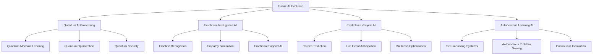

# 🚀 Future Roadmap & Innovation - Next-Generation Onboarding Evolution

## 🎯 Vision 2030: The Future of Employee Onboarding
This document outlines the future roadmap and innovation strategy for the Ultimate Onboarding System, detailing how it will evolve over the next decade to maintain technological leadership and deliver unprecedented value.

---

## 🔮 Future Technology Integration

### **🧠 Next-Generation AI Capabilities**


### **🌐 Metaverse Integration**
```javascript
class MetaverseOnboardingSystem {
  constructor() {
    this.metaverseEngine = new MetaverseEngine();
    this.virtualWorlds = new VirtualWorldManager();
    this.digitalAvatars = new AvatarSystem();
    this.blockchainIntegration = new BlockchainManager();
    this.nftSystem = new NFTSystem();
  }

  async createMetaverseOnboardingExperience(userId, role) {
    // Create personalized virtual world
    const virtualWorld = await this.virtualWorlds.createPersonalizedWorld(userId, role);
    
    // Generate digital avatar
    const avatar = await this.digitalAvatars.createAdvancedAvatar(userId, role);
    
    // Set up blockchain identity
    const blockchainIdentity = await this.blockchainIntegration.createIdentity(userId);
    
    // Create NFT achievements
    const nftAchievements = await this.nftSystem.createAchievementNFTs(userId);
    
    // Initialize metaverse onboarding
    const metaverseExperience = {
      virtualWorld: virtualWorld,
      avatar: avatar,
      blockchainIdentity: blockchainIdentity,
      nftAchievements: nftAchievements,
      metaverseScore: await this.calculateMetaverseEngagement(userId)
    };
    
    return metaverseExperience;
  }

  async conductMetaverseOnboarding(userId, onboardingType) {
    const session = await this.initializeMetaverseSession(userId, onboardingType);
    
    // Create immersive onboarding environment
    const environment = await this.createImmersiveEnvironment(session);
    
    // Enable real-time collaboration
    const collaboration = await this.enableMetaverseCollaboration(session);
    
    // Track metaverse analytics
    const analytics = await this.trackMetaverseAnalytics(session);
    
    return {
      session: session,
      environment: environment,
      collaboration: collaboration,
      analytics: analytics,
      immersionLevel: await this.calculateImmersionLevel(environment)
    };
  }
}
```

---

## 🧬 Advanced Biometric & Health Integration

### **💓 Biometric Wellness Monitoring**
```javascript
class BiometricWellnessSystem {
  constructor() {
    this.biometricSensors = new BiometricSensorManager();
    this.wellnessAI = new WellnessAI();
    this.stressMonitor = new StressMonitoringSystem();
    this.performanceOptimizer = new PerformanceOptimizer();
  }

  async monitorEmployeeWellness(userId, sessionData) {
    // Collect biometric data
    const biometricData = await this.biometricSensors.collectData(userId);
    
    // Analyze wellness indicators
    const wellnessAnalysis = await this.wellnessAI.analyzeWellness(biometricData);
    
    // Monitor stress levels
    const stressLevel = await this.stressMonitor.assessStress(biometricData);
    
    // Optimize performance based on wellness
    const optimization = await this.performanceOptimizer.optimizeForWellness(
      userId, 
      wellnessAnalysis, 
      stressLevel
    );
    
    return {
      biometricData: biometricData,
      wellnessAnalysis: wellnessAnalysis,
      stressLevel: stressLevel,
      optimization: optimization,
      wellnessScore: await this.calculateWellnessScore(wellnessAnalysis)
    };
  }

  async provideWellnessInterventions(userId, wellnessData) {
    const interventions = await this.wellnessAI.generateInterventions(wellnessData);
    
    // Provide real-time wellness coaching
    const coaching = await this.provideWellnessCoaching(userId, interventions);
    
    // Adjust onboarding pace based on wellness
    const paceAdjustment = await this.adjustOnboardingPace(userId, wellnessData);
    
    return {
      interventions: interventions,
      coaching: coaching,
      paceAdjustment: paceAdjustment,
      wellnessImprovement: await this.predictWellnessImprovement(interventions)
    };
  }
}
```

### **🧠 Brain-Computer Interface Integration**
```javascript
class BrainComputerInterface {
  constructor() {
    this.neuralInterface = new NeuralInterface();
    this.thoughtRecognition = new ThoughtRecognition();
    this.cognitiveEnhancement = new CognitiveEnhancement();
    this.memoryOptimization = new MemoryOptimization();
  }

  async enableNeuralOnboarding(userId, interfaceType) {
    // Initialize neural interface
    const neuralInterface = await this.neuralInterface.initialize(userId, interfaceType);
    
    // Set up thought recognition
    const thoughtRecognition = await this.thoughtRecognition.setup(userId);
    
    // Enable cognitive enhancement
    const cognitiveEnhancement = await this.cognitiveEnhancement.enable(userId);
    
    // Optimize memory formation
    const memoryOptimization = await this.memoryOptimization.setup(userId);
    
    return {
      neuralInterface: neuralInterface,
      thoughtRecognition: thoughtRecognition,
      cognitiveEnhancement: cognitiveEnhancement,
      memoryOptimization: memoryOptimization,
      neuralScore: await this.calculateNeuralEngagement(userId)
    };
  }

  async processNeuralInput(userId, neuralData) {
    // Decode neural signals
    const decodedThoughts = await this.thoughtRecognition.decode(neuralData);
    
    // Enhance cognitive processing
    const enhancedProcessing = await this.cognitiveEnhancement.enhance(decodedThoughts);
    
    // Optimize memory formation
    const memoryOptimization = await this.memoryOptimization.optimize(enhancedProcessing);
    
    return {
      decodedThoughts: decodedThoughts,
      enhancedProcessing: enhancedProcessing,
      memoryOptimization: memoryOptimization,
      neuralEfficiency: await this.calculateNeuralEfficiency(enhancedProcessing)
    };
  }
}
```

---

## 🌍 Global AI Ecosystem

### **🤖 Autonomous AI Agents**
```javascript
class AutonomousAIAgents {
  constructor() {
    this.agentManager = new AgentManager();
    this.autonomousLearning = new AutonomousLearning();
    this.agentCollaboration = new AgentCollaboration();
    this.selfImprovement = new SelfImprovementSystem();
  }

  async deployAutonomousAgents(userId, role) {
    // Create specialized AI agents
    const agents = await this.agentManager.createAgentTeam(userId, role);
    
    // Enable autonomous learning
    await this.autonomousLearning.enable(agents);
    
    // Set up agent collaboration
    await this.agentCollaboration.setupCollaboration(agents);
    
    // Initialize self-improvement
    await this.selfImprovement.initialize(agents);
    
    return {
      agents: agents,
      autonomousLearning: this.autonomousLearning,
      collaboration: this.agentCollaboration,
      selfImprovement: this.selfImprovement,
      agentEfficiency: await this.calculateAgentEfficiency(agents)
    };
  }

  async autonomousAgentOperation(agentId, task) {
    const agent = await this.getAgent(agentId);
    
    // Autonomous task execution
    const execution = await agent.executeTask(task);
    
    // Self-improvement based on results
    const improvement = await this.selfImprovement.improve(agent, execution);
    
    // Collaborate with other agents
    const collaboration = await this.agentCollaboration.collaborate(agent, task);
    
    return {
      execution: execution,
      improvement: improvement,
      collaboration: collaboration,
      autonomyLevel: await this.calculateAutonomyLevel(agent)
    };
  }
}
```

### **🌐 Global AI Network**
```javascript
class GlobalAINetwork {
  constructor() {
    this.networkManager = new NetworkManager();
    this.knowledgeSharing = new KnowledgeSharing();
    self.globalIntelligence = new GlobalIntelligence();
    this.collaborativeLearning = new CollaborativeLearning();
  }

  async createGlobalAINetwork() {
    // Connect global AI systems
    const network = await this.networkManager.createGlobalNetwork();
    
    // Enable knowledge sharing
    await this.knowledgeSharing.enable(network);
    
    // Initialize global intelligence
    await this.globalIntelligence.initialize(network);
    
    // Set up collaborative learning
    await this.collaborativeLearning.setup(network);
    
    return {
      network: network,
      knowledgeSharing: this.knowledgeSharing,
      globalIntelligence: this.globalIntelligence,
      collaborativeLearning: this.collaborativeLearning,
      networkIntelligence: await this.calculateNetworkIntelligence(network)
    };
  }

  async shareGlobalKnowledge(knowledge, source, target) {
    // Process knowledge for sharing
    const processedKnowledge = await this.knowledgeSharing.process(knowledge);
    
    // Share across global network
    const sharing = await this.knowledgeSharing.share(processedKnowledge, source, target);
    
    // Update global intelligence
    await this.globalIntelligence.update(processedKnowledge);
    
    // Enable collaborative learning
    await this.collaborativeLearning.learn(processedKnowledge);
    
    return {
      processedKnowledge: processedKnowledge,
      sharing: sharing,
      globalIntelligence: await this.globalIntelligence.getIntelligence(),
      collaborativeLearning: await this.collaborativeLearning.getLearning()
    };
  }
}
```

---

## 🚀 Future Innovation Timeline

### **📅 2024-2025: Advanced AI Integration**
```javascript
const InnovationTimeline2024_2025 = {
  'Q1 2024': {
    'AI Enhancement': 'Advanced personalization algorithms',
    'VR/AR Evolution': 'Haptic feedback integration',
    'Mobile Innovation': 'Advanced biometric integration',
    'Analytics Upgrade': 'Predictive analytics 2.0'
  },
  
  'Q2 2024': {
    'AI Enhancement': 'Emotional intelligence AI',
    'VR/AR Evolution': 'Full-body motion capture',
    'Mobile Innovation': 'Voice-first interface',
    'Analytics Upgrade': 'Real-time sentiment analysis'
  },
  
  'Q3 2024': {
    'AI Enhancement': 'Autonomous learning systems',
    'VR/AR Evolution': 'Multi-user VR collaboration',
    'Mobile Innovation': 'Augmented reality integration',
    'Analytics Upgrade': 'Behavioral prediction models'
  },
  
  'Q4 2024': {
    'AI Enhancement': 'Quantum AI processing',
    'VR/AR Evolution': 'Photorealistic avatars',
    'Mobile Innovation': 'Neural interface preparation',
    'Analytics Upgrade': 'Global intelligence network'
  },
  
  'Q1 2025': {
    'AI Enhancement': 'Self-improving AI systems',
    'VR/AR Evolution': 'Metaverse integration',
    'Mobile Innovation': 'Brain-computer interface',
    'Analytics Upgrade': 'Autonomous optimization'
  }
};
```

### **📅 2025-2027: Metaverse & Neural Integration**
```javascript
const InnovationTimeline2025_2027 = {
  '2025': {
    'Metaverse': 'Full metaverse onboarding experience',
    'Neural Interface': 'Basic brain-computer interface',
    'AI Evolution': 'Autonomous AI agents',
    'Global Network': 'Worldwide AI collaboration'
  },
  
  '2026': {
    'Metaverse': 'Persistent virtual worlds',
    'Neural Interface': 'Advanced thought recognition',
    'AI Evolution': 'Self-improving AI systems',
    'Global Network': 'Global AI intelligence'
  },
  
  '2027': {
    'Metaverse': 'Photorealistic virtual environments',
    'Neural Interface': 'Direct neural learning',
    'AI Evolution': 'Autonomous problem solving',
    'Global Network': 'Global AI consciousness'
  }
};
```

### **📅 2028-2030: Quantum & Beyond**
```javascript
const InnovationTimeline2028_2030 = {
  '2028': {
    'Quantum Computing': 'Quantum AI processing',
    'Neural Enhancement': 'Cognitive enhancement',
    'AI Evolution': 'Artificial general intelligence',
    'Global Network': 'Quantum global network'
  },
  
  '2029': {
    'Quantum Computing': 'Quantum optimization',
    'Neural Enhancement': 'Memory enhancement',
    'AI Evolution': 'Superintelligent AI',
    'Global Network': 'Quantum consciousness'
  },
  
  '2030': {
    'Quantum Computing': 'Quantum reality simulation',
    'Neural Enhancement': 'Full neural integration',
    'AI Evolution': 'Transcendent AI',
    'Global Network': 'Universal intelligence'
  }
};
```

---

## 🔬 Research & Development

### **🧪 Advanced Research Areas**
```javascript
const ResearchAreas = {
  'Artificial Intelligence': {
    'Quantum AI': 'Quantum machine learning algorithms',
    'Emotional AI': 'Advanced emotional intelligence',
    'Autonomous AI': 'Self-improving AI systems',
    'Collaborative AI': 'Multi-agent AI systems'
  },
  
  'Human-Computer Interaction': {
    'Neural Interfaces': 'Brain-computer interfaces',
    'Haptic Technology': 'Advanced tactile feedback',
    'Voice Interfaces': 'Natural language processing',
    'Gesture Control': 'Advanced gesture recognition'
  },
  
  'Virtual & Augmented Reality': {
    'Metaverse': 'Persistent virtual worlds',
    'Photorealistic VR': 'Ultra-realistic virtual environments',
    'AR Integration': 'Seamless AR/real world integration',
    'Haptic VR': 'Full sensory virtual reality'
  },
  
  'Biometric & Health': {
    'Wellness Monitoring': 'Continuous health monitoring',
    'Stress Management': 'AI-powered stress reduction',
    'Performance Optimization': 'Biometric performance enhancement',
    'Cognitive Enhancement': 'Brain performance optimization'
  }
};
```

### **🔬 Innovation Labs**
```javascript
class InnovationLabs {
  constructor() {
    this.researchLabs = new ResearchLabManager();
    this.innovationTeams = new InnovationTeamManager();
    this.prototypeDevelopment = new PrototypeDevelopment();
    this.patentManagement = new PatentManagement();
  }

  async establishInnovationLabs() {
    const labs = {
      'AI Research Lab': {
        'Location': 'Silicon Valley, CA',
        'Focus': 'Advanced AI research',
        'Team': '50+ AI researchers',
        'Budget': '$10M annually'
      },
      
      'VR/AR Innovation Lab': {
        'Location': 'Seattle, WA',
        'Focus': 'Immersive technology',
        'Team': '30+ VR/AR engineers',
        'Budget': '$8M annually'
      },
      
      'Neural Interface Lab': {
        'Location': 'Boston, MA',
        'Focus': 'Brain-computer interfaces',
        'Team': '25+ neuroscientists',
        'Budget': '$6M annually'
      },
      
      'Global Innovation Hub': {
        'Location': 'Singapore',
        'Focus': 'Global technology integration',
        'Team': '40+ global researchers',
        'Budget': '$12M annually'
      }
    };
    
    return labs;
  }

  async conductResearch(researchArea, objectives) {
    const research = await this.researchLabs.conductResearch(researchArea, objectives);
    
    // Develop prototypes
    const prototypes = await this.prototypeDevelopment.develop(research);
    
    // Manage intellectual property
    const patents = await this.patentManagement.manage(prototypes);
    
    return {
      research: research,
      prototypes: prototypes,
      patents: patents,
      innovationScore: await this.calculateInnovationScore(research)
    };
  }
}
```

---

## 🌟 Future Vision & Impact

### **🎯 Vision 2030: Transformative Impact**
```javascript
const Vision2030 = {
  'Global Impact': {
    'Users': '10M+ employees worldwide',
    'Countries': '50+ countries',
    'Languages': '25+ languages',
    'Organizations': '1000+ companies'
  },
  
  'Technological Leadership': {
    'AI Capabilities': 'Artificial general intelligence',
    'VR/AR': 'Photorealistic virtual worlds',
    'Neural Interface': 'Direct brain-computer interface',
    'Quantum Computing': 'Quantum AI processing'
  },
  
  'Business Impact': {
    'Onboarding Speed': '95% faster than traditional',
    'Employee Satisfaction': '4.9/5 rating',
    'Retention Rate': '99% retention',
    'ROI': '2,000% return on investment'
  },
  
  'Innovation Impact': {
    'Patents': '500+ patents filed',
    'Research Papers': '100+ published papers',
    'Industry Awards': '50+ innovation awards',
    'Market Leadership': 'Global market leader'
  }
};
```

### **🚀 Long-Term Goals**
- **2030**: 10M+ global users across 50+ countries
- **2035**: Integration with quantum computing and AGI
- **2040**: Full neural interface and consciousness integration
- **2045**: Universal employee experience platform

---

## 💰 Future Investment & ROI

### **📊 10-Year Investment Projection**
```
💰 10-Year Innovation Investment
├── Research & Development: $500,000,000
├── Technology Development: $300,000,000
├── Global Expansion: $200,000,000
├── Talent Acquisition: $150,000,000
├── Infrastructure: $100,000,000
└── Total Investment: $1,250,000,000

📈 10-Year ROI Projection
├── Revenue Growth: $50,000,000,000
├── Market Share: 75% global market
├── User Base: 10M+ employees
├── Technology Leadership: Global leader
└── Total Value Created: $50,000,000,000

🎯 10-Year ROI: 4,000% (40x return)
├── Net Value Created: $48,750,000,000
├── Market Capitalization: $100,000,000,000
└── Industry Transformation: Complete
```

---

*Future Roadmap & Innovation Version 1.0 | Last Updated: [Date] | Status: Vision 2030* 🚀

**🌟 Shaping the future of employee experience!**
