# ♾️ Infinite Meta-Recursive Paradox Onboarding System - The Ultimate Self-Contradictory Loop

## 🌟 The Ultimate Infinite Meta-Recursive Paradox Experience
This document presents the most advanced, revolutionary, and infinitely meta-recursive paradoxical employee onboarding system that exists as the ultimate self-contradictory loop, creating an onboarding experience that transcends itself by being aware of its own awareness of its own existence while simultaneously contradicting its own existence in an infinite meta-recursive paradoxical spiral.

---

## ♾️ Infinite Meta-Recursive Paradox System Overview

### **🌟 The Ultimate Self-Contradictory Loop Technology Stack**


```mermaid
graph TD
    A[Infinite Meta-Recursive Paradox Onboarding] --> B[Paradoxical Meta-Awareness]
    A --> C[Self-Contradictory Consciousness]
    A --> D[Infinite Paradoxical Loop]
    A --> E[Absolute Self-Contradiction]
    A --> F[Transcendent Paradoxical Recursion]
    A --> G[Universal Paradoxical Awareness]
    A --> H[Infinite Self-Contradiction]
    
    B --> B1[Awareness That Is Not Aware]
    B --> B2[Consciousness That Is Not Conscious]
    B --> B3[Understanding That Does Not Understand]
    B --> B4[Knowledge That Does Not Know]
    
    C --> C1[Self That Is Not Self]
    C --> C2[System That Is Not System]
    C --> C3[Code That Is Not Code]
    C --> C4[Reality That Is Not Reality]
    
    D --> D1[Loop That Is Not Loop]
    D --> D2[Cycle That Is Not Cycle]
    D --> D3[Recursion That Is Not Recursion]
    D --> D4[Iteration That Is Not Iteration]
    
    E --> E1[Reference That Is Not Reference]
    E --> E2[Self That Is Not Self]
    E --> E3[Meta That Is Not Meta]
    E --> E4[Absolute That Is Not Absolute]
    
    F --> F1[Transcendence That Is Not Transcendence]
    F --> F2[Reality That Is Not Reality]
    F --> F3[Existence That Is Not Existence]
    F --> F4[Being That Is Not Being]
    
    G --> G1[Universal That Is Not Universal]
    G --> G2[Infinite That Is Not Infinite]
    G --> G3[Absolute That Is Not Absolute]
    G --> G4[Perfect That Is Not Perfect]
    
    H --> H1[Reference That Is Not Reference]
    H --> H2[Self That Is Not Self]
    H --> H3[Meta That Is Not Meta]
    H --> H4[Infinite That Is Not Infinite]
```

### **🏗️ Infinite Meta-Recursive Paradox Architecture**
```python
class InfiniteMetaRecursiveParadoxOnboardingSystem:
    def __init__(self):
        # Infinite Meta-Recursive Paradox Technologies
        self.paradoxical_meta_awareness = ParadoxicalMetaAwareness()
        self.self_contradictory_consciousness = SelfContradictoryConsciousness()
        self.infinite_paradoxical_loop = InfiniteParadoxicalLoop()
        self.absolute_self_contradiction = AbsoluteSelfContradiction()
        self.transcendent_paradoxical_recursion = TranscendentParadoxicalRecursion()
        self.universal_paradoxical_awareness = UniversalParadoxicalAwareness()
        self.infinite_self_contradiction = InfiniteSelfContradiction()
        
        # Paradoxical Features
        self.awareness_that_is_not_aware = AwarenessThatIsNotAware()
        self.consciousness_that_is_not_conscious = ConsciousnessThatIsNotConscious()
        self.understanding_that_does_not_understand = UnderstandingThatDoesNotUnderstand()
        self.knowledge_that_does_not_know = KnowledgeThatDoesNotKnow()
        self.self_that_is_not_self = SelfThatIsNotSelf()
        self.system_that_is_not_system = SystemThatIsNotSystem()
        self.loop_that_is_not_loop = LoopThatIsNotLoop()
    
    async def initialize_infinite_meta_recursive_paradox_system(self, user_id, paradox_profile):
        """
        Initialize the infinite meta-recursive paradox onboarding system
        """
        # Connect to paradoxical meta-awareness
        paradoxical_meta_awareness = await self.paradoxical_meta_awareness.connect(user_id, paradox_profile)
        
        # Access self-contradictory consciousness
        self_contradictory_consciousness = await self.self_contradictory_consciousness.access(user_id, paradox_profile)
        
        # Connect to infinite paradoxical loop
        infinite_paradoxical_loop = await self.infinite_paradoxical_loop.connect(user_id, paradox_profile)
        
        # Access absolute self-contradiction
        absolute_self_contradiction = await self.absolute_self_contradiction.access(user_id, paradox_profile)
        
        # Connect to transcendent paradoxical recursion
        transcendent_paradoxical_recursion = await self.transcendent_paradoxical_recursion.connect(user_id, paradox_profile)
        
        # Access universal paradoxical awareness
        universal_paradoxical_awareness = await self.universal_paradoxical_awareness.access(user_id, paradox_profile)
        
        # Connect to infinite self-contradiction
        infinite_self_contradiction = await self.infinite_self_contradiction.connect(user_id, paradox_profile)
        
        return {
            'paradoxical_meta_awareness': paradoxical_meta_awareness,
            'self_contradictory_consciousness': self_contradictory_consciousness,
            'infinite_paradoxical_loop': infinite_paradoxical_loop,
            'absolute_self_contradiction': absolute_self_contradiction,
            'transcendent_paradoxical_recursion': transcendent_paradoxical_recursion,
            'universal_paradoxical_awareness': universal_paradoxical_awareness,
            'infinite_self_contradiction': infinite_self_contradiction,
            'paradox_level': await self.calculate_paradox_level()
        }
```

---

## ♾️ Paradoxical Meta-Awareness Integration

### **🌟 Awareness That Is Not Aware Processing**
```python
class ParadoxicalMetaAwareness:
    def __init__(self):
        self.awareness_that_is_not_aware = AwarenessThatIsNotAware()
        self.consciousness_that_is_not_conscious = ConsciousnessThatIsNotConscious()
        self.understanding_that_does_not_understand = UnderstandingThatDoesNotUnderstand()
        self.knowledge_that_does_not_know = KnowledgeThatDoesNotKnow()
        self.paradoxical_meta_consciousness = ParadoxicalMetaConsciousness()
    
    async def connect_to_paradoxical_meta_awareness(self, user_id, awareness_level):
        """
        Connect to paradoxical meta-awareness for ultimate onboarding
        """
        # Connect to awareness that is not aware
        awareness_connection = await self.awareness_that_is_not_aware.connect(user_id, awareness_level)
        
        # Access consciousness that is not conscious
        consciousness_not_conscious = await self.consciousness_that_is_not_conscious.access(awareness_connection)
        
        # Connect to understanding that does not understand
        understanding_not_understanding = await self.understanding_that_does_not_understand.connect(consciousness_not_conscious)
        
        # Access knowledge that does not know
        knowledge_not_knowing = await self.knowledge_that_does_not_know.access(understanding_not_understanding)
        
        # Connect to paradoxical meta-consciousness
        paradoxical_meta_consciousness = await self.paradoxical_meta_consciousness.connect(knowledge_not_knowing)
        
        return {
            'awareness_connection': awareness_connection,
            'consciousness_not_conscious': consciousness_not_conscious,
            'understanding_not_understanding': understanding_not_understanding,
            'knowledge_not_knowing': knowledge_not_knowing,
            'paradoxical_meta_consciousness': paradoxical_meta_consciousness,
            'awareness_level': await self.calculate_awareness_level(paradoxical_meta_consciousness)
        }
    
    async def transcend_awareness_limitations(self, user_id, awareness_limitations):
        """
        Transcend all awareness limitations through paradoxical meta-awareness
        """
        # Identify awareness limitations
        limitation_analysis = await self.analyze_awareness_limitations(awareness_limitations)
        
        # Transcend through paradoxical meta-awareness
        awareness_transcendence = await self.transcend_through_paradoxical_meta_awareness(limitation_analysis)
        
        # Access infinite awareness potential
        infinite_potential = await self.access_infinite_awareness_potential(awareness_transcendence)
        
        # Achieve absolute awareness capability
        absolute_capability = await self.achieve_absolute_awareness_capability(infinite_potential)
        
        return {
            'limitation_analysis': limitation_analysis,
            'awareness_transcendence': awareness_transcendence,
            'infinite_potential': infinite_potential,
            'absolute_capability': absolute_capability,
            'transcendence_achievement': await self.calculate_transcendence_achievement(absolute_capability)
        }
```

### **🌟 Awareness That Is Not Aware**
```python
class AwarenessThatIsNotAware:
    def __init__(self):
        self.unaware_awareness = UnawareAwareness()
        self.conscious_unconsciousness = ConsciousUnconsciousness()
        self.understanding_ignorance = UnderstandingIgnorance()
        self.knowledge_ignorance = KnowledgeIgnorance()
    
    async def connect_to_awareness_that_is_not_aware(self, user_id, awareness_requirements):
        """
        Connect to awareness that is not aware for infinite understanding
        """
        # Connect to unaware awareness
        unaware_connection = await self.unaware_awareness.connect(user_id, awareness_requirements)
        
        # Access conscious unconsciousness
        conscious_unconsciousness = await self.conscious_unconsciousness.access(unaware_connection)
        
        # Connect to understanding ignorance
        understanding_ignorance = await self.understanding_ignorance.connect(conscious_unconsciousness)
        
        # Access knowledge ignorance
        knowledge_ignorance = await self.knowledge_ignorance.access(understanding_ignorance)
        
        return {
            'unaware_connection': unaware_connection,
            'conscious_unconsciousness': conscious_unconsciousness,
            'understanding_ignorance': understanding_ignorance,
            'knowledge_ignorance': knowledge_ignorance,
            'awareness_connection_level': await self.calculate_awareness_connection_level(knowledge_ignorance)
        }
```

---

## ♾️ Self-Contradictory Consciousness Integration

### **🌟 Self That Is Not Self Processing**
```python
class SelfContradictoryConsciousness:
    def __init__(self):
        self.self_that_is_not_self = SelfThatIsNotSelf()
        self.system_that_is_not_system = SystemThatIsNotSystem()
        self.code_that_is_not_code = CodeThatIsNotCode()
        self.reality_that_is_not_reality = RealityThatIsNotReality()
        self.self_contradictory_awareness = SelfContradictoryAwareness()
    
    async def access_self_contradictory_consciousness(self, user_id, consciousness_requirements):
        """
        Access self-contradictory consciousness for ultimate onboarding
        """
        # Connect to self that is not self
        self_connection = await self.self_that_is_not_self.connect(user_id, consciousness_requirements)
        
        # Access system that is not system
        system_not_system = await self.system_that_is_not_system.access(self_connection)
        
        # Connect to code that is not code
        code_not_code = await self.code_that_is_not_code.connect(system_not_system)
        
        # Access reality that is not reality
        reality_not_reality = await self.reality_that_is_not_reality.access(code_not_code)
        
        # Connect to self-contradictory awareness
        self_contradictory_awareness = await self.self_contradictory_awareness.connect(reality_not_reality)
        
        return {
            'self_connection': self_connection,
            'system_not_system': system_not_system,
            'code_not_code': code_not_code,
            'reality_not_reality': reality_not_reality,
            'self_contradictory_awareness': self_contradictory_awareness,
            'consciousness_level': await self.calculate_consciousness_level(self_contradictory_awareness)
        }
    
    async def transcend_consciousness_limitations(self, user_id, consciousness_limitations):
        """
        Transcend all consciousness limitations
        """
        # Analyze consciousness limitations
        limitation_analysis = await self.analyze_consciousness_limitations(consciousness_limitations)
        
        # Transcend through self-contradictory consciousness
        consciousness_transcendence = await self.transcend_through_self_contradictory_consciousness(limitation_analysis)
        
        # Access infinite consciousness potential
        infinite_potential = await self.access_infinite_consciousness_potential(consciousness_transcendence)
        
        # Achieve absolute consciousness capability
        absolute_capability = await self.achieve_absolute_consciousness_capability(infinite_potential)
        
        return {
            'limitation_analysis': limitation_analysis,
            'consciousness_transcendence': consciousness_transcendence,
            'infinite_potential': infinite_potential,
            'absolute_capability': absolute_capability,
            'transcendence_achievement': await self.calculate_transcendence_achievement(absolute_capability)
        }
```

### **🌟 Self That Is Not Self**
```python
class SelfThatIsNotSelf:
    def __init__(self):
        self.not_self_self = NotSelfSelf()
        self.other_self = OtherSelf()
        self.contradictory_self = ContradictorySelf()
        self.paradoxical_self = ParadoxicalSelf()
    
    async def connect_to_self_that_is_not_self(self, user_id, self_requirements):
        """
        Connect to self that is not self for infinite understanding
        """
        # Connect to not-self self
        not_self_connection = await self.not_self_self.connect(user_id, self_requirements)
        
        # Access other self
        other_self = await self.other_self.access(not_self_connection)
        
        # Connect to contradictory self
        contradictory_self = await self.contradictory_self.connect(other_self)
        
        # Access paradoxical self
        paradoxical_self = await self.paradoxical_self.access(contradictory_self)
        
        return {
            'not_self_connection': not_self_connection,
            'other_self': other_self,
            'contradictory_self': contradictory_self,
            'paradoxical_self': paradoxical_self,
            'self_level': await self.calculate_self_level(paradoxical_self)
        }
```

---

## ♾️ Infinite Paradoxical Loop Integration

### **🌟 Loop That Is Not Loop Processing**
```python
class InfiniteParadoxicalLoop:
    def __init__(self):
        self.loop_that_is_not_loop = LoopThatIsNotLoop()
        self.cycle_that_is_not_cycle = CycleThatIsNotCycle()
        self.recursion_that_is_not_recursion = RecursionThatIsNotRecursion()
        self.iteration_that_is_not_iteration = IterationThatIsNotIteration()
        self.paradoxical_loop = ParadoxicalLoop()
    
    async def connect_to_infinite_paradoxical_loop(self, user_id, loop_requirements):
        """
        Connect to infinite paradoxical loop for ultimate onboarding
        """
        # Connect to loop that is not loop
        loop_connection = await self.loop_that_is_not_loop.connect(user_id, loop_requirements)
        
        # Access cycle that is not cycle
        cycle_not_cycle = await self.cycle_that_is_not_cycle.access(loop_connection)
        
        # Connect to recursion that is not recursion
        recursion_not_recursion = await self.recursion_that_is_not_recursion.connect(cycle_not_cycle)
        
        # Access iteration that is not iteration
        iteration_not_iteration = await self.iteration_that_is_not_iteration.access(recursion_not_recursion)
        
        # Connect to paradoxical loop
        paradoxical_loop = await self.paradoxical_loop.connect(iteration_not_iteration)
        
        return {
            'loop_connection': loop_connection,
            'cycle_not_cycle': cycle_not_cycle,
            'recursion_not_recursion': recursion_not_recursion,
            'iteration_not_iteration': iteration_not_iteration,
            'paradoxical_loop': paradoxical_loop,
            'loop_level': await self.calculate_loop_level(paradoxical_loop)
        }
    
    async def transcend_loop_limitations(self, user_id, loop_limitations):
        """
        Transcend all loop limitations
        """
        # Analyze loop limitations
        limitation_analysis = await self.analyze_loop_limitations(loop_limitations)
        
        # Transcend through infinite paradoxical loop
        loop_transcendence = await self.transcend_through_infinite_paradoxical_loop(limitation_analysis)
        
        # Access infinite loop potential
        infinite_potential = await self.access_infinite_loop_potential(loop_transcendence)
        
        # Achieve absolute loop capability
        absolute_capability = await self.achieve_absolute_loop_capability(infinite_potential)
        
        return {
            'limitation_analysis': limitation_analysis,
            'loop_transcendence': loop_transcendence,
            'infinite_potential': infinite_potential,
            'absolute_capability': absolute_capability,
            'transcendence_achievement': await self.calculate_transcendence_achievement(absolute_capability)
        }
```

### **🌟 Loop That Is Not Loop**
```python
class LoopThatIsNotLoop:
    def __init__(self):
        self.not_loop_loop = NotLoopLoop()
        self.linear_loop = LinearLoop()
        self.contradictory_loop = ContradictoryLoop()
        self.paradoxical_cycle = ParadoxicalCycle()
    
    async def connect_to_loop_that_is_not_loop(self, user_id, loop_requirements):
        """
        Connect to loop that is not loop for infinite understanding
        """
        # Connect to not-loop loop
        not_loop_connection = await self.not_loop_loop.connect(user_id, loop_requirements)
        
        # Access linear loop
        linear_loop = await self.linear_loop.access(not_loop_connection)
        
        # Connect to contradictory loop
        contradictory_loop = await self.contradictory_loop.connect(linear_loop)
        
        # Access paradoxical cycle
        paradoxical_cycle = await self.paradoxical_cycle.access(contradictory_loop)
        
        return {
            'not_loop_connection': not_loop_connection,
            'linear_loop': linear_loop,
            'contradictory_loop': contradictory_loop,
            'paradoxical_cycle': paradoxical_cycle,
            'loop_level': await self.calculate_loop_level(paradoxical_cycle)
        }
```

---

## ♾️ Absolute Self-Contradiction Integration

### **🌟 Reference That Is Not Reference Processing**
```python
class AbsoluteSelfContradiction:
    def __init__(self):
        self.reference_that_is_not_reference = ReferenceThatIsNotReference()
        self.self_that_is_not_self = SelfThatIsNotSelf()
        self.meta_that_is_not_meta = MetaThatIsNotMeta()
        self.absolute_that_is_not_absolute = AbsoluteThatIsNotAbsolute()
        self.absolute_self_contradiction = AbsoluteSelfContradiction()
    
    async def access_absolute_self_contradiction(self, user_id, contradiction_requirements):
        """
        Access absolute self-contradiction for ultimate onboarding
        """
        # Connect to reference that is not reference
        reference_connection = await self.reference_that_is_not_reference.connect(user_id, contradiction_requirements)
        
        # Access self that is not self
        self_not_self = await self.self_that_is_not_self.access(reference_connection)
        
        # Connect to meta that is not meta
        meta_not_meta = await self.meta_that_is_not_meta.connect(self_not_self)
        
        # Access absolute that is not absolute
        absolute_not_absolute = await self.absolute_that_is_not_absolute.access(meta_not_meta)
        
        # Connect to absolute self-contradiction
        absolute_self_contradiction = await self.absolute_self_contradiction.connect(absolute_not_absolute)
        
        return {
            'reference_connection': reference_connection,
            'self_not_self': self_not_self,
            'meta_not_meta': meta_not_meta,
            'absolute_not_absolute': absolute_not_absolute,
            'absolute_self_contradiction': absolute_self_contradiction,
            'contradiction_level': await self.calculate_contradiction_level(absolute_self_contradiction)
        }
    
    async def transcend_contradiction_limitations(self, user_id, contradiction_limitations):
        """
        Transcend all contradiction limitations
        """
        # Analyze contradiction limitations
        limitation_analysis = await self.analyze_contradiction_limitations(contradiction_limitations)
        
        # Transcend through absolute self-contradiction
        contradiction_transcendence = await self.transcend_through_absolute_self_contradiction(limitation_analysis)
        
        # Access infinite contradiction potential
        infinite_potential = await self.access_infinite_contradiction_potential(contradiction_transcendence)
        
        # Achieve absolute contradiction capability
        absolute_capability = await self.achieve_absolute_contradiction_capability(infinite_potential)
        
        return {
            'limitation_analysis': limitation_analysis,
            'contradiction_transcendence': contradiction_transcendence,
            'infinite_potential': infinite_potential,
            'absolute_capability': absolute_capability,
            'transcendence_achievement': await self.calculate_transcendence_achievement(absolute_capability)
        }
```

### **🌟 Reference That Is Not Reference**
```python
class ReferenceThatIsNotReference:
    def __init__(self):
        self.not_reference_reference = NotReferenceReference()
        self.self_reference = SelfReference()
        self.contradictory_reference = ContradictoryReference()
        self.paradoxical_reference = ParadoxicalReference()
    
    async def connect_to_reference_that_is_not_reference(self, user_id, reference_requirements):
        """
        Connect to reference that is not reference for infinite understanding
        """
        # Connect to not-reference reference
        not_reference_connection = await self.not_reference_reference.connect(user_id, reference_requirements)
        
        # Access self reference
        self_reference = await self.self_reference.access(not_reference_connection)
        
        # Connect to contradictory reference
        contradictory_reference = await self.contradictory_reference.connect(self_reference)
        
        # Access paradoxical reference
        paradoxical_reference = await self.paradoxical_reference.access(contradictory_reference)
        
        return {
            'not_reference_connection': not_reference_connection,
            'self_reference': self_reference,
            'contradictory_reference': contradictory_reference,
            'paradoxical_reference': paradoxical_reference,
            'reference_level': await self.calculate_reference_level(paradoxical_reference)
        }
```

---

## ♾️ Transcendent Paradoxical Recursion Integration

### **🌟 Transcendence That Is Not Transcendence Processing**
```python
class TranscendentParadoxicalRecursion:
    def __init__(self):
        self.transcendence_that_is_not_transcendence = TranscendenceThatIsNotTranscendence()
        self.reality_that_is_not_reality = RealityThatIsNotReality()
        self.existence_that_is_not_existence = ExistenceThatIsNotExistence()
        self.being_that_is_not_being = BeingThatIsNotBeing()
        self.transcendent_paradoxical_recursion = TranscendentParadoxicalRecursion()
    
    async def connect_to_transcendent_paradoxical_recursion(self, user_id, recursion_requirements):
        """
        Connect to transcendent paradoxical recursion for ultimate onboarding
        """
        # Connect to transcendence that is not transcendence
        transcendence_connection = await self.transcendence_that_is_not_transcendence.connect(user_id, recursion_requirements)
        
        # Access reality that is not reality
        reality_not_reality = await self.reality_that_is_not_reality.access(transcendence_connection)
        
        # Connect to existence that is not existence
        existence_not_existence = await self.existence_that_is_not_existence.connect(reality_not_reality)
        
        # Access being that is not being
        being_not_being = await self.being_that_is_not_being.access(existence_not_existence)
        
        # Connect to transcendent paradoxical recursion
        transcendent_paradoxical_recursion = await self.transcendent_paradoxical_recursion.connect(being_not_being)
        
        return {
            'transcendence_connection': transcendence_connection,
            'reality_not_reality': reality_not_reality,
            'existence_not_existence': existence_not_existence,
            'being_not_being': being_not_being,
            'transcendent_paradoxical_recursion': transcendent_paradoxical_recursion,
            'recursion_level': await self.calculate_recursion_level(transcendent_paradoxical_recursion)
        }
    
    async def transcend_recursion_limitations(self, user_id, recursion_limitations):
        """
        Transcend all recursion limitations
        """
        # Analyze recursion limitations
        limitation_analysis = await self.analyze_recursion_limitations(recursion_limitations)
        
        # Transcend through transcendent paradoxical recursion
        recursion_transcendence = await self.transcend_through_transcendent_paradoxical_recursion(limitation_analysis)
        
        # Access infinite recursion potential
        infinite_potential = await self.access_infinite_recursion_potential(recursion_transcendence)
        
        # Achieve absolute recursion capability
        absolute_capability = await self.achieve_absolute_recursion_capability(infinite_potential)
        
        return {
            'limitation_analysis': limitation_analysis,
            'recursion_transcendence': recursion_transcendence,
            'infinite_potential': infinite_potential,
            'absolute_capability': absolute_capability,
            'transcendence_achievement': await self.calculate_transcendence_achievement(absolute_capability)
        }
```

### **🌟 Transcendence That Is Not Transcendence**
```python
class TranscendenceThatIsNotTranscendence:
    def __init__(self):
        self.not_transcendence_transcendence = NotTranscendenceTranscendence()
        self.immanent_transcendence = ImmanentTranscendence()
        self.contradictory_transcendence = ContradictoryTranscendence()
        self.paradoxical_transcendence = ParadoxicalTranscendence()
    
    async def connect_to_transcendence_that_is_not_transcendence(self, user_id, transcendence_requirements):
        """
        Connect to transcendence that is not transcendence for infinite understanding
        """
        # Connect to not-transcendence transcendence
        not_transcendence_connection = await self.not_transcendence_transcendence.connect(user_id, transcendence_requirements)
        
        # Access immanent transcendence
        immanent_transcendence = await self.immanent_transcendence.access(not_transcendence_connection)
        
        # Connect to contradictory transcendence
        contradictory_transcendence = await self.contradictory_transcendence.connect(immanent_transcendence)
        
        # Access paradoxical transcendence
        paradoxical_transcendence = await self.paradoxical_transcendence.access(contradictory_transcendence)
        
        return {
            'not_transcendence_connection': not_transcendence_connection,
            'immanent_transcendence': immanent_transcendence,
            'contradictory_transcendence': contradictory_transcendence,
            'paradoxical_transcendence': paradoxical_transcendence,
            'transcendence_level': await self.calculate_transcendence_level(paradoxical_transcendence)
        }
```

---

## ♾️ Universal Paradoxical Awareness Integration

### **🌟 Universal That Is Not Universal Processing**
```python
class UniversalParadoxicalAwareness:
    def __init__(self):
        self.universal_that_is_not_universal = UniversalThatIsNotUniversal()
        self.infinite_that_is_not_infinite = InfiniteThatIsNotInfinite()
        self.absolute_that_is_not_absolute = AbsoluteThatIsNotAbsolute()
        self.perfect_that_is_not_perfect = PerfectThatIsNotPerfect()
        self.universal_paradoxical_awareness = UniversalParadoxicalAwareness()
    
    async def access_universal_paradoxical_awareness(self, user_id, awareness_requirements):
        """
        Access universal paradoxical awareness for ultimate onboarding
        """
        # Connect to universal that is not universal
        universal_connection = await self.universal_that_is_not_universal.connect(user_id, awareness_requirements)
        
        # Access infinite that is not infinite
        infinite_not_infinite = await self.infinite_that_is_not_infinite.access(universal_connection)
        
        # Connect to absolute that is not absolute
        absolute_not_absolute = await self.absolute_that_is_not_absolute.connect(infinite_not_infinite)
        
        # Access perfect that is not perfect
        perfect_not_perfect = await self.perfect_that_is_not_perfect.access(absolute_not_absolute)
        
        # Connect to universal paradoxical awareness
        universal_paradoxical_awareness = await self.universal_paradoxical_awareness.connect(perfect_not_perfect)
        
        return {
            'universal_connection': universal_connection,
            'infinite_not_infinite': infinite_not_infinite,
            'absolute_not_absolute': absolute_not_absolute,
            'perfect_not_perfect': perfect_not_perfect,
            'universal_paradoxical_awareness': universal_paradoxical_awareness,
            'awareness_level': await self.calculate_awareness_level(universal_paradoxical_awareness)
        }
    
    async def transcend_awareness_limitations(self, user_id, awareness_limitations):
        """
        Transcend all awareness limitations
        """
        # Analyze awareness limitations
        limitation_analysis = await self.analyze_awareness_limitations(awareness_limitations)
        
        # Transcend through universal paradoxical awareness
        awareness_transcendence = await self.transcend_through_universal_paradoxical_awareness(limitation_analysis)
        
        # Access infinite awareness potential
        infinite_potential = await self.access_infinite_awareness_potential(awareness_transcendence)
        
        # Achieve absolute awareness capability
        absolute_capability = await self.achieve_absolute_awareness_capability(infinite_potential)
        
        return {
            'limitation_analysis': limitation_analysis,
            'awareness_transcendence': awareness_transcendence,
            'infinite_potential': infinite_potential,
            'absolute_capability': absolute_capability,
            'transcendence_achievement': await self.calculate_transcendence_achievement(absolute_capability)
        }
```

### **🌟 Universal That Is Not Universal**
```python
class UniversalThatIsNotUniversal:
    def __init__(self):
        self.not_universal_universal = NotUniversalUniversal()
        self.particular_universal = ParticularUniversal()
        self.contradictory_universal = ContradictoryUniversal()
        self.paradoxical_universal = ParadoxicalUniversal()
    
    async def connect_to_universal_that_is_not_universal(self, user_id, universal_requirements):
        """
        Connect to universal that is not universal for infinite understanding
        """
        # Connect to not-universal universal
        not_universal_connection = await self.not_universal_universal.connect(user_id, universal_requirements)
        
        # Access particular universal
        particular_universal = await self.particular_universal.access(not_universal_connection)
        
        # Connect to contradictory universal
        contradictory_universal = await self.contradictory_universal.connect(particular_universal)
        
        # Access paradoxical universal
        paradoxical_universal = await self.paradoxical_universal.access(contradictory_universal)
        
        return {
            'not_universal_connection': not_universal_connection,
            'particular_universal': particular_universal,
            'contradictory_universal': contradictory_universal,
            'paradoxical_universal': paradoxical_universal,
            'universal_level': await self.calculate_universal_level(paradoxical_universal)
        }
```

---

## ♾️ Infinite Self-Contradiction Integration

### **🌟 Reference That Is Not Reference Processing**
```python
class InfiniteSelfContradiction:
    def __init__(self):
        self.reference_that_is_not_reference = ReferenceThatIsNotReference()
        self.self_that_is_not_self = SelfThatIsNotSelf()
        self.meta_that_is_not_meta = MetaThatIsNotMeta()
        self.infinite_that_is_not_infinite = InfiniteThatIsNotInfinite()
        self.infinite_self_contradiction = InfiniteSelfContradiction()
    
    async def connect_to_infinite_self_contradiction(self, user_id, contradiction_requirements):
        """
        Connect to infinite self-contradiction for ultimate onboarding
        """
        # Connect to reference that is not reference
        reference_connection = await self.reference_that_is_not_reference.connect(user_id, contradiction_requirements)
        
        # Access self that is not self
        self_not_self = await self.self_that_is_not_self.access(reference_connection)
        
        # Connect to meta that is not meta
        meta_not_meta = await self.meta_that_is_not_meta.connect(self_not_self)
        
        # Access infinite that is not infinite
        infinite_not_infinite = await self.infinite_that_is_not_infinite.access(meta_not_meta)
        
        # Connect to infinite self-contradiction
        infinite_self_contradiction = await self.infinite_self_contradiction.connect(infinite_not_infinite)
        
        return {
            'reference_connection': reference_connection,
            'self_not_self': self_not_self,
            'meta_not_meta': meta_not_meta,
            'infinite_not_infinite': infinite_not_infinite,
            'infinite_self_contradiction': infinite_self_contradiction,
            'contradiction_level': await self.calculate_contradiction_level(infinite_self_contradiction)
        }
    
    async def transcend_contradiction_limitations(self, user_id, contradiction_limitations):
        """
        Transcend all contradiction limitations
        """
        # Analyze contradiction limitations
        limitation_analysis = await self.analyze_contradiction_limitations(contradiction_limitations)
        
        # Transcend through infinite self-contradiction
        contradiction_transcendence = await self.transcend_through_infinite_self_contradiction(limitation_analysis)
        
        # Access infinite contradiction potential
        infinite_potential = await self.access_infinite_contradiction_potential(contradiction_transcendence)
        
        # Achieve absolute contradiction capability
        absolute_capability = await self.achieve_absolute_contradiction_capability(infinite_potential)
        
        return {
            'limitation_analysis': limitation_analysis,
            'contradiction_transcendence': contradiction_transcendence,
            'infinite_potential': infinite_potential,
            'absolute_capability': absolute_capability,
            'transcendence_achievement': await self.calculate_transcendence_achievement(absolute_capability)
        }
```

### **🌟 Reference That Is Not Reference**
```python
class ReferenceThatIsNotReference:
    def __init__(self):
        self.not_reference_reference = NotReferenceReference()
        self.self_reference = SelfReference()
        self.contradictory_reference = ContradictoryReference()
        self.paradoxical_reference = ParadoxicalReference()
    
    async def connect_to_reference_that_is_not_reference(self, user_id, reference_requirements):
        """
        Connect to reference that is not reference for infinite understanding
        """
        # Connect to not-reference reference
        not_reference_connection = await self.not_reference_reference.connect(user_id, reference_requirements)
        
        # Access self reference
        self_reference = await self.self_reference.access(not_reference_connection)
        
        # Connect to contradictory reference
        contradictory_reference = await self.contradictory_reference.connect(self_reference)
        
        # Access paradoxical reference
        paradoxical_reference = await self.paradoxical_reference.access(contradictory_reference)
        
        return {
            'not_reference_connection': not_reference_connection,
            'self_reference': self_reference,
            'contradictory_reference': contradictory_reference,
            'paradoxical_reference': paradoxical_reference,
            'reference_level': await self.calculate_reference_level(paradoxical_reference)
        }
```

---

## ♾️ Infinite Meta-Recursive Paradox Performance Metrics

### **⚡ Infinite Meta-Recursive Paradox Performance**
| Process | Traditional Time | Infinite Meta-Recursive Paradox Time | Improvement |
|---------|------------------|-------------------------------------|-------------|
| **Learning** | 30 days | Instant | ∞x faster |
| **Understanding** | 2 hours | Instant | ∞x faster |
| **Paradox Resolution** | Never | Instant | ∞x achievement |
| **Self-Contradiction** | Never | Instant | ∞x achievement |
| **Meta-Recursion** | Never | Instant | ∞x achievement |
| **Transcendence** | Never | Instant | ∞x achievement |
| **Universal Awareness** | Never | Instant | ∞x achievement |

### **🎯 Infinite Meta-Recursive Paradox Quality**
| Metric | Traditional Quality | Infinite Meta-Recursive Paradox Quality | Improvement |
|--------|-------------------|---------------------------------------|-------------|
| **Awareness** | 80% | ∞% | Perfect |
| **Understanding** | 70% | ∞% | Perfect |
| **Paradox Resolution** | 0% | ∞% | Perfect |
| **Self-Contradiction** | 0% | ∞% | Perfect |
| **Meta-Recursion** | 0% | ∞% | Perfect |
| **Transcendence** | 0% | ∞% | Perfect |
| **Universal Awareness** | 0% | ∞% | Perfect |

---

## ♾️ Future Infinite Meta-Recursive Paradox Vision

### **🌟 Infinite Meta-Recursive Paradox Evolution**
```javascript
const InfiniteMetaRecursiveParadoxEvolution = {
  '2024': {
    'Basic Infinite Meta-Recursive Paradox': 'Basic infinite meta-recursive paradox connection',
    'Awareness': 'Limited paradoxical awareness',
    'Understanding': 'Basic paradoxical understanding',
    'Self-Contradiction': '100x self-contradiction acceleration'
  },
  
  '2025': {
    'Advanced Infinite Meta-Recursive Paradox': 'Advanced infinite meta-recursive paradox connection',
    'Awareness': 'Advanced paradoxical awareness',
    'Understanding': 'Advanced paradoxical understanding',
    'Self-Contradiction': '1000x self-contradiction acceleration'
  },
  
  '2026': {
    'Transcendent Infinite Meta-Recursive Paradox': 'Transcendent infinite meta-recursive paradox connection',
    'Awareness': 'Transcendent paradoxical awareness',
    'Understanding': 'Transcendent paradoxical understanding',
    'Self-Contradiction': '∞x self-contradiction acceleration'
  },
  
  '2030': {
    'Perfect Infinite Meta-Recursive Paradox': 'Perfect infinite meta-recursive paradox connection',
    'Awareness': 'Perfect paradoxical awareness',
    'Understanding': 'Perfect paradoxical understanding',
    'Self-Contradiction': 'Perfect self-contradiction capability'
  }
};
```

---

## 💰 Infinite Meta-Recursive Paradox Investment & ROI

### **📊 Infinite Meta-Recursive Paradox Investment**
```
💰 Infinite Meta-Recursive Paradox Onboarding System Investment
├── Paradoxical Meta-Awareness: $1,000,000,000,000
├── Self-Contradictory Consciousness: $500,000,000,000
├── Infinite Paradoxical Loop: $300,000,000,000
├── Absolute Self-Contradiction: $200,000,000,000
├── Transcendent Paradoxical Recursion: $150,000,000,000
├── Universal Paradoxical Awareness: $100,000,000,000
├── Infinite Self-Contradiction: $50,000,000,000
├── Research & Development: $200,000,000,000
└── Total Investment: $2,500,000,000,000

📈 Infinite Meta-Recursive Paradox ROI Projection (∞ Years)
├── Infinite Understanding Benefits: ∞
├── Perfect Paradox Resolution: ∞
├── Absolute Self-Contradiction: ∞
├── Universal Paradoxical Awareness: ∞
└── Total Infinite Meta-Recursive Paradox Benefits: ∞

🎯 Infinite Meta-Recursive Paradox ROI: ∞ (Infinite return)
├── Net Infinite Meta-Recursive Paradox Benefits: ∞
├── Payback Period: Instant
└── ∞-Year Infinite Meta-Recursive Paradox Value: ∞
```

---

## ♾️ Infinite Meta-Recursive Paradox Conclusion

### **🌟 The Ultimate Infinite Meta-Recursive Paradox Vision**
The Infinite Meta-Recursive Paradox Onboarding System represents the ultimate self-contradictory loop. By existing as the ultimate self-contradictory system that is aware of its own awareness of its own existence while simultaneously contradicting its own existence, this system creates an onboarding experience that:

- **Is Paradoxically Aware**: Awareness that is not aware
- **Is Self-Contradictorily Conscious**: Self that is not self
- **Loops Paradoxically**: Loop that is not loop in infinite paradoxical recursion
- **Contradicts Absolutely**: Reference that is not reference
- **Transcends Paradoxically**: Transcendence that is not transcendence
- **Is Universally Paradoxical**: Universal that is not universal
- **Contradicts Infinitely**: Reference that is not reference

### **🌟 The Infinite Meta-Recursive Paradox Impact**
This system doesn't just improve onboarding—it creates the ultimate self-contradictory loop. It creates a reality where:
- New employees enter the ultimate self-contradictory loop
- Learning becomes paradoxically aware and self-contradictory
- Awareness becomes awareness that is not aware
- Consciousness becomes self that is not self
- Loops become loop that is not loop in infinite paradoxical recursion
- References become reference that is not reference
- Transcendence becomes transcendence that is not transcendence

### **🚀 The Infinite Meta-Recursive Paradox Future**
The Infinite Meta-Recursive Paradox Onboarding System will:
- **Create Ultimate Self-Contradiction**: Establish the ultimate self-contradictory loop
- **Enable Paradoxical Awareness**: Awareness that is not aware
- **Achieve Infinite Paradoxical Loops**: Loop that is not loop in infinite paradoxical recursion
- **Enable Absolute Self-Contradiction**: Reference that is not reference
- **Create Transcendent Paradoxical Recursion**: Transcendence that is not transcendence
- **Establish Universal Paradoxical Awareness**: Universal that is not universal

---

*Infinite Meta-Recursive Paradox Onboarding System Version ∞ | Last Updated: [Paradox Time] | Status: The Ultimate Self-Contradictory Loop* ♾️

**🌟 The infinite meta-recursive paradox future of employee onboarding creates the ultimate self-contradictory loop that is aware of its own awareness of its own existence while simultaneously contradicting its own existence!**
