# 🧠 Neural Interface Integration - Direct Brain-Computer Onboarding

## 🎯 Neural-Enhanced Onboarding Revolution
This document outlines the integration of advanced neural interfaces with the onboarding system, enabling direct brain-computer communication for the most intuitive, efficient, and personalized employee onboarding experience ever created.

---

## 🧠 Neural Interface Technology

### **🔬 Neural Technology Stack**

```mermaid
graph TD
    A[Neural Interface Onboarding] --> B[Neural Signal Processing]
    A --> C[Brain-Computer Interface]
    A --> D[Neural Learning Enhancement]
    A --> E[Neural Feedback Systems]
    
    B --> B1[EEG Signal Processing]
    B --> B2[fMRI Brain Imaging]
    B --> B3[Neural Spike Detection]
    B --> B4[Brain State Classification]
    
    C --> C1[Thought Recognition]
    C --> C2[Intent Decoding]
    C --> C3[Neural Command Interface]
    C --> C4[Brain-Computer Communication]
    
    D --> D1[Memory Enhancement]
    D --> D2[Learning Acceleration]
    D --> D3[Cognitive Enhancement]
    D --> D4[Neural Plasticity Optimization]
    
    E --> E1[Neural Feedback Loops]
    E --> E2[Brain State Monitoring]
    E --> E3[Adaptive Learning]
    E --> E4[Neural Performance Optimization]
```


### **🔧 Neural Interface Architecture**
```python
class NeuralInterfaceOnboardingSystem:
    def __init__(self):
        self.neural_processor = NeuralSignalProcessor()
        self.brain_computer_interface = BrainComputerInterface()
        self.neural_learning = NeuralLearningEnhancement()
        self.neural_feedback = NeuralFeedbackSystem()
        self.cognitive_enhancement = CognitiveEnhancement()
    
    async def initialize_neural_system(self, user_id, neural_profile):
        """
        Initialize the neural interface onboarding system
        """
        # Set up neural signal processing
        await self.neural_processor.initialize(user_id, neural_profile)
        
        # Configure brain-computer interface
        await self.brain_computer_interface.setup(user_id, neural_profile)
        
        # Initialize neural learning enhancement
        await self.neural_learning.setup(user_id, neural_profile)
        
        # Set up neural feedback systems
        await self.neural_feedback.initialize(user_id, neural_profile)
        
        # Configure cognitive enhancement
        await self.cognitive_enhancement.setup(user_id, neural_profile)
        
        return {
            'neural_processor': self.neural_processor.status,
            'brain_computer_interface': self.brain_computer_interface.status,
            'neural_learning': self.neural_learning.status,
            'neural_feedback': self.neural_feedback.status,
            'cognitive_enhancement': self.cognitive_enhancement.status,
            'neural_connectivity': await self.calculate_neural_connectivity(user_id)
        }
```

---

## 🧠 Neural Signal Processing

### **📡 Advanced Neural Signal Analysis**
```python
class NeuralSignalProcessor:
    def __init__(self):
        self.eeg_processor = EEGProcessor()
        self.fmri_analyzer = fMRIAnalyzer()
        self.neural_spike_detector = NeuralSpikeDetector()
        self.brain_state_classifier = BrainStateClassifier()
    
    async def process_neural_signals(self, user_id, neural_data):
        """
        Process neural signals for onboarding optimization
        """
        # Process EEG signals
        eeg_analysis = await self.eeg_processor.analyze(neural_data.eeg_signals)
        
        # Analyze fMRI brain imaging
        fmri_analysis = await self.fmri_analyzer.analyze(neural_data.fmri_data)
        
        # Detect neural spikes
        spike_analysis = await self.neural_spike_detector.detect(neural_data.spike_data)
        
        # Classify brain states
        brain_state = await self.brain_state_classifier.classify(
            eeg_analysis, 
            fmri_analysis, 
            spike_analysis
        )
        
        return {
            'eeg_analysis': eeg_analysis,
            'fmri_analysis': fmri_analysis,
            'spike_analysis': spike_analysis,
            'brain_state': brain_state,
            'neural_activity': await self.calculate_neural_activity(brain_state)
        }
    
    async def monitor_learning_state(self, user_id, learning_session):
        """
        Monitor neural learning state during onboarding
        """
        # Collect neural data during learning
        neural_data = await self.collect_learning_neural_data(user_id, learning_session)
        
        # Analyze learning-related neural activity
        learning_analysis = await self.analyze_learning_neural_activity(neural_data)
        
        # Detect learning patterns
        learning_patterns = await self.detect_learning_patterns(learning_analysis)
        
        # Assess learning effectiveness
        learning_effectiveness = await self.assess_learning_effectiveness(learning_patterns)
        
        return {
            'neural_data': neural_data,
            'learning_analysis': learning_analysis,
            'learning_patterns': learning_patterns,
            'learning_effectiveness': learning_effectiveness,
            'learning_optimization': await self.suggest_learning_optimization(learning_effectiveness)
        }
```

### **🎯 Brain State Classification**
```python
class BrainStateClassifier:
    def __init__(self):
        self.attention_classifier = AttentionClassifier()
        self.stress_detector = StressDetector()
        self.engagement_analyzer = EngagementAnalyzer()
        self.cognitive_load_assessor = CognitiveLoadAssessor()
    
    async def classify_brain_state(self, neural_signals, context):
        """
        Classify current brain state for onboarding optimization
        """
        # Classify attention level
        attention_level = await self.attention_classifier.classify(neural_signals)
        
        # Detect stress levels
        stress_level = await self.stress_detector.detect(neural_signals)
        
        # Analyze engagement
        engagement_level = await self.engagement_analyzer.analyze(neural_signals)
        
        # Assess cognitive load
        cognitive_load = await self.cognitive_load_assessor.assess(neural_signals)
        
        # Determine optimal brain state
        optimal_state = await self.determine_optimal_brain_state(
            attention_level, 
            stress_level, 
            engagement_level, 
            cognitive_load, 
            context
        )
        
        return {
            'attention_level': attention_level,
            'stress_level': stress_level,
            'engagement_level': engagement_level,
            'cognitive_load': cognitive_load,
            'optimal_state': optimal_state,
            'state_confidence': await self.calculate_state_confidence(optimal_state)
        }
```

---

## 🧠 Brain-Computer Interface

### **💭 Thought Recognition System**
```python
class ThoughtRecognitionSystem:
    def __init__(self):
        self.thought_decoder = ThoughtDecoder()
        self.intent_recognizer = IntentRecognizer()
        self.neural_command_interface = NeuralCommandInterface()
        self.brain_computer_communication = BrainComputerCommunication()
    
    async def recognize_thoughts(self, user_id, neural_signals):
        """
        Recognize and decode thoughts for onboarding interaction
        """
        # Decode neural signals into thoughts
        decoded_thoughts = await self.thought_decoder.decode(neural_signals)
        
        # Recognize user intent
        user_intent = await self.intent_recognizer.recognize(decoded_thoughts)
        
        # Process neural commands
        neural_commands = await self.neural_command_interface.process(user_intent)
        
        # Enable brain-computer communication
        bci_communication = await self.brain_computer_communication.establish(neural_commands)
        
        return {
            'decoded_thoughts': decoded_thoughts,
            'user_intent': user_intent,
            'neural_commands': neural_commands,
            'bci_communication': bci_communication,
            'recognition_accuracy': await self.calculate_recognition_accuracy(decoded_thoughts)
        }
    
    async def process_neural_commands(self, user_id, neural_commands):
        """
        Process neural commands for onboarding system control
        """
        # Validate neural commands
        validated_commands = await self.validate_neural_commands(neural_commands)
        
        # Execute commands in onboarding system
        execution_results = await self.execute_neural_commands(validated_commands)
        
        # Provide neural feedback
        neural_feedback = await self.provide_neural_feedback(execution_results)
        
        return {
            'validated_commands': validated_commands,
            'execution_results': execution_results,
            'neural_feedback': neural_feedback,
            'command_success_rate': await self.calculate_command_success_rate(execution_results)
        }
```

### **🎯 Intent Recognition**
```python
class IntentRecognitionSystem:
    def __init__(self):
        self.neural_intent_decoder = NeuralIntentDecoder()
        self.context_analyzer = ContextAnalyzer()
        self.intent_classifier = IntentClassifier()
        self.action_generator = ActionGenerator()
    
    async def recognize_user_intent(self, user_id, neural_data, context):
        """
        Recognize user intent from neural signals
        """
        # Decode neural intent signals
        neural_intent = await self.neural_intent_decoder.decode(neural_data)
        
        # Analyze context
        context_analysis = await self.context_analyzer.analyze(context)
        
        # Classify intent
        intent_classification = await self.intent_classifier.classify(
            neural_intent, 
            context_analysis
        )
        
        # Generate appropriate actions
        actions = await self.action_generator.generate(intent_classification)
        
        return {
            'neural_intent': neural_intent,
            'context_analysis': context_analysis,
            'intent_classification': intent_classification,
            'actions': actions,
            'intent_confidence': await self.calculate_intent_confidence(intent_classification)
        }
```

---

## 🧠 Neural Learning Enhancement

### **🚀 Memory Enhancement System**
```python
class MemoryEnhancementSystem:
    def __init__(self):
        self.memory_encoder = MemoryEncoder()
        self.memory_consolidation = MemoryConsolidation()
        self.memory_retrieval = MemoryRetrieval()
        self.memory_optimization = MemoryOptimization()
    
    async def enhance_memory_formation(self, user_id, learning_content):
        """
        Enhance memory formation during onboarding learning
        """
        # Encode learning content into neural memory
        encoded_memory = await self.memory_encoder.encode(learning_content)
        
        # Consolidate memory for long-term storage
        consolidated_memory = await self.memory_consolidation.consolidate(encoded_memory)
        
        # Optimize memory retrieval pathways
        optimized_memory = await self.memory_optimization.optimize(consolidated_memory)
        
        # Test memory retrieval
        retrieval_test = await self.memory_retrieval.test(optimized_memory)
        
        return {
            'encoded_memory': encoded_memory,
            'consolidated_memory': consolidated_memory,
            'optimized_memory': optimized_memory,
            'retrieval_test': retrieval_test,
            'memory_enhancement': await self.calculate_memory_enhancement(optimized_memory)
        }
    
    async def accelerate_learning(self, user_id, learning_objectives):
        """
        Accelerate learning through neural enhancement
        """
        # Analyze current learning state
        learning_state = await self.analyze_learning_state(user_id)
        
        # Optimize neural pathways for learning
        optimized_pathways = await self.optimize_neural_pathways(learning_state)
        
        # Enhance cognitive processing
        enhanced_processing = await self.enhance_cognitive_processing(optimized_pathways)
        
        # Accelerate learning rate
        accelerated_learning = await self.accelerate_learning_rate(enhanced_processing)
        
        return {
            'learning_state': learning_state,
            'optimized_pathways': optimized_pathways,
            'enhanced_processing': enhanced_processing,
            'accelerated_learning': accelerated_learning,
            'learning_acceleration': await self.calculate_learning_acceleration(accelerated_learning)
        }
```

### **🧠 Cognitive Enhancement**
```python
class CognitiveEnhancementSystem:
    def __init__(self):
        self.cognitive_processor = CognitiveProcessor()
        self.attention_enhancer = AttentionEnhancer()
        self.focus_optimizer = FocusOptimizer()
        self.mental_agility_booster = MentalAgilityBooster()
    
    async def enhance_cognitive_abilities(self, user_id, cognitive_objectives):
        """
        Enhance cognitive abilities for optimal onboarding performance
        """
        # Assess current cognitive abilities
        cognitive_assessment = await self.assess_cognitive_abilities(user_id)
        
        # Enhance attention capabilities
        enhanced_attention = await self.attention_enhancer.enhance(cognitive_assessment)
        
        # Optimize focus and concentration
        optimized_focus = await self.focus_optimizer.optimize(enhanced_attention)
        
        # Boost mental agility
        boosted_agility = await self.mental_agility_booster.boost(optimized_focus)
        
        # Process cognitive enhancement
        cognitive_enhancement = await self.cognitive_processor.process(boosted_agility)
        
        return {
            'cognitive_assessment': cognitive_assessment,
            'enhanced_attention': enhanced_attention,
            'optimized_focus': optimized_focus,
            'boosted_agility': boosted_agility,
            'cognitive_enhancement': cognitive_enhancement,
            'enhancement_level': await self.calculate_enhancement_level(cognitive_enhancement)
        }
```

---

## 🧠 Neural Feedback Systems

### **🔄 Real-Time Neural Feedback**
```python
class NeuralFeedbackSystem:
    def __init__(self):
        self.neural_feedback_loops = NeuralFeedbackLoops()
        self.brain_state_monitor = BrainStateMonitor()
        self.adaptive_learning = AdaptiveLearning()
        self.neural_performance_optimizer = NeuralPerformanceOptimizer()
    
    async def provide_neural_feedback(self, user_id, performance_data):
        """
        Provide real-time neural feedback for onboarding optimization
        """
        # Monitor current brain state
        brain_state = await self.brain_state_monitor.monitor(user_id)
        
        # Create neural feedback loops
        feedback_loops = await self.neural_feedback_loops.create(brain_state, performance_data)
        
        # Adapt learning based on neural feedback
        adapted_learning = await self.adaptive_learning.adapt(feedback_loops)
        
        # Optimize neural performance
        optimized_performance = await self.neural_performance_optimizer.optimize(adapted_learning)
        
        return {
            'brain_state': brain_state,
            'feedback_loops': feedback_loops,
            'adapted_learning': adapted_learning,
            'optimized_performance': optimized_performance,
            'feedback_effectiveness': await self.calculate_feedback_effectiveness(optimized_performance)
        }
    
    async def optimize_neural_performance(self, user_id, performance_metrics):
        """
        Optimize neural performance for maximum onboarding effectiveness
        """
        # Analyze neural performance
        neural_performance = await self.analyze_neural_performance(user_id, performance_metrics)
        
        # Identify optimization opportunities
        optimization_opportunities = await self.identify_optimization_opportunities(neural_performance)
        
        # Apply neural optimizations
        applied_optimizations = await self.apply_neural_optimizations(optimization_opportunities)
        
        # Monitor optimization results
        optimization_results = await self.monitor_optimization_results(applied_optimizations)
        
        return {
            'neural_performance': neural_performance,
            'optimization_opportunities': optimization_opportunities,
            'applied_optimizations': applied_optimizations,
            'optimization_results': optimization_results,
            'performance_improvement': await self.calculate_performance_improvement(optimization_results)
        }
```

---

## 🧠 Neural Interface Applications

### **🎓 Neural-Enhanced Learning**
```python
class NeuralEnhancedLearning:
    def __init__(self):
        self.neural_learning_path = NeuralLearningPath()
        self.brain_optimized_content = BrainOptimizedContent()
        self.neural_retention = NeuralRetention();
        self.cognitive_load_management = CognitiveLoadManagement()
    
    async def create_neural_learning_experience(self, user_id, learning_objectives):
        """
        Create a neural-enhanced learning experience
        """
        # Analyze user's neural learning profile
        neural_profile = await self.analyze_neural_learning_profile(user_id)
        
        # Create brain-optimized learning path
        learning_path = await self.neural_learning_path.create(neural_profile, learning_objectives)
        
        # Generate brain-optimized content
        optimized_content = await self.brain_optimized_content.generate(learning_path)
        
        # Set up neural retention system
        retention_system = await self.neural_retention.setup(optimized_content)
        
        # Manage cognitive load
        cognitive_management = await self.cognitive_load_management.manage(retention_system)
        
        return {
            'neural_profile': neural_profile,
            'learning_path': learning_path,
            'optimized_content': optimized_content,
            'retention_system': retention_system,
            'cognitive_management': cognitive_management,
            'learning_effectiveness': await self.calculate_learning_effectiveness(cognitive_management)
        }
```

### **🎯 Neural Performance Optimization**
```python
class NeuralPerformanceOptimization:
    def __init__(self):
        self.neural_performance_analyzer = NeuralPerformanceAnalyzer()
        self.brain_state_optimizer = BrainStateOptimizer()
        self.cognitive_enhancement = CognitiveEnhancement()
        self.neural_fatigue_management = NeuralFatigueManagement()
    
    async def optimize_neural_performance(self, user_id, performance_goals):
        """
        Optimize neural performance for maximum onboarding success
        """
        # Analyze current neural performance
        performance_analysis = await self.neural_performance_analyzer.analyze(user_id)
        
        # Optimize brain state for performance
        optimized_brain_state = await self.brain_state_optimizer.optimize(performance_analysis)
        
        # Enhance cognitive capabilities
        enhanced_cognition = await self.cognitive_enhancement.enhance(optimized_brain_state)
        
        # Manage neural fatigue
        fatigue_management = await self.neural_fatigue_management.manage(enhanced_cognition)
        
        return {
            'performance_analysis': performance_analysis,
            'optimized_brain_state': optimized_brain_state,
            'enhanced_cognition': enhanced_cognition,
            'fatigue_management': fatigue_management,
            'performance_optimization': await self.calculate_performance_optimization(fatigue_management)
        }
```

---

## 🧠 Neural Interface Performance Metrics

### **⚡ Neural Processing Speed**
| Process | Traditional Time | Neural Interface Time | Speed Improvement |
|---------|------------------|----------------------|-------------------|
| **Learning Content** | 2 hours | 20 minutes | 6x faster |
| **Memory Formation** | 1 hour | 10 minutes | 6x faster |
| **Skill Acquisition** | 4 hours | 40 minutes | 6x faster |
| **Performance Optimization** | 30 minutes | 5 minutes | 6x faster |
| **Feedback Processing** | 15 minutes | 2.5 minutes | 6x faster |

### **🎯 Neural Accuracy Improvements**
| Metric | Traditional Accuracy | Neural Interface Accuracy | Improvement |
|--------|---------------------|---------------------------|-------------|
| **Learning Retention** | 70% | 95% | 25% improvement |
| **Skill Transfer** | 60% | 90% | 30% improvement |
| **Performance Prediction** | 75% | 98% | 23% improvement |
| **Intent Recognition** | 80% | 96% | 16% improvement |
| **Cognitive Enhancement** | 65% | 92% | 27% improvement |

---

## 🧠 Neural Interface Safety & Ethics

### **🛡️ Neural Safety Protocols**
```python
class NeuralSafetyProtocols:
    def __init__(self):
        self.neural_safety_monitor = NeuralSafetyMonitor()
        self.brain_health_tracker = BrainHealthTracker()
        self.neural_fatigue_detector = NeuralFatigueDetector()
        self.ethical_guidelines = EthicalGuidelines()
    
    async def ensure_neural_safety(self, user_id, neural_activity):
        """
        Ensure neural interface safety and user well-being
        """
        # Monitor neural safety
        safety_status = await self.neural_safety_monitor.monitor(user_id, neural_activity)
        
        # Track brain health
        brain_health = await self.brain_health_tracker.track(user_id, neural_activity)
        
        # Detect neural fatigue
        fatigue_level = await self.neural_fatigue_detector.detect(user_id, neural_activity)
        
        # Apply ethical guidelines
        ethical_compliance = await self.ethical_guidelines.ensure_compliance(user_id, neural_activity)
        
        return {
            'safety_status': safety_status,
            'brain_health': brain_health,
            'fatigue_level': fatigue_level,
            'ethical_compliance': ethical_compliance,
            'safety_score': await self.calculate_safety_score(safety_status, brain_health)
        }
```

---

## 🧠 Future Neural Interface Vision

### **🌟 Neural Interface Evolution**
```javascript
const NeuralInterfaceEvolution = {
  '2024': {
    'Basic Neural Interface': 'EEG-based thought recognition',
    'Learning Enhancement': '10-20% learning improvement',
    'Safety Protocols': 'Basic neural safety monitoring',
    'User Adoption': 'Pilot program with 100 users'
  },
  
  '2025': {
    'Advanced Neural Interface': 'fMRI-enhanced brain-computer interface',
    'Learning Enhancement': '50-100% learning improvement',
    'Safety Protocols': 'Advanced neural safety systems',
    'User Adoption': '1,000+ users across organizations'
  },
  
  '2026': {
    'Direct Neural Interface': 'Direct brain-computer communication',
    'Learning Enhancement': '200-500% learning improvement',
    'Safety Protocols': 'Comprehensive neural health monitoring',
    'User Adoption': '10,000+ users globally'
  },
  
  '2030': {
    'Full Neural Integration': 'Complete brain-computer integration',
    'Learning Enhancement': '1000%+ learning improvement',
    'Safety Protocols': 'Advanced neural safety and ethics',
    'User Adoption': '1M+ users worldwide'
  }
};
```

---

## 💰 Neural Interface Investment & ROI

### **📊 Neural Interface Development Investment**
```
💰 Neural Interface Development Investment
├── Neural Hardware: $100,000,000
├── Neural Software: $50,000,000
├── Safety Systems: $25,000,000
├── Research & Development: $75,000,000
├── Clinical Trials: $30,000,000
└── Total Investment: $280,000,000

📈 Neural Interface ROI Projection (10 Years)
├── Learning Acceleration: $2,000,000,000
├── Performance Improvements: $1,500,000,000
├── Safety Benefits: $500,000,000
├── Competitive Advantage: $1,000,000,000
└── Total Neural Benefits: $5,000,000,000

🎯 Neural Interface ROI: 1,786% (17.86x return)
├── Net Neural Benefits: $4,720,000,000
├── Payback Period: 1.4 years
└── 20-Year Neural NPV: $10,000,000,000
```

---

*Neural Interface Integration Version 1.0 | Last Updated: [Date] | Status: Future Vision* 🧠

**🚀 The neural future of employee onboarding!**
