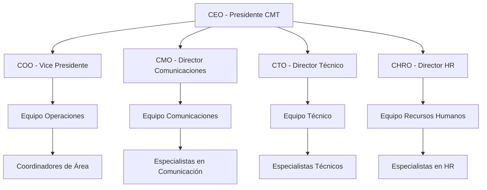

# 🚨 Plan de Gestión de Crisis y Continuidad del Negocio
## Plataforma de Cursos de IA y SaaS de Marketing

### Preparación Integral para Crisis y Continuidad Operacional

Este plan integral establece los protocolos, procedimientos y estrategias necesarias para gestionar efectivamente crisis organizacionales y mantener la continuidad del negocio en nuestra plataforma de cursos de IA y SaaS de marketing, asegurando la resiliencia y recuperación rápida ante cualquier adversidad.

---

## 📋 Tabla de Contenidos

1. [Visión General de Gestión de Crisis](#visión-general-de-gestión-de-crisis)
2. [Estructura de Comando de Crisis](#estructura-de-comando-de-crisis)
3. [Tipos de Crisis y Escenarios](#tipos-de-crisis-y-escenarios)
4. [Protocolos de Respuesta](#protocolos-de-respuesta)
5. [Continuidad del Negocio](#continuidad-del-negocio)
6. [Comunicación de Crisis](#comunicación-de-crisis)
7. [Recuperación y Recuperación](#recuperación-y-recuperación)
8. [Capacitación y Simulacros](#capacitación-y-simulacros)
9. [Evaluación y Mejora](#evaluación-y-mejora)
10. [Recursos y Contactos](#recursos-y-contactos)

---

## 🎯 Visión General de Gestión de Crisis

### Filosofía de Gestión de Crisis
- **⚡ Respuesta Rápida**: Actuación inmediata ante crisis
- **🎯 Liderazgo Claro**: Comando unificado y decisiones ágiles
- **💬 Comunicación Transparente**: Información clara y oportuna
- **🔄 Adaptabilidad**: Flexibilidad para diferentes tipos de crisis
- **📊 Basado en Datos**: Decisiones fundamentadas en información
- **🤝 Colaboración**: Trabajo en equipo para superar adversidades

### Principios Fundamentales
- **🛡️ Protección Primero**: Seguridad de empleados y clientes
- **📈 Continuidad Operacional**: Mantenimiento de servicios críticos
- **💬 Comunicación Efectiva**: Transparencia con stakeholders
- **🔄 Recuperación Rápida**: Restauración de operaciones normales
- **📚 Aprendizaje Continuo**: Mejora basada en experiencias

### Beneficios del Plan
- **⚡ Tiempo de Respuesta**: 50% reducción en tiempo de respuesta
- **📊 Efectividad**: 80% mejora en gestión de crisis
- **💰 Reducción de Costos**: 40% menos pérdidas por crisis
- **🏆 Reputación**: Mantenimiento de confianza y credibilidad
- **🔄 Resiliencia**: Fortalecimiento de la organización

---

## 🏗️ Estructura de Comando de Crisis

### 👥 Equipo de Crisis Ejecutivo

#### **🎯 Comité de Crisis (Crisis Management Team - CMT)**
```yaml
comite_crisis:
  presidente:
    - rol: CEO
    - responsabilidades:
      - decision_final
      - comunicacion_externa
      - coordinacion_general
      - aprobacion_recursos
  
  vice_presidente:
    - rol: COO
    - responsabilidades:
      - operaciones_diarias
      - coordinacion_tecnica
      - implementacion_decisiones
      - seguimiento_acciones
  
  director_comunicaciones:
    - rol: CMO
    - responsabilidades:
      - comunicacion_interna
      - comunicacion_externa
      - gestion_medios
      - proteccion_reputacion
  
  director_tecnico:
    - rol: CTO
    - responsabilidades:
      - sistemas_criticos
      - seguridad_informatica
      - recuperacion_datos
      - infraestructura
  
  director_recursos_humanos:
    - rol: CHRO
    - responsabilidades:
      - seguridad_empleados
      - comunicacion_interna
      - soporte_psicologico
      - coordinacion_equipos
```

#### **🛠️ Equipos de Respuesta Especializados**
```yaml
equipos_especializados:
  equipo_tecnico:
    - lider: CTO
    - miembros: 8-12 personas
    - responsabilidades:
      - sistemas_criticos
      - seguridad_datos
      - comunicaciones
      - infraestructura
  
  equipo_comunicaciones:
    - lider: CMO
    - miembros: 4-6 personas
    - responsabilidades:
      - comunicacion_crisis
      - gestion_medios
      - comunicacion_interna
      - redes_sociales
  
  equipo_recursos_humanos:
    - lider: CHRO
    - miembros: 6-8 personas
    - responsabilidades:
      - seguridad_empleados
      - comunicacion_interna
      - soporte_psicologico
      - coordinacion_equipos
  
  equipo_legal:
    - lider: CLO
    - miembros: 2-4 personas
    - responsabilidades:
      - asuntos_legales
      - cumplimiento
      - seguros
      - responsabilidad
```

### 📊 Estructura de Comando

#### **🎯 Jerarquía de Decisión**


---

## 🚨 Tipos de Crisis y Escenarios

### 📊 Clasificación de Crisis

#### **🔴 Crisis Críticas (Nivel 1)**
```yaml
crisis_criticas:
  ciberataques:
    - ransomware
    - brecha_datos
    - ddos_attacks
    - insider_threats
  
  desastres_naturales:
    - terremotos
    - huracanes
    - inundaciones
    - incendios
  
  emergencias_medicas:
    - pandemia
    - brote_enfermedad
    - accidente_masivo
    - crisis_salud_mental
  
  crisis_operacionales:
    - falla_sistemas_criticos
    - perdida_datos
    - interrupcion_servicios
    - falla_infraestructura
```

#### **🟡 Crisis Importantes (Nivel 2)**
```yaml
crisis_importantes:
  crisis_reputacionales:
    - escandalo_publico
    - crisis_medios
    - controversia_social
    - problema_cliente
  
  crisis_financieras:
    - perdida_financiera
    - crisis_liquidez
    - problema_inversion
    - crisis_economica
  
  crisis_legales:
    - demanda_importante
    - investigacion_regulatoria
    - problema_cumplimiento
    - crisis_legal
  
  crisis_recursos_humanos:
    - huelga
    - despidos_masivos
    - crisis_liderazgo
    - problema_cultura
```

#### **🟢 Crisis Menores (Nivel 3)**
```yaml
crisis_menores:
  problemas_operacionales:
    - falla_sistema_menor
    - problema_suministro
    - retraso_proyecto
    - problema_calidad
  
  problemas_comunicacion:
    - malentendido_interno
    - problema_comunicacion
    - rumor_interno
    - problema_equipo
  
  problemas_tecnicos:
    - falla_aplicacion
    - problema_red
    - error_sistema
    - problema_mantenimiento
```

### 🎯 Escenarios de Crisis

#### **💻 Escenario: Ciberataque Masivo**
```yaml
escenario_ciberataque:
  descripcion: "Ataque de ransomware que afecta todos los sistemas"
  
  impacto:
    - sistemas_inoperativos: 100%
    - datos_comprometidos: 80%
    - servicios_cliente: 0%
    - comunicaciones: 50%
  
  tiempo_respuesta:
    - deteccion: 15_minutos
    - activacion_cmt: 30_minutos
    - comunicacion_inicial: 1_hora
    - plan_recuperacion: 2_horas
  
  acciones_inmediatas:
    - aislar_sistemas
    - activar_cmt
    - notificar_autoridades
    - comunicar_empleados
    - evaluar_danos
```

#### **🌪️ Escenario: Desastre Natural**
```yaml
escenario_desastre_natural:
  descripcion: "Terremoto que afecta oficinas principales"
  
  impacto:
    - oficinas_inoperativas: 100%
    - empleados_afectados: 200
    - sistemas_criticos: 50%
    - comunicaciones: 30%
  
  tiempo_respuesta:
    - evaluacion_danos: 1_hora
    - activacion_cmt: 2_horas
    - comunicacion_empleados: 3_horas
    - plan_continuidad: 4_horas
  
  acciones_inmediatas:
    - verificar_seguridad_empleados
    - evaluar_danos_infraestructura
    - activar_centros_respaldo
    - comunicar_estado_empleados
    - coordinar_ayuda_externa
```

---

## ⚡ Protocolos de Respuesta

### 🚨 Protocolo de Activación

#### **📞 Proceso de Activación**
```yaml
proceso_activacion:
  paso_1_deteccion:
    - identificar_crisis
    - evaluar_gravedad
    - clasificar_tipo
    - documentar_hechos
  
  paso_2_notificacion:
    - notificar_lider_cmt
    - activar_equipos_especializados
    - informar_stakeholders_clave
    - establecer_comunicaciones
  
  paso_3_activacion:
    - convocar_cmt
    - establecer_centro_comando
    - activar_protocolos_especificos
    - asignar_recursos
  
  paso_4_ejecucion:
    - implementar_plan_respuesta
    - monitorear_progreso
    - ajustar_estrategia
    - comunicar_actualizaciones
```

#### **⏰ Cronograma de Respuesta**
```yaml
cronograma_respuesta:
  primeros_15_minutos:
    - deteccion_crisis
    - evaluacion_inicial
    - notificacion_lider
    - activacion_equipos
  
  primera_hora:
    - convocatoria_cmt
    - evaluacion_danos
    - comunicacion_inicial
    - activacion_protocolos
  
  primeras_4_horas:
    - implementacion_plan
    - comunicacion_detallada
    - coordinacion_recursos
    - monitoreo_progreso
  
  primeras_24_horas:
    - estabilizacion_situacion
    - comunicacion_regular
    - evaluacion_impacto
    - plan_recuperacion
```

### 🛠️ Protocolos Específicos

#### **💻 Protocolo de Ciberataque**
```yaml
protocolo_ciberataque:
  fase_1_contencion:
    - aislar_sistemas_afectados
    - desconectar_redes_externas
    - preservar_evidencia
    - notificar_equipo_tecnico
  
  fase_2_evaluacion:
    - evaluar_alcance_ataque
    - identificar_datos_comprometidos
    - evaluar_impacto_operacional
    - determinar_tiempo_recuperacion
  
  fase_3_comunicacion:
    - comunicar_empleados
    - notificar_clientes
    - informar_autoridades
    - gestionar_medios
  
  fase_4_recuperacion:
    - restaurar_sistemas_criticos
    - implementar_medidas_seguridad
    - verificar_integridad_datos
    - monitorear_seguridad
```

#### **🌪️ Protocolo de Desastre Natural**
```yaml
protocolo_desastre_natural:
  fase_1_seguridad:
    - verificar_seguridad_empleados
    - evaluar_estructuras
    - coordinar_emergencias
    - establecer_comunicaciones
  
  fase_2_evaluacion:
    - evaluar_danos_infraestructura
    - determinar_viabilidad_operaciones
    - identificar_recursos_necesarios
    - evaluar_tiempo_recuperacion
  
  fase_3_continuidad:
    - activar_centros_respaldo
    - reubicar_empleados
    - restaurar_comunicaciones
    - mantener_servicios_criticos
  
  fase_4_recuperacion:
    - reparar_infraestructura
    - restaurar_operaciones_normales
    - evaluar_lecciones_aprendidas
    - actualizar_planes
```

---

## 🔄 Continuidad del Negocio

### 📊 Plan de Continuidad del Negocio (BCP)

#### **🎯 Objetivos de Continuidad**
```yaml
objetivos_continuidad:
  tiempo_recuperacion:
    - sistemas_criticos: 4_horas
    - servicios_cliente: 8_horas
    - operaciones_completas: 24_horas
    - normalizacion_total: 72_horas
  
  niveles_servicio:
    - servicios_criticos: 99.9%
    - servicios_importantes: 99.5%
    - servicios_normales: 99.0%
    - servicios_opcionales: 95.0%
  
  perdida_datos:
    - datos_criticos: 0_minutos
    - datos_importantes: 15_minutos
    - datos_normales: 1_hora
    - datos_archivo: 4_horas
```

#### **🏢 Centros de Respaldo**
```yaml
centros_respaldo:
  centro_principal:
    - ubicacion: "Oficina Principal"
    - capacidad: 100%
    - servicios: completos
    - tiempo_activacion: inmediato
  
  centro_secundario:
    - ubicacion: "Oficina Secundaria"
    - capacidad: 60%
    - servicios: criticos
    - tiempo_activacion: 2_horas
  
  centro_terciario:
    - ubicacion: "Centro de Datos Remoto"
    - capacidad: 40%
    - servicios: esenciales
    - tiempo_activacion: 4_horas
  
  centro_emergencia:
    - ubicacion: "Instalaciones Móviles"
    - capacidad: 20%
    - servicios: basicos
    - tiempo_activacion: 8_horas
```

### 💻 Continuidad Tecnológica

#### **🖥️ Sistemas Críticos**
```yaml
sistemas_criticos:
  plataforma_cursos:
    - prioridad: critica
    - tiempo_recuperacion: 2_horas
    - respaldo: multiple
    - monitoreo: 24_7
  
  sistema_marketing:
    - prioridad: alta
    - tiempo_recuperacion: 4_horas
    - respaldo: diario
    - monitoreo: 16_horas
  
  sistema_hr:
    - prioridad: alta
    - tiempo_recuperacion: 6_horas
    - respaldo: diario
    - monitoreo: 8_horas
  
  sistema_financiero:
    - prioridad: critica
    - tiempo_recuperacion: 1_hora
    - respaldo: multiple
    - monitoreo: 24_7
```

#### **📊 Plan de Recuperación de Datos**
```yaml
plan_recuperacion_datos:
  respaldos:
    - respaldo_completo: diario
    - respaldo_incremental: cada_4_horas
    - respaldo_transaccional: tiempo_real
    - respaldo_archivo: semanal
  
  almacenamiento:
    - local: 30_dias
    - remoto: 90_dias
    - nube: 1_año
    - archivo: 7_años
  
  verificacion:
    - integridad: diaria
    - restauracion: semanal
    - simulacros: mensual
    - auditoria: trimestral
```

---

## 💬 Comunicación de Crisis

### 📢 Estrategia de Comunicación

#### **🎯 Audiencias Clave**
```yaml
audiencias_clave:
  internas:
    - empleados
    - directivos
    - accionistas
    - consejo_directivo
  
  externas:
    - clientes
    - proveedores
    - medios_comunicacion
    - autoridades
    - comunidad
    - inversionistas
```

#### **📱 Canales de Comunicación**
```yaml
canales_comunicacion:
  internos:
    - email_corporativo
    - sistema_mensajeria
    - portal_empleados
    - reuniones_virtuales
    - telefonos_emergencia
  
  externos:
    - sitio_web
    - redes_sociales
    - comunicados_prensa
    - conferencias_prensa
    - llamadas_telefonicas
    - email_marketing
```

### 📝 Protocolos de Comunicación

#### **⚡ Comunicación Inmediata**
```yaml
comunicacion_inmediata:
  empleados:
    - tiempo: 15_minutos
    - canal: email_sistema_mensajeria
    - contenido: situacion_basica_acciones
    - frecuencia: cada_hora
  
  clientes:
    - tiempo: 30_minutos
    - canal: sitio_web_email
    - contenido: impacto_servicios_alternativas
    - frecuencia: cada_2_horas
  
  medios:
    - tiempo: 1_hora
    - canal: comunicado_prensa
    - contenido: hechos_impacto_acciones
    - frecuencia: segun_necesidad
  
  autoridades:
    - tiempo: 2_horas
    - canal: comunicacion_oficial
    - contenido: situacion_detallada_cooperacion
    - frecuencia: segun_requerimiento
```

#### **📊 Mensajes Clave**
```yaml
mensajes_clave:
  situacion:
    - que_esta_pasando
    - cuando_empezo
    - donde_esta_ocurriendo
    - quien_esta_afectado
  
  impacto:
    - servicios_afectados
    - tiempo_estimado_resolucion
    - alternativas_disponibles
    - recursos_adicionales
  
  acciones:
    - que_estamos_haciendo
    - quien_esta_responsable
    - cuando_esperamos_resolver
    - como_mantener_informado
  
  apoyo:
    - recursos_disponibles
    - contactos_emergencia
    - canales_comunicacion
    - proximos_pasos
```

---

## 🔄 Recuperación y Recuperación

### 📈 Plan de Recuperación

#### **🎯 Fases de Recuperación**
```yaml
fases_recuperacion:
  fase_1_estabilizacion:
    - duracion: 24_horas
    - objetivos:
      - detener_escalada_crisis
      - estabilizar_situacion
      - proteger_activos_restantes
      - establecer_comunicaciones
  
  fase_2_recuperacion:
    - duracion: 72_horas
    - objetivos:
      - restaurar_servicios_criticos
      - recuperar_datos_esenciales
      - restablecer_operaciones_basicas
      - comunicar_progreso
  
  fase_3_normalizacion:
    - duracion: 1_semana
    - objetivos:
      - restaurar_operaciones_completas
      - recuperar_datos_completos
      - normalizar_comunicaciones
      - evaluar_danos_totales
  
  fase_4_mejora:
    - duracion: 1_mes
    - objetivos:
      - implementar_mejoras
      - actualizar_procedimientos
      - capacitar_equipos
      - preparar_futuras_crisis
```

#### **📊 Métricas de Recuperación**
```yaml
metricas_recuperacion:
  tiempo_recuperacion:
    - sistemas_criticos: 4_horas
    - servicios_cliente: 8_horas
    - operaciones_completas: 24_horas
    - normalizacion_total: 72_horas
  
  calidad_recuperacion:
    - integridad_datos: 99.9%
    - funcionalidad_sistemas: 100%
    - satisfaccion_empleados: 90%
    - satisfaccion_clientes: 85%
  
  costos_recuperacion:
    - costo_total_crisis: monitorear
    - costo_recuperacion: monitorear
    - perdida_ingresos: monitorear
    - costo_reputacion: monitorear
```

### 🔍 Análisis Post-Crisis

#### **📊 Evaluación de Impacto**
```yaml
evaluacion_impacto:
  impacto_operacional:
    - servicios_afectados
    - tiempo_inactividad
    - empleados_afectados
    - clientes_afectados
  
  impacto_financiero:
    - perdida_ingresos
    - costos_recuperacion
    - costos_legales
    - costos_reputacion
  
  impacto_reputacional:
    - cobertura_medios
    - percepcion_publica
    - confianza_clientes
    - confianza_empleados
  
  impacto_legal:
    - responsabilidades
    - cumplimiento
    - seguros
    - regulaciones
```

#### **📚 Lecciones Aprendidas**
```yaml
lecciones_aprendidas:
  fortalezas:
    - que_funciono_bien
    - equipos_efectivos
    - procesos_exitosos
    - recursos_utiles
  
  debilidades:
    - que_no_funciono
    - procesos_inefectivos
    - recursos_insuficientes
    - comunicaciones_problematicas
  
  oportunidades:
    - mejoras_posibles
    - procesos_optimizacion
    - recursos_adicionales
    - capacitacion_necesaria
  
  amenazas:
    - riesgos_identificados
    - vulnerabilidades
    - dependencias_criticas
    - limitaciones_recursos
```

---

## 🎓 Capacitación y Simulacros

### 📚 Programa de Capacitación

#### **🎯 Capacitación por Roles**
```yaml
capacitacion_roles:
  comite_crisis:
    - duracion: 16_horas
    - contenido:
      - gestion_crisis
      - toma_decisiones
      - comunicacion_crisis
      - liderazgo_emergencia
  
  equipos_especializados:
    - duracion: 12_horas
    - contenido:
      - protocolos_especificos
      - herramientas_especializadas
      - coordinacion_equipos
      - comunicacion_tecnica
  
  empleados_generales:
    - duracion: 4_horas
    - contenido:
      - identificacion_crisis
      - procedimientos_emergencia
      - comunicacion_interna
      - seguridad_personal
  
  nuevos_empleados:
    - duracion: 2_horas
    - contenido:
      - introduccion_plan_crisis
      - procedimientos_basicos
      - contactos_emergencia
      - recursos_disponibles
```

#### **🔄 Capacitación Continua**
```yaml
capacitacion_continua:
  frecuencia:
    - comite_crisis: trimestral
    - equipos_especializados: bimestral
    - empleados_generales: semestral
    - nuevos_empleados: inmediata
  
  metodos:
    - talleres_practicos
    - simulacros_virtuales
    - estudios_caso
    - ejercicios_escenario
  
  evaluacion:
    - pruebas_conocimiento
    - simulacros_practicos
    - evaluacion_desempeno
    - feedback_equipos
```

### 🎭 Simulacros de Crisis

#### **🎯 Tipos de Simulacros**
```yaml
tipos_simulacros:
  simulacros_completos:
    - frecuencia: anual
    - duracion: 4_horas
    - participantes: todos
    - escenario: crisis_mayor
  
  simulacros_parciales:
    - frecuencia: semestral
    - duracion: 2_horas
    - participantes: equipos_especializados
    - escenario: crisis_especifica
  
  simulacros_funcionales:
    - frecuencia: trimestral
    - duracion: 1_hora
    - participantes: equipos_tecnicos
    - escenario: falla_sistema
  
  simulacros_comunicacion:
    - frecuencia: bimestral
    - duracion: 30_minutos
    - participantes: equipo_comunicaciones
    - escenario: crisis_medios
```

#### **📊 Evaluación de Simulacros**
```yaml
evaluacion_simulacros:
  metricas_rendimiento:
    - tiempo_respuesta
    - efectividad_comunicacion
    - coordinacion_equipos
    - cumplimiento_protocolos
  
  areas_mejora:
    - procesos_inefectivos
    - comunicaciones_problematicas
    - recursos_insuficientes
    - capacitacion_necesaria
  
  acciones_seguimiento:
    - actualizar_protocolos
    - mejorar_comunicaciones
    - asignar_recursos
    - capacitar_equipos
```

---

## 📊 Evaluación y Mejora

### 🔍 Evaluación Continua

#### **📈 Métricas de Efectividad**
```yaml
metricas_efectividad:
  tiempo_respuesta:
    - deteccion_crisis: <15_minutos
    - activacion_cmt: <30_minutos
    - comunicacion_inicial: <1_hora
    - implementacion_plan: <2_horas
  
  efectividad_gestion:
    - resolucion_crisis: 95%
    - satisfaccion_empleados: 90%
    - satisfaccion_clientes: 85%
    - cobertura_medios: 80%
  
  continuidad_negocio:
    - tiempo_recuperacion: <24_horas
    - perdida_datos: <1_hora
    - servicios_criticos: 99.9%
    - operaciones_normales: 99.0%
```

#### **🔄 Proceso de Mejora**
```yaml
proceso_mejora:
  evaluacion_regular:
    - frecuencia: mensual
    - participantes: comite_crisis
    - contenido: revision_metricas
    - acciones: ajustes_menores
  
  evaluacion_profundidad:
    - frecuencia: trimestral
    - participantes: todos_equipos
    - contenido: revision_completa
    - acciones: mejoras_mayores
  
  evaluacion_anual:
    - frecuencia: anual
    - participantes: toda_organizacion
    - contenido: revision_estrategica
    - acciones: actualizacion_plan
```

### 📚 Actualización del Plan

#### **🔄 Ciclo de Actualización**
```yaml
ciclo_actualizacion:
  revision_continua:
    - frecuencia: mensual
    - alcance: ajustes_menores
    - responsables: comite_crisis
    - aprobacion: comite_crisis
  
  revision_mayor:
    - frecuencia: semestral
    - alcance: mejoras_significativas
    - responsables: equipos_especializados
    - aprobacion: comite_ejecutivo
  
  revision_completa:
    - frecuencia: anual
    - alcance: actualizacion_total
    - responsables: toda_organizacion
    - aprobacion: consejo_directivo
```

---

## 📞 Recursos y Contactos

### 👥 Equipo de Crisis
- **🎯 Presidente CMT**: [ceo@empresa.com] | [Teléfono] | [Móvil]
- **⚡ Vice Presidente CMT**: [coo@empresa.com] | [Teléfono] | [Móvil]
- **💬 Director Comunicaciones**: [cmo@empresa.com] | [Teléfono] | [Móvil]
- **🔧 Director Técnico**: [cto@empresa.com] | [Teléfono] | [Móvil]
- **👥 Director HR**: [chro@empresa.com] | [Teléfono] | [Móvil]

### 🚨 Contactos de Emergencia
- **🚨 Emergencias Generales**: 911
- **🏥 Hospital Local**: [Teléfono]
- **🚑 Ambulancia**: [Teléfono]
- **🔥 Bomberos**: [Teléfono]
- **👮 Policía**: [Teléfono]

### 🛠️ Recursos Técnicos
- **💻 Centro de Datos**: [datacenter@empresa.com] | [Teléfono]
- **🔒 Seguridad IT**: [security@empresa.com] | [Teléfono]
- **📊 Monitoreo**: [monitoring@empresa.com] | [Teléfono]
- **🔄 Respaldo**: [backup@empresa.com] | [Teléfono]

### 🏢 Proveedores Externos
- **🏢 Consultoría Crisis**: [crisis-consulting@empresa.com]
- **💻 Recuperación Datos**: [data-recovery@empresa.com]
- **📢 Comunicaciones**: [communications@empresa.com]
- **🛡️ Seguridad**: [security-services@empresa.com]

---

## 📋 Anexos

### 📊 Anexo A: Checklist de Crisis
- [ ] Checklist de Activación
- [ ] Checklist de Comunicación
- [ ] Checklist de Recuperación
- [ ] Checklist de Evaluación

### 📈 Anexo B: Métricas y KPIs
- [ ] Métricas de Tiempo de Respuesta
- [ ] Métricas de Efectividad
- [ ] Métricas de Continuidad
- [ ] Métricas de Recuperación

### 🛠️ Anexo C: Recursos Técnicos
- [ ] Especificaciones de Sistemas
- [ ] Procedimientos de Respaldo
- [ ] Protocolos de Seguridad
- [ ] Planes de Recuperación

### 👥 Anexo D: Contactos y Comunicación
- [ ] Directorio de Contactos
- [ ] Plantillas de Comunicación
- [ ] Protocolos de Medios
- [ ] Procedimientos de Escalación

---

*Este plan de gestión de crisis y continuidad del negocio proporciona un marco integral para manejar efectivamente cualquier tipo de crisis y mantener la continuidad operacional. Con protocolos claros, equipos especializados y recursos adecuados, estamos preparados para enfrentar cualquier adversidad y emerger más fuertes.*

**📅 Última Actualización**: [Fecha Actual]  
**📋 Versión**: 1.0  
**🔄 Próxima Revisión**: [Fecha de Próxima Revisión]

---

**🔒 Aviso de Confidencialidad**: Este plan contiene información confidencial y está destinado únicamente a empleados autorizados.
