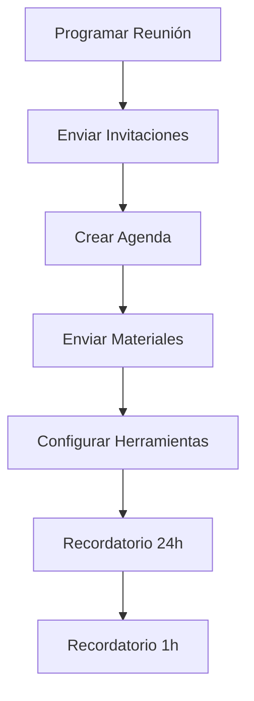
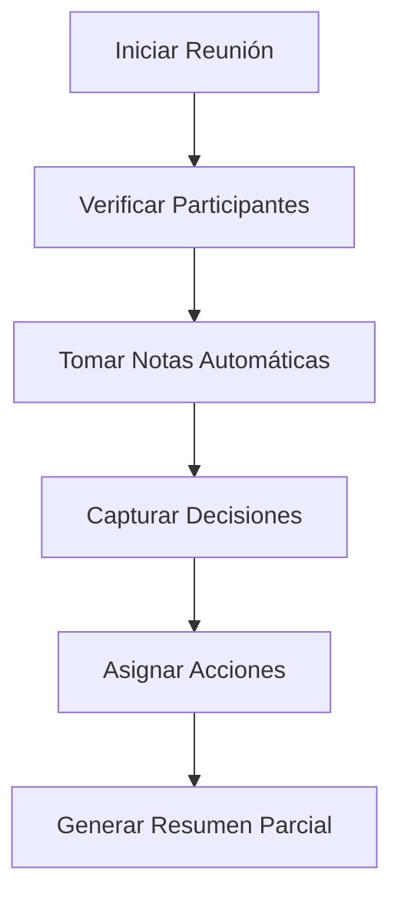
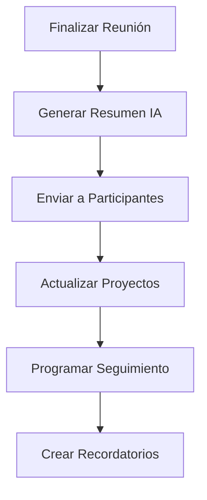

# 🤖 Template de Automatización de Reuniones

## 🚀 Configuración de Automatización

### 📧 Recordatorios Automáticos

#### ⏰ Antes de la Reunión
```yaml
Recordatorio 1: 24 horas antes
- Asunto: "Reunión mañana: [Título]"
- Contenido: "Recordatorio: Reunión [Tipo] mañana a las [Hora]"
- Acción: Enviar agenda y materiales

Recordatorio 2: 1 hora antes
- Asunto: "Reunión en 1 hora: [Título]"
- Contenido: "Último recordatorio: Reunión en 1 hora"
- Acción: Enviar link de acceso
```

#### 📝 Durante la Reunión
```yaml
Check-in automático: Cada 15 minutos
- Verificar: Participantes activos
- Alertar: Si alguien se desconecta
- Registrar: Tiempo de participación

Captura automática:
- Tomar screenshots cada 30 min
- Guardar chat/logs
- Registrar decisiones clave
```

#### 📊 Después de la Reunión
```yaml
Resumen automático: 30 min después
- Generar: Resumen con IA
- Enviar: A todos los participantes
- Programar: Próxima reunión

Seguimiento: 24 horas después
- Verificar: Acciones iniciadas
- Recordar: Fechas límite
- Actualizar: Estado de proyectos
```

---

## 📊 Dashboard de Métricas Automáticas

### 📈 KPIs en Tiempo Real
| Métrica | Valor Actual | Tendencia | Alerta |
|---------|--------------|-----------|---------|
| **Tiempo de Reunión** | [X] min | 📈/📉/➡️ | 🟢/🟡/🔴 |
| **Participación** | [X]% | 📈/📉/➡️ | 🟢/🟡/🔴 |
| **Decisiones/Min** | [X] | 📈/📉/➡️ | 🟢/🟡/🔴 |
| **Acciones Asignadas** | [X] | 📈/📉/➡️ | 🟢/🟡/🔴 |

### 🎯 Alertas Inteligentes
```yaml
Alerta de Tiempo:
- Si reunión > 120% del tiempo planificado
- Acción: Notificar al facilitador

Alerta de Participación:
- Si participación < 60%
- Acción: Sugerir break o cambio de formato

Alerta de Productividad:
- Si decisiones < 2 por hora
- Acción: Revisar agenda y objetivos
```

---

## 🔄 Flujo de Trabajo Automatizado

### 📅 Pre-Reunión (Automático)


### 🎯 Durante Reunión (Semi-Automático)


### 📊 Post-Reunión (Automático)


---

## 🛠️ Herramientas de Integración

### 📋 Gestión de Proyectos
```yaml
Trello:
- Crear tarjetas desde acciones
- Actualizar estados automáticamente
- Asignar responsables

Asana:
- Crear tareas desde decisiones
- Establecer fechas límite
- Notificar cambios

Jira:
- Crear tickets desde bloqueos
- Asignar prioridades
- Trackear progreso
```

### 📊 Analytics y Reportes
```yaml
Google Analytics:
- Trackear métricas de reunión
- Generar reportes automáticos
- Identificar tendencias

Power BI:
- Dashboard en tiempo real
- Alertas personalizadas
- Reportes ejecutivos

Tableau:
- Visualizaciones avanzadas
- Análisis predictivo
- Insights automáticos
```

---

## 🎯 Templates de Automatización

### 📧 Email Automático - Pre-Reunión
```html
Asunto: [AUTOMÁTICO] Reunión [Tipo] - [Fecha] a las [Hora]

Hola [Nombre],

Te recordamos que tienes una reunión programada:

📅 Fecha: [Fecha]
⏰ Hora: [Hora]
📍 Lugar: [Ubicación/Link]
🎯 Objetivo: [Objetivo]

📋 Agenda:
- [Punto 1]
- [Punto 2]
- [Punto 3]

📎 Materiales adjuntos:
- [Documento 1]
- [Documento 2]

¡Nos vemos pronto!

[Firma automática]
```

### 📊 Resumen Automático - Post-Reunión
```html
Asunto: [AUTOMÁTICO] Resumen de Reunión [Tipo] - [Fecha]

Hola equipo,

Aquí está el resumen automático de nuestra reunión:

📊 Métricas:
- Duración: [X] minutos
- Participantes: [X] personas
- Decisiones: [X]
- Acciones: [X]

✅ Decisiones Tomadas:
- [Decisión 1]
- [Decisión 2]

📋 Acciones Asignadas:
- [Acción 1] → [Responsable] (Fecha: [Fecha])
- [Acción 2] → [Responsable] (Fecha: [Fecha])

📅 Próxima Reunión: [Fecha] a las [Hora]

[Firma automática]
```

---

## 🔧 Configuración Técnica

### ⚙️ Variables de Configuración
```yaml
Configuración General:
  timezone: "America/Mexico_City"
  language: "es"
  format: "24h"
  
Notificaciones:
  email_enabled: true
  slack_enabled: true
  sms_enabled: false
  
Integraciones:
  calendar: "google"
  project_management: "trello"
  analytics: "google_analytics"
```

### 🎨 Personalización
```yaml
Templates:
  formal: "template_tono_formal_empresarial.md"
  casual: "template_tono_casual_amigable.md"
  technical: "template_tono_tecnico_detallado.md"
  
Métricas:
  kpis: ["progreso", "participacion", "decisiones"]
  alerts: ["tiempo", "productividad", "calidad"]
  
Automatización:
  reminders: [24, 1] # horas antes
  follow_up: 24 # horas después
  reports: "weekly"
```

---

## 📱 Aplicaciones Móviles

### 📲 Notificaciones Push
```yaml
Android/iOS:
  - Recordatorios de reunión
  - Alertas de seguimiento
  - Notificaciones de progreso
  - Recordatorios de acciones

Wearables:
  - Vibración 5 min antes
  - Resumen rápido en pantalla
  - Control de participación
  - Métricas básicas
```

### 🎯 Funcionalidades Móviles
- **📊 Dashboard móvil** con métricas clave
- **📝 Notas rápidas** durante la reunión
- **📷 Captura de pantalla** automática
- **🎤 Grabación de audio** opcional
- **📍 Geolocalización** para reuniones presenciales

---

## 🚀 Implementación por Fases

### 🎯 Fase 1: Básica (Semana 1-2)
- [ ] Configurar recordatorios automáticos
- [ ] Implementar templates básicos
- [ ] Integrar con calendario
- [ ] Enviar resúmenes automáticos

### 🎯 Fase 2: Intermedia (Semana 3-4)
- [ ] Dashboard de métricas
- [ ] Integración con herramientas de proyecto
- [ ] Alertas inteligentes
- [ ] Reportes automáticos

### 🎯 Fase 3: Avanzada (Semana 5-6)
- [ ] IA para resúmenes
- [ ] Análisis predictivo
- [ ] Optimización automática
- [ ] Integración completa

---

## 📊 Métricas de Éxito

### 🎯 KPIs de Automatización
- **⏰ Tiempo de Configuración:** < 5 minutos
- **📧 Tasa de Entrega:** > 99%
- **🎯 Precisión de Resúmenes:** > 95%
- **👥 Satisfacción del Usuario:** > 4.5/5

### 📈 Beneficios Medibles
- **⏱️ Tiempo Ahorrado:** [X] horas/semana
- **📊 Productividad:** +[X]%
- **🎯 Cumplimiento:** +[X]%
- **😊 Satisfacción:** +[X]%

---

*Template de automatización de reuniones - Versión 1.0*


