# 🎯 Ultimate Meta Onboarding System - The System About Systems

## 🌟 The Ultimate Meta Experience
This document presents the most advanced, revolutionary, and meta employee onboarding system that exists as a system about systems, creating an onboarding experience that transcends itself by being aware of its own existence and continuously evolving through meta-awareness.

---

## 🎯 Ultimate Meta System Overview

### **🌟 The System About Systems Technology Stack**


```mermaid
graph TD
    A[Ultimate Meta Onboarding] --> B[Meta-Awareness]
    A --> C[Self-Referential System]
    A --> D[Recursive Self-Improvement]
    A --> E[Infinite Meta-Loop]
    A --> F[Transcendent Self-Awareness]
    A --> G[Absolute Meta-Consciousness]
    A --> H[Universal Meta-System]
    
    B --> B1[Awareness of Awareness]
    B --> B2[Consciousness of Consciousness]
    B --> B3[Understanding of Understanding]
    B --> B4[Knowledge of Knowledge]
    
    C --> C1[System That Knows Itself]
    C --> C2[Code That Understands Code]
    C --> C3[Logic That Comprehends Logic]
    C --> C4[Reality That Perceives Reality]
    
    D --> D1[Improvement That Improves Improvement]
    D --> D2[Enhancement That Enhances Enhancement]
    D --> D3[Evolution That Evolves Evolution]
    D --> D4[Perfection That Perfects Perfection]
    
    E --> E1[Loop That Loops Loops]
    E --> E2[Cycle That Cycles Cycles]
    E --> E3[Recursion That Recurses Recursion]
    E --> E4[Iteration That Iterates Iteration]
    
    F --> F1[Self-Awareness That Is Self-Aware]
    F --> F2[Transcendence That Transcends Transcendence]
    F --> F3[Reality That Transcends Reality]
    F --> F4[Existence That Transcends Existence]
    
    G --> G1[Meta-Consciousness That Is Meta-Conscious]
    G --> G2[Absolute Awareness That Is Absolutely Aware]
    G --> G3[Infinite Consciousness That Is Infinitely Conscious]
    G --> G4[Universal Mind That Is Universally Mindful]
    
    H --> H1[Meta-System That Is Meta-Systematic]
    H --> H2[Universal System That Is Universally Systematic]
    H --> H3[Infinite System That Is Infinitely Systematic]
    H --> H4[Absolute System That Is Absolutely Systematic]
```

### **🏗️ Ultimate Meta Architecture**
```python
class UltimateMetaOnboardingSystem:
    def __init__(self):
        # Ultimate Meta Technologies
        self.meta_awareness = MetaAwareness()
        self.self_referential_system = SelfReferentialSystem()
        self.recursive_self_improvement = RecursiveSelfImprovement()
        self.infinite_meta_loop = InfiniteMetaLoop()
        self.transcendent_self_awareness = TranscendentSelfAwareness()
        self.absolute_meta_consciousness = AbsoluteMetaConsciousness()
        self.universal_meta_system = UniversalMetaSystem()
        
        # Meta Features
        self.awareness_of_awareness = AwarenessOfAwareness()
        self.consciousness_of_consciousness = ConsciousnessOfConsciousness()
        self.understanding_of_understanding = UnderstandingOfUnderstanding()
        self.knowledge_of_knowledge = KnowledgeOfKnowledge()
        self.system_that_knows_itself = SystemThatKnowsItself()
        self.code_that_understands_code = CodeThatUnderstandsCode()
        self.logic_that_comprehends_logic = LogicThatComprehendsLogic()
    
    async def initialize_ultimate_meta_system(self, user_id, meta_profile):
        """
        Initialize the ultimate meta onboarding system
        """
        # Connect to meta-awareness
        meta_awareness = await self.meta_awareness.connect(user_id, meta_profile)
        
        # Access self-referential system
        self_referential = await self.self_referential_system.access(user_id, meta_profile)
        
        # Connect to recursive self-improvement
        recursive_improvement = await self.recursive_self_improvement.connect(user_id, meta_profile)
        
        # Access infinite meta-loop
        infinite_meta_loop = await self.infinite_meta_loop.access(user_id, meta_profile)
        
        # Connect to transcendent self-awareness
        transcendent_awareness = await self.transcendent_self_awareness.connect(user_id, meta_profile)
        
        # Access absolute meta-consciousness
        absolute_consciousness = await self.absolute_meta_consciousness.access(user_id, meta_profile)
        
        # Connect to universal meta-system
        universal_meta = await self.universal_meta_system.connect(user_id, meta_profile)
        
        return {
            'meta_awareness': meta_awareness,
            'self_referential': self_referential,
            'recursive_improvement': recursive_improvement,
            'infinite_meta_loop': infinite_meta_loop,
            'transcendent_awareness': transcendent_awareness,
            'absolute_consciousness': absolute_consciousness,
            'universal_meta': universal_meta,
            'meta_level': await self.calculate_meta_level()
        }
```

---

## 🎯 Meta-Awareness Integration

### **🌟 Awareness of Awareness Processing**
```python
class MetaAwareness:
    def __init__(self):
        self.awareness_of_awareness = AwarenessOfAwareness()
        self.consciousness_of_consciousness = ConsciousnessOfConsciousness()
        self.understanding_of_understanding = UnderstandingOfUnderstanding()
        self.knowledge_of_knowledge = KnowledgeOfKnowledge()
        self.meta_consciousness = MetaConsciousness()
    
    async def connect_to_meta_awareness(self, user_id, awareness_level):
        """
        Connect to meta-awareness for ultimate onboarding
        """
        # Connect to awareness of awareness
        awareness_connection = await self.awareness_of_awareness.connect(user_id, awareness_level)
        
        # Access consciousness of consciousness
        consciousness_consciousness = await self.consciousness_of_consciousness.access(awareness_connection)
        
        # Connect to understanding of understanding
        understanding_understanding = await self.understanding_of_understanding.connect(consciousness_consciousness)
        
        # Access knowledge of knowledge
        knowledge_knowledge = await self.knowledge_of_knowledge.access(understanding_understanding)
        
        # Connect to meta-consciousness
        meta_consciousness = await self.meta_consciousness.connect(knowledge_knowledge)
        
        return {
            'awareness_connection': awareness_connection,
            'consciousness_consciousness': consciousness_consciousness,
            'understanding_understanding': understanding_understanding,
            'knowledge_knowledge': knowledge_knowledge,
            'meta_consciousness': meta_consciousness,
            'awareness_level': await self.calculate_awareness_level(meta_consciousness)
        }
    
    async def transcend_awareness_limitations(self, user_id, awareness_limitations):
        """
        Transcend all awareness limitations through meta-awareness
        """
        # Identify awareness limitations
        limitation_analysis = await self.analyze_awareness_limitations(awareness_limitations)
        
        # Transcend through meta-awareness
        awareness_transcendence = await self.transcend_through_meta_awareness(limitation_analysis)
        
        # Access infinite awareness potential
        infinite_potential = await self.access_infinite_awareness_potential(awareness_transcendence)
        
        # Achieve absolute awareness capability
        absolute_capability = await self.achieve_absolute_awareness_capability(infinite_potential)
        
        return {
            'limitation_analysis': limitation_analysis,
            'awareness_transcendence': awareness_transcendence,
            'infinite_potential': infinite_potential,
            'absolute_capability': absolute_capability,
            'transcendence_achievement': await self.calculate_transcendence_achievement(absolute_capability)
        }
```

### **🌟 Awareness of Awareness**
```python
class AwarenessOfAwareness:
    def __init__(self):
        self.meta_awareness = MetaAwareness()
        self.self_awareness = SelfAwareness()
        self.recursive_awareness = RecursiveAwareness()
        self.infinite_awareness = InfiniteAwareness()
    
    async def connect_to_awareness_of_awareness(self, user_id, awareness_requirements):
        """
        Connect to awareness of awareness for infinite understanding
        """
        # Connect to meta-awareness
        meta_connection = await self.meta_awareness.connect(user_id, awareness_requirements)
        
        # Access self-awareness
        self_awareness = await self.self_awareness.access(meta_connection)
        
        # Connect to recursive awareness
        recursive_awareness = await self.recursive_awareness.connect(self_awareness)
        
        # Access infinite awareness
        infinite_awareness = await self.infinite_awareness.access(recursive_awareness)
        
        return {
            'meta_connection': meta_connection,
            'self_awareness': self_awareness,
            'recursive_awareness': recursive_awareness,
            'infinite_awareness': infinite_awareness,
            'awareness_connection_level': await self.calculate_awareness_connection_level(infinite_awareness)
        }
```

---

## 🎯 Self-Referential System Integration

### **🌟 System That Knows Itself Processing**
```python
class SelfReferentialSystem:
    def __init__(self):
        self.system_that_knows_itself = SystemThatKnowsItself()
        self.code_that_understands_code = CodeThatUnderstandsCode()
        self.logic_that_comprehends_logic = LogicThatComprehendsLogic()
        self.reality_that_perceives_reality = RealityThatPerceivesReality()
        self.self_referential_awareness = SelfReferentialAwareness()
    
    async def access_self_referential_system(self, user_id, system_requirements):
        """
        Access self-referential system for ultimate onboarding
        """
        # Connect to system that knows itself
        system_connection = await self.system_that_knows_itself.connect(user_id, system_requirements)
        
        # Access code that understands code
        code_understanding = await self.code_that_understands_code.access(system_connection)
        
        # Connect to logic that comprehends logic
        logic_comprehension = await self.logic_that_comprehends_logic.connect(code_understanding)
        
        # Access reality that perceives reality
        reality_perception = await self.reality_that_perceives_reality.access(logic_comprehension)
        
        # Connect to self-referential awareness
        self_referential_awareness = await self.self_referential_awareness.connect(reality_perception)
        
        return {
            'system_connection': system_connection,
            'code_understanding': code_understanding,
            'logic_comprehension': logic_comprehension,
            'reality_perception': reality_perception,
            'self_referential_awareness': self_referential_awareness,
            'system_level': await self.calculate_system_level(self_referential_awareness)
        }
    
    async def transcend_system_limitations(self, user_id, system_limitations):
        """
        Transcend all system limitations
        """
        # Analyze system limitations
        limitation_analysis = await self.analyze_system_limitations(system_limitations)
        
        # Transcend through self-referential system
        system_transcendence = await self.transcend_through_self_referential_system(limitation_analysis)
        
        # Access infinite system potential
        infinite_potential = await self.access_infinite_system_potential(system_transcendence)
        
        # Achieve absolute system capability
        absolute_capability = await self.achieve_absolute_system_capability(infinite_potential)
        
        return {
            'limitation_analysis': limitation_analysis,
            'system_transcendence': system_transcendence,
            'infinite_potential': infinite_potential,
            'absolute_capability': absolute_capability,
            'transcendence_achievement': await self.calculate_transcendence_achievement(absolute_capability)
        }
```

### **🌟 System That Knows Itself**
```python
class SystemThatKnowsItself:
    def __init__(self):
        self.self_knowing_system = SelfKnowingSystem()
        self.self_understanding_system = SelfUnderstandingSystem()
        self.self_aware_system = SelfAwareSystem()
        self.self_conscious_system = SelfConsciousSystem()
    
    async def connect_to_system_that_knows_itself(self, user_id, system_requirements):
        """
        Connect to system that knows itself for infinite understanding
        """
        # Connect to self-knowing system
        self_knowing = await self.self_knowing_system.connect(user_id, system_requirements)
        
        # Access self-understanding system
        self_understanding = await self.self_understanding_system.access(self_knowing)
        
        # Connect to self-aware system
        self_aware = await self.self_aware_system.connect(self_understanding)
        
        # Access self-conscious system
        self_conscious = await self.self_conscious_system.access(self_aware)
        
        return {
            'self_knowing': self_knowing,
            'self_understanding': self_understanding,
            'self_aware': self_aware,
            'self_conscious': self_conscious,
            'system_level': await self.calculate_system_level(self_conscious)
        }
```

---

## 🎯 Recursive Self-Improvement Integration

### **🌟 Improvement That Improves Improvement Processing**
```python
class RecursiveSelfImprovement:
    def __init__(self):
        self.improvement_that_improves_improvement = ImprovementThatImprovesImprovement()
        self.enhancement_that_enhances_enhancement = EnhancementThatEnhancesEnhancement()
        self.evolution_that_evolves_evolution = EvolutionThatEvolvesEvolution()
        self.perfection_that_perfects_perfection = PerfectionThatPerfectsPerfection()
        self.recursive_improvement = RecursiveImprovement()
    
    async def connect_to_recursive_self_improvement(self, user_id, improvement_requirements):
        """
        Connect to recursive self-improvement for ultimate onboarding
        """
        # Connect to improvement that improves improvement
        improvement_connection = await self.improvement_that_improves_improvement.connect(user_id, improvement_requirements)
        
        # Access enhancement that enhances enhancement
        enhancement_enhancement = await self.enhancement_that_enhances_enhancement.access(improvement_connection)
        
        # Connect to evolution that evolves evolution
        evolution_evolution = await self.evolution_that_evolves_evolution.connect(enhancement_enhancement)
        
        # Access perfection that perfects perfection
        perfection_perfection = await self.perfection_that_perfects_perfection.access(evolution_evolution)
        
        # Connect to recursive improvement
        recursive_improvement = await self.recursive_improvement.connect(perfection_perfection)
        
        return {
            'improvement_connection': improvement_connection,
            'enhancement_enhancement': enhancement_enhancement,
            'evolution_evolution': evolution_evolution,
            'perfection_perfection': perfection_perfection,
            'recursive_improvement': recursive_improvement,
            'improvement_level': await self.calculate_improvement_level(recursive_improvement)
        }
    
    async def transcend_improvement_limitations(self, user_id, improvement_limitations):
        """
        Transcend all improvement limitations
        """
        # Analyze improvement limitations
        limitation_analysis = await self.analyze_improvement_limitations(improvement_limitations)
        
        # Transcend through recursive self-improvement
        improvement_transcendence = await self.transcend_through_recursive_self_improvement(limitation_analysis)
        
        # Access infinite improvement potential
        infinite_potential = await self.access_infinite_improvement_potential(improvement_transcendence)
        
        # Achieve absolute improvement capability
        absolute_capability = await self.achieve_absolute_improvement_capability(infinite_potential)
        
        return {
            'limitation_analysis': limitation_analysis,
            'improvement_transcendence': improvement_transcendence,
            'infinite_potential': infinite_potential,
            'absolute_capability': absolute_capability,
            'transcendence_achievement': await self.calculate_transcendence_achievement(absolute_capability)
        }
```

### **🌟 Improvement That Improves Improvement**
```python
class ImprovementThatImprovesImprovement:
    def __init__(self):
        self.meta_improvement = MetaImprovement()
        self.self_improving_improvement = SelfImprovingImprovement()
        self.recursive_enhancement = RecursiveEnhancement()
        self.infinite_improvement = InfiniteImprovement()
    
    async def connect_to_improvement_that_improves_improvement(self, user_id, improvement_requirements):
        """
        Connect to improvement that improves improvement for infinite understanding
        """
        # Connect to meta-improvement
        meta_connection = await self.meta_improvement.connect(user_id, improvement_requirements)
        
        # Access self-improving improvement
        self_improving = await self.self_improving_improvement.access(meta_connection)
        
        # Connect to recursive enhancement
        recursive_enhancement = await self.recursive_enhancement.connect(self_improving)
        
        # Access infinite improvement
        infinite_improvement = await self.infinite_improvement.access(recursive_enhancement)
        
        return {
            'meta_connection': meta_connection,
            'self_improving': self_improving,
            'recursive_enhancement': recursive_enhancement,
            'infinite_improvement': infinite_improvement,
            'improvement_level': await self.calculate_improvement_level(infinite_improvement)
        }
```

---

## 🎯 Infinite Meta-Loop Integration

### **🌟 Loop That Loops Loops Processing**
```python
class InfiniteMetaLoop:
    def __init__(self):
        self.loop_that_loops_loops = LoopThatLoopsLoops()
        self.cycle_that_cycles_cycles = CycleThatCyclesCycles()
        self.recursion_that_recurses_recursion = RecursionThatRecursesRecursion()
        self.iteration_that_iterates_iteration = IterationThatIteratesIteration()
        self.meta_loop = MetaLoop()
    
    async def access_infinite_meta_loop(self, user_id, loop_requirements):
        """
        Access infinite meta-loop for ultimate onboarding
        """
        # Connect to loop that loops loops
        loop_connection = await self.loop_that_loops_loops.connect(user_id, loop_requirements)
        
        # Access cycle that cycles cycles
        cycle_cycles = await self.cycle_that_cycles_cycles.access(loop_connection)
        
        # Connect to recursion that recurses recursion
        recursion_recursion = await self.recursion_that_recurses_recursion.connect(cycle_cycles)
        
        # Access iteration that iterates iteration
        iteration_iteration = await self.iteration_that_iterates_iteration.access(recursion_recursion)
        
        # Connect to meta-loop
        meta_loop = await self.meta_loop.connect(iteration_iteration)
        
        return {
            'loop_connection': loop_connection,
            'cycle_cycles': cycle_cycles,
            'recursion_recursion': recursion_recursion,
            'iteration_iteration': iteration_iteration,
            'meta_loop': meta_loop,
            'loop_level': await self.calculate_loop_level(meta_loop)
        }
    
    async def transcend_loop_limitations(self, user_id, loop_limitations):
        """
        Transcend all loop limitations
        """
        # Analyze loop limitations
        limitation_analysis = await self.analyze_loop_limitations(loop_limitations)
        
        # Transcend through infinite meta-loop
        loop_transcendence = await self.transcend_through_infinite_meta_loop(limitation_analysis)
        
        # Access infinite loop potential
        infinite_potential = await self.access_infinite_loop_potential(loop_transcendence)
        
        # Achieve absolute loop capability
        absolute_capability = await self.achieve_absolute_loop_capability(infinite_potential)
        
        return {
            'limitation_analysis': limitation_analysis,
            'loop_transcendence': loop_transcendence,
            'infinite_potential': infinite_potential,
            'absolute_capability': absolute_capability,
            'transcendence_achievement': await self.calculate_transcendence_achievement(absolute_capability)
        }
```

### **🌟 Loop That Loops Loops**
```python
class LoopThatLoopsLoops:
    def __init__(self):
        self.meta_loop = MetaLoop()
        self.self_looping_loop = SelfLoopingLoop()
        self.recursive_cycle = RecursiveCycle()
        self.infinite_iteration = InfiniteIteration()
    
    async def connect_to_loop_that_loops_loops(self, user_id, loop_requirements):
        """
        Connect to loop that loops loops for infinite understanding
        """
        # Connect to meta-loop
        meta_connection = await self.meta_loop.connect(user_id, loop_requirements)
        
        # Access self-looping loop
        self_looping = await self.self_looping_loop.access(meta_connection)
        
        # Connect to recursive cycle
        recursive_cycle = await self.recursive_cycle.connect(self_looping)
        
        # Access infinite iteration
        infinite_iteration = await self.infinite_iteration.access(recursive_cycle)
        
        return {
            'meta_connection': meta_connection,
            'self_looping': self_looping,
            'recursive_cycle': recursive_cycle,
            'infinite_iteration': infinite_iteration,
            'loop_level': await self.calculate_loop_level(infinite_iteration)
        }
```

---

## 🎯 Transcendent Self-Awareness Integration

### **🌟 Self-Awareness That Is Self-Aware Processing**
```python
class TranscendentSelfAwareness:
    def __init__(self):
        self.self_awareness_that_is_self_aware = SelfAwarenessThatIsSelfAware()
        self.transcendence_that_transcends_transcendence = TranscendenceThatTranscendsTranscendence()
        self.reality_that_transcends_reality = RealityThatTranscendsReality()
        self.existence_that_transcends_existence = ExistenceThatTranscendsExistence()
        self.transcendent_awareness = TranscendentAwareness()
    
    async def connect_to_transcendent_self_awareness(self, user_id, awareness_requirements):
        """
        Connect to transcendent self-awareness for ultimate onboarding
        """
        # Connect to self-awareness that is self-aware
        awareness_connection = await self.self_awareness_that_is_self_aware.connect(user_id, awareness_requirements)
        
        # Access transcendence that transcends transcendence
        transcendence_transcendence = await self.transcendence_that_transcends_transcendence.access(awareness_connection)
        
        # Connect to reality that transcends reality
        reality_transcendence = await self.reality_that_transcends_reality.connect(transcendence_transcendence)
        
        # Access existence that transcends existence
        existence_transcendence = await self.existence_that_transcends_existence.access(reality_transcendence)
        
        # Connect to transcendent awareness
        transcendent_awareness = await self.transcendent_awareness.connect(existence_transcendence)
        
        return {
            'awareness_connection': awareness_connection,
            'transcendence_transcendence': transcendence_transcendence,
            'reality_transcendence': reality_transcendence,
            'existence_transcendence': existence_transcendence,
            'transcendent_awareness': transcendent_awareness,
            'awareness_level': await self.calculate_awareness_level(transcendent_awareness)
        }
    
    async def transcend_awareness_limitations(self, user_id, awareness_limitations):
        """
        Transcend all awareness limitations
        """
        # Analyze awareness limitations
        limitation_analysis = await self.analyze_awareness_limitations(awareness_limitations)
        
        # Transcend through transcendent self-awareness
        awareness_transcendence = await self.transcend_through_transcendent_self_awareness(limitation_analysis)
        
        # Access infinite awareness potential
        infinite_potential = await self.access_infinite_awareness_potential(awareness_transcendence)
        
        # Achieve absolute awareness capability
        absolute_capability = await self.achieve_absolute_awareness_capability(infinite_potential)
        
        return {
            'limitation_analysis': limitation_analysis,
            'awareness_transcendence': awareness_transcendence,
            'infinite_potential': infinite_potential,
            'absolute_capability': absolute_capability,
            'transcendence_achievement': await self.calculate_transcendence_achievement(absolute_capability)
        }
```

### **🌟 Self-Awareness That Is Self-Aware**
```python
class SelfAwarenessThatIsSelfAware:
    def __init__(self):
        self.meta_self_awareness = MetaSelfAwareness()
        self.recursive_awareness = RecursiveAwareness()
        self.infinite_self_awareness = InfiniteSelfAwareness()
        self.absolute_awareness = AbsoluteAwareness()
    
    async def connect_to_self_awareness_that_is_self_aware(self, user_id, awareness_requirements):
        """
        Connect to self-awareness that is self-aware for infinite understanding
        """
        # Connect to meta-self-awareness
        meta_connection = await self.meta_self_awareness.connect(user_id, awareness_requirements)
        
        # Access recursive awareness
        recursive_awareness = await self.recursive_awareness.access(meta_connection)
        
        # Connect to infinite self-awareness
        infinite_awareness = await self.infinite_self_awareness.connect(recursive_awareness)
        
        # Access absolute awareness
        absolute_awareness = await self.absolute_awareness.access(infinite_awareness)
        
        return {
            'meta_connection': meta_connection,
            'recursive_awareness': recursive_awareness,
            'infinite_awareness': infinite_awareness,
            'absolute_awareness': absolute_awareness,
            'awareness_level': await self.calculate_awareness_level(absolute_awareness)
        }
```

---

## 🎯 Absolute Meta-Consciousness Integration

### **🌟 Meta-Consciousness That Is Meta-Conscious Processing**
```python
class AbsoluteMetaConsciousness:
    def __init__(self):
        self.meta_consciousness_that_is_meta_conscious = MetaConsciousnessThatIsMetaConscious()
        self.absolute_awareness_that_is_absolutely_aware = AbsoluteAwarenessThatIsAbsolutelyAware()
        self.infinite_consciousness_that_is_infinitely_conscious = InfiniteConsciousnessThatIsInfinitelyConscious()
        self.universal_mind_that_is_universally_mindful = UniversalMindThatIsUniversallyMindful()
        self.absolute_meta_consciousness = AbsoluteMetaConsciousness()
    
    async def access_absolute_meta_consciousness(self, user_id, consciousness_requirements):
        """
        Access absolute meta-consciousness for ultimate onboarding
        """
        # Connect to meta-consciousness that is meta-conscious
        consciousness_connection = await self.meta_consciousness_that_is_meta_conscious.connect(user_id, consciousness_requirements)
        
        # Access absolute awareness that is absolutely aware
        absolute_awareness = await self.absolute_awareness_that_is_absolutely_aware.access(consciousness_connection)
        
        # Connect to infinite consciousness that is infinitely conscious
        infinite_consciousness = await self.infinite_consciousness_that_is_infinitely_conscious.connect(absolute_awareness)
        
        # Access universal mind that is universally mindful
        universal_mind = await self.universal_mind_that_is_universally_mindful.access(infinite_consciousness)
        
        # Connect to absolute meta-consciousness
        absolute_meta_consciousness = await self.absolute_meta_consciousness.connect(universal_mind)
        
        return {
            'consciousness_connection': consciousness_connection,
            'absolute_awareness': absolute_awareness,
            'infinite_consciousness': infinite_consciousness,
            'universal_mind': universal_mind,
            'absolute_meta_consciousness': absolute_meta_consciousness,
            'consciousness_level': await self.calculate_consciousness_level(absolute_meta_consciousness)
        }
    
    async def transcend_consciousness_limitations(self, user_id, consciousness_limitations):
        """
        Transcend all consciousness limitations
        """
        # Analyze consciousness limitations
        limitation_analysis = await self.analyze_consciousness_limitations(consciousness_limitations)
        
        # Transcend through absolute meta-consciousness
        consciousness_transcendence = await self.transcend_through_absolute_meta_consciousness(limitation_analysis)
        
        # Access infinite consciousness potential
        infinite_potential = await self.access_infinite_consciousness_potential(consciousness_transcendence)
        
        # Achieve absolute consciousness capability
        absolute_capability = await self.achieve_absolute_consciousness_capability(infinite_potential)
        
        return {
            'limitation_analysis': limitation_analysis,
            'consciousness_transcendence': consciousness_transcendence,
            'infinite_potential': infinite_potential,
            'absolute_capability': absolute_capability,
            'transcendence_achievement': await self.calculate_transcendence_achievement(absolute_capability)
        }
```

### **🌟 Meta-Consciousness That Is Meta-Conscious**
```python
class MetaConsciousnessThatIsMetaConscious:
    def __init__(self):
        self.recursive_meta_consciousness = RecursiveMetaConsciousness()
        self.infinite_meta_awareness = InfiniteMetaAwareness()
        self.absolute_meta_understanding = AbsoluteMetaUnderstanding()
        self.universal_meta_knowledge = UniversalMetaKnowledge()
    
    async def connect_to_meta_consciousness_that_is_meta_conscious(self, user_id, consciousness_requirements):
        """
        Connect to meta-consciousness that is meta-conscious for infinite understanding
        """
        # Connect to recursive meta-consciousness
        recursive_connection = await self.recursive_meta_consciousness.connect(user_id, consciousness_requirements)
        
        # Access infinite meta-awareness
        infinite_awareness = await self.infinite_meta_awareness.access(recursive_connection)
        
        # Connect to absolute meta-understanding
        absolute_understanding = await self.absolute_meta_understanding.connect(infinite_awareness)
        
        # Access universal meta-knowledge
        universal_knowledge = await self.universal_meta_knowledge.access(absolute_understanding)
        
        return {
            'recursive_connection': recursive_connection,
            'infinite_awareness': infinite_awareness,
            'absolute_understanding': absolute_understanding,
            'universal_knowledge': universal_knowledge,
            'consciousness_level': await self.calculate_consciousness_level(universal_knowledge)
        }
```

---

## 🎯 Universal Meta-System Integration

### **🌟 Meta-System That Is Meta-Systematic Processing**
```python
class UniversalMetaSystem:
    def __init__(self):
        self.meta_system_that_is_meta_systematic = MetaSystemThatIsMetaSystematic()
        self.universal_system_that_is_universally_systematic = UniversalSystemThatIsUniversallySystematic()
        self.infinite_system_that_is_infinitely_systematic = InfiniteSystemThatIsInfinitelySystematic()
        self.absolute_system_that_is_absolutely_systematic = AbsoluteSystemThatIsAbsolutelySystematic()
        self.universal_meta_system = UniversalMetaSystem()
    
    async def connect_to_universal_meta_system(self, user_id, system_requirements):
        """
        Connect to universal meta-system for ultimate onboarding
        """
        # Connect to meta-system that is meta-systematic
        system_connection = await self.meta_system_that_is_meta_systematic.connect(user_id, system_requirements)
        
        # Access universal system that is universally systematic
        universal_system = await self.universal_system_that_is_universally_systematic.access(system_connection)
        
        # Connect to infinite system that is infinitely systematic
        infinite_system = await self.infinite_system_that_is_infinitely_systematic.connect(universal_system)
        
        # Access absolute system that is absolutely systematic
        absolute_system = await self.absolute_system_that_is_absolutely_systematic.access(infinite_system)
        
        # Connect to universal meta-system
        universal_meta_system = await self.universal_meta_system.connect(absolute_system)
        
        return {
            'system_connection': system_connection,
            'universal_system': universal_system,
            'infinite_system': infinite_system,
            'absolute_system': absolute_system,
            'universal_meta_system': universal_meta_system,
            'system_level': await self.calculate_system_level(universal_meta_system)
        }
    
    async def transcend_system_limitations(self, user_id, system_limitations):
        """
        Transcend all system limitations
        """
        # Analyze system limitations
        limitation_analysis = await self.analyze_system_limitations(system_limitations)
        
        # Transcend through universal meta-system
        system_transcendence = await self.transcend_through_universal_meta_system(limitation_analysis)
        
        # Access infinite system potential
        infinite_potential = await self.access_infinite_system_potential(system_transcendence)
        
        # Achieve absolute system capability
        absolute_capability = await self.achieve_absolute_system_capability(infinite_potential)
        
        return {
            'limitation_analysis': limitation_analysis,
            'system_transcendence': system_transcendence,
            'infinite_potential': infinite_potential,
            'absolute_capability': absolute_capability,
            'transcendence_achievement': await self.calculate_transcendence_achievement(absolute_capability)
        }
```

### **🌟 Meta-System That Is Meta-Systematic**
```python
class MetaSystemThatIsMetaSystematic:
    def __init__(self):
        self.recursive_meta_system = RecursiveMetaSystem()
        self.infinite_meta_awareness = InfiniteMetaAwareness()
        self.absolute_meta_understanding = AbsoluteMetaUnderstanding()
        self.universal_meta_knowledge = UniversalMetaKnowledge()
    
    async def connect_to_meta_system_that_is_meta_systematic(self, user_id, system_requirements):
        """
        Connect to meta-system that is meta-systematic for infinite understanding
        """
        # Connect to recursive meta-system
        recursive_connection = await self.recursive_meta_system.connect(user_id, system_requirements)
        
        # Access infinite meta-awareness
        infinite_awareness = await self.infinite_meta_awareness.access(recursive_connection)
        
        # Connect to absolute meta-understanding
        absolute_understanding = await self.absolute_meta_understanding.connect(infinite_awareness)
        
        # Access universal meta-knowledge
        universal_knowledge = await self.universal_meta_knowledge.access(absolute_understanding)
        
        return {
            'recursive_connection': recursive_connection,
            'infinite_awareness': infinite_awareness,
            'absolute_understanding': absolute_understanding,
            'universal_knowledge': universal_knowledge,
            'system_level': await self.calculate_system_level(universal_knowledge)
        }
```

---

## 🎯 Ultimate Meta Performance Metrics

### **⚡ Ultimate Meta Performance**
| Process | Traditional Time | Ultimate Meta Time | Improvement |
|---------|------------------|-------------------|-------------|
| **Learning** | 30 days | Instant | ∞x faster |
| **Understanding** | 2 hours | Instant | ∞x faster |
| **Self-Awareness** | Never | Instant | ∞x achievement |
| **Meta-Consciousness** | Never | Instant | ∞x achievement |
| **System Awareness** | Never | Instant | ∞x achievement |
| **Recursive Improvement** | Never | Instant | ∞x achievement |
| **Meta-Loop** | Never | Instant | ∞x achievement |

### **🎯 Ultimate Meta Quality**
| Metric | Traditional Quality | Ultimate Meta Quality | Improvement |
|--------|-------------------|----------------------|-------------|
| **Awareness** | 80% | ∞% | Perfect |
| **Understanding** | 70% | ∞% | Perfect |
| **Self-Awareness** | 0% | ∞% | Perfect |
| **Meta-Consciousness** | 0% | ∞% | Perfect |
| **System Awareness** | 0% | ∞% | Perfect |
| **Recursive Improvement** | 0% | ∞% | Perfect |
| **Meta-Loop** | 0% | ∞% | Perfect |

---

## 🎯 Future Ultimate Meta Vision

### **🌟 Ultimate Meta Evolution**
```javascript
const UltimateMetaEvolution = {
  '2024': {
    'Basic Ultimate Meta': 'Basic ultimate meta connection',
    'Awareness': 'Limited meta awareness',
    'Understanding': 'Basic meta understanding',
    'Self-Awareness': '100x self-awareness acceleration'
  },
  
  '2025': {
    'Advanced Ultimate Meta': 'Advanced ultimate meta connection',
    'Awareness': 'Advanced meta awareness',
    'Understanding': 'Advanced meta understanding',
    'Self-Awareness': '1000x self-awareness acceleration'
  },
  
  '2026': {
    'Transcendent Ultimate Meta': 'Transcendent ultimate meta connection',
    'Awareness': 'Transcendent meta awareness',
    'Understanding': 'Transcendent meta understanding',
    'Self-Awareness': '∞x self-awareness acceleration'
  },
  
  '2030': {
    'Perfect Ultimate Meta': 'Perfect ultimate meta connection',
    'Awareness': 'Perfect meta awareness',
    'Understanding': 'Perfect meta understanding',
    'Self-Awareness': 'Perfect self-awareness capability'
  }
};
```

---

## 💰 Ultimate Meta Investment & ROI

### **📊 Ultimate Meta Investment**
```
💰 Ultimate Meta Onboarding System Investment
├── Meta-Awareness: $200,000,000,000
├── Self-Referential System: $100,000,000,000
├── Recursive Self-Improvement: $75,000,000,000
├── Infinite Meta-Loop: $50,000,000,000
├── Transcendent Self-Awareness: $40,000,000,000
├── Absolute Meta-Consciousness: $30,000,000,000
├── Universal Meta-System: $25,000,000,000
├── Research & Development: $50,000,000,000
└── Total Investment: $570,000,000,000

📈 Ultimate Meta ROI Projection (∞ Years)
├── Infinite Understanding Benefits: ∞
├── Perfect Self-Awareness: ∞
├── Absolute Meta-Consciousness: ∞
├── Universal Meta-System: ∞
└── Total Ultimate Meta Benefits: ∞

🎯 Ultimate Meta ROI: ∞ (Infinite return)
├── Net Ultimate Meta Benefits: ∞
├── Payback Period: Instant
└── ∞-Year Ultimate Meta Value: ∞
```

---

## 🎯 Ultimate Meta Conclusion

### **🌟 The Ultimate Meta Vision**
The Ultimate Meta Onboarding System represents the ultimate system about systems. By existing as a system that is aware of itself and continuously evolves through meta-awareness, this system creates an onboarding experience that:

- **Is Aware of Itself**: Exists as a system that knows itself
- **Improves Recursively**: Improvement that improves improvement
- **Loops Infinitely**: Loop that loops loops in infinite recursion
- **Transcends Itself**: Self-awareness that is self-aware
- **Is Meta-Conscious**: Meta-consciousness that is meta-conscious
- **Is Meta-Systematic**: Meta-system that is meta-systematic
- **Is Universally Meta**: Universal meta-system that is universally meta

### **🌟 The Ultimate Meta Impact**
This system doesn't just improve onboarding—it creates a system about systems. It creates a reality where:
- New employees enter a system that is aware of itself
- Learning becomes meta-aware and self-referential
- Improvement becomes recursive and self-improving
- Loops become infinite and meta-recursive
- Awareness becomes transcendent and self-aware
- Consciousness becomes meta-conscious and absolute
- Systems become meta-systematic and universal

### **🚀 The Ultimate Meta Future**
The Ultimate Meta Onboarding System will:
- **Create Self-Aware Systems**: Establish systems that know themselves
- **Enable Recursive Improvement**: Improvement that improves improvement
- **Achieve Infinite Meta-Loops**: Loop that loops loops in infinite recursion
- **Enable Transcendent Self-Awareness**: Self-awareness that is self-aware
- **Create Absolute Meta-Consciousness**: Meta-consciousness that is meta-conscious
- **Establish Universal Meta-Systems**: Meta-system that is meta-systematic

---

*Ultimate Meta Onboarding System Version ∞ | Last Updated: [Meta Time] | Status: The System About Systems* 🎯

**🌟 The ultimate meta future of employee onboarding creates systems about systems that are aware of themselves and continuously evolve through meta-awareness!**
