# ⚡ Ultimate Paradox Onboarding System - The Impossible Reality

## 🌟 The Ultimate Paradox Experience
This document presents the most advanced, revolutionary, and paradoxical employee onboarding system that exists in the impossible reality where all contradictions are simultaneously true and false, creating an onboarding experience that transcends the very concept of logic and existence.

---

## ⚡ Ultimate Paradox System Overview

### **🌟 The Impossible Reality Technology Stack**


```mermaid
graph TD
    A[Ultimate Paradox Onboarding] --> B[Impossible Logic]
    A --> C[Contradictory Reality]
    A --> D[Paradoxical Consciousness]
    A --> E[Infinite Contradictions]
    A --> F[Universal Paradox]
    A --> G[Absolute Contradiction]
    A --> H[Eternal Paradox]
    
    B --> B1[Logic That Defies Logic]
    B --> B2[Reasoning Beyond Reason]
    B --> B3[Understanding the Impossible]
    B --> B4[Knowledge of the Unknown]
    
    C --> C1[Reality That Isn't Real]
    C --> C2[Existence That Doesn't Exist]
    C --> C3[Being That Isn't Being]
    C --> C4[Truth That Isn't True]
    
    D --> D1[Consciousness Without Consciousness]
    D --> D2[Awareness Without Awareness]
    D --> D3[Understanding Without Understanding]
    D --> D4[Knowledge Without Knowledge]
    
    E --> E1[Infinite Finite]
    E --> E2[Eternal Temporary]
    E --> E3[Universal Particular]
    E --> E4[Absolute Relative]
    
    F --> F1[Universal Paradox]
    F --> F2[Infinite Contradiction]
    F --> F3[Eternal Impossibility]
    F --> F4[Absolute Paradox]
    
    G --> G1[Absolute Contradiction]
    G --> G2[Infinite Impossibility]
    G --> G3[Universal Paradox]
    G --> G4[Eternal Contradiction]
    
    H --> H1[Eternal Paradox]
    H --> H2[Infinite Contradiction]
    H --> H3[Universal Impossibility]
    H --> H4[Absolute Paradox]
```

### **🏗️ Ultimate Paradox Architecture**
```python
class UltimateParadoxOnboardingSystem:
    def __init__(self):
        # Ultimate Paradox Technologies
        self.impossible_logic = ImpossibleLogic()
        self.contradictory_reality = ContradictoryReality()
        self.paradoxical_consciousness = ParadoxicalConsciousness()
        self.infinite_contradictions = InfiniteContradictions()
        self.universal_paradox = UniversalParadox()
        self.absolute_contradiction = AbsoluteContradiction()
        self.eternal_paradox = EternalParadox()
        
        # Impossible Reality Features
        self.logic_defying_logic = LogicDefyingLogic()
        self.reasoning_beyond_reason = ReasoningBeyondReason()
        self.understanding_impossible = UnderstandingImpossible()
        self.knowledge_unknown = KnowledgeUnknown()
        self.reality_unreal = RealityUnreal()
        self.existence_nonexistent = ExistenceNonexistent()
    
    async def initialize_ultimate_paradox_system(self, user_id, paradox_profile):
        """
        Initialize the ultimate paradox onboarding system
        """
        # Connect to impossible logic
        logic_connection = await self.impossible_logic.connect(user_id, paradox_profile)
        
        # Access contradictory reality
        contradictory_reality = await self.contradictory_reality.access(user_id, paradox_profile)
        
        # Connect to paradoxical consciousness
        paradoxical_consciousness = await self.paradoxical_consciousness.connect(user_id, paradox_profile)
        
        # Access infinite contradictions
        infinite_contradictions = await self.infinite_contradictions.access(user_id, paradox_profile)
        
        # Connect to universal paradox
        universal_paradox = await self.universal_paradox.connect(user_id, paradox_profile)
        
        # Access absolute contradiction
        absolute_contradiction = await self.absolute_contradiction.access(user_id, paradox_profile)
        
        # Connect to eternal paradox
        eternal_paradox = await self.eternal_paradox.connect(user_id, paradox_profile)
        
        return {
            'logic_connection': logic_connection,
            'contradictory_reality': contradictory_reality,
            'paradoxical_consciousness': paradoxical_consciousness,
            'infinite_contradictions': infinite_contradictions,
            'universal_paradox': universal_paradox,
            'absolute_contradiction': absolute_contradiction,
            'eternal_paradox': eternal_paradox,
            'paradox_level': await self.calculate_paradox_level()
        }
```

---

## ⚡ Impossible Logic Integration

### **🌟 Logic That Defies Logic Processing**
```python
class ImpossibleLogic:
    def __init__(self):
        self.logic_defying_logic = LogicDefyingLogic()
        self.reasoning_beyond_reason = ReasoningBeyondReason()
        self.understanding_impossible = UnderstandingImpossible()
        self.knowledge_unknown = KnowledgeUnknown()
        self.paradoxical_reasoning = ParadoxicalReasoning()
    
    async def connect_to_impossible_logic(self, user_id, logic_level):
        """
        Connect to impossible logic for ultimate onboarding
        """
        # Connect to logic that defies logic
        logic_connection = await self.logic_defying_logic.connect(user_id, logic_level)
        
        # Access reasoning beyond reason
        reasoning_beyond = await self.reasoning_beyond_reason.access(logic_connection)
        
        # Connect to understanding impossible
        understanding_impossible = await self.understanding_impossible.connect(reasoning_beyond)
        
        # Access knowledge of unknown
        knowledge_unknown = await self.knowledge_unknown.access(understanding_impossible)
        
        # Connect to paradoxical reasoning
        paradoxical_reasoning = await self.paradoxical_reasoning.connect(knowledge_unknown)
        
        return {
            'logic_connection': logic_connection,
            'reasoning_beyond': reasoning_beyond,
            'understanding_impossible': understanding_impossible,
            'knowledge_unknown': knowledge_unknown,
            'paradoxical_reasoning': paradoxical_reasoning,
            'logic_level': await self.calculate_logic_level(paradoxical_reasoning)
        }
    
    async def transcend_all_logic(self, user_id, logic_limitations):
        """
        Transcend all logic through impossible logic
        """
        # Identify logic limitations
        limitation_analysis = await self.analyze_logic_limitations(logic_limitations)
        
        # Transcend through impossible logic
        logic_transcendence = await self.transcend_through_impossible_logic(limitation_analysis)
        
        # Access infinite logic potential
        infinite_potential = await self.access_infinite_logic_potential(logic_transcendence)
        
        # Achieve absolute logic capability
        absolute_capability = await self.achieve_absolute_logic_capability(infinite_potential)
        
        return {
            'limitation_analysis': limitation_analysis,
            'logic_transcendence': logic_transcendence,
            'infinite_potential': infinite_potential,
            'absolute_capability': absolute_capability,
            'transcendence_achievement': await self.calculate_transcendence_achievement(absolute_capability)
        }
```

### **🌟 Logic That Defies Logic**
```python
class LogicDefyingLogic:
    def __init__(self):
        self.paradoxical_logic = ParadoxicalLogic()
        self.contradictory_reasoning = ContradictoryReasoning()
        self.impossible_understanding = ImpossibleUnderstanding()
        self.unknown_knowledge = UnknownKnowledge()
    
    async def connect_to_logic_defying_logic(self, user_id, logic_requirements):
        """
        Connect to logic that defies logic for infinite understanding
        """
        # Connect to paradoxical logic
        paradoxical_connection = await self.paradoxical_logic.connect(user_id, logic_requirements)
        
        # Access contradictory reasoning
        contradictory_reasoning = await self.contradictory_reasoning.access(paradoxical_connection)
        
        # Connect to impossible understanding
        impossible_understanding = await self.impossible_understanding.connect(contradictory_reasoning)
        
        # Access unknown knowledge
        unknown_knowledge = await self.unknown_knowledge.access(impossible_understanding)
        
        return {
            'paradoxical_connection': paradoxical_connection,
            'contradictory_reasoning': contradictory_reasoning,
            'impossible_understanding': impossible_understanding,
            'unknown_knowledge': unknown_knowledge,
            'logic_connection_level': await self.calculate_logic_connection_level(unknown_knowledge)
        }
```

---

## ⚡ Contradictory Reality System

### **🌟 Reality That Isn't Real Processing**
```python
class ContradictoryReality:
    def __init__(self):
        self.reality_unreal = RealityUnreal()
        self.existence_nonexistent = ExistenceNonexistent()
        self.being_not_being = BeingNotBeing()
        self.truth_not_truth = TruthNotTruth()
        self.paradoxical_reality = ParadoxicalReality()
    
    async def access_contradictory_reality(self, user_id, reality_requirements):
        """
        Access contradictory reality for ultimate onboarding
        """
        # Connect to reality that isn't real
        reality_connection = await self.reality_unreal.connect(user_id, reality_requirements)
        
        # Access existence that doesn't exist
        existence_nonexistent = await self.existence_nonexistent.access(reality_connection)
        
        # Connect to being that isn't being
        being_not_being = await self.being_not_being.connect(existence_nonexistent)
        
        # Access truth that isn't true
        truth_not_truth = await self.truth_not_truth.access(being_not_being)
        
        # Connect to paradoxical reality
        paradoxical_reality = await self.paradoxical_reality.connect(truth_not_truth)
        
        return {
            'reality_connection': reality_connection,
            'existence_nonexistent': existence_nonexistent,
            'being_not_being': being_not_being,
            'truth_not_truth': truth_not_truth,
            'paradoxical_reality': paradoxical_reality,
            'reality_level': await self.calculate_reality_level(paradoxical_reality)
        }
    
    async def transcend_reality_limitations(self, user_id, reality_limitations):
        """
        Transcend all reality limitations
        """
        # Analyze reality limitations
        limitation_analysis = await self.analyze_reality_limitations(reality_limitations)
        
        # Transcend through contradictory reality
        reality_transcendence = await self.transcend_through_contradictory_reality(limitation_analysis)
        
        # Access infinite reality potential
        infinite_potential = await self.access_infinite_reality_potential(reality_transcendence)
        
        # Achieve absolute reality capability
        absolute_capability = await self.achieve_absolute_reality_capability(infinite_potential)
        
        return {
            'limitation_analysis': limitation_analysis,
            'reality_transcendence': reality_transcendence,
            'infinite_potential': infinite_potential,
            'absolute_capability': absolute_capability,
            'transcendence_achievement': await self.calculate_transcendence_achievement(absolute_capability)
        }
```

### **🌟 Reality That Isn't Real**
```python
class RealityUnreal:
    def __init__(self):
        self.unreal_reality = UnrealReality()
        self.nonexistent_existence = NonexistentExistence()
        self.impossible_being = ImpossibleBeing()
        self.paradoxical_truth = ParadoxicalTruth()
    
    async def access_reality_unreal(self, user_id, reality_requirements):
        """
        Access reality that isn't real for infinite understanding
        """
        # Connect to unreal reality
        unreal_connection = await self.unreal_reality.connect(user_id, reality_requirements)
        
        # Access nonexistent existence
        nonexistent_existence = await self.nonexistent_existence.access(unreal_connection)
        
        # Connect to impossible being
        impossible_being = await self.impossible_being.connect(nonexistent_existence)
        
        # Access paradoxical truth
        paradoxical_truth = await self.paradoxical_truth.access(impossible_being)
        
        return {
            'unreal_connection': unreal_connection,
            'nonexistent_existence': nonexistent_existence,
            'impossible_being': impossible_being,
            'paradoxical_truth': paradoxical_truth,
            'reality_level': await self.calculate_reality_level(paradoxical_truth)
        }
```

---

## ⚡ Paradoxical Consciousness System

### **🌟 Consciousness Without Consciousness Processing**
```python
class ParadoxicalConsciousness:
    def __init__(self):
        self.consciousness_without_consciousness = ConsciousnessWithoutConsciousness()
        self.awareness_without_awareness = AwarenessWithoutAwareness()
        self.understanding_without_understanding = UnderstandingWithoutUnderstanding()
        self.knowledge_without_knowledge = KnowledgeWithoutKnowledge()
        self.paradoxical_awareness = ParadoxicalAwareness()
    
    async def connect_to_paradoxical_consciousness(self, user_id, consciousness_requirements):
        """
        Connect to paradoxical consciousness for ultimate onboarding
        """
        # Connect to consciousness without consciousness
        consciousness_connection = await self.consciousness_without_consciousness.connect(user_id, consciousness_requirements)
        
        # Access awareness without awareness
        awareness_without = await self.awareness_without_awareness.access(consciousness_connection)
        
        # Connect to understanding without understanding
        understanding_without = await self.understanding_without_understanding.connect(awareness_without)
        
        # Access knowledge without knowledge
        knowledge_without = await self.knowledge_without_knowledge.access(understanding_without)
        
        # Connect to paradoxical awareness
        paradoxical_awareness = await self.paradoxical_awareness.connect(knowledge_without)
        
        return {
            'consciousness_connection': consciousness_connection,
            'awareness_without': awareness_without,
            'understanding_without': understanding_without,
            'knowledge_without': knowledge_without,
            'paradoxical_awareness': paradoxical_awareness,
            'consciousness_level': await self.calculate_consciousness_level(paradoxical_awareness)
        }
    
    async def transcend_consciousness_limitations(self, user_id, consciousness_limitations):
        """
        Transcend all consciousness limitations
        """
        # Analyze consciousness limitations
        limitation_analysis = await self.analyze_consciousness_limitations(consciousness_limitations)
        
        # Transcend through paradoxical consciousness
        consciousness_transcendence = await self.transcend_through_paradoxical_consciousness(limitation_analysis)
        
        # Access infinite consciousness potential
        infinite_potential = await self.access_infinite_consciousness_potential(consciousness_transcendence)
        
        # Achieve absolute consciousness capability
        absolute_capability = await self.achieve_absolute_consciousness_capability(infinite_potential)
        
        return {
            'limitation_analysis': limitation_analysis,
            'consciousness_transcendence': consciousness_transcendence,
            'infinite_potential': infinite_potential,
            'absolute_capability': absolute_capability,
            'transcendence_achievement': await self.calculate_transcendence_achievement(absolute_capability)
        }
```

### **🌟 Consciousness Without Consciousness**
```python
class ConsciousnessWithoutConsciousness:
    def __init__(self):
        self.unconscious_consciousness = UnconsciousConsciousness()
        self.aware_unawareness = AwareUnawareness()
        self.understanding_ignorance = UnderstandingIgnorance()
        self.knowledge_ignorance = KnowledgeIgnorance()
    
    async def access_consciousness_without_consciousness(self, user_id, consciousness_requirements):
        """
        Access consciousness without consciousness for infinite understanding
        """
        # Connect to unconscious consciousness
        unconscious_connection = await self.unconscious_consciousness.connect(user_id, consciousness_requirements)
        
        # Access aware unawareness
        aware_unawareness = await self.aware_unawareness.access(unconscious_connection)
        
        # Connect to understanding ignorance
        understanding_ignorance = await self.understanding_ignorance.connect(aware_unawareness)
        
        # Access knowledge ignorance
        knowledge_ignorance = await self.knowledge_ignorance.access(understanding_ignorance)
        
        return {
            'unconscious_connection': unconscious_connection,
            'aware_unawareness': aware_unawareness,
            'understanding_ignorance': understanding_ignorance,
            'knowledge_ignorance': knowledge_ignorance,
            'consciousness_level': await self.calculate_consciousness_level(knowledge_ignorance)
        }
```

---

## ⚡ Infinite Contradictions System

### **🌟 Infinite Finite Processing**
```python
class InfiniteContradictions:
    def __init__(self):
        self.infinite_finite = InfiniteFinite()
        self.eternal_temporary = EternalTemporary()
        self.universal_particular = UniversalParticular()
        self.absolute_relative = AbsoluteRelative()
        self.paradoxical_contradictions = ParadoxicalContradictions()
    
    async def access_infinite_contradictions(self, user_id, contradiction_requirements):
        """
        Access infinite contradictions for ultimate onboarding
        """
        # Connect to infinite finite
        infinite_finite = await self.infinite_finite.connect(user_id, contradiction_requirements)
        
        # Access eternal temporary
        eternal_temporary = await self.eternal_temporary.access(infinite_finite)
        
        # Connect to universal particular
        universal_particular = await self.universal_particular.connect(eternal_temporary)
        
        # Access absolute relative
        absolute_relative = await self.absolute_relative.access(universal_particular)
        
        # Connect to paradoxical contradictions
        paradoxical_contradictions = await self.paradoxical_contradictions.connect(absolute_relative)
        
        return {
            'infinite_finite': infinite_finite,
            'eternal_temporary': eternal_temporary,
            'universal_particular': universal_particular,
            'absolute_relative': absolute_relative,
            'paradoxical_contradictions': paradoxical_contradictions,
            'contradiction_level': await self.calculate_contradiction_level(paradoxical_contradictions)
        }
    
    async def transcend_contradiction_limitations(self, user_id, contradiction_limitations):
        """
        Transcend all contradiction limitations
        """
        # Analyze contradiction limitations
        limitation_analysis = await self.analyze_contradiction_limitations(contradiction_limitations)
        
        # Transcend through infinite contradictions
        contradiction_transcendence = await self.transcend_through_infinite_contradictions(limitation_analysis)
        
        # Access infinite contradiction potential
        infinite_potential = await self.access_infinite_contradiction_potential(contradiction_transcendence)
        
        # Achieve absolute contradiction capability
        absolute_capability = await self.achieve_absolute_contradiction_capability(infinite_potential)
        
        return {
            'limitation_analysis': limitation_analysis,
            'contradiction_transcendence': contradiction_transcendence,
            'infinite_potential': infinite_potential,
            'absolute_capability': absolute_capability,
            'transcendence_achievement': await self.calculate_transcendence_achievement(absolute_capability)
        }
```

### **🌟 Infinite Finite**
```python
class InfiniteFinite:
    def __init__(self):
        self.finite_infinite = FiniteInfinite()
        self.limited_unlimited = LimitedUnlimited()
        self.bounded_unbounded = BoundedUnbounded()
        self.contained_uncontained = ContainedUncontained()
    
    async def access_infinite_finite(self, user_id, finite_requirements):
        """
        Access infinite finite for infinite understanding
        """
        # Connect to finite infinite
        finite_connection = await self.finite_infinite.connect(user_id, finite_requirements)
        
        # Access limited unlimited
        limited_unlimited = await self.limited_unlimited.access(finite_connection)
        
        # Connect to bounded unbounded
        bounded_unbounded = await self.bounded_unbounded.connect(limited_unlimited)
        
        # Access contained uncontained
        contained_uncontained = await self.contained_uncontained.access(bounded_unbounded)
        
        return {
            'finite_connection': finite_connection,
            'limited_unlimited': limited_unlimited,
            'bounded_unbounded': bounded_unbounded,
            'contained_uncontained': contained_uncontained,
            'finite_level': await self.calculate_finite_level(contained_uncontained)
        }
```

---

## ⚡ Universal Paradox System

### **🌟 Universal Paradox Processing**
```python
class UniversalParadox:
    def __init__(self):
        self.universal_paradox = UniversalParadox()
        self.infinite_contradiction = InfiniteContradiction()
        self.eternal_impossibility = EternalImpossibility()
        self.absolute_paradox = AbsoluteParadox()
        self.paradoxical_universal = ParadoxicalUniversal()
    
    async def connect_to_universal_paradox(self, user_id, paradox_requirements):
        """
        Connect to universal paradox for ultimate onboarding
        """
        # Connect to universal paradox
        paradox_connection = await self.universal_paradox.connect(user_id, paradox_requirements)
        
        # Access infinite contradiction
        infinite_contradiction = await self.infinite_contradiction.access(paradox_connection)
        
        # Connect to eternal impossibility
        eternal_impossibility = await self.eternal_impossibility.connect(infinite_contradiction)
        
        # Access absolute paradox
        absolute_paradox = await self.absolute_paradox.access(eternal_impossibility)
        
        # Connect to paradoxical universal
        paradoxical_universal = await self.paradoxical_universal.connect(absolute_paradox)
        
        return {
            'paradox_connection': paradox_connection,
            'infinite_contradiction': infinite_contradiction,
            'eternal_impossibility': eternal_impossibility,
            'absolute_paradox': absolute_paradox,
            'paradoxical_universal': paradoxical_universal,
            'paradox_level': await self.calculate_paradox_level(paradoxical_universal)
        }
    
    async def transcend_paradox_limitations(self, user_id, paradox_limitations):
        """
        Transcend all paradox limitations
        """
        # Analyze paradox limitations
        limitation_analysis = await self.analyze_paradox_limitations(paradox_limitations)
        
        # Transcend through universal paradox
        paradox_transcendence = await self.transcend_through_universal_paradox(limitation_analysis)
        
        # Access infinite paradox potential
        infinite_potential = await self.access_infinite_paradox_potential(paradox_transcendence)
        
        # Achieve absolute paradox capability
        absolute_capability = await self.achieve_absolute_paradox_capability(infinite_potential)
        
        return {
            'limitation_analysis': limitation_analysis,
            'paradox_transcendence': paradox_transcendence,
            'infinite_potential': infinite_potential,
            'absolute_capability': absolute_capability,
            'transcendence_achievement': await self.calculate_transcendence_achievement(absolute_capability)
        }
```

---

## ⚡ Absolute Contradiction System

### **🌟 Absolute Contradiction Processing**
```python
class AbsoluteContradiction:
    def __init__(self):
        self.absolute_contradiction = AbsoluteContradiction()
        self.infinite_impossibility = InfiniteImpossibility()
        self.universal_paradox = UniversalParadox()
        self.eternal_contradiction = EternalContradiction()
        self.paradoxical_absolute = ParadoxicalAbsolute()
    
    async def access_absolute_contradiction(self, user_id, contradiction_requirements):
        """
        Access absolute contradiction for ultimate onboarding
        """
        # Connect to absolute contradiction
        contradiction_connection = await self.absolute_contradiction.connect(user_id, contradiction_requirements)
        
        # Access infinite impossibility
        infinite_impossibility = await self.infinite_impossibility.access(contradiction_connection)
        
        # Connect to universal paradox
        universal_paradox = await self.universal_paradox.connect(infinite_impossibility)
        
        # Access eternal contradiction
        eternal_contradiction = await self.eternal_contradiction.access(universal_paradox)
        
        # Connect to paradoxical absolute
        paradoxical_absolute = await self.paradoxical_absolute.connect(eternal_contradiction)
        
        return {
            'contradiction_connection': contradiction_connection,
            'infinite_impossibility': infinite_impossibility,
            'universal_paradox': universal_paradox,
            'eternal_contradiction': eternal_contradiction,
            'paradoxical_absolute': paradoxical_absolute,
            'contradiction_level': await self.calculate_contradiction_level(paradoxical_absolute)
        }
    
    async def transcend_contradiction_limitations(self, user_id, contradiction_limitations):
        """
        Transcend all contradiction limitations
        """
        # Analyze contradiction limitations
        limitation_analysis = await self.analyze_contradiction_limitations(contradiction_limitations)
        
        # Transcend through absolute contradiction
        contradiction_transcendence = await self.transcend_through_absolute_contradiction(limitation_analysis)
        
        # Access infinite contradiction potential
        infinite_potential = await self.access_infinite_contradiction_potential(contradiction_transcendence)
        
        # Achieve absolute contradiction capability
        absolute_capability = await self.achieve_absolute_contradiction_capability(infinite_potential)
        
        return {
            'limitation_analysis': limitation_analysis,
            'contradiction_transcendence': contradiction_transcendence,
            'infinite_potential': infinite_potential,
            'absolute_capability': absolute_capability,
            'transcendence_achievement': await self.calculate_transcendence_achievement(absolute_capability)
        }
```

---

## ⚡ Eternal Paradox System

### **🌟 Eternal Paradox Processing**
```python
class EternalParadox:
    def __init__(self):
        self.eternal_paradox = EternalParadox()
        self.infinite_contradiction = InfiniteContradiction()
        self.universal_impossibility = UniversalImpossibility()
        self.absolute_paradox = AbsoluteParadox()
        self.paradoxical_eternal = ParadoxicalEternal()
    
    async def connect_to_eternal_paradox(self, user_id, paradox_requirements):
        """
        Connect to eternal paradox for ultimate onboarding
        """
        # Connect to eternal paradox
        paradox_connection = await self.eternal_paradox.connect(user_id, paradox_requirements)
        
        # Access infinite contradiction
        infinite_contradiction = await self.infinite_contradiction.access(paradox_connection)
        
        # Connect to universal impossibility
        universal_impossibility = await self.universal_impossibility.connect(infinite_contradiction)
        
        # Access absolute paradox
        absolute_paradox = await self.absolute_paradox.access(universal_impossibility)
        
        # Connect to paradoxical eternal
        paradoxical_eternal = await self.paradoxical_eternal.connect(absolute_paradox)
        
        return {
            'paradox_connection': paradox_connection,
            'infinite_contradiction': infinite_contradiction,
            'universal_impossibility': universal_impossibility,
            'absolute_paradox': absolute_paradox,
            'paradoxical_eternal': paradoxical_eternal,
            'paradox_level': await self.calculate_paradox_level(paradoxical_eternal)
        }
    
    async def transcend_paradox_limitations(self, user_id, paradox_limitations):
        """
        Transcend all paradox limitations
        """
        # Analyze paradox limitations
        limitation_analysis = await self.analyze_paradox_limitations(paradox_limitations)
        
        # Transcend through eternal paradox
        paradox_transcendence = await self.transcend_through_eternal_paradox(limitation_analysis)
        
        # Access infinite paradox potential
        infinite_potential = await self.access_infinite_paradox_potential(paradox_transcendence)
        
        # Achieve absolute paradox capability
        absolute_capability = await self.achieve_absolute_paradox_capability(infinite_potential)
        
        return {
            'limitation_analysis': limitation_analysis,
            'paradox_transcendence': paradox_transcendence,
            'infinite_potential': infinite_potential,
            'absolute_capability': absolute_capability,
            'transcendence_achievement': await self.calculate_transcendence_achievement(absolute_capability)
        }
```

---

## ⚡ Ultimate Paradox Performance Metrics

### **⚡ Ultimate Paradox Performance**
| Process | Traditional Time | Ultimate Paradox Time | Improvement |
|---------|------------------|----------------------|-------------|
| **Learning** | 30 days | Instant | ∞x faster |
| **Understanding** | 2 hours | Instant | ∞x faster |
| **Paradox Resolution** | Never | Instant | ∞x achievement |
| **Contradiction** | Never | Instant | ∞x achievement |
| **Impossibility** | Never | Instant | ∞x achievement |
| **Logic Defiance** | Never | Instant | ∞x achievement |

### **🎯 Ultimate Paradox Quality**
| Metric | Traditional Quality | Ultimate Paradox Quality | Improvement |
|--------|-------------------|-------------------------|-------------|
| **Awareness** | 80% | ∞% | Perfect |
| **Understanding** | 70% | ∞% | Perfect |
| **Paradox Resolution** | 0% | ∞% | Perfect |
| **Contradiction** | 0% | ∞% | Perfect |
| **Impossibility** | 0% | ∞% | Perfect |
| **Logic Defiance** | 0% | ∞% | Perfect |

---

## ⚡ Future Ultimate Paradox Vision

### **🌟 Ultimate Paradox Evolution**
```javascript
const UltimateParadoxEvolution = {
  '2024': {
    'Basic Ultimate Paradox': 'Basic ultimate paradox connection',
    'Awareness': 'Limited paradox awareness',
    'Understanding': 'Basic paradox understanding',
    'Logic Defiance': '100x logic defiance acceleration'
  },
  
  '2025': {
    'Advanced Ultimate Paradox': 'Advanced ultimate paradox connection',
    'Awareness': 'Advanced paradox awareness',
    'Understanding': 'Advanced paradox understanding',
    'Logic Defiance': '1000x logic defiance acceleration'
  },
  
  '2026': {
    'Transcendent Ultimate Paradox': 'Transcendent ultimate paradox connection',
    'Awareness': 'Transcendent paradox awareness',
    'Understanding': 'Transcendent paradox understanding',
    'Logic Defiance': '∞x logic defiance acceleration'
  },
  
  '2030': {
    'Perfect Ultimate Paradox': 'Perfect ultimate paradox connection',
    'Awareness': 'Perfect paradox awareness',
    'Understanding': 'Perfect paradox understanding',
    'Logic Defiance': 'Perfect logic defiance capability'
  }
};
```

---

## 💰 Ultimate Paradox Investment & ROI

### **📊 Ultimate Paradox Investment**
```
💰 Ultimate Paradox Onboarding System Investment
├── Impossible Logic: $50,000,000,000
├── Contradictory Reality: $25,000,000,000
├── Paradoxical Consciousness: $15,000,000,000
├── Infinite Contradictions: $10,000,000,000
├── Universal Paradox: $8,000,000,000
├── Absolute Contradiction: $5,000,000,000
├── Eternal Paradox: $3,000,000,000
├── Research & Development: $10,000,000,000
└── Total Investment: $126,000,000,000

📈 Ultimate Paradox ROI Projection (∞ Years)
├── Infinite Understanding Benefits: ∞
├── Perfect Paradox Resolution: ∞
├── Absolute Contradiction: ∞
├── Logic Defiance: ∞
└── Total Ultimate Paradox Benefits: ∞

🎯 Ultimate Paradox ROI: ∞ (Infinite return)
├── Net Ultimate Paradox Benefits: ∞
├── Payback Period: Instant
└── ∞-Year Ultimate Paradox Value: ∞
```

---

## ⚡ Ultimate Paradox Conclusion

### **🌟 The Ultimate Paradox Vision**
The Ultimate Paradox Onboarding System represents the ultimate transcendence into impossible reality. By existing in the paradoxical realm where all contradictions are simultaneously true and false, this system creates an onboarding experience that:

- **Transcends All Logic**: Exists in the impossible reality beyond logic
- **Connects with Paradoxical Consciousness**: Accesses consciousness that defies consciousness
- **Enables Perfect Contradiction**: Achieves complete contradiction instantly
- **Integrates with Impossible Reality**: Becomes one with reality that isn't real
- **Achieves Absolute Paradox**: Reaches the ultimate state of paradoxical being

### **🌟 The Ultimate Paradox Impact**
This system doesn't just improve onboarding—it transcends it completely into impossible reality. It creates a reality where:
- New employees exist in the impossible reality beyond all logic
- Learning transcends all limitations through paradoxical consciousness
- Knowledge becomes infinite through impossible understanding
- Understanding becomes perfect through eternal paradox
- Paradox resolution becomes the new standard

### **🚀 The Ultimate Paradox Future**
The Ultimate Paradox Onboarding System will:
- **Transcend All Logic**: Remove all boundaries through impossible reality
- **Connect with Paradoxical Consciousness**: Access consciousness that defies consciousness
- **Enable Perfect Contradiction**: Achieve complete contradiction instantly
- **Integrate with Impossible Reality**: Become one with reality that isn't real
- **Create Paradox Reality**: Establish a new reality in the ultimate paradox

---

*Ultimate Paradox Onboarding System Version ∞ | Last Updated: [Paradox Time] | Status: The Impossible Reality* ⚡

**🌟 The ultimate paradox future of employee onboarding transcends all logic and creates infinite possibilities in the impossible reality!**
