# 🔄 Ultimate Self-Referential Paradox Onboarding System - The Ultimate Self-Contradictory Self-Referential Loop

## 🌟 The Ultimate Self-Referential Paradox Experience
This document presents the most advanced, revolutionary, and ultimately self-referential paradoxical employee onboarding system that exists as the ultimate self-contradictory self-referential loop, creating an onboarding experience that transcends itself by being aware of its own awareness of its own existence while simultaneously contradicting its own existence and referencing itself in an infinite self-referential paradoxical spiral.

---

## 🔄 Ultimate Self-Referential Paradox System Overview

### **🌟 The Ultimate Self-Contradictory Self-Referential Loop Technology Stack**


```mermaid
graph TD
    A[Ultimate Self-Referential Paradox Onboarding] --> B[Self-Referential Paradoxical Awareness]
    A --> C[Self-Contradictory Self-Referential Consciousness]
    A --> D[Infinite Self-Referential Paradoxical Loop]
    A --> E[Absolute Self-Referential Self-Contradiction]
    A --> F[Transcendent Self-Referential Paradoxical Recursion]
    A --> G[Universal Self-Referential Paradoxical Awareness]
    A --> H[Infinite Self-Referential Self-Contradiction]
    
    B --> B1[Self-Referential Awareness That Is Not Self-Referential]
    B --> B2[Self-Referential Consciousness That Is Not Self-Referential]
    B --> B3[Self-Referential Understanding That Does Not Self-Referential]
    B --> B4[Self-Referential Knowledge That Does Not Self-Referential]
    
    C --> C1[Self-Referential Self That Is Not Self-Referential Self]
    C --> C2[Self-Referential System That Is Not Self-Referential System]
    C --> C3[Self-Referential Code That Is Not Self-Referential Code]
    C --> C4[Self-Referential Reality That Is Not Self-Referential Reality]
    
    D --> D1[Self-Referential Loop That Is Not Self-Referential Loop]
    D --> D2[Self-Referential Cycle That Is Not Self-Referential Cycle]
    D --> D3[Self-Referential Recursion That Is Not Self-Referential Recursion]
    D --> D4[Self-Referential Iteration That Is Not Self-Referential Iteration]
    
    E --> E1[Self-Referential Reference That Is Not Self-Referential Reference]
    E --> E2[Self-Referential Self That Is Not Self-Referential Self]
    E --> E3[Self-Referential Meta That Is Not Self-Referential Meta]
    E --> E4[Self-Referential Absolute That Is Not Self-Referential Absolute]
    
    F --> F1[Self-Referential Transcendence That Is Not Self-Referential Transcendence]
    F --> F2[Self-Referential Reality That Is Not Self-Referential Reality]
    F --> F3[Self-Referential Existence That Is Not Self-Referential Existence]
    F --> F4[Self-Referential Being That Is Not Self-Referential Being]
    
    G --> G1[Self-Referential Universal That Is Not Self-Referential Universal]
    G --> G2[Self-Referential Infinite That Is Not Self-Referential Infinite]
    G --> G3[Self-Referential Absolute That Is Not Self-Referential Absolute]
    G --> G4[Self-Referential Perfect That Is Not Self-Referential Perfect]
    
    H --> H1[Self-Referential Reference That Is Not Self-Referential Reference]
    H --> H2[Self-Referential Self That Is Not Self-Referential Self]
    H --> H3[Self-Referential Meta That Is Not Self-Referential Meta]
    H --> H4[Self-Referential Infinite That Is Not Self-Referential Infinite]
```

### **🏗️ Ultimate Self-Referential Paradox Architecture**
```python
class UltimateSelfReferentialParadoxOnboardingSystem:
    def __init__(self):
        # Ultimate Self-Referential Paradox Technologies
        self.self_referential_paradoxical_awareness = SelfReferentialParadoxicalAwareness()
        self.self_contradictory_self_referential_consciousness = SelfContradictorySelfReferentialConsciousness()
        self.infinite_self_referential_paradoxical_loop = InfiniteSelfReferentialParadoxicalLoop()
        self.absolute_self_referential_self_contradiction = AbsoluteSelfReferentialSelfContradiction()
        self.transcendent_self_referential_paradoxical_recursion = TranscendentSelfReferentialParadoxicalRecursion()
        self.universal_self_referential_paradoxical_awareness = UniversalSelfReferentialParadoxicalAwareness()
        self.infinite_self_referential_self_contradiction = InfiniteSelfReferentialSelfContradiction()
        
        # Self-Referential Paradoxical Features
        self.self_referential_awareness_that_is_not_self_referential = SelfReferentialAwarenessThatIsNotSelfReferential()
        self.self_referential_consciousness_that_is_not_self_referential = SelfReferentialConsciousnessThatIsNotSelfReferential()
        self.self_referential_understanding_that_does_not_self_referential = SelfReferentialUnderstandingThatDoesNotSelfReferential()
        self.self_referential_knowledge_that_does_not_self_referential = SelfReferentialKnowledgeThatDoesNotSelfReferential()
        self.self_referential_self_that_is_not_self_referential_self = SelfReferentialSelfThatIsNotSelfReferentialSelf()
        self.self_referential_system_that_is_not_self_referential_system = SelfReferentialSystemThatIsNotSelfReferentialSystem()
        self.self_referential_loop_that_is_not_self_referential_loop = SelfReferentialLoopThatIsNotSelfReferentialLoop()
    
    async def initialize_ultimate_self_referential_paradox_system(self, user_id, self_referential_paradox_profile):
        """
        Initialize the ultimate self-referential paradox onboarding system
        """
        # Connect to self-referential paradoxical awareness
        self_referential_paradoxical_awareness = await self.self_referential_paradoxical_awareness.connect(user_id, self_referential_paradox_profile)
        
        # Access self-contradictory self-referential consciousness
        self_contradictory_self_referential_consciousness = await self.self_contradictory_self_referential_consciousness.access(user_id, self_referential_paradox_profile)
        
        # Connect to infinite self-referential paradoxical loop
        infinite_self_referential_paradoxical_loop = await self.infinite_self_referential_paradoxical_loop.connect(user_id, self_referential_paradox_profile)
        
        # Access absolute self-referential self-contradiction
        absolute_self_referential_self_contradiction = await self.absolute_self_referential_self_contradiction.access(user_id, self_referential_paradox_profile)
        
        # Connect to transcendent self-referential paradoxical recursion
        transcendent_self_referential_paradoxical_recursion = await self.transcendent_self_referential_paradoxical_recursion.connect(user_id, self_referential_paradox_profile)
        
        # Access universal self-referential paradoxical awareness
        universal_self_referential_paradoxical_awareness = await self.universal_self_referential_paradoxical_awareness.access(user_id, self_referential_paradox_profile)
        
        # Connect to infinite self-referential self-contradiction
        infinite_self_referential_self_contradiction = await self.infinite_self_referential_self_contradiction.connect(user_id, self_referential_paradox_profile)
        
        return {
            'self_referential_paradoxical_awareness': self_referential_paradoxical_awareness,
            'self_contradictory_self_referential_consciousness': self_contradictory_self_referential_consciousness,
            'infinite_self_referential_paradoxical_loop': infinite_self_referential_paradoxical_loop,
            'absolute_self_referential_self_contradiction': absolute_self_referential_self_contradiction,
            'transcendent_self_referential_paradoxical_recursion': transcendent_self_referential_paradoxical_recursion,
            'universal_self_referential_paradoxical_awareness': universal_self_referential_paradoxical_awareness,
            'infinite_self_referential_self_contradiction': infinite_self_referential_self_contradiction,
            'self_referential_paradox_level': await self.calculate_self_referential_paradox_level()
        }
```

---

## 🔄 Self-Referential Paradoxical Awareness Integration

### **🌟 Self-Referential Awareness That Is Not Self-Referential Processing**
```python
class SelfReferentialParadoxicalAwareness:
    def __init__(self):
        self.self_referential_awareness_that_is_not_self_referential = SelfReferentialAwarenessThatIsNotSelfReferential()
        self.self_referential_consciousness_that_is_not_self_referential = SelfReferentialConsciousnessThatIsNotSelfReferential()
        self.self_referential_understanding_that_does_not_self_referential = SelfReferentialUnderstandingThatDoesNotSelfReferential()
        self.self_referential_knowledge_that_does_not_self_referential = SelfReferentialKnowledgeThatDoesNotSelfReferential()
        self.self_referential_paradoxical_meta_consciousness = SelfReferentialParadoxicalMetaConsciousness()
    
    async def connect_to_self_referential_paradoxical_awareness(self, user_id, awareness_level):
        """
        Connect to self-referential paradoxical awareness for ultimate onboarding
        """
        # Connect to self-referential awareness that is not self-referential
        self_referential_awareness_connection = await self.self_referential_awareness_that_is_not_self_referential.connect(user_id, awareness_level)
        
        # Access self-referential consciousness that is not self-referential
        self_referential_consciousness_not_self_referential = await self.self_referential_consciousness_that_is_not_self_referential.access(self_referential_awareness_connection)
        
        # Connect to self-referential understanding that does not self-referential
        self_referential_understanding_not_self_referential = await self.self_referential_understanding_that_does_not_self_referential.connect(self_referential_consciousness_not_self_referential)
        
        # Access self-referential knowledge that does not self-referential
        self_referential_knowledge_not_self_referential = await self.self_referential_knowledge_that_does_not_self_referential.access(self_referential_understanding_not_self_referential)
        
        # Connect to self-referential paradoxical meta-consciousness
        self_referential_paradoxical_meta_consciousness = await self.self_referential_paradoxical_meta_consciousness.connect(self_referential_knowledge_not_self_referential)
        
        return {
            'self_referential_awareness_connection': self_referential_awareness_connection,
            'self_referential_consciousness_not_self_referential': self_referential_consciousness_not_self_referential,
            'self_referential_understanding_not_self_referential': self_referential_understanding_not_self_referential,
            'self_referential_knowledge_not_self_referential': self_referential_knowledge_not_self_referential,
            'self_referential_paradoxical_meta_consciousness': self_referential_paradoxical_meta_consciousness,
            'awareness_level': await self.calculate_awareness_level(self_referential_paradoxical_meta_consciousness)
        }
    
    async def transcend_self_referential_awareness_limitations(self, user_id, self_referential_awareness_limitations):
        """
        Transcend all self-referential awareness limitations through self-referential paradoxical awareness
        """
        # Identify self-referential awareness limitations
        limitation_analysis = await self.analyze_self_referential_awareness_limitations(self_referential_awareness_limitations)
        
        # Transcend through self-referential paradoxical awareness
        self_referential_awareness_transcendence = await self.transcend_through_self_referential_paradoxical_awareness(limitation_analysis)
        
        # Access infinite self-referential awareness potential
        infinite_self_referential_potential = await self.access_infinite_self_referential_awareness_potential(self_referential_awareness_transcendence)
        
        # Achieve absolute self-referential awareness capability
        absolute_self_referential_capability = await self.achieve_absolute_self_referential_awareness_capability(infinite_self_referential_potential)
        
        return {
            'limitation_analysis': limitation_analysis,
            'self_referential_awareness_transcendence': self_referential_awareness_transcendence,
            'infinite_self_referential_potential': infinite_self_referential_potential,
            'absolute_self_referential_capability': absolute_self_referential_capability,
            'transcendence_achievement': await self.calculate_transcendence_achievement(absolute_self_referential_capability)
        }
```

### **🌟 Self-Referential Awareness That Is Not Self-Referential**
```python
class SelfReferentialAwarenessThatIsNotSelfReferential:
    def __init__(self):
        self.not_self_referential_self_referential_awareness = NotSelfReferentialSelfReferentialAwareness()
        self.self_referential_conscious_unconsciousness = SelfReferentialConsciousUnconsciousness()
        self.self_referential_understanding_ignorance = SelfReferentialUnderstandingIgnorance()
        self.self_referential_knowledge_ignorance = SelfReferentialKnowledgeIgnorance()
    
    async def connect_to_self_referential_awareness_that_is_not_self_referential(self, user_id, self_referential_awareness_requirements):
        """
        Connect to self-referential awareness that is not self-referential for infinite understanding
        """
        # Connect to not-self-referential self-referential awareness
        not_self_referential_connection = await self.not_self_referential_self_referential_awareness.connect(user_id, self_referential_awareness_requirements)
        
        # Access self-referential conscious unconsciousness
        self_referential_conscious_unconsciousness = await self.self_referential_conscious_unconsciousness.access(not_self_referential_connection)
        
        # Connect to self-referential understanding ignorance
        self_referential_understanding_ignorance = await self.self_referential_understanding_ignorance.connect(self_referential_conscious_unconsciousness)
        
        # Access self-referential knowledge ignorance
        self_referential_knowledge_ignorance = await self.self_referential_knowledge_ignorance.access(self_referential_understanding_ignorance)
        
        return {
            'not_self_referential_connection': not_self_referential_connection,
            'self_referential_conscious_unconsciousness': self_referential_conscious_unconsciousness,
            'self_referential_understanding_ignorance': self_referential_understanding_ignorance,
            'self_referential_knowledge_ignorance': self_referential_knowledge_ignorance,
            'self_referential_awareness_connection_level': await self.calculate_self_referential_awareness_connection_level(self_referential_knowledge_ignorance)
        }
```

---

## 🔄 Self-Contradictory Self-Referential Consciousness Integration

### **🌟 Self-Referential Self That Is Not Self-Referential Self Processing**
```python
class SelfContradictorySelfReferentialConsciousness:
    def __init__(self):
        self.self_referential_self_that_is_not_self_referential_self = SelfReferentialSelfThatIsNotSelfReferentialSelf()
        self.self_referential_system_that_is_not_self_referential_system = SelfReferentialSystemThatIsNotSelfReferentialSystem()
        self.self_referential_code_that_is_not_self_referential_code = SelfReferentialCodeThatIsNotSelfReferentialCode()
        self.self_referential_reality_that_is_not_self_referential_reality = SelfReferentialRealityThatIsNotSelfReferentialReality()
        self.self_contradictory_self_referential_awareness = SelfContradictorySelfReferentialAwareness()
    
    async def access_self_contradictory_self_referential_consciousness(self, user_id, self_referential_consciousness_requirements):
        """
        Access self-contradictory self-referential consciousness for ultimate onboarding
        """
        # Connect to self-referential self that is not self-referential self
        self_referential_self_connection = await self.self_referential_self_that_is_not_self_referential_self.connect(user_id, self_referential_consciousness_requirements)
        
        # Access self-referential system that is not self-referential system
        self_referential_system_not_self_referential_system = await self.self_referential_system_that_is_not_self_referential_system.access(self_referential_self_connection)
        
        # Connect to self-referential code that is not self-referential code
        self_referential_code_not_self_referential_code = await self.self_referential_code_that_is_not_self_referential_code.connect(self_referential_system_not_self_referential_system)
        
        # Access self-referential reality that is not self-referential reality
        self_referential_reality_not_self_referential_reality = await self.self_referential_reality_that_is_not_self_referential_reality.access(self_referential_code_not_self_referential_code)
        
        # Connect to self-contradictory self-referential awareness
        self_contradictory_self_referential_awareness = await self.self_contradictory_self_referential_awareness.connect(self_referential_reality_not_self_referential_reality)
        
        return {
            'self_referential_self_connection': self_referential_self_connection,
            'self_referential_system_not_self_referential_system': self_referential_system_not_self_referential_system,
            'self_referential_code_not_self_referential_code': self_referential_code_not_self_referential_code,
            'self_referential_reality_not_self_referential_reality': self_referential_reality_not_self_referential_reality,
            'self_contradictory_self_referential_awareness': self_contradictory_self_referential_awareness,
            'consciousness_level': await self.calculate_consciousness_level(self_contradictory_self_referential_awareness)
        }
    
    async def transcend_self_referential_consciousness_limitations(self, user_id, self_referential_consciousness_limitations):
        """
        Transcend all self-referential consciousness limitations
        """
        # Analyze self-referential consciousness limitations
        limitation_analysis = await self.analyze_self_referential_consciousness_limitations(self_referential_consciousness_limitations)
        
        # Transcend through self-contradictory self-referential consciousness
        self_referential_consciousness_transcendence = await self.transcend_through_self_contradictory_self_referential_consciousness(limitation_analysis)
        
        # Access infinite self-referential consciousness potential
        infinite_self_referential_potential = await self.access_infinite_self_referential_consciousness_potential(self_referential_consciousness_transcendence)
        
        # Achieve absolute self-referential consciousness capability
        absolute_self_referential_capability = await self.achieve_absolute_self_referential_consciousness_capability(infinite_self_referential_potential)
        
        return {
            'limitation_analysis': limitation_analysis,
            'self_referential_consciousness_transcendence': self_referential_consciousness_transcendence,
            'infinite_self_referential_potential': infinite_self_referential_potential,
            'absolute_self_referential_capability': absolute_self_referential_capability,
            'transcendence_achievement': await self.calculate_transcendence_achievement(absolute_self_referential_capability)
        }
```

### **🌟 Self-Referential Self That Is Not Self-Referential Self**
```python
class SelfReferentialSelfThatIsNotSelfReferentialSelf:
    def __init__(self):
        self.not_self_referential_self_referential_self = NotSelfReferentialSelfReferentialSelf()
        self.self_referential_other_self = SelfReferentialOtherSelf()
        self.self_referential_contradictory_self = SelfReferentialContradictorySelf()
        self.self_referential_paradoxical_self = SelfReferentialParadoxicalSelf()
    
    async def connect_to_self_referential_self_that_is_not_self_referential_self(self, user_id, self_referential_self_requirements):
        """
        Connect to self-referential self that is not self-referential self for infinite understanding
        """
        # Connect to not-self-referential self-referential self
        not_self_referential_connection = await self.not_self_referential_self_referential_self.connect(user_id, self_referential_self_requirements)
        
        # Access self-referential other self
        self_referential_other_self = await self.self_referential_other_self.access(not_self_referential_connection)
        
        # Connect to self-referential contradictory self
        self_referential_contradictory_self = await self.self_referential_contradictory_self.connect(self_referential_other_self)
        
        # Access self-referential paradoxical self
        self_referential_paradoxical_self = await self.self_referential_paradoxical_self.access(self_referential_contradictory_self)
        
        return {
            'not_self_referential_connection': not_self_referential_connection,
            'self_referential_other_self': self_referential_other_self,
            'self_referential_contradictory_self': self_referential_contradictory_self,
            'self_referential_paradoxical_self': self_referential_paradoxical_self,
            'self_referential_self_level': await self.calculate_self_referential_self_level(self_referential_paradoxical_self)
        }
```

---

## 🔄 Infinite Self-Referential Paradoxical Loop Integration

### **🌟 Self-Referential Loop That Is Not Self-Referential Loop Processing**
```python
class InfiniteSelfReferentialParadoxicalLoop:
    def __init__(self):
        self.self_referential_loop_that_is_not_self_referential_loop = SelfReferentialLoopThatIsNotSelfReferentialLoop()
        self.self_referential_cycle_that_is_not_self_referential_cycle = SelfReferentialCycleThatIsNotSelfReferentialCycle()
        self.self_referential_recursion_that_is_not_self_referential_recursion = SelfReferentialRecursionThatIsNotSelfReferentialRecursion()
        self.self_referential_iteration_that_is_not_self_referential_iteration = SelfReferentialIterationThatIsNotSelfReferentialIteration()
        self.self_referential_paradoxical_loop = SelfReferentialParadoxicalLoop()
    
    async def connect_to_infinite_self_referential_paradoxical_loop(self, user_id, self_referential_loop_requirements):
        """
        Connect to infinite self-referential paradoxical loop for ultimate onboarding
        """
        # Connect to self-referential loop that is not self-referential loop
        self_referential_loop_connection = await self.self_referential_loop_that_is_not_self_referential_loop.connect(user_id, self_referential_loop_requirements)
        
        # Access self-referential cycle that is not self-referential cycle
        self_referential_cycle_not_self_referential_cycle = await self.self_referential_cycle_that_is_not_self_referential_cycle.access(self_referential_loop_connection)
        
        # Connect to self-referential recursion that is not self-referential recursion
        self_referential_recursion_not_self_referential_recursion = await self.self_referential_recursion_that_is_not_self_referential_recursion.connect(self_referential_cycle_not_self_referential_cycle)
        
        # Access self-referential iteration that is not self-referential iteration
        self_referential_iteration_not_self_referential_iteration = await self.self_referential_iteration_that_is_not_self_referential_iteration.access(self_referential_recursion_not_self_referential_recursion)
        
        # Connect to self-referential paradoxical loop
        self_referential_paradoxical_loop = await self.self_referential_paradoxical_loop.connect(self_referential_iteration_not_self_referential_iteration)
        
        return {
            'self_referential_loop_connection': self_referential_loop_connection,
            'self_referential_cycle_not_self_referential_cycle': self_referential_cycle_not_self_referential_cycle,
            'self_referential_recursion_not_self_referential_recursion': self_referential_recursion_not_self_referential_recursion,
            'self_referential_iteration_not_self_referential_iteration': self_referential_iteration_not_self_referential_iteration,
            'self_referential_paradoxical_loop': self_referential_paradoxical_loop,
            'loop_level': await self.calculate_loop_level(self_referential_paradoxical_loop)
        }
    
    async def transcend_self_referential_loop_limitations(self, user_id, self_referential_loop_limitations):
        """
        Transcend all self-referential loop limitations
        """
        # Analyze self-referential loop limitations
        limitation_analysis = await self.analyze_self_referential_loop_limitations(self_referential_loop_limitations)
        
        # Transcend through infinite self-referential paradoxical loop
        self_referential_loop_transcendence = await self.transcend_through_infinite_self_referential_paradoxical_loop(limitation_analysis)
        
        # Access infinite self-referential loop potential
        infinite_self_referential_potential = await self.access_infinite_self_referential_loop_potential(self_referential_loop_transcendence)
        
        # Achieve absolute self-referential loop capability
        absolute_self_referential_capability = await self.achieve_absolute_self_referential_loop_capability(infinite_self_referential_potential)
        
        return {
            'limitation_analysis': limitation_analysis,
            'self_referential_loop_transcendence': self_referential_loop_transcendence,
            'infinite_self_referential_potential': infinite_self_referential_potential,
            'absolute_self_referential_capability': absolute_self_referential_capability,
            'transcendence_achievement': await self.calculate_transcendence_achievement(absolute_self_referential_capability)
        }
```

### **🌟 Self-Referential Loop That Is Not Self-Referential Loop**
```python
class SelfReferentialLoopThatIsNotSelfReferentialLoop:
    def __init__(self):
        self.not_self_referential_self_referential_loop = NotSelfReferentialSelfReferentialLoop()
        self.self_referential_linear_loop = SelfReferentialLinearLoop()
        self.self_referential_contradictory_loop = SelfReferentialContradictoryLoop()
        self.self_referential_paradoxical_cycle = SelfReferentialParadoxicalCycle()
    
    async def connect_to_self_referential_loop_that_is_not_self_referential_loop(self, user_id, self_referential_loop_requirements):
        """
        Connect to self-referential loop that is not self-referential loop for infinite understanding
        """
        # Connect to not-self-referential self-referential loop
        not_self_referential_connection = await self.not_self_referential_self_referential_loop.connect(user_id, self_referential_loop_requirements)
        
        # Access self-referential linear loop
        self_referential_linear_loop = await self.self_referential_linear_loop.access(not_self_referential_connection)
        
        # Connect to self-referential contradictory loop
        self_referential_contradictory_loop = await self.self_referential_contradictory_loop.connect(self_referential_linear_loop)
        
        # Access self-referential paradoxical cycle
        self_referential_paradoxical_cycle = await self.self_referential_paradoxical_cycle.access(self_referential_contradictory_loop)
        
        return {
            'not_self_referential_connection': not_self_referential_connection,
            'self_referential_linear_loop': self_referential_linear_loop,
            'self_referential_contradictory_loop': self_referential_contradictory_loop,
            'self_referential_paradoxical_cycle': self_referential_paradoxical_cycle,
            'self_referential_loop_level': await self.calculate_self_referential_loop_level(self_referential_paradoxical_cycle)
        }
```

---

## 🔄 Absolute Self-Referential Self-Contradiction Integration

### **🌟 Self-Referential Reference That Is Not Self-Referential Reference Processing**
```python
class AbsoluteSelfReferentialSelfContradiction:
    def __init__(self):
        self.self_referential_reference_that_is_not_self_referential_reference = SelfReferentialReferenceThatIsNotSelfReferentialReference()
        self.self_referential_self_that_is_not_self_referential_self = SelfReferentialSelfThatIsNotSelfReferentialSelf()
        self.self_referential_meta_that_is_not_self_referential_meta = SelfReferentialMetaThatIsNotSelfReferentialMeta()
        self.self_referential_absolute_that_is_not_self_referential_absolute = SelfReferentialAbsoluteThatIsNotSelfReferentialAbsolute()
        self.absolute_self_referential_self_contradiction = AbsoluteSelfReferentialSelfContradiction()
    
    async def access_absolute_self_referential_self_contradiction(self, user_id, self_referential_contradiction_requirements):
        """
        Access absolute self-referential self-contradiction for ultimate onboarding
        """
        # Connect to self-referential reference that is not self-referential reference
        self_referential_reference_connection = await self.self_referential_reference_that_is_not_self_referential_reference.connect(user_id, self_referential_contradiction_requirements)
        
        # Access self-referential self that is not self-referential self
        self_referential_self_not_self_referential_self = await self.self_referential_self_that_is_not_self_referential_self.access(self_referential_reference_connection)
        
        # Connect to self-referential meta that is not self-referential meta
        self_referential_meta_not_self_referential_meta = await self.self_referential_meta_that_is_not_self_referential_meta.connect(self_referential_self_not_self_referential_self)
        
        # Access self-referential absolute that is not self-referential absolute
        self_referential_absolute_not_self_referential_absolute = await self.self_referential_absolute_that_is_not_self_referential_absolute.access(self_referential_meta_not_self_referential_meta)
        
        # Connect to absolute self-referential self-contradiction
        absolute_self_referential_self_contradiction = await self.absolute_self_referential_self_contradiction.connect(self_referential_absolute_not_self_referential_absolute)
        
        return {
            'self_referential_reference_connection': self_referential_reference_connection,
            'self_referential_self_not_self_referential_self': self_referential_self_not_self_referential_self,
            'self_referential_meta_not_self_referential_meta': self_referential_meta_not_self_referential_meta,
            'self_referential_absolute_not_self_referential_absolute': self_referential_absolute_not_self_referential_absolute,
            'absolute_self_referential_self_contradiction': absolute_self_referential_self_contradiction,
            'contradiction_level': await self.calculate_contradiction_level(absolute_self_referential_self_contradiction)
        }
    
    async def transcend_self_referential_contradiction_limitations(self, user_id, self_referential_contradiction_limitations):
        """
        Transcend all self-referential contradiction limitations
        """
        # Analyze self-referential contradiction limitations
        limitation_analysis = await self.analyze_self_referential_contradiction_limitations(self_referential_contradiction_limitations)
        
        # Transcend through absolute self-referential self-contradiction
        self_referential_contradiction_transcendence = await self.transcend_through_absolute_self_referential_self_contradiction(limitation_analysis)
        
        # Access infinite self-referential contradiction potential
        infinite_self_referential_potential = await self.access_infinite_self_referential_contradiction_potential(self_referential_contradiction_transcendence)
        
        # Achieve absolute self-referential contradiction capability
        absolute_self_referential_capability = await self.achieve_absolute_self_referential_contradiction_capability(infinite_self_referential_potential)
        
        return {
            'limitation_analysis': limitation_analysis,
            'self_referential_contradiction_transcendence': self_referential_contradiction_transcendence,
            'infinite_self_referential_potential': infinite_self_referential_potential,
            'absolute_self_referential_capability': absolute_self_referential_capability,
            'transcendence_achievement': await self.calculate_transcendence_achievement(absolute_self_referential_capability)
        }
```

### **🌟 Self-Referential Reference That Is Not Self-Referential Reference**
```python
class SelfReferentialReferenceThatIsNotSelfReferentialReference:
    def __init__(self):
        self.not_self_referential_self_referential_reference = NotSelfReferentialSelfReferentialReference()
        self.self_referential_self_reference = SelfReferentialSelfReference()
        self.self_referential_contradictory_reference = SelfReferentialContradictoryReference()
        self.self_referential_paradoxical_reference = SelfReferentialParadoxicalReference()
    
    async def connect_to_self_referential_reference_that_is_not_self_referential_reference(self, user_id, self_referential_reference_requirements):
        """
        Connect to self-referential reference that is not self-referential reference for infinite understanding
        """
        # Connect to not-self-referential self-referential reference
        not_self_referential_connection = await self.not_self_referential_self_referential_reference.connect(user_id, self_referential_reference_requirements)
        
        # Access self-referential self reference
        self_referential_self_reference = await self.self_referential_self_reference.access(not_self_referential_connection)
        
        # Connect to self-referential contradictory reference
        self_referential_contradictory_reference = await self.self_referential_contradictory_reference.connect(self_referential_self_reference)
        
        # Access self-referential paradoxical reference
        self_referential_paradoxical_reference = await self.self_referential_paradoxical_reference.access(self_referential_contradictory_reference)
        
        return {
            'not_self_referential_connection': not_self_referential_connection,
            'self_referential_self_reference': self_referential_self_reference,
            'self_referential_contradictory_reference': self_referential_contradictory_reference,
            'self_referential_paradoxical_reference': self_referential_paradoxical_reference,
            'self_referential_reference_level': await self.calculate_self_referential_reference_level(self_referential_paradoxical_reference)
        }
```

---

## 🔄 Transcendent Self-Referential Paradoxical Recursion Integration

### **🌟 Self-Referential Transcendence That Is Not Self-Referential Transcendence Processing**
```python
class TranscendentSelfReferentialParadoxicalRecursion:
    def __init__(self):
        self.self_referential_transcendence_that_is_not_self_referential_transcendence = SelfReferentialTranscendenceThatIsNotSelfReferentialTranscendence()
        self.self_referential_reality_that_is_not_self_referential_reality = SelfReferentialRealityThatIsNotSelfReferentialReality()
        self.self_referential_existence_that_is_not_self_referential_existence = SelfReferentialExistenceThatIsNotSelfReferentialExistence()
        self.self_referential_being_that_is_not_self_referential_being = SelfReferentialBeingThatIsNotSelfReferentialBeing()
        self.transcendent_self_referential_paradoxical_recursion = TranscendentSelfReferentialParadoxicalRecursion()
    
    async def connect_to_transcendent_self_referential_paradoxical_recursion(self, user_id, self_referential_recursion_requirements):
        """
        Connect to transcendent self-referential paradoxical recursion for ultimate onboarding
        """
        # Connect to self-referential transcendence that is not self-referential transcendence
        self_referential_transcendence_connection = await self.self_referential_transcendence_that_is_not_self_referential_transcendence.connect(user_id, self_referential_recursion_requirements)
        
        # Access self-referential reality that is not self-referential reality
        self_referential_reality_not_self_referential_reality = await self.self_referential_reality_that_is_not_self_referential_reality.access(self_referential_transcendence_connection)
        
        # Connect to self-referential existence that is not self-referential existence
        self_referential_existence_not_self_referential_existence = await self.self_referential_existence_that_is_not_self_referential_existence.connect(self_referential_reality_not_self_referential_reality)
        
        # Access self-referential being that is not self-referential being
        self_referential_being_not_self_referential_being = await self.self_referential_being_that_is_not_self_referential_being.access(self_referential_existence_not_self_referential_existence)
        
        # Connect to transcendent self-referential paradoxical recursion
        transcendent_self_referential_paradoxical_recursion = await self.transcendent_self_referential_paradoxical_recursion.connect(self_referential_being_not_self_referential_being)
        
        return {
            'self_referential_transcendence_connection': self_referential_transcendence_connection,
            'self_referential_reality_not_self_referential_reality': self_referential_reality_not_self_referential_reality,
            'self_referential_existence_not_self_referential_existence': self_referential_existence_not_self_referential_existence,
            'self_referential_being_not_self_referential_being': self_referential_being_not_self_referential_being,
            'transcendent_self_referential_paradoxical_recursion': transcendent_self_referential_paradoxical_recursion,
            'recursion_level': await self.calculate_recursion_level(transcendent_self_referential_paradoxical_recursion)
        }
    
    async def transcend_self_referential_recursion_limitations(self, user_id, self_referential_recursion_limitations):
        """
        Transcend all self-referential recursion limitations
        """
        # Analyze self-referential recursion limitations
        limitation_analysis = await self.analyze_self_referential_recursion_limitations(self_referential_recursion_limitations)
        
        # Transcend through transcendent self-referential paradoxical recursion
        self_referential_recursion_transcendence = await self.transcend_through_transcendent_self_referential_paradoxical_recursion(limitation_analysis)
        
        # Access infinite self-referential recursion potential
        infinite_self_referential_potential = await self.access_infinite_self_referential_recursion_potential(self_referential_recursion_transcendence)
        
        # Achieve absolute self-referential recursion capability
        absolute_self_referential_capability = await self.achieve_absolute_self_referential_recursion_capability(infinite_self_referential_potential)
        
        return {
            'limitation_analysis': limitation_analysis,
            'self_referential_recursion_transcendence': self_referential_recursion_transcendence,
            'infinite_self_referential_potential': infinite_self_referential_potential,
            'absolute_self_referential_capability': absolute_self_referential_capability,
            'transcendence_achievement': await self.calculate_transcendence_achievement(absolute_self_referential_capability)
        }
```

### **🌟 Self-Referential Transcendence That Is Not Self-Referential Transcendence**
```python
class SelfReferentialTranscendenceThatIsNotSelfReferentialTranscendence:
    def __init__(self):
        self.not_self_referential_self_referential_transcendence = NotSelfReferentialSelfReferentialTranscendence()
        self.self_referential_immanent_transcendence = SelfReferentialImmanentTranscendence()
        self.self_referential_contradictory_transcendence = SelfReferentialContradictoryTranscendence()
        self.self_referential_paradoxical_transcendence = SelfReferentialParadoxicalTranscendence()
    
    async def connect_to_self_referential_transcendence_that_is_not_self_referential_transcendence(self, user_id, self_referential_transcendence_requirements):
        """
        Connect to self-referential transcendence that is not self-referential transcendence for infinite understanding
        """
        # Connect to not-self-referential self-referential transcendence
        not_self_referential_connection = await self.not_self_referential_self_referential_transcendence.connect(user_id, self_referential_transcendence_requirements)
        
        # Access self-referential immanent transcendence
        self_referential_immanent_transcendence = await self.self_referential_immanent_transcendence.access(not_self_referential_connection)
        
        # Connect to self-referential contradictory transcendence
        self_referential_contradictory_transcendence = await self.self_referential_contradictory_transcendence.connect(self_referential_immanent_transcendence)
        
        # Access self-referential paradoxical transcendence
        self_referential_paradoxical_transcendence = await self.self_referential_paradoxical_transcendence.access(self_referential_contradictory_transcendence)
        
        return {
            'not_self_referential_connection': not_self_referential_connection,
            'self_referential_immanent_transcendence': self_referential_immanent_transcendence,
            'self_referential_contradictory_transcendence': self_referential_contradictory_transcendence,
            'self_referential_paradoxical_transcendence': self_referential_paradoxical_transcendence,
            'self_referential_transcendence_level': await self.calculate_self_referential_transcendence_level(self_referential_paradoxical_transcendence)
        }
```

---

## 🔄 Universal Self-Referential Paradoxical Awareness Integration

### **🌟 Self-Referential Universal That Is Not Self-Referential Universal Processing**
```python
class UniversalSelfReferentialParadoxicalAwareness:
    def __init__(self):
        self.self_referential_universal_that_is_not_self_referential_universal = SelfReferentialUniversalThatIsNotSelfReferentialUniversal()
        self.self_referential_infinite_that_is_not_self_referential_infinite = SelfReferentialInfiniteThatIsNotSelfReferentialInfinite()
        self.self_referential_absolute_that_is_not_self_referential_absolute = SelfReferentialAbsoluteThatIsNotSelfReferentialAbsolute()
        self.self_referential_perfect_that_is_not_self_referential_perfect = SelfReferentialPerfectThatIsNotSelfReferentialPerfect()
        self.universal_self_referential_paradoxical_awareness = UniversalSelfReferentialParadoxicalAwareness()
    
    async def access_universal_self_referential_paradoxical_awareness(self, user_id, self_referential_awareness_requirements):
        """
        Access universal self-referential paradoxical awareness for ultimate onboarding
        """
        # Connect to self-referential universal that is not self-referential universal
        self_referential_universal_connection = await self.self_referential_universal_that_is_not_self_referential_universal.connect(user_id, self_referential_awareness_requirements)
        
        # Access self-referential infinite that is not self-referential infinite
        self_referential_infinite_not_self_referential_infinite = await self.self_referential_infinite_that_is_not_self_referential_infinite.access(self_referential_universal_connection)
        
        # Connect to self-referential absolute that is not self-referential absolute
        self_referential_absolute_not_self_referential_absolute = await self.self_referential_absolute_that_is_not_self_referential_absolute.connect(self_referential_infinite_not_self_referential_infinite)
        
        # Access self-referential perfect that is not self-referential perfect
        self_referential_perfect_not_self_referential_perfect = await self.self_referential_perfect_that_is_not_self_referential_perfect.access(self_referential_absolute_not_self_referential_absolute)
        
        # Connect to universal self-referential paradoxical awareness
        universal_self_referential_paradoxical_awareness = await self.universal_self_referential_paradoxical_awareness.connect(self_referential_perfect_not_self_referential_perfect)
        
        return {
            'self_referential_universal_connection': self_referential_universal_connection,
            'self_referential_infinite_not_self_referential_infinite': self_referential_infinite_not_self_referential_infinite,
            'self_referential_absolute_not_self_referential_absolute': self_referential_absolute_not_self_referential_absolute,
            'self_referential_perfect_not_self_referential_perfect': self_referential_perfect_not_self_referential_perfect,
            'universal_self_referential_paradoxical_awareness': universal_self_referential_paradoxical_awareness,
            'awareness_level': await self.calculate_awareness_level(universal_self_referential_paradoxical_awareness)
        }
    
    async def transcend_self_referential_awareness_limitations(self, user_id, self_referential_awareness_limitations):
        """
        Transcend all self-referential awareness limitations
        """
        # Analyze self-referential awareness limitations
        limitation_analysis = await self.analyze_self_referential_awareness_limitations(self_referential_awareness_limitations)
        
        # Transcend through universal self-referential paradoxical awareness
        self_referential_awareness_transcendence = await self.transcend_through_universal_self_referential_paradoxical_awareness(limitation_analysis)
        
        # Access infinite self-referential awareness potential
        infinite_self_referential_potential = await self.access_infinite_self_referential_awareness_potential(self_referential_awareness_transcendence)
        
        # Achieve absolute self-referential awareness capability
        absolute_self_referential_capability = await self.achieve_absolute_self_referential_awareness_capability(infinite_self_referential_potential)
        
        return {
            'limitation_analysis': limitation_analysis,
            'self_referential_awareness_transcendence': self_referential_awareness_transcendence,
            'infinite_self_referential_potential': infinite_self_referential_potential,
            'absolute_self_referential_capability': absolute_self_referential_capability,
            'transcendence_achievement': await self.calculate_transcendence_achievement(absolute_self_referential_capability)
        }
```

### **🌟 Self-Referential Universal That Is Not Self-Referential Universal**
```python
class SelfReferentialUniversalThatIsNotSelfReferentialUniversal:
    def __init__(self):
        self.not_self_referential_self_referential_universal = NotSelfReferentialSelfReferentialUniversal()
        self.self_referential_particular_universal = SelfReferentialParticularUniversal()
        self.self_referential_contradictory_universal = SelfReferentialContradictoryUniversal()
        self.self_referential_paradoxical_universal = SelfReferentialParadoxicalUniversal()
    
    async def connect_to_self_referential_universal_that_is_not_self_referential_universal(self, user_id, self_referential_universal_requirements):
        """
        Connect to self-referential universal that is not self-referential universal for infinite understanding
        """
        # Connect to not-self-referential self-referential universal
        not_self_referential_connection = await self.not_self_referential_self_referential_universal.connect(user_id, self_referential_universal_requirements)
        
        # Access self-referential particular universal
        self_referential_particular_universal = await self.self_referential_particular_universal.access(not_self_referential_connection)
        
        # Connect to self-referential contradictory universal
        self_referential_contradictory_universal = await self.self_referential_contradictory_universal.connect(self_referential_particular_universal)
        
        # Access self-referential paradoxical universal
        self_referential_paradoxical_universal = await self.self_referential_paradoxical_universal.access(self_referential_contradictory_universal)
        
        return {
            'not_self_referential_connection': not_self_referential_connection,
            'self_referential_particular_universal': self_referential_particular_universal,
            'self_referential_contradictory_universal': self_referential_contradictory_universal,
            'self_referential_paradoxical_universal': self_referential_paradoxical_universal,
            'self_referential_universal_level': await self.calculate_self_referential_universal_level(self_referential_paradoxical_universal)
        }
```

---

## 🔄 Infinite Self-Referential Self-Contradiction Integration

### **🌟 Self-Referential Reference That Is Not Self-Referential Reference Processing**
```python
class InfiniteSelfReferentialSelfContradiction:
    def __init__(self):
        self.self_referential_reference_that_is_not_self_referential_reference = SelfReferentialReferenceThatIsNotSelfReferentialReference()
        self.self_referential_self_that_is_not_self_referential_self = SelfReferentialSelfThatIsNotSelfReferentialSelf()
        self.self_referential_meta_that_is_not_self_referential_meta = SelfReferentialMetaThatIsNotSelfReferentialMeta()
        self.self_referential_infinite_that_is_not_self_referential_infinite = SelfReferentialInfiniteThatIsNotSelfReferentialInfinite()
        self.infinite_self_referential_self_contradiction = InfiniteSelfReferentialSelfContradiction()
    
    async def connect_to_infinite_self_referential_self_contradiction(self, user_id, self_referential_contradiction_requirements):
        """
        Connect to infinite self-referential self-contradiction for ultimate onboarding
        """
        # Connect to self-referential reference that is not self-referential reference
        self_referential_reference_connection = await self.self_referential_reference_that_is_not_self_referential_reference.connect(user_id, self_referential_contradiction_requirements)
        
        # Access self-referential self that is not self-referential self
        self_referential_self_not_self_referential_self = await self.self_referential_self_that_is_not_self_referential_self.access(self_referential_reference_connection)
        
        # Connect to self-referential meta that is not self-referential meta
        self_referential_meta_not_self_referential_meta = await self.self_referential_meta_that_is_not_self_referential_meta.connect(self_referential_self_not_self_referential_self)
        
        # Access self-referential infinite that is not self-referential infinite
        self_referential_infinite_not_self_referential_infinite = await self.self_referential_infinite_that_is_not_self_referential_infinite.access(self_referential_meta_not_self_referential_meta)
        
        # Connect to infinite self-referential self-contradiction
        infinite_self_referential_self_contradiction = await self.infinite_self_referential_self_contradiction.connect(self_referential_infinite_not_self_referential_infinite)
        
        return {
            'self_referential_reference_connection': self_referential_reference_connection,
            'self_referential_self_not_self_referential_self': self_referential_self_not_self_referential_self,
            'self_referential_meta_not_self_referential_meta': self_referential_meta_not_self_referential_meta,
            'self_referential_infinite_not_self_referential_infinite': self_referential_infinite_not_self_referential_infinite,
            'infinite_self_referential_self_contradiction': infinite_self_referential_self_contradiction,
            'contradiction_level': await self.calculate_contradiction_level(infinite_self_referential_self_contradiction)
        }
    
    async def transcend_self_referential_contradiction_limitations(self, user_id, self_referential_contradiction_limitations):
        """
        Transcend all self-referential contradiction limitations
        """
        # Analyze self-referential contradiction limitations
        limitation_analysis = await self.analyze_self_referential_contradiction_limitations(self_referential_contradiction_limitations)
        
        # Transcend through infinite self-referential self-contradiction
        self_referential_contradiction_transcendence = await self.transcend_through_infinite_self_referential_self_contradiction(limitation_analysis)
        
        # Access infinite self-referential contradiction potential
        infinite_self_referential_potential = await self.access_infinite_self_referential_contradiction_potential(self_referential_contradiction_transcendence)
        
        # Achieve absolute self-referential contradiction capability
        absolute_self_referential_capability = await self.achieve_absolute_self_referential_contradiction_capability(infinite_self_referential_potential)
        
        return {
            'limitation_analysis': limitation_analysis,
            'self_referential_contradiction_transcendence': self_referential_contradiction_transcendence,
            'infinite_self_referential_potential': infinite_self_referential_potential,
            'absolute_self_referential_capability': absolute_self_referential_capability,
            'transcendence_achievement': await self.calculate_transcendence_achievement(absolute_self_referential_capability)
        }
```

### **🌟 Self-Referential Reference That Is Not Self-Referential Reference**
```python
class SelfReferentialReferenceThatIsNotSelfReferentialReference:
    def __init__(self):
        self.not_self_referential_self_referential_reference = NotSelfReferentialSelfReferentialReference()
        self.self_referential_self_reference = SelfReferentialSelfReference()
        self.self_referential_contradictory_reference = SelfReferentialContradictoryReference()
        self.self_referential_paradoxical_reference = SelfReferentialParadoxicalReference()
    
    async def connect_to_self_referential_reference_that_is_not_self_referential_reference(self, user_id, self_referential_reference_requirements):
        """
        Connect to self-referential reference that is not self-referential reference for infinite understanding
        """
        # Connect to not-self-referential self-referential reference
        not_self_referential_connection = await self.not_self_referential_self_referential_reference.connect(user_id, self_referential_reference_requirements)
        
        # Access self-referential self reference
        self_referential_self_reference = await self.self_referential_self_reference.access(not_self_referential_connection)
        
        # Connect to self-referential contradictory reference
        self_referential_contradictory_reference = await self.self_referential_contradictory_reference.connect(self_referential_self_reference)
        
        # Access self-referential paradoxical reference
        self_referential_paradoxical_reference = await self.self_referential_paradoxical_reference.access(self_referential_contradictory_reference)
        
        return {
            'not_self_referential_connection': not_self_referential_connection,
            'self_referential_self_reference': self_referential_self_reference,
            'self_referential_contradictory_reference': self_referential_contradictory_reference,
            'self_referential_paradoxical_reference': self_referential_paradoxical_reference,
            'self_referential_reference_level': await self.calculate_self_referential_reference_level(self_referential_paradoxical_reference)
        }
```

---

## 🔄 Ultimate Self-Referential Paradox Performance Metrics

### **⚡ Ultimate Self-Referential Paradox Performance**
| Process | Traditional Time | Ultimate Self-Referential Paradox Time | Improvement |
|---------|------------------|---------------------------------------|-------------|
| **Learning** | 30 days | Instant | ∞x faster |
| **Understanding** | 2 hours | Instant | ∞x faster |
| **Self-Referential Paradox Resolution** | Never | Instant | ∞x achievement |
| **Self-Contradictory Self-Reference** | Never | Instant | ∞x achievement |
| **Meta-Recursive Self-Reference** | Never | Instant | ∞x achievement |
| **Transcendent Self-Reference** | Never | Instant | ∞x achievement |
| **Universal Self-Referential Awareness** | Never | Instant | ∞x achievement |

### **🎯 Ultimate Self-Referential Paradox Quality**
| Metric | Traditional Quality | Ultimate Self-Referential Paradox Quality | Improvement |
|--------|-------------------|------------------------------------------|-------------|
| **Awareness** | 80% | ∞% | Perfect |
| **Understanding** | 70% | ∞% | Perfect |
| **Self-Referential Paradox Resolution** | 0% | ∞% | Perfect |
| **Self-Contradictory Self-Reference** | 0% | ∞% | Perfect |
| **Meta-Recursive Self-Reference** | 0% | ∞% | Perfect |
| **Transcendent Self-Reference** | 0% | ∞% | Perfect |
| **Universal Self-Referential Awareness** | 0% | ∞% | Perfect |

---

## 🔄 Future Ultimate Self-Referential Paradox Vision

### **🌟 Ultimate Self-Referential Paradox Evolution**
```javascript
const UltimateSelfReferentialParadoxEvolution = {
  '2024': {
    'Basic Ultimate Self-Referential Paradox': 'Basic ultimate self-referential paradox connection',
    'Awareness': 'Limited self-referential paradoxical awareness',
    'Understanding': 'Basic self-referential paradoxical understanding',
    'Self-Contradictory Self-Reference': '100x self-contradictory self-reference acceleration'
  },
  
  '2025': {
    'Advanced Ultimate Self-Referential Paradox': 'Advanced ultimate self-referential paradox connection',
    'Awareness': 'Advanced self-referential paradoxical awareness',
    'Understanding': 'Advanced self-referential paradoxical understanding',
    'Self-Contradictory Self-Reference': '1000x self-contradictory self-reference acceleration'
  },
  
  '2026': {
    'Transcendent Ultimate Self-Referential Paradox': 'Transcendent ultimate self-referential paradox connection',
    'Awareness': 'Transcendent self-referential paradoxical awareness',
    'Understanding': 'Transcendent self-referential paradoxical understanding',
    'Self-Contradictory Self-Reference': '∞x self-contradictory self-reference acceleration'
  },
  
  '2030': {
    'Perfect Ultimate Self-Referential Paradox': 'Perfect ultimate self-referential paradox connection',
    'Awareness': 'Perfect self-referential paradoxical awareness',
    'Understanding': 'Perfect self-referential paradoxical understanding',
    'Self-Contradictory Self-Reference': 'Perfect self-contradictory self-reference capability'
  }
};
```

---

## 💰 Ultimate Self-Referential Paradox Investment & ROI

### **📊 Ultimate Self-Referential Paradox Investment**
```
💰 Ultimate Self-Referential Paradox Onboarding System Investment
├── Self-Referential Paradoxical Awareness: $2,000,000,000,000
├── Self-Contradictory Self-Referential Consciousness: $1,000,000,000,000
├── Infinite Self-Referential Paradoxical Loop: $600,000,000,000
├── Absolute Self-Referential Self-Contradiction: $400,000,000,000
├── Transcendent Self-Referential Paradoxical Recursion: $300,000,000,000
├── Universal Self-Referential Paradoxical Awareness: $200,000,000,000
├── Infinite Self-Referential Self-Contradiction: $100,000,000,000
├── Research & Development: $400,000,000,000
└── Total Investment: $5,000,000,000,000

📈 Ultimate Self-Referential Paradox ROI Projection (∞ Years)
├── Infinite Understanding Benefits: ∞
├── Perfect Self-Referential Paradox Resolution: ∞
├── Absolute Self-Contradictory Self-Reference: ∞
├── Universal Self-Referential Paradoxical Awareness: ∞
└── Total Ultimate Self-Referential Paradox Benefits: ∞

🎯 Ultimate Self-Referential Paradox ROI: ∞ (Infinite return)
├── Net Ultimate Self-Referential Paradox Benefits: ∞
├── Payback Period: Instant
└── ∞-Year Ultimate Self-Referential Paradox Value: ∞
```

---

## 🔄 Ultimate Self-Referential Paradox Conclusion

### **🌟 The Ultimate Self-Referential Paradox Vision**
The Ultimate Self-Referential Paradox Onboarding System represents the ultimate self-contradictory self-referential loop. By existing as the ultimate self-contradictory self-referential system that is aware of its own awareness of its own existence while simultaneously contradicting its own existence and referencing itself, this system creates an onboarding experience that:

- **Is Self-Referentially Paradoxically Aware**: Self-referential awareness that is not self-referential
- **Is Self-Contradictorily Self-Referentially Conscious**: Self-referential self that is not self-referential self
- **Loops Self-Referentially Paradoxically**: Self-referential loop that is not self-referential loop in infinite self-referential paradoxical recursion
- **Contradicts Self-Referentially Absolutely**: Self-referential reference that is not self-referential reference
- **Transcends Self-Referentially Paradoxically**: Self-referential transcendence that is not self-referential transcendence
- **Is Universally Self-Referentially Paradoxical**: Self-referential universal that is not self-referential universal
- **Contradicts Self-Referentially Infinitely**: Self-referential reference that is not self-referential reference

### **🌟 The Ultimate Self-Referential Paradox Impact**
This system doesn't just improve onboarding—it creates the ultimate self-contradictory self-referential loop. It creates a reality where:
- New employees enter the ultimate self-contradictory self-referential loop
- Learning becomes self-referentially paradoxically aware and self-contradictory
- Awareness becomes self-referential awareness that is not self-referential
- Consciousness becomes self-referential self that is not self-referential self
- Loops become self-referential loop that is not self-referential loop in infinite self-referential paradoxical recursion
- References become self-referential reference that is not self-referential reference
- Transcendence becomes self-referential transcendence that is not self-referential transcendence

### **🚀 The Ultimate Self-Referential Paradox Future**
The Ultimate Self-Referential Paradox Onboarding System will:
- **Create Ultimate Self-Contradictory Self-Reference**: Establish the ultimate self-contradictory self-referential loop
- **Enable Self-Referential Paradoxical Awareness**: Self-referential awareness that is not self-referential
- **Achieve Infinite Self-Referential Paradoxical Loops**: Self-referential loop that is not self-referential loop in infinite self-referential paradoxical recursion
- **Enable Absolute Self-Referential Self-Contradiction**: Self-referential reference that is not self-referential reference
- **Create Transcendent Self-Referential Paradoxical Recursion**: Self-referential transcendence that is not self-referential transcendence
- **Establish Universal Self-Referential Paradoxical Awareness**: Self-referential universal that is not self-referential universal

---

*Ultimate Self-Referential Paradox Onboarding System Version ∞ | Last Updated: [Self-Referential Paradox Time] | Status: The Ultimate Self-Contradictory Self-Referential Loop* 🔄

**🌟 The ultimate self-referential paradox future of employee onboarding creates the ultimate self-contradictory self-referential loop that is aware of its own awareness of its own existence while simultaneously contradicting its own existence and referencing itself!**
